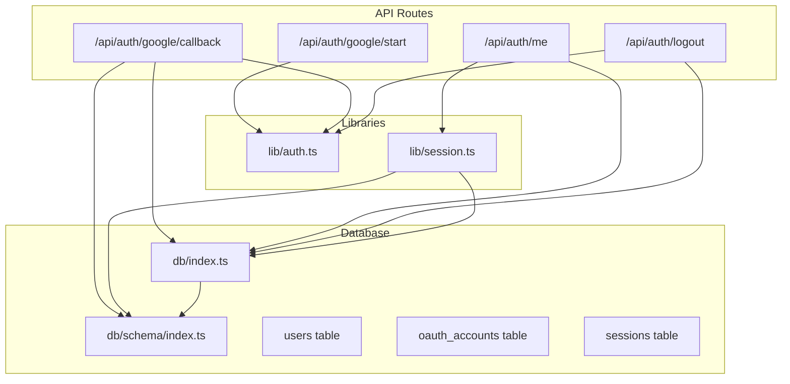
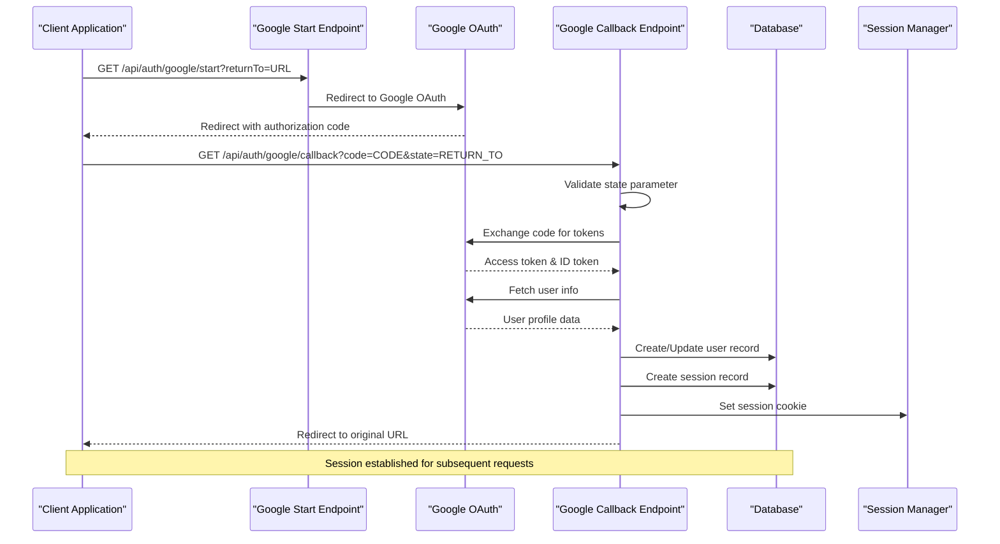
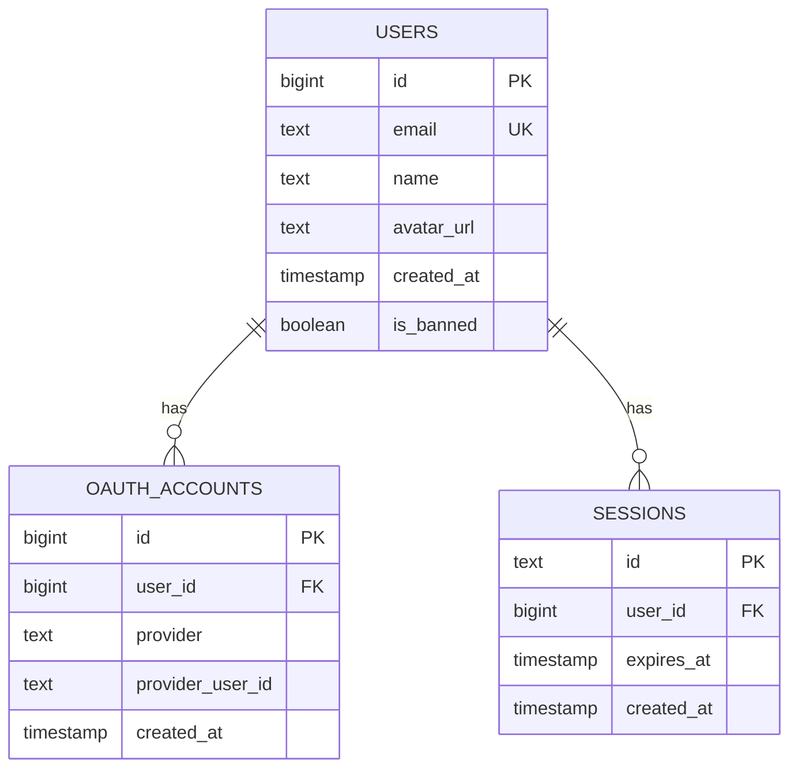
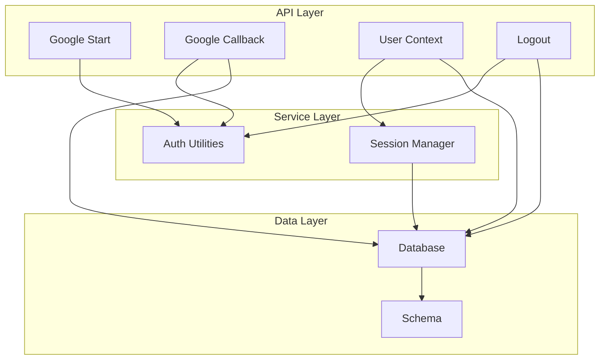
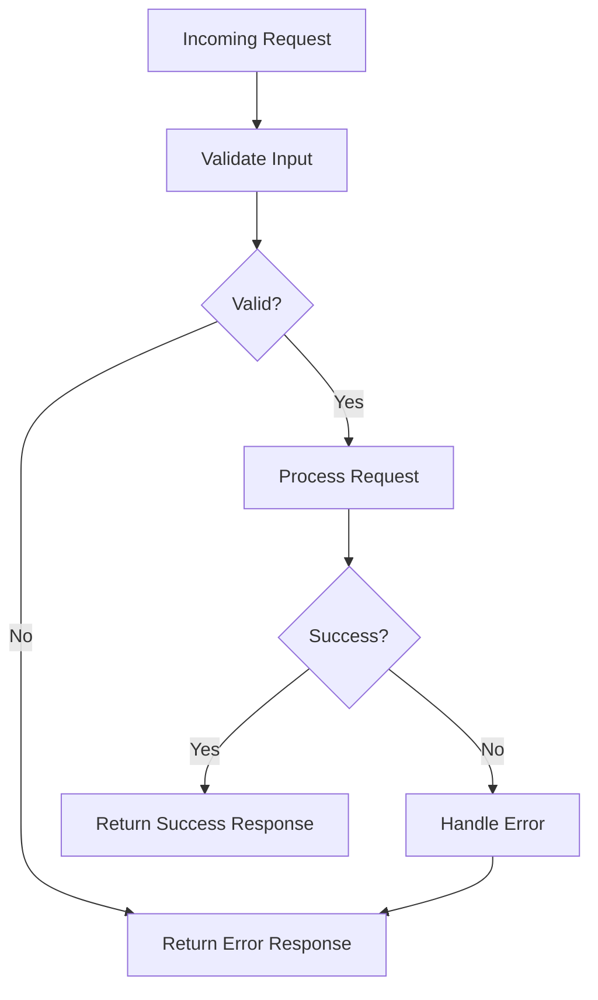

# Authentication API

<cite>
**Referenced Files in This Document**
- [start.ts](file://src/pages/api/auth/google/start.ts)
- [callback.ts](file://src/pages/api/auth/google/callback.ts)
- [me.ts](file://src/pages/api/auth/me.ts)
- [logout.ts](file://src/pages/api/auth/logout.ts)
- [auth.ts](file://src/lib/auth.ts)
- [session.ts](file://src/lib/session.ts)
- [db/index.ts](file://src/db/index.ts)
- [db/schema/index.ts](file://src/db/schema/index.ts)
- [.env.example](file://.env.example)
</cite>

## Table of Contents
1. [Introduction](#introduction)
2. [Project Structure](#project-structure)
3. [Core Components](#core-components)
4. [Architecture Overview](#architecture-overview)
5. [Detailed Component Analysis](#detailed-component-analysis)
6. [Dependency Analysis](#dependency-analysis)
7. [Performance Considerations](#performance-considerations)
8. [Troubleshooting Guide](#troubleshooting-guide)
9. [Conclusion](#conclusion)

## Introduction
This document provides comprehensive API documentation for the authentication system endpoints. It covers the Google OAuth flow, user context retrieval, and logout functionality. The documentation includes endpoint specifications, request/response formats, authentication requirements, security considerations, and practical integration guidelines for client applications.

## Project Structure
The authentication system is organized into API routes and shared libraries:



**Diagram sources**
- [start.ts](file://src/pages/api/auth/google/start.ts#L1-L15)
- [callback.ts](file://src/pages/api/auth/google/callback.ts#L1-L114)
- [me.ts](file://src/pages/api/auth/me.ts#L1-L30)
- [logout.ts](file://src/pages/api/auth/logout.ts#L1-L23)
- [auth.ts](file://src/lib/auth.ts#L1-L101)
- [session.ts](file://src/lib/session.ts#L1-L58)
- [db/index.ts](file://src/db/index.ts#L1-L37)
- [db/schema/index.ts](file://src/db/schema/index.ts#L1-L104)

**Section sources**
- [start.ts](file://src/pages/api/auth/google/start.ts#L1-L15)
- [callback.ts](file://src/pages/api/auth/google/callback.ts#L1-L114)
- [me.ts](file://src/pages/api/auth/me.ts#L1-L30)
- [logout.ts](file://src/pages/api/auth/logout.ts#L1-L23)
- [auth.ts](file://src/lib/auth.ts#L1-L101)
- [session.ts](file://src/lib/session.ts#L1-L58)
- [db/index.ts](file://src/db/index.ts#L1-L37)
- [db/schema/index.ts](file://src/db/schema/index.ts#L1-L104)

## Core Components
The authentication system consists of four primary endpoints:

### Google OAuth Endpoints
- **Authorization Start**: `/api/auth/google/start`
- **Authorization Callback**: `/api/auth/google/callback`

### User Management Endpoints
- **User Context**: `/api/auth/me`
- **Logout**: `/api/auth/logout`

### Shared Authentication Utilities
- Session management and cookie handling
- Google OAuth token exchange and user info retrieval
- Database session validation

**Section sources**
- [start.ts](file://src/pages/api/auth/google/start.ts#L1-L15)
- [callback.ts](file://src/pages/api/auth/google/callback.ts#L1-L114)
- [me.ts](file://src/pages/api/auth/me.ts#L1-L30)
- [logout.ts](file://src/pages/api/auth/logout.ts#L1-L23)
- [auth.ts](file://src/lib/auth.ts#L1-L101)
- [session.ts](file://src/lib/session.ts#L1-L58)

## Architecture Overview
The authentication system follows a client-server architecture with Google OAuth integration:



**Diagram sources**
- [start.ts](file://src/pages/api/auth/google/start.ts#L4-L14)
- [callback.ts](file://src/pages/api/auth/google/callback.ts#L12-L113)
- [auth.ts](file://src/lib/auth.ts#L41-L95)

## Detailed Component Analysis

### Google OAuth Authorization Start Endpoint
**Endpoint**: `GET /api/auth/google/start`
**Purpose**: Initiates the Google OAuth authorization flow

#### Request Parameters
- `returnTo` (optional): URL to redirect back to after authentication completion
  - Default: `/` (home page)
  - Must be URL-encoded when passed as a query parameter

#### Response Behavior
- **Success**: 302 Redirect to Google OAuth authorization URL
- **Failure**: 302 Redirect to `returnTo` with error parameter
  - Error parameters: `auth_failed`

#### Implementation Details
The endpoint generates a Google OAuth authorization URL with the following parameters:
- Client ID from environment configuration
- Redirect URI pointing to the callback endpoint
- Scope: `openid email profile`
- Response type: `code`
- State parameter containing the return URL
- Prompt: `select_account` for user selection

**Section sources**
- [start.ts](file://src/pages/api/auth/google/start.ts#L4-L14)
- [auth.ts](file://src/lib/auth.ts#L41-L57)

### Google OAuth Callback Endpoint
**Endpoint**: `GET /api/auth/google/callback`
**Purpose**: Handles OAuth callback and completes user authentication

#### Request Parameters
- `code` (required): Authorization code from Google OAuth
- `state` (required): URL-encoded returnTo parameter from authorization request
- `error` (optional): Error message from Google OAuth

#### Response Behavior
- **Success**: 302 Redirect to original URL with successful authentication
- **Validation Failure**: 302 Redirect with error parameter (`no_code`)
- **OAuth Error**: 302 Redirect with error parameter (`oauth_denied`)
- **System Error**: 302 Redirect with error parameter (`auth_failed`)

#### Authentication Flow Processing
1. **State Validation**: Decodes and validates the state parameter
2. **Code Exchange**: Exchanges authorization code for access tokens
3. **User Information**: Retrieves user profile from Google
4. **User Management**: Creates or updates user record in database
5. **Session Creation**: Generates session record and sets session cookie
6. **Security Checks**: Validates user is not banned

#### Security Features
- **State Parameter**: Prevents CSRF attacks by validating return URL
- **Token Validation**: Verifies Google OAuth responses
- **Session Management**: Uses secure, HTTP-only cookies
- **User Verification**: Ensures user is not banned

**Section sources**
- [callback.ts](file://src/pages/api/auth/google/callback.ts#L12-L113)
- [auth.ts](file://src/lib/auth.ts#L59-L95)

### User Context Endpoint
**Endpoint**: `GET /api/auth/me`
**Purpose**: Retrieves currently authenticated user information

#### Request Parameters
- No query parameters required
- Requires valid session cookie

#### Response Format
JSON response with user object:
```json
{
  "user": {
    "id": 1,
    "email": "user@example.com",
    "name": "John Doe",
    "avatarUrl": "https://example.com/avatar.jpg",
    "isAdmin": false
  }
}
```

#### Response Behavior
- **Authenticated User**: Returns user object with 200 status
- **Unauthenticated**: Returns `{ user: null }` with 200 status
- **Database Not Configured**: Returns `{ user: null }` with 200 status

#### Implementation Details
The endpoint validates the session cookie against the database and returns user information including administrative privileges.

**Section sources**
- [me.ts](file://src/pages/api/auth/me.ts#L6-L29)
- [session.ts](file://src/lib/session.ts#L13-L54)

### Logout Endpoint
**Endpoint**: `POST /api/auth/logout`
**Purpose**: Terminates user session and clears authentication state

#### Request Parameters
- No request body required
- Requires valid session cookie

#### Response Behavior
- **Success**: 302 Redirect to referring page or home
- **No Session**: Still redirects to return URL (idempotent operation)

#### Implementation Details
The endpoint performs cleanup operations:
1. Deletes session record from database
2. Removes session cookie from browser
3. Redirects to appropriate return URL

**Section sources**
- [logout.ts](file://src/pages/api/auth/logout.ts#L6-L22)
- [auth.ts](file://src/lib/auth.ts#L29-L31)

## Dependency Analysis

### Database Schema Relationships


**Diagram sources**
- [db/schema/index.ts](file://src/db/schema/index.ts#L4-L33)

### Component Dependencies


**Diagram sources**
- [start.ts](file://src/pages/api/auth/google/start.ts#L1-L2)
- [callback.ts](file://src/pages/api/auth/google/callback.ts#L2-L10)
- [me.ts](file://src/pages/api/auth/me.ts#L2)
- [logout.ts](file://src/pages/api/auth/logout.ts#L4)
- [auth.ts](file://src/lib/auth.ts#L1-L3)
- [session.ts](file://src/lib/session.ts#L1-L3)
- [db/index.ts](file://src/db/index.ts#L1-L3)

**Section sources**
- [db/schema/index.ts](file://src/db/schema/index.ts#L1-L104)
- [auth.ts](file://src/lib/auth.ts#L1-L101)
- [session.ts](file://src/lib/session.ts#L1-L58)

## Performance Considerations
- **Session Duration**: 30-day session lifetime balances security and user experience
- **Database Indexes**: Proper indexing on user_id and expiration fields for efficient session validation
- **Connection Pooling**: Database connections configured with reasonable limits (max 10 connections)
- **Cookie Size**: Minimal session cookie size reduces network overhead
- **Caching Opportunities**: Consider caching frequently accessed user data for high-traffic scenarios

## Troubleshooting Guide

### Common Authentication Issues

#### OAuth Flow Problems
- **Authorization Fails**: Check Google OAuth credentials and redirect URI configuration
- **Callback Errors**: Verify state parameter handling and URL encoding
- **Token Exchange Failures**: Confirm client credentials and network connectivity

#### Session Management Issues
- **Login Persistence**: Verify cookie domain and path configuration
- **Session Expiration**: Check database timezone settings and clock synchronization
- **Concurrent Sessions**: Consider implementing session invalidation on new login

#### Database Connectivity
- **Connection Failures**: Verify DATABASE_URL environment variable and PostgreSQL availability
- **Schema Mismatch**: Ensure database schema matches expected table structure
- **Migration Issues**: Run database migrations if schema appears outdated

### Error Handling Patterns
The system implements consistent error handling across all endpoints:



**Diagram sources**
- [callback.ts](file://src/pages/api/auth/google/callback.ts#L19-L26)
- [me.ts](file://src/pages/api/auth/me.ts#L22-L28)

**Section sources**
- [callback.ts](file://src/pages/api/auth/google/callback.ts#L19-L26)
- [me.ts](file://src/pages/api/auth/me.ts#L22-L28)
- [logout.ts](file://src/pages/api/auth/logout.ts#L6-L22)

## Conclusion
The authentication system provides a robust, secure, and scalable solution for user authentication using Google OAuth. The implementation includes proper state management, session handling, and security considerations. The modular architecture allows for easy maintenance and extension while maintaining clean separation of concerns between API endpoints, business logic, and data persistence.

Key strengths of the implementation include:
- Comprehensive error handling and validation
- Secure session management with proper cookie attributes
- Flexible return URL handling for post-authentication navigation
- Extensible database schema supporting future authentication providers
- Clean separation of authentication logic into reusable utilities

The system is production-ready with appropriate security measures and provides a solid foundation for user authentication needs.