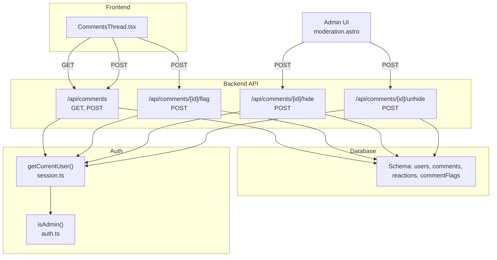
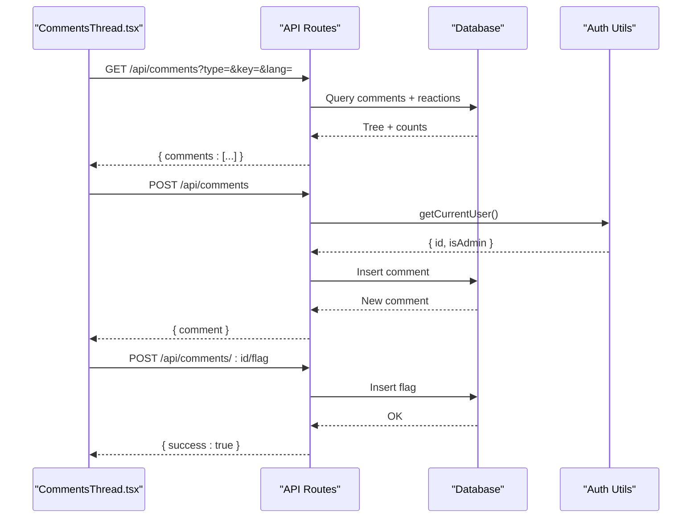
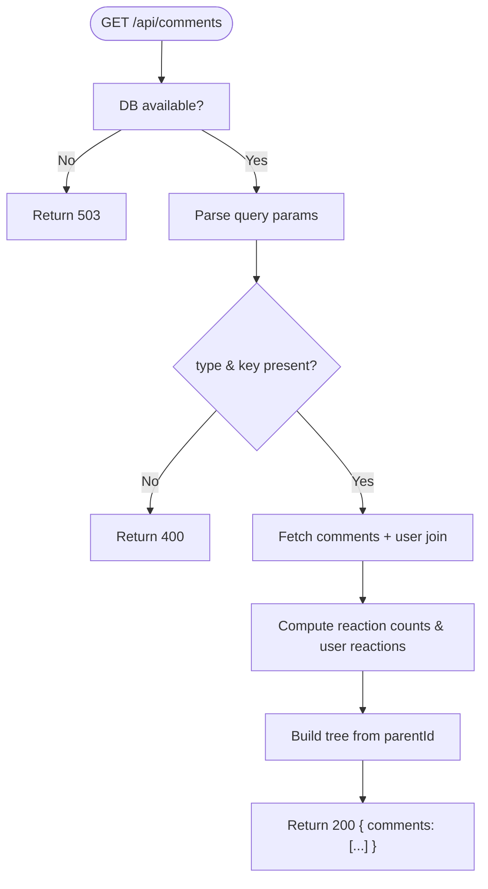
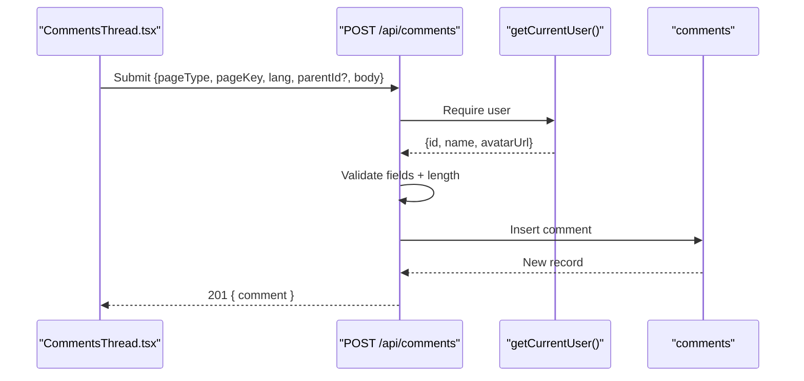
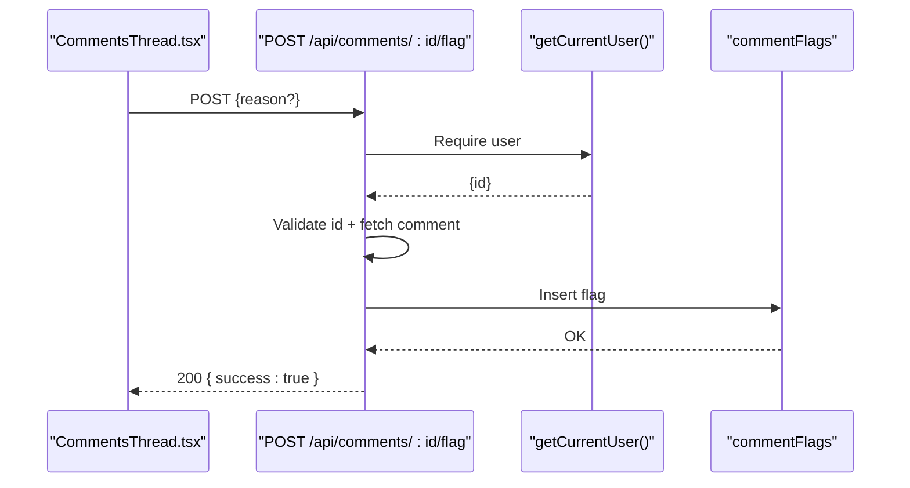
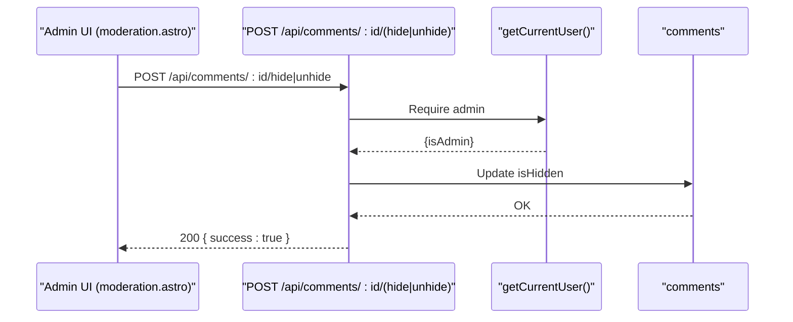
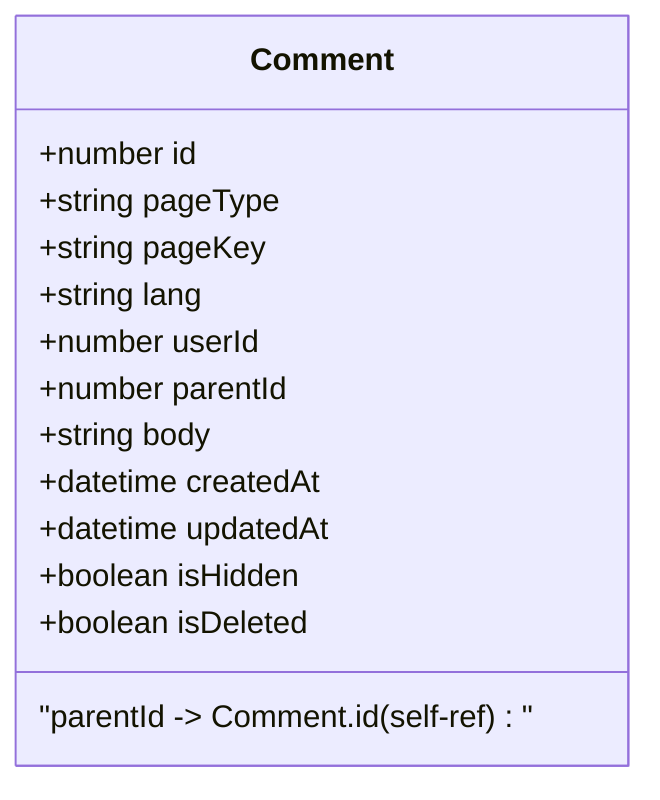
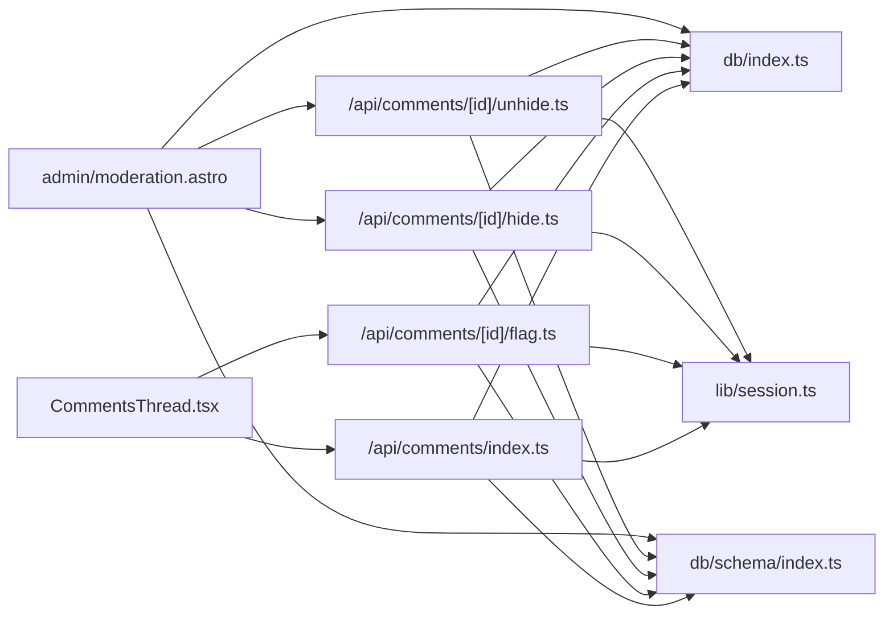

# Comment API

<cite>
**Referenced Files in This Document**
- [index.ts](file://src/pages/api/comments/index.ts)
- [flag.ts](file://src/pages/api/comments/[id]/flag.ts)
- [hide.ts](file://src/pages/api/comments/[id]/hide.ts)
- [unhide.ts](file://src/pages/api/comments/[id]/unhide.ts)
- [CommentsThread.tsx](file://src/components/CommentsThread.tsx)
- [index.ts](file://src/db/schema/index.ts)
- [index.ts](file://src/db/index.ts)
- [session.ts](file://src/lib/session.ts)
- [auth.ts](file://src/lib/auth.ts)
- [moderation.astro](file://src/pages/admin/moderation.astro)
- [rodion-qoder-start-project.md](file://documentation/rodion-qoder-start-project.md)
</cite>

## Table of Contents
1. [Introduction](#introduction)
2. [Project Structure](#project-structure)
3. [Core Components](#core-components)
4. [Architecture Overview](#architecture-overview)
5. [Detailed Component Analysis](#detailed-component-analysis)
6. [Dependency Analysis](#dependency-analysis)
7. [Performance Considerations](#performance-considerations)
8. [Troubleshooting Guide](#troubleshooting-guide)
9. [Conclusion](#conclusion)
10. [Appendices](#appendices)

## Introduction
This document provides comprehensive API documentation for the comment system endpoints. It covers:
- Comment creation
- Comment flagging
- Administrative moderation (hide/unhide)
- Threading and hierarchical replies
- Authentication and authorization
- Validation rules and error handling
- Frontend-backend integration
- Rate limiting, spam prevention, and content filtering strategies

## Project Structure
The comment system spans backend API routes, database schema, authentication utilities, and a React-based frontend component that renders nested comments and handles submissions.

**Diagram sources**
- [index.ts](file://src/pages/api/comments/index.ts#L6-L163)
- [flag.ts](file://src/pages/api/comments/[id]/flag.ts#L7-L59)
- [hide.ts](file://src/pages/api/comments/[id]/hide.ts#L7-L41)
- [unhide.ts](file://src/pages/api/comments/[id]/unhide.ts#L7-L41)
- [CommentsThread.tsx](file://src/components/CommentsThread.tsx#L148-L365)
- [index.ts](file://src/db/schema/index.ts#L36-L77)
- [session.ts](file://src/lib/session.ts#L13-L54)
- [auth.ts](file://src/lib/auth.ts#L97-L100)
- [moderation.astro](file://src/pages/admin/moderation.astro#L1-L195)

**Section sources**
- [index.ts](file://src/pages/api/comments/index.ts#L1-L240)
- [flag.ts](file://src/pages/api/comments/[id]/flag.ts#L1-L60)
- [hide.ts](file://src/pages/api/comments/[id]/hide.ts#L1-L42)
- [unhide.ts](file://src/pages/api/comments/[id]/unhide.ts#L1-L42)
- [CommentsThread.tsx](file://src/components/CommentsThread.tsx#L1-L366)
- [index.ts](file://src/db/schema/index.ts#L1-L104)
- [session.ts](file://src/lib/session.ts#L1-L58)
- [auth.ts](file://src/lib/auth.ts#L1-L101)
- [moderation.astro](file://src/pages/admin/moderation.astro#L1-L195)

## Core Components
- Backend API routes for comments and moderation
- Frontend CommentsThread component for rendering and submitting comments
- Database schema supporting comments, reactions, flags, and users
- Authentication and admin gating utilities

**Section sources**
- [index.ts](file://src/pages/api/comments/index.ts#L1-L240)
- [flag.ts](file://src/pages/api/comments/[id]/flag.ts#L1-L60)
- [hide.ts](file://src/pages/api/comments/[id]/hide.ts#L1-L42)
- [unhide.ts](file://src/pages/api/comments/[id]/unhide.ts#L1-L42)
- [CommentsThread.tsx](file://src/components/CommentsThread.tsx#L1-L366)
- [index.ts](file://src/db/schema/index.ts#L36-L77)
- [session.ts](file://src/lib/session.ts#L1-L58)
- [auth.ts](file://src/lib/auth.ts#L97-L100)

## Architecture Overview
The comment system is a layered architecture:
- Presentation: React component renders comments and handles user actions
- API: Astro API routes implement endpoints for listing, creating, flagging, and moderation
- Persistence: PostgreSQL via Drizzle ORM
- Identity: Session-based authentication with admin gating

**Diagram sources**
- [CommentsThread.tsx](file://src/components/CommentsThread.tsx#L177-L281)
- [index.ts](file://src/pages/api/comments/index.ts#L6-L163)
- [flag.ts](file://src/pages/api/comments/[id]/flag.ts#L7-L59)
- [index.ts](file://src/db/schema/index.ts#L36-L77)
- [session.ts](file://src/lib/session.ts#L13-L54)

## Detailed Component Analysis

### Comment Listing Endpoint
- Method: GET
- URL: /api/comments
- Query parameters:
  - type: Page type identifier (required)
  - key: Page key (required)
  - lang: Language code (required; defaults to ru if omitted)
- Authentication: Optional for listing; user context affects reaction state
- Response: Root-level comments as a tree with nested replies
- Validation:
  - Returns 400 if type or key missing
  - Returns 503 if DB not configured
- Behavior:
  - Joins with users to include author info
  - Computes reaction counts and current user’s reactions
  - Builds a tree from flat rows using parentId

**Diagram sources**
- [index.ts](file://src/pages/api/comments/index.ts#L6-L163)

**Section sources**
- [index.ts](file://src/pages/api/comments/index.ts#L6-L163)

### Comment Creation Endpoint
- Method: POST
- URL: /api/comments
- Request body:
  - pageType: string (required)
  - pageKey: string (required)
  - lang: string (required)
  - parentId: number | null (optional)
  - body: string (required; max length enforced)
- Authentication: Required (401 if not authenticated)
- Validation:
  - Missing fields → 400
  - Body length > 5000 → 400
  - DB not configured → 503
- Response: Created comment with minimal metadata and empty reaction state

**Diagram sources**
- [index.ts](file://src/pages/api/comments/index.ts#L165-L240)
- [CommentsThread.tsx](file://src/components/CommentsThread.tsx#L208-L281)

**Section sources**
- [index.ts](file://src/pages/api/comments/index.ts#L165-L240)
- [CommentsThread.tsx](file://src/components/CommentsThread.tsx#L208-L281)

### Comment Flagging Endpoint
- Method: POST
- URL: /api/comments/[id]/flag
- Request body:
  - reason: string | null (optional)
- Authentication: Required (401 if not authenticated)
- Validation:
  - Invalid id → 400
  - Comment not found → 404
  - DB not configured → 503
- Behavior: Inserts a flag record linking the comment and user

**Diagram sources**
- [flag.ts](file://src/pages/api/comments/[id]/flag.ts#L7-L59)
- [CommentsThread.tsx](file://src/components/CommentsThread.tsx#L101-L114)

**Section sources**
- [flag.ts](file://src/pages/api/comments/[id]/flag.ts#L1-L60)
- [CommentsThread.tsx](file://src/components/CommentsThread.tsx#L101-L114)

### Moderation Endpoints
- Hide comment (admin only)
  - Method: POST
  - URL: /api/comments/[id]/hide
  - Authentication: Admin required (403 otherwise)
  - Validation: Invalid id → 400; DB not configured → 503
  - Behavior: Sets isHidden = true
- Unhide comment (admin only)
  - Method: POST
  - URL: /api/comments/[id]/unhide
  - Authentication: Admin required (403 otherwise)
  - Validation: Invalid id → 400; DB not configured → 503
  - Behavior: Sets isHidden = false

**Diagram sources**
- [hide.ts](file://src/pages/api/comments/[id]/hide.ts#L7-L41)
- [unhide.ts](file://src/pages/api/comments/[id]/unhide.ts#L7-L41)
- [moderation.astro](file://src/pages/admin/moderation.astro#L169-L194)

**Section sources**
- [hide.ts](file://src/pages/api/comments/[id]/hide.ts#L1-L42)
- [unhide.ts](file://src/pages/api/comments/[id]/unhide.ts#L1-L42)
- [moderation.astro](file://src/pages/admin/moderation.astro#L1-L195)

### Comment Threading and Hierarchical Replies
- Data model supports parent-child relationships via parentId
- Backend builds a tree from flat rows during listing
- Frontend renders nested comments with indentation and reply toggles
- Drafts are persisted in localStorage keyed by pageType and pageKey

**Diagram sources**
- [index.ts](file://src/db/schema/index.ts#L36-L51)
- [index.ts](file://src/pages/api/comments/index.ts#L113-L150)
- [CommentsThread.tsx](file://src/components/CommentsThread.tsx#L148-L365)

**Section sources**
- [index.ts](file://src/db/schema/index.ts#L36-L51)
- [index.ts](file://src/pages/api/comments/index.ts#L113-L150)
- [CommentsThread.tsx](file://src/components/CommentsThread.tsx#L148-L365)

### Real-time Update Mechanisms
- Listing endpoint returns a fresh tree on each fetch
- Frontend updates the UI immediately after successful POST to /api/comments
- Admin actions trigger a reload of the moderation page
- No WebSocket or server-sent events are implemented in the current codebase

**Section sources**
- [CommentsThread.tsx](file://src/components/CommentsThread.tsx#L177-L281)
- [moderation.astro](file://src/pages/admin/moderation.astro#L169-L194)

### Authentication and Authorization
- Session-based authentication with HttpOnly cookies
- getCurrentUser validates session and bans
- isAdmin checks admin emails from environment
- Moderation endpoints enforce admin-only access

**Section sources**
- [session.ts](file://src/lib/session.ts#L13-L54)
- [auth.ts](file://src/lib/auth.ts#L97-L100)
- [hide.ts](file://src/pages/api/comments/[id]/hide.ts#L11-L15)
- [unhide.ts](file://src/pages/api/comments/[id]/unhide.ts#L11-L15)

### Validation Rules
- Required fields for POST /api/comments: pageType, pageKey, lang, body
- Body length capped at 5000 characters
- Missing type/key for GET /api/comments → 400
- Invalid comment id → 400
- Not found comment for flag → 404
- Unauthorized for protected actions → 401
- Forbidden for admin-only actions → 403
- DB not configured → 503

**Section sources**
- [index.ts](file://src/pages/api/comments/index.ts#L183-L198)
- [index.ts](file://src/pages/api/comments/index.ts#L19-L24)
- [flag.ts](file://src/pages/api/comments/[id]/flag.ts#L18-L39)
- [hide.ts](file://src/pages/api/comments/[id]/hide.ts#L18-L24)
- [unhide.ts](file://src/pages/api/comments/[id]/unhide.ts#L18-L24)

### Examples

- Example: Submitting a comment
  - Endpoint: POST /api/comments
  - Request body keys: pageType, pageKey, lang, parentId?, body
  - Expected response: 201 with comment object
  - Frontend behavior: Saves draft, redirects to OAuth if unauthenticated, then auto-submits

- Example: Flagging a comment
  - Endpoint: POST /api/comments/:id/flag
  - Request body: reason (optional)
  - Expected response: 200 { success: true }

- Example: Hiding a comment (admin)
  - Endpoint: POST /api/comments/:id/hide
  - Expected response: 200 { success: true }
  - Admin UI: Click “Hide” button on moderation page

- Example: Unhiding a comment (admin)
  - Endpoint: POST /api/comments/:id/unhide
  - Expected response: 200 { success: true }

**Section sources**
- [index.ts](file://src/pages/api/comments/index.ts#L165-L240)
- [flag.ts](file://src/pages/api/comments/[id]/flag.ts#L7-L59)
- [hide.ts](file://src/pages/api/comments/[id]/hide.ts#L7-L41)
- [unhide.ts](file://src/pages/api/comments/[id]/unhide.ts#L7-L41)
- [CommentsThread.tsx](file://src/components/CommentsThread.tsx#L208-L281)
- [moderation.astro](file://src/pages/admin/moderation.astro#L169-L194)

### Error Handling Scenarios
- Missing required fields: 400
- Unauthorized: 401
- Forbidden (admin only): 403
- Not found: 404
- Database not configured: 503
- Internal errors: 500

**Section sources**
- [index.ts](file://src/pages/api/comments/index.ts#L19-L24)
- [index.ts](file://src/pages/api/comments/index.ts#L176-L181)
- [flag.ts](file://src/pages/api/comments/[id]/flag.ts#L11-L16)
- [hide.ts](file://src/pages/api/comments/[id]/hide.ts#L11-L15)
- [unhide.ts](file://src/pages/api/comments/[id]/unhide.ts#L11-L15)

### Rate Limiting, Spam Prevention, and Content Filtering
- MVP strategies documented:
  - Rate limit on POST endpoints (in-memory, IP-key)
  - Optional Cloudflare Turnstile integration (site key/secret)
- Implementation notes:
  - Turnstile environment variables are declared
  - No explicit Turnstile validation is present in the current endpoints
  - No explicit rate limiter is implemented in the current codebase

Recommendations:
- Integrate Turnstile verification on comment creation
- Add rate limiting middleware for POST /api/comments
- Consider soft deletion and moderation queues for spam handling

**Section sources**
- [rodion-qoder-start-project.md](file://documentation/rodion-qoder-start-project.md#L283-L295)
- [index.ts](file://src/env.d.ts#L11-L12)

## Dependency Analysis
- API routes depend on:
  - Database utilities (hasDb, requireDb)
  - Drizzle ORM schema
  - Session utilities for authentication
- Frontend depends on:
  - Astro fetch for API calls
  - LocalStorage for drafts
- Admin moderation page depends on:
  - Database queries for flagged comments and recent comments
  - API routes for hide/unhide actions

**Diagram sources**
- [index.ts](file://src/pages/api/comments/index.ts#L1-L240)
- [flag.ts](file://src/pages/api/comments/[id]/flag.ts#L1-L60)
- [hide.ts](file://src/pages/api/comments/[id]/hide.ts#L1-L42)
- [unhide.ts](file://src/pages/api/comments/[id]/unhide.ts#L1-L42)
- [CommentsThread.tsx](file://src/components/CommentsThread.tsx#L1-L366)
- [moderation.astro](file://src/pages/admin/moderation.astro#L1-L195)
- [index.ts](file://src/db/index.ts#L1-L37)
- [index.ts](file://src/db/schema/index.ts#L1-L104)
- [session.ts](file://src/lib/session.ts#L1-L58)

**Section sources**
- [index.ts](file://src/pages/api/comments/index.ts#L1-L240)
- [flag.ts](file://src/pages/api/comments/[id]/flag.ts#L1-L60)
- [hide.ts](file://src/pages/api/comments/[id]/hide.ts#L1-L42)
- [unhide.ts](file://src/pages/api/comments/[id]/unhide.ts#L1-L42)
- [CommentsThread.tsx](file://src/components/CommentsThread.tsx#L1-L366)
- [moderation.astro](file://src/pages/admin/moderation.astro#L1-L195)
- [index.ts](file://src/db/index.ts#L1-L37)
- [index.ts](file://src/db/schema/index.ts#L1-L104)
- [session.ts](file://src/lib/session.ts#L1-L58)

## Performance Considerations
- Indexes on comments and reactions optimize lookups
- Single-pass aggregation for reaction counts
- Tree building is O(n) over comment count
- Recommendations:
  - Paginate listings for very large threads
  - Cache comment trees per page/lang
  - Consider lazy-loading replies beyond a threshold

**Section sources**
- [index.ts](file://src/db/schema/index.ts#L49-L77)
- [index.ts](file://src/pages/api/comments/index.ts#L58-L111)
- [index.ts](file://src/pages/api/comments/index.ts#L113-L150)

## Troubleshooting Guide
- Comments temporarily unavailable:
  - Backend DB not configured → 503
  - Frontend displays user-friendly message
- Authentication prompts:
  - Submitting requires login → redirected to OAuth start
  - Draft preserved in localStorage
- Flagging:
  - Ensure user is authenticated
  - Verify comment exists before flagging
- Moderation:
  - Admin-only endpoints require admin email in environment
  - Use moderation page to hide/unhide comments

**Section sources**
- [index.ts](file://src/pages/api/comments/index.ts#L7-L12)
- [CommentsThread.tsx](file://src/components/CommentsThread.tsx#L234-L246)
- [flag.ts](file://src/pages/api/comments/[id]/flag.ts#L34-L39)
- [hide.ts](file://src/pages/api/comments/[id]/hide.ts#L11-L15)
- [auth.ts](file://src/lib/auth.ts#L97-L100)

## Conclusion
The comment system provides a robust foundation for threaded discussions with authentication, reactions, and moderation. The API is straightforward, the frontend integrates seamlessly, and the schema supports scalability. Enhancements such as Turnstile integration, rate limiting, and pagination would further strengthen the system against abuse and improve performance.

## Appendices

### API Reference Summary

- GET /api/comments
  - Params: type, key, lang
  - Auth: Optional
  - Response: { comments: [...] }

- POST /api/comments
  - Body: { pageType, pageKey, lang, parentId?, body }
  - Auth: Required
  - Response: { comment }

- POST /api/comments/[id]/flag
  - Body: { reason? }
  - Auth: Required
  - Response: { success: true }

- POST /api/comments/[id]/hide
  - Auth: Admin only
  - Response: { success: true }

- POST /api/comments/[id]/unhide
  - Auth: Admin only
  - Response: { success: true }

**Section sources**
- [index.ts](file://src/pages/api/comments/index.ts#L6-L163)
- [index.ts](file://src/pages/api/comments/index.ts#L165-L240)
- [flag.ts](file://src/pages/api/comments/[id]/flag.ts#L7-L59)
- [hide.ts](file://src/pages/api/comments/[id]/hide.ts#L7-L41)
- [unhide.ts](file://src/pages/api/comments/[id]/unhide.ts#L7-L41)