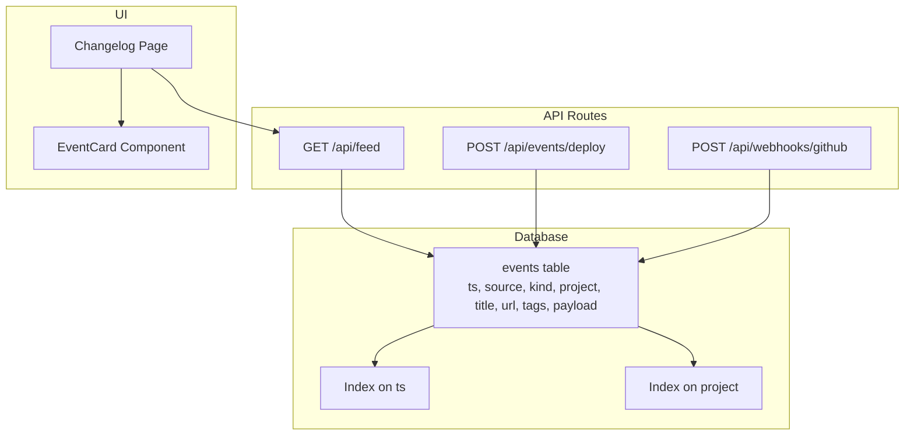
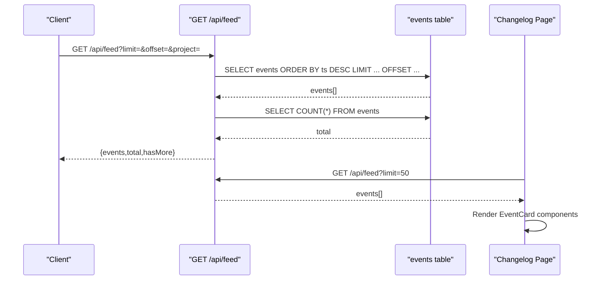
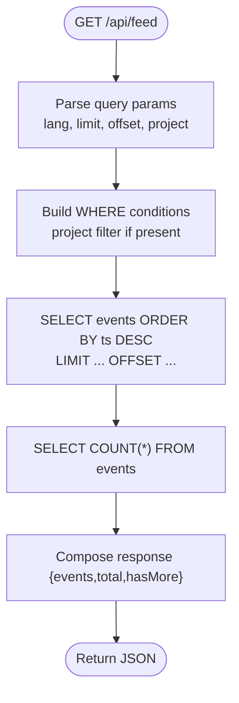
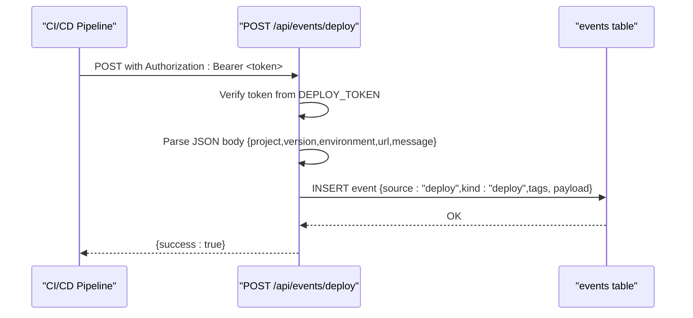
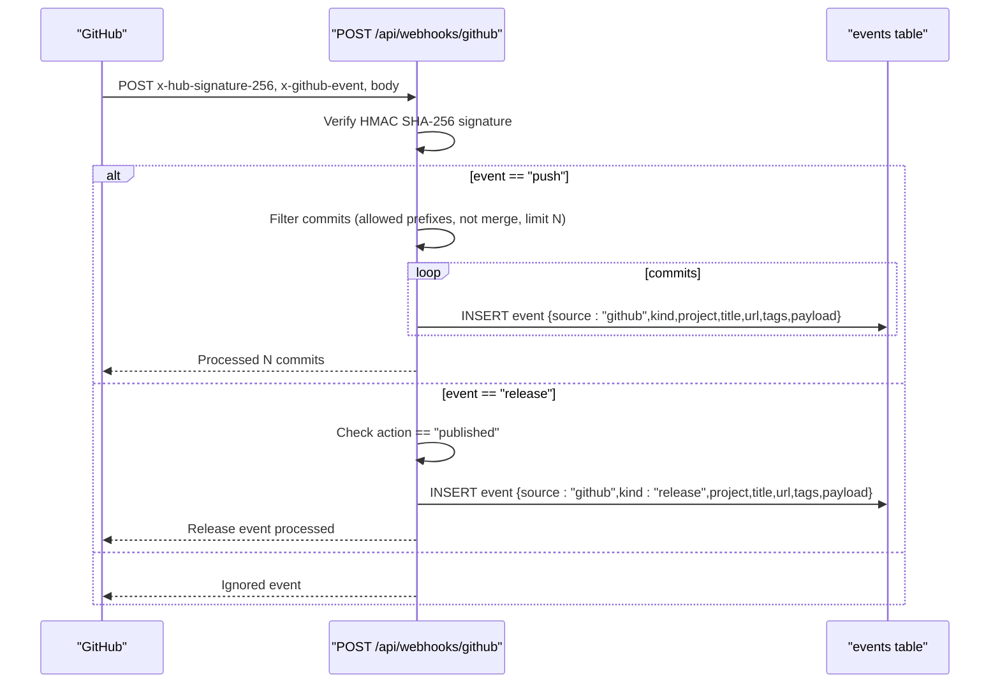
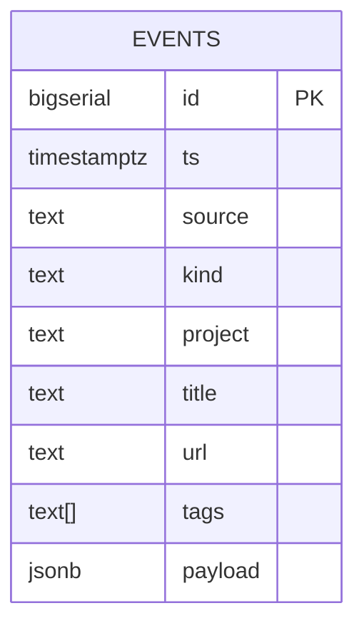
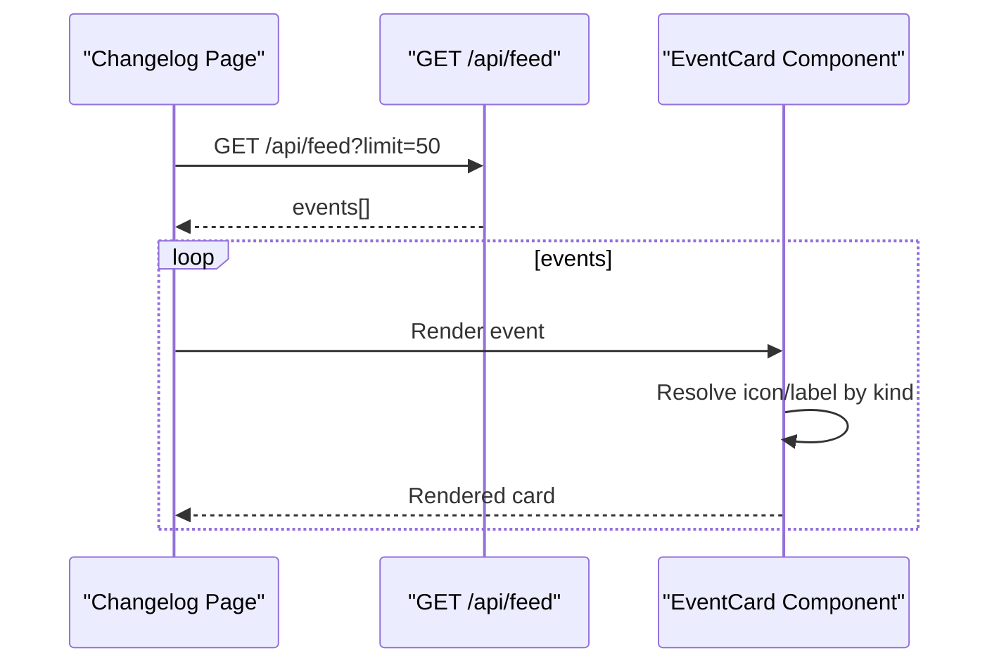
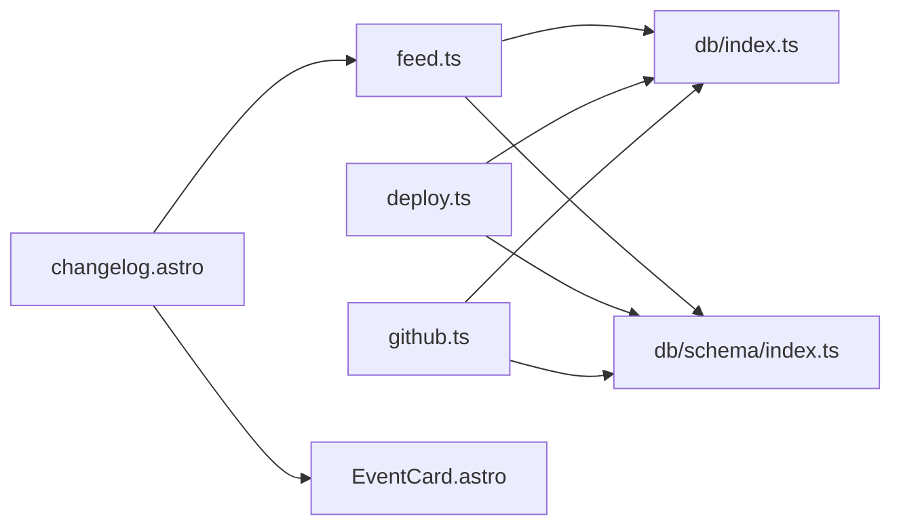

# Event & Feed API

<cite>
**Referenced Files in This Document**
- [feed.ts](file://src/pages/api/feed.ts)
- [deploy.ts](file://src/pages/api/events/deploy.ts)
- [github.ts](file://src/pages/api/webhooks/github.ts)
- [index.ts](file://src/db/schema/index.ts)
- [index.ts](file://src/db/index.ts)
- [.env.example](file://.env.example)
- [README.md](file://README.md)
- [EventCard.astro](file://src/components/EventCard.astro)
- [changelog.astro (en)](file://src/pages/en/changelog.astro)
- [changelog.astro (ru)](file://src/pages/ru/changelog.astro)
</cite>

## Table of Contents
1. [Introduction](#introduction)
2. [Project Structure](#project-structure)
3. [Core Components](#core-components)
4. [Architecture Overview](#architecture-overview)
5. [Detailed Component Analysis](#detailed-component-analysis)
6. [Dependency Analysis](#dependency-analysis)
7. [Performance Considerations](#performance-considerations)
8. [Troubleshooting Guide](#troubleshooting-guide)
9. [Conclusion](#conclusion)
10. [Appendices](#appendices)

## Introduction
This document provides comprehensive API documentation for the event and feed system endpoints. It covers:
- The event feed endpoint for retrieving chronological events
- The deploy event endpoint for deployment notifications
- GitHub webhook integration for automated changelog creation from repository activities
- Event data structures, timestamps, categorization, and pagination
- Real-time update mechanisms and integration with notification systems
- Caching strategies, performance optimization for large event histories, and event deduplication
- Practical examples for feed consumption and event filtering

## Project Structure
The event and feed system is implemented as a set of Astro API routes backed by a PostgreSQL database via Drizzle ORM. The key components are:
- Event storage schema with indexes for efficient querying
- Feed retrieval endpoint with pagination and filtering
- Deploy event ingestion endpoint with token-based authentication
- GitHub webhook handler for push and release events with signature verification
- UI components rendering events in the changelog

**Diagram sources**
- [feed.ts](file://src/pages/api/feed.ts#L1-L46)
- [deploy.ts](file://src/pages/api/events/deploy.ts#L1-L52)
- [github.ts](file://src/pages/api/webhooks/github.ts#L1-L134)
- [index.ts](file://src/db/schema/index.ts#L79-L93)
- [changelog.astro (en)](file://src/pages/en/changelog.astro#L1-L46)
- [EventCard.astro](file://src/components/EventCard.astro#L1-L77)

**Section sources**
- [feed.ts](file://src/pages/api/feed.ts#L1-L46)
- [deploy.ts](file://src/pages/api/events/deploy.ts#L1-L52)
- [github.ts](file://src/pages/api/webhooks/github.ts#L1-L134)
- [index.ts](file://src/db/schema/index.ts#L79-L93)

## Core Components
- Event storage schema defines the events table with fields for timestamp, source, kind, project, title, URL, tags, and payload. Indexes on timestamp and project enable fast chronological retrieval and filtering.
- Feed endpoint retrieves paginated events ordered by timestamp descending, with optional project filtering and total count calculation.
- Deploy endpoint accepts a Bearer token and inserts a deploy event with structured payload and tags.
- GitHub webhook verifies HMAC signatures, filters commits, and inserts events for push and release actions.

**Section sources**
- [index.ts](file://src/db/schema/index.ts#L79-L93)
- [feed.ts](file://src/pages/api/feed.ts#L5-L38)
- [deploy.ts](file://src/pages/api/events/deploy.ts#L4-L47)
- [github.ts](file://src/pages/api/webhooks/github.ts#L47-L128)

## Architecture Overview
The system integrates external events (GitHub) and internal events (deployments) into a unified chronological feed. The feed is consumed by the changelog UI and can be integrated into notification systems.

**Diagram sources**
- [feed.ts](file://src/pages/api/feed.ts#L5-L38)
- [changelog.astro (en)](file://src/pages/en/changelog.astro#L15-L27)
- [EventCard.astro](file://src/components/EventCard.astro#L1-L77)

## Detailed Component Analysis

### Event Feed Endpoint
- Method: GET
- URL: /api/feed
- Query parameters:
  - lang: Language for UI labels (default: ru)
  - limit: Maximum number of events (min 1, max 100; default: 20)
  - offset: Pagination offset (default: 0)
  - project: Filter by project name (optional)
- Response schema:
  - events: Array of event objects
  - total: Total count matching filters
  - hasMore: Boolean indicating if more records exist
- Sorting: Descending by timestamp (most recent first)
- Filtering: Optional project equality filter
- Pagination: Standard limit/offset with hasMore indicator

**Diagram sources**
- [feed.ts](file://src/pages/api/feed.ts#L5-L38)

**Section sources**
- [feed.ts](file://src/pages/api/feed.ts#L5-L38)

### Deploy Event Endpoint
- Method: POST
- URL: /api/events/deploy
- Authentication: Bearer token from DEPLOY_TOKEN environment variable
- Request body fields:
  - project: Required
  - version: Optional
  - environment: Optional (defaults to production)
  - url: Optional
  - message: Optional (custom title; otherwise auto-generated)
- Behavior:
  - Validates token presence and header format
  - Inserts an event with source "deploy" and kind "deploy"
  - Sets tags ["deploy", environment]
  - Payload includes version and environment
- Response: JSON success indicator

**Diagram sources**
- [deploy.ts](file://src/pages/api/events/deploy.ts#L4-L47)
- [.env.example](file://.env.example#L10-L11)

**Section sources**
- [deploy.ts](file://src/pages/api/events/deploy.ts#L4-L47)
- [.env.example](file://.env.example#L10-L11)

### GitHub Webhook Endpoint
- Method: POST
- URL: /api/webhooks/github
- Authentication: HMAC SHA-256 signature verification using GITHUB_WEBHOOK_SECRET
- Supported GitHub events:
  - push: Processes allowed commit messages (feat:, fix:, perf:, refactor:, docs:) and releases non-main branches
  - release: Processes published releases
- Commit filtering:
  - Ignores merge commits
  - Limits to top N commits per push
  - Allowed prefixes enforced
- Inserted event fields:
  - source: "github"
  - kind: derived from commit message prefix or "release"
  - project: repository name
  - title: commit message or release title
  - url: commit or release URL
  - tags: kind and branch for push, kind and tag for release
  - payload: sha, author, branch for commits; tag, prerelease, draft for releases

**Diagram sources**
- [github.ts](file://src/pages/api/webhooks/github.ts#L47-L128)
- [.env.example](file://.env.example#L7-L8)

**Section sources**
- [github.ts](file://src/pages/api/webhooks/github.ts#L47-L128)
- [.env.example](file://.env.example#L7-L8)

### Event Data Structures
- Event fields:
  - id: Auto-incremented identifier
  - ts: Timestamp with timezone (indexed)
  - source: Origin ("github" or "deploy")
  - kind: Category ("commit", "feature", "fix", "performance", "refactor", "docs", "release", "deploy")
  - project: Repository or project name
  - title: Human-readable title
  - url: Link to commit/release
  - tags: Array of strings (e.g., ["release","v1.2.3"])
  - payload: JSON object with event-specific details
- Indexes:
  - events_ts_idx: Supports fast chronological queries
  - events_project_idx: Supports project filtering

**Diagram sources**
- [index.ts](file://src/db/schema/index.ts#L79-L93)

**Section sources**
- [index.ts](file://src/db/schema/index.ts#L79-L93)

### UI Integration and Rendering
- Changelog pages query recent events and render them using EventCard components.
- EventCard displays icons and labels based on event kind, project, and formatted timestamp.
- The feed endpoint is used by the UI to populate the changelog.

**Diagram sources**
- [changelog.astro (en)](file://src/pages/en/changelog.astro#L15-L27)
- [EventCard.astro](file://src/components/EventCard.astro#L1-L77)

**Section sources**
- [changelog.astro (en)](file://src/pages/en/changelog.astro#L1-L46)
- [EventCard.astro](file://src/components/EventCard.astro#L1-L77)

## Dependency Analysis
- API routes depend on the database module for connection and schema definitions.
- The feed endpoint uses Drizzle ORM to select events with ordering and pagination.
- The deploy endpoint inserts events with structured payload and tags.
- The GitHub webhook endpoint depends on crypto for signature verification and inserts events based on parsed payloads.
- UI components depend on the event schema for rendering.

**Diagram sources**
- [feed.ts](file://src/pages/api/feed.ts#L1-L3)
- [deploy.ts](file://src/pages/api/events/deploy.ts#L1-L2)
- [github.ts](file://src/pages/api/webhooks/github.ts#L1-L2)
- [index.ts](file://src/db/index.ts#L1-L37)
- [index.ts](file://src/db/schema/index.ts#L79-L93)
- [changelog.astro (en)](file://src/pages/en/changelog.astro#L1-L6)
- [EventCard.astro](file://src/components/EventCard.astro#L1-L6)

**Section sources**
- [feed.ts](file://src/pages/api/feed.ts#L1-L3)
- [deploy.ts](file://src/pages/api/events/deploy.ts#L1-L2)
- [github.ts](file://src/pages/api/webhooks/github.ts#L1-L2)
- [index.ts](file://src/db/index.ts#L1-L37)
- [index.ts](file://src/db/schema/index.ts#L79-L93)
- [changelog.astro (en)](file://src/pages/en/changelog.astro#L1-L6)
- [EventCard.astro](file://src/components/EventCard.astro#L1-L6)

## Performance Considerations
- Indexing:
  - events_ts_idx enables fast chronological queries and sorting by timestamp.
  - events_project_idx supports filtering by project.
- Pagination:
  - Limit and offset parameters bound the number of returned rows and enable efficient pagination.
  - hasMore response field allows clients to detect if more records exist.
- Query efficiency:
  - Single-pass counting via COUNT(*) ensures accurate pagination metadata.
  - Conditional WHERE clauses minimize unnecessary scans when filtering by project.
- Scalability:
  - For very large histories, consider partitioning by time or project.
  - Implement caching for frequently accessed recent events (see Caching Strategies).
- Deduplication:
  - The schema does not enforce uniqueness; deduplication is handled at ingestion level (e.g., commit SHA in payload).
  - Clients can de-duplicate by comparing IDs or SHA values.

[No sources needed since this section provides general guidance]

## Troubleshooting Guide
- Database connectivity:
  - Ensure DATABASE_URL is configured; the database module initializes only if the connection string is present.
- GitHub webhook:
  - Verify GITHUB_WEBHOOK_SECRET matches the GitHub repository webhook secret.
  - Confirm x-hub-signature-256 header is present and valid.
  - Check that only main/master branches trigger events.
- Deploy endpoint:
  - Ensure DEPLOY_TOKEN is set and Authorization header uses Bearer scheme.
  - Validate required project field in request body.
- Feed endpoint:
  - Confirm limit does not exceed 100 and offset is numeric.
  - Verify project parameter matches stored project names.

**Section sources**
- [index.ts](file://src/db/index.ts#L5-L23)
- [github.ts](file://src/pages/api/webhooks/github.ts#L49-L61)
- [deploy.ts](file://src/pages/api/events/deploy.ts#L6-L20)
- [feed.ts](file://src/pages/api/feed.ts#L7-L9)

## Conclusion
The event and feed system provides a robust foundation for aggregating and displaying chronological activity from GitHub and deployments. The API endpoints are straightforward, well-indexed, and suitable for integration with notification systems. By leveraging pagination, filtering, and UI components, teams can efficiently monitor project progress and releases.

[No sources needed since this section summarizes without analyzing specific files]

## Appendices

### API Definitions

- GET /api/feed
  - Query parameters:
    - lang: ru|en (default: ru)
    - limit: integer (min: 1, max: 100, default: 20)
    - offset: integer (default: 0)
    - project: string (optional)
  - Response: { events: Event[], total: number, hasMore: boolean }

- POST /api/events/deploy
  - Headers: Authorization: Bearer <DEPLOY_TOKEN>
  - Body: { project: string, version?: string, environment?: string, url?: string, message?: string }
  - Response: { success: boolean }

- POST /api/webhooks/github
  - Headers: x-hub-signature-256, x-github-event
  - Body: GitHub webhook payload
  - Response: Status message depending on event type

**Section sources**
- [feed.ts](file://src/pages/api/feed.ts#L5-L38)
- [deploy.ts](file://src/pages/api/events/deploy.ts#L4-L47)
- [github.ts](file://src/pages/api/webhooks/github.ts#L47-L128)

### Event Categorization and Tags
- kinds: commit, feature, fix, performance, refactor, docs, release, deploy
- tags:
  - For commits: ["kind","branch"]
  - For releases: ["release","tag"]
  - For deploys: ["deploy","environment"]

**Section sources**
- [github.ts](file://src/pages/api/webhooks/github.ts#L6-L45)
- [deploy.ts](file://src/pages/api/events/deploy.ts#L31-L42)

### Real-time Update Mechanisms
- The feed endpoint returns hasMore to indicate additional pages.
- Clients can poll periodically or subscribe to change notifications at the application layer.
- For push-based updates, integrate WebSocket or server-sent events at the application level.

[No sources needed since this section provides general guidance]

### Caching Strategies
- Cache recent events (e.g., last N hours) with short TTL.
- Invalidate cache on insert/update/delete.
- Use ETags or Last-Modified headers for conditional requests.
- Consider CDN caching for static UI pages while keeping dynamic API endpoints uncached.

[No sources needed since this section provides general guidance]

### Examples

- Consume feed:
  - GET /api/feed?limit=20&offset=0
  - GET /api/feed?project=my-repo&limit=50
- Filter by kind or tags:
  - Combine project filter with client-side filtering by kind/tags
- Integrate with notification systems:
  - Poll /api/feed and compare against previously seen IDs
  - On changes, publish to Slack/Teams/Email via a worker

[No sources needed since this section provides general guidance]

### Environment Variables
- DATABASE_URL: PostgreSQL connection string
- GITHUB_WEBHOOK_SECRET: Secret for webhook signature verification
- DEPLOY_TOKEN: Token for /api/events/deploy
- GOOGLE_CLIENT_ID, GOOGLE_CLIENT_SECRET: OAuth credentials
- ADMIN_EMAILS: Comma-separated admin emails

**Section sources**
- [.env.example](file://.env.example#L1-L23)

### Setup References
- GitHub webhook configuration and testing steps are documented in the project README.

**Section sources**
- [README.md](file://README.md#L155-L165)