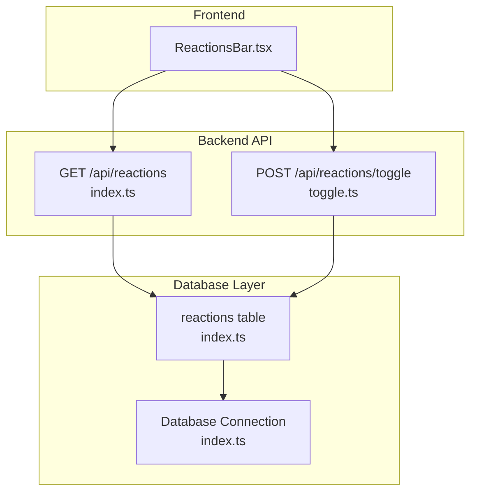
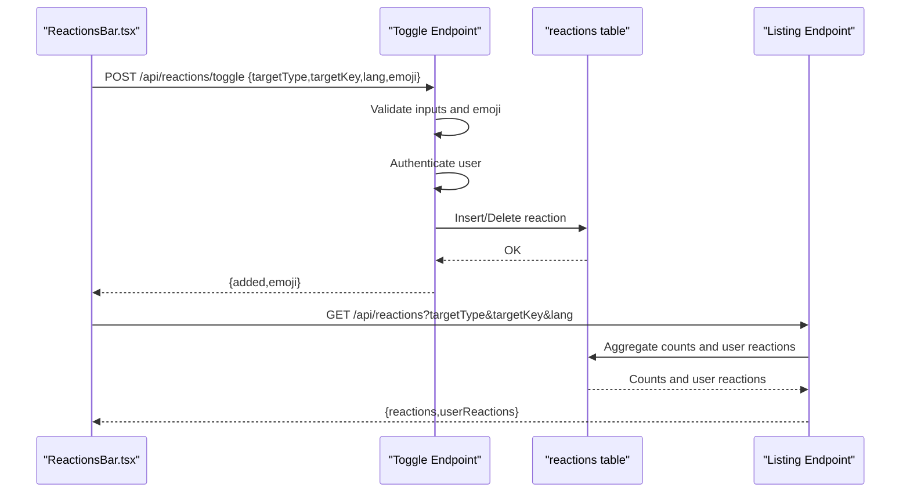
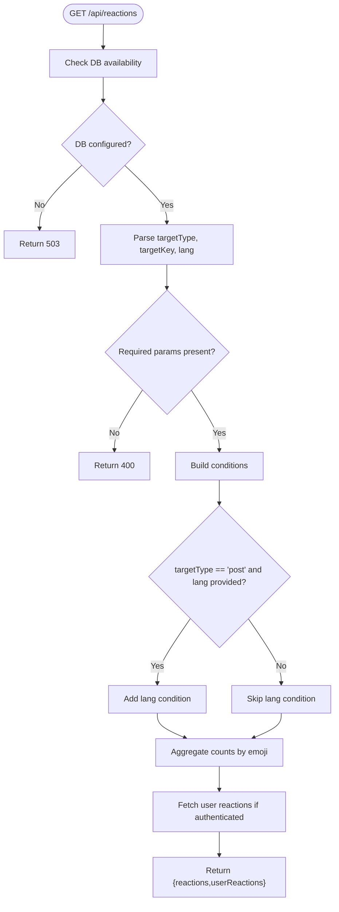
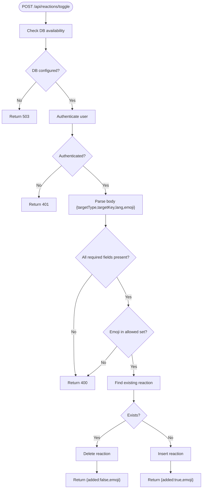
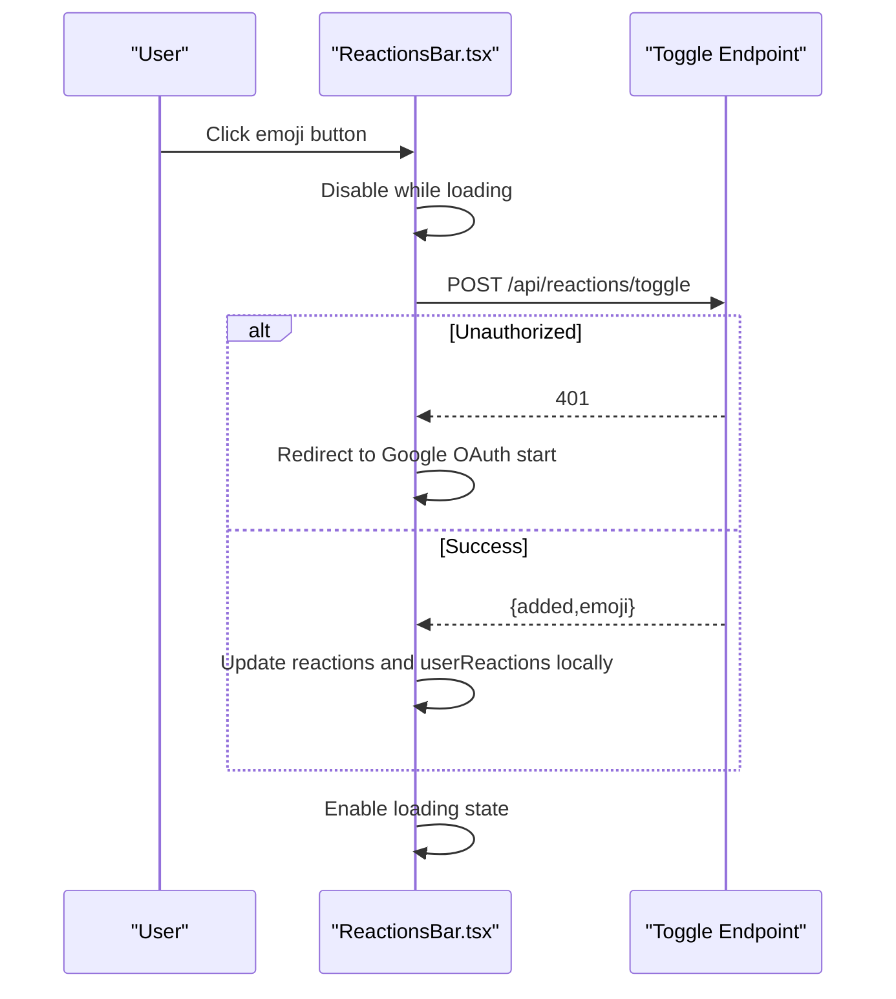
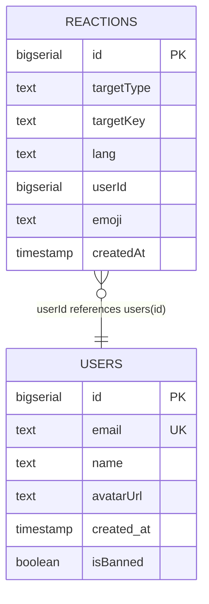
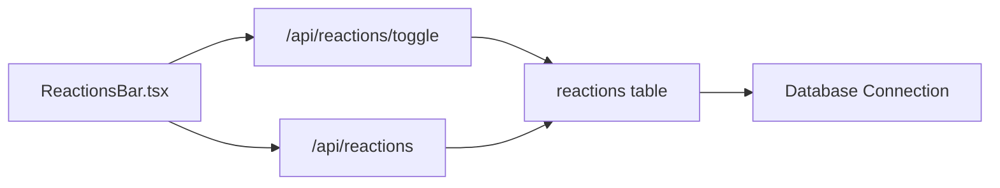

# Reaction API

<cite>
**Referenced Files in This Document**
- [index.ts](file://src/pages/api/reactions/index.ts)
- [toggle.ts](file://src/pages/api/reactions/toggle.ts)
- [ReactionsBar.tsx](file://src/components/ReactionsBar.tsx)
- [index.ts](file://src/db/schema/index.ts)
- [index.ts](file://src/db/index.ts)
- [session.ts](file://src/lib/session.ts)
- [auth.ts](file://src/lib/auth.ts)
</cite>

## Table of Contents
1. [Introduction](#introduction)
2. [Project Structure](#project-structure)
3. [Core Components](#core-components)
4. [Architecture Overview](#architecture-overview)
5. [Detailed Component Analysis](#detailed-component-analysis)
6. [Dependency Analysis](#dependency-analysis)
7. [Performance Considerations](#performance-considerations)
8. [Troubleshooting Guide](#troubleshooting-guide)
9. [Conclusion](#conclusion)

## Introduction
This document provides comprehensive API documentation for the reaction system endpoints. It covers:
- Reaction listing endpoint for retrieving emoji-based reactions
- Reaction toggle endpoint for adding/removing user reactions
- Request/response schemas, authentication requirements, and validation rules
- Emoji selection system and reaction counting mechanisms
- Real-time update patterns and integration with the frontend ReactionsBar component
- Reaction uniqueness constraints, rate limiting considerations, and performance optimizations

## Project Structure
The reaction system spans backend API routes, database schema, and a frontend component:
- Backend API routes under src/pages/api/reactions
- Database schema and connection utilities under src/db
- Frontend reactions bar component under src/components/ReactionsBar.tsx

**Diagram sources**
- [index.ts](file://src/pages/api/reactions/index.ts#L1-L82)
- [toggle.ts](file://src/pages/api/reactions/toggle.ts#L1-L85)
- [ReactionsBar.tsx](file://src/components/ReactionsBar.tsx#L1-L115)
- [index.ts](file://src/db/schema/index.ts#L54-L66)
- [index.ts](file://src/db/index.ts#L1-L37)

**Section sources**
- [index.ts](file://src/pages/api/reactions/index.ts#L1-L82)
- [toggle.ts](file://src/pages/api/reactions/toggle.ts#L1-L85)
- [ReactionsBar.tsx](file://src/components/ReactionsBar.tsx#L1-L115)
- [index.ts](file://src/db/schema/index.ts#L54-L66)
- [index.ts](file://src/db/index.ts#L1-L37)

## Core Components
- Reaction listing endpoint: GET /api/reactions
  - Purpose: Retrieve aggregated reaction counts and the current user’s reactions for a given target
  - Authentication: Optional; if not authenticated, userReactions will be empty
  - Validation: Requires targetType and targetKey; optional lang for post targets
  - Response: { reactions: Record<string, number>, userReactions: string[] }

- Reaction toggle endpoint: POST /api/reactions/toggle
  - Purpose: Add or remove a reaction for the authenticated user
  - Authentication: Required; unauthorized requests receive 401
  - Validation: Requires targetType, targetKey, emoji; emoji must be in the allowed set
  - Response: { added: boolean, emoji: string }

- Frontend integration: ReactionsBar.tsx
  - Purpose: Renders a set of emoji buttons and handles user interactions
  - Behavior: Calls toggle endpoint, updates local state, and reflects UI changes immediately

**Section sources**
- [index.ts](file://src/pages/api/reactions/index.ts#L6-L81)
- [toggle.ts](file://src/pages/api/reactions/toggle.ts#L8-L84)
- [ReactionsBar.tsx](file://src/components/ReactionsBar.tsx#L13-L77)

## Architecture Overview
The reaction system follows a straightforward request-response model with immediate UI updates:
- Frontend triggers a toggle action via ReactionsBar.tsx
- Toggle endpoint validates inputs, checks user authentication, and performs insert/delete
- Listing endpoint aggregates counts and current user’s reactions
- Database constraints enforce uniqueness and indexing for performance

**Diagram sources**
- [toggle.ts](file://src/pages/api/reactions/toggle.ts#L8-L84)
- [index.ts](file://src/pages/api/reactions/index.ts#L6-L81)
- [index.ts](file://src/db/schema/index.ts#L54-L66)

## Detailed Component Analysis

### Reaction Listing Endpoint: GET /api/reactions
- Method: GET
- URL: /api/reactions
- Query parameters:
  - targetType: string (required)
  - targetKey: string (required)
  - lang: string (optional; applies only when targetType is "post")
- Authentication: Optional
- Validation:
  - Returns 400 if targetType or targetKey is missing
  - Returns 503 if database is not configured
- Processing logic:
  - Builds conditions based on targetType and targetKey
  - Adds lang condition when targetType is "post"
  - Aggregates counts by emoji using GROUP BY
  - Retrieves current user’s reactions if authenticated
- Response schema:
  - reactions: Record<string, number> (emoji -> count)
  - userReactions: string[] (current user’s emoji reactions)
- Example request:
  - GET /api/reactions?targetType=post&targetKey=en/blog/welcome&lang=en
- Example response:
  - { "reactions": { "👍": 5, "🔥": 2 }, "userReactions": ["👍"] }

**Diagram sources**
- [index.ts](file://src/pages/api/reactions/index.ts#L6-L81)

**Section sources**
- [index.ts](file://src/pages/api/reactions/index.ts#L6-L81)

### Reaction Toggle Endpoint: POST /api/reactions/toggle
- Method: POST
- URL: /api/reactions/toggle
- Request body:
  - targetType: string (required)
  - targetKey: string (required)
  - lang: string (optional)
  - emoji: string (required; must be in allowed set)
- Authentication: Required; returns 401 if not authenticated
- Validation:
  - Returns 400 if any required field is missing
  - Returns 400 if emoji is not in allowed set
  - Returns 503 if database is not configured
- Processing logic:
  - Checks for existing reaction by targetType, targetKey, userId, and emoji
  - Deletes existing reaction or inserts a new one
  - Returns whether the reaction was added
- Response schema:
  - added: boolean
  - emoji: string
- Allowed emojis: 👍, 🔥, 🤖, 💡, 😂, 🎯, ❤️
- Example request:
  - POST /api/reactions/toggle
  - Body: { "targetType": "post", "targetKey": "en/blog/welcome", "lang": "en", "emoji": "👍" }
- Example response:
  - { "added": true, "emoji": "👍" }

**Diagram sources**
- [toggle.ts](file://src/pages/api/reactions/toggle.ts#L8-L84)

**Section sources**
- [toggle.ts](file://src/pages/api/reactions/toggle.ts#L8-L84)

### Frontend Reactions Bar Integration
- Component: ReactionsBar.tsx
- Props:
  - targetType: 'post' | 'comment'
  - targetKey: string
  - lang?: string
  - initialReactions?: Record<string, number>
  - initialUserReactions?: string[]
- Behavior:
  - Renders a fixed set of emojis
  - On click, calls POST /api/reactions/toggle
  - Updates local state immediately upon successful response
  - Handles 401 by redirecting to Google OAuth start
  - Handles 503 by showing a friendly message
- Allowed emojis in UI: 👍, 🔥, 🤖, 💡, 😂, 🎯
- Note: Backend allows an additional emoji (❤️) not rendered in the UI

**Diagram sources**
- [ReactionsBar.tsx](file://src/components/ReactionsBar.tsx#L25-L77)
- [toggle.ts](file://src/pages/api/reactions/toggle.ts#L8-L84)

**Section sources**
- [ReactionsBar.tsx](file://src/components/ReactionsBar.tsx#L13-L77)

### Database Schema and Constraints
- Table: reactions
  - Columns: id, targetType, targetKey, lang, userId, emoji, createdAt
  - Unique constraint: (targetType, targetKey, userId, emoji) ensures one reaction per user per emoji per target
  - Indexes: reactions_target_idx, reactions_user_idx for efficient queries
- Connection: Drizzle ORM with PostgreSQL client configured with connection pooling

**Diagram sources**
- [index.ts](file://src/db/schema/index.ts#L54-L66)
- [index.ts](file://src/db/schema/index.ts#L4-L11)

**Section sources**
- [index.ts](file://src/db/schema/index.ts#L54-L66)
- [index.ts](file://src/db/index.ts#L1-L37)

## Dependency Analysis
- Backend API routes depend on:
  - Database connection utilities (hasDb, requireDb)
  - Drizzle ORM for queries
  - Session utilities for authentication
- Frontend component depends on:
  - Local state for UI updates
  - Fetch API for endpoint calls
  - Authentication redirection for unauthenticated users

**Diagram sources**
- [ReactionsBar.tsx](file://src/components/ReactionsBar.tsx#L32-L36)
- [toggle.ts](file://src/pages/api/reactions/toggle.ts#L46-L71)
- [index.ts](file://src/pages/api/reactions/index.ts#L39-L68)
- [index.ts](file://src/db/schema/index.ts#L54-L66)
- [index.ts](file://src/db/index.ts#L1-L37)

**Section sources**
- [ReactionsBar.tsx](file://src/components/ReactionsBar.tsx#L1-L115)
- [toggle.ts](file://src/pages/api/reactions/toggle.ts#L1-L85)
- [index.ts](file://src/pages/api/reactions/index.ts#L1-L82)
- [index.ts](file://src/db/schema/index.ts#L54-L66)
- [index.ts](file://src/db/index.ts#L1-L37)

## Performance Considerations
- Database constraints and indexes:
  - Unique constraint on (targetType, targetKey, userId, emoji) prevents duplicates and supports fast lookups
  - Indexes on (targetType, targetKey) and (userId) optimize listing and user-specific queries
- Connection pooling:
  - PostgreSQL client configured with max connections and timeouts to handle concurrent requests efficiently
- Frontend optimistic updates:
  - Immediate UI updates reduce perceived latency; network errors can be handled gracefully
- Recommendations:
  - Consider caching reaction counts for hot targets
  - Implement rate limiting at the application level if abuse is observed
  - Monitor database query performance and adjust indexes as needed

[No sources needed since this section provides general guidance]

## Troubleshooting Guide
- 400 Bad Request:
  - Missing required fields in toggle endpoint
  - Invalid emoji in toggle endpoint
- 401 Unauthorized:
  - User not authenticated; redirect to Google OAuth start
- 503 Service Unavailable:
  - Database not configured; retry later
- 500 Internal Server Error:
  - Unexpected errors during listing or toggling; check server logs
- Emoji mismatch:
  - UI renders a subset of allowed emojis; additional emoji (❤️) is accepted by backend but not shown in UI

**Section sources**
- [toggle.ts](file://src/pages/api/reactions/toggle.ts#L19-L41)
- [index.ts](file://src/pages/api/reactions/index.ts#L19-L24)
- [ReactionsBar.tsx](file://src/components/ReactionsBar.tsx#L38-L50)

## Conclusion
The reaction system provides a robust, user-friendly mechanism for emoji-based reactions:
- Clear separation of concerns between listing and toggling
- Strong database constraints ensure data integrity
- Optimistic UI updates deliver responsive interactions
- Authentication is enforced for actions requiring user context
Future enhancements could include rate limiting, caching, and broader emoji support aligned with the UI.