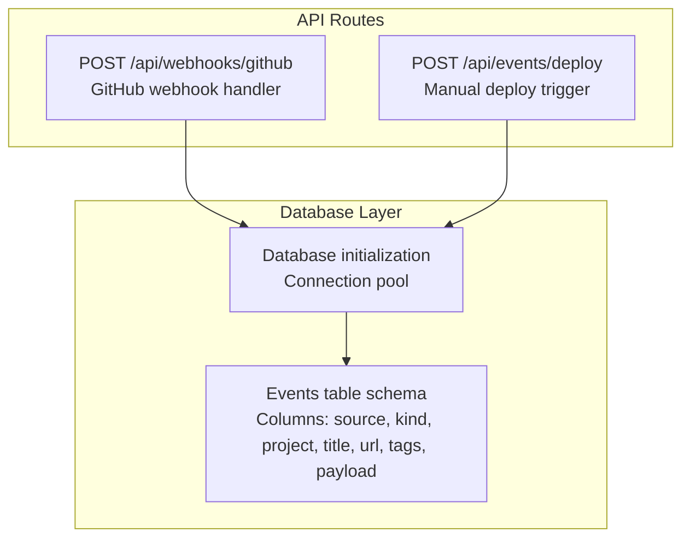
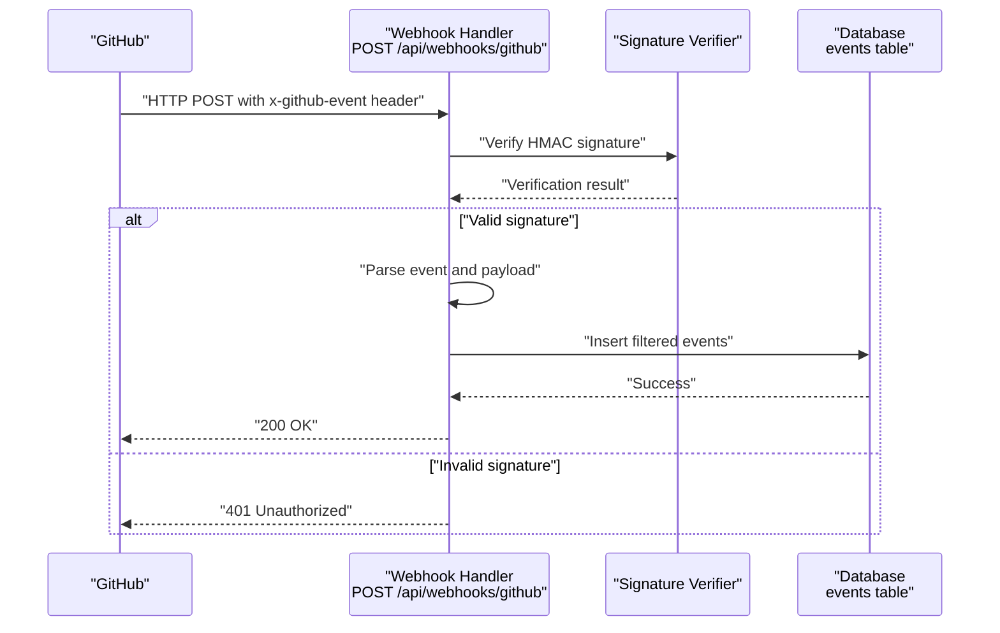
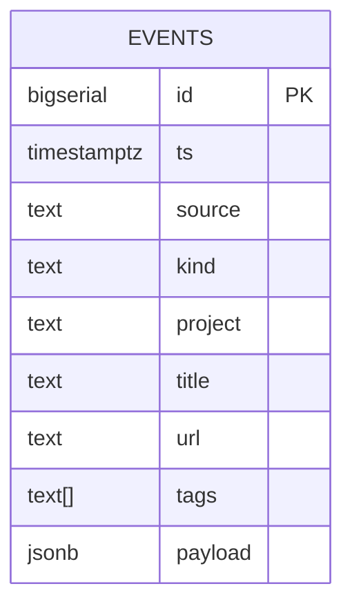
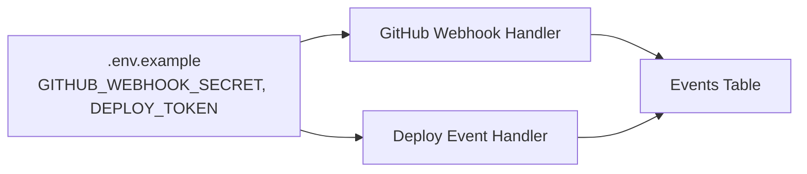

# Webhook API

<cite>
**Referenced Files in This Document**
- [github.ts](file://src/pages/api/webhooks/github.ts)
- [deploy.ts](file://src/pages/api/events/deploy.ts)
- [index.ts](file://src/db/schema/index.ts)
- [index.ts](file://src/db/index.ts)
- [.env.example](file://.env.example)
- [README.md](file://README.md)
- [changelog.astro](file://src/pages/en/changelog.astro)
</cite>

## Table of Contents
1. [Introduction](#introduction)
2. [Project Structure](#project-structure)
3. [Core Components](#core-components)
4. [Architecture Overview](#architecture-overview)
5. [Detailed Component Analysis](#detailed-component-analysis)
6. [Dependency Analysis](#dependency-analysis)
7. [Performance Considerations](#performance-considerations)
8. [Troubleshooting Guide](#troubleshooting-guide)
9. [Conclusion](#conclusion)

## Introduction
This document provides comprehensive API documentation for the webhook processing endpoints that power the automated changelog generation and manual deployment triggers. It covers:
- GitHub webhook endpoint for processing GitHub events
- Manual deployment event endpoint for programmatic deployment notifications
- Security verification using HMAC signatures and bearer tokens
- Payload validation, supported event types, and response handling
- Integration with the changelog pipeline and database storage
- Rate limiting, retry mechanisms, and debugging techniques

## Project Structure
The webhook APIs are implemented as Astro server-side API routes under the pages API directory. They integrate with a PostgreSQL database via Drizzle ORM to persist changelog events.



**Diagram sources**
- [github.ts](file://src/pages/api/webhooks/github.ts#L47-L133)
- [deploy.ts](file://src/pages/api/events/deploy.ts#L4-L52)
- [index.ts](file://src/db/index.ts#L1-L37)
- [index.ts](file://src/db/schema/index.ts#L79-L93)

**Section sources**
- [github.ts](file://src/pages/api/webhooks/github.ts#L1-L134)
- [deploy.ts](file://src/pages/api/events/deploy.ts#L1-L53)
- [index.ts](file://src/db/schema/index.ts#L79-L93)
- [index.ts](file://src/db/index.ts#L1-L37)

## Core Components
- GitHub webhook handler: Validates HMAC signature, parses GitHub event headers, filters commits, and persists events to the database.
- Deploy event handler: Validates bearer token, accepts structured JSON payload, and persists deployment events to the database.
- Database integration: Drizzle ORM connects to PostgreSQL and defines the events table schema used by both handlers.

**Section sources**
- [github.ts](file://src/pages/api/webhooks/github.ts#L47-L133)
- [deploy.ts](file://src/pages/api/events/deploy.ts#L4-L52)
- [index.ts](file://src/db/schema/index.ts#L79-L93)
- [index.ts](file://src/db/index.ts#L1-L37)

## Architecture Overview
The webhook endpoints are designed to be lightweight and secure. GitHub events are verified using HMAC SHA-256 signatures, while deploy events use a shared secret token. Both endpoints insert normalized events into the events table, enabling a unified changelog feed.



**Diagram sources**
- [github.ts](file://src/pages/api/webhooks/github.ts#L9-L25)
- [github.ts](file://src/pages/api/webhooks/github.ts#L47-L133)
- [index.ts](file://src/db/schema/index.ts#L79-L93)

## Detailed Component Analysis

### GitHub Webhook Endpoint
- Method: POST
- URL: /api/webhooks/github
- Purpose: Process GitHub events (push and release) and populate the changelog feed.

#### Request
- Headers:
  - x-hub-signature-256: HMAC-SHA256 signature of the raw payload
  - x-github-event: GitHub event type (e.g., push, release)
  - Content-Type: application/json
- Body: Raw JSON payload from GitHub

#### Signature Verification
- Uses HMAC-SHA256 with the configured secret.
- Rejects missing or malformed signatures.
- Uses constant-time comparison to prevent timing attacks.

#### Supported GitHub Events
- push:
  - Filters commits by conventional prefixes and ignores merge commits.
  - Limits processed commits per push.
  - Branch filtering: only main and master branches are processed.
  - Persists each commit as an event with kind derived from commit message prefix.
- release:
  - Only published releases are processed.
  - Persists release metadata as an event.

#### Response Handling
- 200 OK: Event processed or ignored (non-main branch or unsupported event).
- 401 Unauthorized: Invalid or missing signature.
- 500 Internal Server Error: Missing secret or internal error.

#### Payload Validation
- Validates presence of required headers and parses JSON payload.
- Ignores non-main branches and non-publish release actions.
- Applies commit filtering rules before insertion.

#### Example Webhook Configuration
- Payload URL: https://rodion.pro/api/webhooks/github
- Content type: application/json
- Secret: GITHUB_WEBHOOK_SECRET from environment
- Events: Pushes and Releases

**Section sources**
- [github.ts](file://src/pages/api/webhooks/github.ts#L9-L25)
- [github.ts](file://src/pages/api/webhooks/github.ts#L47-L133)
- [.env.example](file://.env.example#L7-L8)
- [README.md](file://README.md#L155-L169)

### Deploy Event Endpoint
- Method: POST
- URL: /api/events/deploy
- Purpose: Allow manual deployment triggers to update the changelog feed.

#### Request
- Headers:
  - Authorization: Bearer token
  - Content-Type: application/json
- Body: JSON object with fields:
  - project (required)
  - version (optional)
  - environment (optional)
  - url (optional)
  - message (optional)

#### Authentication
- Validates bearer token against DEPLOY_TOKEN environment variable.
- Rejects missing or invalid tokens.

#### Response Handling
- 200 OK: Event persisted successfully with JSON response { success: true }.
- 400 Bad Request: Missing required fields.
- 401 Unauthorized: Missing or invalid authorization.
- 500 Internal Server Error: Missing token or internal error.

#### Payload Validation
- Ensures project is present.
- Constructs a human-readable title from message or defaults.
- Tags events with deploy and environment.

#### Example Curl Usage
```bash
curl -X POST https://rodion.pro/api/events/deploy \
  -H "Authorization: Bearer YOUR_DEPLOY_TOKEN" \
  -H "Content-Type: application/json" \
  -d '{
    "project": "rodion.pro",
    "version": "1.0.0",
    "environment": "production",
    "message": "Deployed v1.0.0 to production"
  }'
```

**Section sources**
- [deploy.ts](file://src/pages/api/events/deploy.ts#L4-L52)
- [.env.example](file://.env.example#L10-L11)
- [README.md](file://README.md#L171-L185)

### Database Integration
Both endpoints write to the events table, which powers the changelog UI.



**Diagram sources**
- [index.ts](file://src/db/schema/index.ts#L79-L93)

**Section sources**
- [index.ts](file://src/db/schema/index.ts#L79-L93)
- [index.ts](file://src/db/index.ts#L1-L37)

## Dependency Analysis
- GitHub webhook depends on:
  - Environment variable GITHUB_WEBHOOK_SECRET for signature verification
  - Database connection and events table schema
- Deploy endpoint depends on:
  - Environment variable DEPLOY_TOKEN for bearer token validation
  - Database connection and events table schema



**Diagram sources**
- [.env.example](file://.env.example#L7-L11)
- [github.ts](file://src/pages/api/webhooks/github.ts#L49-L54)
- [deploy.ts](file://src/pages/api/events/deploy.ts#L6-L11)
- [index.ts](file://src/db/schema/index.ts#L79-L93)

**Section sources**
- [.env.example](file://.env.example#L7-L11)
- [github.ts](file://src/pages/api/webhooks/github.ts#L49-L54)
- [deploy.ts](file://src/pages/api/events/deploy.ts#L6-L11)
- [index.ts](file://src/db/schema/index.ts#L79-L93)

## Performance Considerations
- Commit filtering reduces database writes and improves changelog readability.
- Branch filtering ensures only main/master pushes are processed.
- Database connection pooling is configured to handle concurrent requests efficiently.

[No sources needed since this section provides general guidance]

## Troubleshooting Guide
- GitHub webhook returns 500:
  - Ensure GITHUB_WEBHOOK_SECRET is set in environment.
- GitHub webhook returns 401:
  - Verify the webhook secret matches the configured secret.
  - Confirm the x-hub-signature-256 header is present and correct.
- Deploy endpoint returns 500:
  - Ensure DEPLOY_TOKEN is set in environment.
- Deploy endpoint returns 401:
  - Verify Authorization header format and token value.
- Deploy endpoint returns 400:
  - Ensure the project field is present in the request body.
- Changelog shows no events:
  - Confirm DATABASE_URL is configured and the events table exists.
  - Check that GitHub webhook is configured for Pushes and Releases.

**Section sources**
- [github.ts](file://src/pages/api/webhooks/github.ts#L49-L54)
- [github.ts](file://src/pages/api/webhooks/github.ts#L59-L61)
- [deploy.ts](file://src/pages/api/events/deploy.ts#L6-L11)
- [deploy.ts](file://src/pages/api/events/deploy.ts#L13-L20)
- [deploy.ts](file://src/pages/api/events/deploy.ts#L25-L27)
- [changelog.astro](file://src/pages/en/changelog.astro#L50-L55)

## Conclusion
The webhook APIs provide a secure and efficient way to populate the changelog from GitHub events and manual deployments. By validating signatures and tokens, filtering payloads, and persisting normalized events, the system maintains a clean and reliable changelog feed. Proper environment configuration and webhook setup are essential for successful integration.