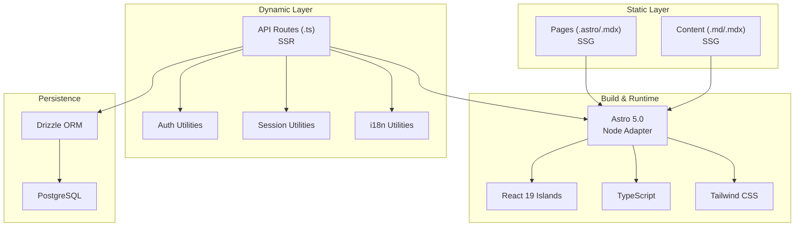
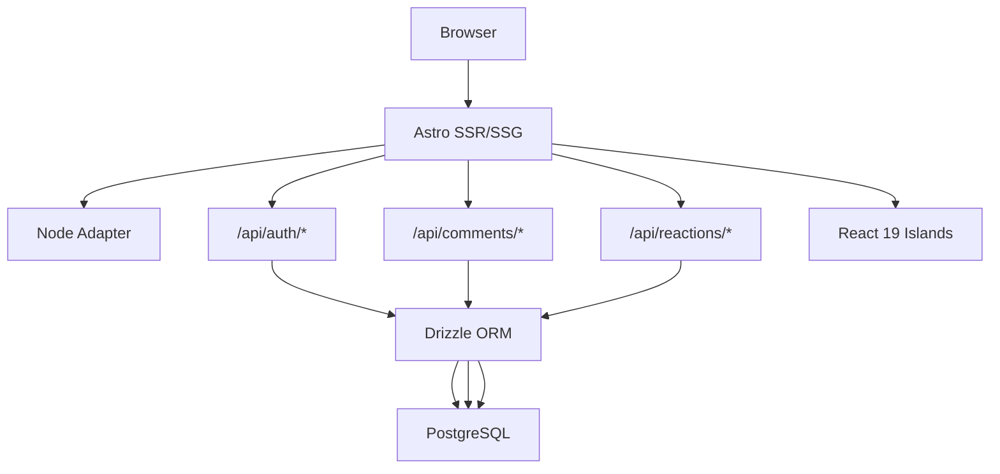
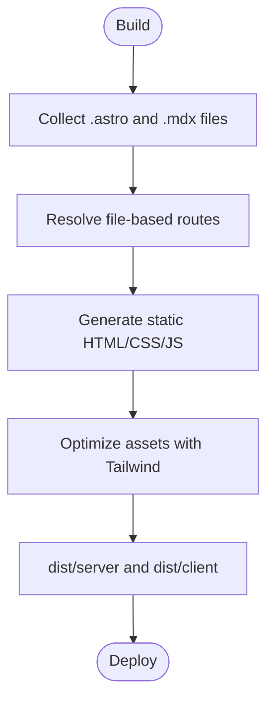
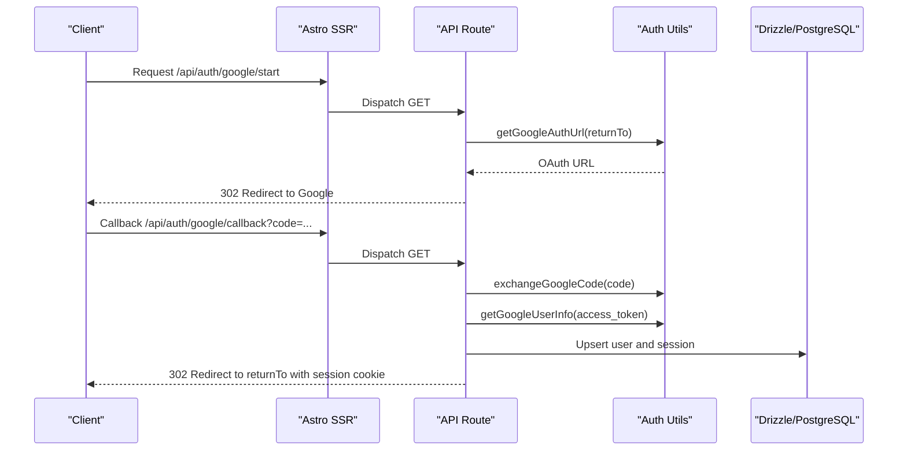
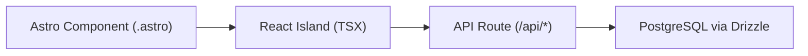
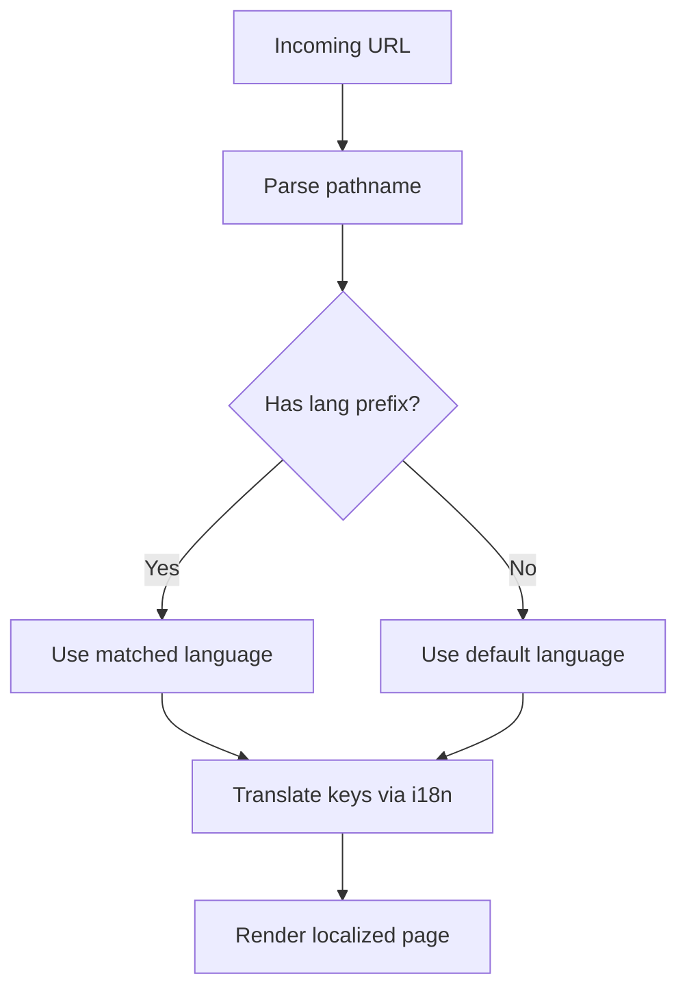
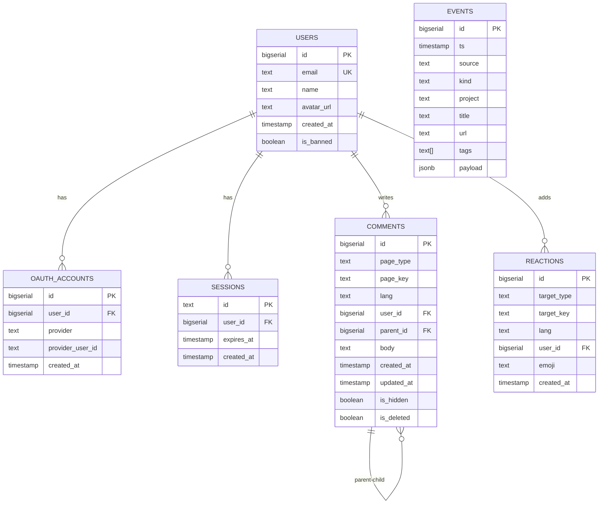
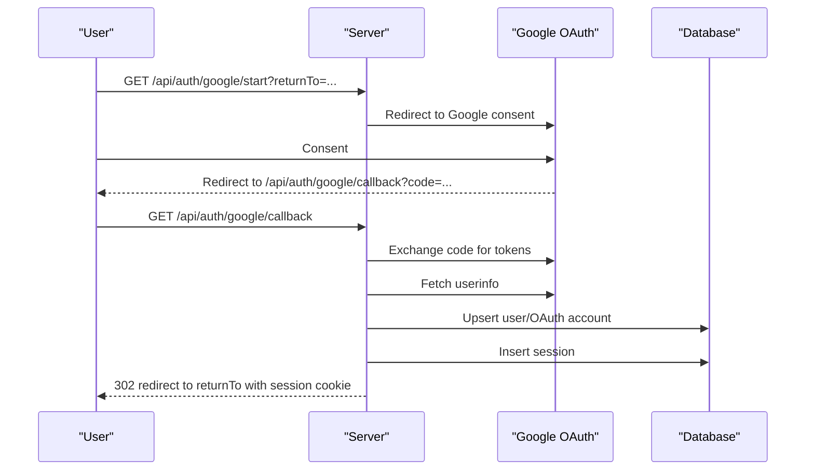
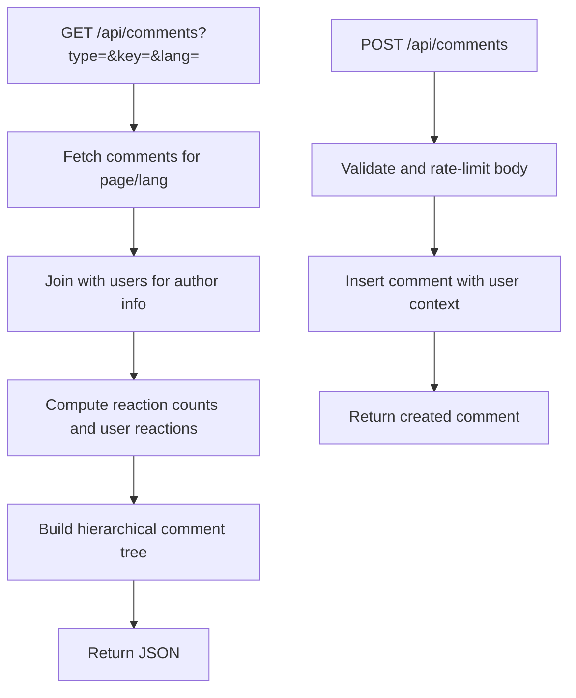
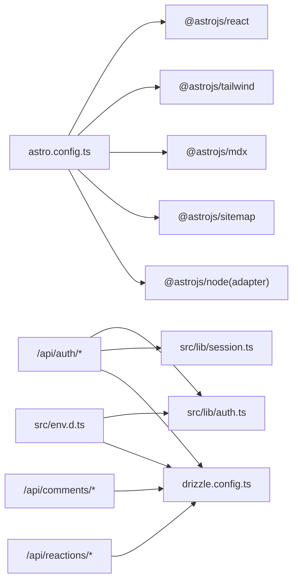

# Architecture Overview

<cite>
**Referenced Files in This Document**
- [package.json](file://package.json)
- [astro.config.ts](file://astro.config.ts)
- [env.d.ts](file://src/env.d.ts)
- [drizzle.config.ts](file://drizzle.config.ts)
- [tailwind.config.ts](file://tailwind.config.ts)
- [tsconfig.json](file://tsconfig.json)
- [src/db/schema/index.ts](file://src/db/schema/index.ts)
- [src/lib/auth.ts](file://src/lib/auth.ts)
- [src/lib/session.ts](file://src/lib/session.ts)
- [src/i18n/index.ts](file://src/i18n/index.ts)
- [src/pages/api/auth/google/start.ts](file://src/pages/api/auth/google/start.ts)
- [src/pages/api/auth/google/callback.ts](file://src/pages/api/auth/google/callback.ts)
- [src/pages/api/comments/index.ts](file://src/pages/api/comments/index.ts)
- [src/pages/api/reactions/toggle.ts](file://src/pages/api/reactions/toggle.ts)
</cite>

## Table of Contents
1. [Introduction](#introduction)
2. [Project Structure](#project-structure)
3. [Core Components](#core-components)
4. [Architecture Overview](#architecture-overview)
5. [Detailed Component Analysis](#detailed-component-analysis)
6. [Dependency Analysis](#dependency-analysis)
7. [Performance Considerations](#performance-considerations)
8. [Troubleshooting Guide](#troubleshooting-guide)
9. [Conclusion](#conclusion)

## Introduction
This document describes the system architecture of rodion.pro, a hybrid static site generator (SSG) with server-side rendering (SSR) capabilities powered by Astro 5.0 with the Node adapter. The system combines:
- Static content generation via Astro’s SSG pipeline
- Dynamic SSR for interactive features (authentication, comments, reactions)
- React 19 “islands” for localized interactivity
- TypeScript for type safety
- Tailwind CSS for styling
- PostgreSQL with Drizzle ORM for data persistence
- Google OAuth 2.0 for authentication
- Internationalization with URL-prefixed locales and content organization

## Project Structure
The project follows a conventional Astro monorepo-like layout with clear separation of concerns:
- Static content and routes under src/pages and src/content
- Database schema and ORM configuration under src/db
- Authentication and session utilities under src/lib
- Internationalization utilities under src/i18n
- API endpoints under src/pages/api
- Build-time configuration under astro.config.ts, tsconfig.json, tailwind.config.ts, drizzle.config.ts

**Diagram sources**
- [astro.config.ts](file://astro.config.ts#L1-L38)
- [package.json](file://package.json#L18-L32)
- [src/db/schema/index.ts](file://src/db/schema/index.ts#L1-L104)
- [src/lib/auth.ts](file://src/lib/auth.ts#L1-L101)
- [src/lib/session.ts](file://src/lib/session.ts#L1-L58)
- [src/i18n/index.ts](file://src/i18n/index.ts#L1-L221)

**Section sources**
- [astro.config.ts](file://astro.config.ts#L1-L38)
- [package.json](file://package.json#L1-L46)
- [tsconfig.json](file://tsconfig.json#L1-L16)
- [tailwind.config.ts](file://tailwind.config.ts#L1-L35)
- [drizzle.config.ts](file://drizzle.config.ts#L1-L11)

## Core Components
- Astro 5.0 with Node adapter: Enables SSG and SSR, with a server output mode and standalone adapter for deployment flexibility.
- React 19 islands: Localized interactive components embedded within Astro templates.
- TypeScript: Strict type checking across components, API routes, and utilities.
- Tailwind CSS: Utility-first styling with theme variables and dark-mode support.
- PostgreSQL + Drizzle ORM: Typed database schema and queries.
- Google OAuth 2.0: Secure user authentication via external provider.
- Internationalization: URL-prefixed locales with content separation and translation utilities.

**Section sources**
- [astro.config.ts](file://astro.config.ts#L8-L38)
- [package.json](file://package.json#L18-L32)
- [tsconfig.json](file://tsconfig.json#L3-L12)
- [tailwind.config.ts](file://tailwind.config.ts#L1-L35)
- [drizzle.config.ts](file://drizzle.config.ts#L1-L11)
- [src/i18n/index.ts](file://src/i18n/index.ts#L1-L221)

## Architecture Overview
The system employs a hybrid SSR/SSG model:
- Static pages (e.g., marketing pages, blog listings, MDX content) are generated at build time and served as static HTML/CSS/JS.
- Dynamic pages and endpoints (e.g., authentication, comments, reactions) are rendered on-demand by the server.
- React islands encapsulate interactive UI regions (e.g., command palette, comments UI) that hydrate on the client.

**Diagram sources**
- [astro.config.ts](file://astro.config.ts#L10-L13)
- [src/pages/api/auth/google/start.ts](file://src/pages/api/auth/google/start.ts#L1-L15)
- [src/pages/api/auth/google/callback.ts](file://src/pages/api/auth/google/callback.ts#L1-L114)
- [src/pages/api/comments/index.ts](file://src/pages/api/comments/index.ts#L1-L240)
- [src/pages/api/reactions/toggle.ts](file://src/pages/api/reactions/toggle.ts#L1-L85)
- [src/db/schema/index.ts](file://src/db/schema/index.ts#L1-L104)

## Detailed Component Analysis

### Static Site Generation (SSG) and Routing
- Pages and content are organized by locale under src/pages/{en|ru} and src/content/blog-{en|ru}. Astro’s file-based routing maps URLs to components and MDX files.
- The i18n configuration prefixes default and alternate locales in URLs and generates sitemaps per locale.
- Build output targets the server adapter, enabling both static generation and SSR on demand.

**Diagram sources**
- [astro.config.ts](file://astro.config.ts#L30-L36)
- [tailwind.config.ts](file://tailwind.config.ts#L4-L32)

**Section sources**
- [astro.config.ts](file://astro.config.ts#L30-L36)
- [src/i18n/index.ts](file://src/i18n/index.ts#L191-L221)

### Server-Side Rendering (SSR) and Dynamic Endpoints
- API routes under src/pages/api handle dynamic requests:
  - Authentication: start and callback endpoints integrate with Google OAuth 2.0.
  - Comments: CRUD operations with nested replies and reaction counts.
  - Reactions: toggle emoji reactions with deduplication and user-specific state.
- Session management persists user identity across requests using signed cookies and database-backed sessions.

**Diagram sources**
- [src/pages/api/auth/google/start.ts](file://src/pages/api/auth/google/start.ts#L1-L15)
- [src/pages/api/auth/google/callback.ts](file://src/pages/api/auth/google/callback.ts#L1-L114)
- [src/lib/auth.ts](file://src/lib/auth.ts#L41-L95)
- [src/lib/session.ts](file://src/lib/session.ts#L13-L54)
- [src/db/schema/index.ts](file://src/db/schema/index.ts#L4-L33)

**Section sources**
- [src/pages/api/auth/google/start.ts](file://src/pages/api/auth/google/start.ts#L1-L15)
- [src/pages/api/auth/google/callback.ts](file://src/pages/api/auth/google/callback.ts#L1-L114)
- [src/lib/auth.ts](file://src/lib/auth.ts#L1-L101)
- [src/lib/session.ts](file://src/lib/session.ts#L1-L58)

### React 19 Islands and Component Architecture
- Astro components (.astro) host React islands for interactive UI. This allows localized hydration and improved performance compared to full-page re-rendering.
- Example islands include CommandPalette, CommentsThread, ReactionsBar, and UI controls (ThemeSwitch, LanguageSwitch).
- Islands communicate with SSR endpoints via fetch calls to API routes, passing minimal props and leveraging server-provided user context.

[No sources needed since this diagram shows conceptual workflow, not actual code structure]

**Section sources**
- [astro.config.ts](file://astro.config.ts#L14-L19)
- [package.json](file://package.json#L21-L31)

### Internationalization Architecture
- URL structure: /{ru|en}/... enforced by Astro i18n configuration and routing.
- Content separation: src/content/blog-{en|ru} organizes localized MDX content.
- Utilities:
  - Extract language from URL
  - Provide translations keyed by language
  - Generate localized paths and alternate locales for hreflang

**Diagram sources**
- [src/i18n/index.ts](file://src/i18n/index.ts#L191-L221)
- [astro.config.ts](file://astro.config.ts#L30-L36)

**Section sources**
- [astro.config.ts](file://astro.config.ts#L30-L36)
- [src/i18n/index.ts](file://src/i18n/index.ts#L1-L221)

### Data Persistence and Schema
- PostgreSQL schema defined with Drizzle ORM tables for users, sessions, OAuth accounts, comments, reactions, and events.
- Indexes optimize common queries (e.g., comments by page/lang, reactions by target, sessions by expiry).
- API routes use typed queries to maintain consistency and prevent runtime errors.

**Diagram sources**
- [src/db/schema/index.ts](file://src/db/schema/index.ts#L1-L104)

**Section sources**
- [src/db/schema/index.ts](file://src/db/schema/index.ts#L1-L104)
- [drizzle.config.ts](file://drizzle.config.ts#L1-L11)

### Authentication Flow
- Start: Generates Google OAuth URL with state and redirects user.
- Callback: Exchanges authorization code for tokens, retrieves user info, upserts user and OAuth account, creates session, sets cookie, and redirects back.
- Session retrieval: Validates session cookie against database and checks user status.

**Diagram sources**
- [src/pages/api/auth/google/start.ts](file://src/pages/api/auth/google/start.ts#L1-L15)
- [src/pages/api/auth/google/callback.ts](file://src/pages/api/auth/google/callback.ts#L1-L114)
- [src/lib/auth.ts](file://src/lib/auth.ts#L41-L95)
- [src/lib/session.ts](file://src/lib/session.ts#L13-L54)

**Section sources**
- [src/pages/api/auth/google/start.ts](file://src/pages/api/auth/google/start.ts#L1-L15)
- [src/pages/api/auth/google/callback.ts](file://src/pages/api/auth/google/callback.ts#L1-L114)
- [src/lib/auth.ts](file://src/lib/auth.ts#L1-L101)
- [src/lib/session.ts](file://src/lib/session.ts#L1-L58)

### Comments and Reactions Endpoints
- Comments endpoint supports listing and posting comments with nested replies and reaction counts. It aggregates reaction totals and current user reactions.
- Reactions endpoint toggles emoji reactions with validation and deduplication.

**Diagram sources**
- [src/pages/api/comments/index.ts](file://src/pages/api/comments/index.ts#L6-L163)

**Section sources**
- [src/pages/api/comments/index.ts](file://src/pages/api/comments/index.ts#L1-L240)
- [src/pages/api/reactions/toggle.ts](file://src/pages/api/reactions/toggle.ts#L1-L85)

## Dependency Analysis
- Astro integrates React, Tailwind, MDX, and Sitemap plugins; Node adapter enables SSR/SSG hybrid.
- API routes depend on Drizzle ORM for database operations and on auth/session utilities for user context.
- Environment variables are strongly typed via env.d.ts and consumed by auth utilities and database configuration.

**Diagram sources**
- [astro.config.ts](file://astro.config.ts#L1-L38)
- [package.json](file://package.json#L18-L32)
- [src/lib/auth.ts](file://src/lib/auth.ts#L1-L101)
- [src/lib/session.ts](file://src/lib/session.ts#L1-L58)
- [drizzle.config.ts](file://drizzle.config.ts#L1-L11)
- [env.d.ts](file://src/env.d.ts#L4-L14)

**Section sources**
- [astro.config.ts](file://astro.config.ts#L1-L38)
- [package.json](file://package.json#L18-L32)
- [env.d.ts](file://src/env.d.ts#L1-L19)
- [drizzle.config.ts](file://drizzle.config.ts#L1-L11)

## Performance Considerations
- Prefer SSG for static content to minimize server load and improve caching.
- Use React islands sparingly and keep them small to reduce bundle size and hydration cost.
- Database queries should leverage indexes (e.g., comments by page/lang, reactions by target) to avoid N+1 and slow scans.
- Cache frequently accessed data (e.g., recent events) at the application level when appropriate.
- Minimize cookie size and avoid unnecessary roundtrips by batching API calls where feasible.

[No sources needed since this section provides general guidance]

## Troubleshooting Guide
- Authentication failures:
  - Verify environment variables for Google OAuth and site URL.
  - Check callback URL alignment with provider configuration.
  - Inspect session cookie attributes (secure, sameSite, domain).
- Database connectivity:
  - Confirm DATABASE_URL and Drizzle configuration.
  - Ensure migrations are applied and tables exist.
- API route errors:
  - Review 4xx vs 5xx responses and error logs.
  - Validate request bodies and query parameters.
- Internationalization:
  - Confirm URL prefixes and default locale configuration.
  - Verify translation keys and fallback behavior.

**Section sources**
- [src/lib/auth.ts](file://src/lib/auth.ts#L41-L95)
- [src/lib/session.ts](file://src/lib/session.ts#L13-L54)
- [drizzle.config.ts](file://drizzle.config.ts#L1-L11)
- [src/i18n/index.ts](file://src/i18n/index.ts#L191-L221)

## Conclusion
rodion.pro leverages Astro 5.0 with the Node adapter to deliver a fast, scalable hybrid of SSG and SSR. Static content benefits from zero-runtime rendering, while dynamic features (auth, comments, reactions) are handled server-side with typed database operations and robust session management. React islands enable localized interactivity, and the i18n architecture ensures clear URL-based localization. Together, these choices balance developer productivity, performance, and maintainability.