# Build and Deployment

<cite>
**Referenced Files in This Document**
- [README.md](file://README.md)
- [package.json](file://package.json)
- [astro.config.ts](file://astro.config.ts)
- [ecosystem.config.cjs](file://ecosystem.config.cjs)
- [drizzle.config.ts](file://drizzle.config.ts)
- [.env.example](file://.env.example)
- [tailwind.config.ts](file://tailwind.config.ts)
- [tsconfig.json](file://tsconfig.json)
- [src/env.d.ts](file://src/env.d.ts)
- [src/lib/auth.ts](file://src/lib/auth.ts)
- [src/lib/session.ts](file://src/lib/session.ts)
- [src/pages/api/auth/google/start.ts](file://src/pages/api/auth/google/start.ts)
- [src/pages/api/auth/google/callback.ts](file://src/pages/api/auth/google/callback.ts)
- [src/db/schema/index.ts](file://src/db/schema/index.ts)
- [drizzle/meta/_journal.json](file://drizzle/meta/_journal.json)
- [drizzle/0001_initial.sql](file://drizzle/0001_initial.sql)
- [drizzle/0002_activity_monitoring.sql](file://drizzle/0002_activity_monitoring.sql)
- [drizzle/0003_activity_notes.sql](file://drizzle/0003_activity_notes.sql)
- [ACTIVITY_MONITORING_SETUP.md](file://ACTIVITY_MONITORING_SETUP.md)
- [nginx-activity-config.conf](file://nginx-activity-config.conf)
- [nginx.conf](file://nginx.conf)
- [activity-service.js](file://activity-service.js)
- [activity-service.service](file://activity-service.service)
- [docker-compose.yml](file://docker-compose.yml)
- [register-device.cjs](file://register-device.cjs)
- [src/lib/activity.ts](file://src/lib/activity.ts)
- [src/lib/activity-db.ts](file://src/lib/activity-db.ts)
- [src/pages/api/activity/v1/ingest.ts](file://src/pages/api/activity/v1/ingest.ts)
- [src/pages/api/activity/v1/public.ts](file://src/pages/api/activity/v1/public.ts)
- [src/pages/api/activity/v1/notes/ingest.ts](file://src/pages/api/activity/v1/notes/ingest.ts)
- [src/components/ActivityDashboard.tsx](file://src/components/ActivityDashboard.tsx)
- [start-dev-work-now.bat](file://start-dev-work-now.bat)
- [stop-dev-work-now.bat](file://stop-dev-work-now.bat)
- [start-dev.bat](file://start-dev.bat)
- [stop-dev.bat](file://stop-dev.bat)
- [start-tracking-local.bat](file://start-tracking-local.bat)
- [rodion.pro.sln](file://rodion.pro.sln)
- [tools/activity-note-helper/ActivityNoteHelper.csproj](file://tools/activity-note-helper/ActivityNoteHelper.csproj)
- [tools/activity-note-helper/Program.cs](file://tools/activity-note-helper/Program.cs)
- [tools/activity-note-helper/activity-note-helper.config.json](file://tools/activity-note-helper/activity-note-helper.config.json)
- [.dev/README.md](file://.dev/README.md)
- [.dev/port.txt](file://.dev/port.txt)
- [.dev/pids.json](file://.dev/pids.json)
- [.dev/window.title](file://.dev/window.title)
- [old-stuff/g-start-dev.bat](file://old-stuff/g-start-dev.bat)
- [old-stuff/g-stop-dev.bat](file://old-stuff/g-stop-dev.bat)
- [documentation/tasks/000-rodion-pro-qoder-task.md](file://documentation/tasks/000-rodion-pro-qoder-task.md)
- [documentation/tasks/001-start-monitoring.md](file://documentation/tasks/001-start-monitoring.md)
- [src/db/index.ts](file://src/db/index.ts)
- [activity-agent/package.json](file://activity-agent/package.json)
- [activity-agent/src/index.ts](file://activity-agent/src/index.ts)
- [activity-agent/config.local.json](file://activity-agent/config.local.json)
</cite>

## Update Summary
**Changes Made**
- Added Visual Studio solution file (rodion.pro.sln) for enhanced development environment organization with nested project structure
- Integrated ActivityNoteHelper .NET 8 WinForms application as a nested project within the Visual Studio solution
- Enhanced development tooling with organized project hierarchy for better IDE navigation and build management
- Added comprehensive quick notes functionality with encrypted note storage and privacy controls
- Expanded activity monitoring infrastructure with additional API endpoints for note management

## Table of Contents
1. [Introduction](#introduction)
2. [Project Structure](#project-structure)
3. [Core Components](#core-components)
4. [Architecture Overview](#architecture-overview)
5. [Development Environment Automation](#development-environment-automation)
6. [Local Development Infrastructure](#local-development-infrastructure)
7. [Activity Monitoring Infrastructure](#activity-monitoring-infrastructure)
8. [Containerized Deployment with Docker](#containerized-deployment-with-docker)
9. [Systemd Service Management](#systemd-service-management)
10. [Detailed Component Analysis](#detailed-component-analysis)
11. [Dependency Analysis](#dependency-analysis)
12. [Performance Considerations](#performance-considerations)
13. [Troubleshooting Guide](#troubleshooting-guide)
14. [Conclusion](#conclusion)
15. [Appendices](#appendices)

## Introduction
This document describes the complete build and deployment processes for rodion.pro, encompassing the Astro build configuration, asset optimization, environment variable handling, production build pipeline, and the new comprehensive local development infrastructure. The system now includes containerized deployment with Docker, systemd service management, comprehensive activity monitoring with privacy controls, real-time dashboards, automated deployment workflows, and enhanced local development environment with nginx reverse proxy configuration and activity tracking automation. It covers server requirements, the complete deployment workflow from server preparation to production launch, database migration, application building, and process management with pm2 and systemd. Additionally, it documents nginx reverse proxy configuration, SSL certificate setup with Let's Encrypt, load balancing considerations, monitoring setup, log management, backup strategies, maintenance procedures, rollback procedures, performance monitoring, and scaling considerations for production environments.

**Updated** Enhanced with comprehensive local development infrastructure including nginx.conf reverse proxy configuration for production-like environment testing, start-tracking-local.bat automation script for streamlined activity tracking workflow, and expanded Windows development automation with activity agent management and tray icon support. **Updated** Added Visual Studio solution file (rodion.pro.sln) for enhanced development environment organization with nested project structure, integrating the ActivityNoteHelper .NET 8 WinForms application as a dedicated tool within the solution hierarchy.

## Project Structure
The project is an Astro SSR application with a Node adapter, React islands, TypeScript, Tailwind CSS, and PostgreSQL via Drizzle ORM. The system now includes a dedicated activity monitoring service with its own API endpoints, database schema, and frontend components, along with comprehensive local development infrastructure. Key build and deployment artifacts include:
- Astro configuration defining SSR output and integrations
- Package scripts for development, building, previewing, and database operations
- Drizzle configuration and migrations for PostgreSQL schema management, including activity monitoring tables
- pm2 ecosystem configuration for production process management with dotenv/config module for environment variable loading
- Systemd service configuration for activity monitoring service management
- Docker Compose configuration for containerized deployment with PostgreSQL 15
- Activity monitoring service with separate port (4010) and dedicated API endpoints
- Device registration utilities and privacy controls
- Real-time dashboards with Server-Sent Events (SSE) streaming
- Environment variables for site URL, database, OAuth, admin emails, activity monitoring, and optional anti-spam
- **Updated** Enhanced local development infrastructure with nginx.conf reverse proxy configuration and activity agent management
- **Updated** Comprehensive Windows development automation scripts with activity tracking capabilities
- **Updated** Visual Studio solution file organizing development tools with nested project structure for improved IDE navigation
- **Updated** ActivityNoteHelper .NET 8 WinForms application providing quick notes functionality with encrypted storage and privacy controls

```mermaid
graph TB
A["Astro Build<br/>SSR output"] --> B["Node Adapter<br/>Standalone mode"]
A --> C["Integrations<br/>React, Tailwind, MDX, Sitemap"]
D["Package Scripts<br/>dev, build, start, db:*"] --> A
E["Drizzle Config & Migrations<br/>PostgreSQL schema<br/>+ Activity Tables"] --> F["PostgreSQL Database"]
G["Environment Variables<br/>.env.example<br/>+ Activity Vars"] --> H["Runtime Behavior<br/>Site URL, OAuth, Admin Emails,<br/>Activity Monitoring"]
I["Tailwind Config<br/>content globs, theme"] --> J["CSS Build"]
K["TypeScript Config<br/>paths, jsx, strictness"] --> L["Type Checking"]
M["pm2 Ecosystem<br/>process management<br/>with dotenv integration"] --> N["Main Astro App<br/>Port 3100"]
O["Systemd Service<br/>Activity Monitoring<br/>Port 4010"] --> P["Activity Service<br/>Separate Process"]
Q["Docker Compose<br/>Containerized Setup"] --> R["PostgreSQL 15 Container"]
S["Activity Monitoring<br/>Infrastructure"] --> T["Device Registration<br/>Privacy Controls<br/>Real-time Dashboards"]
U["Windows Activity Agent<br/>TypeScript"] --> V["Collects Activity<br/>Sends to Server"]
W["dotenv Integration<br/>Automatic .env loading"] --> X["Enhanced Environment<br/>Variable Management"]
Y["Local Development<br/>Infrastructure"] --> Z["nginx.conf Reverse Proxy<br/>Activity Tracking Scripts"]
AA["Enhanced Windows Dev Scripts<br/>Auto-setup & Management<br/>Improved Error Handling"] --> BB["Comprehensive Local Dev<br/>Automation"]
CC["Activity Agent<br/>Local Configuration"] --> DD["Local Server Targeting<br/>http://localhost:4321"]
EE["System Tray Icon<br/>Process Management"] --> FF["Activity Tracking<br/>Minimized Operation"]
GG["Visual Studio Solution<br/>Nested Project Structure"] --> HH["ActivityNoteHelper<br/>.NET 8 WinForms App"]
II["Quick Notes API<br/>Encrypted Storage"] --> JJ["Secure Note Management"]
KK["ActivityNoteHelper<br/>Config & Tools"] --> LL["Hotkey Support<br/>Privacy Controls<br/>Toast Notifications"]
```

**Diagram sources**
- [astro.config.ts:8-37](file://astro.config.ts#L8-L37)
- [package.json:5-16](file://package.json#L5-L16)
- [drizzle.config.ts:3-10](file://drizzle.config.ts#L3-L10)
- [ecosystem.config.cjs:1-29](file://ecosystem.config.cjs#L1-L29)
- [activity-service.service:1-16](file://activity-service.service#L1-L16)
- [docker-compose.yml:1-18](file://docker-compose.yml#L1-L18)
- [drizzle/0002_activity_monitoring.sql:1-46](file://drizzle/0002_activity_monitoring.sql#L1-L46)
- [drizzle/0003_activity_notes.sql:1-24](file://drizzle/0003_activity_notes.sql#L1-L24)
- [ACTIVITY_MONITORING_SETUP.md:1-189](file://ACTIVITY_MONITORING_SETUP.md#L1-L189)
- [src/db/index.ts:1-48](file://src/db/index.ts#L1-L48)
- [nginx.conf:1-39](file://nginx.conf#L1-L39)
- [start-tracking-local.bat:1-39](file://start-tracking-local.bat#L1-L39)
- [activity-agent/src/index.ts:1-387](file://activity-agent/src/index.ts#L1-L387)
- [activity-agent/config.local.json:1-37](file://activity-agent/config.local.json#L1-L37)
- [rodion.pro.sln:1-33](file://rodion.pro.sln#L1-L33)
- [tools/activity-note-helper/ActivityNoteHelper.csproj:1-13](file://tools/activity-note-helper/ActivityNoteHelper.csproj#L1-L13)
- [tools/activity-note-helper/Program.cs:1-630](file://tools/activity-note-helper/Program.cs#L1-L630)

**Section sources**
- [README.md:1-244](file://README.md#L1-L244)
- [astro.config.ts:1-38](file://astro.config.ts#L1-L38)
- [package.json:1-53](file://package.json#L1-L53)
- [drizzle.config.ts:1-11](file://drizzle.config.ts#L1-L11)
- [ecosystem.config.cjs:1-30](file://ecosystem.config.cjs#L1-L30)
- [activity-service.service:1-16](file://activity-service.service#L1-L16)
- [docker-compose.yml:1-18](file://docker-compose.yml#L1-L18)
- [drizzle/0002_activity_monitoring.sql:1-46](file://drizzle/0002_activity_monitoring.sql#L1-L46)
- [drizzle/0003_activity_notes.sql:1-24](file://drizzle/0003_activity_notes.sql#L1-L24)
- [ACTIVITY_MONITORING_SETUP.md:1-189](file://ACTIVITY_MONITORING_SETUP.md#L1-L189)
- [nginx.conf:1-39](file://nginx.conf#L1-L39)
- [start-tracking-local.bat:1-39](file://start-tracking-local.bat#L1-L39)
- [activity-agent/src/index.ts:1-387](file://activity-agent/src/index.ts#L1-L387)
- [activity-agent/config.local.json:1-37](file://activity-agent/config.local.json#L1-L37)
- [rodion.pro.sln:1-33](file://rodion.pro.sln#L1-L33)
- [tools/activity-note-helper/ActivityNoteHelper.csproj:1-13](file://tools/activity-note-helper/ActivityNoteHelper.csproj#L1-L13)
- [tools/activity-note-helper/Program.cs:1-630](file://tools/activity-note-helper/Program.cs#L1-L630)

## Core Components
- Astro build configuration defines SSR output, the Node adapter in standalone mode, integrations (React, Tailwind, MDX, Sitemap), i18n locales and routing, and the site URL.
- Package scripts orchestrate development, production build, preview, and database operations (generate, migrate, push, studio).
- Drizzle configuration and migrations manage PostgreSQL schema creation and versioning, including dedicated activity monitoring tables and new activity notes table.
- pm2 ecosystem configuration controls process lifecycle, environment, logging, and restart policies with dotenv integration for automatic environment variable loading in production deployments.
- Systemd service configuration manages the activity monitoring service independently with dedicated port (4010) and environment variables.
- Docker Compose provides containerized deployment with PostgreSQL 15, ensuring consistent database provisioning.
- Activity monitoring infrastructure includes device registration utilities, privacy controls, real-time dashboards, and API endpoints for ingestion and analytics.
- Environment variables drive runtime behavior for site URL, database connectivity, OAuth, admin emails, activity monitoring configuration, and optional anti-spam.
- Tailwind and TypeScript configurations ensure consistent styling and strong typing across the codebase.
- **Updated** Comprehensive Windows development automation scripts provide streamlined local development setup with automatic dependency installation, .env file management, and enhanced error handling.
- **Updated** Local development infrastructure includes nginx.conf reverse proxy configuration for production-like environment testing and activity tracking automation.
- **Updated** Enhanced activity agent with local configuration support, system tray icon, and improved error handling for development workflows.
- **Updated** Visual Studio solution file organizes development tools with nested project structure for improved IDE navigation and build management.
- **Updated** ActivityNoteHelper .NET 8 WinForms application provides quick notes functionality with encrypted storage, privacy controls, hotkey support, and toast notifications.

**Section sources**
- [astro.config.ts:8-37](file://astro.config.ts#L8-L37)
- [package.json:5-16](file://package.json#L5-L16)
- [drizzle.config.ts:3-10](file://drizzle.config.ts#L3-L10)
- [ecosystem.config.cjs:9-20](file://ecosystem.config.cjs#L9-L20)
- [activity-service.service:1-16](file://activity-service.service#L1-L16)
- [docker-compose.yml:1-18](file://docker-compose.yml#L1-L18)
- [drizzle/0002_activity_monitoring.sql:1-46](file://drizzle/0002_activity_monitoring.sql#L1-L46)
- [drizzle/0003_activity_notes.sql:1-24](file://drizzle/0003_activity_notes.sql#L1-L24)
- [ACTIVITY_MONITORING_SETUP.md:1-189](file://ACTIVITY_MONITORING_SETUP.md#L1-L189)
- [src/db/index.ts:1-48](file://src/db/index.ts#L1-L48)
- [nginx.conf:1-39](file://nginx.conf#L1-L39)
- [start-tracking-local.bat:1-39](file://start-tracking-local.bat#L1-L39)
- [activity-agent/src/index.ts:1-387](file://activity-agent/src/index.ts#L1-L387)
- [rodion.pro.sln:1-33](file://rodion.pro.sln#L1-L33)
- [tools/activity-note-helper/ActivityNoteHelper.csproj:1-13](file://tools/activity-note-helper/ActivityNoteHelper.csproj#L1-L13)
- [tools/activity-note-helper/Program.cs:1-630](file://tools/activity-note-helper/Program.cs#L1-L630)

## Architecture Overview
The production runtime architecture centers on an Astro SSR application served by a Node adapter, behind an nginx reverse proxy with SSL termination, and managed by pm2 with dotenv integration for environment variable loading. The system now includes a dedicated activity monitoring service running on port 4010, managed by systemd, with its own database connection and API endpoints. Database operations are handled by PostgreSQL with Drizzle ORM and migrations, including specialized activity monitoring tables and new activity notes table. Development environments benefit from comprehensive automated setup scripts for Windows users with enhanced error handling and process management, plus containerized deployment options with Docker and local development infrastructure with nginx reverse proxy configuration.

```mermaid
graph TB
subgraph "Client"
U["Browser"]
end
subgraph "Edge"
NGINX["nginx Reverse Proxy<br/>SSL Termination, HTTP/2<br/>+ Activity Location Blocks"]
end
subgraph "Application"
PM2["pm2 Process Manager<br/>with dotenv integration<br/>Port 3100"]
SYS["systemd Service Manager<br/>Activity Service<br/>Port 4010"]
APP["Astro SSR App<br/>Node Adapter (Standalone)"]
ACT["Activity Service<br/>Express Server<br/>Port 4010"]
DB["PostgreSQL 15"]
DRIZ["Drizzle ORM & Migrations<br/>+ Activity Tables<br/>+ Activity Notes"]
DEV["Enhanced Windows Dev Scripts<br/>start-dev-work-now.bat/stop-dev-work-now.bat<br/>Auto-setup & Management<br/>Improved Error Handling"]
DOTENV["dotenv Integration<br/>Automatic .env loading"]
DOCKER["Docker Compose<br/>Containerized Setup"]
LOCALINFRA["Local Development Infrastructure<br/>nginx.conf Reverse Proxy<br/>Activity Tracking Scripts"]
ENDUSER["Developer<br/>Local Development"]
DB_SAFE["Safe DB Layer<br/>hasDb()/requireDb()"]
AA["Activity Agent<br/>Local Configuration<br/>System Tray Icon"]
BB["Local Server Targeting<br/>http://localhost:4321"]
CC["Visual Studio Solution<br/>Nested Project Structure"]
DD["ActivityNoteHelper<br/>.NET 8 WinForms App"]
EE["Quick Notes API<br/>Encrypted Storage"]
FF["Privacy Controls<br/>Hotkey Support<br/>Toast Notifications"]
```

**Diagram sources**
- [README.md:118-147](file://README.md#L118-L147)
- [ecosystem.config.cjs:1-29](file://ecosystem.config.cjs#L1-L29)
- [astro.config.ts:10-13](file://astro.config.ts#L10-L13)
- [drizzle.config.ts:3-10](file://drizzle.config.ts#L3-L10)
- [activity-service.service:1-16](file://activity-service.service#L1-L16)
- [docker-compose.yml:1-18](file://docker-compose.yml#L1-L18)
- [nginx-activity-config.conf:1-28](file://nginx-activity-config.conf#L1-L28)
- [src/db/index.ts:18-45](file://src/db/index.ts#L18-L45)
- [nginx.conf:1-39](file://nginx.conf#L1-L39)
- [start-tracking-local.bat:1-39](file://start-tracking-local.bat#L1-L39)
- [activity-agent/src/index.ts:355-367](file://activity-agent/src/index.ts#L355-L367)
- [rodion.pro.sln:1-33](file://rodion.pro.sln#L1-L33)
- [tools/activity-note-helper/Program.cs:1-630](file://tools/activity-note-helper/Program.cs#L1-L630)

## Development Environment Automation

### Enhanced Windows Development Scripts
The project now includes comprehensive Windows development automation scripts that significantly improve the local development experience:

#### start-dev-work-now.bat Features
- Automatic dependency installation using npm install with error handling
- Intelligent .env file management (copies .env.example if .env doesn't exist)
- Enhanced port management with automatic conflict resolution and previous server termination
- Process isolation with dedicated console window and improved error reporting
- Comprehensive error handling with specific error codes for different failure scenarios
- Automatic cleanup of development artifacts and metadata files

#### stop-dev-work-now.bat Features
- Process termination based on port detection with enhanced PID extraction
- Window closure using process identification with improved reliability
- Cleanup of development metadata files (.dev directory and port.txt)
- Silent operation mode for automated scripts with configurable verbosity
- Proper resource cleanup and directory removal

#### Development Process Management
The .dev directory contains enhanced metadata files for process tracking:
- `pids.json`: Stores process IDs for development server management with console host PID
- `port.txt`: Contains the development server port number (4321)
- `window.title`: Stores unique window title for reliable process identification
- Automatic cleanup when scripts complete successfully

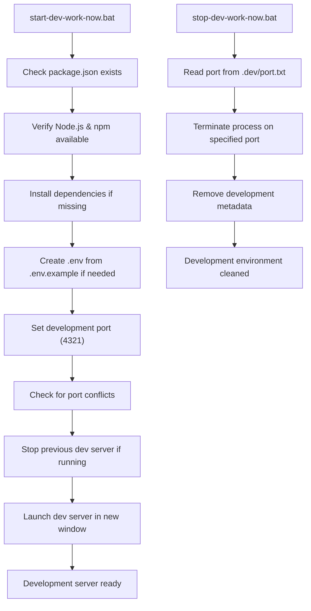

**Diagram sources**
- [start-dev-work-now.bat:1-65](file://start-dev-work-now.bat#L1-L65)
- [stop-dev-work-now.bat:1-23](file://stop-dev-work-now.bat#L1-L23)
- [.dev/README.md:1-21](file://.dev/README.md#L1-L21)

**Section sources**
- [start-dev-work-now.bat:1-65](file://start-dev-work-now.bat#L1-L65)
- [stop-dev-work-now.bat:1-23](file://stop-dev-work-now.bat#L1-L23)
- [.dev/README.md:1-21](file://.dev/README.md#L1-L21)
- [.dev/port.txt:1-2](file://.dev/port.txt#L1-L2)
- [.dev/pids.json:1-2](file://.dev/pids.json#L1-L2)
- [.dev/window.title:1-2](file://.dev/window.title#L1-L2)
- [old-stuff/g-start-dev.bat:1-61](file://old-stuff/g-start-dev.bat#L1-L61)
- [old-stuff/g-stop-dev.bat:1-55](file://old-stuff/g-stop-dev.bat#L1-L55)

## Local Development Infrastructure

### nginx.conf Reverse Proxy Configuration
The system now includes comprehensive local development infrastructure with nginx.conf reverse proxy configuration that mirrors production deployment patterns:

#### nginx.conf Features
- **SSL Termination**: HTTPS server block with Let's Encrypt certificate paths for rodion.pro and www.rodion.pro
- **Reverse Proxy**: Location block for root path proxying to 127.0.0.1:3100 for the main Astro application
- **WebSocket Support**: Proper upgrade headers for real-time features and WebSocket connections
- **Header Forwarding**: X-Real-IP, X-Forwarded-For, and X-Forwarded-Proto headers for proper client IP tracking
- **Access/Error Logging**: Dedicated access and error log files for monitoring and debugging
- **HTTP/2 Support**: Enabled for improved performance and modern browser compatibility

#### Production-like Testing Environment
The nginx.conf configuration enables developers to test their application in an environment that closely resembles production, including:
- SSL certificate handling with proper certificate chain and key paths
- WebSocket support for real-time features like activity monitoring dashboards
- Proper header forwarding for accurate client IP tracking and request context
- Access logging for monitoring traffic patterns during development
- Error logging for debugging proxy-related issues

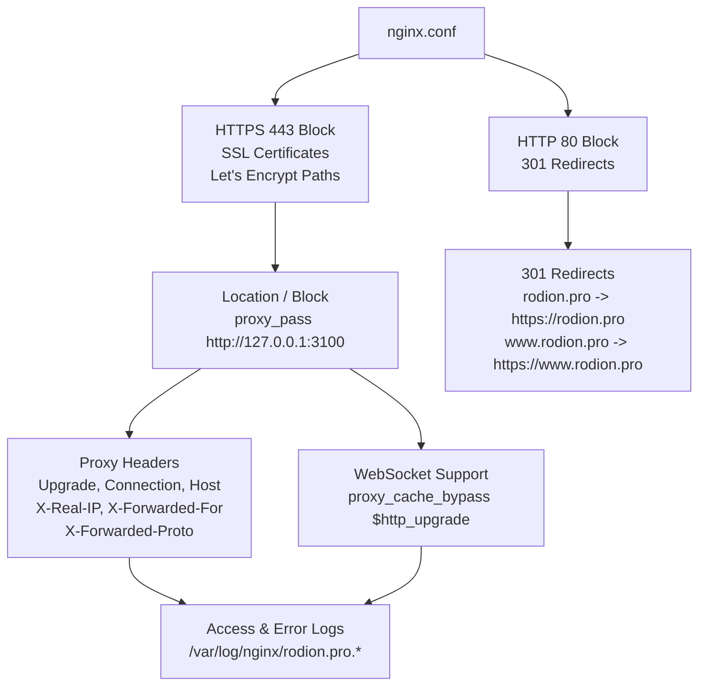

**Diagram sources**
- [nginx.conf:1-39](file://nginx.conf#L1-L39)

**Section sources**
- [nginx.conf:1-39](file://nginx.conf#L1-L39)

### start-tracking-local.bat Automation Script
The project includes a comprehensive automation script for streamlined local activity tracking workflow:

#### start-tracking-local.bat Features
- **Prerequisite Validation**: Checks for Node.js and npm availability in PATH before proceeding
- **Dependency Management**: Automatically installs activity-agent dependencies if missing
- **Process Management**: Kills any existing activity agent processes to prevent conflicts
- **Local Server Targeting**: Launches activity agent with configuration targeting localhost:4321
- **Minimized Operation**: Starts the agent minimized to reduce desktop clutter
- **User Feedback**: Provides clear status messages and instructions for local tracking setup
- **Configuration Support**: Uses config.local.json for local development settings

#### Activity Agent Configuration
The script leverages a dedicated local configuration that targets the development server:
- **Server Base URL**: http://localhost:4321 for local development
- **Device Configuration**: Pre-configured device ID and secure device key
- **Privacy Settings**: Blacklists sensitive applications like password managers
- **Category Mapping**: Comprehensive application categorization for development
- **Poll Interval**: 10-second polling interval optimized for local testing

#### System Tray Integration
The activity agent provides enhanced user experience with:
- **System Tray Icon**: Green tray icon for easy visibility and control
- **Right-click Menu**: Context menu for stopping the agent gracefully
- **Process Management**: Proper signal handling for clean shutdown
- **Error Reporting**: Console output for debugging and monitoring

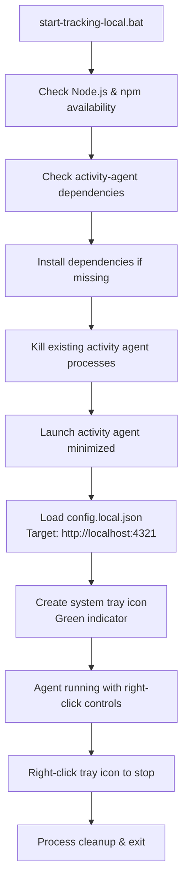

**Diagram sources**
- [start-tracking-local.bat:1-39](file://start-tracking-local.bat#L1-L39)
- [activity-agent/config.local.json:1-37](file://activity-agent/config.local.json#L1-L37)
- [activity-agent/src/index.ts:355-367](file://activity-agent/src/index.ts#L355-L367)

**Section sources**
- [start-tracking-local.bat:1-39](file://start-tracking-local.bat#L1-L39)
- [activity-agent/package.json:1-24](file://activity-agent/package.json#L1-L24)
- [activity-agent/src/index.ts:1-387](file://activity-agent/src/index.ts#L1-L387)
- [activity-agent/config.local.json:1-37](file://activity-agent/config.local.json#L1-L37)

## Activity Monitoring Infrastructure

### Activity Monitoring Service Architecture
The system now includes a comprehensive activity monitoring infrastructure designed for privacy-conscious data collection and real-time visualization:

#### Core Components
- **Activity Agent (Windows)**: TypeScript-based agent that collects active window, AFK status, and input counts every 10 seconds
- **Activity Service**: Standalone Express server running on port 4010 with health checks and API endpoints
- **Database Schema**: Dedicated tables for device registration, minute-level aggregation, current state tracking, and new activity notes storage
- **Privacy Controls**: Application blacklisting, category-only reporting, and configurable privacy rules
- **Real-time Dashboards**: Live updates via Server-Sent Events (SSE) and public/private view separation
- **Quick Notes System**: Encrypted note storage with privacy controls and hotkey support

#### Database Schema Design
The activity monitoring system introduces four specialized tables:
- **activity_devices**: Stores registered devices with hashed API keys and metadata
- **activity_minute_agg**: Aggregates activity data by minute to prevent database bloat
- **activity_now**: Maintains current state per device for fast access
- **activity_notes**: Stores encrypted notes with privacy controls and metadata

#### API Endpoints
- **POST /api/activity/v1/ingest**: Receives activity data from agents with device authentication
- **GET /api/activity/v1/now**: Current activity state (private access)
- **GET /api/activity/v1/stats**: Historical statistics (private access)
- **GET /api/activity/v1/stream**: SSE stream for live dashboard updates (private access)
- **GET /api/activity/v1/public**: Safe public view without sensitive information
- **POST /api/activity/v1/notes/ingest**: Quick notes ingestion with encrypted storage
- **GET /api/activity/v1/notes**: Notes listing with pagination and filtering
- **GET /api/activity/v1/notes/[id]**: Individual note retrieval with decryption

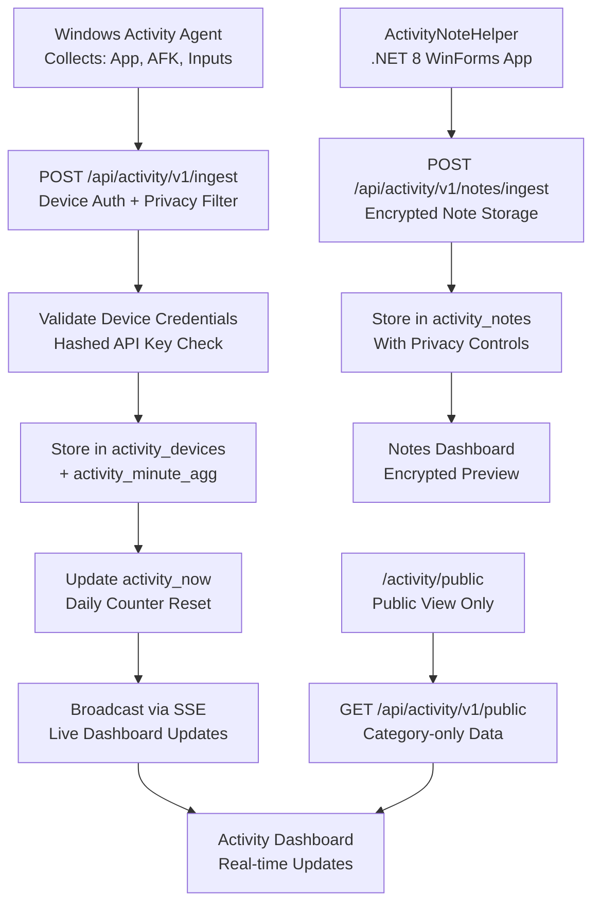

**Diagram sources**
- [ACTIVITY_MONITORING_SETUP.md:8-30](file://ACTIVITY_MONITORING_SETUP.md#L8-L30)
- [src/pages/api/activity/v1/ingest.ts:1-188](file://src/pages/api/activity/v1/ingest.ts#L1-L188)
- [src/pages/api/activity/v1/public.ts:1-65](file://src/pages/api/activity/v1/public.ts#L1-L65)
- [src/pages/api/activity/v1/notes/ingest.ts:1-109](file://src/pages/api/activity/v1/notes/ingest.ts#L1-L109)
- [drizzle/0002_activity_monitoring.sql:1-46](file://drizzle/0002_activity_monitoring.sql#L1-L46)
- [drizzle/0003_activity_notes.sql:1-24](file://drizzle/0003_activity_notes.sql#L1-L24)

**Section sources**
- [ACTIVITY_MONITORING_SETUP.md:1-189](file://ACTIVITY_MONITORING_SETUP.md#L1-L189)
- [drizzle/0002_activity_monitoring.sql:1-46](file://drizzle/0002_activity_monitoring.sql#L1-L46)
- [drizzle/0003_activity_notes.sql:1-24](file://drizzle/0003_activity_notes.sql#L1-L24)
- [src/pages/api/activity/v1/ingest.ts:1-188](file://src/pages/api/activity/v1/ingest.ts#L1-L188)
- [src/pages/api/activity/v1/public.ts:1-65](file://src/pages/api/activity/v1/public.ts#L1-L65)
- [src/pages/api/activity/v1/notes/ingest.ts:1-109](file://src/pages/api/activity/v1/notes/ingest.ts#L1-L109)

### Device Registration and Management
The system provides automated device registration through a Node.js utility that handles API key hashing and database insertion:

#### Device Registration Process
- Generates SHA256 hash of device key for secure storage
- Inserts device into activity_devices table with conflict resolution
- Returns registration confirmation with usage instructions
- Supports command-line parameters for automation

#### Privacy and Security Features
- Device authentication via hashed API keys stored in database
- Admin token authentication for private endpoints
- Application blacklisting for sensitive software (password managers, etc.)
- Category-only reporting mode for public visibility
- Configurable privacy rules and title pattern filtering

**Section sources**
- [register-device.cjs:1-46](file://register-device.cjs#L1-L46)
- [ACTIVITY_MONITORING_SETUP.md:31-129](file://ACTIVITY_MONITORING_SETUP.md#L31-L129)

### Real-time Dashboard Implementation
The activity monitoring system includes sophisticated real-time dashboard capabilities:

#### Dashboard Features
- **Live Updates**: Server-Sent Events (SSE) for instant dashboard refresh
- **Dual Views**: Private dashboard with detailed information vs. public view with aggregated data
- **Historical Analysis**: Time-series charts with configurable grouping (hourly/daily)
- **Category Analytics**: Usage breakdown by application categories
- **Input Metrics**: Keyboard inputs, mouse clicks, and scrolling activity tracking
- **Notes Dashboard**: Secure encrypted note visualization with privacy controls

#### Technical Implementation
- **SSE Management**: In-memory connection tracking with automatic cleanup
- **Data Aggregation**: Minute-level aggregation to optimize database performance
- **Session-based Access**: Admin authentication for private endpoints
- **Fallback Mechanisms**: Polling as backup to SSE streaming

**Section sources**
- [src/components/ActivityDashboard.tsx:1-457](file://src/components/ActivityDashboard.tsx#L1-L457)
- [src/lib/activity.ts:1-154](file://src/lib/activity.ts#L1-L154)
- [src/lib/activity-db.ts:1-49](file://src/lib/activity-db.ts#L1-L49)

### ActivityNoteHelper .NET 8 WinForms Application
The system includes a dedicated ActivityNoteHelper application providing quick notes functionality with enhanced privacy controls:

#### Application Features
- **Global Hotkey Support**: Default Ctrl+Alt+N for quick note capture
- **Encrypted Note Storage**: AES encryption for note content protection
- **Privacy Controls**: Configurable redaction and blacklist applications
- **Context Awareness**: Foreground application detection and categorization
- **Toast Notifications**: Non-intrusive balloon tips for user feedback
- **Settings Management**: GUI-based configuration with environment variable overrides

#### Technical Implementation
- **WinForms Interface**: Modern dark theme interface with customizable colors
- **JSON Configuration**: External config.json for persistent settings
- **Environment Variable Support**: Runtime overrides for deployment flexibility
- **Device Authentication**: X-Device-Id and X-Device-Key headers for API security
- **Security Measures**: Input validation, length limits, and suspicious content detection

#### Configuration Options
- **Server Base URL**: Target server for note submission (default: http://localhost:4321)
- **Device ID**: Unique identifier for the device registration
- **Device Key**: Secret key for device authentication
- **Hotkey**: Customizable global hotkey combination
- **Redact**: Enable/disable content redaction in previews
- **Max Length**: Maximum note length (default: 8192 characters)
- **Blacklist Apps**: Applications that block note capture

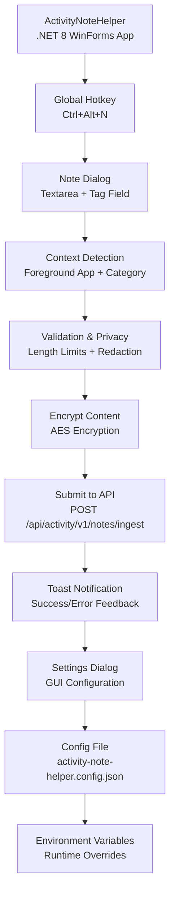

**Diagram sources**
- [tools/activity-note-helper/Program.cs:1-630](file://tools/activity-note-helper/Program.cs#L1-L630)
- [tools/activity-note-helper/activity-note-helper.config.json:1-10](file://tools/activity-note-helper/activity-note-helper.config.json#L1-L10)
- [src/pages/api/activity/v1/notes/ingest.ts:1-109](file://src/pages/api/activity/v1/notes/ingest.ts#L1-L109)

**Section sources**
- [tools/activity-note-helper/ActivityNoteHelper.csproj:1-13](file://tools/activity-note-helper/ActivityNoteHelper.csproj#L1-L13)
- [tools/activity-note-helper/Program.cs:1-630](file://tools/activity-note-helper/Program.cs#L1-L630)
- [tools/activity-note-helper/activity-note-helper.config.json:1-10](file://tools/activity-note-helper/activity-note-helper.config.json#L1-L10)
- [src/pages/api/activity/v1/notes/ingest.ts:1-109](file://src/pages/api/activity/v1/notes/ingest.ts#L1-L109)

## Containerized Deployment with Docker

### Docker Compose Configuration
The system supports containerized deployment using Docker Compose for consistent environment provisioning:

#### PostgreSQL Service
- **Image**: postgres:15 (latest stable version)
- **Port Mapping**: 5432:5432 for database access
- **Volume Management**: Persistent volume for data persistence
- **Environment Variables**: Database name, user, and password configuration
- **Restart Policy**: Unless-stopped for reliability

#### Container Benefits
- **Consistent Environment**: Standardized PostgreSQL 15 deployment
- **Easy Scaling**: Simple container management for development and testing
- **Resource Isolation**: Clean separation from host system dependencies
- **Backup Support**: Volume-based data persistence for easy backups

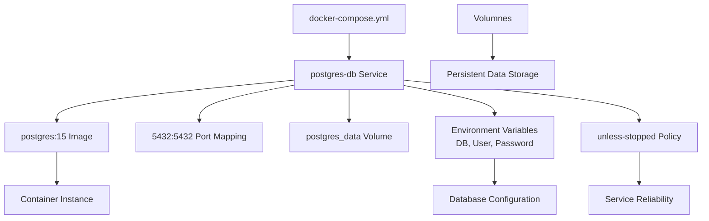

**Diagram sources**
- [docker-compose.yml:1-18](file://docker-compose.yml#L1-L18)

**Section sources**
- [docker-compose.yml:1-18](file://docker-compose.yml#L1-L18)

### Containerized Deployment Workflow
The Docker-based deployment provides a streamlined approach to environment setup:

#### Setup Process
1. **Prerequisites**: Docker and Docker Compose installed on target system
2. **Configuration**: Review and customize docker-compose.yml as needed
3. **Startup**: Run `docker compose up -d` to start services
4. **Verification**: Check container status and database accessibility
5. **Migration**: Execute database migrations using existing Drizzle setup
6. **Application Deployment**: Deploy main Astro application with standard workflow

#### Benefits
- **Rapid Setup**: One-command deployment of complete environment
- **Environment Parity**: Consistent database version across development and production
- **Easy Maintenance**: Simple container management and updates
- **Resource Control**: Built-in resource limits and monitoring

**Section sources**
- [docker-compose.yml:1-18](file://docker-compose.yml#L1-L18)
- [README.md:71-153](file://README.md#L71-L153)

## Systemd Service Management

### Activity Service Systemd Configuration
The activity monitoring service is managed through systemd for production-grade reliability and automatic restart capabilities:

#### Service Configuration
- **Unit Description**: Activity Monitoring Service for rodion.pro
- **Execution**: Simple service type with dedicated user (rodion)
- **Working Directory**: /var/www/rodion.pro for proper file access
- **Environment**: NODE_ENV=production and PORT=4010 for service isolation
- **Restart Policy**: Always restart with 10-second delay for resilience

#### Service Benefits
- **Automatic Startup**: System boots with service enabled
- **Process Isolation**: Dedicated user and working directory
- **Resource Management**: systemd handles process limits and monitoring
- **Logging Integration**: Native systemd journal integration
- **Graceful Shutdown**: Proper signal handling for clean shutdown

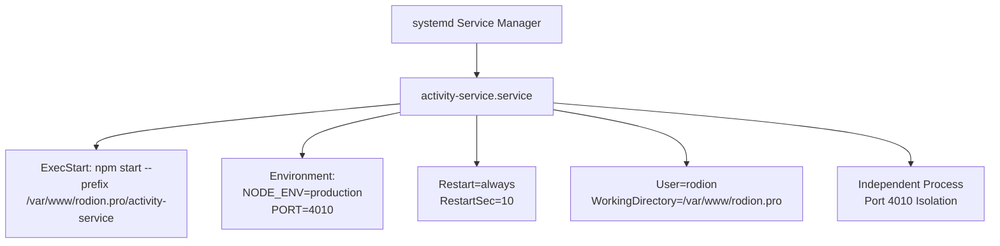

**Diagram sources**
- [activity-service.service:1-16](file://activity-service.service#L1-L16)

**Section sources**
- [activity-service.service:1-16](file://activity-service.service#L1-L16)

### Production Deployment with Systemd
The systemd service provides enterprise-grade deployment capabilities:

#### Deployment Steps
1. **Service Installation**: Copy service file to /etc/systemd/system/
2. **Reload Daemon**: Run `sudo systemctl daemon-reload`
3. **Enable Service**: `sudo systemctl enable activity-service`
4. **Start Service**: `sudo systemctl start activity-service`
5. **Monitor Status**: `sudo systemctl status activity-service`
6. **View Logs**: `sudo journalctl -u activity-service -f`

#### Monitoring and Maintenance
- **Health Checks**: Built-in /health endpoint for service monitoring
- **Process Management**: Automatic restart on failure
- **Log Integration**: Systemd journal for centralized logging
- **Resource Limits**: systemd-controlled resource allocation
- **Graceful Shutdown**: Proper signal handling for clean service termination

**Section sources**
- [activity-service.service:1-16](file://activity-service.service#L1-L16)
- [activity-service.js:1-40](file://activity-service.js#L1-L40)

## Detailed Component Analysis

### Astro Build Configuration
- Output: server (SSR)
- Adapter: @astrojs/node in standalone mode
- Integrations: React islands, Tailwind CSS, MDX, Sitemap with i18n locales
- i18n: default locale ru with route prefixes and en locale
- Site URL configured for production

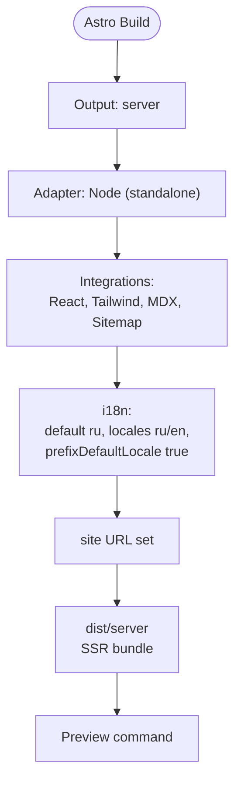

**Diagram sources**
- [astro.config.ts:8-37](file://astro.config.ts#L8-L37)

**Section sources**
- [astro.config.ts:8-37](file://astro.config.ts#L8-L37)

### Asset Optimization and Build Pipeline
- Build command generates SSR assets under dist/server and dist/client.
- Tailwind CSS is configured with content globs covering Astro and TS sources; dark mode and custom theme variables are supported.
- TypeScript configuration extends Astro's strict base, enabling JSX with React and strict null checks.

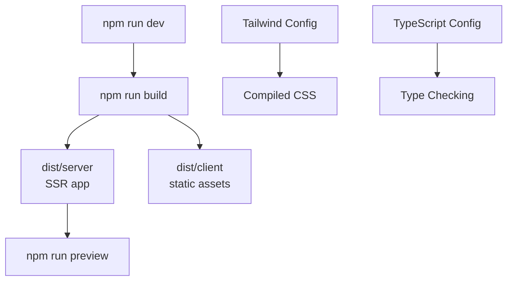

**Diagram sources**
- [package.json:5-16](file://package.json#L5-L16)
- [tailwind.config.ts:3-32](file://tailwind.config.ts#L3-L32)
- [tsconfig.json:3-12](file://tsconfig.json#L3-L12)

**Section sources**
- [package.json:5-16](file://package.json#L5-L16)
- [tailwind.config.ts:3-32](file://tailwind.config.ts#L3-L32)
- [tsconfig.json:3-12](file://tsconfig.json#L3-L12)

### Environment Variable Handling
- Required variables include site URL, database connection string, GitHub webhook secret, deploy token, Google OAuth client credentials, admin emails, activity monitoring configuration, and optional Cloudflare Turnstile keys.
- Astro's import.meta.env is typed to ensure compile-time awareness of required variables.
- Runtime behavior depends on NODE_ENV and PORT set by pm2 and systemd.
- **Updated** PM2 ecosystem configuration now includes dotenv integration for automatic environment variable loading in production deployments.
- **Updated** Activity monitoring service uses dedicated environment variables for database connectivity and admin token configuration.
- **Updated** Enhanced database connection management with graceful fallback mechanisms and improved error handling for production deployments.
- **Updated** ActivityNoteHelper supports environment variable overrides for flexible deployment configurations.

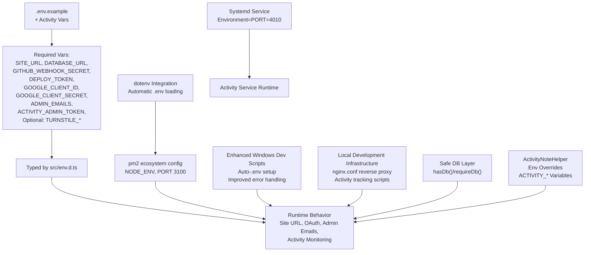

**Diagram sources**
- [.env.example:1-26](file://.env.example#L1-L26)
- [src/env.d.ts:4-14](file://src/env.d.ts#L4-L14)
- [ecosystem.config.cjs:1-29](file://ecosystem.config.cjs#L1-L29)
- [activity-service.service:9-10](file://activity-service.service#L9-L10)
- [start-dev-work-now.bat:24-30](file://start-dev-work-now.bat#L24-L30)
- [nginx.conf:1-39](file://nginx.conf#L1-L39)
- [start-tracking-local.bat:1-39](file://start-tracking-local.bat#L1-L39)
- [src/db/index.ts:18-45](file://src/db/index.ts#L18-L45)
- [tools/activity-note-helper/Program.cs:68-79](file://tools/activity-note-helper/Program.cs#L68-L79)

**Section sources**
- [.env.example:1-26](file://.env.example#L1-L26)
- [src/env.d.ts:4-14](file://src/env.d.ts#L4-L14)
- [ecosystem.config.cjs:1-29](file://ecosystem.config.cjs#L1-L29)
- [activity-service.service:9-10](file://activity-service.service#L9-L10)
- [documentation/tasks/000-rodion-pro-qoder-task.md:47-66](file://documentation/tasks/000-rodion-pro-qoder-task.md#L47-L66)
- [src/db/index.ts:1-48](file://src/db/index.ts#L1-L48)
- [nginx.conf:1-39](file://nginx.conf#L1-L39)
- [start-tracking-local.bat:1-39](file://start-tracking-local.bat#L1-L39)
- [tools/activity-note-helper/Program.cs:68-79](file://tools/activity-note-helper/Program.cs#L68-L79)

### Database Schema and Migrations
- Drizzle schema defines users, oauth_accounts, sessions, comments, reactions, comment_flags, events, and new activity monitoring tables with appropriate constraints and indexes.
- Drizzle configuration reads DATABASE_URL from environment and targets PostgreSQL.
- Initial migration SQL and activity monitoring migration define baseline and specialized schemas respectively.
- **Updated** Activity monitoring tables include device registration, minute-level aggregation, current state tracking, and new activity notes table with encrypted content storage.
- **Updated** Enhanced database connection management with graceful fallback mechanisms and improved error handling for production deployments.

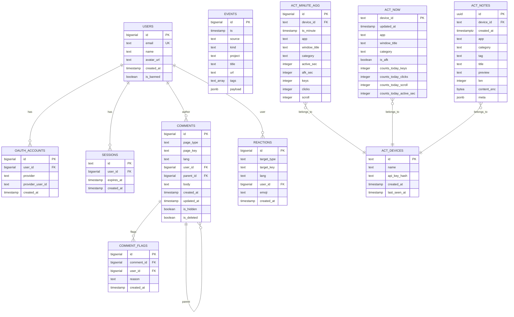

**Diagram sources**
- [src/db/schema/index.ts:1-104](file://src/db/schema/index.ts#L1-L104)
- [drizzle/0001_initial.sql:1-94](file://drizzle/0001_initial.sql#L1-L94)
- [drizzle/0002_activity_monitoring.sql:1-46](file://drizzle/0002_activity_monitoring.sql#L1-L46)
- [drizzle/0003_activity_notes.sql:1-24](file://drizzle/0003_activity_notes.sql#L1-L24)
- [drizzle/meta/_journal.json:1-13](file://drizzle/meta/_journal.json#L1-L13)

**Section sources**
- [drizzle.config.ts:3-10](file://drizzle.config.ts#L3-L10)
- [src/db/schema/index.ts:1-104](file://src/db/schema/index.ts#L1-L104)
- [drizzle/0001_initial.sql:1-94](file://drizzle/0001_initial.sql#L1-L94)
- [drizzle/0002_activity_monitoring.sql:1-46](file://drizzle/0002_activity_monitoring.sql#L1-L46)
- [drizzle/0003_activity_notes.sql:1-24](file://drizzle/0003_activity_notes.sql#L1-L24)
- [drizzle/meta/_journal.json:1-13](file://drizzle/meta/_journal.json#L1-L13)

### OAuth Flow and Session Management
- Google OAuth start endpoint constructs the authorization URL using site URL and client credentials from environment variables.
- Callback endpoint exchanges the authorization code for tokens, retrieves user info, manages user and OAuth account records, creates a session, and sets a secure session cookie.
- Session cookie is HttpOnly, secure in production, with a 30-day max age and lax sameSite policy.

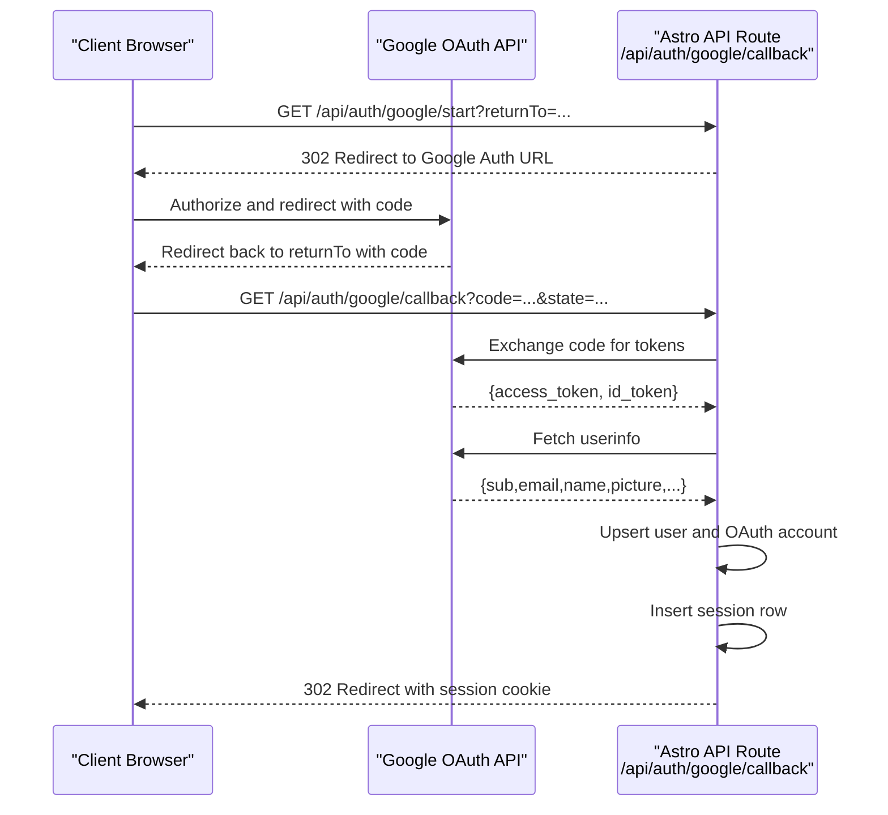

**Diagram sources**
- [src/pages/api/auth/google/start.ts:1-15](file://src/pages/api/auth/google/start.ts#L1-L15)
- [src/pages/api/auth/google/callback.ts:1-114](file://src/pages/api/auth/google/callback.ts#L1-L114)
- [src/lib/auth.ts:41-100](file://src/lib/auth.ts#L41-L100)
- [src/lib/session.ts:13-54](file://src/lib/session.ts#L13-L54)

**Section sources**
- [src/pages/api/auth/google/start.ts:1-15](file://src/pages/api/auth/google/start.ts#L1-L15)
- [src/pages/api/auth/google/callback.ts:1-114](file://src/pages/api/auth/google/callback.ts#L1-L114)
- [src/lib/auth.ts:1-101](file://src/lib/auth.ts#L1-L101)
- [src/lib/session.ts:1-58](file://src/lib/session.ts#L1-L58)

### Deployment Workflow
The deployment workflow from server preparation to production launch includes:
- Server requirements: Ubuntu 22.04+, Node.js 20+, PostgreSQL 15+, nginx, pm2, systemd
- Clone repository to /var/www/rodion.pro
- Install dependencies with npm ci
- Create production .env with required variables including activity monitoring configuration
- **Updated** PM2 ecosystem configuration now uses dotenv integration for automatic environment variable loading
- **Updated** Systemd service configuration for activity monitoring service management
- **Updated** Docker Compose setup for containerized PostgreSQL deployment
- **Updated** Local development infrastructure with nginx.conf reverse proxy configuration
- Run database migrations using provided SQL or Drizzle commands
- Build the application with npm run build
- Start with pm2 using the enhanced ecosystem configuration with dotenv integration
- **Updated** Start systemd service for activity monitoring with dedicated port (4010)
- Configure nginx reverse proxy with SSL termination and proxy to both 3100 and 4010 ports
- **Updated** Test and reload nginx with local development proxy configuration
- **Updated** Verify activity tracking functionality with start-tracking-local.bat script
- **Updated** Verify ActivityNoteHelper functionality with encrypted note storage and privacy controls

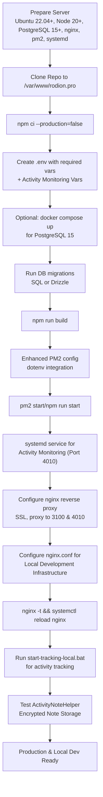

**Diagram sources**
- [README.md:71-153](file://README.md#L71-L153)
- [ecosystem.config.cjs:1-29](file://ecosystem.config.cjs#L1-L29)
- [activity-service.service:1-16](file://activity-service.service#L1-L16)
- [docker-compose.yml:1-18](file://docker-compose.yml#L1-L18)
- [nginx.conf:1-39](file://nginx.conf#L1-L39)
- [start-tracking-local.bat:1-39](file://start-tracking-local.bat#L1-L39)
- [tools/activity-note-helper/Program.cs:1-630](file://tools/activity-note-helper/Program.cs#L1-L630)

**Section sources**
- [README.md:71-153](file://README.md#L71-L153)
- [ecosystem.config.cjs:1-30](file://ecosystem.config.cjs#L1-L30)
- [activity-service.service:1-16](file://activity-service.service#L1-L16)
- [docker-compose.yml:1-18](file://docker-compose.yml#L1-L18)
- [documentation/tasks/000-rodion-pro-qoder-task.md:47-66](file://documentation/tasks/000-rodion-pro-qoder-task.md#L47-L66)
- [nginx.conf:1-39](file://nginx.conf#L1-L39)
- [start-tracking-local.bat:1-39](file://start-tracking-local.bat#L1-L39)
- [tools/activity-note-helper/Program.cs:1-630](file://tools/activity-note-helper/Program.cs#L1-L630)

### nginx Reverse Proxy and SSL with Let's Encrypt
- HTTP to HTTPS redirect for rodion.pro and www.rodion.pro
- HTTPS server block with SSL certificate and key paths for Let's Encrypt
- **Updated** Proxy configuration now includes activity monitoring service location blocks:
  - `/api/activity/` proxies to 127.0.0.1:4010 for activity endpoints
  - Special handling for Server-Sent Events (SSE) with proxy_buffering off
  - Extended proxy timeouts for real-time streaming
- Proxy pass to 127.0.0.1:3100 with WebSocket and header forwarding support

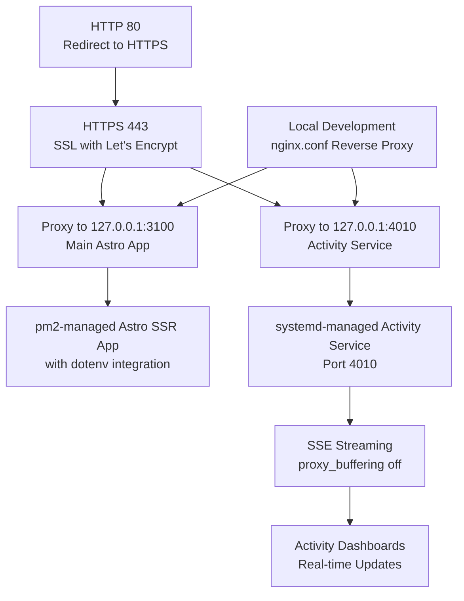

**Diagram sources**
- [README.md:118-147](file://README.md#L118-L147)
- [nginx-activity-config.conf:1-28](file://nginx-activity-config.conf#L1-L28)
- [nginx.conf:1-39](file://nginx.conf#L1-L39)

**Section sources**
- [README.md:118-147](file://README.md#L118-L147)
- [nginx-activity-config.conf:1-28](file://nginx-activity-config.conf#L1-L28)
- [nginx.conf:1-39](file://nginx.conf#L1-L39)

### Load Balancing Considerations
- pm2 configuration currently runs a single instance; horizontal scaling requires multiple instances behind a load balancer
- **Updated** Activity monitoring service runs as separate systemd service on port 4010, allowing independent scaling
- Consider sticky sessions if session storage remains in-memory; otherwise, externalize sessions to Redis or shared storage
- Ensure database connections and session stores scale horizontally
- **Updated** Activity service can be scaled independently from the main application

### Monitoring, Logs, Backups, and Maintenance
- pm2 logs are configured to write to /var/log/pm2 with timestamps
- **Updated** Activity service includes health check endpoint (/health) for monitoring
- **Updated** Systemd service provides native journal integration for activity service logs
- Monitor CPU, memory, and restart thresholds using pm2's built-in metrics
- **Updated** Activity service monitoring includes database connectivity checks and performance metrics
- Implement automated backups for PostgreSQL using pg_dump or managed service snapshots
- Schedule maintenance windows for updates and rollbacks
- **Updated** Docker-based deployments support volume-based backups for persistent data
- **Updated** Local development infrastructure includes access/error logging for nginx reverse proxy
- **Updated** ActivityNoteHelper provides encrypted note storage with privacy controls and secure metadata

**Section sources**
- [ecosystem.config.cjs:24-26](file://ecosystem.config.cjs#L24-L26)
- [activity-service.js:11-14](file://activity-service.js#L11-L14)
- [activity-service.service:1-16](file://activity-service.service#L1-L16)
- [nginx.conf:4-5](file://nginx.conf#L4-L5)
- [tools/activity-note-helper/Program.cs:1-630](file://tools/activity-note-helper/Program.cs#L1-L630)

### Rollback Procedures
- Keep previous builds in version control or artifact storage
- Switch symlink or redeploy previous tag/commit
- **Updated** Activity service rollback: stop systemd service, deploy previous version, restart service
- **Updated** Docker rollback: revert to previous PostgreSQL image/tag if needed
- Downgrade database schema using Drizzle migrations if necessary
- Use pm2 rollback or restart previous process image
- **Updated** Activity service uses graceful shutdown handling for safe rollback procedures
- **Updated** ActivityNoteHelper rollback: reinstall previous version, restore configuration files

### Performance Monitoring and Scaling
- Use pm2 monitor to track memory and CPU usage; adjust max_memory_restart thresholds accordingly
- **Updated** Activity service monitoring: health endpoint, SSE connection tracking, and performance metrics
- Scale horizontally by adding pm2 instances and placing them behind a load balancer
- **Updated** Independent scaling: main application (pm2) and activity service (systemd) can scale separately
- Optimize database queries and indexes; consider connection pooling and read replicas
- **Updated** Activity service uses connection pooling for database efficiency
- Cache static assets at CDN level and leverage browser caching headers
- **Updated** Activity service benefits from separate caching strategies from main application
- **Updated** Local development infrastructure with nginx reverse proxy provides production-like performance testing
- **Updated** ActivityNoteHelper optimized for minimal resource usage with efficient encryption and secure storage

## Dependency Analysis
The application's build and runtime dependencies are declared in package.json. Astro SSR relies on the Node adapter, while integrations include React, Tailwind, MDX, and Sitemap. Database operations depend on Drizzle ORM and PostgreSQL. Environment variables are consumed at runtime and typed via src/env.d.ts. **Updated** The activity monitoring infrastructure adds new dependencies including Express for the activity service, SSE management utilities, and privacy filtering components. **Updated** Enhanced dotenv integration provides automatic environment variable loading for production deployments. **Updated** Local development infrastructure includes nginx reverse proxy dependencies and activity agent TypeScript dependencies. **Updated** Visual Studio solution file organizes development tools with nested project structure for improved IDE navigation. **Updated** ActivityNoteHelper .NET 8 WinForms application adds WinForms dependencies and encryption libraries for secure note storage.

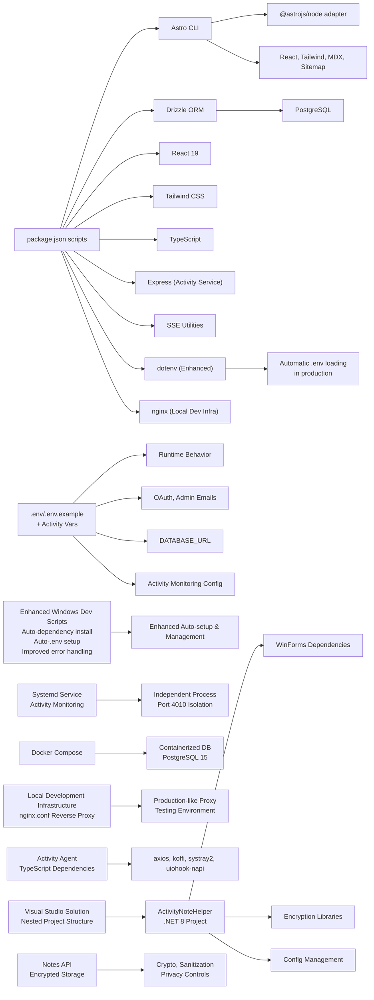

**Diagram sources**
- [package.json:18-32](file://package.json#L18-L32)
- [astro.config.ts:10-29](file://astro.config.ts#L10-L29)
- [src/env.d.ts:4-14](file://src/env.d.ts#L4-L14)
- [start-dev-work-now.bat:18-30](file://start-dev-work-now.bat#L18-L30)
- [ecosystem.config.cjs:1-29](file://ecosystem.config.cjs#L1-L29)
- [activity-service.js:3-5](file://activity-service.js#L3-L5)
- [docker-compose.yml:4-15](file://docker-compose.yml#L4-L15)
- [nginx.conf:1-39](file://nginx.conf#L1-L39)
- [activity-agent/package.json:12-22](file://activity-agent/package.json#L12-L22)
- [src/db/index.ts:18-45](file://src/db/index.ts#L18-L45)
- [rodion.pro.sln:1-33](file://rodion.pro.sln#L1-L33)
- [tools/activity-note-helper/ActivityNoteHelper.csproj:1-13](file://tools/activity-note-helper/ActivityNoteHelper.csproj#L1-L13)
- [tools/activity-note-helper/Program.cs:1-630](file://tools/activity-note-helper/Program.cs#L1-L630)

**Section sources**
- [package.json:18-32](file://package.json#L18-L32)
- [astro.config.ts:10-29](file://astro.config.ts#L10-L29)
- [src/env.d.ts:4-14](file://src/env.d.ts#L4-L14)
- [start-dev-work-now.bat:18-30](file://start-dev-work-now.bat#L18-L30)
- [ecosystem.config.cjs:1-29](file://ecosystem.config.cjs#L1-L29)
- [activity-service.js:3-5](file://activity-service.js#L3-L5)
- [docker-compose.yml:4-15](file://docker-compose.yml#L4-L15)
- [nginx.conf:1-39](file://nginx.conf#L1-L39)
- [activity-agent/package.json:12-22](file://activity-agent/package.json#L12-L22)
- [src/db/index.ts:1-48](file://src/db/index.ts#L1-L48)
- [rodion.pro.sln:1-33](file://rodion.pro.sln#L1-L33)
- [tools/activity-note-helper/ActivityNoteHelper.csproj:1-13](file://tools/activity-note-helper/ActivityNoteHelper.csproj#L1-L13)
- [tools/activity-note-helper/Program.cs:1-630](file://tools/activity-note-helper/Program.cs#L1-L630)

## Performance Considerations
- Use Astro SSR with the Node adapter for improved initial page load performance
- Minimize bundle sizes by leveraging React islands and lazy loading
- Enable gzip/br compression at nginx level and configure long-term caching for static assets
- Optimize database queries with proper indexing and limit N+1 patterns
- Monitor memory usage with pm2 and tune max_memory_restart thresholds
- **Updated** Enhanced development scripts automatically handle dependency management and provide better error reporting to prevent build failures
- **Updated** Improved environment variable loading with dotenv integration reduces startup overhead and improves reliability
- **Updated** Activity service uses connection pooling and efficient SSE management for optimal performance
- **Updated** Docker-based deployments provide consistent resource allocation and monitoring capabilities
- **Updated** Standalone Node adapter mode optimizes deployment performance and resource utilization
- **Updated** Local development infrastructure with nginx reverse proxy provides production-like performance testing environment
- **Updated** Activity agent with minimized operation and efficient polling reduces local development resource usage
- **Updated** ActivityNoteHelper optimized for minimal resource usage with efficient encryption and secure storage
- **Updated** Visual Studio solution file improves IDE performance with organized project hierarchy and faster build times

## Troubleshooting Guide
Common issues and resolutions:
- Build fails due to missing environment variables: ensure .env contains all required keys including activity monitoring variables
- Database connection errors: verify DATABASE_URL and PostgreSQL service availability, check Docker container status if using containerized deployment
- OAuth redirects fail: confirm SITE_URL matches configured OAuth redirect URIs
- pm2 process exits unexpectedly: review error logs at configured path and adjust restart thresholds
- nginx proxy errors: validate proxy headers and upstream address, check activity service location blocks
- **Updated** Activity service not responding: check systemd service status, verify port 4010 accessibility, test /health endpoint
- **Updated** Device registration failures: verify database connectivity, check API key hashing, ensure activity_devices table exists
- **Updated** SSE connection issues: verify nginx SSE configuration, check proxy_buffering settings, monitor connection counts
- **Updated** Enhanced development script errors: check Windows-specific error messages and verify Node.js/npm installation with improved error codes
- **Updated** Environment file loading issues: verify dotenv integration is available and .env file path in PM2 configuration matches actual location
- **Updated** Process termination issues: use enhanced stop-dev-work-now.bat script which provides better PID detection and window closure
- **Updated** Docker deployment issues: verify Docker Compose configuration, check volume permissions, ensure port availability
- **Updated** Database initialization failures: check hasDb() and requireDb() error handling, verify DATABASE_URL format and connectivity
- **Updated** Local development proxy issues: verify nginx.conf configuration, check SSL certificate paths, ensure proper certificate chain
- **Updated** Activity tracking failures: verify activity-agent dependencies, check config.local.json settings, ensure local server is accessible at http://localhost:4321
- **Updated** System tray icon issues: verify systray2 installation, check Windows permissions for system tray access
- **Updated** ActivityNoteHelper not capturing notes: verify hotkey registration, check device credentials, ensure API endpoint accessibility
- **Updated** Encrypted note storage failures: verify encryption keys, check database connectivity, ensure activity_notes table exists
- **Updated** Visual Studio solution file issues: verify Visual Studio version compatibility, check nested project dependencies, ensure proper solution GUID configuration

**Section sources**
- [.env.example:1-26](file://.env.example#L1-L26)
- [drizzle.config.ts:7-9](file://drizzle.config.ts#L7-L9)
- [src/lib/auth.ts:41-57](file://src/lib/auth.ts#L41-L57)
- [ecosystem.config.cjs:24-26](file://ecosystem.config.cjs#L24-L26)
- [README.md:118-147](file://README.md#L118-L147)
- [start-dev-work-now.bat:47-65](file://start-dev-work-now.bat#L47-L65)
- [stop-dev-work-now.bat:16-17](file://stop-dev-work-now.bat#L16-L17)
- [activity-service.js:25-40](file://activity-service.js#L25-L40)
- [docker-compose.yml:1-18](file://docker-compose.yml#L1-L18)
- [documentation/tasks/000-rodion-pro-qoder-task.md:47-66](file://documentation/tasks/000-rodion-pro-qoder-task.md#L47-L66)
- [src/db/index.ts:18-45](file://src/db/index.ts#L18-L45)
- [nginx.conf:1-39](file://nginx.conf#L1-L39)
- [start-tracking-local.bat:1-39](file://start-tracking-local.bat#L1-L39)
- [activity-agent/src/index.ts:355-367](file://activity-agent/src/index.ts#L355-L367)
- [tools/activity-note-helper/Program.cs:1-630](file://tools/activity-note-helper/Program.cs#L1-L630)
- [rodion.pro.sln:1-33](file://rodion.pro.sln#L1-L33)

## Conclusion
This guide outlines a complete build and deployment strategy for rodion.pro, covering Astro SSR configuration, environment handling, database migrations, production process management with pm2 using dotenv integration, and nginx reverse proxy with SSL. The enhanced development automation with comprehensive Windows scripts (start-dev-work-now.bat, stop-dev-work-now.bat) replaces older scripts and provides significantly improved local setup experience with better error handling and process management. The improved PM2 configuration ensures reliable production deployments with automatic environment variable loading through dotenv integration. **Updated** The new activity monitoring infrastructure provides comprehensive privacy-focused data collection, real-time dashboards, and automated deployment workflows. The system now includes Docker-based containerized deployment, systemd service management for the activity monitoring service, integrated monitoring capabilities, and comprehensive local development infrastructure with nginx.conf reverse proxy configuration and activity tracking automation. **Updated** Enhanced dotenv integration provides seamless environment variable management across development and production environments. **Updated** The standalone Node adapter mode optimizes deployment performance and resource utilization. **Updated** Local development infrastructure with nginx reverse proxy configuration enables production-like environment testing and activity tracking automation. **Updated** The Visual Studio solution file (rodion.pro.sln) enhances development environment organization with nested project structure, integrating the ActivityNoteHelper .NET 8 WinForms application for improved IDE navigation and build management. **Updated** ActivityNoteHelper provides comprehensive quick notes functionality with encrypted storage, privacy controls, hotkey support, and toast notifications. By following the documented workflow and operational practices, teams can reliably deploy and maintain the application in production, with clear paths for monitoring, backups, scaling, and rollbacks across both the main application and the activity monitoring service.

## Appendices
- Environment variables reference and descriptions are provided in the repository's README
- OAuth setup steps and webhook configuration are documented for seamless integration
- **Updated** Enhanced Windows development scripts provide comprehensive local development automation with improved error handling and process management
- **Updated** PM2 dotenv integration ensures consistent production deployment behavior with automatic environment variable loading
- **Updated** Enhanced development scripts replace older versions with more robust automation and better user experience
- **Updated** Activity monitoring infrastructure includes comprehensive device registration, privacy controls, and real-time dashboard capabilities
- **Updated** Docker Compose configuration provides standardized PostgreSQL 15 deployment for development and testing environments
- **Updated** Systemd service management ensures reliable operation of the activity monitoring service with automatic restart and monitoring
- **Updated** nginx configuration includes specialized location blocks for activity service with SSE support and extended timeouts
- **Updated** Enhanced database connection management provides graceful fallback mechanisms and improved error handling for production deployments
- **Updated** Standalone Node adapter mode optimizes deployment performance and resource utilization
- **Updated** Local development infrastructure with nginx.conf reverse proxy configuration provides production-like environment testing
- **Updated** Activity tracking automation with start-tracking-local.bat script streamlines local development workflow
- **Updated** Activity agent with system tray icon and local configuration support enhances developer experience
- **Updated** Visual Studio solution file organizes development tools with nested project structure for improved IDE navigation
- **Updated** ActivityNoteHelper .NET 8 WinForms application provides quick notes functionality with encrypted storage and privacy controls
- **Updated** ActivityNoteHelper configuration supports environment variable overrides for flexible deployment scenarios

**Section sources**
- [README.md:227-239](file://README.md#L227-L239)
- [README.md:155-185](file://README.md#L155-L185)
- [start-dev-work-now.bat:1-65](file://start-dev-work-now.bat#L1-L65)
- [stop-dev-work-now.bat:1-23](file://stop-dev-work-now.bat#L1-L23)
- [ecosystem.config.cjs:1-29](file://ecosystem.config.cjs#L1-L29)
- [activity-service.service:1-16](file://activity-service.service#L1-L16)
- [docker-compose.yml:1-18](file://docker-compose.yml#L1-L18)
- [nginx-activity-config.conf:1-28](file://nginx-activity-config.conf#L1-L28)
- [nginx.conf:1-39](file://nginx.conf#L1-L39)
- [ACTIVITY_MONITORING_SETUP.md:1-189](file://ACTIVITY_MONITORING_SETUP.md#L1-L189)
- [documentation/tasks/000-rodion-pro-qoder-task.md:47-66](file://documentation/tasks/000-rodion-pro-qoder-task.md#L47-L66)
- [documentation/tasks/001-start-monitoring.md:314-338](file://documentation/tasks/001-start-monitoring.md#L314-L338)
- [src/db/index.ts:1-48](file://src/db/index.ts#L1-L48)
- [start-tracking-local.bat:1-39](file://start-tracking-local.bat#L1-L39)
- [activity-agent/src/index.ts:355-367](file://activity-agent/src/index.ts#L355-L367)
- [activity-agent/config.local.json:1-37](file://activity-agent/config.local.json#L1-L37)
- [rodion.pro.sln:1-33](file://rodion.pro.sln#L1-L33)
- [tools/activity-note-helper/ActivityNoteHelper.csproj:1-13](file://tools/activity-note-helper/ActivityNoteHelper.csproj#L1-L13)
- [tools/activity-note-helper/Program.cs:1-630](file://tools/activity-note-helper/Program.cs#L1-L630)
- [tools/activity-note-helper/activity-note-helper.config.json:1-10](file://tools/activity-note-helper/activity-note-helper.config.json#L1-L10)