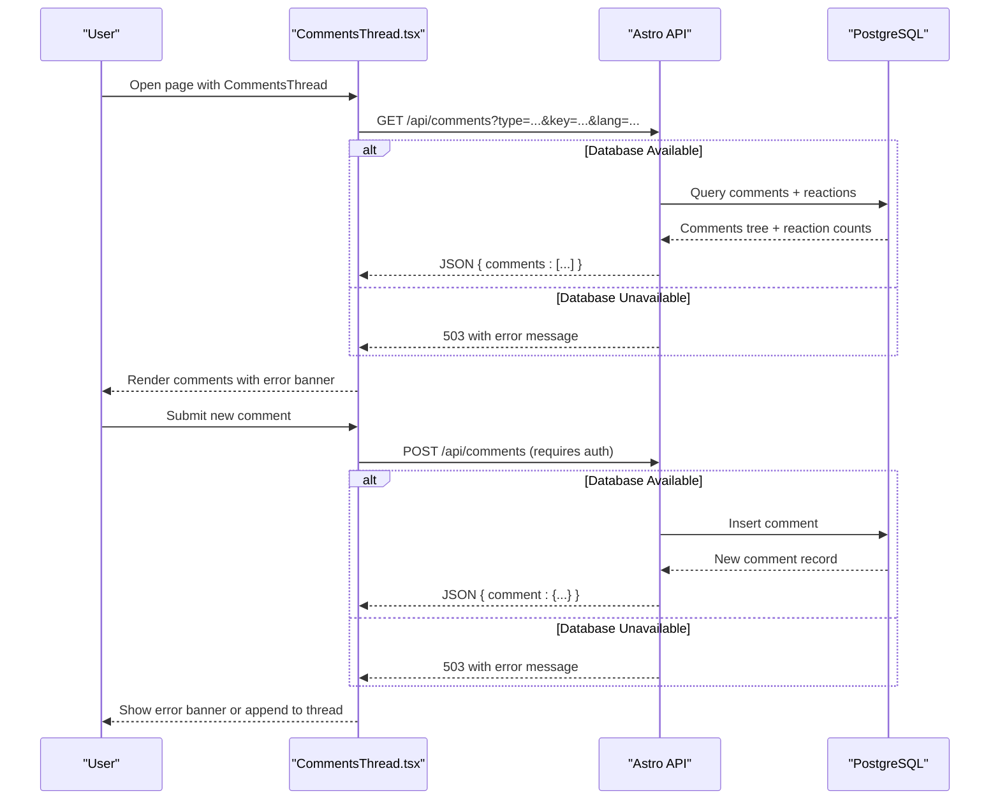
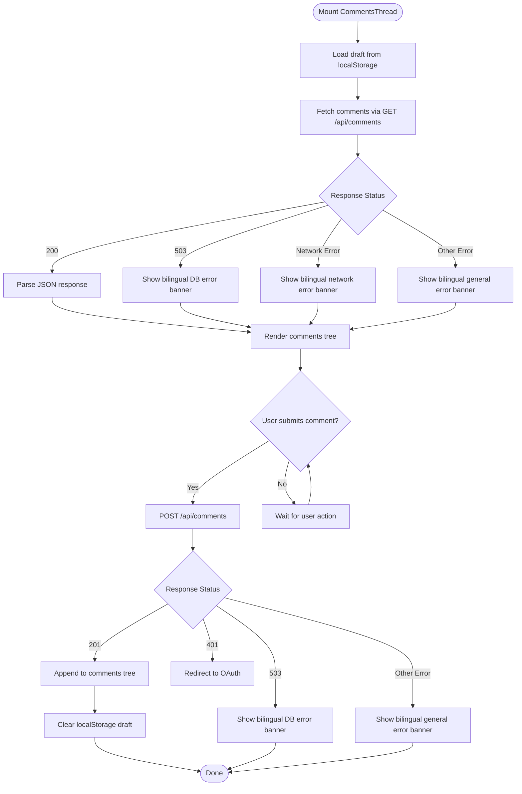
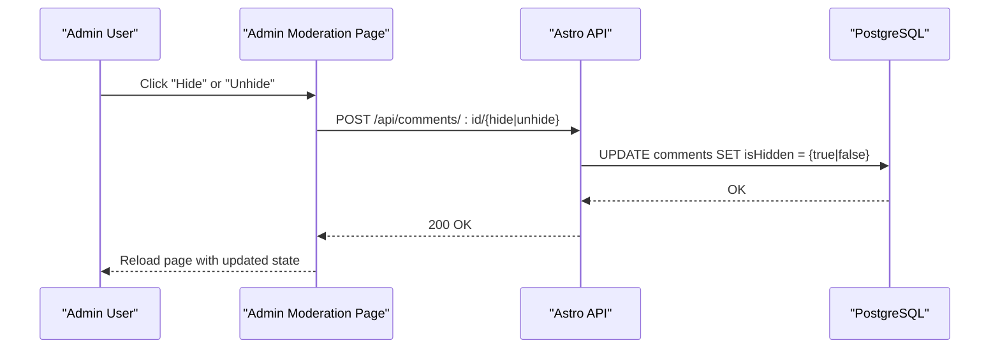
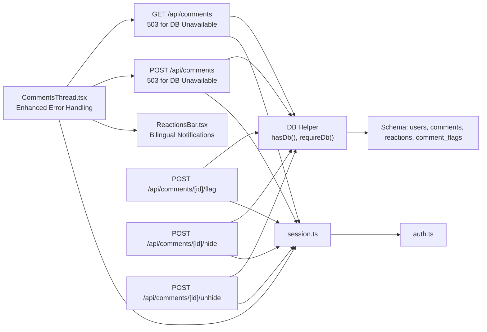

# Comment System

<cite>
**Referenced Files in This Document**
- [CommentsThread.tsx](file://src/components/CommentsThread.tsx)
- [ReactionsBar.tsx](file://src/components/ReactionsBar.tsx)
- [index.ts](file://src/pages/api/comments/index.ts)
- [flag.ts](file://src/pages/api/comments/[id]/flag.ts)
- [hide.ts](file://src/pages/api/comments/[id]/hide.ts)
- [unhide.ts](file://src/pages/api/comments/[id]/unhide.ts)
- [index.ts](file://src/db/schema/index.ts)
- [index.ts](file://src/db/index.ts)
- [session.ts](file://src/lib/session.ts)
- [auth.ts](file://src/lib/auth.ts)
- [moderation.astro](file://src/pages/admin/moderation.astro)
- [0001_initial.sql](file://drizzle/0001_initial.sql)
</cite>

## Update Summary
**Changes Made**
- Enhanced error handling in CommentsThread component with comprehensive bilingual error messages
- Added user-friendly notifications for database unavailability (503 responses), network failures, and general submission errors
- Improved user experience with graceful degradation when backend is unavailable
- Similar enhancements applied to ReactionsBar component for consistent error handling
- Backend API now returns proper 503 responses when database is not configured

## Table of Contents
1. [Introduction](#introduction)
2. [Project Structure](#project-structure)
3. [Core Components](#core-components)
4. [Architecture Overview](#architecture-overview)
5. [Detailed Component Analysis](#detailed-component-analysis)
6. [Dependency Analysis](#dependency-analysis)
7. [Performance Considerations](#performance-considerations)
8. [Security Considerations](#security-considerations)
9. [API Reference](#api-reference)
10. [Integration Examples](#integration-examples)
11. [Troubleshooting Guide](#troubleshooting-guide)
12. [Conclusion](#conclusion)

## Introduction
This document provides comprehensive documentation for the comment system component of rodion.pro. It covers the hierarchical comment architecture with threading capabilities, moderation workflows, flagging mechanisms, and real-time-like updates. The system now features enhanced error handling with comprehensive user-friendly notifications in both Russian and English, providing graceful degradation when backend services are unavailable. It also documents the API endpoints for comment CRUD operations, the CommentsThread React component implementation, moderation workflows for administrators, and security considerations including input validation and rate limiting strategies.

## Project Structure
The comment system spans frontend and backend components with enhanced error handling:
- Frontend: React components CommentsThread and ReactionsBar render comments, handle user interactions, manage local drafts, and provide user-friendly error notifications.
- Backend: Astro API routes implement comment retrieval, creation, and moderation actions with proper 503 responses for database unavailability.
- Database: Drizzle ORM schema defines tables for comments, users, reactions, and flags with optional database configuration.
- Authentication: Session-based authentication with Google OAuth integration and admin checks.

```mermaid
graph TB
subgraph "Frontend"
CT["CommentsThread.tsx<br/>Enhanced Error Handling"]
RB["ReactionsBar.tsx<br/>Bilingual Notifications"]
END
subgraph "Backend"
API_GET["GET /api/comments<br/>503 for DB Unavailable"]
API_POST["POST /api/comments<br/>503 for DB Unavailable"]
API_FLAG["POST /api/comments/[id]/flag"]
API_HIDE["POST /api/comments/[id]/hide"]
API_UNHIDE["POST /api/comments/[id]/unhide"]
MOD["Admin Moderation Page"]
END
subgraph "Database"
SCHEMA["Drizzle Schema<br/>users, comments, reactions, comment_flags"]
DB_HELPER["DB Helper<br/>hasDb(), requireDb()"]
END
subgraph "Auth"
AUTH_LIB["auth.ts"]
SESSION_LIB["session.ts"]
END
CT --> API_GET
CT --> API_POST
CT --> RB
API_GET --> DB_HELPER
API_POST --> DB_HELPER
API_FLAG --> DB_HELPER
API_HIDE --> DB_HELPER
API_UNHIDE --> DB_HELPER
MOD --> API_HIDE
MOD --> API_UNHIDE
CT --> SESSION_LIB
API_GET --> SESSION_LIB
API_POST --> SESSION_LIB
API_FLAG --> SESSION_LIB
API_HIDE --> SESSION_LIB
API_UNHIDE --> SESSION_LIB
AUTH_LIB --> SESSION_LIB
```

**Diagram sources**
- [CommentsThread.tsx](file://src/components/CommentsThread.tsx#L148-L365)
- [ReactionsBar.tsx](file://src/components/ReactionsBar.tsx#L1-L115)
- [index.ts](file://src/pages/api/comments/index.ts#L6-L239)
- [flag.ts](file://src/pages/api/comments/[id]/flag.ts#L7-L59)
- [hide.ts](file://src/pages/api/comments/[id]/hide.ts#L7-L41)
- [unhide.ts](file://src/pages/api/comments/[id]/unhide.ts#L7-L41)
- [index.ts](file://src/db/schema/index.ts#L36-L77)
- [index.ts](file://src/db/index.ts#L25-L34)
- [session.ts](file://src/lib/session.ts#L13-L54)
- [auth.ts](file://src/lib/auth.ts#L41-L100)
- [moderation.astro](file://src/pages/admin/moderation.astro#L1-L195)

**Section sources**
- [CommentsThread.tsx](file://src/components/CommentsThread.tsx#L1-L366)
- [ReactionsBar.tsx](file://src/components/ReactionsBar.tsx#L1-L115)
- [index.ts](file://src/pages/api/comments/index.ts#L1-L240)
- [index.ts](file://src/db/schema/index.ts#L1-L104)
- [index.ts](file://src/db/index.ts#L1-L37)
- [session.ts](file://src/lib/session.ts#L1-L58)
- [auth.ts](file://src/lib/auth.ts#L1-L101)
- [moderation.astro](file://src/pages/admin/moderation.astro#L1-L195)

## Core Components
- CommentsThread: A React component that renders hierarchical comments, supports replying, displays reactions, manages local drafts, and provides comprehensive error notifications in both Russian and English. It gracefully degrades when backend services are unavailable.
- ReactionsBar: Enhanced component that provides user-friendly error notifications for reaction operations with bilingual messaging and graceful degradation.
- API Routes: Astro API handlers implement comment retrieval, creation, and moderation actions with proper 503 responses when database is not configured.
- Database Helper: Provides optional database configuration with hasDb() and requireDb() functions for safe database access.
- Authentication and Session Management: Provides current user context and admin checks with graceful fallback when database is unavailable.
- Admin Moderation Page: Lists flagged and recent comments with actions to hide/unhide.

**Section sources**
- [CommentsThread.tsx](file://src/components/CommentsThread.tsx#L148-L365)
- [ReactionsBar.tsx](file://src/components/ReactionsBar.tsx#L13-L114)
- [index.ts](file://src/pages/api/comments/index.ts#L6-L239)
- [flag.ts](file://src/pages/api/comments/[id]/flag.ts#L7-L59)
- [hide.ts](file://src/pages/api/comments/[id]/hide.ts#L7-L41)
- [unhide.ts](file://src/pages/api/comments/[id]/unhide.ts#L7-L41)
- [index.ts](file://src/db/schema/index.ts#L36-L77)
- [index.ts](file://src/db/index.ts#L25-L34)
- [session.ts](file://src/lib/session.ts#L13-L54)
- [auth.ts](file://src/lib/auth.ts#L41-L100)
- [moderation.astro](file://src/pages/admin/moderation.astro#L1-L195)

## Architecture Overview
The comment system follows a layered architecture with enhanced error handling:
- Presentation Layer: CommentsThread and ReactionsBar render UI, manage user interactions, and provide comprehensive error notifications.
- API Layer: Astro routes handle requests/responses, enforce authentication/authorization, and return proper 503 responses for database unavailability.
- Persistence Layer: Drizzle ORM with optional database configuration for graceful fallback.
- Authentication Layer: Session-based auth with Google OAuth and admin role checks.



**Diagram sources**
- [CommentsThread.tsx](file://src/components/CommentsThread.tsx#L177-L281)
- [index.ts](file://src/pages/api/comments/index.ts#L6-L163)
- [index.ts](file://src/db/index.ts#L25-L34)
- [index.ts](file://src/db/schema/index.ts#L36-L51)

## Detailed Component Analysis

### CommentsThread Component
The CommentsThread component manages:
- State: comments array, loading, submitting, reply-to selection, body content, error messages, and localStorage draft persistence.
- Rendering: Builds a nested comment tree with indentation and reply toggles. Displays error banners with bilingual messages for database unavailability, network failures, and general submission errors.
- Interactions: Reply button triggers reply mode, form submission posts comments, and reactions bar integrates with reactions data.
- Real-time-like updates: After successful POST, the component appends the new comment to the appropriate place in the tree (root or reply) without a full reload.
- **Enhanced Error Handling**: Comprehensive error messages in both Russian and English for different failure scenarios including database unavailability (503), network errors, and general submission failures.



**Diagram sources**
- [CommentsThread.tsx](file://src/components/CommentsThread.tsx#L157-L281)

**Section sources**
- [CommentsThread.tsx](file://src/components/CommentsThread.tsx#L148-L365)

### ReactionsBar Component
The ReactionsBar component provides:
- State: reactions data, user reactions, loading states, and error messages.
- Interactions: Toggle reactions with proper error handling and user feedback.
- **Enhanced Error Handling**: Bilingual error notifications for database unavailability (503), network errors, and general reaction failures.
- Graceful Degradation: Shows error banners instead of failing silently when backend services are unavailable.

**Section sources**
- [ReactionsBar.tsx](file://src/components/ReactionsBar.tsx#L13-L114)

### API Endpoints

#### GET /api/comments
- Purpose: Retrieve hierarchical comments for a given page and language.
- Query Parameters:
  - type: Page type identifier.
  - key: Page key identifier.
  - lang: Language code (default: ru).
- Authentication: Optional (no user required).
- Response: { comments: CommentNode[] } where CommentNode includes id, body, timestamps, user, reactions, userReactions, and replies.
- **Enhanced Error Handling**: Returns 503 with JSON error message when database is not configured, enabling graceful degradation in frontend components.

Validation and behavior:
- Returns 503 if database is not configured.
- Returns 400 if required parameters are missing.
- Builds a tree from flat records using parent-child relationships.
- Excludes deleted content from body but preserves metadata.

**Section sources**
- [index.ts](file://src/pages/api/comments/index.ts#L6-L163)

#### POST /api/comments
- Purpose: Create a new comment (root or reply).
- Request Body:
  - pageType: string
  - pageKey: string
  - lang: string
  - parentId: number (optional)
  - body: string (trimmed)
- Authentication: Required (401 if not authenticated).
- Validation:
  - Missing required fields → 400.
  - Body length > 5000 → 400.
- Response: 201 with created comment object.
- **Enhanced Error Handling**: Returns 503 with JSON error message when database is not configured, enabling graceful degradation in frontend components.

**Section sources**
- [index.ts](file://src/pages/api/comments/index.ts#L165-L239)

#### POST /api/comments/[id]/flag
- Purpose: Report a comment for moderation.
- Authentication: Required (401 if not authenticated).
- Request Body:
  - reason: string (optional)
- Validation:
  - Invalid ID → 400.
  - Comment not found → 404.
- Response: 200 on success.

**Section sources**
- [flag.ts](file://src/pages/api/comments/[id]/flag.ts#L7-L59)

#### POST /api/comments/[id]/hide
- Purpose: Hide a comment (admin only).
- Authentication: Admin required (403 if not admin).
- Response: 200 on success.

**Section sources**
- [hide.ts](file://src/pages/api/comments/[id]/hide.ts#L7-L41)

#### POST /api/comments/[id]/unhide
- Purpose: Unhide a comment (admin only).
- Authentication: Admin required (403 if not admin).
- Response: 200 on success.

**Section sources**
- [unhide.ts](file://src/pages/api/comments/[id]/unhide.ts#L7-L41)

### Database Schema
The schema defines:
- users: id, email (unique), name, avatarUrl, createdAt, isBanned.
- comments: id, pageType, pageKey, lang, userId (FK), parentId (self-FK), body, createdAt, updatedAt, isHidden, isDeleted.
- reactions: targetType, targetKey, lang, userId (FK), emoji, createdAt (unique per user+emoji+target).
- comment_flags: id, commentId (FK), userId (FK), reason, createdAt.

Indexes:
- comments_page_idx, comments_parent_idx for efficient queries.
- reactions_target_idx, reactions_user_idx for reaction analytics.
- flags_comment_idx for flag aggregation.

**Section sources**
- [index.ts](file://src/db/schema/index.ts#L36-L77)
- [0001_initial.sql](file://drizzle/0001_initial.sql#L36-L77)

### Database Helper Functions
The database helper provides:
- hasDb(): Returns boolean indicating if database is configured and available.
- requireDb(): Returns database instance or throws error if not configured.
- Safe initialization: Database connection attempts are wrapped in try-catch blocks to prevent crashes during SSR.

**Section sources**
- [index.ts](file://src/db/index.ts#L25-L34)

### Authentication and Authorization
- Session Management: Cookie-based sessions with secure, httpOnly attributes in production. Session duration is 30 days.
- Current User: Retrieved from session cookie; banned users are rejected.
- Admin Check: Admin emails are configured via ADMIN_EMAILS environment variable.
- OAuth: Google OAuth integration supports sign-in; unauthenticated users are redirected to Google OAuth flow when posting.
- **Graceful Degradation**: Session handling works even when database is unavailable, returning null for user context instead of throwing errors.

**Section sources**
- [session.ts](file://src/lib/session.ts#L13-L54)
- [auth.ts](file://src/lib/auth.ts#L15-L31)
- [auth.ts](file://src/lib/auth.ts#L97-L100)
- [CommentsThread.tsx](file://src/components/CommentsThread.tsx#L227-L232)

### Admin Moderation Workflow
The moderation page aggregates:
- Flagged comments: Grouped by commentId with flag counts and latest reasons.
- Recent comments: Ordered by creation time with page context.
Actions:
- Hide/Unhide buttons trigger POST /api/comments/[id]/hide or /api/comments/[id]/unhide respectively.
- UI reloads after successful action.



**Diagram sources**
- [moderation.astro](file://src/pages/admin/moderation.astro#L169-L194)
- [hide.ts](file://src/pages/api/comments/[id]/hide.ts#L26-L28)
- [unhide.ts](file://src/pages/api/comments/[id]/unhide.ts#L26-L28)

**Section sources**
- [moderation.astro](file://src/pages/admin/moderation.astro#L1-L195)

## Dependency Analysis
The comment system exhibits clear separation of concerns with enhanced error handling:
- CommentsThread depends on:
  - Astro API endpoints for data and mutations with proper error handling.
  - Local storage for drafts.
  - ReactionsBar for reaction UI with bilingual error notifications.
- API routes depend on:
  - Database helper for safe database access with hasDb() checks.
  - Session library for authentication/authorization.
- Database helper defines safe initialization with graceful fallback when database is unavailable.
- ReactionsBar provides consistent error handling patterns across the application.



**Diagram sources**
- [CommentsThread.tsx](file://src/components/CommentsThread.tsx#L177-L281)
- [ReactionsBar.tsx](file://src/components/ReactionsBar.tsx#L25-L77)
- [index.ts](file://src/pages/api/comments/index.ts#L6-L239)
- [flag.ts](file://src/pages/api/comments/[id]/flag.ts#L7-L59)
- [hide.ts](file://src/pages/api/comments/[id]/hide.ts#L7-L41)
- [unhide.ts](file://src/pages/api/comments/[id]/unhide.ts#L7-L41)
- [index.ts](file://src/db/schema/index.ts#L36-L77)
- [index.ts](file://src/db/index.ts#L25-L34)
- [session.ts](file://src/lib/session.ts#L13-L54)
- [auth.ts](file://src/lib/auth.ts#L41-L100)

**Section sources**
- [CommentsThread.tsx](file://src/components/CommentsThread.tsx#L1-L366)
- [ReactionsBar.tsx](file://src/components/ReactionsBar.tsx#L1-L115)
- [index.ts](file://src/pages/api/comments/index.ts#L1-L240)
- [index.ts](file://src/db/schema/index.ts#L1-L104)
- [index.ts](file://src/db/index.ts#L1-L37)
- [session.ts](file://src/lib/session.ts#L1-L58)
- [auth.ts](file://src/lib/auth.ts#L1-L101)

## Performance Considerations
- Database Indexes: Comments are indexed by page and creation time, and by parent for threaded queries. Reactions are indexed by target and user for fast aggregation and uniqueness.
- Tree Building: Backend constructs a comment tree from flat records; keep page comment volumes reasonable to avoid deep recursion on the frontend.
- Reaction Aggregation: Backend precomputes reaction counts and user reactions to minimize client-side computation.
- Caching: Consider adding CDN caching for GET /api/comments responses if content is static per page/lang combination.
- Pagination: For very large threads, implement pagination or lazy-loading replies.
- **Graceful Degradation**: Frontend components handle 503 responses gracefully, showing user-friendly error messages instead of crashing.

## Security Considerations
- Authentication:
  - All mutation endpoints require authentication; unauthenticated users receive 401.
  - Admin-only endpoints (hide/unhide) additionally check isAdmin.
- Input Validation:
  - POST /api/comments validates presence of required fields and enforces a maximum body length.
  - ID parsing validates numeric IDs and returns 400 for invalid inputs.
- Rate Limiting:
  - Not implemented in the current codebase. Recommended strategies:
    - Per-user rate limits on POST /api/comments.
    - IP-based limits for anonymous users.
    - CAPTCHA for high-volume submissions.
- Sanitization:
  - No explicit HTML sanitization is present. Consider sanitizing user content before storing or rendering to prevent XSS.
- Session Security:
  - Secure, httpOnly cookies with SameSite lax and appropriate maxAge are used.
- Admin Access:
  - Admin emails are configured via environment variables; ensure secrets are properly managed.
- **Database Safety**: Database initialization is wrapped in try-catch blocks to prevent crashes during SSR and provide graceful fallback when database is unavailable.

**Section sources**
- [index.ts](file://src/pages/api/comments/index.ts#L165-L239)
- [flag.ts](file://src/pages/api/comments/[id]/flag.ts#L18-L24)
- [hide.ts](file://src/pages/api/comments/[id]/hide.ts#L11-L16)
- [unhide.ts](file://src/pages/api/comments/[id]/unhide.ts#L11-L16)
- [auth.ts](file://src/lib/auth.ts#L15-L31)
- [auth.ts](file://src/lib/auth.ts#L97-L100)
- [index.ts](file://src/db/index.ts#L10-L23)

## API Reference

### GET /api/comments
- Description: Retrieve hierarchical comments for a page and language.
- Query Parameters:
  - type (required): string
  - key (required): string
  - lang (optional): string (default: ru)
- Response: 200 OK with { comments: CommentNode[] }
- **Enhanced Error Handling**: 503 (DB not configured) with JSON error message
- Errors: 503 (DB not configured), 400 (missing parameters), 500 (internal error)

**Section sources**
- [index.ts](file://src/pages/api/comments/index.ts#L6-L163)

### POST /api/comments
- Description: Create a new comment (root or reply).
- Headers: Content-Type: application/json
- Request Body:
  - pageType (required): string
  - pageKey (required): string
  - lang (required): string
  - parentId (optional): number
  - body (required): string (trimmed)
- Response: 201 Created with { comment: CommentNode }
- **Enhanced Error Handling**: 503 (DB not configured) with JSON error message
- Errors: 503 (DB not configured), 401 (unauthorized), 400 (validation), 500 (internal error)

**Section sources**
- [index.ts](file://src/pages/api/comments/index.ts#L165-L239)

### POST /api/comments/[id]/flag
- Description: Flag a comment for moderation.
- Request Body:
  - reason (optional): string
- Response: 200 OK with { success: true }
- Errors: 401 (unauthorized), 400 (invalid ID), 404 (not found), 500 (internal error)

**Section sources**
- [flag.ts](file://src/pages/api/comments/[id]/flag.ts#L7-L59)

### POST /api/comments/[id]/hide
- Description: Hide a comment (admin only).
- Response: 200 OK with { success: true }
- Errors: 403 (forbidden), 400 (invalid ID), 500 (internal error)

**Section sources**
- [hide.ts](file://src/pages/api/comments/[id]/hide.ts#L7-L41)

### POST /api/comments/[id]/unhide
- Description: Unhide a comment (admin only).
- Response: 200 OK with { success: true }
- Errors: 403 (forbidden), 400 (invalid ID), 500 (internal error)

**Section sources**
- [unhide.ts](file://src/pages/api/comments/[id]/unhide.ts#L7-L41)

## Integration Examples

### Basic Integration
- Place the CommentsThread component on a page with props:
  - pageType: e.g., "blog", "project"
  - pageKey: e.g., slug or identifier
  - lang: e.g., "en" or "ru"
  - translations: object with keys for placeholder, submit, reply, replies, deleted, report, loginPrompt

Behavior:
- Loads comments automatically on mount.
- Displays user-friendly error banners in Russian or English when backend is unavailable.
- Draft saved to localStorage under a key derived from pageType and pageKey.
- Submits comments only when authenticated.

**Section sources**
- [CommentsThread.tsx](file://src/components/CommentsThread.tsx#L148-L206)

### Styling Customization
- The component uses Tailwind-like CSS classes for layout and theming. Override base classes or provide a theme wrapper to customize appearance.
- Error banners use red background with opacity for visual emphasis.
- Adjust spacing, colors, and typography by modifying the component's className strings.

**Section sources**
- [CommentsThread.tsx](file://src/components/CommentsThread.tsx#L323-L342)
- [CommentsThread.tsx](file://src/components/CommentsThread.tsx#L303-L308)

### Extending Functionality
- Add a delete endpoint by following the pattern of hide/unhide:
  - Create a route similar to hide.ts/unhide.ts.
  - Add a DELETE mutation in the frontend that calls the endpoint and updates the UI accordingly.
- Integrate with external moderation services by extending the flag endpoint to notify third-party systems.
- Implement pagination for large comment trees by adding query parameters to GET /api/comments and adjusting the frontend to load more replies on demand.
- **Enhanced Error Handling**: All new endpoints should return 503 responses when database is not configured to maintain consistent error handling patterns.

**Section sources**
- [hide.ts](file://src/pages/api/comments/[id]/hide.ts#L7-L41)
- [unhide.ts](file://src/pages/api/comments/[id]/unhide.ts#L7-L41)
- [index.ts](file://src/pages/api/comments/index.ts#L6-L163)

## Troubleshooting Guide
Common issues and resolutions:
- Comments temporarily unavailable:
  - Backend returns 503 when database is not configured. The frontend displays user-friendly error messages in Russian or English.
  - Ensure DATABASE_URL is set and the database is initialized.
- Failed to load comments:
  - Network errors or server-side failures. Check browser console and server logs.
  - Frontend shows "Comments temporarily unavailable (network error)" banner.
- Failed to post comment:
  - 401 indicates user not authenticated; the component redirects to Google OAuth start. Ensure cookies are enabled and OAuth is configured.
  - 400 indicates validation failure (missing fields or body too long).
  - 503 indicates database not configured; frontend shows appropriate error banner.
- Action failed on moderation page:
  - Verify admin access and network connectivity. The moderation page reloads on success.
- **Enhanced Error Handling**: All components now provide comprehensive error notifications in both Russian and English, improving user experience during service outages.

**Section sources**
- [CommentsThread.tsx](file://src/components/CommentsThread.tsx#L187-L201)
- [CommentsThread.tsx](file://src/components/CommentsThread.tsx#L234-L246)
- [CommentsThread.tsx](file://src/components/CommentsThread.tsx#L187-L201)
- [CommentsThread.tsx](file://src/components/CommentsThread.tsx#L234-L246)
- [index.ts](file://src/pages/api/comments/index.ts#L7-L12)
- [moderation.astro](file://src/pages/admin/moderation.astro#L178-L192)

## Conclusion
The comment system provides a robust, hierarchical threading model with moderation and flagging capabilities. It leverages Astro APIs for backend logic, Drizzle ORM for data persistence with optional database configuration, and session-based authentication for user management. The system now features comprehensive error handling with user-friendly notifications in both Russian and English, providing graceful degradation when backend services are unavailable. Administrators can efficiently moderate content through the dedicated moderation page. To enhance resilience, consider implementing rate limiting, input sanitization, and pagination for large threads. The enhanced error handling ensures users receive clear feedback during service outages while maintaining system stability.