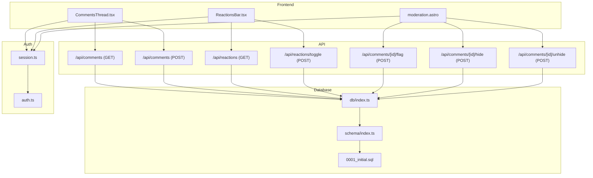
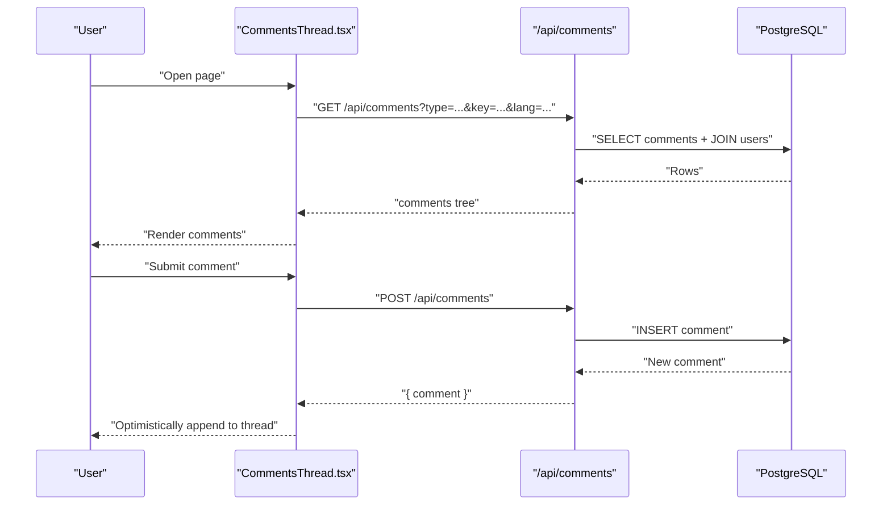
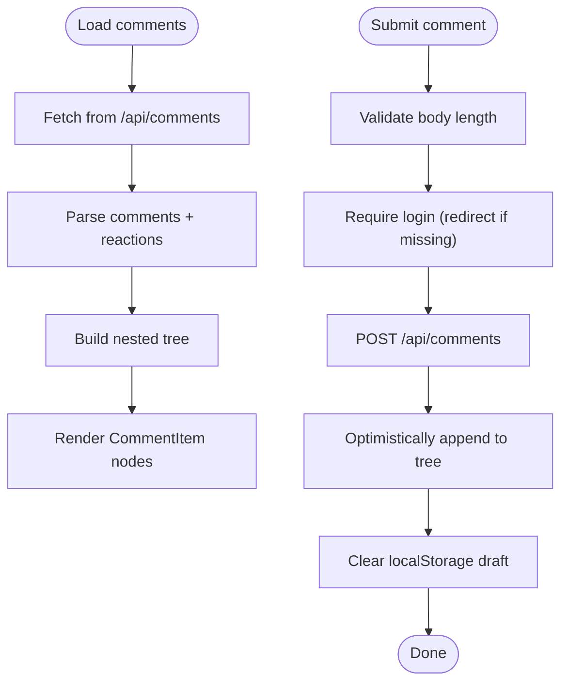
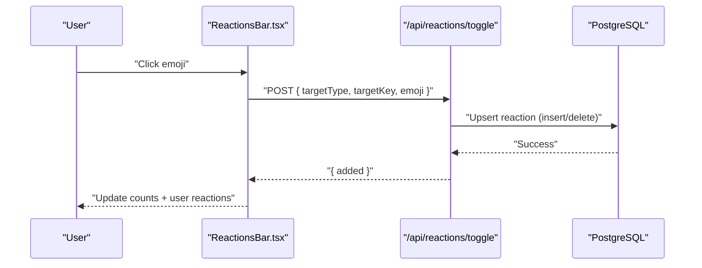
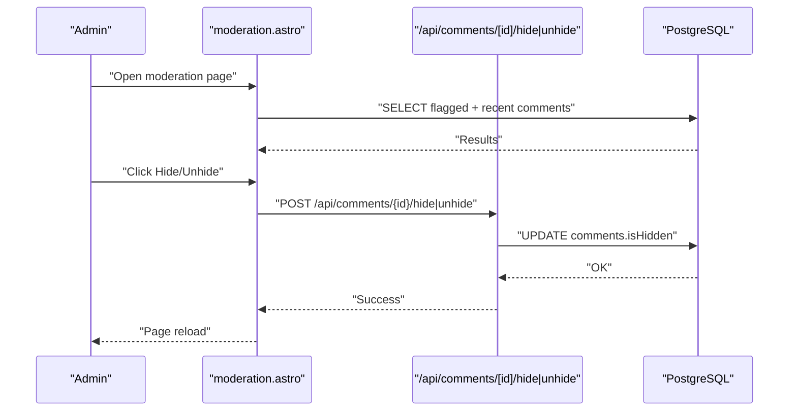
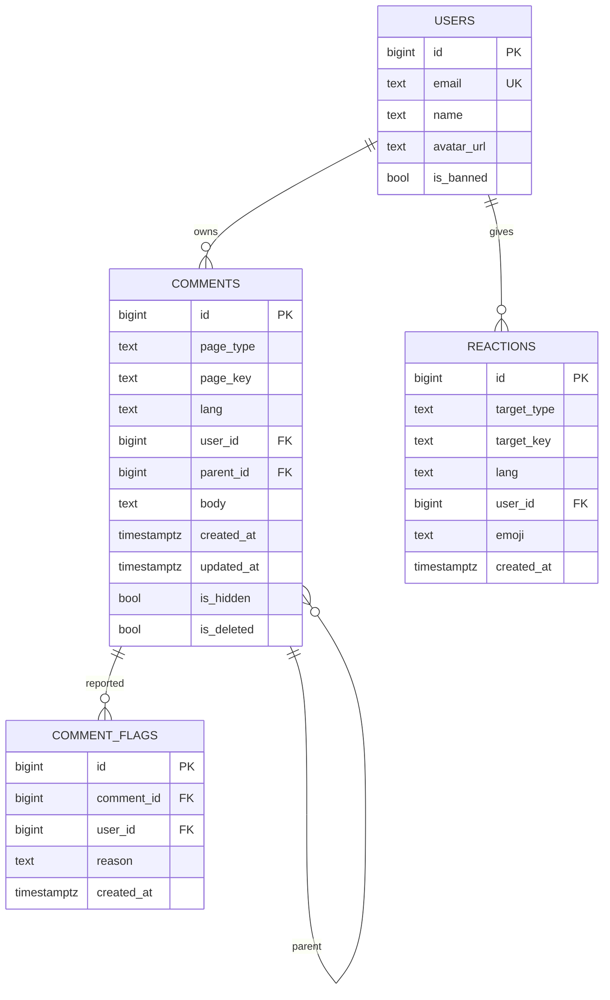
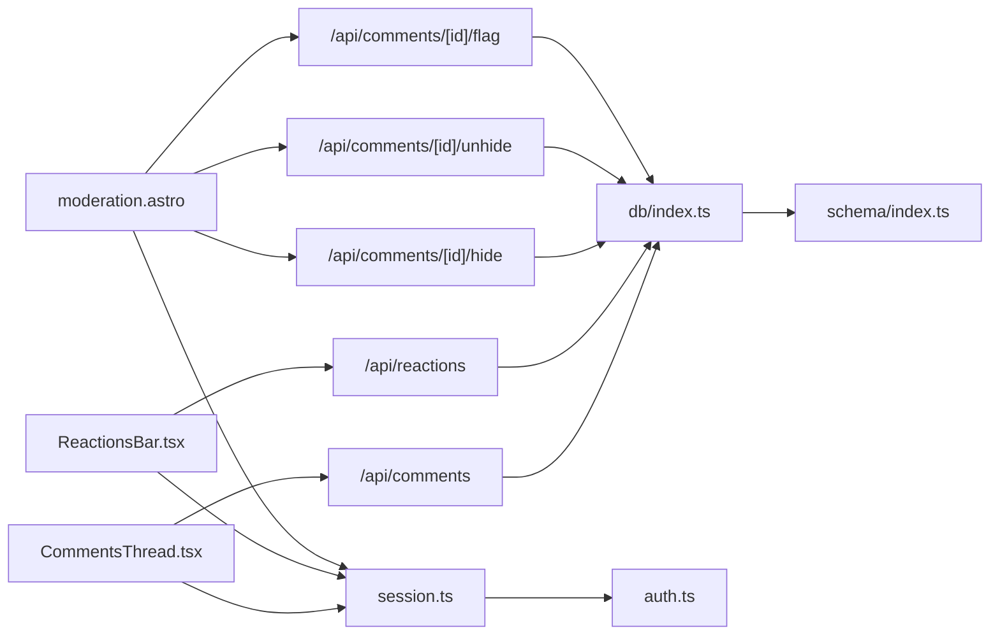

# Community Features

<cite>
**Referenced Files in This Document**
- [CommentsThread.tsx](file://src/components/CommentsThread.tsx)
- [ReactionsBar.tsx](file://src/components/ReactionsBar.tsx)
- [moderation.astro](file://src/pages/admin/moderation.astro)
- [comments.index.ts](file://src/pages/api/comments/index.ts)
- [reactions.index.ts](file://src/pages/api/reactions/index.ts)
- [reactions.toggle.ts](file://src/pages/api/reactions/toggle.ts)
- [comments.flag.ts](file://src/pages/api/comments/[id]/flag.ts)
- [comments.hide.ts](file://src/pages/api/comments/[id]/hide.ts)
- [comments.unhide.ts](file://src/pages/api/comments/[id]/unhide.ts)
- [schema.index.ts](file://src/db/schema/index.ts)
- [db.index.ts](file://src/db/index.ts)
- [session.ts](file://src/lib/session.ts)
- [auth.ts](file://src/lib/auth.ts)
- [0001_initial.sql](file://drizzle/0001_initial.sql)
- [README.md](file://README.md)
</cite>

## Table of Contents
1. [Introduction](#introduction)
2. [Project Structure](#project-structure)
3. [Core Components](#core-components)
4. [Architecture Overview](#architecture-overview)
5. [Detailed Component Analysis](#detailed-component-analysis)
6. [Dependency Analysis](#dependency-analysis)
7. [Performance Considerations](#performance-considerations)
8. [Troubleshooting Guide](#troubleshooting-guide)
9. [Conclusion](#conclusion)
10. [Appendices](#appendices)

## Introduction
This document describes the community features of rodion.pro, focusing on the comment system and reaction system. It explains the hierarchical threading model, moderation controls (flag/hide/unhide), real-time-like updates via optimistic UI, and user reporting mechanisms. It also documents the reaction system with emoji-based interactions, reaction tracking, and optimistic count updates. Administrative moderation tools for content management and community governance are covered, along with API endpoint specifications for comment CRUD operations, reaction toggling, and moderation actions. Security considerations, spam prevention measures, and integration patterns for extending community features are included.

## Project Structure
The community features span frontend React components, Astro API routes, and a PostgreSQL-backed schema managed by Drizzle ORM. Key areas:
- Frontend UI components for comments and reactions
- Admin moderation page
- API endpoints for comments and reactions
- Database schema for users, comments, reactions, and flags
- Authentication and session utilities

**Diagram sources**
- [CommentsThread.tsx](file://src/components/CommentsThread.tsx#L148-L366)
- [ReactionsBar.tsx](file://src/components/ReactionsBar.tsx#L13-L115)
- [moderation.astro](file://src/pages/admin/moderation.astro#L1-L195)
- [comments.index.ts](file://src/pages/api/comments/index.ts#L6-L240)
- [reactions.index.ts](file://src/pages/api/reactions/index.ts#L6-L82)
- [reactions.toggle.ts](file://src/pages/api/reactions/toggle.ts#L8-L85)
- [comments.flag.ts](file://src/pages/api/comments/[id]/flag.ts#L7-L60)
- [comments.hide.ts](file://src/pages/api/comments/[id]/hide.ts#L7-L42)
- [comments.unhide.ts](file://src/pages/api/comments/[id]/unhide.ts#L7-L42)
- [schema.index.ts](file://src/db/schema/index.ts#L36-L77)
- [db.index.ts](file://src/db/index.ts#L1-L37)
- [session.ts](file://src/lib/session.ts#L13-L54)
- [auth.ts](file://src/lib/auth.ts#L97-L101)

**Section sources**
- [README.md](file://README.md#L1-L244)

## Core Components
- CommentsThread: Renders hierarchical comments, handles drafts, submission, and optimistic updates.
- ReactionsBar: Manages emoji reactions, toggles, and optimistic count updates.
- Admin moderation page: Lists flagged and recent comments, supports hide/unhide actions.
- API routes: Provide comment CRUD, reaction queries/toggles, and moderation actions.
- Database schema: Defines users, comments, reactions, and flags with appropriate indexes.

**Section sources**
- [CommentsThread.tsx](file://src/components/CommentsThread.tsx#L148-L366)
- [ReactionsBar.tsx](file://src/components/ReactionsBar.tsx#L13-L115)
- [moderation.astro](file://src/pages/admin/moderation.astro#L1-L195)
- [comments.index.ts](file://src/pages/api/comments/index.ts#L6-L240)
- [reactions.index.ts](file://src/pages/api/reactions/index.ts#L6-L82)
- [reactions.toggle.ts](file://src/pages/api/reactions/toggle.ts#L8-L85)
- [comments.flag.ts](file://src/pages/api/comments/[id]/flag.ts#L7-L60)
- [comments.hide.ts](file://src/pages/api/comments/[id]/hide.ts#L7-L42)
- [comments.unhide.ts](file://src/pages/api/comments/[id]/unhide.ts#L7-L42)
- [schema.index.ts](file://src/db/schema/index.ts#L36-L77)

## Architecture Overview
The community features follow a layered architecture:
- Presentation layer: React components render comments and reactions.
- API layer: Astro API routes handle requests, enforce auth, and interact with the database.
- Persistence layer: PostgreSQL schema with Drizzle ORM for type-safe queries.
- Authentication: Session-based auth with Google OAuth and admin gating.

**Diagram sources**
- [CommentsThread.tsx](file://src/components/CommentsThread.tsx#L176-L206)
- [comments.index.ts](file://src/pages/api/comments/index.ts#L6-L163)
- [schema.index.ts](file://src/db/schema/index.ts#L36-L51)

## Detailed Component Analysis

### Comments Thread
- Hierarchical threading: Comments are fetched, mapped to a tree, and rendered recursively with indentation and reply expansion.
- Draft persistence: Uses localStorage to persist drafts per page type/key.
- Submission flow: Validates input, authenticates via Google OAuth redirect, inserts comment, and optimistically appends to the tree.
- Visibility: Deleted comments show a placeholder; hidden comments are omitted from rendering.

**Diagram sources**
- [CommentsThread.tsx](file://src/components/CommentsThread.tsx#L148-L366)
- [comments.index.ts](file://src/pages/api/comments/index.ts#L6-L163)

**Section sources**
- [CommentsThread.tsx](file://src/components/CommentsThread.tsx#L148-L366)
- [comments.index.ts](file://src/pages/api/comments/index.ts#L6-L240)

### Reactions Bar
- Emoji palette: Fixed set of emojis for reactions.
- Toggle logic: Sends POST to toggle endpoint, updates counts optimistically, and reflects user’s active reactions.
- Access control: Redirects to Google OAuth if unauthenticated.

**Diagram sources**
- [ReactionsBar.tsx](file://src/components/ReactionsBar.tsx#L25-L77)
- [reactions.toggle.ts](file://src/pages/api/reactions/toggle.ts#L8-L85)
- [schema.index.ts](file://src/db/schema/index.ts#L54-L66)

**Section sources**
- [ReactionsBar.tsx](file://src/components/ReactionsBar.tsx#L13-L115)
- [reactions.index.ts](file://src/pages/api/reactions/index.ts#L6-L82)
- [reactions.toggle.ts](file://src/pages/api/reactions/toggle.ts#L8-L85)

### Admin Moderation Tools
- Access control: Only admins can access moderation page.
- Flag aggregation: Groups comment flags with counts and latest reasons.
- Actions: Hide/unhide comments via dedicated endpoints; UI triggers POST requests and refreshes the page.

**Diagram sources**
- [moderation.astro](file://src/pages/admin/moderation.astro#L1-L195)
- [comments.hide.ts](file://src/pages/api/comments/[id]/hide.ts#L7-L42)
- [comments.unhide.ts](file://src/pages/api/comments/[id]/unhide.ts#L7-L42)
- [schema.index.ts](file://src/db/schema/index.ts#L36-L51)

**Section sources**
- [moderation.astro](file://src/pages/admin/moderation.astro#L1-L195)
- [comments.flag.ts](file://src/pages/api/comments/[id]/flag.ts#L7-L60)
- [comments.hide.ts](file://src/pages/api/comments/[id]/hide.ts#L7-L42)
- [comments.unhide.ts](file://src/pages/api/comments/[id]/unhide.ts#L7-L42)

### Database Schema
- Users: Stores identities, avatars, and ban status.
- Comments: Hierarchical structure with page scoping, visibility flags, and timestamps.
- Reactions: Emoji reactions scoped by target type/key with uniqueness constraints.
- Comment flags: Tracks user reports with optional reasons.

**Diagram sources**
- [schema.index.ts](file://src/db/schema/index.ts#L4-L104)
- [0001_initial.sql](file://drizzle/0001_initial.sql#L5-L94)

**Section sources**
- [schema.index.ts](file://src/db/schema/index.ts#L36-L77)
- [0001_initial.sql](file://drizzle/0001_initial.sql#L35-L77)

## Dependency Analysis
- Components depend on API routes for data and mutations.
- API routes depend on the database connection and session utilities.
- Authentication utilities support session management and admin checks.

**Diagram sources**
- [CommentsThread.tsx](file://src/components/CommentsThread.tsx#L176-L206)
- [ReactionsBar.tsx](file://src/components/ReactionsBar.tsx#L25-L77)
- [moderation.astro](file://src/pages/admin/moderation.astro#L169-L194)
- [comments.index.ts](file://src/pages/api/comments/index.ts#L6-L240)
- [reactions.index.ts](file://src/pages/api/reactions/index.ts#L6-L82)
- [reactions.toggle.ts](file://src/pages/api/reactions/toggle.ts#L8-L85)
- [comments.flag.ts](file://src/pages/api/comments/[id]/flag.ts#L7-L60)
- [comments.hide.ts](file://src/pages/api/comments/[id]/hide.ts#L7-L42)
- [comments.unhide.ts](file://src/pages/api/comments/[id]/unhide.ts#L7-L42)
- [db.index.ts](file://src/db/index.ts#L1-L37)
- [schema.index.ts](file://src/db/schema/index.ts#L36-L77)
- [session.ts](file://src/lib/session.ts#L13-L54)
- [auth.ts](file://src/lib/auth.ts#L97-L101)

**Section sources**
- [session.ts](file://src/lib/session.ts#L13-L54)
- [auth.ts](file://src/lib/auth.ts#L97-L101)
- [db.index.ts](file://src/db/index.ts#L1-L37)

## Performance Considerations
- Optimistic UI: Frontend updates counts and comment lists immediately after user actions to reduce perceived latency.
- Efficient queries: Comments are indexed by page and creation time; reactions are indexed by target and user.
- Pagination limits: Admin views cap results to avoid heavy loads.
- Draft persistence: Reduces network usage by avoiding repeated submissions.

[No sources needed since this section provides general guidance]

## Troubleshooting Guide
Common issues and remedies:
- Backend not configured: API routes return 503 with a descriptive message; ensure DATABASE_URL is set and migrations applied.
- Unauthorized access: API routes return 401; ensure user is authenticated via Google OAuth.
- Forbidden actions: Admin-only endpoints return 403; confirm user is in ADMIN_EMAILS.
- Network errors: Frontend surfaces temporary unavailability messages; retry after connectivity is restored.
- Validation failures: Missing fields or invalid emoji trigger 400 responses; verify request payloads.

**Section sources**
- [comments.index.ts](file://src/pages/api/comments/index.ts#L7-L12)
- [reactions.toggle.ts](file://src/pages/api/reactions/toggle.ts#L9-L14)
- [comments.hide.ts](file://src/pages/api/comments/[id]/hide.ts#L11-L16)
- [comments.unhide.ts](file://src/pages/api/comments/[id]/unhide.ts#L11-L16)
- [CommentsThread.tsx](file://src/components/CommentsThread.tsx#L187-L201)
- [ReactionsBar.tsx](file://src/components/ReactionsBar.tsx#L45-L50)

## Conclusion
The community features combine a clean frontend UX with robust backend APIs and a well-indexed schema. Hierarchical comments, emoji reactions, and admin moderation are integrated through explicit endpoints and optimistic UI updates. Strong authentication and admin gating protect the platform while enabling effective community governance.

[No sources needed since this section summarizes without analyzing specific files]

## Appendices

### API Endpoint Specifications

- GET /api/comments
  - Purpose: Retrieve paginated comments for a page and language.
  - Query parameters:
    - type (required): Page type identifier.
    - key (required): Page key.
    - lang (optional, default "ru"): Language code.
  - Response: { comments: CommentTreeNode[] }
  - Notes: Includes reaction counts and user reactions per comment.

- POST /api/comments
  - Purpose: Create a new comment or reply.
  - Body:
    - pageType (required)
    - pageKey (required)
    - lang (required)
    - parentId (optional)
    - body (required, max length enforced)
  - Response: { comment: CommentNode }
  - Auth: Required; redirects to Google OAuth if unauthenticated.

- POST /api/comments/[id]/flag
  - Purpose: Report a comment.
  - Body: { reason: string | null }
  - Response: { success: true }
  - Auth: Required.

- POST /api/comments/[id]/hide
  - Purpose: Hide a comment (admin-only).
  - Response: { success: true }
  - Auth: Admin required.

- POST /api/comments/[id]/unhide
  - Purpose: Unhide a comment (admin-only).
  - Response: { success: true }
  - Auth: Admin required.

- GET /api/reactions
  - Purpose: Retrieve reaction counts and user reactions for a target.
  - Query parameters:
    - targetType (required): "post" | "comment"
    - targetKey (required)
    - lang (optional, applies to posts)
  - Response: { reactions: Record<string, number>, userReactions: string[] }

- POST /api/reactions/toggle
  - Purpose: Toggle an emoji reaction.
  - Body: { targetType, targetKey, lang, emoji }
  - Response: { added: boolean, emoji: string }
  - Auth: Required; only allowed emojis enforced.

**Section sources**
- [comments.index.ts](file://src/pages/api/comments/index.ts#L6-L240)
- [comments.flag.ts](file://src/pages/api/comments/[id]/flag.ts#L7-L60)
- [comments.hide.ts](file://src/pages/api/comments/[id]/hide.ts#L7-L42)
- [comments.unhide.ts](file://src/pages/api/comments/[id]/unhide.ts#L7-L42)
- [reactions.index.ts](file://src/pages/api/reactions/index.ts#L6-L82)
- [reactions.toggle.ts](file://src/pages/api/reactions/toggle.ts#L8-L85)

### User Experience Flows

- Posting a comment
  - Fill textarea, optionally reply to a specific comment, submit.
  - On success, the comment appears immediately; draft is cleared.

- Replying to a comment
  - Click Reply; textarea focuses; submit adds the reply under the selected comment.

- Reacting to content
  - Click an emoji; the count updates instantly; clicking again removes the reaction.

- Reporting a comment
  - Submit a report with an optional reason; no visible feedback beyond success.

- Admin moderation
  - View flagged and recent comments; toggle hide/unhide with immediate effect.

**Section sources**
- [CommentsThread.tsx](file://src/components/CommentsThread.tsx#L208-L281)
- [ReactionsBar.tsx](file://src/components/ReactionsBar.tsx#L25-L77)
- [moderation.astro](file://src/pages/admin/moderation.astro#L169-L194)

### Security Considerations and Spam Prevention
- Authentication: All mutation endpoints require a valid session; unauthenticated users are redirected to Google OAuth.
- Admin gating: Moderation actions require admin email membership.
- Rate-limiting: Not implemented in code; consider adding rate limits at the API layer for comment creation and reaction toggles.
- Input validation: Enforced on the server-side (length limits, required fields, allowed emojis).
- Content moderation: Hidden comments are excluded from display; flags aggregate reports for review.

**Section sources**
- [session.ts](file://src/lib/session.ts#L13-L54)
- [auth.ts](file://src/lib/auth.ts#L97-L101)
- [comments.index.ts](file://src/pages/api/comments/index.ts#L186-L198)
- [reactions.toggle.ts](file://src/pages/api/reactions/toggle.ts#L36-L41)

### Implementation Examples and Extension Patterns
- Extending reactions
  - Add new emojis to the allowed set and UI; update counts aggregation accordingly.
  - Consider adding per-user reaction history for analytics.

- Extending comments
  - Introduce comment editing/deletion with proper auth and admin checks.
  - Add pagination for large comment threads.

- Real-time updates
  - Integrate WebSocket or Server-Sent Events to push updates to clients.
  - Synchronize optimistic UI with server state via reconciliation.

- Reporting and moderation
  - Add structured moderation workflows (approve/deny) and notifications.
  - Track moderator actions for audit trails.

[No sources needed since this section provides general guidance]