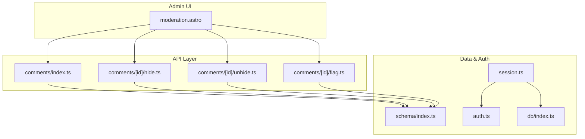
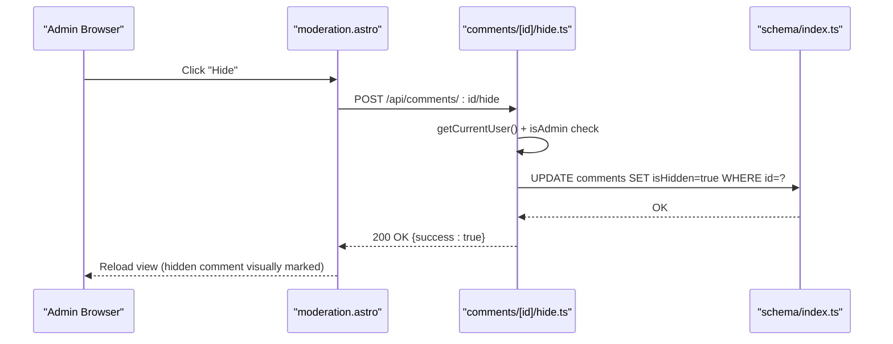
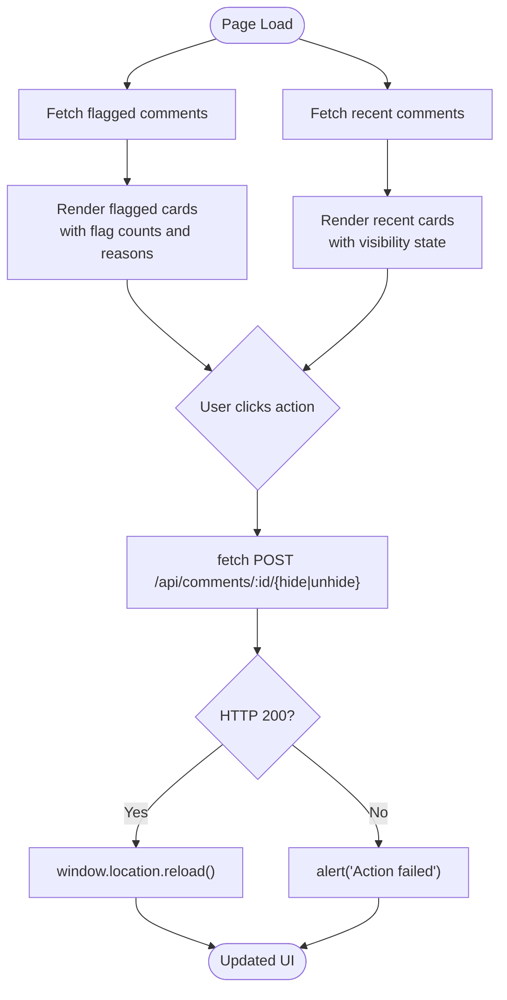
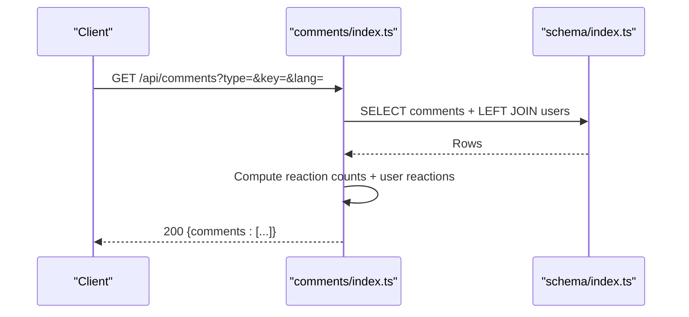
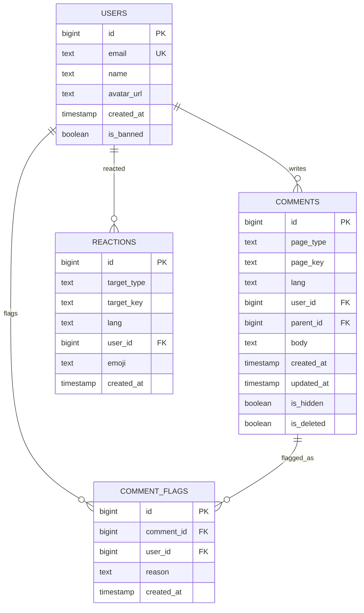
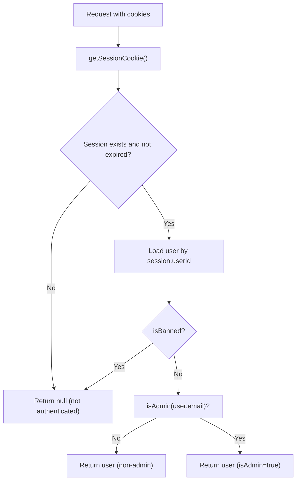
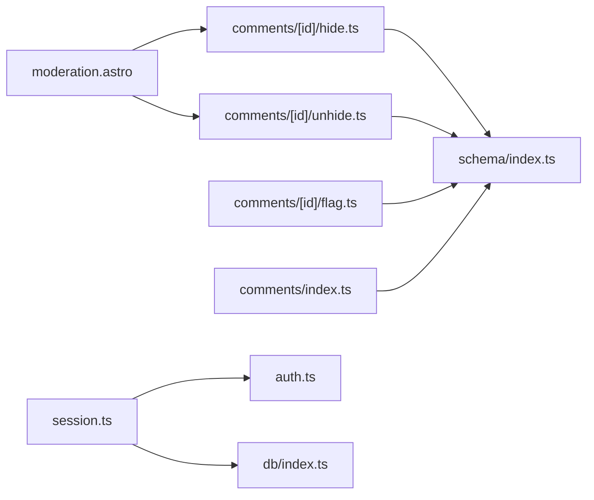

# Moderation Tools

<cite>
**Referenced Files in This Document**
- [moderation.astro](file://src/pages/admin/moderation.astro)
- [comments.index.ts](file://src/pages/api/comments/index.ts)
- [comments.hide.ts](file://src/pages/api/comments/[id]/hide.ts)
- [comments.unhide.ts](file://src/pages/api/comments/[id]/unhide.ts)
- [comments.flag.ts](file://src/pages/api/comments/[id]/flag.ts)
- [schema.index.ts](file://src/db/schema/index.ts)
- [session.ts](file://src/lib/session.ts)
- [auth.ts](file://src/lib/auth.ts)
- [db.index.ts](file://src/db/index.ts)
- [Layout.astro](file://src/layouts/Layout.astro)
</cite>

## Table of Contents
1. [Introduction](#introduction)
2. [Project Structure](#project-structure)
3. [Core Components](#core-components)
4. [Architecture Overview](#architecture-overview)
5. [Detailed Component Analysis](#detailed-component-analysis)
6. [Dependency Analysis](#dependency-analysis)
7. [Performance Considerations](#performance-considerations)
8. [Security and Audit Considerations](#security-and-audit-considerations)
9. [Community Moderation Practices](#community-moderation-practices)
10. [Extensibility and Integration Guide](#extensibility-and-integration-guide)
11. [Troubleshooting Guide](#troubleshooting-guide)
12. [Conclusion](#conclusion)

## Introduction
This document describes the moderation tools powering rodion.pro’s administrative capabilities. It covers the moderation dashboard, comment moderation actions (hide/unhide), user oversight tools, content filtering mechanisms, and the underlying moderation API. It also provides guidance on extending moderation features, integrating external moderation services, and maintaining community standards with strong security and audit practices.

## Project Structure
The moderation system spans three primary areas:
- Administrative UI: A dedicated moderation dashboard page that lists flagged and recent comments and allows administrative actions.
- Moderation API: REST-like endpoints under /api/comments for retrieving comments, submitting new comments, flagging content, and performing hide/unhide actions.
- Data model and session: A PostgreSQL-backed schema with tables for users, comments, reactions, and comment flags; session and admin checks via authentication utilities.

**Diagram sources**
- [moderation.astro](file://src/pages/admin/moderation.astro#L1-L195)
- [comments.index.ts](file://src/pages/api/comments/index.ts#L1-L240)
- [comments.hide.ts](file://src/pages/api/comments/[id]/hide.ts#L1-L42)
- [comments.unhide.ts](file://src/pages/api/comments/[id]/unhide.ts#L1-L42)
- [comments.flag.ts](file://src/pages/api/comments/[id]/flag.ts#L1-L60)
- [schema.index.ts](file://src/db/schema/index.ts#L1-L104)
- [session.ts](file://src/lib/session.ts#L1-L58)
- [auth.ts](file://src/lib/auth.ts#L1-L101)
- [db.index.ts](file://src/db/index.ts#L1-L37)

**Section sources**
- [moderation.astro](file://src/pages/admin/moderation.astro#L1-L195)
- [comments.index.ts](file://src/pages/api/comments/index.ts#L1-L240)
- [comments.hide.ts](file://src/pages/api/comments/[id]/hide.ts#L1-L42)
- [comments.unhide.ts](file://src/pages/api/comments/[id]/unhide.ts#L1-L42)
- [comments.flag.ts](file://src/pages/api/comments/[id]/flag.ts#L1-L60)
- [schema.index.ts](file://src/db/schema/index.ts#L1-L104)
- [session.ts](file://src/lib/session.ts#L1-L58)
- [auth.ts](file://src/lib/auth.ts#L1-L101)
- [db.index.ts](file://src/db/index.ts#L1-L37)

## Core Components
- Moderation Dashboard (moderation.astro)
  - Loads flagged comments and recent comments from the database.
  - Renders actionable cards with “Hide” or “Unhide” buttons.
  - Performs client-side fetch requests to the moderation API endpoints.
- Moderation API
  - GET /api/comments?type=&key=&lang=: Returns paginated comment threads with nested replies, reaction counts, and user reactions.
  - POST /api/comments: Creates a new comment.
  - POST /api/comments/[id]/flag: Flags a comment with an optional reason.
  - POST /api/comments/[id]/hide: Hides a comment (admin-only).
  - POST /api/comments/[id]/unhide: Unhides a comment (admin-only).
- Data Model (schema/index.ts)
  - comments: Stores comment content, metadata, visibility, deletion state, and foreign keys to users and parent comments.
  - commentFlags: Tracks moderation flags per comment with reason and timestamps.
  - users: Includes isBanned for user-level restrictions.
  - reactions: Supports reaction counts and user-specific reactions.
- Authentication and Admin Access
  - getCurrentUser validates sessions, checks bans, and derives isAdmin via a configured admin email list.
  - isAdmin determines administrative privileges based on email membership.

**Section sources**
- [moderation.astro](file://src/pages/admin/moderation.astro#L14-L195)
- [comments.index.ts](file://src/pages/api/comments/index.ts#L6-L163)
- [comments.hide.ts](file://src/pages/api/comments/[id]/hide.ts#L7-L41)
- [comments.unhide.ts](file://src/pages/api/comments/[id]/unhide.ts#L7-L41)
- [comments.flag.ts](file://src/pages/api/comments/[id]/flag.ts#L7-L59)
- [schema.index.ts](file://src/db/schema/index.ts#L36-L77)
- [session.ts](file://src/lib/session.ts#L13-L54)
- [auth.ts](file://src/lib/auth.ts#L97-L100)

## Architecture Overview
The moderation architecture follows a clear separation of concerns:
- UI renders moderation views and triggers actions.
- API routes enforce authentication and authorization, interact with the database, and return structured JSON responses.
- Database schema supports comment threading, reactions, and moderation flags.
- Session and auth utilities centralize user identity and admin checks.

**Diagram sources**
- [moderation.astro](file://src/pages/admin/moderation.astro#L169-L194)
- [comments.hide.ts](file://src/pages/api/comments/[id]/hide.ts#L7-L41)
- [schema.index.ts](file://src/db/schema/index.ts#L36-L51)
- [session.ts](file://src/lib/session.ts#L13-L54)
- [auth.ts](file://src/lib/auth.ts#L97-L100)

## Detailed Component Analysis

### Moderation Dashboard (moderation.astro)
- Purpose: Central hub for administrators to review flagged and recent comments and perform moderation actions.
- Data retrieval:
  - Flagged comments: Aggregates comment flags by commentId, counts flags, tracks latest reason, and joins with comments and users.
  - Recent comments: Lists most recent comments with user info and visibility status.
- UI patterns:
  - Two-column grid: Flagged comments and recent comments.
  - Card-based layout with user attribution, timestamps, and content previews.
  - Conditional “Hide”/“Unhide” buttons based on isHidden state.
- Client-side actions:
  - Listens for click events on buttons with data-action and data-id attributes.
  - Sends POST requests to /api/comments/:id/hide or /api/comments/:id/unhide.
  - On success, reloads the page to reflect state changes.

**Diagram sources**
- [moderation.astro](file://src/pages/admin/moderation.astro#L14-L194)

**Section sources**
- [moderation.astro](file://src/pages/admin/moderation.astro#L14-L195)

### Moderation API Endpoints
- GET /api/comments?type=&key=&lang=
  - Retrieves paginated comments for a given page, builds a nested thread, computes reaction counts, and includes user reactions for the current user.
  - Enforces presence of type, key, and lang; returns 400 if missing.
  - Returns 503 if DB is not configured, 500 on internal errors.
- POST /api/comments
  - Requires authentication; validates payload and length; inserts a new comment and returns the created comment with minimal metadata.
  - Returns 401 if unauthorized, 400 on validation errors, 500 on failure.
- POST /api/comments/[id]/flag
  - Requires authentication; verifies comment existence; records a flag with optional reason.
  - Returns 400/401/404/500 as appropriate.
- POST /api/comments/[id]/hide
  - Requires admin access; updates isHidden to true; returns success or error.
- POST /api/comments/[id]/unhide
  - Requires admin access; updates isHidden to false; returns success or error.

**Diagram sources**
- [comments.index.ts](file://src/pages/api/comments/index.ts#L6-L163)
- [schema.index.ts](file://src/db/schema/index.ts#L36-L66)

**Section sources**
- [comments.index.ts](file://src/pages/api/comments/index.ts#L6-L240)
- [comments.hide.ts](file://src/pages/api/comments/[id]/hide.ts#L7-L41)
- [comments.unhide.ts](file://src/pages/api/comments/[id]/unhide.ts#L7-L41)
- [comments.flag.ts](file://src/pages/api/comments/[id]/flag.ts#L7-L59)

### Data Model for Moderation
The schema defines the core entities supporting moderation:
- users: id, email (unique), name, avatarUrl, createdAt, isBanned.
- comments: id, pageType, pageKey, lang, userId (FK), parentId (self-FK), body, createdAt, updatedAt, isHidden, isDeleted.
- commentFlags: id, commentId (FK), userId (nullable), reason, createdAt.
- reactions: targetType, targetKey, lang, userId (FK), emoji, createdAt.

**Diagram sources**
- [schema.index.ts](file://src/db/schema/index.ts#L4-L104)

**Section sources**
- [schema.index.ts](file://src/db/schema/index.ts#L1-L104)

### Authentication and Admin Access
- getCurrentUser:
  - Validates session cookie and expiration.
  - Loads user record and rejects banned users.
  - Computes isAdmin using a centralized admin email list.
- isAdmin:
  - Compares user email against ADMIN_EMAILS environment variable entries.
- Session cookie:
  - HttpOnly, secure in production, SameSite lax, 30-day max age.

**Diagram sources**
- [session.ts](file://src/lib/session.ts#L13-L54)
- [auth.ts](file://src/lib/auth.ts#L97-L100)

**Section sources**
- [session.ts](file://src/lib/session.ts#L13-L54)
- [auth.ts](file://src/lib/auth.ts#L97-L100)
- [db.index.ts](file://src/db/index.ts#L1-L37)

## Dependency Analysis
- UI-to-API coupling:
  - moderation.astro depends on comments hide/unhide endpoints for live moderation actions.
- API-to-DB coupling:
  - All moderation endpoints depend on the comments and commentFlags tables.
- Auth-to-DB coupling:
  - getCurrentUser depends on sessions and users tables; isAdmin depends on environment configuration.
- Cohesion and separation:
  - Moderation logic is cleanly separated into UI, API, and data layers.
  - No circular dependencies observed among the analyzed files.

**Diagram sources**
- [moderation.astro](file://src/pages/admin/moderation.astro#L169-L194)
- [comments.hide.ts](file://src/pages/api/comments/[id]/hide.ts#L7-L41)
- [comments.unhide.ts](file://src/pages/api/comments/[id]/unhide.ts#L7-L41)
- [comments.flag.ts](file://src/pages/api/comments/[id]/flag.ts#L7-L59)
- [comments.index.ts](file://src/pages/api/comments/index.ts#L6-L163)
- [schema.index.ts](file://src/db/schema/index.ts#L36-L77)
- [session.ts](file://src/lib/session.ts#L13-L54)
- [auth.ts](file://src/lib/auth.ts#L97-L100)
- [db.index.ts](file://src/db/index.ts#L1-L37)

**Section sources**
- [moderation.astro](file://src/pages/admin/moderation.astro#L169-L194)
- [comments.hide.ts](file://src/pages/api/comments/[id]/hide.ts#L7-L41)
- [comments.unhide.ts](file://src/pages/api/comments/[id]/unhide.ts#L7-L41)
- [comments.flag.ts](file://src/pages/api/comments/[id]/flag.ts#L7-L59)
- [comments.index.ts](file://src/pages/api/comments/index.ts#L6-L163)
- [schema.index.ts](file://src/db/schema/index.ts#L36-L77)
- [session.ts](file://src/lib/session.ts#L13-L54)
- [auth.ts](file://src/lib/auth.ts#L97-L100)
- [db.index.ts](file://src/db/index.ts#L1-L37)

## Performance Considerations
- Database queries
  - Flag aggregation groups by commentId and orders by flag count; consider indexing strategies for high-volume scenarios.
  - Reaction counts are computed client-side after fetching aggregated rows; ensure indices on reactions(targetType,targetKey) and reactions(userId) for scalability.
- Pagination and limits
  - Dashboard queries limit results (e.g., 50 comments). Extend with cursor-based pagination for deeper navigation.
- Frontend responsiveness
  - Client-side fetch calls trigger full page reloads; consider partial updates with lightweight state management for smoother UX.

[No sources needed since this section provides general guidance]

## Security and Audit Considerations
- Administrative access
  - Admin-only endpoints (/api/comments/[id]/hide, /api/comments/[id]/unhide) enforce isAdmin checks; ensure ADMIN_EMAILS is properly configured and restricted.
- Session security
  - HttpOnly and secure cookies with SameSite lax mitigate XSS and CSRF risks; ensure HTTPS in production.
- Data integrity
  - commentFlags stores reasons and timestamps; use these for audit trails.
- Rate limiting and abuse prevention
  - Consider rate limits on flag creation and hide/unhide actions to prevent abuse.
- Logging and monitoring
  - Add server-side logging for moderation actions (hide/unhide/flag) with user context and timestamps for compliance and audits.

[No sources needed since this section provides general guidance]

## Community Moderation Practices
- Content policy enforcement
  - Use standardized flag reasons to improve consistency and training for moderators.
- User education
  - Provide clear community guidelines and feedback when content is hidden or removed.
- Escalation procedures
  - Implement multi-tier moderation (peer review, escalation to senior admins) for sensitive cases.
- Transparency and fairness
  - Maintain logs and communicate moderation decisions where appropriate to uphold trust.

[No sources needed since this section provides general guidance]

## Extensibility and Integration Guide
- Adding new moderation tools
  - Extend the schema with new moderation-related tables (e.g., moderation logs, appeals) and add API routes mirroring existing patterns.
- Bulk moderation capabilities
  - Introduce batch endpoints (e.g., POST /api/comments/bulk-hide) to handle multiple comment IDs efficiently.
- Integrating external moderation services
  - Add a webhook or service hook in flag creation to notify external moderation platforms; store external identifiers and statuses in the schema.
- Content filtering mechanisms
  - Integrate AI-based content scanning during comment creation; mark flagged comments automatically and route them to the moderation queue.

[No sources needed since this section provides general guidance]

## Troubleshooting Guide
- Database not configured
  - Symptoms: 503 responses from comment endpoints.
  - Resolution: Set DATABASE_URL and run migrations; verify connection in db/index.ts.
- Unauthorized or forbidden
  - Symptoms: 401/403 responses on moderation actions.
  - Resolution: Ensure user is authenticated and isAdmin; verify ADMIN_EMAILS configuration.
- Invalid comment ID
  - Symptoms: 400 responses on hide/unhide/flag.
  - Resolution: Validate IDs passed to endpoints; ensure numeric IDs are provided.
- Flagging failures
  - Symptoms: 500 responses on flag endpoint.
  - Resolution: Confirm comment exists and request payload includes reason if needed.
- UI not updating after action
  - Symptoms: Button click does nothing or stale display.
  - Resolution: Verify client-side fetch handler executes and reloads the page; check network tab for errors.

**Section sources**
- [db.index.ts](file://src/db/index.ts#L1-L37)
- [session.ts](file://src/lib/session.ts#L13-L54)
- [auth.ts](file://src/lib/auth.ts#L97-L100)
- [comments.hide.ts](file://src/pages/api/comments/[id]/hide.ts#L18-L24)
- [comments.unhide.ts](file://src/pages/api/comments/[id]/unhide.ts#L18-L24)
- [comments.flag.ts](file://src/pages/api/comments/[id]/flag.ts#L18-L39)
- [moderation.astro](file://src/pages/admin/moderation.astro#L179-L191)

## Conclusion
The moderation system at rodion.pro combines a focused administrative dashboard with robust API endpoints and a clean data model. Administrators can efficiently review flagged content, manage visibility, and track moderation actions. By following the security, audit, and extensibility recommendations herein, the platform can scale its moderation capabilities while maintaining community standards and operational reliability.