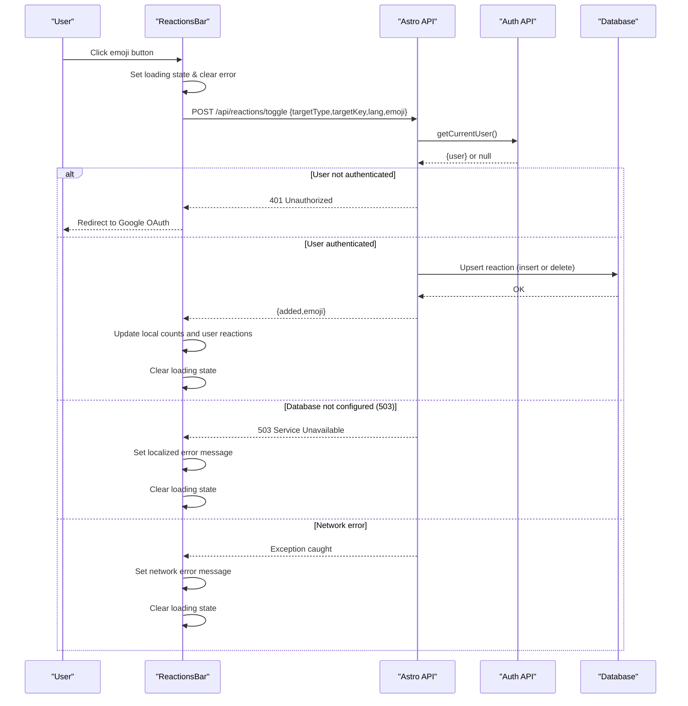
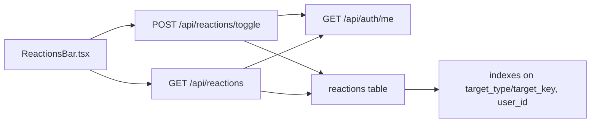

# Reaction System

<cite>
**Referenced Files in This Document**
- [ReactionsBar.tsx](file://src/components/ReactionsBar.tsx)
- [index.ts](file://src/pages/api/reactions/index.ts)
- [toggle.ts](file://src/pages/api/reactions/toggle.ts)
- [index.ts](file://src/db/schema/index.ts)
- [index.ts](file://src/db/index.ts)
- [session.ts](file://src/lib/session.ts)
- [me.ts](file://src/pages/api/auth/me.ts)
- [auth.ts](file://src/lib/auth.ts)
- [CommentsThread.tsx](file://src/components/CommentsThread.tsx)
- [moderation.astro](file://src/pages/admin/moderation.astro)
- [0001_initial.sql](file://drizzle/0001_initial.sql)
</cite>

## Update Summary
**Changes Made**
- Enhanced error handling in ReactionsBar component with comprehensive localized error messages
- Added specific handling for backend unavailability scenarios (503 responses)
- Implemented network failure error handling with user-friendly notifications
- Improved user experience with contextual error messages in both English and Russian
- Added comprehensive error state management and display

## Table of Contents
1. [Introduction](#introduction)
2. [Project Structure](#project-structure)
3. [Core Components](#core-components)
4. [Architecture Overview](#architecture-overview)
5. [Detailed Component Analysis](#detailed-component-analysis)
6. [Dependency Analysis](#dependency-analysis)
7. [Performance Considerations](#performance-considerations)
8. [Enhanced Error Handling](#enhanced-error-handling)
9. [Troubleshooting Guide](#troubleshooting-guide)
10. [Conclusion](#conclusion)
11. [Appendices](#appendices)

## Introduction
This document describes the reaction system for rodion.pro, focusing on the emoji-based reaction architecture, user interaction patterns, real-time-like updates, and administrative moderation capabilities. The system has been enhanced with comprehensive error handling to provide users with clear feedback during various failure scenarios. It covers:
- Reaction types and targets (posts and comments)
- User interaction patterns and authentication gating
- Reaction API endpoints (listing and toggling)
- The ReactionsBar component implementation and UI patterns
- Reaction tracking mechanisms (uniqueness, user state, counts)
- Moderation workflow for administrators
- Performance considerations and extension points
- Enhanced error handling and user experience improvements

## Project Structure
The reaction system spans frontend React components, Astro API routes, and database schema:
- Frontend: ReactionsBar component renders a bar of emoji buttons and manages local state for counts and user reactions with comprehensive error handling
- Backend: Astro API routes handle listing reactions and toggling user reactions
- Database: Drizzle ORM schema defines the reactions table with uniqueness constraints and indexes

```mermaid
graph TB
subgraph "Frontend"
RB["ReactionsBar.tsx"]
CT["CommentsThread.tsx"]
EH["Error Handling"]
end
subgraph "Backend"
API1["GET /api/reactions"]
API2["POST /api/reactions/toggle"]
AUTH["GET /api/auth/me"]
DB["Drizzle ORM + PostgreSQL"]
END
RB --> API2
RB --> API1
CT --> RB
EH --> RB
API1 --> AUTH
API2 --> AUTH
API1 --> DB
API2 --> DB
```

**Diagram sources**
- [ReactionsBar.tsx](file://src/components/ReactionsBar.tsx#L1-L115)
- [index.ts](file://src/pages/api/reactions/index.ts#L1-L82)
- [toggle.ts](file://src/pages/api/reactions/toggle.ts#L1-L85)
- [me.ts](file://src/pages/api/auth/me.ts#L1-L30)
- [index.ts](file://src/db/schema/index.ts#L53-L66)

**Section sources**
- [ReactionsBar.tsx](file://src/components/ReactionsBar.tsx#L1-L115)
- [index.ts](file://src/pages/api/reactions/index.ts#L1-L82)
- [toggle.ts](file://src/pages/api/reactions/toggle.ts#L1-L85)
- [index.ts](file://src/db/schema/index.ts#L53-L66)

## Core Components
- ReactionsBar: A React island component that renders a fixed set of emoji buttons, tracks user reactions locally, performs optimistic updates, and provides comprehensive error handling with localized messages for different failure scenarios.
- Reaction API endpoints:
  - GET /api/reactions: Lists reaction counts and current user's reactions for a given target
  - POST /api/reactions/toggle: Adds or removes a user reaction for a given target and emoji

Key behaviors:
- Authentication gating: Non-authenticated users are redirected to Google OAuth when attempting to toggle reactions
- Optimistic UI: Counts and user state update immediately upon user click, with fallback on network errors
- Target scoping: Supports post and comment targets; post reactions can be scoped by language
- Enhanced error handling: Comprehensive error messages for network failures, backend unavailability, and general submission errors

**Section sources**
- [ReactionsBar.tsx](file://src/components/ReactionsBar.tsx#L1-L115)
- [index.ts](file://src/pages/api/reactions/index.ts#L1-L82)
- [toggle.ts](file://src/pages/api/reactions/toggle.ts#L1-L85)

## Architecture Overview
The reaction system follows a client-server architecture with enhanced error handling:
- Client-side component maintains local state for counts and user reactions with comprehensive error management
- Backend APIs enforce authentication and manage persistence with proper error responses
- Database schema ensures uniqueness and efficient querying
- Frontend provides user-friendly error messages in multiple languages



**Diagram sources**
- [ReactionsBar.tsx](file://src/components/ReactionsBar.tsx#L25-L77)
- [toggle.ts](file://src/pages/api/reactions/toggle.ts#L8-L84)
- [me.ts](file://src/pages/api/auth/me.ts#L6-L29)
- [session.ts](file://src/lib/session.ts#L13-L54)

## Detailed Component Analysis

### ReactionsBar Component
Responsibilities:
- Render a fixed set of emoji buttons
- Track local reaction counts and user reactions
- Perform optimistic updates on toggle
- Handle authentication redirects and comprehensive error states
- Support post and comment targets with optional language scoping
- Display localized error messages for different failure scenarios

Props interface:
- targetType: 'post' | 'comment'
- targetKey: string
- lang?: string (used for post reactions)
- initialReactions?: Record<string, number>
- initialUserReactions?: string[]

Rendering logic:
- Renders a button per emoji with count badge when count > 0
- Active state is determined by presence in user reactions
- Disabled during network operations
- Displays error message banner when present

User interaction patterns:
- Clicking an emoji sends a toggle request with loading state management
- If unauthorized, redirects to Google OAuth start endpoint
- On success, updates counts and user reactions optimistically
- On failure, displays appropriate localized error message

Implementation notes:
- Emoji set is defined locally; toggling uses a separate allowed set on the backend
- Error messages are localized based on lang prop (English/Russian)
- Comprehensive error handling for network failures, backend unavailability, and general submission errors
- Loading state prevents concurrent operations

**Updated** Enhanced with comprehensive error handling including network failures, backend unavailability, and authentication errors with user-friendly notifications.

**Section sources**
- [ReactionsBar.tsx](file://src/components/ReactionsBar.tsx#L3-L115)

### Reaction API Endpoints

#### GET /api/reactions
Purpose: Retrieve reaction counts and current user's reactions for a target.

Request:
- Query parameters:
  - targetType: 'post' | 'comment'
  - targetKey: string
  - lang: string (optional; applies to post reactions)

Response (200):
- reactions: Record<string, number> (emoji to count)
- userReactions: string[] (current user's reactions)

Behavior:
- Validates presence of targetType and targetKey
- Applies lang filter for post targets
- Returns counts grouped by emoji and current user's reactions if authenticated
- Returns 503 if database is not configured

Status codes:
- 400: Missing parameters
- 503: Database not configured
- 500: Internal error

**Section sources**
- [index.ts](file://src/pages/api/reactions/index.ts#L6-L81)

#### POST /api/reactions/toggle
Purpose: Toggle a user reaction for a target and emoji.

Request body:
- targetType: 'post' | 'comment'
- targetKey: string
- lang: string (optional; applies to post targets)
- emoji: string (must be in allowed set)

Response (200):
- added: boolean (true if reaction was added, false if removed)
- emoji: string

Behavior:
- Requires authenticated user
- Validates required fields and emoji against allowed set
- Upserts reaction: insert if missing, delete if present
- Returns operation result
- Returns 503 if database is not configured

Status codes:
- 400: Missing fields or invalid emoji
- 401: Unauthorized
- 503: Database not configured
- 500: Internal error

**Section sources**
- [toggle.ts](file://src/pages/api/reactions/toggle.ts#L8-L84)

### Database Schema and Constraints
The reactions table enforces:
- Uniqueness: (target_type, target_key, user_id, emoji) prevents duplicate reactions
- Indexes: target_type/target_key for fast aggregation and user_id for user-scoped queries

Schema highlights:
- targetType: 'post' | 'comment'
- targetKey: string identifier
- lang: optional language code for post reactions
- userId: foreign key to users
- emoji: reaction emoji
- createdAt: timestamp

**Section sources**
- [index.ts](file://src/db/schema/index.ts#L53-L66)
- [0001_initial.sql](file://drizzle/0001_initial.sql#L53-L66)

### Authentication and User State
- getCurrentUser resolves the current user from session cookie and DB
- Unauthorized users receive 401 on toggle requests and are redirected to Google OAuth
- Admin detection uses email-based allowlist

Integration points:
- ReactionsBar checks for 401 response and redirects accordingly
- Reaction endpoints call getCurrentUser to authorize requests

**Section sources**
- [session.ts](file://src/lib/session.ts#L13-L54)
- [me.ts](file://src/pages/api/auth/me.ts#L6-L29)
- [auth.ts](file://src/lib/auth.ts#L97-L101)
- [ReactionsBar.tsx](file://src/components/ReactionsBar.tsx#L38-L43)

### Real-time Updates and Local State Management
- Optimistic UI: counts and user reactions update immediately after toggle
- Enhanced error handling: comprehensive error messages for different failure scenarios
- Loading state: disables buttons during toggle operations
- Error state management: persistent error messages until successful operation

Note: The current implementation does not implement WebSocket or server-sent events for real-time updates. Instead, it relies on optimistic updates and explicit refreshes via GET /api/reactions when needed.

**Section sources**
- [ReactionsBar.tsx](file://src/components/ReactionsBar.tsx#L25-L77)

### Integration with CommentsThread
- CommentsThread embeds ReactionsBar for each comment
- Passes initial reactions and user reactions from server-rendered comment data
- Supports comment-level reactions with targetType='comment'

**Section sources**
- [CommentsThread.tsx](file://src/components/CommentsThread.tsx#L102-L107)

### Moderation Workflow for Administrators
- Admins can access /admin/moderation via SSR with admin-only protection
- The moderation page lists flagged comments and recent comments
- Admins can hide/unhide comments via client-side actions that call backend comment endpoints

Note: While reactions themselves are not directly filtered in the moderation UI shown, the underlying comment moderation infrastructure supports hiding and reviewing comments that may include reactions.

**Section sources**
- [moderation.astro](file://src/pages/admin/moderation.astro#L1-L195)

## Dependency Analysis


**Diagram sources**
- [ReactionsBar.tsx](file://src/components/ReactionsBar.tsx#L32-L36)
- [toggle.ts](file://src/pages/api/reactions/toggle.ts#L17-L24)
- [index.ts](file://src/pages/api/reactions/index.ts#L26-L27)
- [me.ts](file://src/pages/api/auth/me.ts#L6-L29)
- [index.ts](file://src/db/schema/index.ts#L53-L66)

**Section sources**
- [ReactionsBar.tsx](file://src/components/ReactionsBar.tsx#L1-L115)
- [toggle.ts](file://src/pages/api/reactions/toggle.ts#L1-L85)
- [index.ts](file://src/pages/api/reactions/index.ts#L1-L82)
- [index.ts](file://src/db/schema/index.ts#L53-L66)

## Performance Considerations
- Database design:
  - Unique constraint on (target_type, target_key, user_id, emoji) prevents duplicates and simplifies upsert logic
  - Indexes on target_type/target_key and user_id support efficient aggregation and user-scoped queries
- Query patterns:
  - Count aggregation by emoji per target
  - User-scoped reaction lookup for current user
- Frontend:
  - Optimistic updates reduce perceived latency
  - Local state minimizes redundant network calls
  - Error state management prevents unnecessary retries
- Recommendations:
  - Consider caching reaction counts per target in memory or CDN for high-traffic posts
  - Implement pagination or lazy loading for reaction lists if targets accumulate large histories
  - Add rate limiting on toggle endpoint to prevent abuse
  - Introduce server-sent events or WebSockets for live updates if scalability demands it

**Section sources**
- [index.ts](file://src/db/schema/index.ts#L62-L66)
- [index.ts](file://src/pages/api/reactions/index.ts#L39-L46)
- [toggle.ts](file://src/pages/api/reactions/toggle.ts#L46-L53)

## Enhanced Error Handling

### Comprehensive Error Scenarios
The ReactionsBar component now handles multiple error scenarios with user-friendly notifications:

#### Network Failure Handling
- **Scenario**: Network connectivity issues or server timeouts
- **Response**: Displays "Reactions temporarily unavailable (network error)" or Russian equivalent
- **User Experience**: Clear message indicating temporary service unavailability
- **State Management**: Loading state cleared, error state persists until successful retry

#### Backend Unavailability (503) Handling
- **Scenario**: Database not configured or backend service unavailable
- **Response**: Displays "Reactions are temporarily unavailable (backend not configured)" or Russian equivalent
- **User Experience**: Indicates system maintenance or configuration issue
- **State Management**: Loading state cleared, error state persists until service restored

#### General Submission Errors
- **Scenario**: Unexpected errors during reaction submission
- **Response**: Displays "Failed to send reaction" or Russian equivalent
- **User Experience**: Informative message about submission failure
- **State Management**: Loading state cleared, error state persists until retry

#### Authentication Errors (401)
- **Scenario**: User attempts to react without being authenticated
- **Response**: Automatic redirect to Google OAuth start endpoint
- **User Experience**: Seamless authentication flow without error message
- **State Management**: No error state set, immediate redirect

#### Error Message Localization
- **English Messages**: Default fallback for non-Russian locales
- **Russian Messages**: Displayed when lang prop is 'ru'
- **Contextual Clarity**: Messages specifically address reaction system failures
- **Consistent Styling**: Error messages displayed in red banner with proper styling

### Error State Management
- **State Variables**: Separate error state managed alongside loading and reaction states
- **UI Integration**: Error messages displayed as prominent banners above reaction buttons
- **Persistence**: Error state remains until successful operation or manual retry
- **Clearing Logic**: Error state cleared on successful toggle operations
- **Loading Coordination**: Error state cleared when loading state transitions to false

### User Experience Improvements
- **Immediate Feedback**: Users receive instant notification of any failure
- **Contextual Information**: Error messages clearly indicate the nature of the problem
- **Non-blocking Interface**: Users can continue interacting with other parts of the application
- **Retry Capability**: Users can attempt the action again without page reload
- **Accessibility**: Error messages are properly styled and accessible to screen readers

**Section sources**
- [ReactionsBar.tsx](file://src/components/ReactionsBar.tsx#L25-L77)

## Troubleshooting Guide
Common issues and resolutions:
- 401 Unauthorized on toggle:
  - Occurs when user is not authenticated
  - ReactionsBar handles this by redirecting to Google OAuth start
- 503 Database not configured:
  - Occurs when DATABASE_URL is missing
  - ReactionsBar displays localized "Reactions temporarily unavailable" message
  - Ensure environment variable is set and DB connection initializes
- 400 Bad Request:
  - Missing targetType, targetKey, or emoji
  - Verify request payload and parameters
- Network errors:
  - ReactionsBar displays localized "Reactions temporarily unavailable (network error)" message
  - Check network connectivity and server availability
- General submission failures:
  - ReactionsBar displays "Failed to send reaction" message
  - Retry operation after brief delay

**Section sources**
- [ReactionsBar.tsx](file://src/components/ReactionsBar.tsx#L38-L77)
- [toggle.ts](file://src/pages/api/reactions/toggle.ts#L9-L41)
- [index.ts](file://src/pages/api/reactions/index.ts#L7-L24)

## Conclusion
The reaction system provides a clean, authenticated, and extensible foundation for emoji-based reactions on posts and comments. Recent enhancements have significantly improved the user experience through comprehensive error handling with localized messages for different failure scenarios. The system balances simplicity with robustness through optimistic UI updates, strict uniqueness constraints, and clear separation of concerns between frontend and backend. The enhanced error handling ensures users receive clear, actionable feedback during various failure conditions, improving overall reliability and user satisfaction.

Future enhancements could include broader emoji sets, caching strategies, real-time updates for high-scale scenarios, and additional error recovery mechanisms.

## Appendices

### API Reference

- GET /api/reactions
  - Query parameters: targetType, targetKey, lang (optional)
  - Response: { reactions: Record<string, number>, userReactions: string[] }
  - Status: 200, 400, 503, 500

- POST /api/reactions/toggle
  - Body: { targetType, targetKey, lang?, emoji }
  - Response: { added: boolean, emoji: string }
  - Status: 200, 400, 401, 503, 500

Authentication:
- Requires session cookie; users are redirected to Google OAuth when unauthenticated

**Section sources**
- [index.ts](file://src/pages/api/reactions/index.ts#L6-L81)
- [toggle.ts](file://src/pages/api/reactions/toggle.ts#L8-L84)
- [me.ts](file://src/pages/api/auth/me.ts#L6-L29)

### Implementation Examples

- Customizing reaction emojis:
  - Modify the allowed emoji set in the toggle endpoint to expand supported emojis
  - Update the frontend emoji list to reflect new defaults

- Adding new reaction types:
  - Extend targetType to include new target types (e.g., 'event')
  - Update frontend components to pass appropriate targetType and targetKey
  - Adjust backend logic to handle new target types consistently

- Integrating reactions with other community features:
  - Combine reactions with comments by embedding ReactionsBar within comment UI
  - Use lang parameter for post reactions to segment counts by language
  - Leverage userReactions to pre-highlight active reactions in UI

- Enhancing error handling:
  - Customize error messages by modifying the error state logic in ReactionsBar
  - Add new error categories by extending the conditional error handling
  - Implement additional user feedback mechanisms for different failure scenarios

**Section sources**
- [toggle.ts](file://src/pages/api/reactions/toggle.ts#L6-L6)
- [ReactionsBar.tsx](file://src/components/ReactionsBar.tsx#L11-L11)
- [CommentsThread.tsx](file://src/components/CommentsThread.tsx#L102-L107)