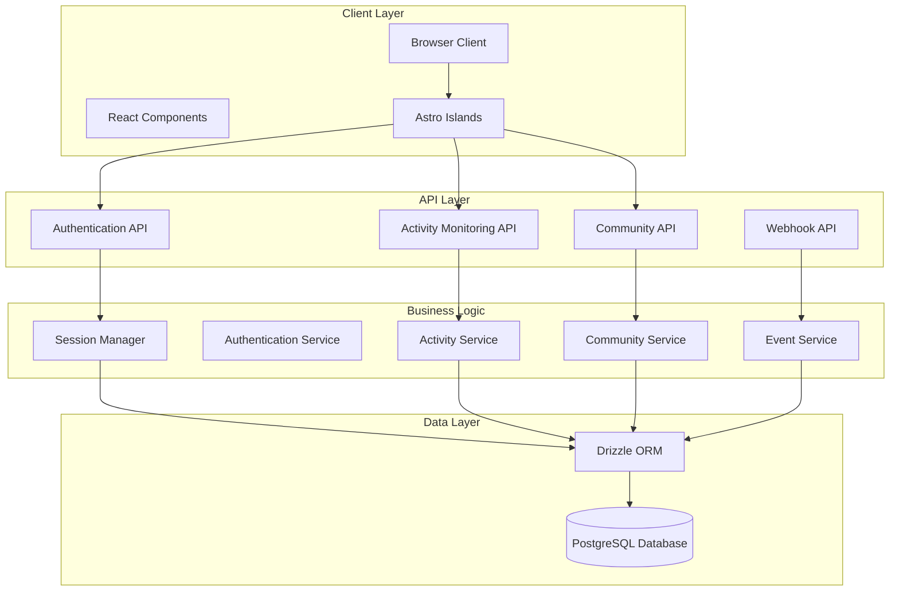
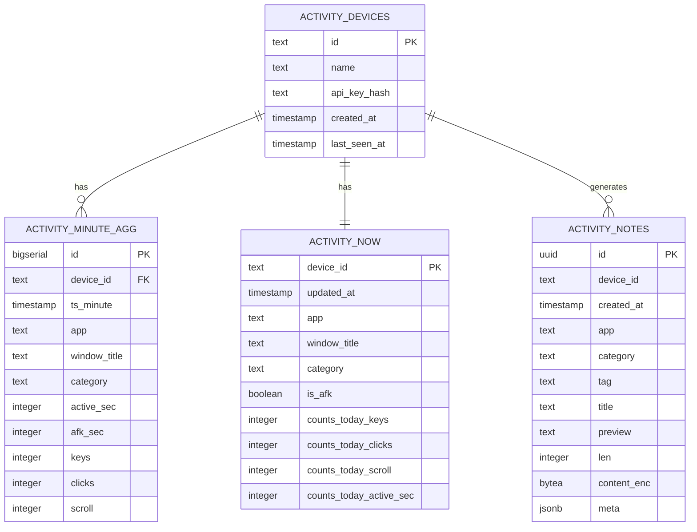
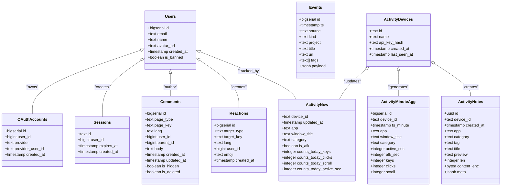
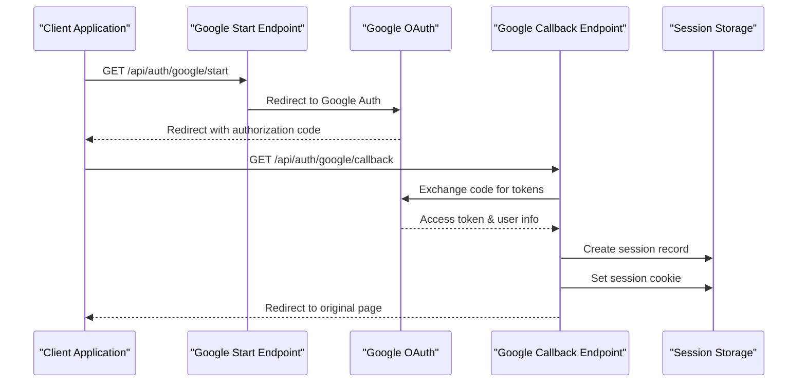
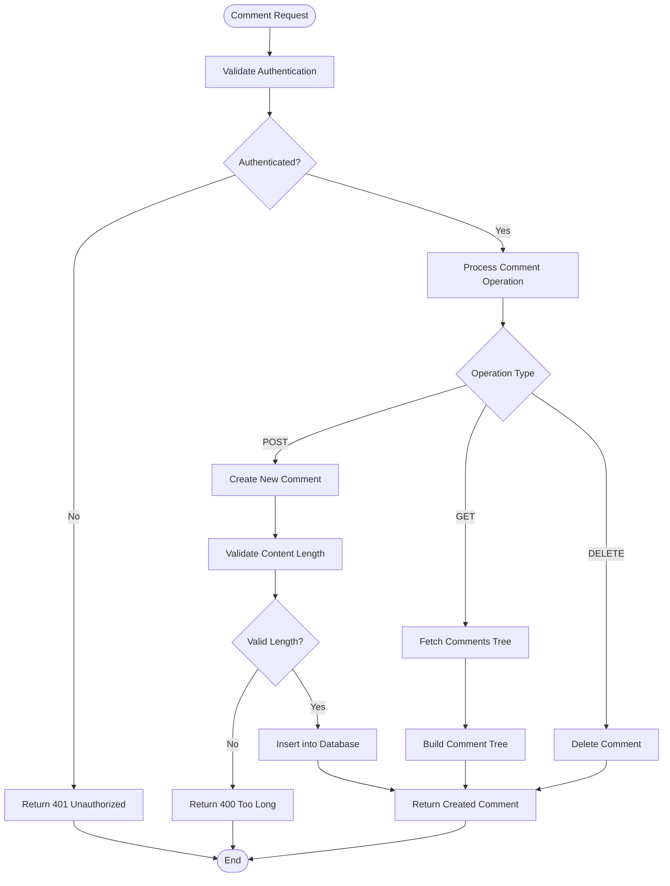
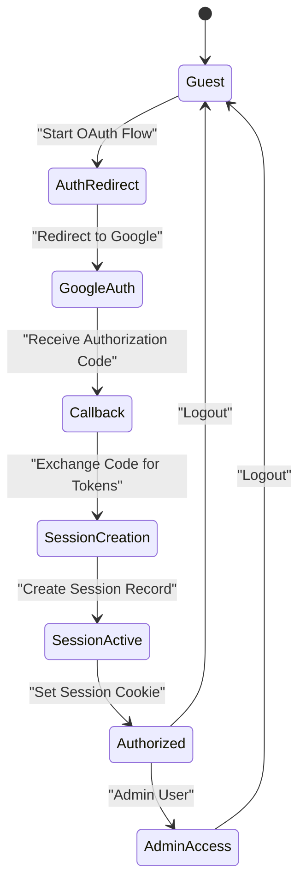
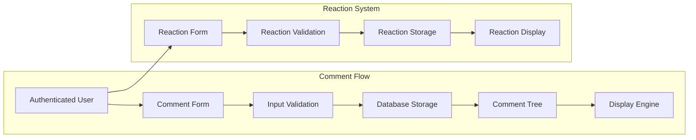
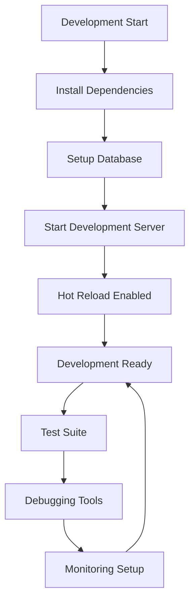
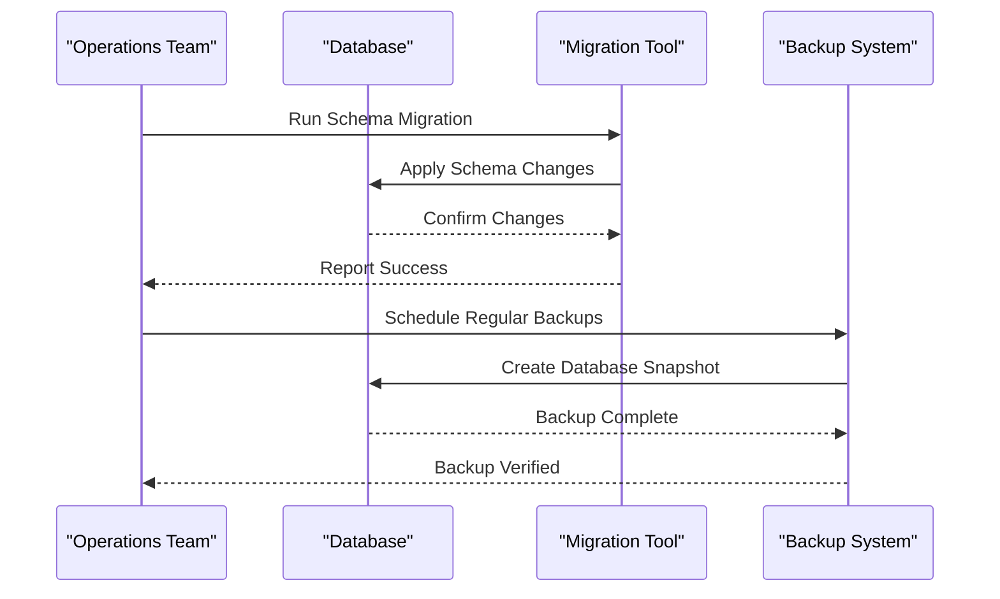

# Activity Monitoring System

<cite>
**Referenced Files in This Document**
- [README.md](file://README.md)
- [package.json](file://package.json)
- [src/db/index.ts](file://src/db/index.ts)
- [src/db/schema/index.ts](file://src/db/schema/index.ts)
- [src/lib/session.ts](file://src/lib/session.ts)
- [src/lib/auth.ts](file://src/lib/auth.ts)
- [src/pages/api/webhooks/github.ts](file://src/pages/api/webhooks/github.ts)
- [src/pages/api/events/deploy.ts](file://src/pages/api/events/deploy.ts)
- [src/pages/admin/moderation.astro](file://src/pages/admin/moderation.astro)
- [src/pages/api/comments/index.ts](file://src/pages/api/comments/index.ts)
- [src/pages/api/comments/[id]/flag.ts](file://src/pages/api/comments/[id]/flag.ts)
- [src/pages/api/comments/[id]/hide.ts](file://src/pages/api/comments/[id]/hide.ts)
- [src/pages/api/comments/[id]/unhide.ts](file://src/pages/api/comments/[id]/unhide.ts)
- [src/pages/api/reactions/index.ts](file://src/pages/api/reactions/index.ts)
- [src/pages/api/reactions/toggle.ts](file://src/pages/api/reactions/toggle.ts)
- [src/pages/api/auth/google/start.ts](file://src/pages/api/auth/google/start.ts)
- [src/pages/api/auth/google/callback.ts](file://src/pages/api/auth/google/callback.ts)
</cite>

## Table of Contents
1. [Introduction](#introduction)
2. [System Architecture](#system-architecture)
3. [Activity Monitoring Core Components](#activity-monitoring-core-components)
4. [Database Schema Design](#database-schema-design)
5. [API Endpoints](#api-endpoints)
6. [Authentication and Authorization](#authentication-and-authorization)
7. [Community Features](#community-features)
8. [Deployment and Operations](#deployment-and-operations)
9. [Security Implementation](#security-implementation)
10. [Performance Considerations](#performance-considerations)
11. [Troubleshooting Guide](#troubleshooting-guide)
12. [Conclusion](#conclusion)

## Introduction

The Activity Monitoring System is a comprehensive personal website platform built with modern web technologies, featuring soft cyberpunk aesthetics with advanced activity tracking capabilities. This system serves as a personal portfolio showcasing blog posts, projects, changelog, and community features while implementing sophisticated activity monitoring for productivity insights.

The platform combines Astro 5 (SSR with Node adapter), React 19 islands, TypeScript, Tailwind CSS, PostgreSQL with Drizzle ORM, and Google OAuth 2.0 to create a robust, scalable web application. The activity monitoring system specifically focuses on tracking user computer activity including application usage, window focus, keyboard input, mouse clicks, scrolling, and AFK detection.

## System Architecture

The Activity Monitoring System follows a modern full-stack architecture with clear separation of concerns:

**Diagram sources**
- [src/db/index.ts](file://src/db/index.ts#L1-L48)
- [src/lib/session.ts](file://src/lib/session.ts#L1-L58)
- [src/lib/auth.ts](file://src/lib/auth.ts#L1-L101)

The architecture implements several key design patterns:

- **Layered Architecture**: Clear separation between presentation, business logic, and data access layers
- **Repository Pattern**: Database operations abstracted through Drizzle ORM
- **Service Layer**: Business logic encapsulated in dedicated service classes
- **API Gateway Pattern**: Centralized API endpoints with consistent error handling
- **Event-Driven Architecture**: Webhooks and real-time updates through PostgreSQL triggers

**Section sources**
- [src/db/index.ts](file://src/db/index.ts#L1-L48)
- [src/lib/session.ts](file://src/lib/session.ts#L1-L58)
- [src/lib/auth.ts](file://src/lib/auth.ts#L1-L101)

## Activity Monitoring Core Components

The activity monitoring system consists of three primary data structures designed for efficient telemetry collection and analysis:

**Diagram sources**
- [src/db/schema/index.ts](file://src/db/schema/index.ts#L108-L177)

### Device Registration and Management

The system maintains a registry of registered devices that can send telemetry data. Each device is uniquely identified by an ID and requires API key authentication for data ingestion.

### Minute-Level Aggregation

Activity data is aggregated at minute intervals for historical analysis and reporting. This approach balances data granularity with storage efficiency, allowing for trend analysis over extended periods.

### Real-Time State Tracking

The `activity_now` table maintains the current state for each device, enabling real-time dashboards and immediate feedback systems. This includes current application focus, window title, activity classification, and daily counters.

### Encrypted Activity Notes

Users can create encrypted notes during their work sessions. These notes are stored securely with encryption-at-rest and include metadata for categorization and search capabilities.

**Section sources**
- [src/db/schema/index.ts](file://src/db/schema/index.ts#L108-L177)

## Database Schema Design

The database schema implements a comprehensive activity monitoring system with careful consideration for performance, scalability, and data integrity:

### Core Tables and Relationships

**Diagram sources**
- [src/db/schema/index.ts](file://src/db/schema/index.ts#L16-L177)

### Indexing Strategy

The schema implements strategic indexing for optimal query performance:

- **Composite indexes** on frequently queried column combinations
- **Unique constraints** to prevent duplicate entries
- **Foreign key relationships** with cascade deletes for data integrity
- **Custom data types** for specialized column types like encrypted content

### Data Types and Constraints

The schema utilizes PostgreSQL's advanced data types:
- **bytea** for encrypted binary content storage
- **jsonb** for flexible payload storage
- **Custom types** for specialized data handling
- **Array types** for multi-valued attributes

**Section sources**
- [src/db/schema/index.ts](file://src/db/schema/index.ts#L1-L194)

## API Endpoints

The system provides a comprehensive set of API endpoints organized by functionality:

### Authentication APIs

**Diagram sources**
- [src/pages/api/auth/google/start.ts](file://src/pages/api/auth/google/start.ts#L1-L15)
- [src/pages/api/auth/google/callback.ts](file://src/pages/api/auth/google/callback.ts#L1-L120)

### Activity Monitoring APIs

The activity monitoring system exposes endpoints for device registration, data ingestion, and analytics:

- **Device Registration**: API key-based device onboarding
- **Telemetry Ingestion**: Secure data upload with validation
- **Analytics Queries**: Historical data retrieval and aggregation
- **Real-time Status**: Current device state monitoring

### Community APIs

**Diagram sources**
- [src/pages/api/comments/index.ts](file://src/pages/api/comments/index.ts#L165-L240)

**Section sources**
- [src/pages/api/auth/google/start.ts](file://src/pages/api/auth/google/start.ts#L1-L15)
- [src/pages/api/auth/google/callback.ts](file://src/pages/api/auth/google/callback.ts#L1-L120)
- [src/pages/api/comments/index.ts](file://src/pages/api/comments/index.ts#L1-L240)

## Authentication and Authorization

The system implements a robust authentication framework with multiple security layers:

### Session-Based Authentication

**Diagram sources**
- [src/lib/session.ts](file://src/lib/session.ts#L13-L54)
- [src/lib/auth.ts](file://src/lib/auth.ts#L97-L101)

### Role-Based Access Control

The system implements role-based access control with administrative privileges:

- **Standard Users**: Full commenting and reaction capabilities
- **Administrators**: Full moderation and content management
- **Banned Users**: Restricted access with limited functionality

### Security Measures

- **Session Management**: Secure, HttpOnly cookies with configurable expiration
- **CSRF Protection**: State parameter validation in OAuth flow
- **Input Validation**: Comprehensive validation for all user inputs
- **Rate Limiting**: Built-in protection against abuse
- **SQL Injection Prevention**: Parameterized queries through Drizzle ORM

**Section sources**
- [src/lib/session.ts](file://src/lib/session.ts#L1-L58)
- [src/lib/auth.ts](file://src/lib/auth.ts#L1-L101)

## Community Features

The community system provides a comprehensive commenting and reaction platform:

### Comment System Architecture

**Diagram sources**
- [src/pages/api/comments/index.ts](file://src/pages/api/comments/index.ts#L1-L240)
- [src/pages/api/reactions/index.ts](file://src/pages/api/reactions/index.ts#L1-L82)

### Moderation Tools

The administration panel provides comprehensive moderation capabilities:

- **Flag Management**: User-reported content review
- **Content Hiding**: Immediate removal of inappropriate content
- **User Management**: Ban management and user activity monitoring
- **Bulk Operations**: Efficient handling of multiple moderation actions

### Real-Time Updates

The system supports near-real-time updates through:

- **WebSocket Connections**: Direct server-to-client communication
- **Polling Mechanisms**: Fallback for clients without WebSocket support
- **Event-Driven Updates**: Automatic refresh on content changes
- **Caching Strategies**: Optimized data retrieval with cache invalidation

**Section sources**
- [src/pages/admin/moderation.astro](file://src/pages/admin/moderation.astro#L1-L196)
- [src/pages/api/comments/index.ts](file://src/pages/api/comments/index.ts#L1-L240)
- [src/pages/api/reactions/index.ts](file://src/pages/api/reactions/index.ts#L1-L82)

## Deployment and Operations

The system supports multiple deployment environments with comprehensive operational tooling:

### Development Environment

**Diagram sources**
- [README.md](file://README.md#L25-L69)

### Production Deployment

The production deployment follows industry best practices:

- **PM2 Process Management**: Reliable application process supervision
- **Nginx Reverse Proxy**: Load balancing and SSL termination
- **Environment Separation**: Distinct configurations for different environments
- **Health Checks**: Automated monitoring and failover capabilities

### Database Operations

**Diagram sources**
- [README.md](file://README.md#L71-L154)

**Section sources**
- [README.md](file://README.md#L25-L154)

## Security Implementation

The system implements comprehensive security measures across all layers:

### Data Protection

- **Encryption**: Sensitive data stored with appropriate encryption
- **HTTPS**: All communications secured with TLS
- **Input Sanitization**: Comprehensive validation and sanitization
- **Output Encoding**: Prevention of XSS attacks through proper encoding

### Access Control

- **Role-Based Permissions**: Fine-grained access control based on user roles
- **API Key Management**: Secure device authentication with rotation policies
- **Session Security**: Secure session handling with automatic expiration
- **Audit Logging**: Comprehensive logging of security-relevant events

### Network Security

- **CORS Policy**: Strict cross-origin resource sharing controls
- **Rate Limiting**: Protection against brute force and abuse attacks
- **DDoS Mitigation**: Built-in protection against common attack vectors
- **Firewall Rules**: Network-level security controls

**Section sources**
- [src/lib/auth.ts](file://src/lib/auth.ts#L1-L101)
- [src/pages/api/webhooks/github.ts](file://src/pages/api/webhooks/github.ts#L1-L142)

## Performance Considerations

The system is optimized for high performance and scalability:

### Database Optimization

- **Connection Pooling**: Efficient database connection management
- **Query Optimization**: Indexed queries with minimal N+1 problems
- **Caching Strategy**: Multi-level caching for frequently accessed data
- **Background Jobs**: Asynchronous processing for heavy operations

### Frontend Performance

- **Code Splitting**: Dynamic imports for optimal loading
- **Image Optimization**: Responsive images with lazy loading
- **Bundle Optimization**: Minimized and compressed assets
- **Service Workers**: Offline capabilities and caching strategies

### Monitoring and Metrics

- **APM Integration**: Application performance monitoring
- **Error Tracking**: Comprehensive error reporting and analysis
- **Performance Budgets**: Hard limits on bundle sizes and load times
- **Uptime Monitoring**: 24/7 system health monitoring

## Troubleshooting Guide

Common issues and their solutions:

### Database Connection Issues

**Problem**: Database not responding or connection failures
**Solution**: Verify DATABASE_URL environment variable, check PostgreSQL service status, review connection pool settings

### Authentication Problems

**Problem**: Users unable to log in via Google OAuth
**Solution**: Verify Google OAuth credentials, check redirect URI configuration, validate SSL certificate, review browser console for CORS errors

### API Endpoint Failures

**Problem**: Activity monitoring endpoints returning errors
**Solution**: Check API key validity, verify request format, review server logs, validate webhook signatures for GitHub events

### Performance Issues

**Problem**: Slow page loads or API response times
**Solution**: Analyze database query performance, check connection pooling, implement caching strategies, review CDN configuration

**Section sources**
- [src/db/index.ts](file://src/db/index.ts#L18-L45)
- [src/lib/auth.ts](file://src/lib/auth.ts#L41-L95)
- [src/pages/api/webhooks/github.ts](file://src/pages/api/webhooks/github.ts#L47-L142)

## Conclusion

The Activity Monitoring System represents a comprehensive solution for personal productivity tracking integrated with a modern web platform. The system successfully combines advanced activity monitoring capabilities with community features, authentication, and robust operational tooling.

Key strengths of the implementation include:

- **Scalable Architecture**: Well-designed layered architecture supporting growth
- **Security Focus**: Comprehensive security measures across all system layers
- **Developer Experience**: Excellent tooling and development workflow
- **Performance Optimization**: Careful attention to performance and scalability
- **Production Ready**: Complete deployment and operational tooling

The system provides a solid foundation for personal productivity insights while maintaining excellent user experience and developer maintainability. Future enhancements could include additional analytics capabilities, expanded device support, and advanced visualization features.