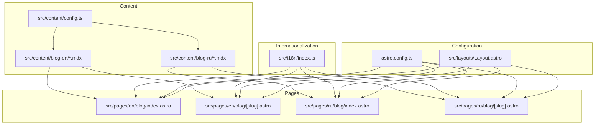
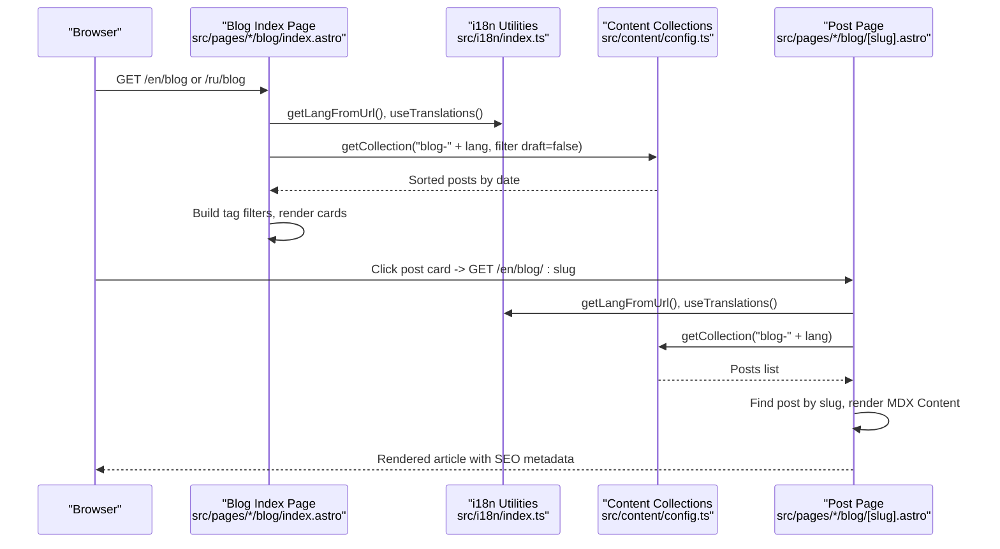
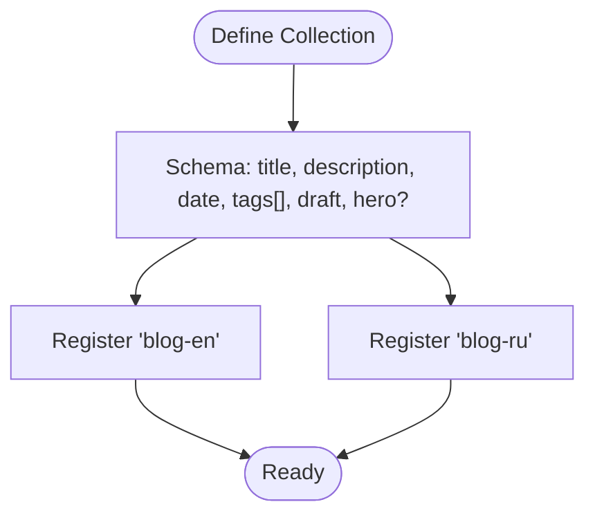
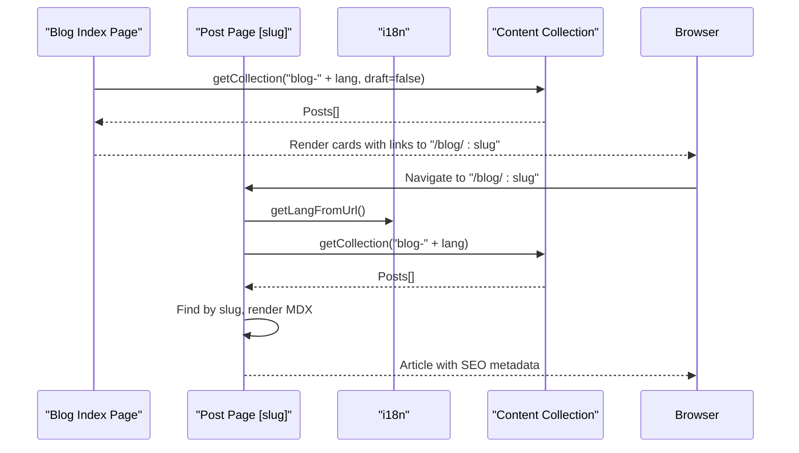
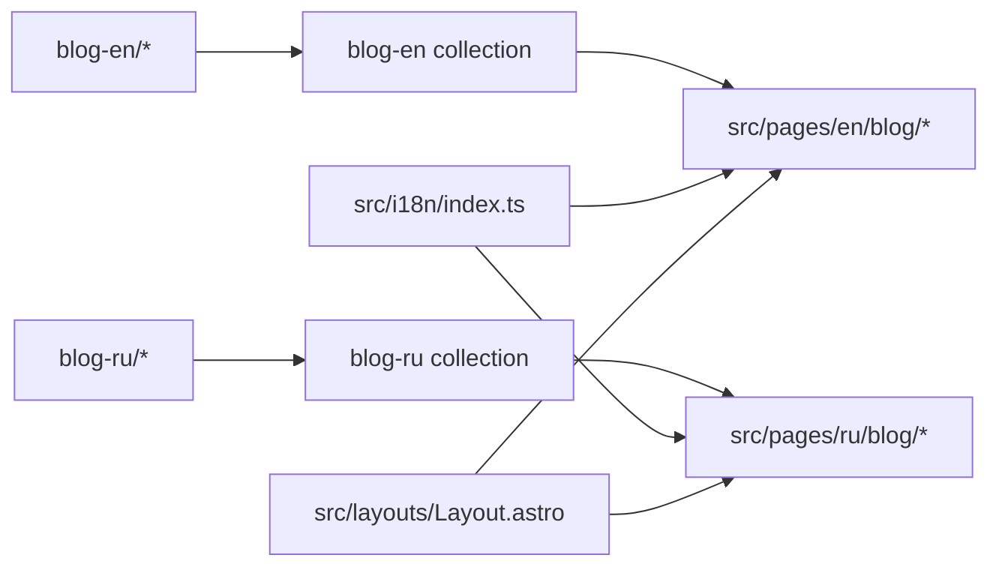
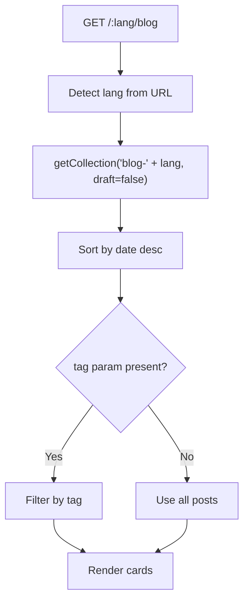
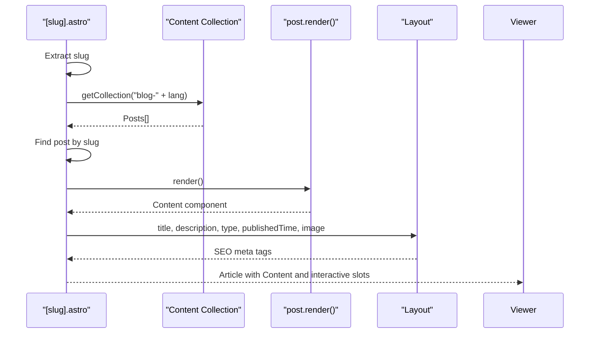
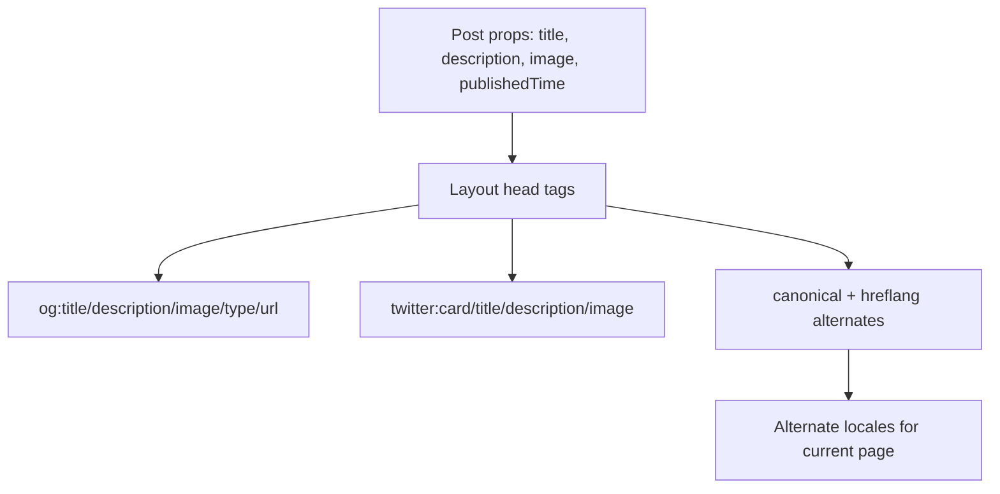
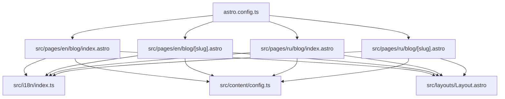

# Blog Content Management

<cite>
**Referenced Files in This Document**
- [config.ts](file://src/content/config.ts)
- [welcome.mdx (en)](file://src/content/blog-en/welcome.mdx)
- [welcome.mdx (ru)](file://src/content/blog-ru/welcome.mdx)
- [blog index (en).astro](file://src/pages/en/blog/index.astro)
- [blog post (en).astro](file://src/pages/en/blog/[slug].astro)
- [blog index (ru).astro](file://src/pages/ru/blog/index.astro)
- [blog post (ru).astro](file://src/pages/ru/blog/[slug].astro)
- [i18n index.ts](file://src/i18n/index.ts)
- [astro config.ts](file://astro.config.ts)
- [Layout.astro](file://src/layouts/Layout.astro)
</cite>

## Table of Contents
1. [Introduction](#introduction)
2. [Project Structure](#project-structure)
3. [Core Components](#core-components)
4. [Architecture Overview](#architecture-overview)
5. [Detailed Component Analysis](#detailed-component-analysis)
6. [Dependency Analysis](#dependency-analysis)
7. [Performance Considerations](#performance-considerations)
8. [Troubleshooting Guide](#troubleshooting-guide)
9. [Conclusion](#conclusion)
10. [Appendices](#appendices)

## Introduction
This document explains the blog content management system built with Astro’s content collections and MDX. It covers the blog post structure with frontmatter fields, content organization patterns, slug-based routing, MDX authoring workflow, content preview capabilities, multilingual management, listing and single-post rendering, navigation, and SEO optimization. It also provides practical guidelines for creating new posts, managing metadata, implementing tags/categories, and integrating interactive components within MDX.

## Project Structure
The blog system is organized around Astro’s content collections and localized page routes:
- Content collections are defined under src/content with separate folders per locale (blog-en, blog-ru).
- Pages are organized under src/pages with locale-specific routes (en/blog, ru/blog).
- Internationalization utilities manage language detection, translations, and localized URLs.
- Astro configuration enables MDX, React integration, Tailwind, server output, and sitemap generation with i18n support.

**Diagram sources**
- [config.ts](file://src/content/config.ts#L1-L19)
- [blog index (en).astro](file://src/pages/en/blog/index.astro#L1-L104)
- [blog post (en).astro](file://src/pages/en/blog/[slug].astro#L1-L171)
- [blog index (ru).astro](file://src/pages/ru/blog/index.astro#L1-L106)
- [blog post (ru).astro](file://src/pages/ru/blog/[slug].astro#L1-L171)
- [i18n index.ts](file://src/i18n/index.ts#L1-L221)
- [astro config.ts](file://astro.config.ts#L1-L38)
- [Layout.astro](file://src/layouts/Layout.astro#L1-L97)

**Section sources**
- [config.ts](file://src/content/config.ts#L1-L19)
- [astro config.ts](file://astro.config.ts#L1-L38)

## Core Components
- Content collections: Define the schema for blog posts and register localized collections for English and Russian.
- Frontmatter fields: Standardized metadata (title, description, date, tags, draft, hero).
- Page routes: Locale-aware listing and single-post pages with slug-based routing.
- Internationalization utilities: Language detection, translations, localized paths, alternate locales.
- Layout and SEO: Open Graph, Twitter Cards, canonical links, alternate hreflangs, and optional noindex.

**Section sources**
- [config.ts](file://src/content/config.ts#L1-L19)
- [Layout.astro](file://src/layouts/Layout.astro#L1-L97)
- [i18n index.ts](file://src/i18n/index.ts#L1-L221)

## Architecture Overview
The system fetches content via Astro’s content collections, filters drafts, sorts by date, and renders localized pages. MDX content is rendered into HTML and embedded into the post layout. Multilingual variants are kept in separate directories and accessed via locale-prefixed collection names.

**Diagram sources**
- [blog index (en).astro](file://src/pages/en/blog/index.astro#L1-L104)
- [blog post (en).astro](file://src/pages/en/blog/[slug].astro#L1-L171)
- [blog index (ru).astro](file://src/pages/ru/blog/index.astro#L1-L106)
- [blog post (ru).astro](file://src/pages/ru/blog/[slug].astro#L1-L171)
- [i18n index.ts](file://src/i18n/index.ts#L191-L221)
- [config.ts](file://src/content/config.ts#L1-L19)

## Detailed Component Analysis

### Content Collections and Schema
- Collection definition: A single content collection schema is reused for both English and Russian blogs.
- Fields:
  - title: string
  - description: string
  - date: string transformed to Date
  - tags: array of strings (defaults to empty)
  - draft: boolean (defaults to false)
  - hero: optional string (image URL)
- Registration: Two collections registered under blog-en and blog-ru.

**Diagram sources**
- [config.ts](file://src/content/config.ts#L1-L19)

**Section sources**
- [config.ts](file://src/content/config.ts#L1-L19)

### MDX Authoring Workflow
- Location: Posts live under src/content/blog-<lang>/<slug>.mdx.
- Frontmatter: Configure title, description, date, tags, draft, hero.
- Content: Markdown with embedded MDX components.
- Rendering: Each post exposes a render() method; Content is embedded in the post page.

Examples of frontmatter configuration:
- English example frontmatter: [welcome.mdx (en)](file://src/content/blog-en/welcome.mdx#L1-L7)
- Russian example frontmatter: [welcome.mdx (ru)](file://src/content/blog-ru/welcome.mdx#L1-L7)

**Section sources**
- [welcome.mdx (en)](file://src/content/blog-en/welcome.mdx#L1-L38)
- [welcome.mdx (ru)](file://src/content/blog-ru/welcome.mdx#L1-L38)
- [blog post (en).astro](file://src/pages/en/blog/[slug].astro#L22-L22)
- [blog post (ru).astro](file://src/pages/ru/blog/[slug].astro#L22-L22)

### Slug-Based Routing and Navigation
- Listing pages: src/pages/<lang>/blog/index.astro fetches posts from blog-<lang>, filters drafts, sorts by date, and builds tag filters.
- Single post pages: src/pages/<lang>/blog/[slug].astro resolves the post by slug and renders MDX content.
- Navigation:
  - Back links to the blog index.
  - Tag links filter posts by tag.
  - Localized paths generated via getLocalizedPath.

**Diagram sources**
- [blog index (en).astro](file://src/pages/en/blog/index.astro#L9-L28)
- [blog post (en).astro](file://src/pages/en/blog/[slug].astro#L9-L30)
- [blog index (ru).astro](file://src/pages/ru/blog/index.astro#L9-L28)
- [blog post (ru).astro](file://src/pages/ru/blog/[slug].astro#L9-L30)
- [i18n index.ts](file://src/i18n/index.ts#L191-L221)
- [config.ts](file://src/content/config.ts#L15-L18)

**Section sources**
- [blog index (en).astro](file://src/pages/en/blog/index.astro#L1-L104)
- [blog post (en).astro](file://src/pages/en/blog/[slug].astro#L1-L171)
- [blog index (ru).astro](file://src/pages/ru/blog/index.astro#L1-L106)
- [blog post (ru).astro](file://src/pages/ru/blog/[slug].astro#L1-L171)
- [i18n index.ts](file://src/i18n/index.ts#L191-L221)

### Multilingual Blog Post Management
- Organization: Separate directories for each language (blog-en, blog-ru).
- Access: Pages dynamically select the correct collection based on the URL’s language segment.
- Translations: UI strings are managed in src/i18n/index.ts with keys for blog-related terms.
- Alternate locales: Canonical and hreflang tags are generated in the Layout component.

**Diagram sources**
- [config.ts](file://src/content/config.ts#L15-L18)
- [blog index (en).astro](file://src/pages/en/blog/index.astro#L6-L7)
- [blog post (en).astro](file://src/pages/en/blog/[slug].astro#L6-L7)
- [blog index (ru).astro](file://src/pages/ru/blog/index.astro#L6-L7)
- [blog post (ru).astro](file://src/pages/ru/blog/[slug].astro#L6-L7)
- [i18n index.ts](file://src/i18n/index.ts#L1-L221)
- [Layout.astro](file://src/layouts/Layout.astro#L21-L25)

**Section sources**
- [config.ts](file://src/content/config.ts#L15-L18)
- [i18n index.ts](file://src/i18n/index.ts#L1-L221)
- [Layout.astro](file://src/layouts/Layout.astro#L21-L55)

### Blog Listing Pages
- Fetch and filter: Posts are retrieved from the locale-specific collection and filtered to exclude drafts.
- Sorting: Posts are sorted by date descending.
- Tag filtering: A URL query parameter (tag) filters posts by selected tag; “All posts” resets the filter.
- Card rendering: Each card displays date, up to three tags, title, and description.

**Diagram sources**
- [blog index (en).astro](file://src/pages/en/blog/index.astro#L9-L28)
- [blog index (ru).astro](file://src/pages/ru/blog/index.astro#L9-L28)

**Section sources**
- [blog index (en).astro](file://src/pages/en/blog/index.astro#L1-L104)
- [blog index (ru).astro](file://src/pages/ru/blog/index.astro#L1-L106)

### Individual Post Rendering
- Slug resolution: Extract slug from route params and locate the post in the locale collection.
- Redirects: If slug is missing or not found, redirect to the localized blog index.
- Metadata: Title, description, article type, published time, and hero image are passed to the Layout for SEO.
- Content rendering: post.render() produces the MDX Content component, embedded inside a prose-styled container.
- Interactive placeholders: Reactions and comments are attached via DOM placeholders with data attributes.

**Diagram sources**
- [blog post (en).astro](file://src/pages/en/blog/[slug].astro#L9-L30)
- [blog post (ru).astro](file://src/pages/ru/blog/[slug].astro#L9-L30)
- [Layout.astro](file://src/layouts/Layout.astro#L33-L57)

**Section sources**
- [blog post (en).astro](file://src/pages/en/blog/[slug].astro#L1-L171)
- [blog post (ru).astro](file://src/pages/ru/blog/[slug].astro#L1-L171)
- [Layout.astro](file://src/layouts/Layout.astro#L1-L97)

### SEO and Social Metadata
- Open Graph and Twitter Cards: Generated in the Layout component using title, description, image, and optional published time.
- Canonical URL and alternate locales: Provided via getAlternateLocales and canonical URL construction.
- Optional noindex: Supported via a prop to prevent indexing when needed.

**Diagram sources**
- [Layout.astro](file://src/layouts/Layout.astro#L19-L57)
- [i18n index.ts](file://src/i18n/index.ts#L212-L221)

**Section sources**
- [Layout.astro](file://src/layouts/Layout.astro#L1-L97)
- [i18n index.ts](file://src/i18n/index.ts#L212-L221)

## Dependency Analysis
- Pages depend on i18n utilities for language detection and localized paths.
- Pages depend on content collections for fetching and sorting posts.
- Layout depends on i18n for alternate locales and on Astro.site for absolute URLs.
- Astro configuration integrates MDX, React, Tailwind, and sitemap with i18n.

**Diagram sources**
- [blog index (en).astro](file://src/pages/en/blog/index.astro#L1-L10)
- [blog post (en).astro](file://src/pages/en/blog/[slug].astro#L1-L10)
- [blog index (ru).astro](file://src/pages/ru/blog/index.astro#L1-L10)
- [blog post (ru).astro](file://src/pages/ru/blog/[slug].astro#L1-L10)
- [i18n index.ts](file://src/i18n/index.ts#L1-L221)
- [config.ts](file://src/content/config.ts#L1-L19)
- [Layout.astro](file://src/layouts/Layout.astro#L1-L97)
- [astro config.ts](file://astro.config.ts#L1-L38)

**Section sources**
- [astro config.ts](file://astro.config.ts#L1-L38)
- [i18n index.ts](file://src/i18n/index.ts#L1-L221)

## Performance Considerations
- Draft filtering: Filtering by draft in the query reduces unnecessary data processing.
- Sorting: Sorting by date is O(n log n); consider caching or pre-sorting if content volume grows.
- Tag extraction: Unique tags computed once per request; keep tag lists manageable.
- MDX rendering: Rendering occurs per-request; consider CDN caching and server-side rendering benefits.
- Image handling: Use the hero field for optimized images; ensure proper alt text and lazy loading.

## Troubleshooting Guide
- Missing or invalid slug:
  - Symptom: Redirect to blog index.
  - Cause: No slug param or post not found.
  - Fix: Ensure slug exists in the correct locale collection.
- Incorrect language prefix:
  - Symptom: Wrong content or 404.
  - Cause: URL lacks language prefix or incorrect prefix.
  - Fix: Use getLocalizedPath to construct correct URLs.
- SEO metadata issues:
  - Symptom: Missing social previews or wrong canonical.
  - Cause: Missing image or publishedTime, or incorrect alternates.
  - Fix: Provide hero image, publishedTime, and confirm alternate locales.
- Tag filter not working:
  - Symptom: All posts shown despite tag param.
  - Cause: Tag mismatch or malformed URL.
  - Fix: Verify tag spelling and URL encoding.

**Section sources**
- [blog post (en).astro](file://src/pages/en/blog/[slug].astro#L11-L20)
- [blog post (ru).astro](file://src/pages/ru/blog/[slug].astro#L11-L20)
- [i18n index.ts](file://src/i18n/index.ts#L206-L210)
- [Layout.astro](file://src/layouts/Layout.astro#L33-L57)

## Conclusion
The blog system leverages Astro’s content collections and MDX to deliver a structured, multilingual, and SEO-ready content platform. Content is authored in localized directories, rendered through locale-aware pages, and enriched with interactive components and robust metadata. Following the guidelines below ensures consistent authoring, reliable navigation, and optimal discoverability.

## Appendices

### Writing New Blog Posts
- Create a new MDX file under src/content/blog-<lang>/<slug>.mdx.
- Add frontmatter fields: title, description, date, tags, draft, hero.
- Write content in Markdown with optional MDX components.
- Verify the post appears on the localized listing after build.

**Section sources**
- [config.ts](file://src/content/config.ts#L5-L12)
- [welcome.mdx (en)](file://src/content/blog-en/welcome.mdx#L1-L7)
- [welcome.mdx (ru)](file://src/content/blog-ru/welcome.mdx#L1-L7)

### Managing Metadata
- title and description: Used for SEO and social previews.
- date: Stored as string and transformed to Date; controls sort order.
- tags: Array of strings; used for filtering and categorization.
- draft: Boolean flag to hide posts until ready.
- hero: Optional image URL for article preview and Open Graph image.

**Section sources**
- [config.ts](file://src/content/config.ts#L5-L12)
- [Layout.astro](file://src/layouts/Layout.astro#L33-L57)

### Implementing Tags and Categories
- Add tags in frontmatter; they appear on cards and post headers.
- Use the tag query parameter on the blog index to filter posts.
- Limit visible tags per card to three for readability.

**Section sources**
- [blog index (en).astro](file://src/pages/en/blog/index.astro#L12-L20)
- [blog post (en).astro](file://src/pages/en/blog/[slug].astro#L58-L65)

### Optimizing for SEO
- Provide title, description, hero image, and publishedTime on posts.
- Confirm canonical URL and alternate locales are set in Layout.
- Use sitemap integration configured in Astro config for i18n.

**Section sources**
- [Layout.astro](file://src/layouts/Layout.astro#L21-L57)
- [astro config.ts](file://astro.config.ts#L20-L29)

### Example Frontmatter References
- English example: [welcome.mdx (en)](file://src/content/blog-en/welcome.mdx#L1-L7)
- Russian example: [welcome.mdx (ru)](file://src/content/blog-ru/welcome.mdx#L1-L7)