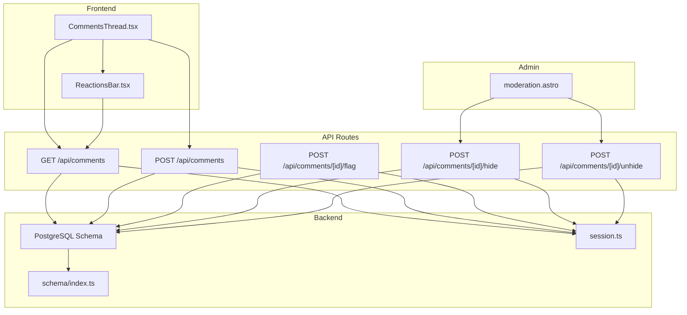
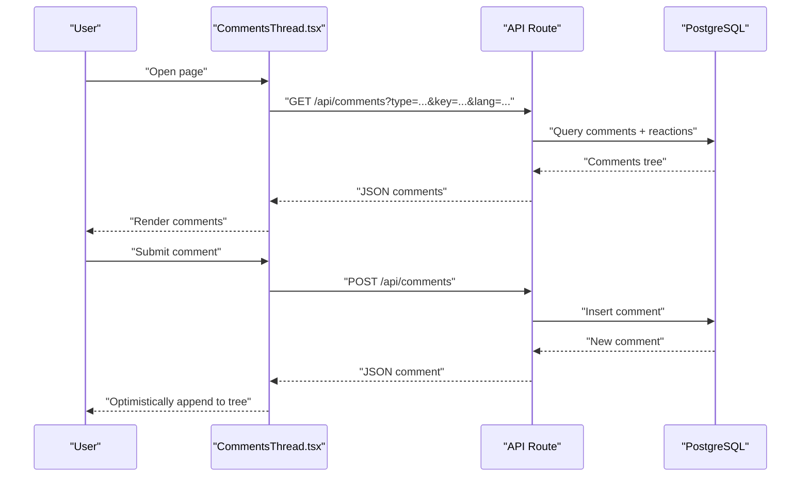
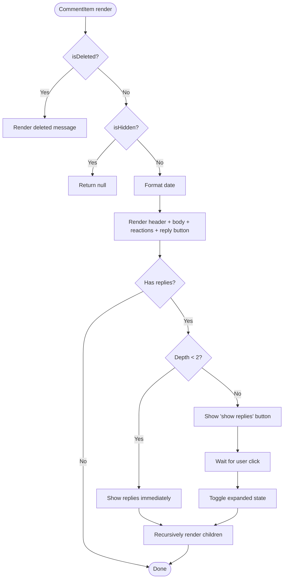
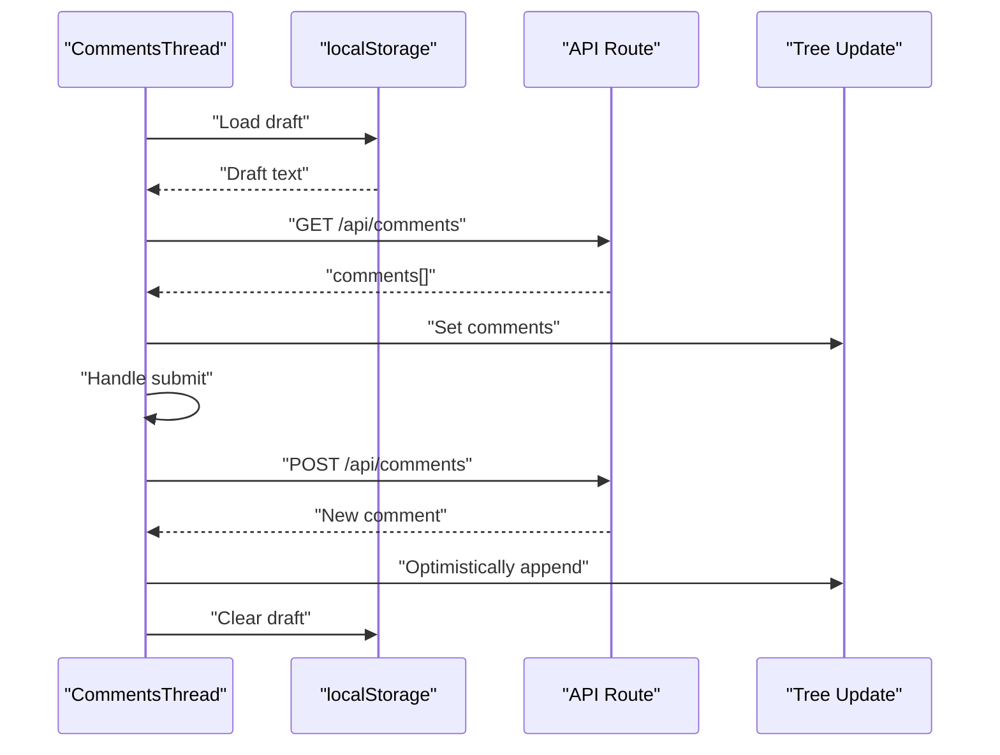
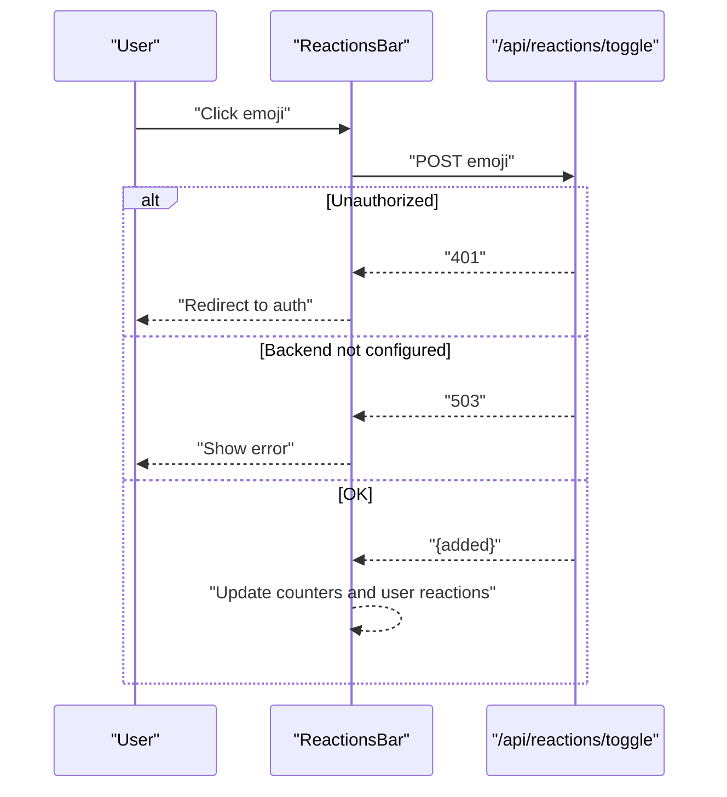
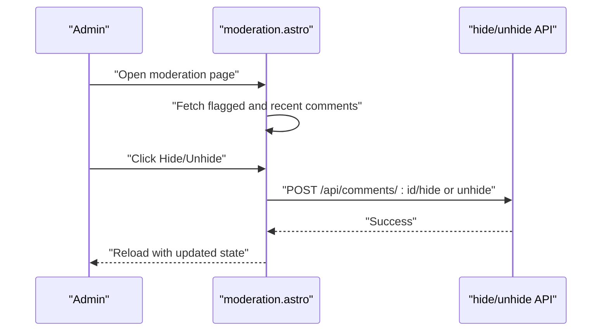
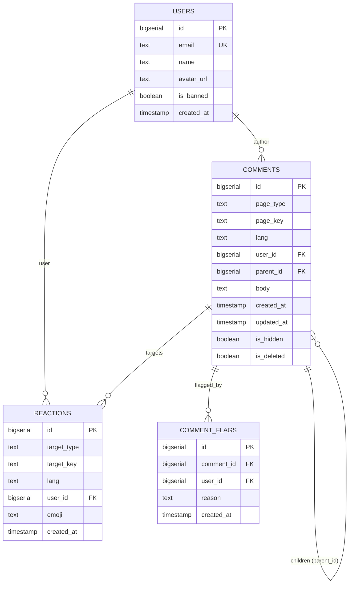
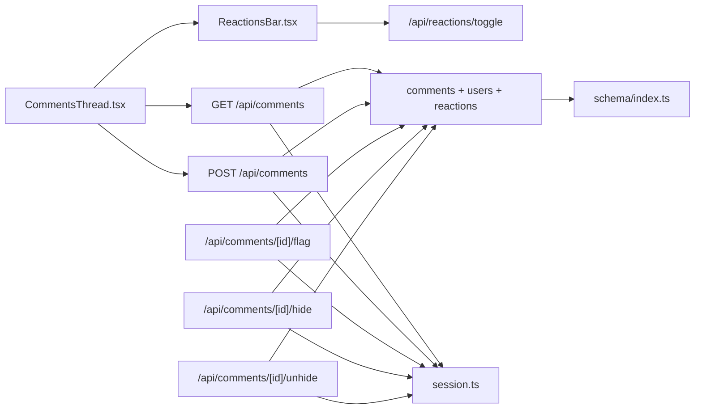

# Comment System

<cite>
**Referenced Files in This Document**
- [CommentsThread.tsx](file://src/components/CommentsThread.tsx)
- [ReactionsBar.tsx](file://src/components/ReactionsBar.tsx)
- [comments.index.ts](file://src/pages/api/comments/index.ts)
- [comments.flag.ts](file://src/pages/api/comments/[id]/flag.ts)
- [comments.hide.ts](file://src/pages/api/comments/[id]/hide.ts)
- [comments.unhide.ts](file://src/pages/api/comments/[id]/unhide.ts)
- [moderation.astro](file://src/pages/admin/moderation.astro)
- [schema.index.ts](file://src/db/schema/index.ts)
- [session.ts](file://src/lib/session.ts)
</cite>

## Table of Contents
1. [Introduction](#introduction)
2. [Project Structure](#project-structure)
3. [Core Components](#core-components)
4. [Architecture Overview](#architecture-overview)
5. [Detailed Component Analysis](#detailed-component-analysis)
6. [Dependency Analysis](#dependency-analysis)
7. [Performance Considerations](#performance-considerations)
8. [Troubleshooting Guide](#troubleshooting-guide)
9. [Conclusion](#conclusion)

## Introduction
This document describes the comment system architecture, covering hierarchical threading, CRUD operations, moderation capabilities, and frontend integration. It explains the CommentItem component with recursive rendering and reply functionality, the comment data model with nested replies and visibility states, and the API endpoints for creating, flagging, hiding, and unhiding comments. It also documents frontend integration patterns including local storage for drafts, real-time comment loading, and error handling strategies.

## Project Structure
The comment system spans frontend React components and Astro API routes backed by a PostgreSQL schema via Drizzle ORM.

**Diagram sources**
- [CommentsThread.tsx](file://src/components/CommentsThread.tsx#L148-L365)
- [ReactionsBar.tsx](file://src/components/ReactionsBar.tsx#L13-L114)
- [comments.index.ts](file://src/pages/api/comments/index.ts#L6-L163)
- [comments.flag.ts](file://src/pages/api/comments/[id]/flag.ts#L7-L59)
- [comments.hide.ts](file://src/pages/api/comments/[id]/hide.ts#L7-L41)
- [comments.unhide.ts](file://src/pages/api/comments/[id]/unhide.ts#L7-L41)
- [schema.index.ts](file://src/db/schema/index.ts#L36-L77)
- [session.ts](file://src/lib/session.ts#L13-L54)
- [moderation.astro](file://src/pages/admin/moderation.astro#L1-L194)

**Section sources**
- [CommentsThread.tsx](file://src/components/CommentsThread.tsx#L1-L366)
- [ReactionsBar.tsx](file://src/components/ReactionsBar.tsx#L1-L115)
- [comments.index.ts](file://src/pages/api/comments/index.ts#L1-L240)
- [comments.flag.ts](file://src/pages/api/comments/[id]/flag.ts#L1-L60)
- [comments.hide.ts](file://src/pages/api/comments/[id]/hide.ts#L1-L42)
- [comments.unhide.ts](file://src/pages/api/comments/[id]/unhide.ts#L1-L42)
- [schema.index.ts](file://src/db/schema/index.ts#L1-L104)
- [session.ts](file://src/lib/session.ts#L1-L58)
- [moderation.astro](file://src/pages/admin/moderation.astro#L1-L194)

## Core Components
- CommentsThread: Renders the comment tree, handles form submission, draft persistence, and error messaging.
- CommentItem: Recursive component rendering individual comments with replies, reactions, and reply actions.
- ReactionsBar: Manages emoji reactions for comments and posts.
- API routes: Provide CRUD-like operations for comments and moderation actions.
- Database schema: Defines comments, users, reactions, and comment flags.

**Section sources**
- [CommentsThread.tsx](file://src/components/CommentsThread.tsx#L38-L146)
- [CommentsThread.tsx](file://src/components/CommentsThread.tsx#L148-L365)
- [ReactionsBar.tsx](file://src/components/ReactionsBar.tsx#L13-L114)
- [comments.index.ts](file://src/pages/api/comments/index.ts#L6-L163)
- [comments.flag.ts](file://src/pages/api/comments/[id]/flag.ts#L7-L59)
- [comments.hide.ts](file://src/pages/api/comments/[id]/hide.ts#L7-L41)
- [comments.unhide.ts](file://src/pages/api/comments/[id]/unhide.ts#L7-L41)
- [schema.index.ts](file://src/db/schema/index.ts#L36-L77)

## Architecture Overview
The comment system follows a layered architecture:
- Frontend: React components manage UI state, user interactions, and optimistic updates.
- API Layer: Astro API routes handle authentication, validation, and database operations.
- Persistence: PostgreSQL schema with tables for comments, users, reactions, and flags.
- Moderation: Admin-only endpoints to hide/unhide comments; a moderation page aggregates flagged comments.

**Diagram sources**
- [CommentsThread.tsx](file://src/components/CommentsThread.tsx#L176-L206)
- [CommentsThread.tsx](file://src/components/CommentsThread.tsx#L208-L281)
- [comments.index.ts](file://src/pages/api/comments/index.ts#L6-L163)

## Detailed Component Analysis

### CommentItem Component
CommentItem renders a single comment with recursive replies. It supports:
- Visibility filtering: Deleted and hidden comments are handled gracefully.
- Reply expansion: Collapsed by default beyond a shallow depth; expands on user click.
- Nested rendering: Recursively renders child replies with increasing indentation.
- User info and timestamps: Displays avatar/name/date.
- Reactions integration: Delegates to ReactionsBar.

**Diagram sources**
- [CommentsThread.tsx](file://src/components/CommentsThread.tsx#L38-L146)

**Section sources**
- [CommentsThread.tsx](file://src/components/CommentsThread.tsx#L38-L146)

### CommentsThread Component
CommentsThread orchestrates the entire comment experience:
- State management: comments array, loading, submitting, reply-to state, body, error.
- Draft persistence: Reads/writes to localStorage keyed by page type and key.
- Real-time loading: Fetches comments on mount with robust error handling.
- Submission flow: Validates input, authenticates via redirect, inserts comment, and optimistically updates the tree.
- Reply UX: Sets reply-to context and focuses textarea.

**Diagram sources**
- [CommentsThread.tsx](file://src/components/CommentsThread.tsx#L157-L174)
- [CommentsThread.tsx](file://src/components/CommentsThread.tsx#L176-L206)
- [CommentsThread.tsx](file://src/components/CommentsThread.tsx#L208-L281)

**Section sources**
- [CommentsThread.tsx](file://src/components/CommentsThread.tsx#L148-L365)

### ReactionsBar Component
ReactionsBar manages emoji reactions:
- Emojis: Predefined set of emojis.
- Toggle logic: Sends a toggle request and updates counters and user reactions locally.
- Authentication: Redirects to Google OAuth when unauthorized.
- Error handling: Displays localized errors for network/backend issues.

**Diagram sources**
- [ReactionsBar.tsx](file://src/components/ReactionsBar.tsx#L25-L77)

**Section sources**
- [ReactionsBar.tsx](file://src/components/ReactionsBar.tsx#L13-L114)

### API Endpoints

#### GET /api/comments
- Purpose: Load comments for a given page and language.
- Behavior:
  - Validates presence of type, key, and lang.
  - Joins with users to populate author info.
  - Aggregates reaction counts and current user's reactions.
  - Builds a tree from flat records using parent-child relationships.
  - Returns root-level comments.

**Section sources**
- [comments.index.ts](file://src/pages/api/comments/index.ts#L6-L163)
- [schema.index.ts](file://src/db/schema/index.ts#L36-L51)

#### POST /api/comments
- Purpose: Create a new comment (root or reply).
- Behavior:
  - Requires authenticated user.
  - Validates required fields and length.
  - Inserts comment with optional parentId.
  - Returns newly created comment with empty reactions and replies.

**Section sources**
- [comments.index.ts](file://src/pages/api/comments/index.ts#L165-L239)
- [session.ts](file://src/lib/session.ts#L13-L54)

#### POST /api/comments/[id]/flag
- Purpose: Flag a comment for moderation.
- Behavior:
  - Requires authenticated user.
  - Validates comment existence.
  - Inserts a flag record with optional reason.

**Section sources**
- [comments.flag.ts](file://src/pages/api/comments/[id]/flag.ts#L7-L59)

#### POST /api/comments/[id]/hide
- Purpose: Hide a comment (admin-only).
- Behavior:
  - Requires admin user.
  - Updates isHidden to true.

**Section sources**
- [comments.hide.ts](file://src/pages/api/comments/[id]/hide.ts#L7-L41)
- [session.ts](file://src/lib/session.ts#L13-L54)

#### POST /api/comments/[id]/unhide
- Purpose: Unhide a comment (admin-only).
- Behavior:
  - Requires admin user.
  - Updates isHidden to false.

**Section sources**
- [comments.unhide.ts](file://src/pages/api/comments/[id]/unhide.ts#L7-L41)
- [session.ts](file://src/lib/session.ts#L13-L54)

### Moderation Page
The admin moderation page aggregates flagged comments and recent comments, enabling quick hide/unhide actions.

**Diagram sources**
- [moderation.astro](file://src/pages/admin/moderation.astro#L1-L194)
- [comments.hide.ts](file://src/pages/api/comments/[id]/hide.ts#L7-L41)
- [comments.unhide.ts](file://src/pages/api/comments/[id]/unhide.ts#L7-L41)

**Section sources**
- [moderation.astro](file://src/pages/admin/moderation.astro#L1-L194)

### Comment Data Model
The comment data model supports hierarchical threading, visibility, and reactions.

**Diagram sources**
- [schema.index.ts](file://src/db/schema/index.ts#L4-L104)

**Section sources**
- [schema.index.ts](file://src/db/schema/index.ts#L36-L77)

## Dependency Analysis
- Frontend components depend on:
  - Local storage for draft persistence.
  - Astro API routes for data and moderation actions.
  - ReactionsBar for reaction toggling.
- API routes depend on:
  - Drizzle ORM for database queries.
  - session.ts for user authentication and admin checks.
- Database schema defines foreign keys and indexes supporting:
  - Hierarchical threading via self-referencing parent_id.
  - Efficient lookups via composite indexes.

**Diagram sources**
- [CommentsThread.tsx](file://src/components/CommentsThread.tsx#L148-L365)
- [ReactionsBar.tsx](file://src/components/ReactionsBar.tsx#L13-L114)
- [comments.index.ts](file://src/pages/api/comments/index.ts#L6-L163)
- [comments.flag.ts](file://src/pages/api/comments/[id]/flag.ts#L7-L59)
- [comments.hide.ts](file://src/pages/api/comments/[id]/hide.ts#L7-L41)
- [comments.unhide.ts](file://src/pages/api/comments/[id]/unhide.ts#L7-L41)
- [schema.index.ts](file://src/db/schema/index.ts#L36-L77)
- [session.ts](file://src/lib/session.ts#L13-L54)

**Section sources**
- [CommentsThread.tsx](file://src/components/CommentsThread.tsx#L1-L366)
- [ReactionsBar.tsx](file://src/components/ReactionsBar.tsx#L1-L115)
- [comments.index.ts](file://src/pages/api/comments/index.ts#L1-L240)
- [comments.flag.ts](file://src/pages/api/comments/[id]/flag.ts#L1-L60)
- [comments.hide.ts](file://src/pages/api/comments/[id]/hide.ts#L1-L42)
- [comments.unhide.ts](file://src/pages/api/comments/[id]/unhide.ts#L1-L42)
- [schema.index.ts](file://src/db/schema/index.ts#L1-L104)
- [session.ts](file://src/lib/session.ts#L1-L58)

## Performance Considerations
- Tree building: The backend constructs the comment tree from flat records using a map and a single pass to attach children. This is O(n) in time and memory for n comments.
- Reaction aggregation: Reaction counts and user reactions are computed in two grouped queries, minimizing per-comment overhead.
- Indexing: Composite indexes on pageType/pageKey/lang and parent_id support efficient filtering and hierarchical traversal.
- Frontend rendering:
  - Recursive rendering is straightforward but can become expensive with very deep trees. Consider virtualization or pagination for extremely large trees.
  - Optimistic updates reduce perceived latency; ensure proper rollback on failure.
- Network:
  - Batched requests for reactions and comments are efficient; avoid redundant fetches by caching at the component level.

[No sources needed since this section provides general guidance]

## Troubleshooting Guide
Common issues and resolutions:
- Comments temporarily unavailable:
  - Backend not configured: API returns 503 with structured JSON error. The frontend displays a localized message and disables interactions.
- Unauthorized access:
  - Creating comments requires authentication; the API returns 401. The frontend redirects to Google OAuth and persists the draft.
- Network errors:
  - Frontend catches exceptions during fetch and displays a localized error message.
- Moderation actions:
  - Hide/unhide require admin privileges; otherwise 403 is returned. The moderation page reloads after successful actions.

**Section sources**
- [CommentsThread.tsx](file://src/components/CommentsThread.tsx#L176-L206)
- [CommentsThread.tsx](file://src/components/CommentsThread.tsx#L208-L281)
- [comments.index.ts](file://src/pages/api/comments/index.ts#L7-L12)
- [comments.hide.ts](file://src/pages/api/comments/[id]/hide.ts#L11-L16)
- [comments.unhide.ts](file://src/pages/api/comments/[id]/unhide.ts#L11-L16)
- [moderation.astro](file://src/pages/admin/moderation.astro#L178-L193)

## Conclusion
The comment system provides a robust, hierarchical threading model with strong moderation controls and integrated reactions. The frontend offers a smooth user experience with draft persistence and optimistic updates, while the backend ensures secure, scalable operations with clear separation of concerns. Extending the system—such as adding comment editing, deletion, or deeper moderation workflows—should preserve the existing patterns for authentication, error handling, and tree construction.