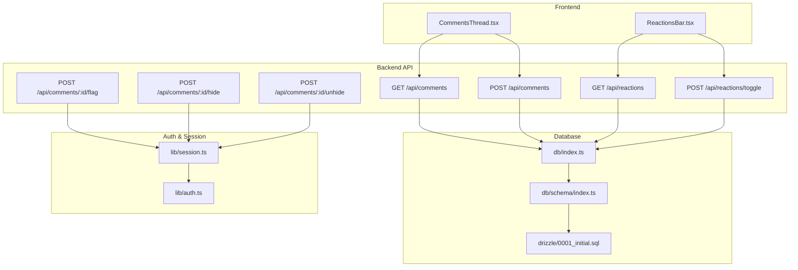
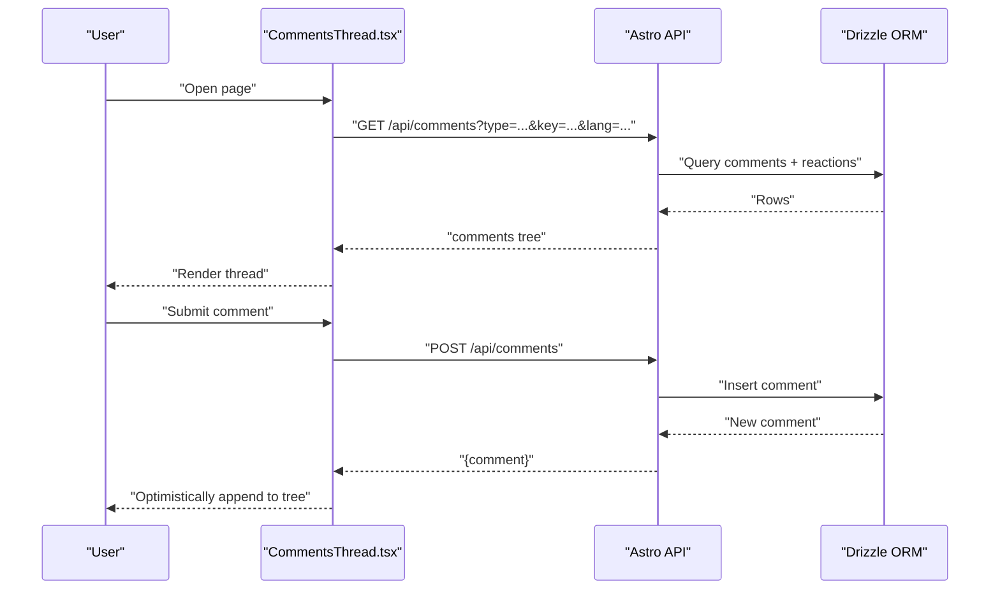
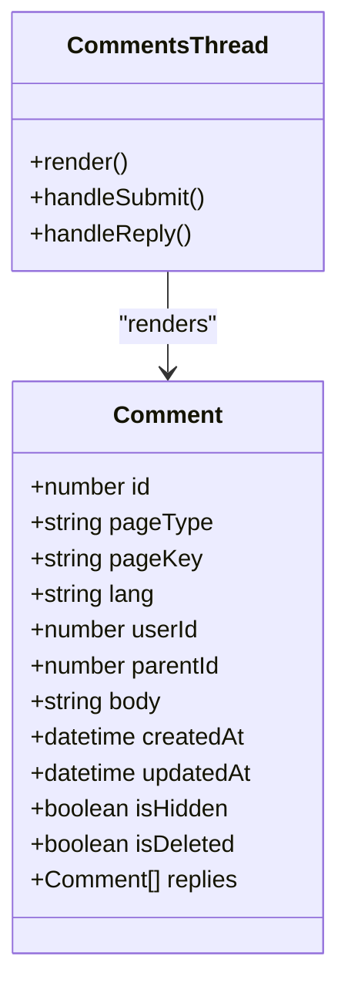
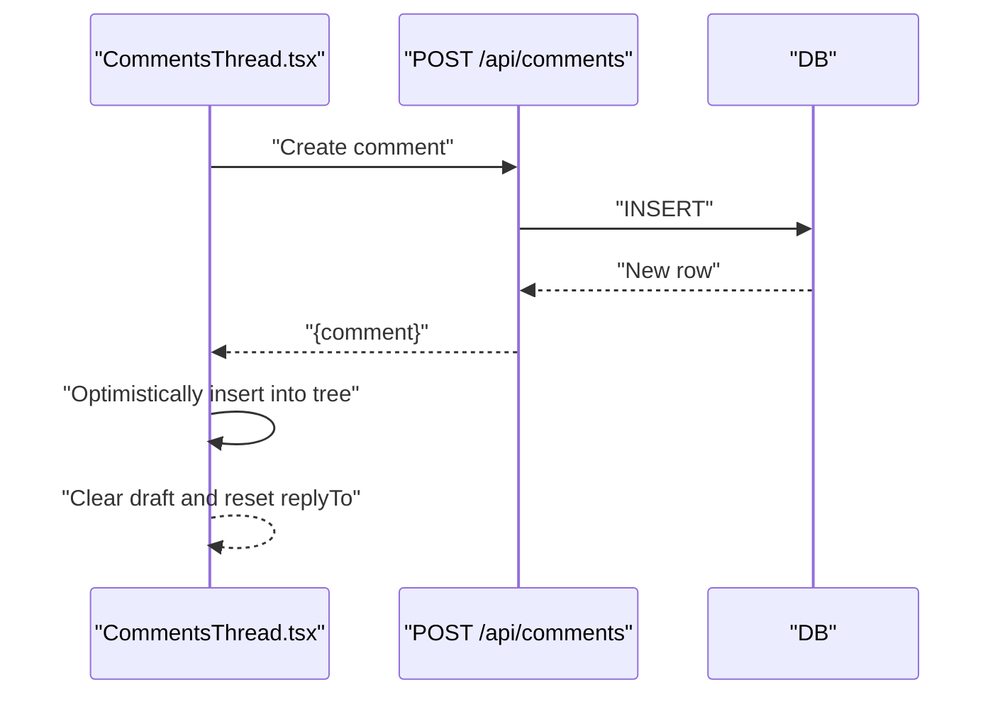
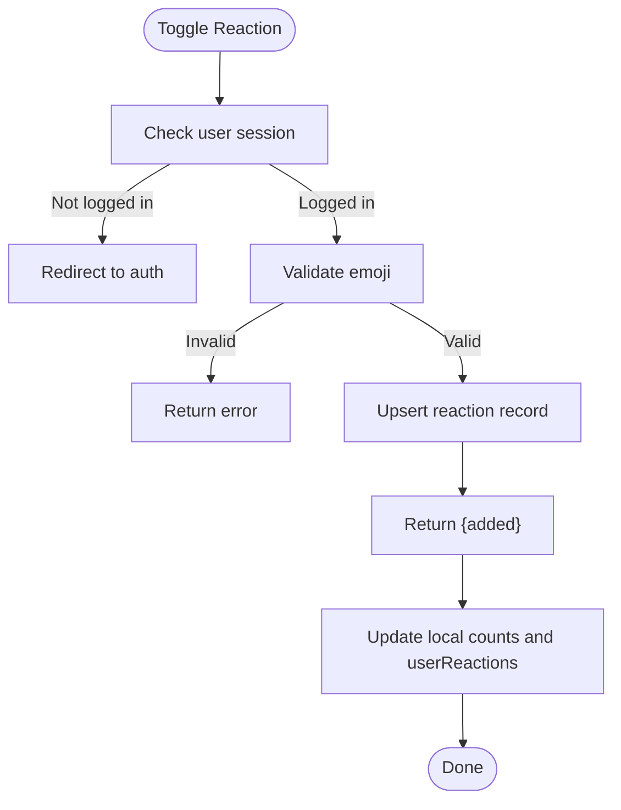
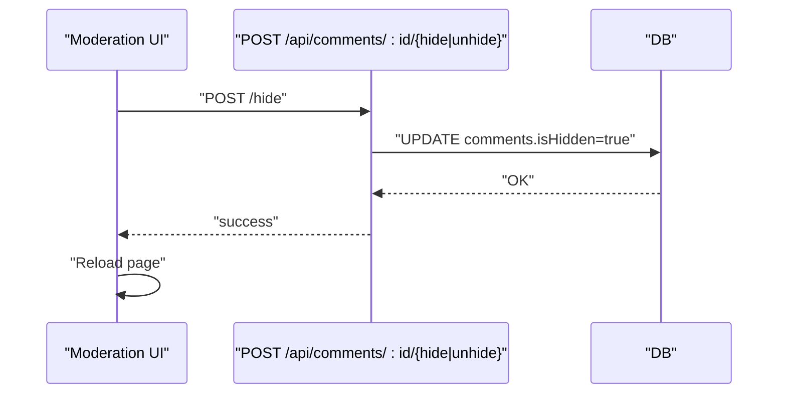
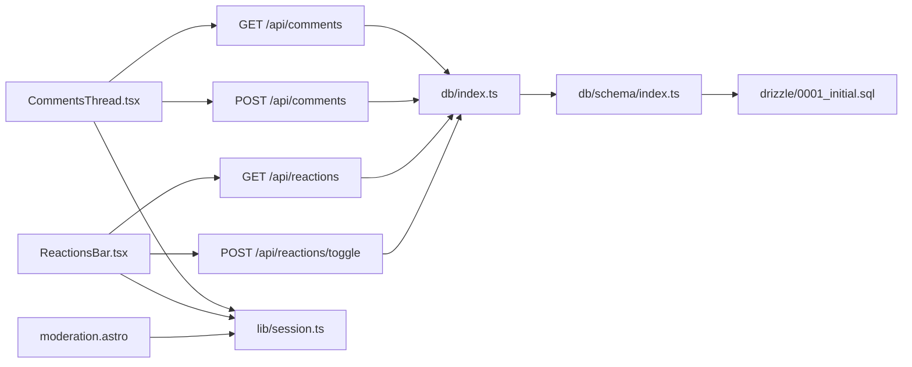
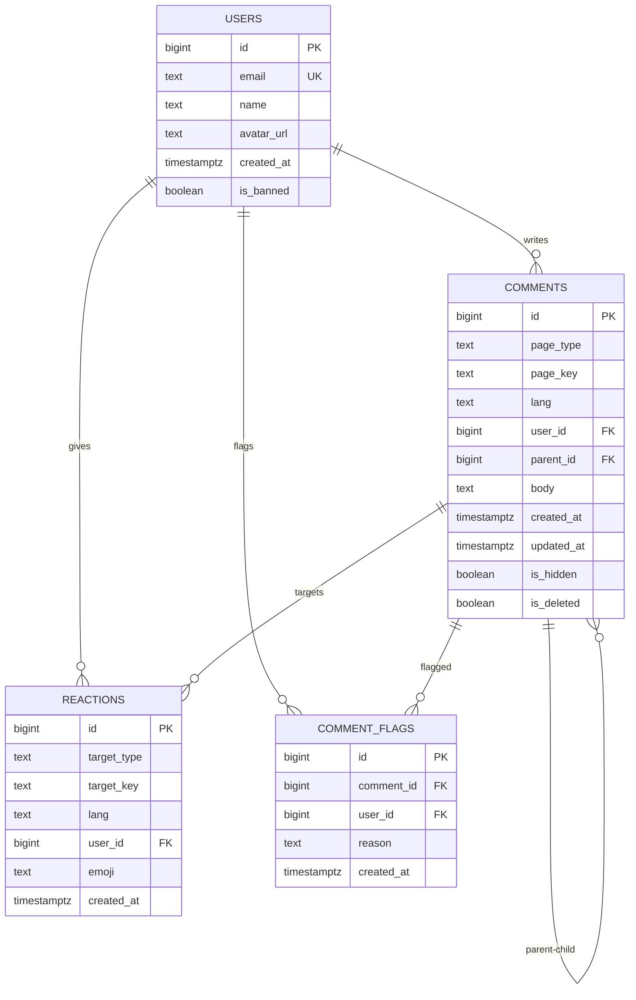

# Community Features

<cite>
**Referenced Files in This Document**
- [CommentsThread.tsx](file://src/components/CommentsThread.tsx)
- [ReactionsBar.tsx](file://src/components/ReactionsBar.tsx)
- [moderation.astro](file://src/pages/admin/moderation.astro)
- [comments.index.ts](file://src/pages/api/comments/index.ts)
- [reactions.index.ts](file://src/pages/api/reactions/index.ts)
- [reactions.toggle.ts](file://src/pages/api/reactions/toggle.ts)
- [comments.flag.ts](file://src/pages/api/comments/[id]/flag.ts)
- [comments.hide.ts](file://src/pages/api/comments/[id]/hide.ts)
- [comments.unhide.ts](file://src/pages/api/comments/[id]/unhide.ts)
- [schema.index.ts](file://src/db/schema/index.ts)
- [db.index.ts](file://src/db/index.ts)
- [session.ts](file://src/lib/session.ts)
- [auth.ts](file://src/lib/auth.ts)
- [0001_initial.sql](file://drizzle/0001_initial.sql)
</cite>

## Table of Contents
1. [Introduction](#introduction)
2. [Project Structure](#project-structure)
3. [Core Components](#core-components)
4. [Architecture Overview](#architecture-overview)
5. [Detailed Component Analysis](#detailed-component-analysis)
6. [Dependency Analysis](#dependency-analysis)
7. [Performance Considerations](#performance-considerations)
8. [Troubleshooting Guide](#troubleshooting-guide)
9. [Conclusion](#conclusion)
10. [Appendices](#appendices)

## Introduction
This document explains the community engagement features: the hierarchical comment threading system and the emoji-based reaction system. It covers:
- How comments are structured and rendered with nested replies
- Real-time-like interaction patterns via optimistic UI updates
- Moderation capabilities for comments
- The reaction system with emoji constraints and per-user state
- Frontend components for submitting comments, replying, and toggling reactions
- API endpoints for comment CRUD, reaction management, and moderation actions
- Guidance for extending the system, handling edge cases, and optimizing for large comment trees

## Project Structure
The community features span frontend React components, backend Astro API routes, and a PostgreSQL-backed schema managed by Drizzle ORM.

**Diagram sources**
- [CommentsThread.tsx](file://src/components/CommentsThread.tsx#L148-L366)
- [ReactionsBar.tsx](file://src/components/ReactionsBar.tsx#L13-L115)
- [comments.index.ts](file://src/pages/api/comments/index.ts#L6-L240)
- [reactions.index.ts](file://src/pages/api/reactions/index.ts#L6-L82)
- [reactions.toggle.ts](file://src/pages/api/reactions/toggle.ts#L8-L85)
- [comments.flag.ts](file://src/pages/api/comments/[id]/flag.ts#L7-L60)
- [comments.hide.ts](file://src/pages/api/comments/[id]/hide.ts#L7-L42)
- [comments.unhide.ts](file://src/pages/api/comments/[id]/unhide.ts#L7-L42)
- [db.index.ts](file://src/db/index.ts#L1-L37)
- [schema.index.ts](file://src/db/schema/index.ts#L35-L77)
- [0001_initial.sql](file://drizzle/0001_initial.sql#L35-L77)
- [session.ts](file://src/lib/session.ts#L13-L54)
- [auth.ts](file://src/lib/auth.ts#L41-L101)

**Section sources**
- [CommentsThread.tsx](file://src/components/CommentsThread.tsx#L1-L366)
- [ReactionsBar.tsx](file://src/components/ReactionsBar.tsx#L1-L115)
- [comments.index.ts](file://src/pages/api/comments/index.ts#L1-L240)
- [reactions.index.ts](file://src/pages/api/reactions/index.ts#L1-L82)
- [reactions.toggle.ts](file://src/pages/api/reactions/toggle.ts#L1-L85)
- [comments.flag.ts](file://src/pages/api/comments/[id]/flag.ts#L1-L60)
- [comments.hide.ts](file://src/pages/api/comments/[id]/hide.ts#L1-L42)
- [comments.unhide.ts](file://src/pages/api/comments/[id]/unhide.ts#L1-L42)
- [schema.index.ts](file://src/db/schema/index.ts#L1-L104)
- [db.index.ts](file://src/db/index.ts#L1-L37)
- [session.ts](file://src/lib/session.ts#L1-L58)
- [auth.ts](file://src/lib/auth.ts#L1-L101)
- [0001_initial.sql](file://drizzle/0001_initial.sql#L1-L94)

## Core Components
- CommentsThread: Renders a page-scoped comment thread, supports replying, draft persistence, and optimistic insertion of new comments.
- ReactionsBar: Manages emoji-based reactions for comments and posts with per-user state and optimistic updates.
- Moderation UI: Admin-only page to review flagged and recent comments and toggle visibility.
- API Routes: Provide comment retrieval/creation and reaction toggling, plus moderation endpoints.

**Section sources**
- [CommentsThread.tsx](file://src/components/CommentsThread.tsx#L148-L366)
- [ReactionsBar.tsx](file://src/components/ReactionsBar.tsx#L13-L115)
- [moderation.astro](file://src/pages/admin/moderation.astro#L1-L195)
- [comments.index.ts](file://src/pages/api/comments/index.ts#L6-L240)
- [reactions.toggle.ts](file://src/pages/api/reactions/toggle.ts#L8-L85)

## Architecture Overview
The system uses a client-server model:
- Frontend components fetch and mutate data via Astro API endpoints.
- Backend validates requests, enforces auth/session checks, and interacts with the database via Drizzle ORM.
- The database schema supports hierarchical comments, emoji reactions, and moderation flags.

**Diagram sources**
- [CommentsThread.tsx](file://src/components/CommentsThread.tsx#L176-L206)
- [comments.index.ts](file://src/pages/api/comments/index.ts#L6-L163)
- [db.index.ts](file://src/db/index.ts#L1-L37)

## Detailed Component Analysis

### Hierarchical Comment Threading
- Data model: Comments are stored with a self-referencing foreign key to support nesting. Indexes optimize queries by page and creation time.
- Tree building: Backend constructs a root-comment list and attaches replies by mapping parent-child relationships.
- Frontend rendering: Recursive component renders nested comments with indentation and reply reveal controls.

**Diagram sources**
- [schema.index.ts](file://src/db/schema/index.ts#L35-L51)
- [comments.index.ts](file://src/pages/api/comments/index.ts#L113-L150)
- [CommentsThread.tsx](file://src/components/CommentsThread.tsx#L38-L146)

**Section sources**
- [schema.index.ts](file://src/db/schema/index.ts#L35-L51)
- [comments.index.ts](file://src/pages/api/comments/index.ts#L113-L150)
- [CommentsThread.tsx](file://src/components/CommentsThread.tsx#L38-L146)

### Real-Time Interaction Patterns (Optimistic UI)
- Comment submission: Frontend sends POST to create a comment and immediately appends it to the visible tree without reloading.
- Reply toggling: Uses a local state to show/hide nested replies up to a shallow depth.
- Reaction toggling: Optimistically updates counts and user reaction set after a successful toggle request.

**Diagram sources**
- [CommentsThread.tsx](file://src/components/CommentsThread.tsx#L208-L281)
- [comments.index.ts](file://src/pages/api/comments/index.ts#L165-L239)

**Section sources**
- [CommentsThread.tsx](file://src/components/CommentsThread.tsx#L148-L366)
- [comments.index.ts](file://src/pages/api/comments/index.ts#L165-L239)

### Emoji-Based Reaction System
- Supported emojis: A fixed set is allowed for reactions.
- Toggle logic: For a given target (comment or post), a user can add or remove a reaction. The backend ensures uniqueness per user and target.
- Frontend state: Tracks current reaction counts and the user’s active reactions, updating optimistically.

**Diagram sources**
- [ReactionsBar.tsx](file://src/components/ReactionsBar.tsx#L25-L77)
- [reactions.toggle.ts](file://src/pages/api/reactions/toggle.ts#L8-L85)

**Section sources**
- [ReactionsBar.tsx](file://src/components/ReactionsBar.tsx#L13-L115)
- [reactions.toggle.ts](file://src/pages/api/reactions/toggle.ts#L6-L85)

### Moderation Capabilities
- Flagging: Logged-in users can flag comments with optional reasons.
- Visibility: Admins can hide or unhide comments via dedicated endpoints.
- Moderation dashboard: Lists flagged and recent comments, enabling quick moderation actions.

**Diagram sources**
- [moderation.astro](file://src/pages/admin/moderation.astro#L169-L194)
- [comments.hide.ts](file://src/pages/api/comments/[id]/hide.ts#L7-L42)
- [comments.unhide.ts](file://src/pages/api/comments/[id]/unhide.ts#L7-L42)

**Section sources**
- [moderation.astro](file://src/pages/admin/moderation.astro#L1-L195)
- [comments.flag.ts](file://src/pages/api/comments/[id]/flag.ts#L7-L60)
- [comments.hide.ts](file://src/pages/api/comments/[id]/hide.ts#L7-L42)
- [comments.unhide.ts](file://src/pages/api/comments/[id]/unhide.ts#L7-L42)

### Frontend Components

#### CommentsThread
- Responsibilities:
  - Load comments for a page
  - Persist and restore comment drafts
  - Submit new comments (root or reply)
  - Render nested comments with reply reveal controls
- Key behaviors:
  - Optimistic insertion of newly posted comments
  - Local reply-to state and focus management
  - Error handling for network and backend availability

**Section sources**
- [CommentsThread.tsx](file://src/components/CommentsThread.tsx#L148-L366)

#### ReactionsBar
- Responsibilities:
  - Display available emojis and counts
  - Toggle reactions for a target
  - Reflect current user’s active reactions
- Key behaviors:
  - Redirects to auth when unauthenticated
  - Optimistic UI updates after toggle

**Section sources**
- [ReactionsBar.tsx](file://src/components/ReactionsBar.tsx#L13-L115)

### API Endpoints

#### Comments
- GET /api/comments?type=TYPE&key=KEY&lang=LANG
  - Returns a tree of root comments for a page, including nested replies and reaction metadata.
- POST /api/comments
  - Creates a new comment (root or reply). Requires authentication.

**Section sources**
- [comments.index.ts](file://src/pages/api/comments/index.ts#L6-L163)
- [comments.index.ts](file://src/pages/api/comments/index.ts#L165-L239)

#### Reactions
- GET /api/reactions?targetType=TYPE&targetKey=KEY&lang=LANG
  - Returns reaction counts and the current user’s reactions for a target.
- POST /api/reactions/toggle
  - Toggles a reaction for the current user and target.

**Section sources**
- [reactions.index.ts](file://src/pages/api/reactions/index.ts#L6-L82)
- [reactions.toggle.ts](file://src/pages/api/reactions/toggle.ts#L8-L85)

#### Moderation
- POST /api/comments/:id/flag
  - Flags a comment for moderation.
- POST /api/comments/:id/hide
  - Hides a comment (admin only).
- POST /api/comments/:id/unhide
  - Unhides a comment (admin only).

**Section sources**
- [comments.flag.ts](file://src/pages/api/comments/[id]/flag.ts#L7-L60)
- [comments.hide.ts](file://src/pages/api/comments/[id]/hide.ts#L7-L42)
- [comments.unhide.ts](file://src/pages/api/comments/[id]/unhide.ts#L7-L42)

## Dependency Analysis
- Frontend components depend on Astro API routes and the global session for authentication.
- API routes depend on the database layer initialized by Drizzle.
- Database schema defines relationships and indexes that enable efficient queries for threads and reactions.

**Diagram sources**
- [CommentsThread.tsx](file://src/components/CommentsThread.tsx#L148-L366)
- [ReactionsBar.tsx](file://src/components/ReactionsBar.tsx#L13-L115)
- [comments.index.ts](file://src/pages/api/comments/index.ts#L6-L240)
- [reactions.index.ts](file://src/pages/api/reactions/index.ts#L6-L82)
- [reactions.toggle.ts](file://src/pages/api/reactions/toggle.ts#L8-L85)
- [db.index.ts](file://src/db/index.ts#L1-L37)
- [schema.index.ts](file://src/db/schema/index.ts#L35-L77)
- [0001_initial.sql](file://drizzle/0001_initial.sql#L35-L77)
- [session.ts](file://src/lib/session.ts#L13-L54)

**Section sources**
- [CommentsThread.tsx](file://src/components/CommentsThread.tsx#L148-L366)
- [ReactionsBar.tsx](file://src/components/ReactionsBar.tsx#L13-L115)
- [comments.index.ts](file://src/pages/api/comments/index.ts#L6-L240)
- [reactions.index.ts](file://src/pages/api/reactions/index.ts#L6-L82)
- [reactions.toggle.ts](file://src/pages/api/reactions/toggle.ts#L8-L85)
- [db.index.ts](file://src/db/index.ts#L1-L37)
- [schema.index.ts](file://src/db/schema/index.ts#L35-L77)
- [0001_initial.sql](file://drizzle/0001_initial.sql#L35-L77)
- [session.ts](file://src/lib/session.ts#L13-L54)

## Performance Considerations
- Tree construction: Building the comment tree on the backend avoids N+1 queries by batching and mapping comment IDs to nodes.
- Reaction aggregation: Two queries fetch counts and current user’s reactions, then merged in memory.
- Pagination and limits: The moderation dashboard limits recent and flagged lists to reduce payload sizes.
- Rendering: The frontend limits reply expansion depth to keep the DOM manageable.
- Recommendations:
  - Introduce pagination for very large comment trees on the backend.
  - Cache reaction aggregates per page for frequent reads.
  - Debounce rapid reaction toggles on the client to avoid thrashing.
  - Consider virtualizing long comment lists if needed.

[No sources needed since this section provides general guidance]

## Troubleshooting Guide
- Comments temporarily unavailable:
  - Backend returns 503 when the database is not configured; frontend displays a localized message.
- Network errors:
  - Frontend catches exceptions and shows a temporary unavailability message.
- Authentication prompts:
  - Comment submission and reaction toggling redirect to Google OAuth when unauthenticated.
- Moderation actions:
  - Admin-only endpoints return 403 if the user is not an admin.

**Section sources**
- [CommentsThread.tsx](file://src/components/CommentsThread.tsx#L176-L206)
- [CommentsThread.tsx](file://src/components/CommentsThread.tsx#L227-L245)
- [ReactionsBar.tsx](file://src/components/ReactionsBar.tsx#L38-L50)
- [moderation.astro](file://src/pages/admin/moderation.astro#L10-L12)
- [comments.hide.ts](file://src/pages/api/comments/[id]/hide.ts#L11-L15)
- [comments.unhide.ts](file://src/pages/api/comments/[id]/unhide.ts#L11-L15)

## Conclusion
The community features combine a robust hierarchical comment system with an emoji-based reaction mechanism and admin moderation tools. The frontend leverages optimistic updates for responsiveness, while the backend ensures data integrity and proper authorization. Extending the system involves adding new emoji options, introducing new commentable targets, and enhancing moderation workflows.

[No sources needed since this section summarizes without analyzing specific files]

## Appendices

### Database Schema Overview

**Diagram sources**
- [schema.index.ts](file://src/db/schema/index.ts#L35-L77)
- [0001_initial.sql](file://drizzle/0001_initial.sql#L35-L77)

### Example: Implementing a New Community Feature
- Define a new target type (e.g., “resource”):
  - Add a new route under /api/resources/... and a corresponding frontend component.
  - Extend the reactions schema to support targetType = "resource".
- Enforce constraints:
  - Add validation in the API to restrict allowed emojis per target type.
- Optimize rendering:
  - Paginate resource comments and lazy-load replies.
- Moderation:
  - Add a new moderation view for resource-related flags.

[No sources needed since this section provides general guidance]

### Edge Cases and Mitigations
- Empty or deleted comments:
  - Backend filters deleted bodies; frontend hides deleted comments.
- Hidden comments:
  - Moderation sets isHidden; frontend omits hidden comments from display.
- Very deep threads:
  - Limit reply expansion depth on the frontend; consider server-side flattening for rendering.
- Emoji validation:
  - Backend rejects unsupported emojis; frontend restricts choices to the allowed set.

**Section sources**
- [comments.index.ts](file://src/pages/api/comments/index.ts#L117-L150)
- [CommentsThread.tsx](file://src/components/CommentsThread.tsx#L54-L64)
- [reactions.toggle.ts](file://src/pages/api/reactions/toggle.ts#L36-L41)