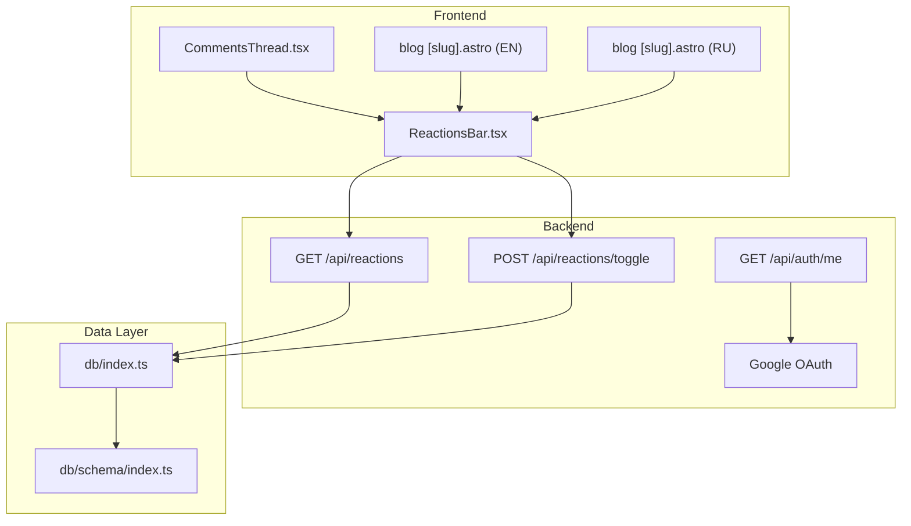
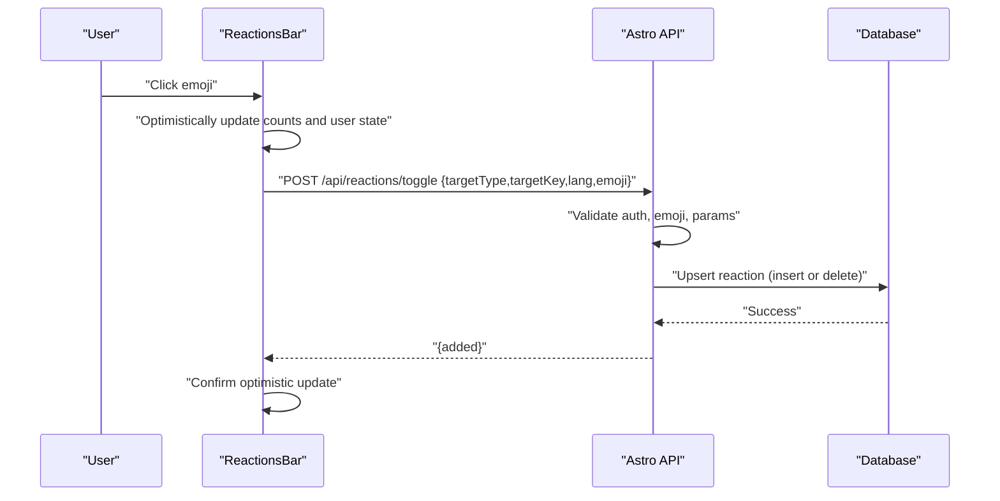
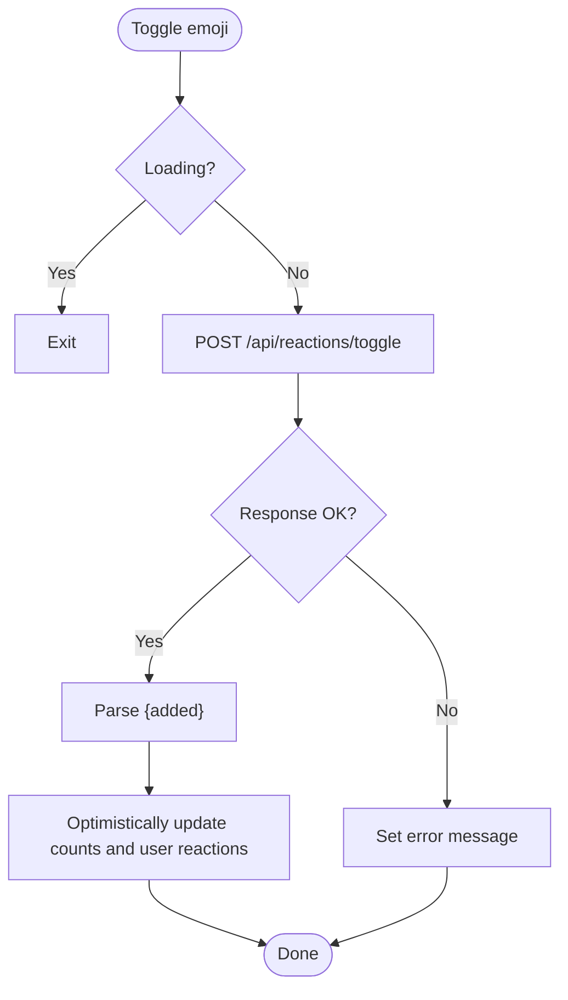
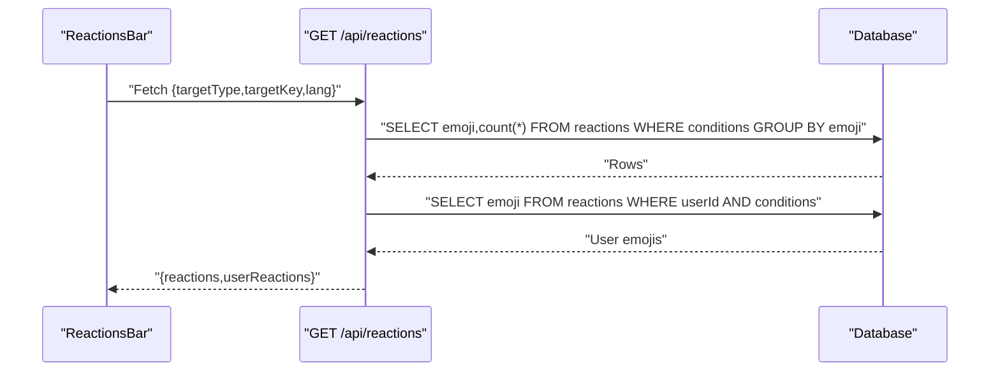
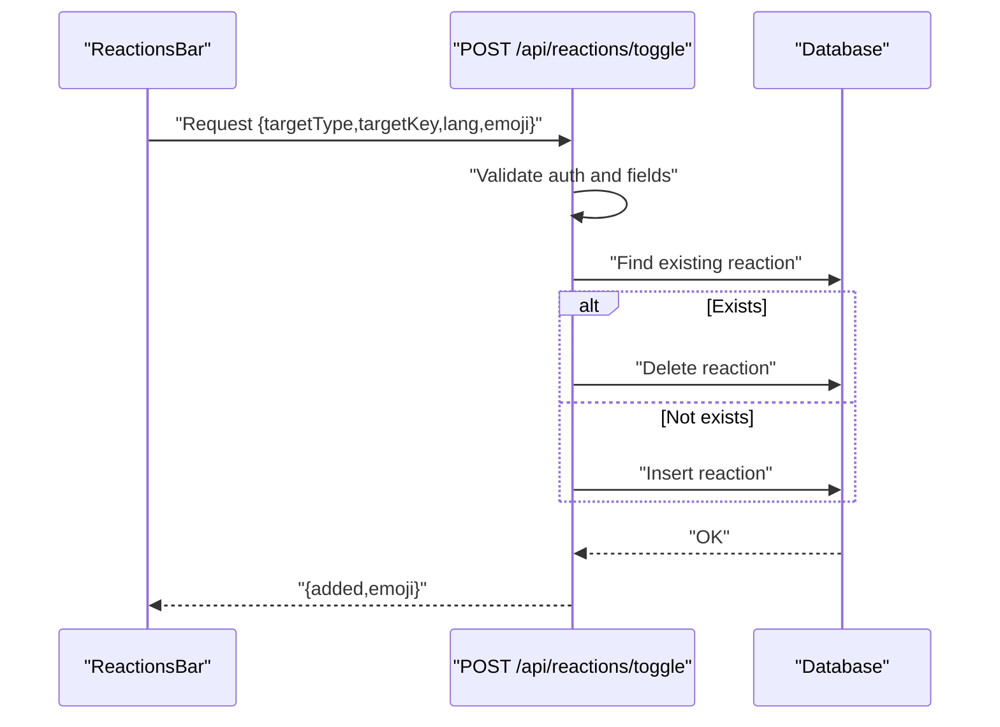
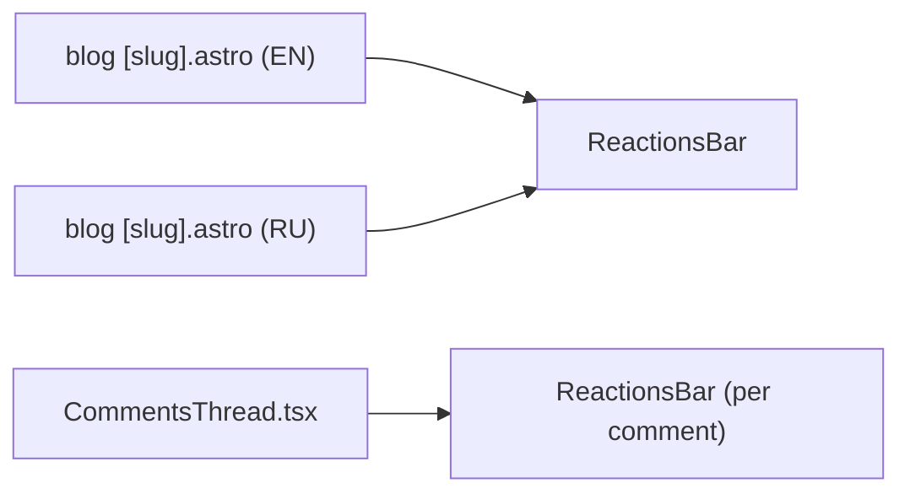
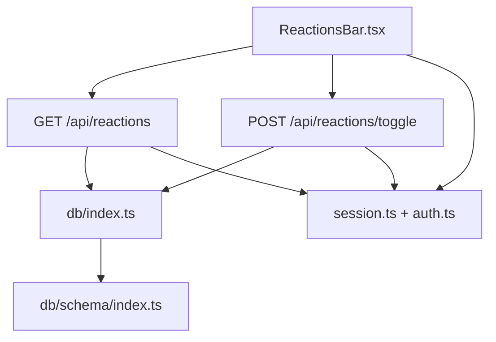
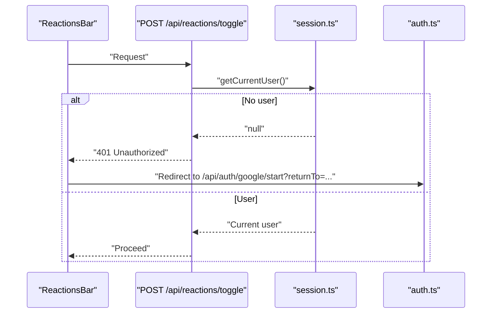

# Reaction System

<cite>
**Referenced Files in This Document**
- [ReactionsBar.tsx](file://src/components/ReactionsBar.tsx)
- [index.ts](file://src/pages/api/reactions/index.ts)
- [toggle.ts](file://src/pages/api/reactions/toggle.ts)
- [index.ts](file://src/db/schema/index.ts)
- [index.ts](file://src/db/index.ts)
- [session.ts](file://src/lib/session.ts)
- [auth.ts](file://src/lib/auth.ts)
- [me.ts](file://src/pages/api/auth/me.ts)
- [CommentsThread.tsx](file://src/components/CommentsThread.tsx)
- [blog [slug].astro (EN)](file://src/pages/en/blog/[slug].astro)
- [blog [slug].astro (RU)](file://src/pages/ru/blog/[slug].astro)
</cite>

## Table of Contents
1. [Introduction](#introduction)
2. [Project Structure](#project-structure)
3. [Core Components](#core-components)
4. [Architecture Overview](#architecture-overview)
5. [Detailed Component Analysis](#detailed-component-analysis)
6. [Dependency Analysis](#dependency-analysis)
7. [Performance Considerations](#performance-considerations)
8. [Troubleshooting Guide](#troubleshooting-guide)
9. [Conclusion](#conclusion)
10. [Appendices](#appendices)

## Introduction
This document describes the emoji-based reaction system used for posts and comments. It covers the frontend ReactionsBar component, the reaction data model, backend API endpoints for listing and toggling reactions, user authentication requirements, optimistic updates, and practical guidance for extending the system with new emoji types and custom behaviors.

## Project Structure
The reaction system spans three layers:
- Frontend: React component that renders emoji buttons, tracks local state, and performs optimistic updates.
- Backend: Astro API routes that validate requests, enforce authentication, and persist reactions.
- Data Layer: Drizzle ORM schema and database initialization utilities.



**Diagram sources**
- [ReactionsBar.tsx](file://src/components/ReactionsBar.tsx#L1-L115)
- [index.ts](file://src/pages/api/reactions/index.ts#L1-L82)
- [toggle.ts](file://src/pages/api/reactions/toggle.ts#L1-L85)
- [index.ts](file://src/db/schema/index.ts#L54-L66)
- [index.ts](file://src/db/index.ts#L1-L37)
- [session.ts](file://src/lib/session.ts#L13-L54)
- [auth.ts](file://src/lib/auth.ts#L41-L57)
- [me.ts](file://src/pages/api/auth/me.ts#L1-L30)
- [CommentsThread.tsx](file://src/components/CommentsThread.tsx#L101-L107)
- [blog [slug].astro (EN)](file://src/pages/en/blog/[slug].astro#L89-L94)
- [blog [slug].astro (RU)](file://src/pages/ru/blog/[slug].astro#L89-L94)

**Section sources**
- [ReactionsBar.tsx](file://src/components/ReactionsBar.tsx#L1-L115)
- [index.ts](file://src/pages/api/reactions/index.ts#L1-L82)
- [toggle.ts](file://src/pages/api/reactions/toggle.ts#L1-L85)
- [index.ts](file://src/db/schema/index.ts#L54-L66)
- [index.ts](file://src/db/index.ts#L1-L37)
- [session.ts](file://src/lib/session.ts#L13-L54)
- [auth.ts](file://src/lib/auth.ts#L41-L57)
- [me.ts](file://src/pages/api/auth/me.ts#L1-L30)
- [CommentsThread.tsx](file://src/components/CommentsThread.tsx#L101-L107)
- [blog [slug].astro (EN)](file://src/pages/en/blog/[slug].astro#L89-L94)
- [blog [slug].astro (RU)](file://src/pages/ru/blog/[slug].astro#L89-L94)

## Core Components
- ReactionsBar: Renders a fixed set of emojis, displays counts per emoji, tracks user’s active reactions, and optimistically updates counters upon toggle.
- API List: Returns aggregated reaction counts and the current user’s reactions for a given target.
- API Toggle: Adds or removes a user reaction for a target and returns whether the reaction was added.
- Data Model: Defines reactions with target type/key, optional language, user association, and emoji, with unique constraints and indexes.
- Authentication: Session-based authentication via cookies; redirects unauthenticated users to Google OAuth.

**Section sources**
- [ReactionsBar.tsx](file://src/components/ReactionsBar.tsx#L13-L115)
- [index.ts](file://src/pages/api/reactions/index.ts#L6-L81)
- [toggle.ts](file://src/pages/api/reactions/toggle.ts#L8-L84)
- [index.ts](file://src/db/schema/index.ts#L54-L66)
- [session.ts](file://src/lib/session.ts#L13-L54)
- [auth.ts](file://src/lib/auth.ts#L41-L57)

## Architecture Overview
The system integrates frontend and backend as follows:
- Frontend mounts ReactionsBar on post pages and inside comment threads.
- On mount, the frontend fetches initial counts and user reactions via the list endpoint.
- When a user clicks an emoji, the frontend optimistically updates the UI and calls the toggle endpoint.
- The backend validates authentication, checks emoji support, and persists the change atomically.



**Diagram sources**
- [ReactionsBar.tsx](file://src/components/ReactionsBar.tsx#L25-L77)
- [toggle.ts](file://src/pages/api/reactions/toggle.ts#L16-L76)
- [index.ts](file://src/db/schema/index.ts#L54-L66)

## Detailed Component Analysis

### ReactionsBar Component
Responsibilities:
- Accepts target type (post or comment), target key, optional language, and initial state.
- Renders a fixed set of emojis with counts and highlights active user reactions.
- Performs optimistic updates on toggle and handles errors and authentication redirects.

Key behaviors:
- Optimistic UI update: increments/decrements emoji count and toggles user’s reaction presence immediately.
- Authentication handling: redirects to Google OAuth when encountering 401.
- Graceful degradation: shows localized error messages for network/backend issues.



**Diagram sources**
- [ReactionsBar.tsx](file://src/components/ReactionsBar.tsx#L25-L77)

**Section sources**
- [ReactionsBar.tsx](file://src/components/ReactionsBar.tsx#L13-L115)

### API: Listing Available Reactions
Endpoint: GET /api/reactions
Behavior:
- Validates presence of targetType and targetKey.
- Optionally filters by lang when targetType is post.
- Aggregates emoji counts per target.
- Retrieves current user’s reactions if authenticated.
- Returns { reactions: Record<string, number>, userReactions: string[] }.



**Diagram sources**
- [index.ts](file://src/pages/api/reactions/index.ts#L14-L73)
- [index.ts](file://src/db/schema/index.ts#L54-L66)

**Section sources**
- [index.ts](file://src/pages/api/reactions/index.ts#L6-L81)

### API: Toggling User Reactions
Endpoint: POST /api/reactions/toggle
Behavior:
- Requires authenticated user via session cookie.
- Validates targetType, targetKey, emoji.
- Enforces allowed emoji set.
- Upserts reaction: deletes existing record if present, inserts otherwise.
- Returns { added, emoji }.



**Diagram sources**
- [toggle.ts](file://src/pages/api/reactions/toggle.ts#L16-L76)
- [index.ts](file://src/db/schema/index.ts#L54-L66)

**Section sources**
- [toggle.ts](file://src/pages/api/reactions/toggle.ts#L8-L84)

### Reaction Data Model
Schema: reactions
- Fields: id, targetType, targetKey, lang, userId, emoji, createdAt.
- Unique constraint: ensures a user can only react once with the same emoji to the same target.
- Indexes: target lookup, user lookup.

```mermaid
erDiagram
REACTIONS {
bigserial id PK
text targetType
text targetKey
text lang
bigserial userId FK
text emoji
timestamp createdAt
}
USERS {
bigserial id PK
text email UK
text name
text avatarUrl
boolean isBanned
}
USERS ||--c{| REACTIONS : "has reactions"
```

**Diagram sources**
- [index.ts](file://src/db/schema/index.ts#L54-L66)
- [index.ts](file://src/db/schema/index.ts#L4-L11)

**Section sources**
- [index.ts](file://src/db/schema/index.ts#L54-L66)

### Frontend Integration Patterns
- Post pages: ReactionsBar is mounted under the post content and initialized with slug/lang.
- Comments: ReactionsBar is embedded per comment item with initial counts and user reactions passed down.



**Diagram sources**
- [blog [slug].astro (EN)](file://src/pages/en/blog/[slug].astro#L89-L94)
- [blog [slug].astro (RU)](file://src/pages/ru/blog/[slug].astro#L89-L94)
- [CommentsThread.tsx](file://src/components/CommentsThread.tsx#L101-L107)

**Section sources**
- [blog [slug].astro (EN)](file://src/pages/en/blog/[slug].astro#L89-L94)
- [blog [slug].astro (RU)](file://src/pages/ru/blog/[slug].astro#L89-L94)
- [CommentsThread.tsx](file://src/components/CommentsThread.tsx#L101-L107)

## Dependency Analysis
- ReactionsBar depends on:
  - Astro API endpoints for listing and toggling reactions.
  - Session-based authentication via cookies.
- API endpoints depend on:
  - Database initialization and schema.
  - Session retrieval and user validation.
- Database depends on:
  - Drizzle ORM and PostgreSQL client.



**Diagram sources**
- [ReactionsBar.tsx](file://src/components/ReactionsBar.tsx#L32-L36)
- [index.ts](file://src/pages/api/reactions/index.ts#L26-L27)
- [toggle.ts](file://src/pages/api/reactions/toggle.ts#L17-L24)
- [index.ts](file://src/db/index.ts#L1-L37)
- [index.ts](file://src/db/schema/index.ts#L54-L66)
- [session.ts](file://src/lib/session.ts#L13-L54)
- [auth.ts](file://src/lib/auth.ts#L41-L57)

**Section sources**
- [ReactionsBar.tsx](file://src/components/ReactionsBar.tsx#L1-L115)
- [index.ts](file://src/pages/api/reactions/index.ts#L1-L82)
- [toggle.ts](file://src/pages/api/reactions/toggle.ts#L1-L85)
- [index.ts](file://src/db/index.ts#L1-L37)
- [index.ts](file://src/db/schema/index.ts#L54-L66)
- [session.ts](file://src/lib/session.ts#L13-L54)
- [auth.ts](file://src/lib/auth.ts#L41-L57)

## Performance Considerations
- Optimistic UI reduces perceived latency; ensure the backend remains the source of truth and reconcile on conflict.
- Database indexes on (targetType, targetKey) and (userId) improve query performance for counts and user-specific queries.
- Limit emoji sets to reduce cardinality and simplify aggregation.
- Batch or debounce frequent toggles on the client if needed to minimize network churn.

[No sources needed since this section provides general guidance]

## Troubleshooting Guide
Common issues and resolutions:
- Unauthorized: The toggle endpoint returns 401 when unauthenticated. The frontend redirects to Google OAuth. Ensure cookies are sent and session is valid.
- Backend not configured: Both endpoints return 503 when the database is not initialized. Initialize DATABASE_URL and restart the server.
- Network errors: The frontend surfaces localized messages for network failures. Verify CORS and proxy configurations.
- Emoji not supported: The toggle endpoint rejects emojis outside the allowed set. Extend ALLOWED_EMOJIS carefully and update frontend lists.

**Section sources**
- [ReactionsBar.tsx](file://src/components/ReactionsBar.tsx#L38-L50)
- [toggle.ts](file://src/pages/api/reactions/toggle.ts#L19-L24)
- [index.ts](file://src/pages/api/reactions/index.ts#L7-L12)
- [toggle.ts](file://src/pages/api/reactions/toggle.ts#L36-L41)

## Conclusion
The reaction system combines a concise frontend component with robust backend APIs and a well-indexed data model. It supports user-specific reaction management, optimistic updates, and graceful error handling. Extending the system involves updating emoji lists, enforcing constraints, and ensuring consistent indexing.

[No sources needed since this section summarizes without analyzing specific files]

## Appendices

### API Definitions
- GET /api/reactions
  - Query params: targetType (required), targetKey (required), lang (optional)
  - Response: { reactions: Record<string, number>, userReactions: string[] }
  - Status: 200 on success, 400 on missing params, 503 if DB not configured, 500 on error

- POST /api/reactions/toggle
  - Body: { targetType, targetKey, lang, emoji }
  - Response: { added: boolean, emoji: string }
  - Status: 200 on success, 400 on invalid input or emoji, 401 if unauthorized, 503 if DB not configured, 500 on error

**Section sources**
- [index.ts](file://src/pages/api/reactions/index.ts#L6-L81)
- [toggle.ts](file://src/pages/api/reactions/toggle.ts#L8-L84)

### Authentication Flow
- Session cookie is validated to obtain the current user.
- Unauthenticated requests to toggle are rejected with 401.
- Frontend redirects to Google OAuth with a returnTo parameter.



**Diagram sources**
- [toggle.ts](file://src/pages/api/reactions/toggle.ts#L17-L24)
- [session.ts](file://src/lib/session.ts#L13-L54)
- [auth.ts](file://src/lib/auth.ts#L41-L57)

**Section sources**
- [session.ts](file://src/lib/session.ts#L13-L54)
- [auth.ts](file://src/lib/auth.ts#L41-L57)
- [me.ts](file://src/pages/api/auth/me.ts#L6-L28)

### Extending the System
- Add new emoji types:
  - Update ALLOWED_EMOJIS in the toggle endpoint.
  - Update the frontend emoji list in ReactionsBar.
  - Ensure database indexes remain effective; consider adding new indexes if targeting new combinations frequently.
- Implement custom reaction behaviors:
  - Introduce new target types by adjusting targetType and targetKey semantics.
  - Add computed metrics (e.g., top reactions) via additional API endpoints.
- Handle concurrent updates:
  - Keep optimistic UI for responsiveness; rely on backend to enforce uniqueness and atomicity.
  - On conflicts, the backend’s upsert semantics prevent duplicates; frontend reconciliation is minimal due to unique constraints.

**Section sources**
- [toggle.ts](file://src/pages/api/reactions/toggle.ts#L6-L6)
- [ReactionsBar.tsx](file://src/components/ReactionsBar.tsx#L11-L11)
- [index.ts](file://src/db/schema/index.ts#L62-L66)