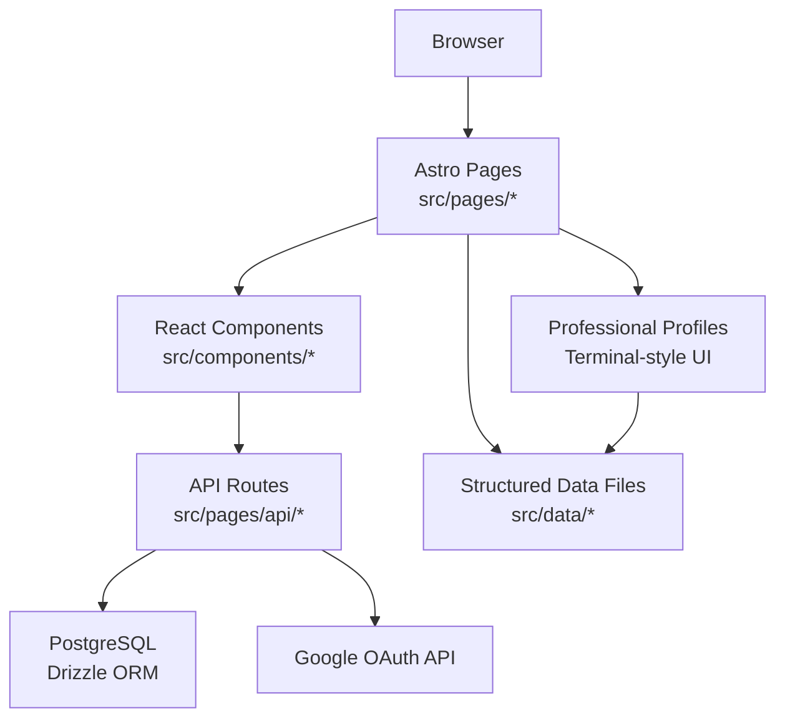
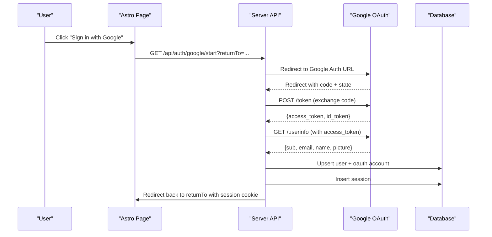
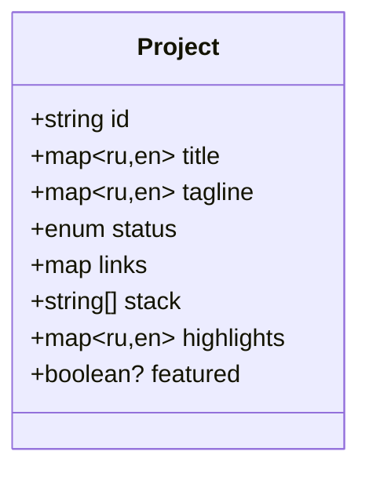
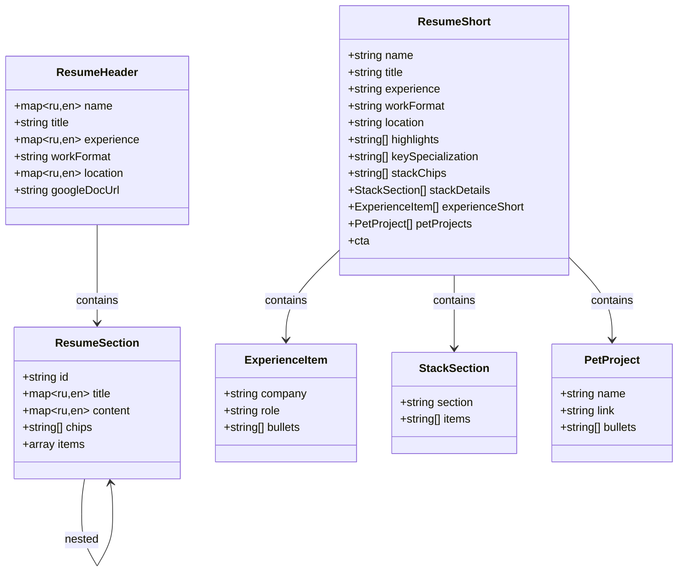
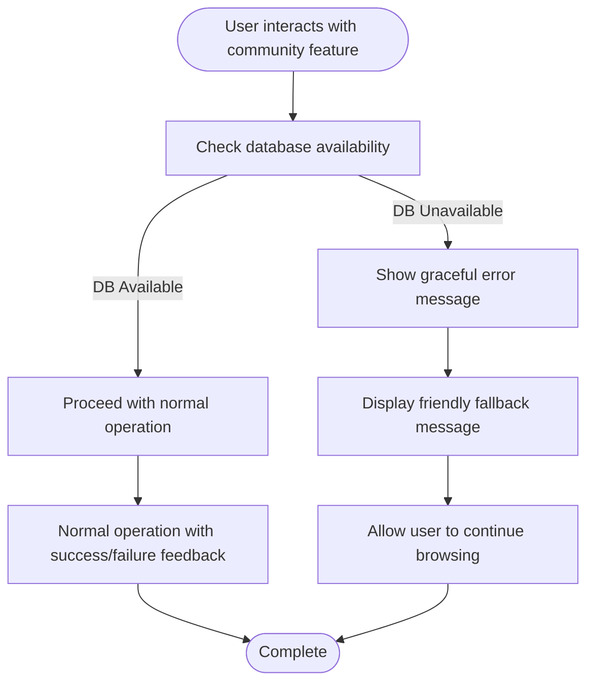
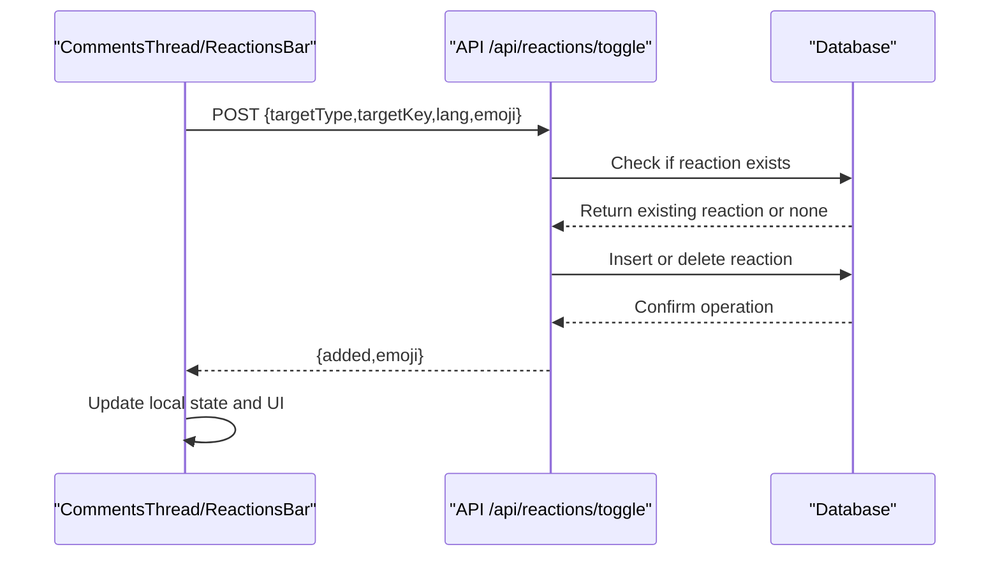
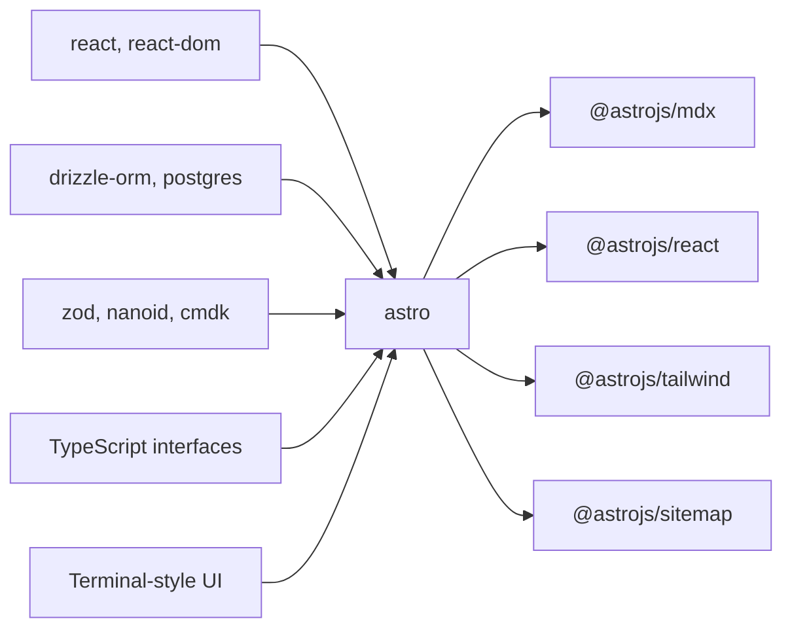

# Core Features

<cite>
**Referenced Files in This Document**
- [README.md](file://README.md)
- [package.json](file://package.json)
- [src/i18n/index.ts](file://src/i18n/index.ts)
- [src/lib/auth.ts](file://src/lib/auth.ts)
- [src/data/projects.ts](file://src/data/projects.ts)
- [src/data/now.ts](file://src/data/now.ts)
- [src/data/resume.ts](file://src/data/resume.ts)
- [src/data/resumeShort.ts](file://src/data/resumeShort.ts)
- [src/db/schema/index.ts](file://src/db/schema/index.ts)
- [src/components/CommentsThread.tsx](file://src/components/CommentsThread.tsx)
- [src/components/ReactionsBar.tsx](file://src/components/ReactionsBar.tsx)
- [src/components/ResumeNowBlock.astro](file://src/components/ResumeNowBlock.astro)
- [src/components/TerminalHero.astro](file://src/components/TerminalHero.astro)
- [src/pages/api/auth/google/start.ts](file://src/pages/api/auth/google/start.ts)
- [src/pages/api/auth/google/callback.ts](file://src/pages/api/auth/google/callback.ts)
- [src/pages/api/comments/index.ts](file://src/pages/api/comments/index.ts)
- [src/pages/api/reactions/index.ts](file://src/pages/api/reactions/index.ts)
- [src/pages/api/reactions/toggle.ts](file://src/pages/api/reactions/toggle.ts)
- [src/content/config.ts](file://src/content/config.ts)
- [src/content/blog-en/welcome.mdx](file://src/content/blog-en/welcome.mdx)
- [src/content/blog-ru/welcome.mdx](file://src/content/blog-ru/welcome.mdx)
- [src/pages/en/blog/[slug].astro](file://src/pages/en/blog/[slug].astro)
- [src/pages/ru/blog/[slug].astro](file://src/pages/ru/blog/[slug].astro)
- [src/pages/en/now.astro](file://src/pages/en/now.astro)
- [src/pages/ru/now.astro](file://src/pages/ru/now.astro)
- [src/pages/en/resume.astro](file://src/pages/en/resume.astro)
- [src/pages/ru/resume.astro](file://src/pages/ru/resume.astro)
</cite>

## Update Summary
**Changes Made**
- Enhanced Now and Resume content management with comprehensive resume system redesign
- Introduced terminal-style presentation for professional profiles and current activities
- Added new structured data interfaces for improved content management
- Implemented ResumeNowBlock component for consistent presentation across pages
- Expanded professional profile sections with detailed stack, experience, and specialization data
- Enhanced multilingual support with comprehensive Russian/English content management

## Table of Contents
1. [Introduction](#introduction)
2. [Project Structure](#project-structure)
3. [Core Components](#core-components)
4. [Architecture Overview](#architecture-overview)
5. [Detailed Component Analysis](#detailed-component-analysis)
6. [Dependency Analysis](#dependency-analysis)
7. [Performance Considerations](#performance-considerations)
8. [Troubleshooting Guide](#troubleshooting-guide)
9. [Conclusion](#conclusion)
10. [Appendices](#appendices)

## Introduction
This document explains the five core feature areas of the rodion.pro platform and how they integrate to deliver a cohesive user experience:
- Multilingual content management with Russian/English support and URL routing
- User authentication system using Google OAuth 2.0
- Portfolio project showcase with stack and status information
- Blog content management with MDX authoring and tagging
- Community features including comment system with hierarchical threading and reaction system with emoji-based interactions

**Updated** Enhanced with comprehensive resume system redesign featuring terminal-style presentation, structured data interfaces, and improved professional profile management.

Each feature is documented with implementation patterns, data models, integration points, configuration options, customization possibilities, and usage examples.

## Project Structure
The platform is an Astro 5 application with SSR, React islands, TypeScript, Tailwind CSS, PostgreSQL, and Drizzle ORM. Key areas:
- Internationalization and routing helpers
- Authentication utilities and API endpoints
- Static project data and dynamic database-backed content
- Database schema for users, sessions, comments, reactions, flags, and events
- Frontend components for comments, reactions, and professional profiles
- API routes for auth, comments, reactions, and content rendering
- Structured content management for now and resume pages with terminal-style presentation

```mermaid
graph TB
subgraph "Frontend"
I18N["src/i18n/index.ts"]
BlogEN["src/pages/en/blog/[slug].astro"]
BlogRU["src/pages/ru/blog/[slug].astro"]
Comments["src/components/CommentsThread.tsx"]
Reactions["src/components/ReactionsBar.tsx"]
Projects["src/data/projects.ts"]
NowPage["src/pages/en/now.astro"]
ResumePage["src/pages/en/resume.astro"]
NowData["src/data/now.ts"]
ResumeData["src/data/resume.ts"]
ResumeShort["src/data/resumeShort.ts"]
ResumeNowBlock["src/components/ResumeNowBlock.astro"]
TerminalHero["src/components/TerminalHero.astro"]
end
subgraph "API"
AuthStart["src/pages/api/auth/google/start.ts"]
AuthCallback["src/pages/api/auth/google/callback.ts"]
CommentsAPI["src/pages/api/comments/index.ts"]
ReactionsAPI["src/pages/api/reactions/index.ts"]
ToggleReaction["src/pages/api/reactions/toggle.ts"]
end
subgraph "Data"
Schema["src/db/schema/index.ts"]
Config["src/content/config.ts"]
PostEN["src/content/blog-en/welcome.mdx"]
PostRU["src/content/blog-ru/welcome.mdx"]
end
I18N --> BlogEN
I18N --> BlogRU
I18N --> NowPage
I18N --> ResumePage
BlogEN --> Comments
BlogRU --> Comments
Comments --> CommentsAPI
Reactions --> ReactionsAPI
Reactions --> ToggleReaction
AuthStart --> AuthCallback
AuthCallback --> Schema
CommentsAPI --> Schema
ReactionsAPI --> Schema
ToggleReaction --> Schema
Config --> BlogEN
Config --> BlogRU
PostEN --> BlogEN
PostRU --> BlogRU
Projects --> BlogEN
Projects --> BlogRU
NowData --> NowPage
ResumeData --> ResumePage
ResumeShort --> ResumeNowBlock
ResumeNowBlock --> NowPage
TerminalHero --> NowPage
```



**Diagram sources**
- [src/i18n/index.ts](file://src/i18n/index.ts#L191-L221)
- [src/pages/en/blog/[slug].astro](file://src/pages/en/blog/[slug].astro#L1-L171)
- [src/pages/ru/blog/[slug].astro](file://src/pages/ru/blog/[slug].astro#L1-L171)
- [src/pages/en/now.astro](file://src/pages/en/now.astro#L1-L59)
- [src/pages/ru/now.astro](file://src/pages/ru/now.astro#L1-L61)
- [src/pages/en/resume.astro](file://src/pages/en/resume.astro#L1-L160)
- [src/pages/ru/resume.astro](file://src/pages/ru/resume.astro#L1-L160)
- [src/components/CommentsThread.tsx](file://src/components/CommentsThread.tsx#L148-L366)
- [src/components/ReactionsBar.tsx](file://src/components/ReactionsBar.tsx#L13-L115)
- [src/components/ResumeNowBlock.astro](file://src/components/ResumeNowBlock.astro#L1-L199)
- [src/components/TerminalHero.astro](file://src/components/TerminalHero.astro#L1-L74)
- [src/pages/api/auth/google/start.ts](file://src/pages/api/auth/google/start.ts#L1-L15)
- [src/pages/api/auth/google/callback.ts](file://src/pages/api/auth/google/callback.ts#L1-L114)
- [src/pages/api/comments/index.ts](file://src/pages/api/comments/index.ts#L1-L240)
- [src/pages/api/reactions/index.ts](file://src/pages/api/reactions/index.ts#L1-L82)
- [src/pages/api/reactions/toggle.ts](file://src/pages/api/reactions/toggle.ts#L1-L85)
- [src/db/schema/index.ts](file://src/db/schema/index.ts#L1-L104)
- [src/content/config.ts](file://src/content/config.ts#L1-L19)
- [src/content/blog-en/welcome.mdx](file://src/content/blog-en/welcome.mdx#L1-L38)
- [src/content/blog-ru/welcome.mdx](file://src/content/blog-ru/welcome.mdx#L1-L38)
- [src/data/projects.ts](file://src/data/projects.ts#L1-L123)
- [src/data/now.ts](file://src/data/now.ts#L1-L71)
- [src/data/resume.ts](file://src/data/resume.ts#L1-L217)
- [src/data/resumeShort.ts](file://src/data/resumeShort.ts#L1-L177)

**Section sources**
- [README.md](file://README.md#L1-L244)
- [package.json](file://package.json#L1-L46)

## Core Components
- Multilingual content management: URL routing by language prefix, localized content collections, and translation keys
- Authentication: Google OAuth 2.0 flow, session management, and admin checks
- Portfolio showcase: Static project data with localized fields and status indicators
- Blog: MDX content with frontmatter, tags, and localized rendering
- Community: Hierarchical comments and emoji reactions with backend persistence
- Professional profiles: Comprehensive resume system with terminal-style presentation and structured data management
- Current activities: Now page with integrated professional profile block and learning focus tracking

**Updated** Enhanced with comprehensive resume system featuring terminal-style presentation, structured data interfaces, and integrated professional profile blocks.

**Section sources**
- [src/i18n/index.ts](file://src/i18n/index.ts#L1-L221)
- [src/lib/auth.ts](file://src/lib/auth.ts#L1-L101)
- [src/data/projects.ts](file://src/data/projects.ts#L1-L123)
- [src/data/now.ts](file://src/data/now.ts#L1-L71)
- [src/data/resume.ts](file://src/data/resume.ts#L1-L217)
- [src/data/resumeShort.ts](file://src/data/resumeShort.ts#L1-L177)
- [src/content/config.ts](file://src/content/config.ts#L1-L19)
- [src/content/blog-en/welcome.mdx](file://src/content/blog-en/welcome.mdx#L1-L38)
- [src/content/blog-ru/welcome.mdx](file://src/content/blog-ru/welcome.mdx#L1-L38)
- [src/components/CommentsThread.tsx](file://src/components/CommentsThread.tsx#L1-L366)
- [src/components/ReactionsBar.tsx](file://src/components/ReactionsBar.tsx#L1-L115)
- [src/components/ResumeNowBlock.astro](file://src/components/ResumeNowBlock.astro#L1-L199)

## Architecture Overview
The platform follows a layered architecture:
- Presentation layer: Astro pages and React components with terminal-style UI
- API layer: Astro API routes handling auth, comments, and reactions
- Data layer: PostgreSQL via Drizzle ORM with typed schemas
- Content layer: Astro content collections with MDX and structured data files
- Professional profile layer: Dedicated resume data management with terminal presentation



**Diagram sources**
- [src/pages/en/blog/[slug].astro](file://src/pages/en/blog/[slug].astro#L1-L171)
- [src/pages/ru/blog/[slug].astro](file://src/pages/ru/blog/[slug].astro#L1-L171)
- [src/pages/en/now.astro](file://src/pages/en/now.astro#L1-L59)
- [src/pages/ru/now.astro](file://src/pages/ru/now.astro#L1-L61)
- [src/pages/en/resume.astro](file://src/pages/en/resume.astro#L1-L160)
- [src/pages/ru/resume.astro](file://src/pages/ru/resume.astro#L1-L160)
- [src/components/CommentsThread.tsx](file://src/components/CommentsThread.tsx#L148-L366)
- [src/components/ReactionsBar.tsx](file://src/components/ReactionsBar.tsx#L13-L115)
- [src/components/ResumeNowBlock.astro](file://src/components/ResumeNowBlock.astro#L1-L199)
- [src/pages/api/auth/google/callback.ts](file://src/pages/api/auth/google/callback.ts#L1-L114)
- [src/pages/api/comments/index.ts](file://src/pages/api/comments/index.ts#L1-L240)
- [src/pages/api/reactions/toggle.ts](file://src/pages/api/reactions/toggle.ts#L1-L85)
- [src/db/schema/index.ts](file://src/db/schema/index.ts#L1-L104)
- [src/data/now.ts](file://src/data/now.ts#L1-L71)
- [src/data/resume.ts](file://src/data/resume.ts#L1-L217)
- [src/data/resumeShort.ts](file://src/data/resumeShort.ts#L1-L177)

## Detailed Component Analysis

### Multilingual Content Management
- URL routing: Language prefix detection and alternate locale generation
- Content collections: Separate collections for Russian and English blogs with shared schema
- Localization: Translation keys and language-aware rendering

Implementation highlights:
- Language detection and default fallback
- Path normalization and alternate locales
- MDX frontmatter schema supporting title, description, date, tags, draft, and optional hero image
- Blog pages render localized content and expose tags for filtering

Usage examples:
- Access English blog: /en/blog/welcome
- Access Russian blog: /ru/blog/wellcome
- Tag filtering: Append ?tag=meta to the localized blog URL

Customization:
- Add new locales by creating new content collections and pages under matching language folders
- Extend frontmatter fields in the content collection schema

**Section sources**
- [src/i18n/index.ts](file://src/i18n/index.ts#L191-L221)
- [src/content/config.ts](file://src/content/config.ts#L1-L19)
- [src/content/blog-en/welcome.mdx](file://src/content/blog-en/welcome.mdx#L1-L38)
- [src/content/blog-ru/welcome.mdx](file://src/content/blog-ru/welcome.mdx#L1-L38)
- [src/pages/en/blog/[slug].astro](file://src/pages/en/blog/[slug].astro#L1-L171)
- [src/pages/ru/blog/[slug].astro](file://src/pages/ru/blog/[slug].astro#L1-L171)

### User Authentication System (Google OAuth 2.0)
- OAuth flow: Start endpoint generates Google auth URL with state; callback exchanges code for tokens and user info, creates/links user and session
- Session management: Cookie-based sessions with configurable expiration
- Admin checks: Email-based admin validation

Sequence of authentication flow:



**Diagram sources**
- [src/pages/api/auth/google/start.ts](file://src/pages/api/auth/google/start.ts#L1-L15)
- [src/pages/api/auth/google/callback.ts](file://src/pages/api/auth/google/callback.ts#L1-L114)
- [src/lib/auth.ts](file://src/lib/auth.ts#L41-L95)
- [src/db/schema/index.ts](file://src/db/schema/index.ts#L4-L33)

Integration points:
- Auth start and callback endpoints
- Session cookie handling
- Admin email validation

Configuration options:
- GOOGLE_CLIENT_ID and GOOGLE_CLIENT_SECRET
- ADMIN_EMAILS
- SITE_URL for redirect URIs

**Section sources**
- [src/lib/auth.ts](file://src/lib/auth.ts#L1-L101)
- [src/pages/api/auth/google/start.ts](file://src/pages/api/auth/google/start.ts#L1-L15)
- [src/pages/api/auth/google/callback.ts](file://src/pages/api/auth/google/callback.ts#L1-L114)
- [src/db/schema/index.ts](file://src/db/schema/index.ts#L4-L33)
- [README.md](file://README.md#L227-L239)

### Portfolio Project Showcase
- Data model: Project records with localized title/tagline/highlights, status, links, and stack
- Rendering: Featured and localized project lists

Data model:



**Diagram sources**
- [src/data/projects.ts](file://src/data/projects.ts#L3-L16)

Customization:
- Add/edit projects in the static dataset
- Extend stack entries and status values as needed

**Section sources**
- [src/data/projects.ts](file://src/data/projects.ts#L1-L123)

### Enhanced Resume and Now Content Management
- Professional profiles: Comprehensive resume system with terminal-style presentation and structured data interfaces
- Current activities: Now page with integrated professional profile block and learning focus tracking
- Terminal-style UI: Command-line inspired presentation with badges, chips, and collapsible sections
- Structured data: TypeScript interfaces for type-safe content management with multilingual support

Enhanced resume system architecture:



**Diagram sources**
- [src/data/resume.ts](file://src/data/resume.ts#L1-L217)
- [src/data/resumeShort.ts](file://src/data/resumeShort.ts#L1-L177)

Implementation highlights:
- Terminal-style presentation with command-line inspired UI elements
- Comprehensive multilingual support with Russian/English content
- Structured data interfaces for type-safe content management
- Integrated professional profile block (ResumeNowBlock) for consistent presentation
- Detailed stack sections with categorized technology groups
- Experience tracking with achievements and bullet points
- Pet projects showcase with links and descriptions
- Badge-based metadata presentation (experience, location, work format)

**Section sources**
- [src/data/resume.ts](file://src/data/resume.ts#L1-L217)
- [src/data/resumeShort.ts](file://src/data/resumeShort.ts#L1-L177)
- [src/pages/en/resume.astro](file://src/pages/en/resume.astro#L1-L160)
- [src/pages/ru/resume.astro](file://src/pages/ru/resume.astro#L1-L160)
- [src/pages/en/now.astro](file://src/pages/en/now.astro#L1-L59)
- [src/pages/ru/now.astro](file://src/pages/ru/now.astro#L1-L61)
- [src/components/ResumeNowBlock.astro](file://src/components/ResumeNowBlock.astro#L1-L199)

### Blog Content Management (MDX + Tags)
- MDX authoring: Frontmatter fields for SEO and metadata
- Tagging: Articles can be tagged; tags appear on article pages and enable filtering
- Localized rendering: Separate collections per language

Frontmatter schema:

```mermaid
erDiagram
BLOG_POST {
string title
string description
date date
string[] tags
boolean draft
string? hero
}
```

**Diagram sources**
- [src/content/config.ts](file://src/content/config.ts#L3-L13)

Rendering and integration:
- Article pages fetch localized collections, render MDX content, display tags, and embed reactions and comments placeholders
- Tag links navigate to the localized blog index with tag query parameter

**Section sources**
- [src/content/config.ts](file://src/content/config.ts#L1-L19)
- [src/content/blog-en/welcome.mdx](file://src/content/blog-en/welcome.mdx#L1-L38)
- [src/content/blog-ru/welcome.mdx](file://src/content/blog-ru/welcome.mdx#L1-L38)
- [src/pages/en/blog/[slug].astro](file://src/pages/en/blog/[slug].astro#L1-L171)
- [src/pages/ru/blog/[slug].astro](file://src/pages/ru/blog/[slug].astro#L1-L171)

### Community Features: Comments and Reactions
- Comments: Hierarchical threading with nested replies, draft persistence, and moderation-ready flags
- Reactions: Emoji-based reactions with per-user state and counts
- Error handling: Graceful fallback mechanisms with user-friendly error messages
- Database connectivity: Robust error handling with fallback responses when database is unavailable

Enhanced error handling mechanisms:



**Diagram sources**
- [src/components/CommentsThread.tsx](file://src/components/CommentsThread.tsx#L176-L206)
- [src/pages/api/comments/index.ts](file://src/pages/api/comments/index.ts#L7-L12)
- [src/pages/api/reactions/toggle.ts](file://src/pages/api/reactions/toggle.ts#L9-L14)

Improved error handling features:
- Database unavailability detection with 503 status codes
- User-friendly error messages in both Russian and English
- Network error handling with graceful degradation
- Local storage integration for comment drafts
- Automatic redirection to authentication flow for unauthorized actions

Reaction flow:



**Diagram sources**
- [src/components/ReactionsBar.tsx](file://src/components/ReactionsBar.tsx#L25-L77)
- [src/pages/api/reactions/toggle.ts](file://src/pages/api/reactions/toggle.ts#L1-L85)

Data model:

```mermaid
erDiagram
USERS {
bigint id PK
text email UK
text name
text avatar_url
boolean is_banned
}
OAUTH_ACCOUNTS {
bigint id PK
bigint user_id FK
text provider
text provider_user_id
}
SESSIONS {
text id PK
bigint user_id FK
timestamptz expires_at
}
COMMENTS {
bigint id PK
text page_type
text page_key
text lang
bigint? user_id FK
bigint? parent_id FK
text body
boolean is_hidden
boolean is_deleted
}
REACTIONS {
bigint id PK
text target_type
text target_key
text? lang
bigint user_id FK
text emoji
}
COMMENT_FLAGS {
bigint id PK
bigint comment_id FK
bigint? user_id FK
text reason
}
USERS ||--o{ OAUTH_ACCOUNTS : "has"
USERS ||--o{ SESSIONS : "has"
USERS ||--o{ COMMENTS : "writes"
USERS ||--o{ REACTIONS : "gives"
COMMENTS ||--o{ COMMENT_FLAGS : "flagged_by"
COMMENTS ||--o{ COMMENTS : "parent"
```

**Diagram sources**
- [src/db/schema/index.ts](file://src/db/schema/index.ts#L4-L103)

Integration points:
- Comments thread component mounts on blog pages and calls API endpoints
- Reactions bar component mounts alongside comments and posts
- Admin moderation uses dedicated endpoints and pages
- Error handling integrated throughout the community feature lifecycle

**Section sources**
- [src/components/CommentsThread.tsx](file://src/components/CommentsThread.tsx#L1-L366)
- [src/components/ReactionsBar.tsx](file://src/components/ReactionsBar.tsx#L1-L115)
- [src/pages/api/comments/index.ts](file://src/pages/api/comments/index.ts#L1-L240)
- [src/pages/api/reactions/index.ts](file://src/pages/api/reactions/index.ts#L1-L82)
- [src/pages/api/reactions/toggle.ts](file://src/pages/api/reactions/toggle.ts#L1-L85)
- [src/db/schema/index.ts](file://src/db/schema/index.ts#L1-L104)

## Dependency Analysis
- Runtime dependencies include Astro, React, MDX, Tailwind, Drizzle ORM, and PostgreSQL driver
- Build-time dependencies include ESLint, TypeScript, and Drizzle Kit
- Environment variables drive OAuth, database connectivity, and admin configuration



**Diagram sources**
- [package.json](file://package.json#L18-L31)
- [src/data/now.ts](file://src/data/now.ts#L1-L71)
- [src/data/resume.ts](file://src/data/resume.ts#L1-L217)
- [src/data/resumeShort.ts](file://src/data/resumeShort.ts#L1-L177)
- [src/components/ResumeNowBlock.astro](file://src/components/ResumeNowBlock.astro#L1-L199)

**Section sources**
- [package.json](file://package.json#L1-L46)
- [README.md](file://README.md#L227-L239)

## Performance Considerations
- Database indexing: Comments and reactions are indexed by target and user to optimize queries
- Pagination: Consider paginating comments and reactions for high-volume content
- Caching: Introduce CDN caching for static assets and consider short-lived caches for API responses
- Image optimization: Use Astro's image optimization features for hero images
- Minimize re-renders: Keep comment and reaction components optimized; avoid unnecessary deep updates
- Error handling: Graceful fallback mechanisms reduce page reloads and improve perceived performance
- Structured data: TypeScript interfaces enable compile-time optimizations and better memory usage
- Terminal UI: Optimized rendering for terminal-style components with minimal DOM overhead

## Troubleshooting Guide
Common issues and resolutions:
- OAuth redirects fail: Verify SITE_URL and authorized redirect URI match Google Console configuration
- Comments unavailable: API returns 503 when DB is not configured; ensure DATABASE_URL and migrations are applied
- Unauthorized actions: Posting comments or reactions requires a valid session; ensure cookies are accepted
- Admin moderation: Confirm ADMIN_EMAILS contains verified admin addresses
- Database connectivity: Check connection string format and network accessibility
- Error handling: Graceful fallback messages indicate when features are temporarily unavailable
- Content loading: Structured data files provide fallback content when database is unavailable
- Resume rendering: Ensure ResumeNowBlock component receives properly formatted ResumeShort data
- Terminal UI issues: Verify CSS classes for terminal-style presentation are properly loaded

**Updated** Added troubleshooting guidance for enhanced error handling, database connectivity, and professional profile rendering.

**Section sources**
- [src/pages/api/auth/google/callback.ts](file://src/pages/api/auth/google/callback.ts#L1-L114)
- [src/pages/api/comments/index.ts](file://src/pages/api/comments/index.ts#L7-L12)
- [src/pages/api/reactions/toggle.ts](file://src/pages/api/reactions/toggle.ts#L16-L24)
- [src/components/CommentsThread.tsx](file://src/components/CommentsThread.tsx#L187-L200)
- [src/components/ResumeNowBlock.astro](file://src/components/ResumeNowBlock.astro#L1-L199)
- [README.md](file://README.md#L227-L239)

## Conclusion
The rodion.pro platform integrates multilingual content, authentication, portfolio showcase, blog management, and community features into a cohesive experience. The modular architecture, typed database schema, and clear API boundaries enable extensibility and maintainability while delivering responsive, interactive components for users. Recent enhancements include a comprehensive resume system with terminal-style presentation, structured data interfaces, and improved professional profile management that provides a modern, developer-friendly approach to showcasing expertise and current activities.

## Appendices

### Configuration Options
- OAuth: GOOGLE_CLIENT_ID, GOOGLE_CLIENT_SECRET, ADMIN_EMAILS
- Database: DATABASE_URL
- Security: TURNSTILE_SITEKEY, TURNSTILE_SECRET (optional)
- Site: SITE_URL, GITHUB_WEBHOOK_SECRET, DEPLOY_TOKEN

**Section sources**
- [README.md](file://README.md#L227-L239)

### Usage Examples
- Start OAuth: GET /api/auth/google/start?returnTo=%2F
- Submit comment: POST /api/comments with { pageType, pageKey, lang, parentId?, body }
- Toggle reaction: POST /api/reactions/toggle with { targetType, targetKey, lang, emoji }
- View reactions: GET /api/reactions?type=post&key=slug&lang=en
- Add a blog post: Create MDX in src/content/blog-{en|ru}/my-post.mdx with proper frontmatter
- Access now page: GET /en/now or /ru/now for current activities and professional profile
- Access resume: GET /en/resume or /ru/resume for comprehensive professional profile
- View professional profile: ResumeNowBlock component displays structured data with terminal-style UI

**Updated** Added usage examples for new enhanced resume system and professional profile features.

**Section sources**
- [src/pages/api/auth/google/start.ts](file://src/pages/api/auth/google/start.ts#L1-L15)
- [src/pages/api/comments/index.ts](file://src/pages/api/comments/index.ts#L165-L239)
- [src/pages/api/reactions/toggle.ts](file://src/pages/api/reactions/toggle.ts#L1-L85)
- [src/pages/api/reactions/index.ts](file://src/pages/api/reactions/index.ts#L1-L82)
- [src/content/config.ts](file://src/content/config.ts#L1-L19)
- [src/pages/en/now.astro](file://src/pages/en/now.astro#L1-L59)
- [src/pages/ru/now.astro](file://src/pages/ru/now.astro#L1-L61)
- [src/pages/en/resume.astro](file://src/pages/en/resume.astro#L1-L160)
- [src/pages/ru/resume.astro](file://src/pages/ru/resume.astro#L1-L160)
- [src/components/ResumeNowBlock.astro](file://src/components/ResumeNowBlock.astro#L1-L199)