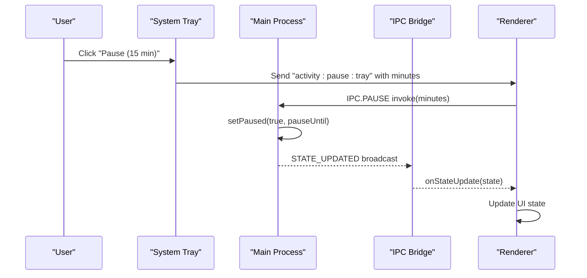
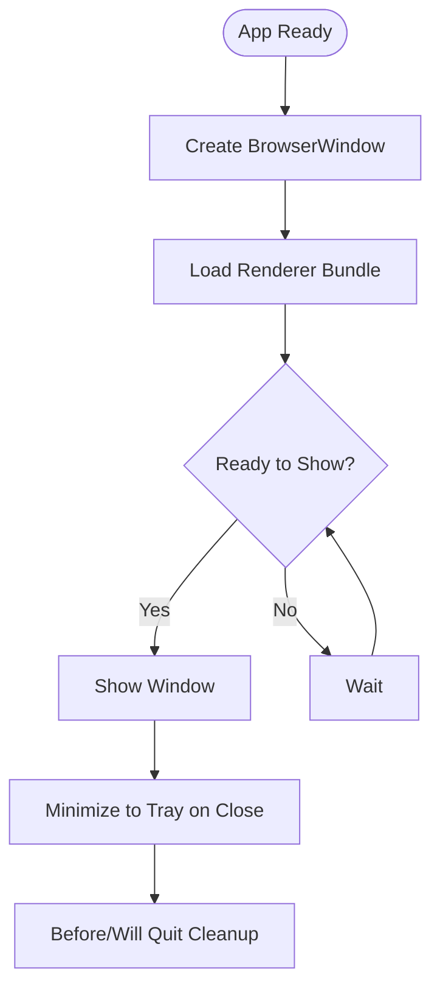
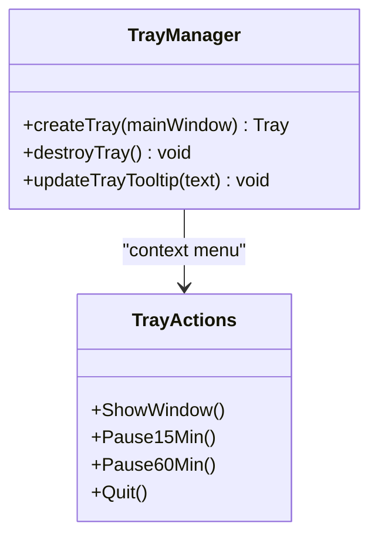
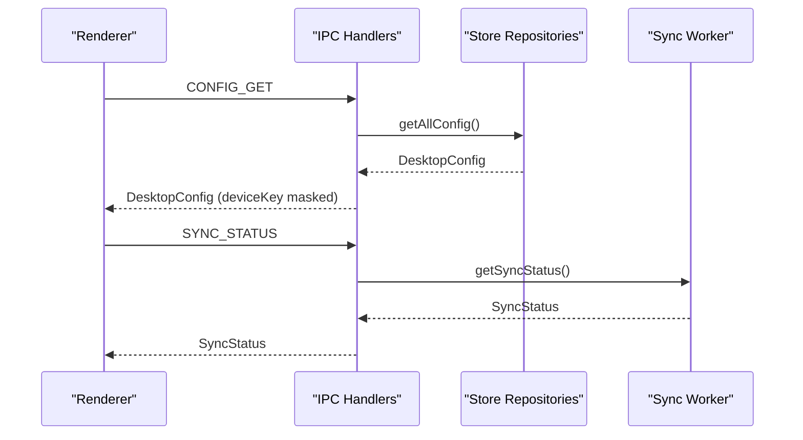
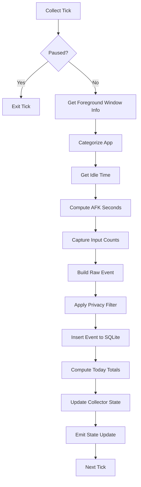
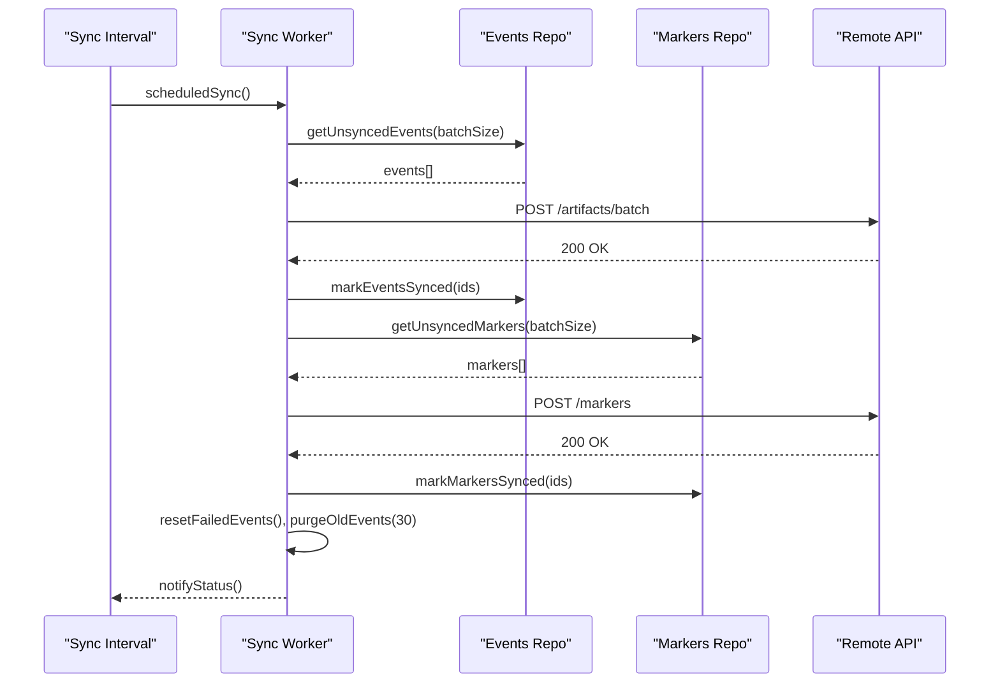
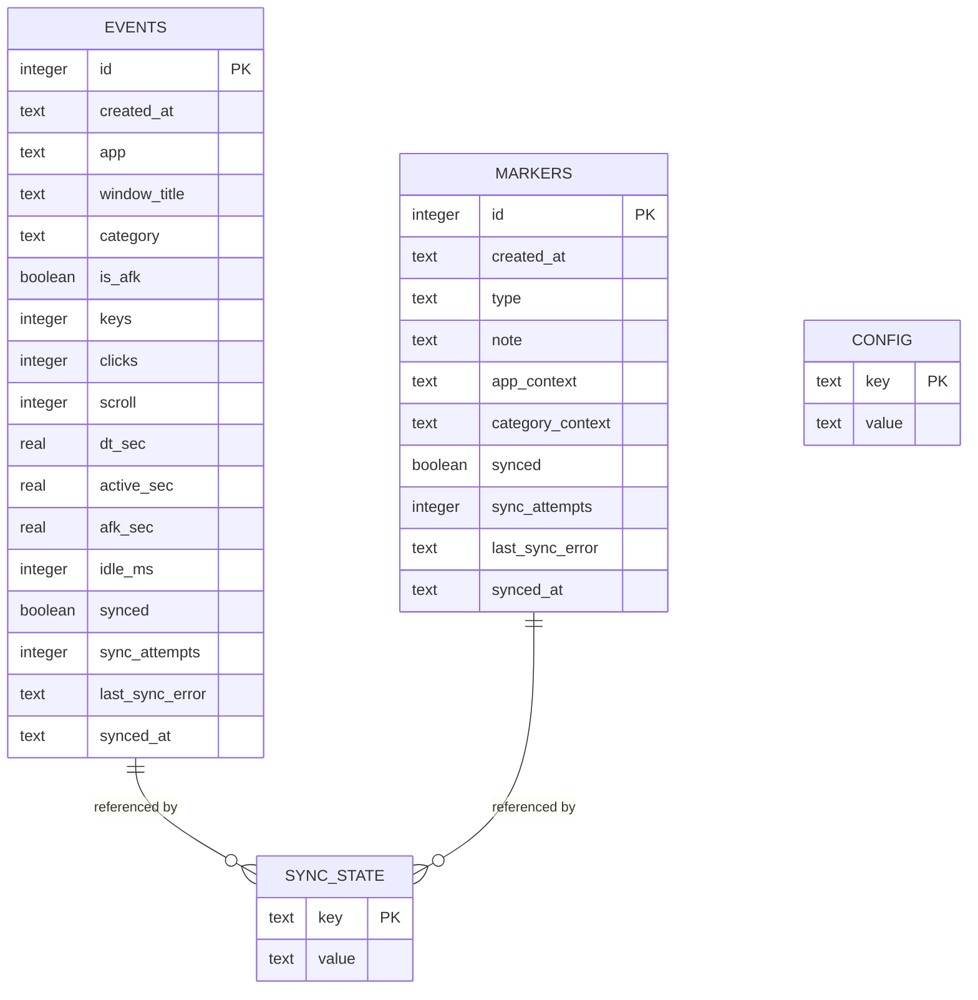
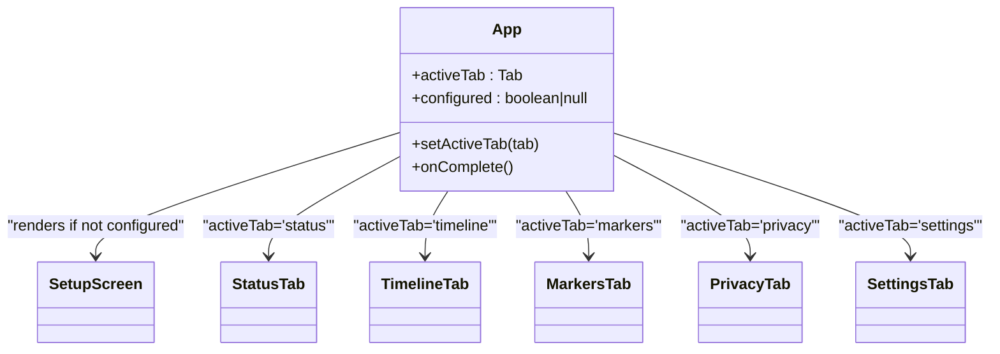
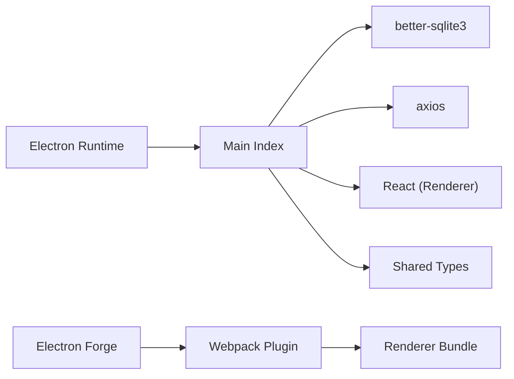

# Electron Desktop Application

<cite>
**Referenced Files in This Document**
- [package.json](file://activity-desktop/package.json)
- [index.ts](file://activity-desktop/src/main/index.ts)
- [window.ts](file://activity-desktop/src/main/window.ts)
- [tray.ts](file://activity-desktop/src/main/tray.ts)
- [ipc-handlers.ts](file://activity-desktop/src/main/ipc/ipc-handlers.ts)
- [orchestrator.ts](file://activity-desktop/src/main/collectors/orchestrator.ts)
- [sync-worker.ts](file://activity-desktop/src/main/sync/sync-worker.ts)
- [database.ts](file://activity-desktop/src/main/store/database.ts)
- [config-repo.ts](file://activity-desktop/src/main/store/config-repo.ts)
- [events-repo.ts](file://activity-desktop/src/main/store/events-repo.ts)
- [markers-repo.ts](file://activity-desktop/src/main/store/markers-repo.ts)
- [types.ts](file://activity-desktop/src/shared/types.ts)
- [App.tsx](file://activity-desktop/src/renderer/App.tsx)
- [forge.config.ts](file://activity-desktop/forge.config.ts)
- [tsconfig.json](file://activity-desktop/tsconfig.json)
</cite>

## Table of Contents
1. [Introduction](#introduction)
2. [Project Structure](#project-structure)
3. [Core Components](#core-components)
4. [Architecture Overview](#architecture-overview)
5. [Detailed Component Analysis](#detailed-component-analysis)
6. [Dependency Analysis](#dependency-analysis)
7. [Performance Considerations](#performance-considerations)
8. [Troubleshooting Guide](#troubleshooting-guide)
9. [Conclusion](#conclusion)

## Introduction
This document describes the Electron desktop application for local activity monitoring and synchronization. The application tracks user activity (keyboard, mouse, scrolling), detects application focus and idle time, applies privacy filtering, stores events locally in a SQLite database, and periodically syncs data to a remote server. It provides a React-based UI with a system tray for quick actions and status visibility.

## Project Structure
The application follows a layered architecture:
- Main process: Electron main entry point, window management, system tray, IPC handlers, collectors orchestration, and sync worker.
- Renderer process: React UI with tabbed views for status, timeline, markers, privacy, and settings.
- Shared: TypeScript types and IPC channel definitions used by both main and renderer processes.
- Store: Local persistence using better-sqlite3 with migrations and repositories for config, events, markers, and sync state.
- Collectors: Activity data collection pipeline combining window detection, input counting, idle detection, categorization, and privacy filtering.
- Sync: Background worker that batches and uploads events and markers with exponential backoff and retention policies.

```mermaid
graph TB
subgraph "Main Process"
MP_Index["Main Index<br/>(entry point)"]
MP_Window["Window Manager"]
MP_Tray["System Tray"]
MP_IPC["IPC Handlers"]
MP_Collector["Activity Orchestrator"]
MP_Sync["Sync Worker"]
MP_Store["Store Layer"]
end
subgraph "Renderer Process"
R_App["React App"]
R_UI["Tabs: Status/Timeline/Markers/Privacy/Settings"]
end
subgraph "Shared"
S_Types["Types & IPC Channels"]
end
MP_Index --> MP_Window
MP_Index --> MP_Tray
MP_Index --> MP_IPC
MP_Index --> MP_Collector
MP_Index --> MP_Sync
MP_Index --> MP_Store
MP_IPC <- --> R_App
MP_Collector --> MP_Store
MP_Sync --> MP_Store
MP_Store --> MP_Sync
R_App --> R_UI
S_Types -.-> MP_IPC
S_Types -.-> MP_Collector
S_Types -.-> MP_Sync
```

**Diagram sources**
- [index.ts:1-74](file://activity-desktop/src/main/index.ts#L1-L74)
- [window.ts:1-54](file://activity-desktop/src/main/window.ts#L1-L54)
- [tray.ts:1-112](file://activity-desktop/src/main/tray.ts#L1-L112)
- [ipc-handlers.ts:1-173](file://activity-desktop/src/main/ipc/ipc-handlers.ts#L1-L173)
- [orchestrator.ts:1-203](file://activity-desktop/src/main/collectors/orchestrator.ts#L1-L203)
- [sync-worker.ts:1-230](file://activity-desktop/src/main/sync/sync-worker.ts#L1-L230)
- [database.ts:1-101](file://activity-desktop/src/main/store/database.ts#L1-L101)
- [types.ts:1-181](file://activity-desktop/src/shared/types.ts#L1-L181)
- [App.tsx:1-71](file://activity-desktop/src/renderer/App.tsx#L1-L71)

**Section sources**
- [package.json:1-46](file://activity-desktop/package.json#L1-L46)
- [forge.config.ts:1-47](file://activity-desktop/forge.config.ts#L1-L47)
- [tsconfig.json:1-23](file://activity-desktop/tsconfig.json#L1-L23)

## Core Components
- Main process entry point initializes single-instance locking, sets up window, tray, IPC, collectors, and sync worker, and handles lifecycle events.
- Window manager creates a BrowserWindow with secure web preferences, loads the renderer bundle, and handles minimize-to-tray behavior.
- System tray provides quick actions (show window, pause for 15/60 min, quit) and dynamic tooltip updates.
- IPC handlers expose a typed API surface to the renderer for state queries, configuration updates, timeline/markers retrieval, privacy preview, pause/resume, blacklist management, connectivity testing, manual sync, device setup, and configuration checks.
- Activity orchestrator aggregates foreground window info, input counters, idle detection, categorization, privacy filtering, and persists events to SQLite while maintaining a live state.
- Sync worker batches unsynced events/markers, uploads to the server with device credentials, tracks online/offline status, applies exponential backoff, resets failed events for retry, and purges old synced entries.
- Store layer encapsulates database initialization, migrations, and repositories for configuration, events, markers, and sync state with transactional updates and indexing.
- Renderer React app renders tabbed UI, fetches configuration and state, and delegates user actions to the main process via IPC.

**Section sources**
- [index.ts:1-74](file://activity-desktop/src/main/index.ts#L1-L74)
- [window.ts:1-54](file://activity-desktop/src/main/window.ts#L1-L54)
- [tray.ts:1-112](file://activity-desktop/src/main/tray.ts#L1-L112)
- [ipc-handlers.ts:1-173](file://activity-desktop/src/main/ipc/ipc-handlers.ts#L1-L173)
- [orchestrator.ts:1-203](file://activity-desktop/src/main/collectors/orchestrator.ts#L1-L203)
- [sync-worker.ts:1-230](file://activity-desktop/src/main/sync/sync-worker.ts#L1-L230)
- [database.ts:1-101](file://activity-desktop/src/main/store/database.ts#L1-L101)
- [config-repo.ts:1-61](file://activity-desktop/src/main/store/config-repo.ts#L1-L61)
- [events-repo.ts:1-116](file://activity-desktop/src/main/store/events-repo.ts#L1-L116)
- [markers-repo.ts:1-59](file://activity-desktop/src/main/store/markers-repo.ts#L1-L59)
- [types.ts:1-181](file://activity-desktop/src/shared/types.ts#L1-L181)
- [App.tsx:1-71](file://activity-desktop/src/renderer/App.tsx#L1-L71)

## Architecture Overview
The system uses a main-renderer split with explicit IPC channels. The main process runs collectors and sync worker, while the renderer displays UI and reacts to state updates. Data is persisted locally and synchronized asynchronously with robust retry and retention policies.



**Diagram sources**
- [tray.ts:68-80](file://activity-desktop/src/main/tray.ts#L68-L80)
- [ipc-handlers.ts:78-91](file://activity-desktop/src/main/ipc/ipc-handlers.ts#L78-L91)
- [orchestrator.ts:85-88](file://activity-desktop/src/main/collectors/orchestrator.ts#L85-L88)

**Section sources**
- [index.ts:29-46](file://activity-desktop/src/main/index.ts#L29-L46)
- [ipc-handlers.ts:158-172](file://activity-desktop/src/main/ipc/ipc-handlers.ts#L158-L172)
- [orchestrator.ts:189-194](file://activity-desktop/src/main/collectors/orchestrator.ts#L189-L194)

## Detailed Component Analysis

### Main Process Lifecycle and Window Management
- Single instance lock prevents multiple instances; second instances focus the existing window.
- Ready event creates the main window with secure webPreferences, loads the renderer entry, opens DevTools, and shows when ready-to-show fires.
- Close handler minimizes to tray instead of quitting; before-quit and will-quit ensure cleanup of collectors, sync worker, tray, and database connections.



**Diagram sources**
- [index.ts:29-74](file://activity-desktop/src/main/index.ts#L29-L74)
- [window.ts:9-49](file://activity-desktop/src/main/window.ts#L9-L49)

**Section sources**
- [index.ts:15-27](file://activity-desktop/src/main/index.ts#L15-L27)
- [window.ts:35-42](file://activity-desktop/src/main/window.ts#L35-L42)

### System Tray Implementation
- Dynamically generates a small green circle tray icon without external assets.
- Provides context menu actions: show window, pause for 15/60 minutes, quit.
- Emits tray-specific IPC messages to the renderer for pause commands.



**Diagram sources**
- [tray.ts:49-98](file://activity-desktop/src/main/tray.ts#L49-L98)

**Section sources**
- [tray.ts:1-112](file://activity-desktop/src/main/tray.ts#L1-L112)

### IPC Handler Surface
- Exposes typed API methods for state, config, timeline, markers, privacy preview, pause/resume, marker creation, blacklist management, connectivity test, manual sync, device setup, and configured check.
- Forwards state and sync updates to the renderer.
- Masks sensitive deviceKey when returning configuration to the renderer.



**Diagram sources**
- [ipc-handlers.ts:27-41](file://activity-desktop/src/main/ipc/ipc-handlers.ts#L27-L41)
- [config-repo.ts:23-42](file://activity-desktop/src/main/store/config-repo.ts#L23-L42)
- [sync-worker.ts:31-42](file://activity-desktop/src/main/sync/sync-worker.ts#L31-L42)

**Section sources**
- [ipc-handlers.ts:1-173](file://activity-desktop/src/main/ipc/ipc-handlers.ts#L1-L173)
- [types.ts:149-174](file://activity-desktop/src/shared/types.ts#L149-L174)

### Activity Collection Orchestration
- Polling loop collects foreground window info, computes AFK time using idle growth vs expected interval, captures input deltas, builds raw events, applies privacy filter, inserts into SQLite, updates today totals, and emits state updates.
- Supports pause/resume with optional pause-until timestamps.



**Diagram sources**
- [orchestrator.ts:94-187](file://activity-desktop/src/main/collectors/orchestrator.ts#L94-L187)

**Section sources**
- [orchestrator.ts:1-203](file://activity-desktop/src/main/collectors/orchestrator.ts#L1-L203)

### Sync Worker and Retention Policy
- Periodically syncs batches of unsynced events and markers to the server using device credentials.
- Tracks online/offline status, applies exponential backoff based on consecutive failures, resets failed events for retry, and purges old synced entries after 30 days.
- Provides manual sync and connectivity test endpoints.



**Diagram sources**
- [sync-worker.ts:48-157](file://activity-desktop/src/main/sync/sync-worker.ts#L48-L157)
- [events-repo.ts:39-53](file://activity-desktop/src/main/store/events-repo.ts#L39-L53)
- [markers-repo.ts:26-38](file://activity-desktop/src/main/store/markers-repo.ts#L26-L38)

**Section sources**
- [sync-worker.ts:1-230](file://activity-desktop/src/main/sync/sync-worker.ts#L1-L230)
- [events-repo.ts:107-115](file://activity-desktop/src/main/store/events-repo.ts#L107-L115)
- [markers-repo.ts:50-58](file://activity-desktop/src/main/store/markers-repo.ts#L50-L58)

### Store Layer and Database Schema
- Initializes better-sqlite3 database in the user data directory with WAL mode, busy timeout, and foreign keys enabled.
- Runs migrations to create tables for events, markers, config, and sync_state with appropriate indexes.
- Repositories provide CRUD operations, batching, retries, and retention cleanup.



**Diagram sources**
- [database.ts:7-57](file://activity-desktop/src/main/store/database.ts#L7-L57)
- [events-repo.ts:4-24](file://activity-desktop/src/main/store/events-repo.ts#L4-L24)
- [markers-repo.ts:4-12](file://activity-desktop/src/main/store/markers-repo.ts#L4-L12)

**Section sources**
- [database.ts:1-101](file://activity-desktop/src/main/store/database.ts#L1-L101)
- [config-repo.ts:1-61](file://activity-desktop/src/main/store/config-repo.ts#L1-L61)
- [events-repo.ts:1-116](file://activity-desktop/src/main/store/events-repo.ts#L1-L116)
- [markers-repo.ts:1-59](file://activity-desktop/src/main/store/markers-repo.ts#L1-L59)

### Renderer Application and Tabs
- React app initializes with tab navigation and conditionally renders SetupScreen until configuration is complete.
- Uses window.activityAPI to communicate with the main process via IPC.
- Tabs include Status, Timeline, Markers, Privacy, and Settings.



**Diagram sources**
- [App.tsx:21-69](file://activity-desktop/src/renderer/App.tsx#L21-L69)

**Section sources**
- [App.tsx:1-71](file://activity-desktop/src/renderer/App.tsx#L1-L71)

## Dependency Analysis
- Electron runtime and build tooling managed via Forge and Webpack plugins.
- React and TypeScript provide the renderer stack.
- better-sqlite3 for local storage with WAL mode and migrations.
- axios for HTTP requests to the remote API.
- koffi and uiohook-napi enable native input capture and hooking on Windows.



**Diagram sources**
- [package.json:13-21](file://activity-desktop/package.json#L13-L21)
- [forge.config.ts:25-43](file://activity-desktop/forge.config.ts#L25-L43)
- [tsconfig.json:2-18](file://activity-desktop/tsconfig.json#L2-L18)

**Section sources**
- [package.json:1-46](file://activity-desktop/package.json#L1-L46)
- [forge.config.ts:1-47](file://activity-desktop/forge.config.ts#L1-L47)
- [tsconfig.json:1-23](file://activity-desktop/tsconfig.json#L1-L23)

## Performance Considerations
- Polling interval controls CPU wake-ups for collection; tune collect.pollIntervalSec to balance responsiveness and power usage.
- AFK detection compares idle growth against expected delta to avoid false positives; adjust collect.afkThresholdMs for sensitivity.
- SQLite WAL mode improves concurrency; ensure adequate disk I/O and avoid excessive writes.
- Sync batches and intervals reduce network overhead; exponential backoff prevents thundering herds on failures.
- Renderer rendering is lightweight with tab switching; avoid heavy computations on the UI thread.

## Troubleshooting Guide
- If the app does not appear, check single-instance lock behavior and ensure the window is shown on activate.
- If events are missing, verify collectors are started and the polling interval is sufficient; inspect today totals and event insertion logs.
- If sync fails persistently, review consecutive failure count and last sync result; use testConnectivity to validate server reachability.
- If privacy filtering seems incorrect, adjust blacklist apps/patterns and re-run privacy preview.
- If the tray menu does not work, confirm tray icon generation and context menu template registration.

**Section sources**
- [index.ts:68-74](file://activity-desktop/src/main/index.ts#L68-L74)
- [orchestrator.ts:189-194](file://activity-desktop/src/main/collectors/orchestrator.ts#L189-L194)
- [sync-worker.ts:169-176](file://activity-desktop/src/main/sync/sync-worker.ts#L169-L176)
- [ipc-handlers.ts:203-229](file://activity-desktop/src/main/ipc/ipc-handlers.ts#L203-L229)

## Conclusion
The Electron desktop application provides a robust, privacy-aware activity tracking solution with local-first storage and asynchronous cloud sync. Its modular architecture separates concerns between main process orchestration, renderer UI, and persistent storage, enabling maintainability and extensibility. Proper configuration of collection and sync parameters ensures efficient resource usage while preserving accurate activity records.