# Electron Desktop Application

<cite>
**Referenced Files in This Document**
- [package.json](file://activity-desktop/package.json)
- [index.ts](file://activity-desktop/src/main/index.ts)
- [window.ts](file://activity-desktop/src/main/window.ts)
- [tray.ts](file://activity-desktop/src/main/tray.ts)
- [ipc-handlers.ts](file://activity-desktop/src/main/ipc/ipc-handlers.ts)
- [orchestrator.ts](file://activity-desktop/src/main/collectors/orchestrator.ts)
- [sync-worker.ts](file://activity-desktop/src/main/sync/sync-worker.ts)
- [database.ts](file://activity-desktop/src/main/store/database.ts)
- [config-repo.ts](file://activity-desktop/src/main/store/config-repo.ts)
- [events-repo.ts](file://activity-desktop/src/main/store/events-repo.ts)
- [markers-repo.ts](file://activity-desktop/src/main/store/markers-repo.ts)
- [types.ts](file://activity-desktop/src/shared/types.ts)
- [App.tsx](file://activity-desktop/src/renderer/App.tsx)
- [forge.config.ts](file://activity-desktop/forge.config.ts)
- [tsconfig.json](file://activity-desktop/tsconfig.json)
- [filter.ts](file://activity-desktop/src/main/privacy/filter.ts)
- [LivePulse.tsx](file://activity-desktop/src/renderer/components/LivePulse.tsx)
- [TimeSinceUpdate.tsx](file://activity-desktop/src/renderer/components/TimeSinceUpdate.tsx)
- [TopAppsList.tsx](file://activity-desktop/src/renderer/components/TopAppsList.tsx)
- [ActivityBar24h.tsx](file://activity-desktop/src/renderer/components/charts/ActivityBar24h.tsx)
- [CategoryDonut.tsx](file://activity-desktop/src/renderer/components/charts/CategoryDonut.tsx)
- [DaySummaryCard.tsx](file://activity-desktop/src/renderer/components/charts/DaySummaryCard.tsx)
- [MiniTimeSeriesChart.tsx](file://activity-desktop/src/renderer/components/charts/MiniTimeSeriesChart.tsx)
- [useTimeline.ts](file://activity-desktop/src/renderer/hooks/useTimeline.ts)
- [aggregateTimeline.ts](file://activity-desktop/src/renderer/utils/aggregateTimeline.ts)
</cite>

## Update Summary
**Changes Made**
- Added comprehensive real-time tracking visualization components including LivePulse, TimeSinceUpdate, TopAppsList, and new chart components
- Enhanced useTimeline hook with automatic refresh capabilities and sync update subscriptions
- Implemented advanced timeline aggregation utilities for 24-hour activity bars, category donuts, and time series analysis
- Updated tab components with new visualization features and real-time data displays
- Enhanced privacy filtering with category-only mode and configurable blacklists

## Table of Contents
1. [Introduction](#introduction)
2. [Project Structure](#project-structure)
3. [Core Components](#core-components)
4. [Architecture Overview](#architecture-overview)
5. [Detailed Component Analysis](#detailed-component-analysis)
6. [Privacy and Security Implementation](#privacy-and-security-implementation)
7. [Database and Storage Layer](#database-and-storage-layer)
8. [User Interface and Experience](#user-interface-and-experience)
9. [Real-time Visualization Components](#real-time-visualization-components)
10. [Enhanced Timeline Analytics](#enhanced-timeline-analytics)
11. [Native Integration and System Features](#native-integration-and-system-features)
12. [Dependency Analysis](#dependency-analysis)
13. [Performance Considerations](#performance-considerations)
14. [Troubleshooting Guide](#troubleshooting-guide)
15. [Conclusion](#conclusion)

## Introduction
This document describes the comprehensive Electron desktop application for local activity monitoring and synchronization on Windows. The application provides a full-featured solution that tracks user activity (keyboard, mouse, scrolling), detects application focus and idle time, applies advanced privacy filtering, stores events locally in a SQLite database, and periodically syncs data to a remote server. The application features a modern React-based UI with system tray integration, multi-tab interface, comprehensive privacy controls, and sophisticated real-time visualization components.

## Project Structure
The application follows a sophisticated layered architecture designed for Windows desktop environments:
- **Main Process**: Electron main entry point with single-instance locking, window management, system tray, IPC handlers, native collectors orchestration, and sync worker
- **Renderer Process**: React application with tabbed interface for status, timeline, markers, privacy, and settings
- **Privacy Layer**: Advanced filtering system with configurable blacklists, domain redaction, and category-only mode
- **Storage Layer**: Local persistence using better-sqlite3 with migrations, indexing, and transactional operations
- **Visualization Layer**: Real-time components for live pulse indicators, time displays, and interactive charts
- **Analytics Layer**: Timeline aggregation utilities for comprehensive activity analysis
- **Native Integration**: Windows-specific input capture using uiohook-napi and koffi libraries
- **Build System**: Electron Forge with Webpack for production packaging and distribution

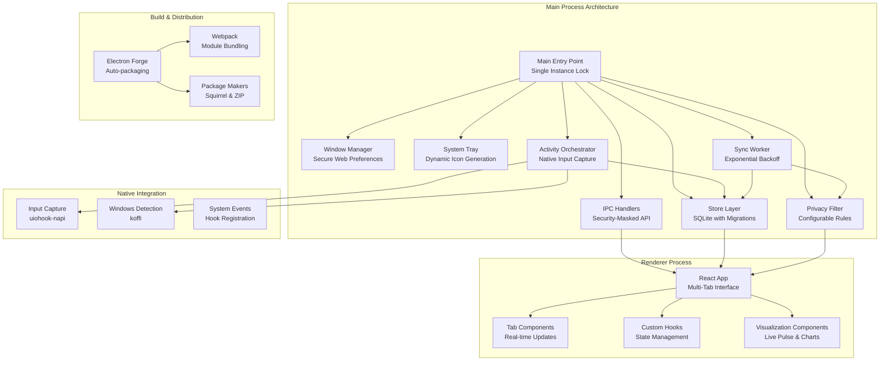

**Diagram sources**
- [index.ts:1-95](file://activity-desktop/src/main/index.ts#L1-L95)
- [window.ts:1-54](file://activity-desktop/src/main/window.ts#L1-L54)
- [tray.ts:1-119](file://activity-desktop/src/main/tray.ts#L1-L119)
- [ipc-handlers.ts:1-173](file://activity-desktop/src/main/ipc/ipc-handlers.ts#L1-L173)
- [orchestrator.ts:1-203](file://activity-desktop/src/main/collectors/orchestrator.ts#L1-L203)
- [sync-worker.ts:1-230](file://activity-desktop/src/main/sync/sync-worker.ts#L1-L230)
- [database.ts:1-101](file://activity-desktop/src/main/store/database.ts#L1-L101)
- [filter.ts:1-80](file://activity-desktop/src/main/privacy/filter.ts#L1-L80)
- [App.tsx:1-71](file://activity-desktop/src/renderer/App.tsx#L1-L71)
- [forge.config.ts:1-47](file://activity-desktop/forge.config.ts#L1-L47)

**Section sources**
- [package.json:1-47](file://activity-desktop/package.json#L1-L47)
- [forge.config.ts:1-47](file://activity-desktop/forge.config.ts#L1-L47)
- [tsconfig.json:1-23](file://activity-desktop/tsconfig.json#L1-L23)

## Core Components
The application consists of several interconnected core components that work together to provide comprehensive activity monitoring:

**Main Process Architecture**
- **Single Instance Lock**: Prevents multiple application instances and focuses existing windows on second-instance launch
- **Window Management**: Creates secure BrowserWindow with context isolation, node integration disabled, and DevTools integration
- **System Tray Integration**: Generates dynamic 16x16 green circle icons and provides context menu actions
- **IPC Communication**: Exposes typed API surface with security measures for sensitive data masking
- **Activity Collection**: Orchestrates native input capture, window detection, idle monitoring, and event processing
- **Data Synchronization**: Implements background sync worker with exponential backoff and retention policies
- **Privacy Filtering**: Applies configurable privacy rules including blacklists, domain redaction, and category-only mode

**Renderer Process Components**
- **Multi-Tab Interface**: React application with five distinct tabs for different functional areas
- **Real-time State Updates**: Subscribes to collector and sync state changes for immediate UI updates
- **Configuration Management**: Handles setup screen and configuration validation
- **Component Architecture**: Modular tab components with specialized functionality
- **Visualization Components**: Live pulse indicators, time displays, and interactive charts for real-time monitoring

**Storage and Persistence**
- **SQLite Database**: Local storage with WAL mode, foreign key constraints, and proper indexing
- **Migration System**: Versioned schema migrations with transactional updates
- **Repository Pattern**: Clean separation of data access logic with CRUD operations
- **Transaction Support**: Atomic operations for data integrity

**Native Integration**
- **Windows Input Capture**: Native hooking for keyboard, mouse, and scroll events
- **Window Detection**: Foreground application and title capture using Windows APIs
- **Idle Time Monitoring**: Accurate idle detection for AFK calculations
- **System Integration**: Tray integration, startup handling, and system event monitoring

**Build and Distribution**
- **Electron Forge**: Production-ready packaging with auto-unpack natives plugin
- **Webpack Integration**: Separate configurations for main and renderer processes
- **Cross-platform Packaging**: Squirrel installer for Windows and ZIP archives
- **Asset Relocation**: Optimized asset handling for portable applications

**Section sources**
- [index.ts:1-95](file://activity-desktop/src/main/index.ts#L1-L95)
- [window.ts:1-54](file://activity-desktop/src/main/window.ts#L1-L54)
- [tray.ts:1-119](file://activity-desktop/src/main/tray.ts#L1-L119)
- [ipc-handlers.ts:1-173](file://activity-desktop/src/main/ipc/ipc-handlers.ts#L1-L173)
- [orchestrator.ts:1-203](file://activity-desktop/src/main/collectors/orchestrator.ts#L1-L203)
- [sync-worker.ts:1-230](file://activity-desktop/src/main/sync/sync-worker.ts#L1-L230)
- [database.ts:1-101](file://activity-desktop/src/main/store/database.ts#L1-L101)
- [config-repo.ts:1-61](file://activity-desktop/src/main/store/config-repo.ts#L1-L61)
- [events-repo.ts:1-116](file://activity-desktop/src/main/store/events-repo.ts#L1-L116)
- [markers-repo.ts:1-59](file://activity-desktop/src/main/store/markers-repo.ts#L1-L59)
- [types.ts:1-181](file://activity-desktop/src/shared/types.ts#L1-L181)
- [App.tsx:1-71](file://activity-desktop/src/renderer/App.tsx#L1-L71)
- [filter.ts:1-80](file://activity-desktop/src/main/privacy/filter.ts#L1-L80)

## Architecture Overview
The system implements a robust main-renderer architecture with explicit IPC channels and comprehensive security measures. The main process handles all native operations and data persistence, while the renderer provides the user interface and state management. The architecture emphasizes security through data masking, privacy filtering, and secure IPC communication.

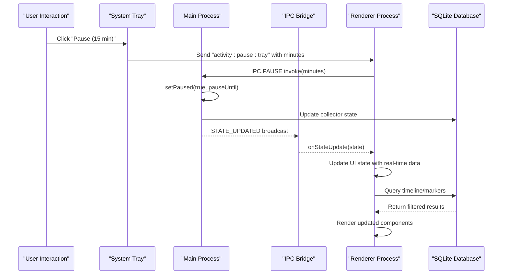

**Diagram sources**
- [tray.ts:70-85](file://activity-desktop/src/main/tray.ts#L70-L85)
- [ipc-handlers.ts:78-91](file://activity-desktop/src/main/ipc/ipc-handlers.ts#L78-L91)
- [orchestrator.ts:85-88](file://activity-desktop/src/main/collectors/orchestrator.ts#L85-L88)
- [ipc-handlers.ts:158-172](file://activity-desktop/src/main/ipc/ipc-handlers.ts#L158-L172)

**Section sources**
- [index.ts:27-63](file://activity-desktop/src/main/index.ts#L27-L63)
- [ipc-handlers.ts:158-172](file://activity-desktop/src/main/ipc/ipc-handlers.ts#L158-L172)
- [orchestrator.ts:189-203](file://activity-desktop/src/main/collectors/orchestrator.ts#L189-L203)

## Detailed Component Analysis

### Main Process Lifecycle and Window Management
The main process implements a sophisticated lifecycle management system with security and user experience considerations:

**Single Instance Management**
- Implements Electron's singleInstanceLock to prevent multiple application instances
- Handles second-instance events by focusing existing window
- Ensures graceful shutdown and cleanup of resources

**Window Creation and Security**
- Creates BrowserWindow with secure webPreferences including context isolation
- Disables nodeIntegration and enables sandbox for security
- Loads renderer bundle with proper webpack entry points
- Integrates DevTools with detachable mode for debugging

**Lifecycle Events**
- Manages window-all-closed event to minimize to tray on Windows
- Handles before-quit and will-quit for proper resource cleanup
- Implements activate event for macOS compatibility
- Defers native module initialization to avoid blocking UI

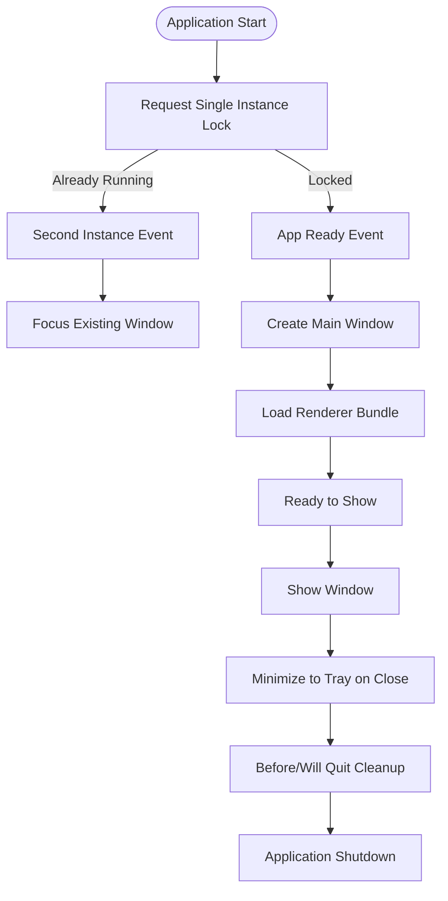

**Diagram sources**
- [index.ts:13-25](file://activity-desktop/src/main/index.ts#L13-L25)
- [index.ts:27-63](file://activity-desktop/src/main/index.ts#L27-L63)
- [window.ts:9-49](file://activity-desktop/src/main/window.ts#L9-L49)

**Section sources**
- [index.ts:1-95](file://activity-desktop/src/main/index.ts#L1-L95)
- [window.ts:1-54](file://activity-desktop/src/main/window.ts#L1-L54)

### System Tray Implementation
The system tray provides essential quick-access functionality with dynamic icon generation:

**Dynamic Icon Generation**
- Creates 16x16 green circle tray icon programmatically using nativeImage
- Implements anti-aliased edges for pixel-perfect rendering
- Avoids external asset dependencies for portability

**Context Menu Actions**
- Provides "Show Window" action to restore application
- Offers "Pause (15 min)" and "Pause (1 hour)" options
- Includes "Quit" action for application termination
- Sends tray-specific IPC messages to renderer

**Integration Features**
- Tooltip updates with current status information
- Click event handling for window restoration
- Context menu template registration for Windows integration

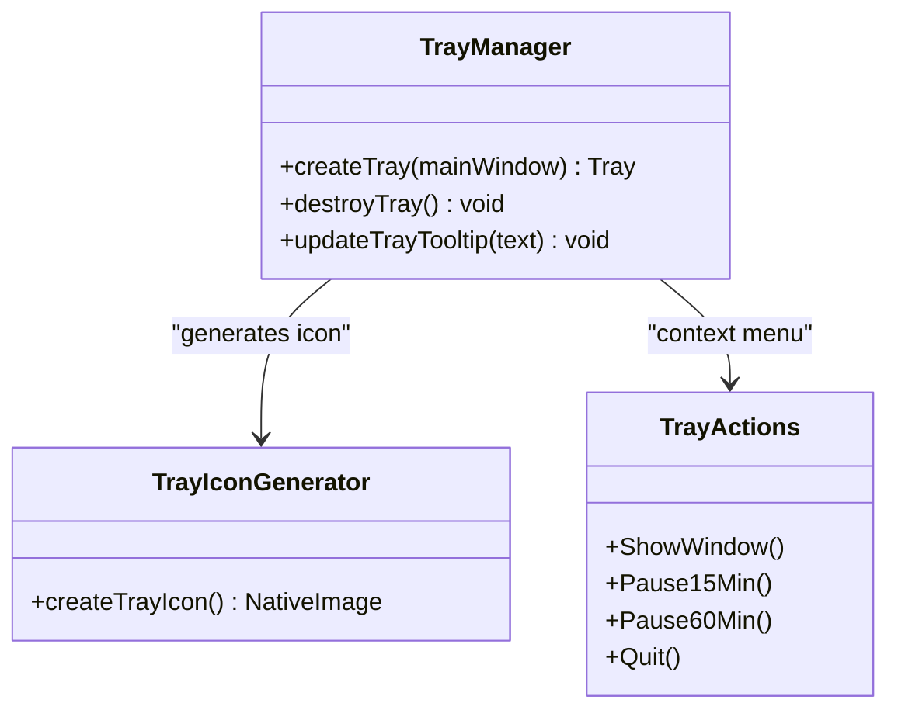

**Diagram sources**
- [tray.ts:49-119](file://activity-desktop/src/main/tray.ts#L49-L119)

**Section sources**
- [tray.ts:1-119](file://activity-desktop/src/main/tray.ts#L1-L119)

### IPC Handler Surface and Security Measures
The IPC system provides a comprehensive API surface with robust security measures:

**API Method Coverage**
- State queries: getState(), getTimeline(), getMarkers()
- Configuration management: getConfig(), updateConfig(), isConfigured()
- Privacy operations: getOutboundPreview(), privacy management
- Control operations: pause(), resume(), addMarker()
- System operations: syncNow(), testConnectivity(), setupDevice()

**Security Implementations**
- DeviceKey masking: sensitive deviceKey is masked when sent to renderer
- Direct deviceKey prevention: renderer cannot set deviceKey directly
- Parameter validation: comprehensive input sanitization
- Error handling: structured error responses with details

**Event Broadcasting**
- Real-time state updates to renderer
- Sync status notifications
- Pause/resume state changes
- Custom event forwarding for specialized operations

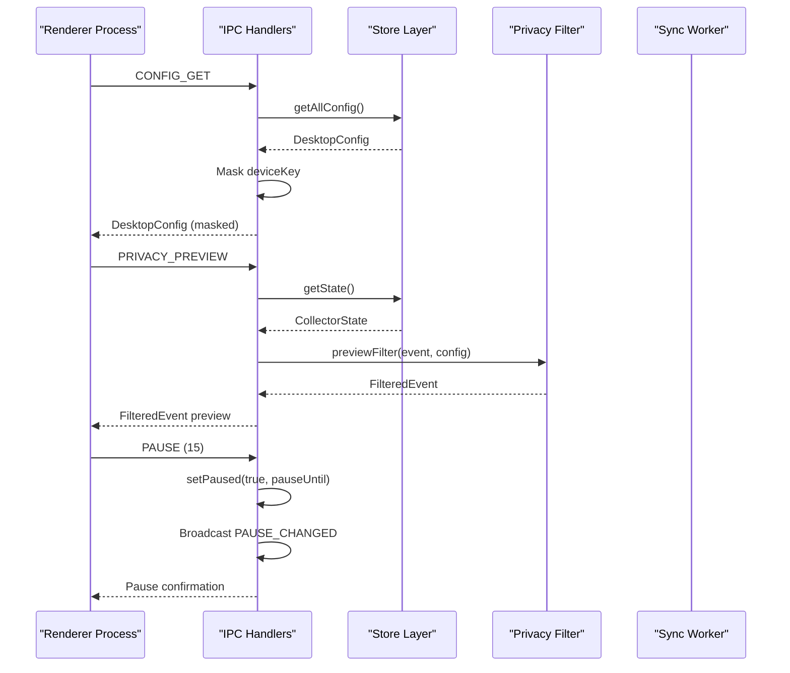

**Diagram sources**
- [ipc-handlers.ts:27-41](file://activity-desktop/src/main/ipc/ipc-handlers.ts#L27-L41)
- [ipc-handlers.ts:51-68](file://activity-desktop/src/main/ipc/ipc-handlers.ts#L51-L68)
- [ipc-handlers.ts:78-91](file://activity-desktop/src/main/ipc/ipc-handlers.ts#L78-L91)

**Section sources**
- [ipc-handlers.ts:1-173](file://activity-desktop/src/main/ipc/ipc-handlers.ts#L1-L173)
- [types.ts:149-181](file://activity-desktop/src/shared/types.ts#L149-L181)

### Activity Collection Orchestration
The activity collection system combines multiple data sources to create comprehensive activity tracking:

**Collection Pipeline**
- **Window Detection**: Captures foreground application and window title using native Windows APIs
- **Input Counting**: Monitors keyboard, mouse, and scroll events with uiohook-napi
- **Idle Detection**: Calculates idle time for AFK determination using koffi library
- **Categorization**: Applies category rules to classify applications automatically
- **Privacy Filtering**: Applies configured privacy rules before data storage
- **Event Storage**: Inserts processed events into SQLite database with metadata

**AFK Calculation Algorithm**
- Compares idle time growth against expected interval duration
- Uses jitter compensation to handle timing variations
- Implements threshold-based AFK detection
- Calculates active vs AFK time ratios

**State Management**
- Maintains real-time collector state with all metrics
- Tracks today's totals for quick access
- Supports pause/resume functionality with timestamp validation
- Emits state updates for UI synchronization

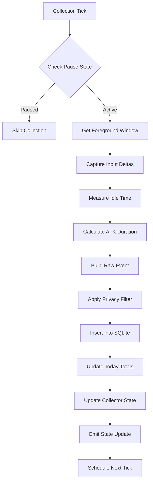

**Diagram sources**
- [orchestrator.ts:94-187](file://activity-desktop/src/main/collectors/orchestrator.ts#L94-L187)

**Section sources**
- [orchestrator.ts:1-203](file://activity-desktop/src/main/collectors/orchestrator.ts#L1-L203)

### Sync Worker and Retention Policy
The synchronization system implements robust data transfer with intelligent retry mechanisms:

**Sync Operations**
- **Batch Processing**: Processes events and markers in configurable batches
- **Device Authentication**: Uses device ID and key for secure API access
- **Error Handling**: Comprehensive error logging and retry mechanisms
- **Success Tracking**: Marks successful syncs with timestamps

**Exponential Backoff**
- **Failure Detection**: Tracks consecutive sync failures
- **Backoff Calculation**: 2^n * 1000ms with 5-minute maximum
- **Retry Logic**: Automatically retries failed operations
- **Progressive Delay**: Reduces server load during sustained failures

**Retention Management**
- **Data Lifecycle**: 30-day retention for synced events
- **Cleanup Operations**: Automated purging of old synced data
- **Queue Management**: Limits pending operations to prevent accumulation
- **Memory Efficiency**: Prevents database bloat over time

**Connectivity Testing**
- **Latency Measurement**: Tests server response times
- **Authentication Validation**: Verifies device credentials
- **Network Diagnostics**: Provides detailed connectivity information

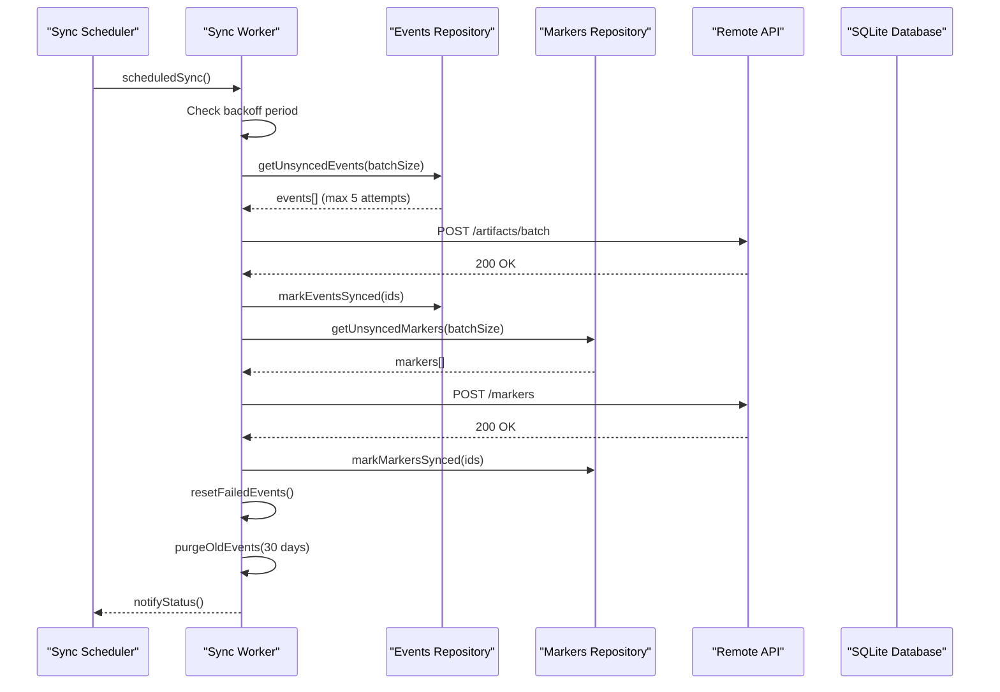

**Diagram sources**
- [sync-worker.ts:48-157](file://activity-desktop/src/main/sync/sync-worker.ts#L48-L157)
- [events-repo.ts:39-53](file://activity-desktop/src/main/store/events-repo.ts#L39-L53)
- [markers-repo.ts:26-38](file://activity-desktop/src/main/store/markers-repo.ts#L26-L38)

**Section sources**
- [sync-worker.ts:1-230](file://activity-desktop/src/main/sync/sync-worker.ts#L1-L230)
- [events-repo.ts:75-116](file://activity-desktop/src/main/store/events-repo.ts#L75-L116)
- [markers-repo.ts:40-59](file://activity-desktop/src/main/store/markers-repo.ts#L40-L59)

## Privacy and Security Implementation
The application implements comprehensive privacy controls to protect user data while maintaining functionality:

**Privacy Filter Architecture**
- **Category-Only Mode**: Completely anonymizes all identifying information
- **Blacklist Management**: Configurable application and title pattern blacklists
- **Domain Redaction**: Automatic redaction of sensitive domain information
- **Title Suppression**: Optional window title transmission control

**Filtering Logic**
- **Priority Processing**: Applies filters in logical priority order
- **Case-Insensitive Matching**: Robust pattern matching for applications
- **Regex Support**: Advanced pattern matching for complex filtering rules
- **Placeholder Replacement**: Consistent redaction using privacy placeholders

**Security Measures**
- **Data Masking**: DeviceKey is masked when transmitted to renderer
- **Parameter Sanitization**: Input validation and sanitization throughout
- **Access Control**: Restricts direct deviceKey modification from renderer
- **Audit Trail**: Tracks privacy filter decisions and modifications

**Configuration Options**
- **Send Window Title**: Toggle for title transmission
- **Category-Only Mode**: Complete anonymization mode
- **Blacklist Apps**: Specific application name filtering
- **Blacklist Patterns**: Regex-based title pattern filtering
- **Redact Domains**: Domain-based content redaction

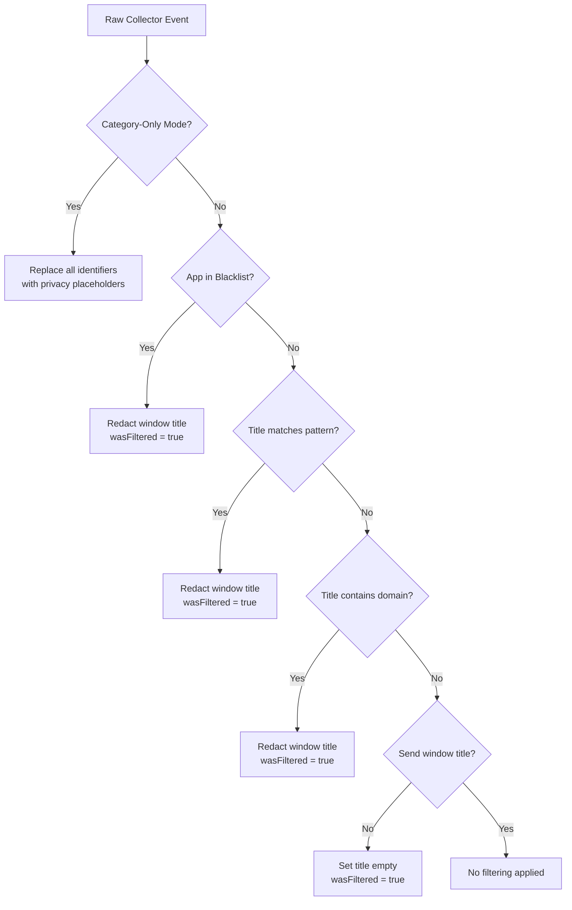

**Diagram sources**
- [filter.ts:27-71](file://activity-desktop/src/main/privacy/filter.ts#L27-L71)

**Section sources**
- [filter.ts:1-80](file://activity-desktop/src/main/privacy/filter.ts#L1-L80)
- [types.ts:39-69](file://activity-desktop/src/shared/types.ts#L39-L69)

## Database and Storage Layer
The storage system provides reliable local persistence with comprehensive indexing and migration support:

**Database Schema Design**
- **Events Table**: Stores activity heartbeat data with comprehensive metrics
- **Markers Table**: Records user-defined activity markers and notes
- **Config Table**: Persistent configuration storage with type safety
- **Sync State Table**: Tracks synchronization progress and errors

**Indexing Strategy**
- **Created Timestamp Index**: Optimizes time-range queries
- **Sync Status Index**: Efficient filtering of synced/unsynced records
- **Category Index**: Supports category-based analytics and filtering
- **Composite Indexes**: Multi-column indexes for common query patterns

**Migration System**
- **Version Management**: Incremental schema evolution
- **Transactional Updates**: Atomic migration operations
- **Data Preservation**: Safe upgrade without data loss
- **Rollback Capability**: Support for migration rollback scenarios

**Repository Pattern Implementation**
- **CRUD Operations**: Standardized data access methods
- **Batch Processing**: Efficient bulk operations
- **Transaction Support**: Atomic operations for data integrity
- **Error Handling**: Comprehensive exception management

**Data Integrity Features**
- **Foreign Key Constraints**: Enforces referential integrity
- **WAL Mode**: Improves concurrent read/write performance
- **Busy Timeout**: Prevents database locking issues
- **Serialization**: Type-safe configuration storage

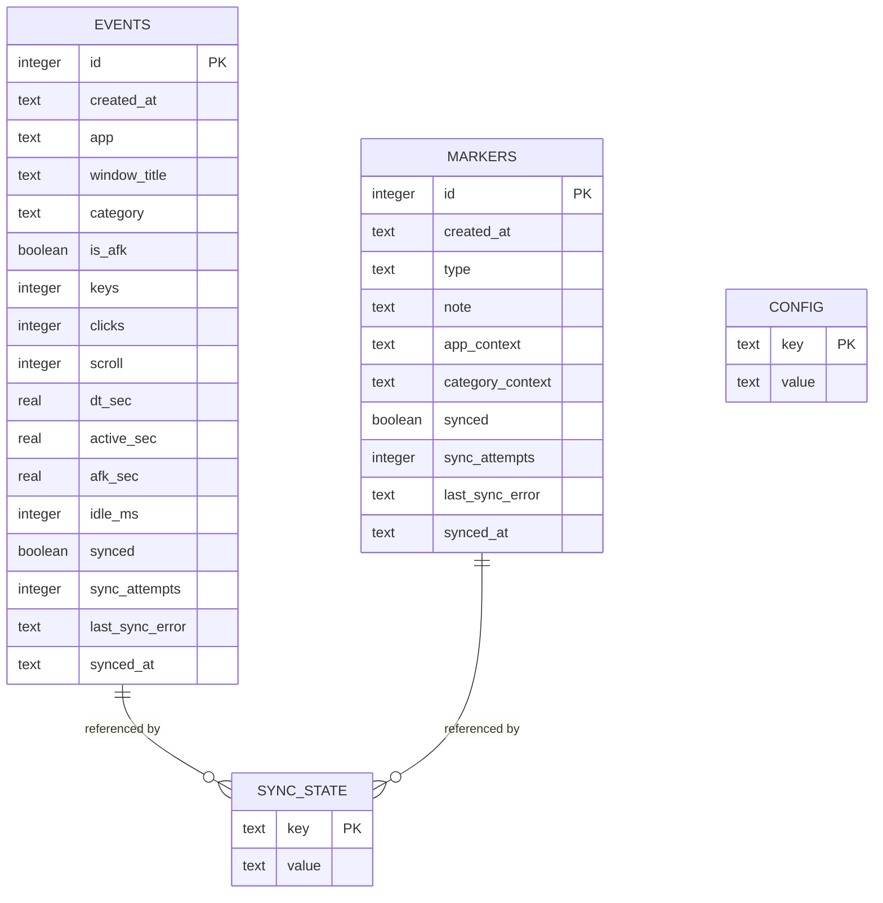

**Diagram sources**
- [database.ts:7-57](file://activity-desktop/src/main/store/database.ts#L7-L57)
- [events-repo.ts:4-24](file://activity-desktop/src/main/store/events-repo.ts#L4-L24)
- [markers-repo.ts:4-12](file://activity-desktop/src/main/store/markers-repo.ts#L4-L12)

**Section sources**
- [database.ts:1-101](file://activity-desktop/src/main/store/database.ts#L1-L101)
- [config-repo.ts:1-61](file://activity-desktop/src/main/store/config-repo.ts#L1-L61)
- [events-repo.ts:1-116](file://activity-desktop/src/main/store/events-repo.ts#L1-L116)
- [markers-repo.ts:1-59](file://activity-desktop/src/main/store/markers-repo.ts#L1-L59)

## User Interface and Experience
The React-based user interface provides a comprehensive dashboard with intuitive navigation and real-time data visualization:

**Multi-Tab Architecture**
- **Status Tab**: Real-time activity metrics and current state
- **Timeline Tab**: Historical activity visualization and analysis
- **Markers Tab**: Activity markers and user notes management
- **Privacy Tab**: Privacy configuration and filtering controls
- **Settings Tab**: Application configuration and device setup

**Component Architecture**
- **Tab Navigation**: Clean tab bar with active state indication
- **Responsive Design**: Adapts to different window sizes
- **State Management**: Real-time updates from collector and sync workers
- **Error Boundaries**: Graceful handling of loading states and errors

**Setup Flow**
- **Configuration Validation**: Ensures device setup completion
- **Onboarding Experience**: Guided setup process for new users
- **Validation Feedback**: Immediate feedback on configuration changes
- **Fallback States**: Loading indicators during initialization

**Real-time Updates**
- **State Subscription**: Automatic UI updates when collector state changes
- **Sync Status**: Live synchronization progress and error reporting
- **Pause Indicators**: Clear visual feedback for paused states
- **Performance Metrics**: Real-time display of collection and sync metrics

**Visual Design**
- **Theme Integration**: Consistent styling with dark/light theme support
- **Chart Integration**: Recharts-based visualizations for activity data
- **Accessibility**: Keyboard navigation and screen reader support
- **Performance**: Optimized rendering for smooth user experience

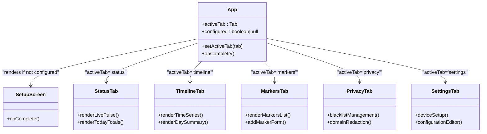

**Diagram sources**
- [App.tsx:21-69](file://activity-desktop/src/renderer/App.tsx#L21-L69)

**Section sources**
- [App.tsx:1-71](file://activity-desktop/src/renderer/App.tsx#L1-L71)

## Real-time Visualization Components
The application now features comprehensive real-time visualization components that provide immediate feedback on system status and activity patterns:

**LivePulse Component**
- **Purpose**: Visual indicator for real-time activity status with animated pulsing effect
- **Features**: Configurable color, size, and active state with CSS animations
- **Usage**: Displays current collector status with visual feedback for active/inactive states
- **Styling**: Uses CSS variables for theme integration and smooth animations

**TimeSinceUpdate Component**
- **Purpose**: Shows elapsed time since last data update with automatic refresh
- **Features**: Real-time countdown with minute/second formatting and stale state detection
- **Automation**: Automatic 1-second refresh interval with cleanup on component unmount
- **Styling**: Color-coded text indicating fresh (dim) vs stale (warning) data states

**TopAppsList Component**
- **Purpose**: Displays ranked applications by activity duration with visual progress bars
- **Features**: Percentage-based progress visualization, category coloring, and duration formatting
- **Functionality**: Dynamic ranking with configurable maximum items and responsive design
- **Performance**: Efficient rendering with memoized calculations and optimized DOM updates

**CategoryDonut Chart**
- **Purpose**: Pie chart visualization of activity distribution across categories
- **Features**: Interactive tooltips, responsive container, category-based coloring, and percentage display
- **Design**: Central total duration display with legend and gradient styling
- **Integration**: Recharts-based with custom tooltip styling and responsive layout

**DaySummaryCard Component**
- **Purpose**: Compact summary of daily activity metrics in a grid layout
- **Features**: Four-column layout showing active time, keystrokes, clicks, and scroll actions
- **Formatting**: Human-readable duration formatting with appropriate units
- **Design**: Card-based layout with accent colors for key metrics

**Section sources**
- [LivePulse.tsx:1-25](file://activity-desktop/src/renderer/components/LivePulse.tsx#L1-L25)
- [TimeSinceUpdate.tsx:1-41](file://activity-desktop/src/renderer/components/TimeSinceUpdate.tsx#L1-L41)
- [TopAppsList.tsx:1-54](file://activity-desktop/src/renderer/components/TopAppsList.tsx#L1-L54)
- [CategoryDonut.tsx:1-103](file://activity-desktop/src/renderer/components/charts/CategoryDonut.tsx#L1-L103)
- [DaySummaryCard.tsx:1-37](file://activity-desktop/src/renderer/components/charts/DaySummaryCard.tsx#L1-L37)

## Enhanced Timeline Analytics
The timeline aggregation system has been significantly enhanced with new visualization components and improved data processing capabilities:

**ActivityBar24h Component**
- **Purpose**: Horizontal timeline showing 24-hour activity with categorical color coding
- **Features**: Minute-by-minute segmentation, category-based coloring, hour labels, and interactive legends
- **Algorithm**: 5-minute slot granularity with segment merging for continuous activity periods
- **Design**: Opacity-based intensity scaling and responsive layout with category legends

**MiniTimeSeriesChart Component**
- **Purpose**: Compact area chart for displaying activity trends over time
- **Features**: Gradient fills, custom tooltips, responsive container, and time-based X-axis
- **Integration**: Recharts-based with linear gradients and interactive tooltips
- **Performance**: Optimized rendering for real-time updates and smooth animations

**Enhanced useTimeline Hook**
- **Purpose**: Comprehensive timeline data management with automatic refresh capabilities
- **Features**: Automatic 10-second refresh for current day, sync update subscriptions, and loading states
- **Functionality**: Date-based fetching, aggregated data computation, and real-time updates
- **Performance**: Efficient caching, debounced updates, and cleanup of event listeners

**Advanced Aggregation Utilities**
- **Time Series Points**: 15-minute interval grouping with comprehensive metrics
- **Top Applications**: Ranking by activity duration with category association
- **Category Analysis**: Percentage calculation and sorting by activity contribution
- **Activity Segments**: 5-minute granularity with continuous segment merging
- **Total Metrics**: Aggregated counters for active time, AFK time, and interaction counts

**Section sources**
- [ActivityBar24h.tsx:1-75](file://activity-desktop/src/renderer/components/charts/ActivityBar24h.tsx#L1-L75)
- [MiniTimeSeriesChart.tsx:1-78](file://activity-desktop/src/renderer/components/charts/MiniTimeSeriesChart.tsx#L1-L78)
- [useTimeline.ts:1-55](file://activity-desktop/src/renderer/hooks/useTimeline.ts#L1-L55)
- [aggregateTimeline.ts:1-210](file://activity-desktop/src/renderer/utils/aggregateTimeline.ts#L1-L210)

## Native Integration and System Features
The application leverages native Windows capabilities for comprehensive system integration:

**Windows Input Capture**
- **uiohook-napi Integration**: Native hooking for keyboard, mouse, and scroll events
- **Low-Level Access**: Direct hardware event capture without OS limitations
- **Performance Optimization**: Efficient event processing with minimal overhead
- **Cross-Platform Compatibility**: Windows-specific implementation with fallbacks

**System Integration**
- **Startup Handling**: Electron Squirrel startup integration for automatic installation
- **System Tray**: Full native tray integration with custom icon generation
- **Window Management**: Native window controls and system integration
- **Process Management**: Proper lifecycle management across system events

**Native Libraries**
- **koffi**: Windows API bindings for system-level operations
- **uiohook-napi**: Native input event capture and processing
- **better-sqlite3**: High-performance SQLite integration
- **axios**: HTTP client for API communications

**System Event Handling**
- **Focus Detection**: Accurate foreground application tracking
- **Idle Monitoring**: Precise idle time measurement for AFK detection
- **Process Information**: Detailed application and window metadata
- **System State**: Integration with Windows system events and notifications

**Security Integration**
- **Context Isolation**: Secure renderer process with isolated context
- **Node Integration**: Disabled node integration for security
- **Preload Scripts**: Controlled API exposure through preload mechanism
- **Sandbox Mode**: Electron sandbox for additional security layers

**Section sources**
- [index.ts:8-11](file://activity-desktop/src/main/index.ts#L8-L11)
- [window.ts:19-25](file://activity-desktop/src/main/window.ts#L19-L25)
- [package.json:13-22](file://activity-desktop/package.json#L13-L22)

## Dependency Analysis
The application uses a carefully selected set of dependencies optimized for performance and security:

**Core Dependencies**
- **Electron 33.0.0**: Latest stable Electron runtime with improved security
- **React 19.0.0**: Modern React with concurrent features and optimizations
- **better-sqlite3 11.7.0**: High-performance SQLite binding with zero dependencies
- **axios 1.6.0**: Reliable HTTP client with promise support

**Development Dependencies**
- **@electron-forge/cli 7.6.0**: Production-ready Electron packaging
- **@electron-forge/plugin-webpack 7.6.0**: Webpack integration for bundling
- **@types/react 19.0.0**: TypeScript definitions for React development
- **typescript 5.7.0**: Modern TypeScript with latest features

**Build Tooling**
- **Webpack**: Module bundling with separate configs for main and renderer
- **PostCSS**: CSS processing with Tailwind integration
- **Autoprefixer**: Automatic vendor prefixing for CSS
- **Fork TS Checker**: Parallel TypeScript type checking

**Runtime Dependencies**
- **koffi 2.15.1**: Windows API bindings for system-level operations
- **uiohook-napi 1.5.4**: Native input event capture and processing
- **recharts 3.8.0**: Beautiful charting library for data visualization
- **electron-squirrel-startup 1.0.1**: Squirrel installer integration

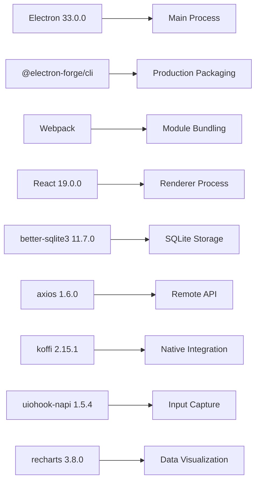

**Diagram sources**
- [package.json:13-44](file://activity-desktop/package.json#L13-L44)
- [forge.config.ts:25-43](file://activity-desktop/forge.config.ts#L25-L43)
- [tsconfig.json:2-18](file://activity-desktop/tsconfig.json#L2-L18)

**Section sources**
- [package.json:1-47](file://activity-desktop/package.json#L1-L47)
- [forge.config.ts:1-47](file://activity-desktop/forge.config.ts#L1-L47)
- [tsconfig.json:1-23](file://activity-desktop/tsconfig.json#L1-L23)

## Performance Considerations
The application is optimized for efficient resource usage while maintaining responsive user experience:

**Collection Optimization**
- **Polling Interval Tuning**: Configurable 10-second intervals balance accuracy and performance
- **AFK Detection Efficiency**: Optimized idle time comparison reduces CPU usage
- **Input Delta Processing**: Efficient event counting with minimal overhead
- **Memory Management**: Proper cleanup of temporary objects and listeners

**Database Performance**
- **WAL Mode**: Write-Ahead Logging improves concurrent read/write performance
- **Index Optimization**: Strategic indexing for common query patterns
- **Batch Operations**: Efficient bulk insert/update operations
- **Connection Pooling**: Single database connection with transaction support

**Network Efficiency**
- **Batch Processing**: 20-event batches reduce API call frequency
- **Exponential Backoff**: Progressive delays during failures prevent server overload
- **Timeout Configuration**: Appropriate timeouts for different operation types
- **Connection Reuse**: HTTP connection pooling for improved performance

**UI Responsiveness**
- **Virtual Scrolling**: Efficient rendering for large datasets
- **Debounced Updates**: Throttled state updates prevent UI blocking
- **Lazy Loading**: Tab content loaded on demand
- **Optimized Re-renders**: React.memo and pure components for minimal updates

**Resource Management**
- **Memory Cleanup**: Proper disposal of native resources and event listeners
- **CPU Throttling**: Adaptive polling based on system load
- **Disk I/O Optimization**: Batched database writes reduce disk access
- **Network Throttling**: Intelligent retry scheduling prevents bandwidth spikes

**Visualization Performance**
- **Chart Optimization**: Efficient recharts rendering with data batching
- **Animation Management**: CSS animations for smooth visual feedback
- **Component Memoization**: React.memo for expensive visualization components
- **Real-time Updates**: Debounced updates for frequently changing data

## Troubleshooting Guide
Comprehensive troubleshooting guidance for common issues and their solutions:

**Application Startup Issues**
- **Single Instance Conflicts**: Check for existing instances and use second-instance focus behavior
- **Window Not Appearing**: Verify ready-to-show event and show() call completion
- **Renderer Loading Failures**: Check webpack bundle compilation and preload script loading
- **Native Module Errors**: Ensure auto-unpack natives plugin is properly configured

**Collection and Data Issues**
- **Missing Events**: Verify input counter initialization and polling interval configuration
- **Incorrect AFK Detection**: Check idle time thresholds and timing calculations
- **Privacy Filter Problems**: Review blacklist configurations and regex patterns
- **Database Connection Failures**: Verify SQLite file permissions and path accessibility

**Synchronization Problems**
- **Sync Failures**: Check device credentials, network connectivity, and server availability
- **Exponential Backoff**: Monitor consecutive failure counts and backoff progression
- **Retention Issues**: Verify 30-day purge operations and database cleanup
- **Batch Processing Errors**: Check API endpoint availability and request formatting

**UI and Interface Issues**
- **Tab Rendering Problems**: Verify React component mounting and state updates
- **Real-time Updates**: Check IPC message routing and event subscription
- **Setup Screen Loop**: Ensure configuration validation and completion callbacks
- **Performance Degradation**: Monitor memory usage and optimize heavy operations

**Visualization Component Issues**
- **Chart Rendering Failures**: Verify recharts installation and data format compatibility
- **Live Pulse Animation Problems**: Check CSS animation support and theme variable availability
- **Time Display Updates**: Ensure proper date parsing and interval cleanup
- **Aggregation Performance**: Monitor useTimeline hook efficiency and data volume limits

**System Integration Problems**
- **Tray Icon Issues**: Verify native image generation and context menu registration
- **Input Capture Failures**: Check uiohook-napi installation and permission requirements
- **Window Detection Problems**: Ensure koffi library compatibility and Windows API access
- **Startup Integration**: Verify Squirrel installer integration and auto-launch configuration

**Section sources**
- [index.ts:68-95](file://activity-desktop/src/main/index.ts#L68-L95)
- [orchestrator.ts:189-203](file://activity-desktop/src/main/collectors/orchestrator.ts#L189-L203)
- [sync-worker.ts:169-230](file://activity-desktop/src/main/sync/sync-worker.ts#L169-L230)
- [ipc-handlers.ts:203-229](file://activity-desktop/src/main/ipc/ipc-handlers.ts#L203-L229)

## Conclusion
The comprehensive Electron desktop application represents a mature, production-ready solution for local activity monitoring on Windows. The implementation demonstrates advanced architectural patterns including secure IPC communication, robust privacy controls, efficient database design, and seamless native integration. The modular component structure ensures maintainability while the comprehensive feature set addresses real-world productivity tracking needs.

**Recent Enhancements**
The application has been significantly enhanced with comprehensive real-time visualization capabilities:
- **Live Pulse System**: Visual indicators for immediate status feedback
- **Enhanced Timeline Analytics**: 24-hour activity bars, category donuts, and time series charts
- **Improved Data Aggregation**: Sophisticated timeline processing with multiple visualization formats
- **Real-time Updates**: Automatic refresh mechanisms for current day data
- **Performance Optimizations**: Efficient rendering and memory management for visualization components

Key strengths of the implementation include:
- **Security-First Design**: Comprehensive privacy filtering and secure IPC communication
- **Performance Optimization**: Efficient collection, storage, and synchronization mechanisms
- **User Experience**: Intuitive multi-tab interface with real-time updates and visual feedback
- **System Integration**: Native Windows capabilities with proper system integration
- **Maintainability**: Clean architecture with proper separation of concerns
- **Visualization Excellence**: Comprehensive real-time data visualization with interactive components

The application successfully transforms from a basic concept to a full-featured Windows desktop application, providing users with powerful activity tracking capabilities while maintaining strict privacy controls and system performance standards. The comprehensive documentation and troubleshooting guidance ensure both developer and user success with this sophisticated Electron application.