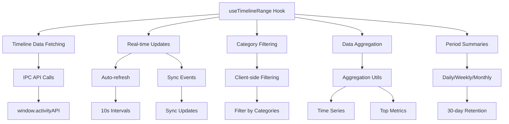
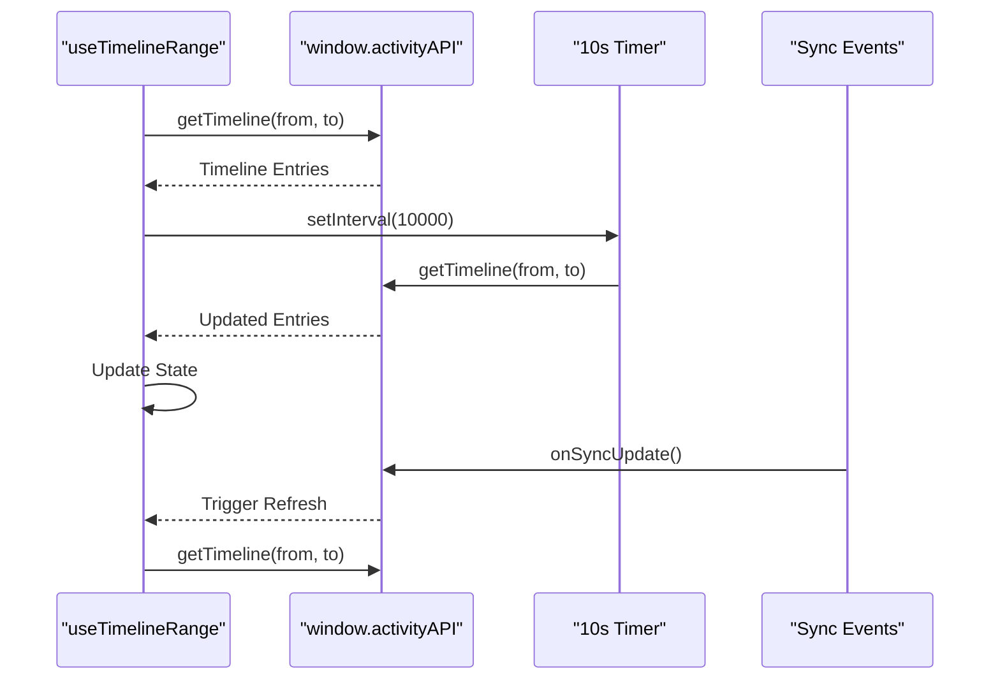
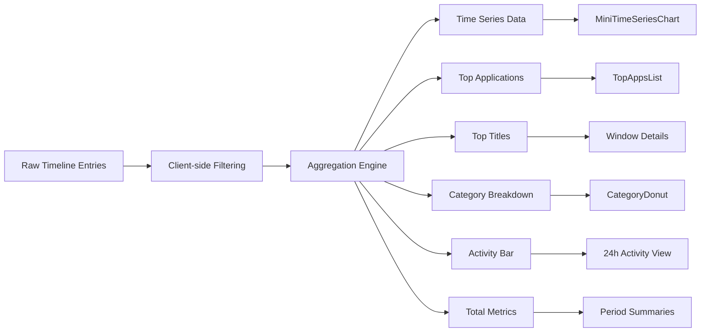
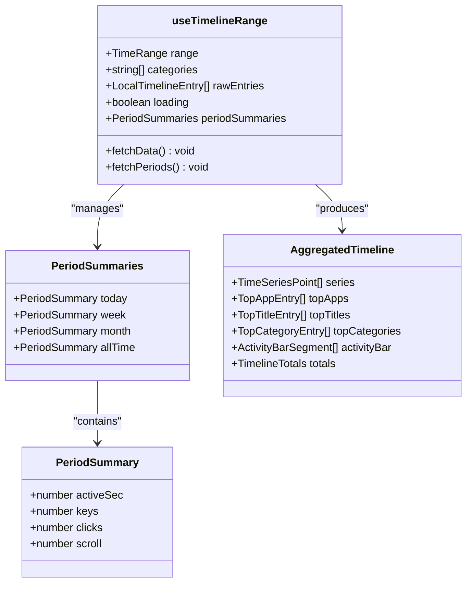
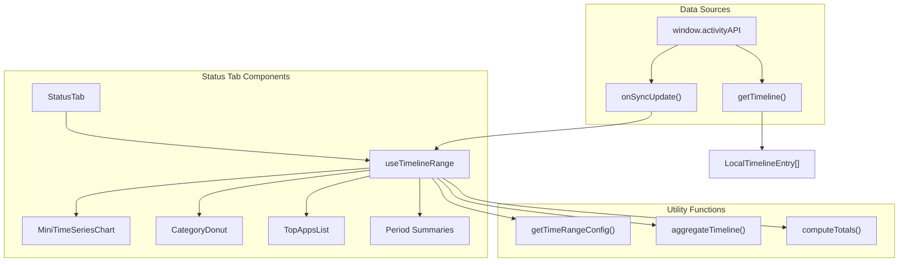
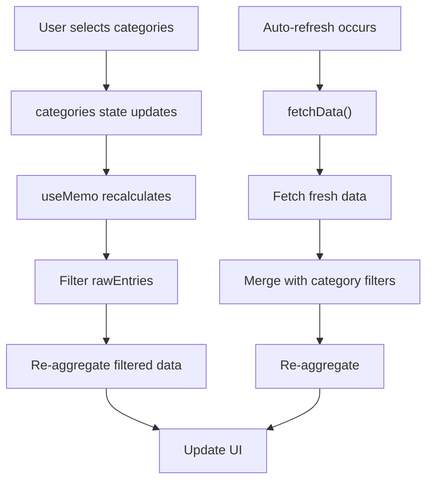

# useTimelineRange Hook

<cite>
**Referenced Files in This Document**
- [useTimelineRange.ts](file://activity-desktop/src/renderer/hooks/useTimelineRange.ts)
- [aggregateTimeline.ts](file://activity-desktop/src/renderer/utils/aggregateTimeline.ts)
- [types.ts](file://activity-desktop/src/shared/types.ts)
- [StatusTab.tsx](file://activity-desktop/src/renderer/tabs/StatusTab.tsx)
- [useTimeline.ts](file://activity-desktop/src/renderer/hooks/useTimeline.ts)
</cite>

## Table of Contents
1. [Introduction](#introduction)
2. [Hook Overview](#hook-overview)
3. [Core Functionality](#core-functionality)
4. [Data Flow and Architecture](#data-flow-and-architecture)
5. [API Reference](#api-reference)
6. [Integration Patterns](#integration-patterns)
7. [Performance Considerations](#performance-considerations)
8. [Usage Examples](#usage-examples)
9. [Troubleshooting Guide](#troubleshooting-guide)
10. [Conclusion](#conclusion)

## Introduction

The `useTimelineRange` hook is a sophisticated React hook designed to manage timeline data fetching, aggregation, and real-time updates for the activity monitoring application. It serves as the primary data source for the Status tab, providing comprehensive activity analytics across different time ranges with automatic synchronization and category filtering capabilities.

This hook encapsulates complex data management logic including time range calculations, client-side filtering, real-time data updates, and efficient aggregation of timeline entries into meaningful metrics and visualizations.

## Hook Overview

The `useTimelineRange` hook provides a comprehensive solution for timeline data management with the following key characteristics:



**Diagram sources**
- [useTimelineRange.ts:21-114](file://activity-desktop/src/renderer/hooks/useTimelineRange.ts#L21-L114)
- [aggregateTimeline.ts:77-128](file://activity-desktop/src/renderer/utils/aggregateTimeline.ts#L77-L128)

## Core Functionality

### Timeline Data Management

The hook manages timeline data through several interconnected mechanisms:

#### 1. Time Range Configuration
The hook supports five distinct time ranges with optimized aggregation intervals:

| Time Range | Duration | Interval | Use Case |
|------------|----------|----------|----------|
| `'1h'` | Last hour | 5 minutes | Real-time monitoring |
| `'4h'` | Last 4 hours | 15 minutes | Short-term analysis |
| `'today'` | Current day | 15 minutes | Daily overview |
| `'7d'` | Last 7 days | 60 minutes | Weekly trends |
| `'30d'` | Last 30 days | 1440 minutes | Monthly analysis |

#### 2. Automatic Data Refresh
The hook implements intelligent auto-refresh mechanisms:



**Diagram sources**
- [useTimelineRange.ts:30-53](file://activity-desktop/src/renderer/hooks/useTimelineRange.ts#L30-L53)

#### 3. Category-Based Filtering
The hook provides client-side filtering capabilities that don't trigger additional API calls:

- **Filter Logic**: Uses JavaScript's `Array.filter()` method for efficient client-side filtering
- **Performance**: No additional IPC calls when changing categories
- **Real-time Updates**: Maintains filtered state during auto-refresh cycles

**Section sources**
- [useTimelineRange.ts:101-111](file://activity-desktop/src/renderer/hooks/useTimelineRange.ts#L101-L111)

### Data Aggregation Pipeline

The hook transforms raw timeline entries into multiple analytical formats:



**Diagram sources**
- [aggregateTimeline.ts:116-128](file://activity-desktop/src/renderer/utils/aggregateTimeline.ts#L116-L128)

**Section sources**
- [aggregateTimeline.ts:116-335](file://activity-desktop/src/renderer/utils/aggregateTimeline.ts#L116-L335)

## Data Flow and Architecture

### State Management Architecture

The hook maintains a comprehensive state structure:



**Diagram sources**
- [useTimelineRange.ts:14-19](file://activity-desktop/src/renderer/hooks/useTimelineRange.ts#L14-L19)
- [aggregateTimeline.ts:66-73](file://activity-desktop/src/renderer/utils/aggregateTimeline.ts#L66-L73)

### Integration with Application Components

The hook integrates seamlessly with the Status tab and various visualization components:



**Diagram sources**
- [StatusTab.tsx:125](file://activity-desktop/src/renderer/tabs/StatusTab.tsx#L125)
- [useTimelineRange.ts:30-35](file://activity-desktop/src/renderer/hooks/useTimelineRange.ts#L30-L35)

**Section sources**
- [StatusTab.tsx:113-383](file://activity-desktop/src/renderer/tabs/StatusTab.tsx#L113-L383)

## API Reference

### Hook Signature

```typescript
export function useTimelineRange(range: TimeRange, categories: string[]): {
  entries: LocalTimelineEntry[]
  aggregated: AggregatedTimeline | null
  periodSummaries: PeriodSummaries
  loading: boolean
}
```

### Parameters

| Parameter | Type | Description | Required |
|-----------|------|-------------|----------|
| `range` | `TimeRange` | Time range selector (`'1h' \| '4h' \| 'today' \| '7d' \| '30d'`) | Yes |
| `categories` | `string[]` | Array of category filters | Yes |

### Return Value

The hook returns an object containing:

| Property | Type | Description |
|----------|------|-------------|
| `entries` | `LocalTimelineEntry[]` | Filtered timeline entries for the current range |
| `aggregated` | `AggregatedTimeline \| null` | Aggregated data structure for visualization |
| `periodSummaries` | `PeriodSummaries` | Summary statistics for today, week, month, and all-time |
| `loading` | `boolean` | Loading state indicator |

### Data Structures

#### TimeRange Configuration

```typescript
export type TimeRange = '1h' | '4h' | 'today' | '7d' | '30d';

export interface TimeRangeConfig {
  from: string
  to: string
  intervalMinutes: number
}
```

#### Aggregated Timeline Structure

```typescript
export interface AggregatedTimeline {
  series: TimeSeriesPoint[]
  topApps: TopAppEntry[]
  topTitles: TopTitleEntry[]
  topCategories: TopCategoryEntry[]
  activityBar: ActivityBarSegment[]
  totals: TimelineTotals
}

export interface TimelineTotals {
  activeSec: number
  afkSec: number
  keys: number
  clicks: number
  scroll: number
}
```

**Section sources**
- [aggregateTimeline.ts:5-73](file://activity-desktop/src/renderer/utils/aggregateTimeline.ts#L5-L73)
- [aggregateTimeline.ts:77-112](file://activity-desktop/src/renderer/utils/aggregateTimeline.ts#L77-L112)

## Integration Patterns

### Basic Usage Pattern

```typescript
// In StatusTab component
const [timeRange, setTimeRange] = useState<TimeRange>('today');
const [categories, setCategories] = useState<string[]>([]);

const { aggregated, periodSummaries, loading } = useTimelineRange(timeRange, categories);

// Render timeline chart
{loading ? (
  <div>Loading...</div>
) : aggregated ? (
  <MiniTimeSeriesChart data={aggregated.series} />
) : (
  <div>No data available</div>
)}
```

### Category Filtering Implementation

The hook implements intelligent category filtering:



**Diagram sources**
- [useTimelineRange.ts:101-111](file://activity-desktop/src/renderer/hooks/useTimelineRange.ts#L101-L111)

### Real-time Update Mechanisms

The hook handles multiple real-time update scenarios:

1. **Auto-refresh**: Every 10 seconds for continuous data updates
2. **Sync updates**: Immediate refresh when new data becomes available
3. **Manual refresh**: Triggered by user actions or component lifecycle

**Section sources**
- [useTimelineRange.ts:44-53](file://activity-desktop/src/renderer/hooks/useTimelineRange.ts#L44-L53)

## Performance Considerations

### Memory Management

The hook implements several strategies to optimize memory usage:

- **Client-side filtering**: Prevents unnecessary API calls during category changes
- **Efficient aggregation**: Uses Map-based data structures for optimal performance
- **Selective re-rendering**: Leverages `useMemo` to prevent unnecessary computations

### Data Freshness

The hook balances data freshness with performance:

- **10-second intervals**: Frequent updates without overwhelming the system
- **Smart caching**: Maintains recent data locally to minimize network requests
- **Batch processing**: Aggregates data efficiently to reduce computational overhead

### Scalability Features

- **30-day retention limit**: Prevents unlimited data accumulation
- **Optimized aggregation intervals**: Larger intervals for longer time ranges
- **Lazy loading**: Only aggregates data when needed for visualization

## Usage Examples

### Status Tab Integration

The primary consumer of this hook is the Status tab, which demonstrates comprehensive usage:

```typescript
// StatusTab.tsx
const [timeRange, setTimeRange] = useState<TimeRange>('today');
const [metric, setMetric] = useState<MetricKey>('activeSec');
const [categories, setCategories] = useState<string[]>([]);

const { aggregated, periodSummaries, loading } = useTimelineRange(timeRange, categories);

// Render different visualizations based on aggregated data
<MiniTimeSeriesChart data={aggregated.series} metric={metric} />
<CategoryDonut data={aggregated.topCategories} />
<TopAppsList apps={aggregated.topApps} />
```

### Dynamic Time Range Selection

The hook supports dynamic time range switching:

```typescript
// Handle time range changes
const handleTimeRangeChange = (newRange: TimeRange) => {
  // The hook automatically handles the transition
  // No manual cleanup required
  setTimeRange(newRange);
};

// Time range buttons
{TIME_RANGES.map(r => (
  <button
    key={r.key}
    onClick={() => handleTimeRangeChange(r.key)}
    className={timeRange === r.key ? 'selected' : ''}
  >
    {r.label}
  </button>
))}
```

### Category Filtering Implementation

```typescript
// Toggle category filters
const toggleCategory = useCallback((cat: string) => {
  if (cat === '') {
    setCategories([]);
  } else {
    setCategories(prev => {
      if (prev.includes(cat)) {
        return prev.filter(c => c !== cat);
      }
      return [...prev, cat];
    });
  }
}, []);
```

**Section sources**
- [StatusTab.tsx:113-383](file://activity-desktop/src/renderer/tabs/StatusTab.tsx#L113-L383)

## Troubleshooting Guide

### Common Issues and Solutions

#### Issue: Data Not Refreshing
**Symptoms**: Timeline data appears stale despite new entries
**Causes**: 
- Sync event listener not firing
- Network connectivity issues
- API call failures

**Solutions**:
- Verify `window.activityAPI` availability
- Check console for API errors
- Ensure `onSyncUpdate` handler is properly registered

#### Issue: Performance Degradation
**Symptoms**: Slow rendering or memory leaks
**Causes**:
- Large dataset sizes
- Excessive re-renders
- Inefficient filtering logic

**Solutions**:
- Implement category filters early
- Use appropriate time ranges
- Monitor aggregation performance

#### Issue: Category Filters Not Working
**Symptoms**: Category selections don't affect timeline data
**Causes**:
- Empty categories array
- Incorrect category names
- State synchronization issues

**Solutions**:
- Verify category names match stored data
- Check category filter logic
- Ensure state updates trigger re-computation

### Debugging Strategies

1. **Enable logging**: Add console logs in key hook functions
2. **Monitor API calls**: Track timeline fetch frequencies
3. **Check data flow**: Verify data transitions between states
4. **Performance profiling**: Use browser dev tools to identify bottlenecks

**Section sources**
- [useTimelineRange.ts:30-53](file://activity-desktop/src/renderer/hooks/useTimelineRange.ts#L30-L53)

## Conclusion

The `useTimelineRange` hook represents a sophisticated solution for timeline data management in the activity monitoring application. Its design balances performance, usability, and real-time responsiveness while providing comprehensive analytics capabilities.

Key strengths of the implementation include:

- **Intelligent auto-refresh**: Balances data freshness with system performance
- **Client-side filtering**: Reduces API load while maintaining flexibility
- **Comprehensive aggregation**: Provides multiple analytical perspectives
- **Real-time synchronization**: Responds immediately to new data availability
- **Scalable architecture**: Handles varying data volumes efficiently

The hook serves as a foundation for the application's analytics dashboard, enabling users to gain insights into their activity patterns across different time scales while maintaining optimal performance and user experience.