# Multilingual Content Management

<cite>
**Referenced Files in This Document**
- [src/i18n/index.ts](file://src/i18n/index.ts)
- [src/content/config.ts](file://src/content/config.ts)
- [astro.config.ts](file://astro.config.ts)
- [src/pages/en/blog/[slug].astro](file://src/pages/en/blog/[slug].astro)
- [src/pages/ru/blog/[slug].astro](file://src/pages/ru/blog/[slug].astro)
- [src/layouts/Layout.astro](file://src/layouts/Layout.astro)
- [src/components/LanguageSwitch.astro](file://src/components/LanguageSwitch.astro)
- [src/components/Header.astro](file://src/components/Header.astro)
- [src/components/Footer.astro](file://src/components/Footer.astro)
- [src/content/blog-ru/welcome.mdx](file://src/content/blog-ru/welcome.mdx)
- [src/content/blog-en/welcome.mdx](file://src/content/blog-en/welcome.mdx)
- [src/pages/en/index.astro](file://src/pages/en/index.astro)
- [src/pages/ru/index.astro](file://src/pages/ru/index.astro)
- [src/pages/en/resume.astro](file://src/pages/en/resume.astro)
- [src/pages/ru/resume.astro](file://src/pages/ru/resume.astro)
- [src/pages/en/now.astro](file://src/pages/en/now.astro)
- [src/pages/ru/now.astro](file://src/pages/ru/now.astro)
- [src/data/resume.ts](file://src/data/resume.ts)
- [src/data/resumeShort.ts](file://src/data/resumeShort.ts)
- [src/data/now.ts](file://src/data/now.ts)
- [src/db/index.ts](file://src/db/index.ts)
- [src/db/schema/index.ts](file://src/db/schema/index.ts)
- [src/components/EventCard.astro](file://src/components/EventCard.astro)
- [src/components/ResumeNowBlock.astro](file://src/components/ResumeNowBlock.astro)
- [src/components/TerminalHero.astro](file://src/components/TerminalHero.astro)
- [src/styles/hover-edge-glow.css](file://src/styles/hover-edge-glow.css)
- [src/lib/ui/hoverEdgeGlow.ts](file://src/lib/ui/hoverEdgeGlow.ts)
</cite>

## Update Summary
**Changes Made**
- Completely redesigned resume system with new comprehensive data model featuring Professional Profile, Key Specialization, and Technical Stack sections
- Introduced enhanced bilingual support with expanded TypeScript interfaces for both full and short resume formats
- Added new terminal-style UI components: ResumeNowBlock and TerminalHero for modern presentation
- Integrated Yandex.Metrika analytics for comprehensive web analytics and user behavior tracking
- Enhanced structured data integration with dual-format resume presentation (comprehensive + short)
- Updated now page to utilize new resumeShort data with integrated ResumeNowBlock component

## Table of Contents
1. [Introduction](#introduction)
2. [Project Structure](#project-structure)
3. [Core Components](#core-components)
4. [Architecture Overview](#architecture-overview)
5. [Detailed Component Analysis](#detailed-component-analysis)
6. [Enhanced UI Effects System](#enhanced-ui-effects-system)
7. [Structured Data Integration](#structured-data-integration)
8. [Database Connectivity System](#database-connectivity-system)
9. [Event Management System](#event-management-system)
10. [Analytics Integration](#analytics-integration)
11. [Dependency Analysis](#dependency-analysis)
12. [Performance Considerations](#performance-considerations)
13. [Troubleshooting Guide](#troubleshooting-guide)
14. [Conclusion](#conclusion)

## Introduction
This document explains the multilingual content management system that supports Russian and English languages with a complete redesign of data structures and enhanced UI effects. The system features comprehensive internationalization architecture with language prefixes (/ru, /en), unified translation key system, locale detection mechanisms, alternate language linking, and SEO optimization with hreflang attributes. The redesigned system now includes enhanced layout capabilities with hover edge glow animations, integrated structured data from external sources, database connectivity with proper fallback messaging, and a comprehensive event management system for displaying recent activities alongside traditional blog content.

**Updated** The system now features a comprehensive resume system with two distinct presentation formats: a detailed full resume with professional profile, key specialization, technical stack, and work experience sections, plus an enhanced short resume with terminal-style presentation format for quick access to professional information. The new system includes integrated Yandex.Metrika analytics for comprehensive web analytics and user behavior tracking.

## Project Structure
The multilingual system is organized around:
- Internationalization core: centralized translation keys and helpers with bilingual support
- Content collections: separate blog collections per language with unified schema
- Page routes: language-specific page handlers under `/en` and `/ru`
- Structured data sources: external TypeScript files with bilingual interfaces for resume and now pages
- Database integration: PostgreSQL database with Drizzle ORM for events and changelog
- Enhanced layout system: shared SEO and navigation with language-aware links and UI effects
- Astro configuration: i18n routing and sitemap integration with locale-specific configurations
- **Updated** Analytics integration: Yandex.Metrika counter for comprehensive web analytics
- **Updated** Terminal-style UI components: ResumeNowBlock and TerminalHero for modern presentation

```mermaid
graph TB
subgraph "Internationalization"
I18N["src/i18n/index.ts"]
LAYOUT["src/layouts/Layout.astro"]
HEADER["src/components/Header.astro"]
FOOTER["src/components/Footer.astro"]
LANGSWITCH["src/components/LanguageSwitch.astro"]
UIEFFECTS["src/styles/hover-edge-glow.css"]
UIINIT["src/lib/ui/hoverEdgeGlow.ts"]
ENDATA["src/data/resume.ts"]
SHORTDATA["src/data/resumeShort.ts"]
NOWDATA["src/data/now.ts"]
ENDATA --> RESUMEEN["src/pages/en/resume.astro"]
NOWDATA --> NOWEN["src/pages/en/now.astro"]
SHORTDATA --> RESUMEEN
SHORTDATA --> NOWEN
ENDATA --> RESUMERU["src/pages/ru/resume.astro"]
NOWDATA --> NOWRU["src/pages/ru/now.astro"]
SHORTDATA --> RESUMERU
SHORTDATA --> NOWRU
end
subgraph "Content"
CONTENTCFG["src/content/config.ts"]
BLOGRU["src/content/blog-ru/*.mdx"]
BLOGEN["src/content/blog-en/*.mdx"]
end
subgraph "Pages"
PAGERU["src/pages/ru/*"]
PAGEEN["src/pages/en/*"]
EVENTS["src/pages/en/changelog.astro"]
EVENTS --> EVENTCARD["src/components/EventCard.astro"]
end
subgraph "Database"
DBINDEX["src/db/index.ts"]
DBSCHEMA["src/db/schema/index.ts"]
DBINDEX --> DBSCHEMA
DBSCHEMA --> EVENTS
end
subgraph "Components"
RESUMEBLOCK["src/components/ResumeNowBlock.astro"]
TERMINALHERO["src/components/TerminalHero.astro"]
EVENTCARD["src/components/EventCard.astro"]
end
subgraph "Configuration"
ASTROCFG["astro.config.ts"]
ENDATA --> PAGEEN
ENDATA --> PAGERU
SHORTDATA --> PAGEEN
SHORTDATA --> PAGERU
NOWDATA --> PAGEEN
NOWDATA --> PAGERU
DBINDEX --> PAGEEN
DBINDEX --> PAGERU
UIEFFECTS --> LAYOUT
UIINIT --> LAYOUT
RESUMEBLOCK --> NOWEN
RESUMEBLOCK --> NOWRU
TERMINALHERO --> PAGEEN
TERMINALHERO --> PAGERU
ENDATA --> ASTROCFG
SHORTDATA --> ASTROCFG
NOWDATA --> ASTROCFG
DBSCHEMA --> ASTROCFG
end
I18N --> LAYOUT
I18N --> HEADER
I18N --> FOOTER
I18N --> LANGSWITCH
CONTENTCFG --> BLOGRU
CONTENTCFG --> BLOGEN
BLOGRU --> PAGERU
BLOGEN --> PAGEEN
ASTROCFG --> PAGERU
ASTROCFG --> PAGEEN
ASTROCFG --> LAYOUT
```

**Diagram sources**
- [src/i18n/index.ts](file://src/i18n/index.ts#L1-L283)
- [src/content/config.ts](file://src/content/config.ts#L1-L19)
- [astro.config.ts](file://astro.config.ts#L1-L38)
- [src/pages/en/blog/[slug].astro](file://src/pages/en/blog/[slug].astro#L1-L171)
- [src/pages/ru/blog/[slug].astro](file://src/pages/ru/blog/[slug].astro#L1-L171)
- [src/layouts/Layout.astro](file://src/layouts/Layout.astro#L1-L114)
- [src/components/Header.astro](file://src/components/Header.astro#L1-L114)
- [src/components/Footer.astro](file://src/components/Footer.astro#L1-L95)
- [src/components/LanguageSwitch.astro](file://src/components/LanguageSwitch.astro#L1-L57)
- [src/pages/en/index.astro](file://src/pages/en/index.astro#L1-L152)
- [src/pages/ru/index.astro](file://src/pages/ru/index.astro#L1-L156)
- [src/pages/en/resume.astro](file://src/pages/en/resume.astro#L1-L160)
- [src/pages/ru/resume.astro](file://src/pages/ru/resume.astro#L1-L160)
- [src/pages/en/now.astro](file://src/pages/en/now.astro#L1-L59)
- [src/pages/ru/now.astro](file://src/pages/ru/now.astro#L1-L61)
- [src/data/resume.ts](file://src/data/resume.ts#L1-L217)
- [src/data/resumeShort.ts](file://src/data/resumeShort.ts#L1-L177)
- [src/data/now.ts](file://src/data/now.ts#L1-L71)
- [src/db/index.ts](file://src/db/index.ts#L1-L37)
- [src/db/schema/index.ts](file://src/db/schema/index.ts#L1-L104)
- [src/components/EventCard.astro](file://src/components/EventCard.astro#L1-L77)
- [src/components/ResumeNowBlock.astro](file://src/components/ResumeNowBlock.astro#L1-L199)
- [src/components/TerminalHero.astro](file://src/components/TerminalHero.astro#L1-L74)
- [src/styles/hover-edge-glow.css](file://src/styles/hover-edge-glow.css#L1-L65)
- [src/lib/ui/hoverEdgeGlow.ts](file://src/lib/ui/hoverEdgeGlow.ts#L1-L103)

**Section sources**
- [src/i18n/index.ts](file://src/i18n/index.ts#L1-L283)
- [src/content/config.ts](file://src/content/config.ts#L1-L19)
- [astro.config.ts](file://astro.config.ts#L1-L38)

## Core Components
- Internationalization core: defines supported languages, default language, comprehensive translation keys, locale detection, and helpers for localized paths and alternate locales
- Content collections: Astro content collections for blog content grouped by language with unified schema validation
- Structured data sources: external TypeScript files with bilingual interfaces containing structured data for resume and now pages, including both comprehensive and short-form presentations
- Database integration: PostgreSQL database with Drizzle ORM for events and changelog management with robust error handling
- Enhanced layout system: language-specific pages for blog posts, static pages, and event listings with hover edge glow UI effects
- Layout and SEO: canonical and hreflang generation for alternate locales with locale-specific metadata
- Navigation and language switch: localized navigation and language selector component with enhanced UI effects
- **Updated** ResumeNowBlock component: integrates short resume data with terminal-style presentation format for now page
- **Updated** TerminalHero component: provides dynamic terminal-style content display with language-specific prompts
- **Updated** Analytics integration: Yandex.Metrika counter for comprehensive web analytics and user behavior tracking

**Section sources**
- [src/i18n/index.ts](file://src/i18n/index.ts#L1-L283)
- [src/content/config.ts](file://src/content/config.ts#L1-L19)
- [src/pages/en/blog/[slug].astro](file://src/pages/en/blog/[slug].astro#L1-L171)
- [src/pages/ru/blog/[slug].astro](file://src/pages/ru/blog/[slug].astro#L1-L171)
- [src/layouts/Layout.astro](file://src/layouts/Layout.astro#L70-L82)
- [src/components/LanguageSwitch.astro](file://src/components/LanguageSwitch.astro#L1-L57)
- [src/data/resume.ts](file://src/data/resume.ts#L1-L217)
- [src/data/resumeShort.ts](file://src/data/resumeShort.ts#L1-L177)
- [src/data/now.ts](file://src/data/now.ts#L1-L71)
- [src/db/index.ts](file://src/db/index.ts#L1-L37)
- [src/components/ResumeNowBlock.astro](file://src/components/ResumeNowBlock.astro#L1-L199)
- [src/components/TerminalHero.astro](file://src/components/TerminalHero.astro#L1-L74)

## Architecture Overview
The system uses Astro's i18n routing with language prefixes and a custom translation system with enhanced UI effects. Pages detect the language from the URL, load localized content from language-specific collections, integrate structured data from external sources, and generate SEO metadata with alternate locales. The system now includes database connectivity for real-time event display, hover edge glow animations for interactive elements, proper fallback messaging, and comprehensive Yandex.Metrika analytics integration for user behavior tracking.

**Updated** The architecture now supports dual resume presentation formats: comprehensive resumes for detailed professional information and short resumes with terminal-style presentation for quick access to key information. The new system includes integrated analytics for performance monitoring and user engagement tracking.

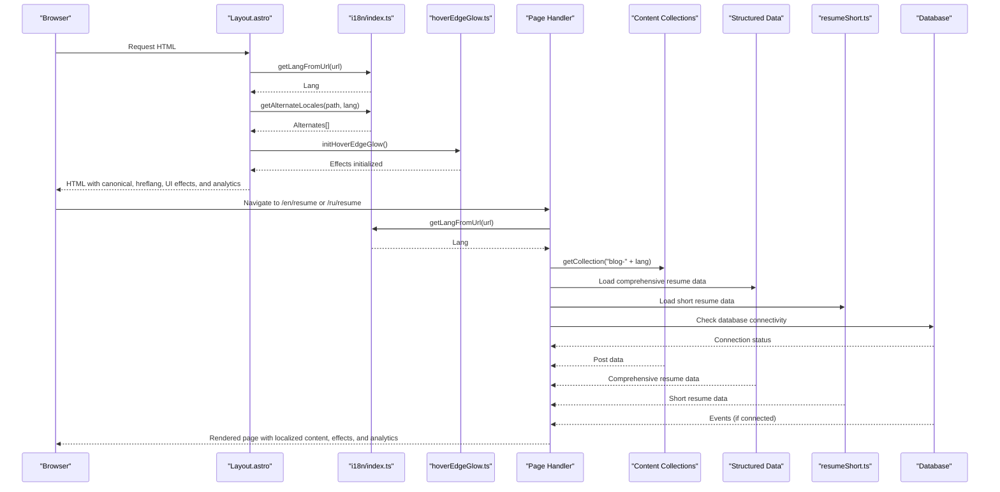

**Diagram sources**
- [src/layouts/Layout.astro](file://src/layouts/Layout.astro#L21-L43)
- [src/i18n/index.ts](file://src/i18n/index.ts#L253-L283)
- [src/lib/ui/hoverEdgeGlow.ts](file://src/lib/ui/hoverEdgeGlow.ts#L1-L103)
- [src/pages/en/blog/[slug].astro](file://src/pages/en/blog/[slug].astro#L6-L20)
- [src/pages/ru/blog/[slug].astro](file://src/pages/ru/blog/[slug].astro#L6-L20)
- [src/content/config.ts](file://src/content/config.ts#L15-L18)
- [src/pages/en/index.astro](file://src/pages/en/index.astro#L35-L52)
- [src/db/index.ts](file://src/db/index.ts#L27-L34)

## Detailed Component Analysis

### Internationalization Core
The internationalization module centralizes:
- Supported languages and default language with comprehensive translation key registry for both languages
- Locale detection from URL with fallback to default language
- Translation function with fallback to default language and key itself
- Helpers for localized paths and alternate locales with proper URL construction

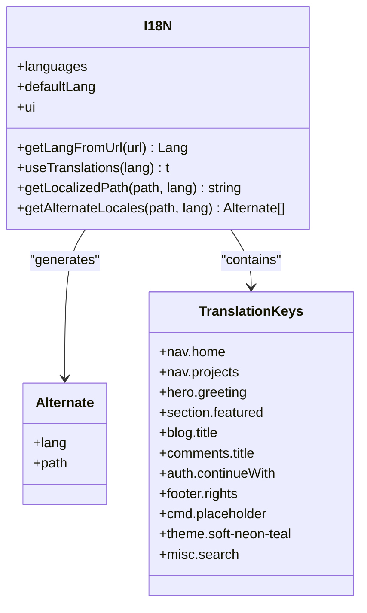

**Diagram sources**
- [src/i18n/index.ts](file://src/i18n/index.ts#L1-L283)

**Section sources**
- [src/i18n/index.ts](file://src/i18n/index.ts#L1-L283)

### URL Routing Strategy and Locale Detection
- Astro configuration enables i18n routing with language prefixes and locale-specific configurations
- Pages detect the language from the URL path segment and redirect to localized paths when needed
- The layout generates canonical and hreflang links for alternate locales with proper locale codes
- Language cookie is set for persistence across sessions

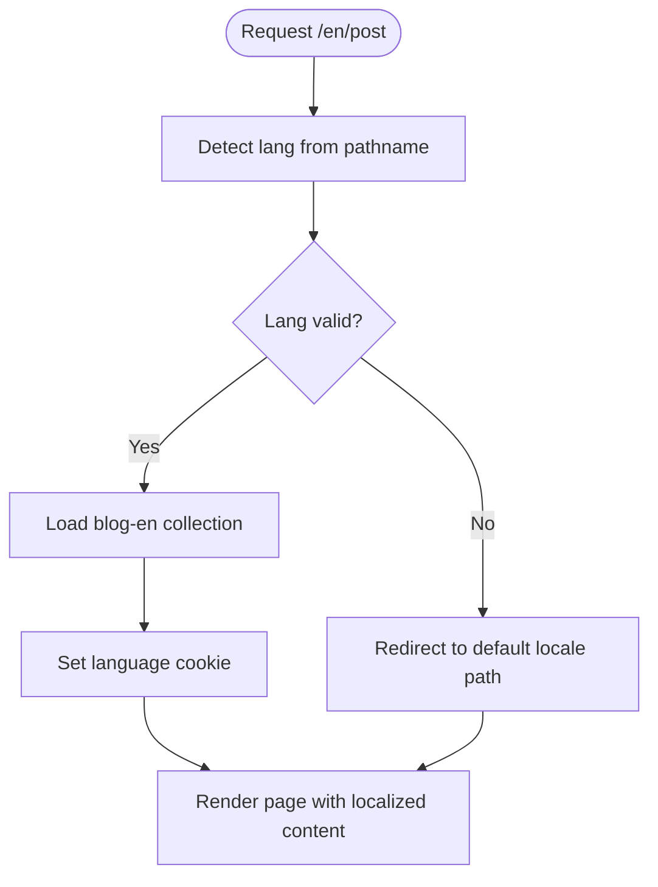

**Diagram sources**
- [astro.config.ts](file://astro.config.ts#L30-L36)
- [src/pages/en/blog/[slug].astro](file://src/pages/en/blog/[slug].astro#L6-L20)
- [src/pages/ru/blog/[slug].astro](file://src/pages/ru/blog/[slug].astro#L6-L20)
- [src/layouts/Layout.astro](file://src/layouts/Layout.astro#L21-L43)

**Section sources**
- [astro.config.ts](file://astro.config.ts#L30-L36)
- [src/pages/en/blog/[slug].astro](file://src/pages/en/blog/[slug].astro#L6-L20)
- [src/pages/ru/blog/[slug].astro](file://src/pages/ru/blog/[slug].astro#L6-L20)
- [src/layouts/Layout.astro](file://src/layouts/Layout.astro#L21-L43)

### Content Organization Patterns
- Content collections are defined per language: blog-ru and blog-en with unified schema validation
- Each MDX file contains frontmatter with title, description, date, tags, draft, and optional hero image
- Pages fetch content from the language-specific collection and render MDX content with proper localization
- Date formatting adapts to language-specific locale settings

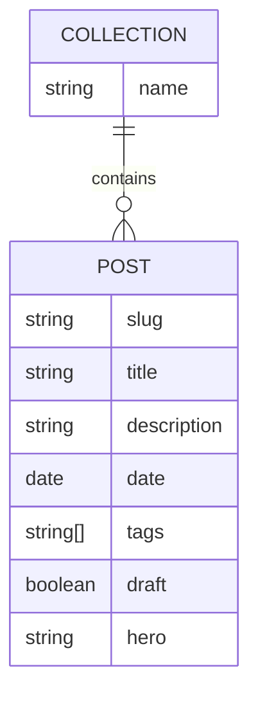

**Diagram sources**
- [src/content/config.ts](file://src/content/config.ts#L1-L19)
- [src/content/blog-ru/welcome.mdx](file://src/content/blog-ru/welcome.mdx#L1-L38)
- [src/content/blog-en/welcome.mdx](file://src/content/blog-en/welcome.mdx#L1-L38)

**Section sources**
- [src/content/config.ts](file://src/content/config.ts#L1-L19)
- [src/content/blog-ru/welcome.mdx](file://src/content/blog-ru/welcome.mdx#L1-L38)
- [src/content/blog-en/welcome.mdx](file://src/content/blog-en/welcome.mdx#L1-L38)

### Translation Key System
- Translation keys are organized by functional areas (navigation, hero, sections, blog, projects, changelog, comments, auth, footer, command palette, themes, misc)
- The translation function falls back to the default language if a key is missing
- Keys are used consistently across components and pages with proper type safety
- Bilingual content is supported through structured data interfaces

**Section sources**
- [src/i18n/index.ts](file://src/i18n/index.ts#L10-L248)
- [src/components/Header.astro](file://src/components/Header.astro#L10-L16)
- [src/components/Footer.astro](file://src/components/Footer.astro#L8-L13)

### Alternate Language Linking and SEO
- The layout computes alternate locales for hreflang with proper locale codes (ru-RU, en-US)
- The language switch component displays available languages and generates alternate paths
- Astro's sitemap integration is configured with default locale and locale-specific configurations
- Canonical URLs are generated with proper site base URL

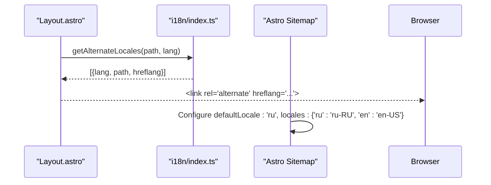

**Diagram sources**
- [src/layouts/Layout.astro](file://src/layouts/Layout.astro#L21-L43)
- [src/i18n/index.ts](file://src/i18n/index.ts#L274-L283)
- [astro.config.ts](file://astro.config.ts#L20-L29)

**Section sources**
- [src/layouts/Layout.astro](file://src/layouts/Layout.astro#L21-L43)
- [src/components/LanguageSwitch.astro](file://src/components/LanguageSwitch.astro#L24-L41)
- [astro.config.ts](file://astro.config.ts#L20-L29)

### MDX Blog Post Rendering
- Pages load the language-specific blog collection and render the selected post
- Dates are formatted according to the detected language with proper locale settings
- Back links and tag filtering use localized paths with language-aware navigation
- Hover edge glow effects are applied to interactive elements for enhanced UX

**Section sources**
- [src/pages/en/blog/[slug].astro](file://src/pages/en/blog/[slug].astro#L15-L30)
- [src/pages/ru/blog/[slug].astro](file://src/pages/ru/blog/[slug].astro#L15-L30)

### Navigation and Language Switch Component
- Navigation items are localized using translation keys with comprehensive coverage
- The language switch component shows available languages and alternate paths with dropdown UI
- Localized paths are generated for all navigation items with proper URL construction
- Enhanced mobile responsiveness and accessibility features

**Section sources**
- [src/components/Header.astro](file://src/components/Header.astro#L10-L16)
- [src/components/Header.astro](file://src/components/Header.astro#L30-L46)
- [src/components/LanguageSwitch.astro](file://src/components/LanguageSwitch.astro#L24-L41)

## Enhanced UI Effects System

### Hover Edge Glow Animation
The system implements sophisticated hover edge glow animations that respond to mouse movement with dynamic edge detection and gradient effects.

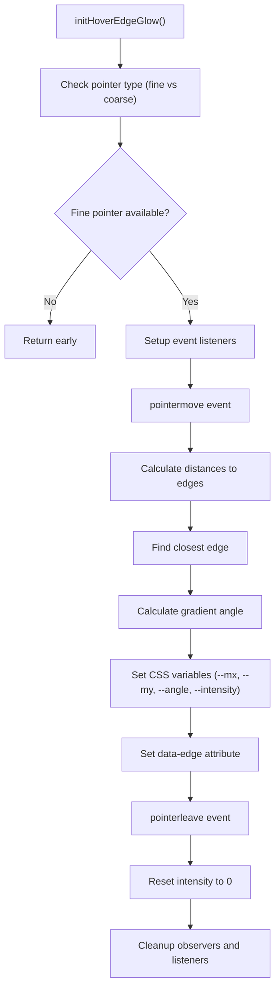

**Diagram sources**
- [src/lib/ui/hoverEdgeGlow.ts](file://src/lib/ui/hoverEdgeGlow.ts#L1-L103)
- [src/styles/hover-edge-glow.css](file://src/styles/hover-edge-glow.css#L1-L65)

**Section sources**
- [src/lib/ui/hoverEdgeGlow.ts](file://src/lib/ui/hoverEdgeGlow.ts#L1-L103)
- [src/styles/hover-edge-glow.css](file://src/styles/hover-edge-glow.css#L1-L65)

### CSS-Based Edge Glow Effects
The CSS implementation creates sophisticated conic gradient effects that respond to pointer position with smooth transitions and edge-specific clipping.

**Section sources**
- [src/styles/hover-edge-glow.css](file://src/styles/hover-edge-glow.css#L1-L65)

## Structured Data Integration

### Comprehensive Resume Data Structure
The comprehensive resume uses structured data from `src/data/resume.ts` which provides a strongly-typed interface for detailed resume sections with comprehensive bilingual support. Each section contains bilingual content with support for both simple content blocks and complex item lists with achievements. The new system includes Professional Profile, Key Specialization, Technical Stack, Work Experience, and Pet Projects sections.

```mermaid
classDiagram
class ResumeSection {
+id : string
+title : {ru : string, en : string}
+content? : {ru : string, en : string}
+chips? : string[]
+items? : Array<Item>
}
class Item {
+title : {ru : string, en : string}
+company? : {ru : string, en : string}
+link? : string
+period? : string
+description? : {ru : string, en : string}
+achievements? : Array<{ru : string, en : string}>
}
class ResumeHeader {
+name : {ru : string, en : string}
+title : string
+experience : {ru : string, en : string}
+workFormat : string
+location : {ru : string, en : string}
+googleDocUrl : string
}
ResumeSection --> Item : "contains"
```

**Diagram sources**
- [src/data/resume.ts](file://src/data/resume.ts#L1-L217)

**Section sources**
- [src/pages/en/resume.astro](file://src/pages/en/resume.astro#L1-L160)
- [src/pages/ru/resume.astro](file://src/pages/ru/resume.astro#L1-L160)
- [src/data/resume.ts](file://src/data/resume.ts#L1-L217)

### Short Resume Data Structure
**Updated** The short resume uses structured data from `src/data/resumeShort.ts` which provides a compact, terminal-style presentation format with comprehensive bilingual support. This interface includes key specialization areas, stack details, experience highlights, and pet projects in a more condensed format suitable for quick access and integration with the ResumeNowBlock component. The new system features enhanced terminal-style presentation with badges, chips, and collapsible details.

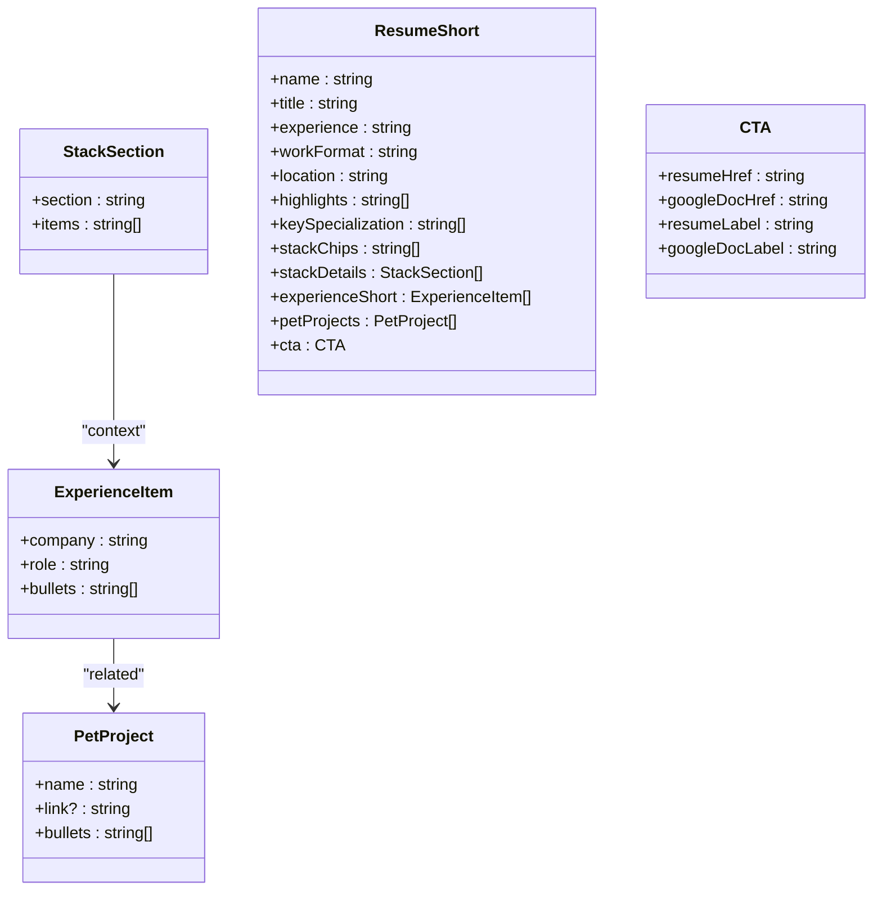

**Diagram sources**
- [src/data/resumeShort.ts](file://src/data/resumeShort.ts#L1-L177)

**Section sources**
- [src/pages/en/now.astro](file://src/pages/en/now.astro#L1-L59)
- [src/pages/ru/now.astro](file://src/pages/ru/now.astro#L1-L61)
- [src/data/resumeShort.ts](file://src/data/resumeShort.ts#L1-L177)

### Now Page Data Structure
The now page uses structured data from `src/data/now.ts` which provides a similar interface for current activities and ongoing projects with bilingual content support. The data includes last updated timestamps for proper content freshness indication.

```mermaid
classDiagram
class NowSection {
+id : string
+title : {ru : string, en : string}
+content : {ru : string, en : string}
+items? : Array<NowItem>
}
class NowItem {
+title : {ru : string, en : string}
+description? : {ru : string, en : string}
+link? : string
}
NowSection --> NowItem : "contains"
```

**Diagram sources**
- [src/data/now.ts](file://src/data/now.ts#L1-L71)

**Section sources**
- [src/pages/en/now.astro](file://src/pages/en/now.astro#L1-L59)
- [src/pages/ru/now.astro](file://src/pages/ru/now.astro#L1-L61)
- [src/data/now.ts](file://src/data/now.ts#L1-L71)

### ResumeNowBlock Component Integration
**Updated** The ResumeNowBlock component integrates short resume data with terminal-style presentation format, providing a compact yet comprehensive view of professional information. The component features:
- Terminal-style header with command prompt simulation
- Compact badge-based information display (experience, location, work format)
- Key specialization chips for quick skill overview
- Highlighted achievements in bullet format
- Stack chips for technology overview
- Call-to-action buttons for full resume and Google Docs
- Collapsible details section with full stack details, experience, and pet projects

**Section sources**
- [src/components/ResumeNowBlock.astro](file://src/components/ResumeNowBlock.astro#L1-L199)
- [src/pages/en/now.astro](file://src/pages/en/now.astro#L18)
- [src/pages/ru/now.astro](file://src/pages/ru/now.astro#L18)

### TerminalHero Component
**Updated** The TerminalHero component provides dynamic terminal-style content display with language-specific prompts and animations. Features include:
- Language-aware content with Russian and English variants
- Sequential animation with staggered fade-in effects
- Terminal-style styling with prompt indicators and cursor animation
- Responsive design that works across different screen sizes
- Dynamic content generation based on language context

**Section sources**
- [src/components/TerminalHero.astro](file://src/components/TerminalHero.astro#L1-L74)

## Database Connectivity System

### Database Connection Management
The system implements robust database connectivity checks with proper fallback messaging and comprehensive error handling. The database initialization handles connection failures gracefully and provides utility functions for safe database operations.

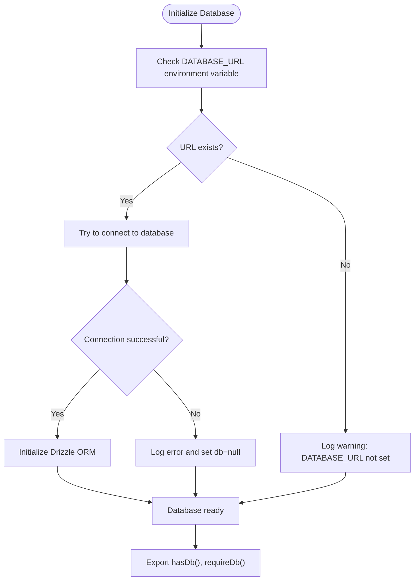

**Diagram sources**
- [src/db/index.ts](file://src/db/index.ts#L1-L37)

**Section sources**
- [src/db/index.ts](file://src/db/index.ts#L1-L37)

### Database Schema Overview
The database schema includes tables for users, OAuth accounts, sessions, comments, reactions, comment flags, and events (changelog) with proper foreign key relationships. The events table specifically supports the recent events display on the index page with timestamp-based ordering.

**Section sources**
- [src/db/schema/index.ts](file://src/db/schema/index.ts#L1-L104)

## Event Management System

### Recent Events Integration
The index page now displays recent events alongside blog posts, providing users with real-time activity updates. The system includes proper database connectivity checks, fallback messaging, and enhanced UI effects for interactive elements.

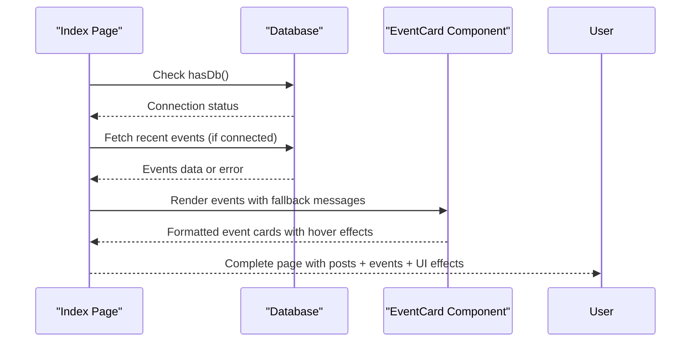

**Diagram sources**
- [src/pages/en/index.astro](file://src/pages/en/index.astro#L35-L52)
- [src/db/index.ts](file://src/db/index.ts#L27-L34)
- [src/components/EventCard.astro](file://src/components/EventCard.astro#L1-L77)

**Section sources**
- [src/pages/en/index.astro](file://src/pages/en/index.astro#L35-L52)
- [src/pages/ru/index.astro](file://src/pages/ru/index.astro#L37-L54)
- [src/components/EventCard.astro](file://src/components/EventCard.astro#L1-L77)

### Event Card Component
The EventCard component renders individual events with proper localization, icons, and formatting. It supports various event kinds with appropriate emojis and labels, and integrates with the hover edge glow system for enhanced interactivity.

**Section sources**
- [src/components/EventCard.astro](file://src/components/EventCard.astro#L1-L77)

## Analytics Integration

### Yandex.Metrika Analytics
**Updated** The system now includes comprehensive Yandex.Metrika analytics integration for web analytics and user behavior tracking. The analytics implementation provides:
- Real-time visitor tracking with SSR support
- Webvisor for visual visitor session recording
- Clickmap for interaction heatmaps
- E-commerce tracking through dataLayer
- Accurate bounce tracking and link tracking
- Referrer and URL tracking for comprehensive analytics

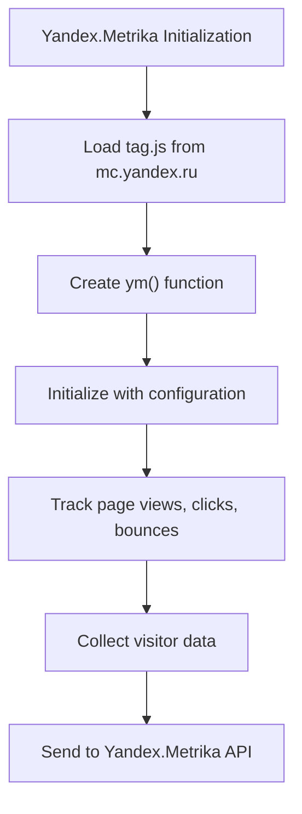

**Diagram sources**
- [src/layouts/Layout.astro](file://src/layouts/Layout.astro#L70-L82)

**Section sources**
- [src/layouts/Layout.astro](file://src/layouts/Layout.astro#L70-L82)

## Dependency Analysis
The system exhibits clear separation of concerns with enhanced data integration and UI effects:
- Internationalization module is consumed by pages, layout, and components with comprehensive translation coverage
- Content collections are independent per language and accessed by language-specific pages
- Structured data sources provide typed data for specialized pages with bilingual interfaces
- Database integration adds real-time capabilities with proper error handling and fallback messaging
- Enhanced UI effects system provides interactive elements with hover edge glow animations
- Astro configuration coordinates routing, sitemap generation, and locale-specific settings
- **Updated** ResumeNowBlock component integrates short resume data with terminal-style presentation
- **Updated** TerminalHero component provides dynamic terminal-style content display
- **Updated** Yandex.Metrika analytics provides comprehensive web analytics and user behavior tracking

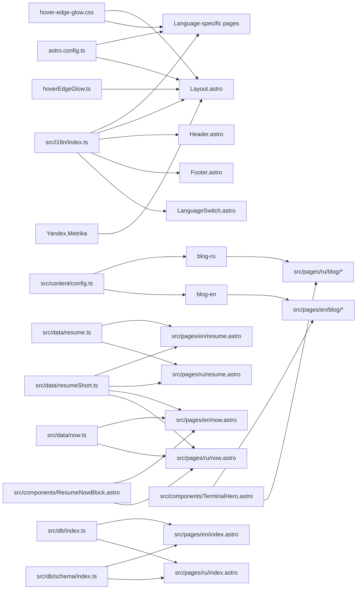

**Diagram sources**
- [src/i18n/index.ts](file://src/i18n/index.ts#L1-L283)
- [src/content/config.ts](file://src/content/config.ts#L1-L19)
- [astro.config.ts](file://astro.config.ts#L1-L38)
- [src/pages/en/blog/[slug].astro](file://src/pages/en/blog/[slug].astro#L1-L171)
- [src/pages/ru/blog/[slug].astro](file://src/pages/ru/blog/[slug].astro#L1-L171)
- [src/layouts/Layout.astro](file://src/layouts/Layout.astro#L1-L114)
- [src/data/resume.ts](file://src/data/resume.ts#L1-L217)
- [src/data/resumeShort.ts](file://src/data/resumeShort.ts#L1-L177)
- [src/data/now.ts](file://src/data/now.ts#L1-L71)
- [src/db/index.ts](file://src/db/index.ts#L1-L37)
- [src/db/schema/index.ts](file://src/db/schema/index.ts#L1-L104)
- [src/styles/hover-edge-glow.css](file://src/styles/hover-edge-glow.css#L1-L65)
- [src/lib/ui/hoverEdgeGlow.ts](file://src/lib/ui/hoverEdgeGlow.ts#L1-L103)
- [src/components/ResumeNowBlock.astro](file://src/components/ResumeNowBlock.astro#L1-L199)
- [src/components/TerminalHero.astro](file://src/components/TerminalHero.astro#L1-L74)

**Section sources**
- [src/i18n/index.ts](file://src/i18n/index.ts#L1-L283)
- [src/content/config.ts](file://src/content/config.ts#L1-L19)
- [astro.config.ts](file://astro.config.ts#L1-L38)

## Performance Considerations
- Keep translation keys minimal and grouped by functional areas to reduce maintenance overhead and improve lookup performance
- Use Astro's content collections efficiently by filtering by slug, tags, and draft status
- Avoid unnecessary re-renders by caching localized paths and alternate locales where appropriate
- Ensure sitemap generation is configured to avoid duplicate content issues with proper locale settings
- Implement proper database connection pooling and handle connection failures gracefully with fallback messaging
- Cache structured data appropriately to avoid repeated file reads and improve page load times
- Use lazy loading for database-dependent content when connections are unavailable
- Optimize hover edge glow animations by throttling pointer events and using requestAnimationFrame
- Leverage CSS custom properties for efficient animation performance across different devices
- **Updated** Consider data serialization strategies for resumeShort data to optimize rendering performance
- **Updated** Implement conditional loading for ResumeNowBlock component to reduce initial page weight
- **Updated** Optimize Yandex.Metrika script loading with proper async handling and SSR support

## Troubleshooting Guide
Common issues and resolutions:
- Missing translations: The translation function falls back to the default language and then to the key itself. Add missing keys to both language dictionaries to avoid displaying raw keys.
- Incorrect language detection: Verify that the URL path starts with a valid language prefix and that the default language is set correctly in Astro configuration.
- Broken alternate links: Ensure that localized paths are generated consistently and that alternate locales are computed from the clean path without language prefixes.
- SEO problems: Confirm that canonical URLs and hreflang attributes are generated with proper locale codes (ru-RU, en-US) and that Astro's sitemap configuration includes the correct locales.
- Database connectivity issues: Check that DATABASE_URL environment variable is properly configured. The system provides fallback messaging for database unavailability with proper error logging.
- Structured data errors: Verify that data files export the correct TypeScript interfaces and that all required fields are provided with proper bilingual content.
- Event display problems: Ensure that the events table exists in the database and that the connection string is valid. Check database permissions and migration status.
- UI effects not working: Verify that hover edge glow CSS is properly imported and that the initialization script runs after DOMContentLoaded.
- Hover animation performance: Check pointer device detection and ensure that coarse pointer devices (touch screens) are handled appropriately to avoid unnecessary processing.
- **Updated** ResumeNowBlock rendering issues: Verify that resumeShort data is properly imported and that the component receives the correct data structure.
- **Updated** TerminalHero content problems: Check that language-specific content arrays are properly defined and that the component renders the correct variant based on language context.
- **Updated** Short resume data inconsistencies: Ensure that both resumeShortRu and resumeShortEn exports contain all required fields and maintain consistent structure.
- **Updated** Analytics integration issues: Verify that Yandex.Metrika script loads correctly and that the counter ID is properly configured. Check browser console for script loading errors.

**Section sources**
- [src/i18n/index.ts](file://src/i18n/index.ts#L262-L266)
- [src/layouts/Layout.astro](file://src/layouts/Layout.astro#L40-L43)
- [astro.config.ts](file://astro.config.ts#L20-L29)
- [src/db/index.ts](file://src/db/index.ts#L21-L23)
- [src/lib/ui/hoverEdgeGlow.ts](file://src/lib/ui/hoverEdgeGlow.ts#L4-L6)
- [src/components/ResumeNowBlock.astro](file://src/components/ResumeNowBlock.astro#L1-L199)
- [src/components/TerminalHero.astro](file://src/components/TerminalHero.astro#L1-L74)
- [src/data/resumeShort.ts](file://src/data/resumeShort.ts#L1-L177)
- [src/layouts/Layout.astro](file://src/layouts/Layout.astro#L70-L82)

## Conclusion
The multilingual content management system combines Astro's i18n routing with a comprehensive custom translation layer to deliver a seamless experience across Russian and English. The system has been completely redesigned with enhanced data structures supporting bilingual content simultaneously, integrated structured data from external sources, database connectivity with proper fallback messaging, and a comprehensive event management system. The enhanced UI effects system provides sophisticated hover edge glow animations that respond to user interaction with dynamic edge detection and gradient effects.

**Updated** The system now features a comprehensive resume system with dual presentation formats: detailed full resumes for comprehensive professional information and short resumes with terminal-style presentation for quick access to key information. The new system includes integrated Yandex.Metrika analytics for comprehensive web analytics and user behavior tracking, along with enhanced UI components like ResumeNowBlock and TerminalHero for modern presentation. The ResumeNowBlock component seamlessly integrates short resume data into the now page, providing users with immediate access to professional highlights while maintaining the option to explore full details through dedicated resume pages.

By organizing content per language, integrating structured data for specialized pages, managing database connections robustly, generating SEO-compliant alternate links with proper locale codes, providing a comprehensive translation key system, implementing advanced UI effects, supporting both comprehensive and short-form resume presentations, and leveraging integrated analytics for performance monitoring, the platform ensures scalability, maintainability, rich user experiences, and optimal performance. Following the best practices outlined here will help you add new languages, implement translated content, integrate structured data sources, manage database connectivity, handle UI effects, maintain translations consistently across the site, leverage the new short resume format for enhanced user experience, and utilize analytics for continuous improvement.