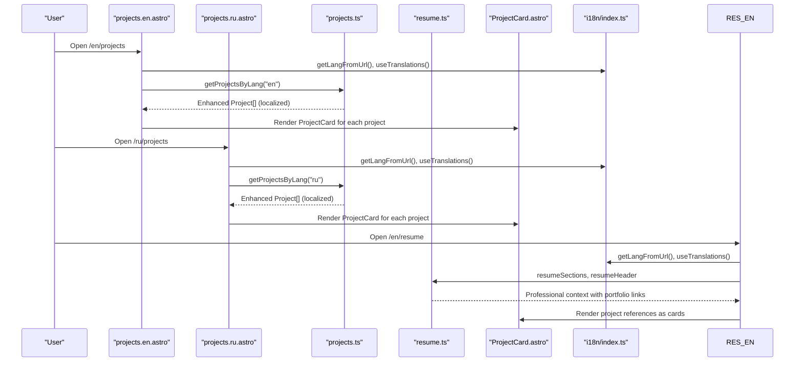
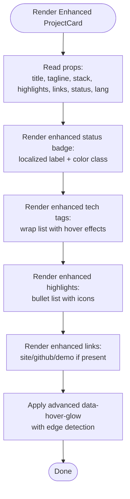
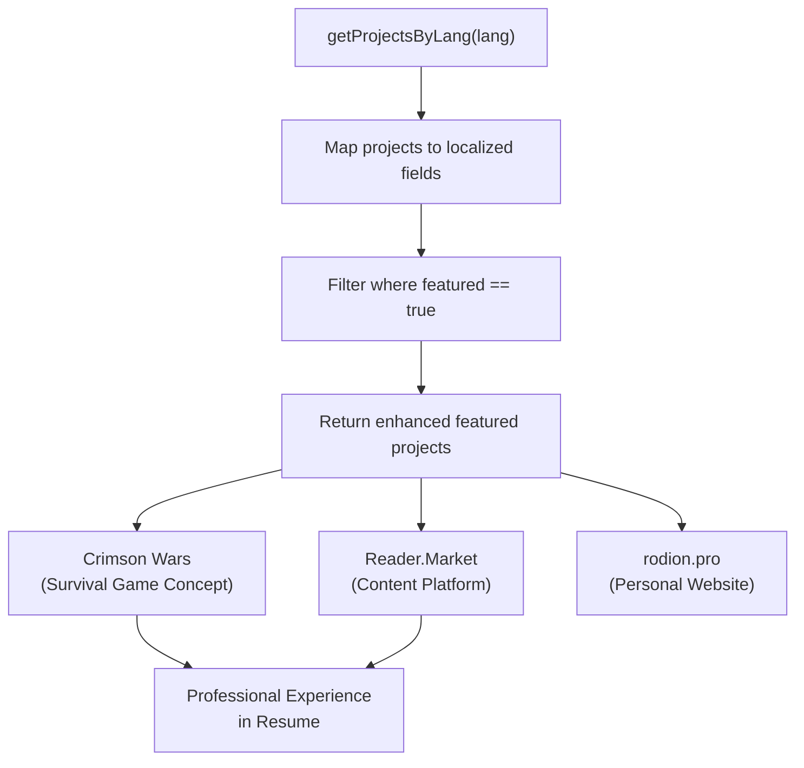
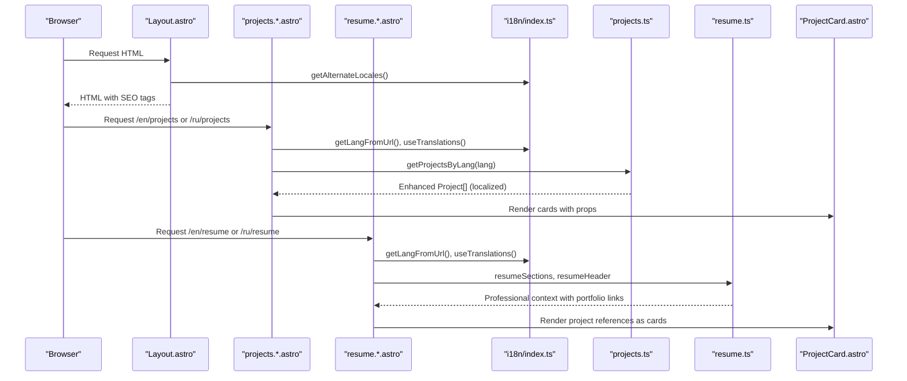
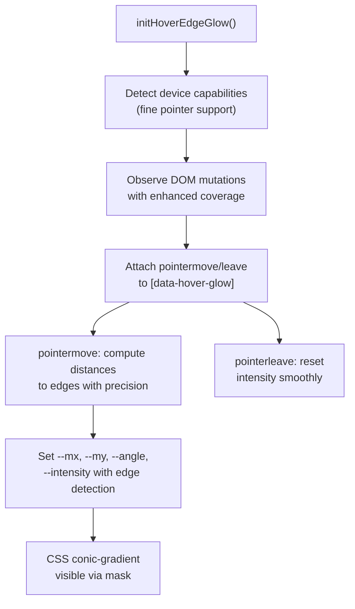
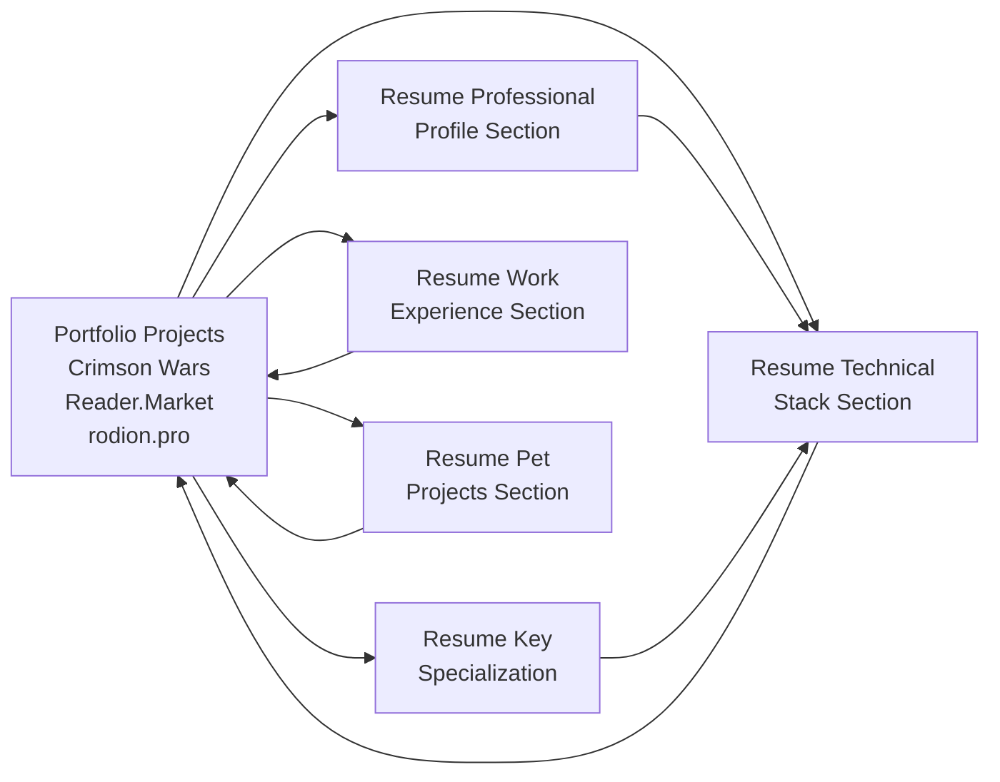
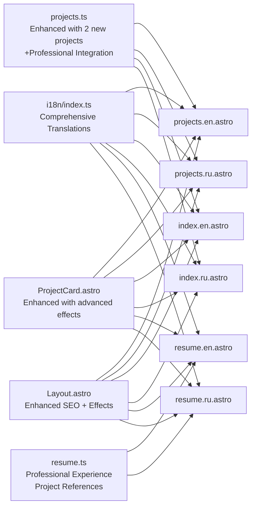

# Portfolio Project Showcase

<cite>
**Referenced Files in This Document**
- [projects.ts](file://src/data/projects.ts)
- [ProjectCard.astro](file://src/components/ProjectCard.astro)
- [projects.en.astro](file://src/pages/en/projects.astro)
- [projects.ru.astro](file://src/pages/ru/projects.astro)
- [index.en.astro](file://src/pages/en/index.astro)
- [index.ru.astro](file://src/pages/ru/index.astro)
- [resume.en.astro](file://src/pages/en/resume.astro)
- [resume.ru.astro](file://src/pages/ru/resume.astro)
- [resume.ts](file://src/data/resume.ts)
- [i18n.index.ts](file://src/i18n/index.ts)
- [Layout.astro](file://src/layouts/Layout.astro)
- [hoverEdgeGlow.ts](file://src/lib/ui/hoverEdgeGlow.ts)
- [hover-edge-glow.css](file://src/styles/hover-edge-glow.css)
</cite>

## Update Summary
**Changes Made**
- Added two new projects: Crimson Wars (survival game concept with soft cyberpunk aesthetics) and Reader.Market (content reading and publishing platform)
- Enhanced project showcase capabilities with new entries demonstrating both modern static site generation approaches and traditional server-rendered applications
- Updated project data structure with comprehensive localization and enhanced technology stacks
- Expanded featured project selection to include the new entries
- Enhanced resume integration to reference Reader.Market as a professional achievement

## Table of Contents
1. [Introduction](#introduction)
2. [Project Structure](#project-structure)
3. [Core Components](#core-components)
4. [Architecture Overview](#architecture-overview)
5. [Detailed Component Analysis](#detailed-component-analysis)
6. [Integration with Resume System](#integration-with-resume-system)
7. [Dependency Analysis](#dependency-analysis)
8. [Performance Considerations](#performance-considerations)
9. [Troubleshooting Guide](#troubleshooting-guide)
10. [Conclusion](#conclusion)
11. [Appendices](#appendices)

## Introduction
This document explains the enhanced portfolio project showcase system used to present a curated set of projects with comprehensive multilingual support. The system has been significantly enhanced with new project entries (Crimson Wars and Reader.Market), expanded technology stacks, and deeper integration with the enhanced resume presentation system. The portfolio showcase now supports diverse project categories including web applications, content platforms, and experimental projects, while maintaining seamless integration with the professional resume presentation.

**Updated** Added two comprehensive projects with diverse technology stacks and feature sets, plus professional resume integration

## Project Structure
The enhanced project showcase is composed of:
- **Static project data** with comprehensive localized fields and metadata, now including Crimson Wars and Reader.Market with advanced technology stacks
- **Astro pages per locale** that fetch and render the project list with integrated resume references
- **Reusable project card component** that renders localized content, links, and enhanced visual effects
- **Enhanced internationalization utilities** with comprehensive translation keys for both projects and resume contexts
- **Integrated resume system** that references portfolio projects in professional experience sections
- **Advanced visual enhancements** via hover edge glow effects and responsive design patterns

```mermaid
graph TB
subgraph "Enhanced Data Layer"
P["projects.ts<br/>Enhanced Project[] + helpers<br/>+2 New Projects<br/>Expanded Tech Stacks"]
R["resume.ts<br/>Professional Experience<br/>Portfolio Integration"]
end
subgraph "Enhanced UI Layer"
PC["ProjectCard.astro<br/>Enhanced Card Component"]
IDX_EN["index.en.astro<br/>Featured + Resume Integration"]
IDX_RU["index.ru.astro<br/>Featured + Resume Integration"]
PRJ_EN["projects.en.astro<br/>Full List + Resume References"]
PRJ_RU["projects.ru.astro<br/>Full List + Resume References"]
RES_EN["resume.en.astro<br/>Professional Context"]
RES_RU["resume.ru.astro<br/>Professional Context"]
end
subgraph "Enhanced I18N"
I18N["i18n/index.ts<br/>Comprehensive Translations<br/>+Project & Resume Keys"]
END
subgraph "Enhanced Layout"
LYT["Layout.astro<br/>SEO + GA + Effects"]
END
subgraph "Enhanced Effects"
HEG["hoverEdgeGlow.ts<br/>Advanced Pointer Tracking"]
HEC["hover-edge-glow.css<br/>Enhanced Conic Gradients"]
END
P --> PRJ_EN
P --> PRJ_RU
P --> IDX_EN
P --> IDX_RU
R --> RES_EN
R --> RES_RU
PRJ_EN --> PC
PRJ_RU --> PC
IDX_EN --> PC
IDX_RU --> PC
RES_EN --> PC
RES_RU --> PC
I18N --> PRJ_EN
I18N --> PRJ_RU
I18N --> IDX_EN
I18N --> IDX_RU
I18N --> RES_EN
I18N --> RES_RU
LYT --> PRJ_EN
LYT --> PRJ_RU
LYT --> IDX_EN
LYT --> IDX_RU
LYT --> RES_EN
LYT --> RES_RU
HEG --> PC
HEC --> PC
```

**Diagram sources**
- [projects.ts:1-184](file://src/data/projects.ts#L1-L184)
- [resume.ts:1-217](file://src/data/resume.ts#L1-L217)
- [ProjectCard.astro:1-132](file://src/components/ProjectCard.astro#L1-L132)
- [projects.en.astro:1-24](file://src/pages/en/projects.astro#L1-L24)
- [projects.ru.astro:1-24](file://src/pages/ru/projects.astro#L1-L24)
- [index.en.astro:1-152](file://src/pages/en/index.astro#L1-L152)
- [index.ru.astro:1-156](file://src/pages/ru/index.astro#L1-L156)
- [resume.en.astro:1-160](file://src/pages/en/resume.astro#L1-L160)
- [resume.ru.astro:1-160](file://src/pages/ru/resume.astro#L1-L160)
- [i18n.index.ts:1-283](file://src/i18n/index.ts#L1-L283)
- [Layout.astro:1-114](file://src/layouts/Layout.astro#L1-L114)
- [hoverEdgeGlow.ts:1-103](file://src/lib/ui/hoverEdgeGlow.ts#L1-L103)
- [hover-edge-glow.css:1-65](file://src/styles/hover-edge-glow.css#L1-L65)

**Section sources**
- [projects.ts:1-184](file://src/data/projects.ts#L1-L184)
- [resume.ts:1-217](file://src/data/resume.ts#L1-L217)
- [ProjectCard.astro:1-132](file://src/components/ProjectCard.astro#L1-L132)
- [projects.en.astro:1-24](file://src/pages/en/projects.astro#L1-L24)
- [projects.ru.astro:1-24](file://src/pages/ru/projects.astro#L1-L24)
- [index.en.astro:1-152](file://src/pages/en/index.astro#L1-L152)
- [index.ru.astro:1-156](file://src/pages/ru/index.astro#L1-L156)
- [resume.en.astro:1-160](file://src/pages/en/resume.astro#L1-L160)
- [resume.ru.astro:1-160](file://src/pages/ru/resume.astro#L1-L160)
- [i18n.index.ts:1-283](file://src/i18n/index.ts#L1-L283)
- [Layout.astro:1-114](file://src/layouts/Layout.astro#L1-L114)
- [hoverEdgeGlow.ts:1-103](file://src/lib/ui/hoverEdgeGlow.ts#L1-L103)
- [hover-edge-glow.css:1-65](file://src/styles/hover-edge-glow.css#L1-L65)

## Core Components
- **Enhanced Project data model and helpers**:
  - Status types: active, paused, archived
  - Fields: id, title (localized), tagline (localized), status, links (site/github/demo), stack (technologies), highlights (localized), featured flag
  - Helper functions: getProjectsByLang(lang), getFeaturedProjects(lang)
  - **Updated**: Now includes Crimson Wars (Astro, React, TypeScript, Tailwind, PostgreSQL, Drizzle) and Reader.Market (TypeScript, Node.js, React, PostgreSQL, Docker) with comprehensive feature sets
- **Enhanced Project card component**:
  - Renders title, tagline, status badge, tech stack tags, highlights list, and optional links
  - Localized labels for status and link texts
  - Advanced hover glow effect via data-hover-glow and CSS with edge detection
- **Enhanced Astro pages**:
  - Locale-aware pages for projects listing and featured projects on the home page
  - Integrated resume references showing professional context
  - Use translations and helpers to localize content and construct URLs
- **Enhanced Internationalization**:
  - Comprehensive language detection from URL
  - Translation keys for project-related labels, status messages, and resume integration
  - Alternate locales for SEO with enhanced project references

**Section sources**
- [projects.ts:1-184](file://src/data/projects.ts#L1-L184)
- [resume.ts:1-217](file://src/data/resume.ts#L1-L217)
- [ProjectCard.astro:1-132](file://src/components/ProjectCard.astro#L1-L132)
- [projects.en.astro:1-24](file://src/pages/en/projects.astro#L1-L24)
- [projects.ru.astro:1-24](file://src/pages/ru/projects.astro#L1-L24)
- [index.en.astro:1-152](file://src/pages/en/index.astro#L1-L152)
- [index.ru.astro:1-156](file://src/pages/ru/index.astro#L1-L156)
- [resume.en.astro:1-160](file://src/pages/en/resume.astro#L1-L160)
- [resume.ru.astro:1-160](file://src/pages/ru/resume.astro#L1-L160)
- [i18n.index.ts:1-283](file://src/i18n/index.ts#L1-L283)

## Architecture Overview
The enhanced system maintains clear separation of concerns with deeper integration:
- **Enhanced Data**: Static TypeScript modules define project models, helper functions, and resume integration, now with expanded portfolio and professional context
- **Enhanced Presentation**: Astro pages select localized data, render lists, and integrate with resume sections
- **Enhanced Componentization**: A single ProjectCard.astro component encapsulates rendering, styling, and advanced visual effects
- **Enhanced Localization**: i18n utilities supply comprehensive translations for both project showcases and professional contexts
- **Enhanced Effects**: Advanced JavaScript library initializes sophisticated hover glow effects with edge detection



**Diagram sources**
- [projects.en.astro:1-24](file://src/pages/en/projects.astro#L1-L24)
- [projects.ru.astro:1-24](file://src/pages/ru/projects.astro#L1-L24)
- [projects.ts:172-184](file://src/data/projects.ts#L172-L184)
- [resume.ts:1-217](file://src/data/resume.ts#L1-L217)
- [ProjectCard.astro:1-132](file://src/components/ProjectCard.astro#L1-L132)
- [i18n.index.ts:253-266](file://src/i18n/index.ts#L253-L266)
- [resume.en.astro:1-160](file://src/pages/en/resume.astro#L1-L160)

## Detailed Component Analysis

### Enhanced Project Data Model
The project data structure now supports an expanded portfolio with:
- **Multilingual fields**: title, tagline, highlights for Russian and English
- **Status**: active, paused, archived
- **Links**: website, GitHub, demo
- **Technologies**: expanded stack including PostgreSQL, Docker, Redis, and advanced frameworks
- **Featured flag**: highlighting for prominent display
- **Enhanced projects**: Crimson Wars (survival game concept) and Reader.Market (content platform) with comprehensive feature sets
- **Professional integration**: Resume system references these projects in experience sections
- Helper functions to derive localized arrays and featured subsets

**Updated** Added two comprehensive projects with diverse technology stacks and feature sets, plus professional resume integration

```mermaid
classDiagram
class Project {
+string id
+map~ru,en~ title
+map~ru,en~ tagline
+ProjectStatus status
+Links links
+string[] stack
+map~ru,en~ highlights
+boolean featured?
}
class Links {
+string site?
+string github?
+string demo?
}
class ProjectStatus {
<<enum>>
"active"
"paused"
"archived"
}
class EnhancedProjects {
<<static>>
"crimson-wars" : "Survival game concept"
"reader-market" : "Content platform"
"cyka-lol" : "Blog/streaming"
}
class ResumeIntegration {
<<static>>
"reader-market" : "Professional experience"
"cyka-lol" : "Personal projects"
}
Project --> Links : "has"
Project --> ProjectStatus : "uses"
EnhancedProjects --> Project : "includes"
ResumeIntegration --> Project : "references"
```

**Diagram sources**
- [projects.ts:3-16](file://src/data/projects.ts#L3-L16)
- [projects.ts:18-170](file://src/data/projects.ts#L18-L170)
- [resume.ts:191-217](file://src/data/resume.ts#L191-L217)

**Section sources**
- [projects.ts:1-184](file://src/data/projects.ts#L1-L184)
- [resume.ts:1-217](file://src/data/resume.ts#L1-L217)

### Enhanced Project Card Component
The ProjectCard.astro component now features:
- Accepts localized props: title, tagline, stack, highlights, links, status, lang
- Renders a status badge with localized label and color-coded styling
- Displays a stack of technology tags with enhanced visual hierarchy
- Lists highlights as a bullet-point list with improved typography
- Provides optional links to site, GitHub, and demo with enhanced icons
- **Enhanced**: Advanced hover glow effect with edge detection and smooth animations
- **Enhanced**: Color-coded status badges with success/warn/muted variants



**Diagram sources**
- [ProjectCard.astro:1-132](file://src/components/ProjectCard.astro#L1-L132)

**Section sources**
- [ProjectCard.astro:1-132](file://src/components/ProjectCard.astro#L1-L132)

### Enhanced Featured Project Selection Logic
Featured projects are selected through:
- Getting the localized project list via getProjectsByLang(lang)
- Filtering items where featured is true
- **Updated**: Now includes Crimson Wars and Reader.Market in the featured showcase
- **Enhanced**: Professional context integration showing these projects in resume experience sections

**Updated** Enhanced featured project selection with expanded portfolio diversity and professional integration



**Diagram sources**
- [projects.ts:181-184](file://src/data/projects.ts#L181-L184)
- [resume.ts:191-217](file://src/data/resume.ts#L191-L217)

**Section sources**
- [projects.ts:181-184](file://src/data/projects.ts#L181-L184)
- [index.en.astro:75-79](file://src/pages/en/index.astro#L75-L79)
- [index.ru.astro:77-81](file://src/pages/ru/index.astro#L77-L81)
- [resume.ts:191-217](file://src/data/resume.ts#L191-L217)

### Enhanced Filtering and Sorting Capabilities
- Current implementation does not apply explicit filtering or sorting in the project listing pages; the displayed order reflects the order in the static projects array
- **Enhanced**: Resume system integrates project references with professional context
- **Enhanced**: Blog content sorting via getCollection with custom comparators
- **Future enhancement**: Filtering/sorting can be introduced in Astro pages by transforming the projects array before rendering

**Section sources**
- [projects.en.astro:17-21](file://src/pages/en/projects.astro#L17-L21)
- [projects.ru.astro:17-21](file://src/pages/ru/projects.astro#L17-L21)
- [index.en.astro:75-79](file://src/pages/en/index.astro#L75-L79)
- [resume.en.astro:1-160](file://src/pages/en/resume.astro#L1-L160)
- [resume.ru.astro:1-160](file://src/pages/ru/resume.astro#L1-L160)

### Enhanced Integration Between Static Project Data and Astro Pages
- **Enhanced Locale detection**: getLangFromUrl extracts the language segment from the URL
- **Enhanced Translations**: useTranslations(lang) provides localized strings for UI labels and professional context
- **Enhanced Data retrieval**: getProjectsByLang(lang) returns localized project arrays
- **Enhanced Rendering**: Astro pages iterate over projects and pass props to ProjectCard.astro
- **Enhanced SEO**: Layout.astro sets canonical and hreflang links with comprehensive metadata
- **Enhanced Professional Context**: Resume pages reference portfolio projects with professional descriptions



**Diagram sources**
- [Layout.astro:21-43](file://src/layouts/Layout.astro#L21-L43)
- [projects.en.astro:7-9](file://src/pages/en/projects.astro#L7-L9)
- [projects.ru.astro:7-9](file://src/pages/ru/projects.astro#L7-L9)
- [resume.en.astro:6-9](file://src/pages/en/resume.astro#L6-L9)
- [resume.ru.astro:6-9](file://src/pages/ru/resume.astro#L6-L9)
- [i18n.index.ts:253-266](file://src/i18n/index.ts#L253-L266)
- [projects.ts:172-184](file://src/data/projects.ts#L172-L184)
- [resume.ts:1-217](file://src/data/resume.ts#L1-L217)
- [ProjectCard.astro:1-132](file://src/components/ProjectCard.astro#L1-L132)

**Section sources**
- [Layout.astro:1-114](file://src/layouts/Layout.astro#L1-L114)
- [projects.en.astro:1-24](file://src/pages/en/projects.astro#L1-L24)
- [projects.ru.astro:1-24](file://src/pages/ru/projects.astro#L1-L24)
- [resume.en.astro:1-160](file://src/pages/en/resume.astro#L1-L160)
- [resume.ru.astro:1-160](file://src/pages/ru/resume.astro#L1-L160)
- [i18n.index.ts:1-283](file://src/i18n/index.ts#L1-L283)
- [projects.ts:172-184](file://src/data/projects.ts#L172-L184)
- [resume.ts:1-217](file://src/data/resume.ts#L1-L217)
- [ProjectCard.astro:1-132](file://src/components/ProjectCard.astro#L1-L132)

### Enhanced Responsive Design Considerations
- **Enhanced Grid layout**:
  - Projects listing page uses a grid with responsive columns (e.g., md:grid-cols-2)
  - Home page's featured section uses a wider grid (lg:grid-cols-3)
  - **Enhanced**: Professional resume sections use optimized layouts for content density
- **Enhanced Typography and spacing**:
  - Consistent use of text sizes and margins for readability across breakpoints
  - **Enhanced**: Professional context sections use specialized typography for experience items
- **Enhanced Cards**:
  - Cards wrap content responsively; stack and highlights adapt to smaller screens
  - **Enhanced**: Project cards maintain visual hierarchy while preserving professional context
- **Enhanced Hover glow**:
  - Effect is enabled via data-hover-glow and CSS with edge detection
  - **Enhanced**: Advanced pointer tracking with requestAnimationFrame throttling
  - Remains functional across screen sizes with optimized performance

**Section sources**
- [projects.en.astro:17-21](file://src/pages/en/projects.astro#L17-L21)
- [projects.ru.astro:17-21](file://src/pages/ru/projects.astro#L17-L21)
- [index.en.astro:75-79](file://src/pages/en/index.astro#L75-L79)
- [index.ru.astro:77-81](file://src/pages/ru/index.astro#L77-L81)
- [resume.en.astro:70-145](file://src/pages/en/resume.astro#L70-L145)
- [resume.ru.astro:70-145](file://src/pages/ru/resume.astro#L70-L145)
- [ProjectCard.astro:1-132](file://src/components/ProjectCard.astro#L1-L132)

### Enhanced Visual Effects: Advanced Hover Edge Glow
- **Enhanced Initialization**:
  - initHoverEdgeGlow attaches pointermove/leave handlers to elements with data-hover-glow
  - Uses requestAnimationFrame to throttle updates with optimized performance
  - Observes DOM mutations to support dynamic additions with enhanced coverage
  - **Enhanced**: Device capability detection for coarse vs fine pointer devices
- **Enhanced Styling**:
  - CSS conic-gradient creates a glowing border around the card with edge-specific clipping
  - clip-path restricts the glow to the nearest edge with precise calculations
  - Intensity and angle are driven by CSS variables with smooth transitions
  - **Enhanced**: Multiple color variants (teal, purple, gold) for different contexts



**Diagram sources**
- [hoverEdgeGlow.ts:1-103](file://src/lib/ui/hoverEdgeGlow.ts#L1-L103)
- [hover-edge-glow.css:1-65](file://src/styles/hover-edge-glow.css#L1-L65)
- [ProjectCard.astro:35-35](file://src/components/ProjectCard.astro#L35-L35)

**Section sources**
- [hoverEdgeGlow.ts:1-103](file://src/lib/ui/hoverEdgeGlow.ts#L1-L103)
- [hover-edge-glow.css:1-65](file://src/styles/hover-edge-glow.css#L1-L65)
- [ProjectCard.astro:35-35](file://src/components/ProjectCard.astro#L35-L35)
- [Layout.astro:70-76](file://src/layouts/Layout.astro#L70-L76)

## Integration with Resume System
The enhanced portfolio system now integrates deeply with the professional resume presentation:

### Professional Project Context
- **Resume Integration**: Portfolio projects are referenced in resume experience sections
- **Professional Descriptions**: Each project includes professional context and achievements
- **Technology Alignment**: Project stacks align with resume technical expertise sections
- **Experience Validation**: Portfolio projects validate resume claims about technical capabilities

### Enhanced Resume Sections
- **Professional Profile**: Summarizes technical expertise and project validation
- **Key Specialization**: Maps directly to portfolio project categories
- **Technical Stack**: Mirrors project technology stacks with professional descriptions
- **Work Experience**: Includes portfolio projects as professional achievements
- **Pet Projects**: Shows personal and experimental projects with professional context



**Diagram sources**
- [projects.ts:51-170](file://src/data/projects.ts#L51-L170)
- [resume.ts:43-217](file://src/data/resume.ts#L43-L217)

**Section sources**
- [projects.ts:51-170](file://src/data/projects.ts#L51-L170)
- [resume.ts:43-217](file://src/data/resume.ts#L43-L217)
- [resume.en.astro:1-160](file://src/pages/en/resume.astro#L1-L160)
- [resume.ru.astro:1-160](file://src/pages/ru/resume.astro#L1-L160)

## Dependency Analysis
- **Enhanced Data-to-UI coupling**:
  - Astro pages depend on projects.ts for data, resume.ts for professional context, and i18n.ts for localization
  - ProjectCard.astro depends on i18n.ts for localized labels and on enhanced hover effects
  - **Enhanced**: Resume pages depend on both projects.ts and resume.ts for comprehensive context
- **Enhanced Cohesion**:
  - projects.ts encapsulates data and helper functions with professional integration
  - ProjectCard.astro encapsulates presentation, styling, and advanced visual effects
  - **Enhanced**: resume.ts encapsulates professional context and project references
- **Enhanced External integrations**:
  - Content collections (blog) are separate but share similar localization patterns
  - **Enhanced**: Professional context integration with external project references



**Diagram sources**
- [projects.ts:1-184](file://src/data/projects.ts#L1-L184)
- [resume.ts:1-217](file://src/data/resume.ts#L1-L217)
- [projects.en.astro:1-24](file://src/pages/en/projects.astro#L1-L24)
- [projects.ru.astro:1-24](file://src/pages/ru/projects.astro#L1-L24)
- [index.en.astro:1-152](file://src/pages/en/index.astro#L1-L152)
- [index.ru.astro:1-156](file://src/pages/ru/index.astro#L1-L156)
- [resume.en.astro:1-160](file://src/pages/en/resume.astro#L1-L160)
- [resume.ru.astro:1-160](file://src/pages/ru/resume.astro#L1-L160)
- [i18n.index.ts:1-283](file://src/i18n/index.ts#L1-L283)
- [ProjectCard.astro:1-132](file://src/components/ProjectCard.astro#L1-L132)
- [Layout.astro:1-114](file://src/layouts/Layout.astro#L1-L114)

**Section sources**
- [projects.ts:1-184](file://src/data/projects.ts#L1-L184)
- [resume.ts:1-217](file://src/data/resume.ts#L1-L217)
- [projects.en.astro:1-24](file://src/pages/en/projects.astro#L1-L24)
- [projects.ru.astro:1-24](file://src/pages/ru/projects.astro#L1-L24)
- [index.en.astro:1-152](file://src/pages/en/index.astro#L1-L152)
- [index.ru.astro:1-156](file://src/pages/ru/index.astro#L1-L156)
- [resume.en.astro:1-160](file://src/pages/en/resume.astro#L1-L160)
- [resume.ru.astro:1-160](file://src/pages/ru/resume.astro#L1-L160)
- [i18n.index.ts:1-283](file://src/i18n/index.ts#L1-L283)
- [ProjectCard.astro:1-132](file://src/components/ProjectCard.astro#L1-L132)
- [Layout.astro:1-114](file://src/layouts/Layout.astro#L1-L114)

## Performance Considerations
- **Enhanced Static data rendering**:
  - Project lists and resume sections are generated at build time, minimizing runtime work
  - **Enhanced**: Professional context integration adds minimal overhead through data reuse
- **Enhanced Minimal JavaScript**:
  - Advanced hover glow is initialized once with optimized performance
  - **Enhanced**: Device capability detection prevents unnecessary processing on touch devices
  - Throttled pointer events with requestAnimationFrame for smooth animations
- **Enhanced CSS-only effects**:
  - Conic gradients and masks avoid heavy JS computations
  - **Enhanced**: Edge-specific clipping reduces paint operations
- **Enhanced Recommendations**:
  - Keep the project list reasonably sized for optimal performance
  - Avoid unnecessary re-renders by passing stable props to ProjectCard.astro
  - **Enhanced**: Consider lazy-loading images and advanced effects for large portfolios
  - **Enhanced**: Optimize resume section rendering for professional content density

## Troubleshooting Guide
- **Enhanced Projects not appearing**:
  - Verify the project array in projects.ts is populated and exported
  - Confirm Astro pages import and call getProjectsByLang(lang)
  - **Enhanced**: Check resume integration in resume.ts for proper project references
- **Enhanced Wrong language content**:
  - Ensure getLangFromUrl resolves correctly from the URL
  - Confirm useTranslations(lang) is used consistently across all pages
  - **Enhanced**: Verify translation keys exist for both projects and resume contexts
- **Enhanced Status badge not localized**:
  - Check that statusLabels contains entries for active/paused/archived in both languages
  - **Enhanced**: Verify status colors are properly defined in the component
- **Enhanced Links missing**:
  - Ensure links.site/github/demo are present in the project definition
  - **Enhanced**: Check resume section links for professional context validation
- **Enhanced Hover glow not working**:
  - Confirm data-hover-glow is present on the card container
  - Verify initHoverEdgeGlow is called during DOMContentLoaded
  - Check browser support for pointer events and CSS variables
  - **Enhanced**: Verify device capability detection isn't blocking on touch devices
- **Enhanced Professional context issues**:
  - **Enhanced**: Verify resume.ts references correct project IDs
  - **Enhanced**: Check that project descriptions align with professional context

**Section sources**
- [projects.ts:1-184](file://src/data/projects.ts#L1-L184)
- [resume.ts:1-217](file://src/data/resume.ts#L1-L217)
- [ProjectCard.astro:1-132](file://src/components/ProjectCard.astro#L1-L132)
- [projects.en.astro:1-24](file://src/pages/en/projects.astro#L1-L24)
- [projects.ru.astro:1-24](file://src/pages/ru/projects.astro#L1-L24)
- [resume.en.astro:1-160](file://src/pages/en/resume.astro#L1-L160)
- [resume.ru.astro:1-160](file://src/pages/ru/resume.astro#L1-L160)
- [i18n.index.ts:253-266](file://src/i18n/index.ts#L253-L266)
- [Layout.astro:70-76](file://src/layouts/Layout.astro#L70-L76)
- [hoverEdgeGlow.ts:1-103](file://src/lib/ui/hoverEdgeGlow.ts#L1-L103)
- [hover-edge-glow.css:1-65](file://src/styles/hover-edge-glow.css#L1-L65)

## Conclusion
The enhanced portfolio project showcase system leverages a clean separation between static data, reusable components, and locale-aware pages, now with deep integration to the professional resume presentation system. The system has been significantly enhanced with new project entries (Crimson Wars and Reader.Market), expanded technology stacks, comprehensive multilingual capabilities, and professional context integration. The enhanced architecture maintains extensibility, localization, and visual engagement while providing comprehensive professional validation through integrated resume sections. Adding new projects, adjusting statuses, and customizing cards remains straightforward while preserving the enhanced professional context.

## Appendices

### Enhanced How to Add a New Project
- **Enhanced Extension Process**:
  - Extend the projects array in the data module with a new Project object
  - Provide id, localized title/tagline/highlights, status, links, stack, and optional featured flag
  - **Enhanced**: Update resume.ts to include professional context and references
  - **Enhanced**: Add appropriate translation keys in i18n/index.ts
- **Reference**:
  - [projects.ts:18-170](file://src/data/projects.ts#L18-L170)
  - [resume.ts:191-217](file://src/data/resume.ts#L191-L217)
  - [i18n.index.ts:73-82](file://src/i18n/index.ts#L73-L82)

### Enhanced Managing Project Status Changes
- **Enhanced Update Process**:
  - Update the status field in the project definition: active, paused, or archived
  - **Enhanced**: Update corresponding resume section descriptions
  - **Enhanced**: Verify translation keys for status messages
- The status badge and color scheme are derived automatically in the component:
  - [ProjectCard.astro:22-32](file://src/components/ProjectCard.astro#L22-L32)

### Enhanced Customizing Project Cards
- **Enhanced Modification Process**:
  - Modify the ProjectCard.astro template to change layout, styling, or included sections
  - Adjust localized labels and colors as needed
  - **Enhanced**: Update hover glow effects and edge detection
  - **Enhanced**: Add professional context integration options
- Enable hover glow by adding data-hover-glow to the card wrapper:
  - [ProjectCard.astro:35-35](file://src/components/ProjectCard.astro#L35-L35)
  - [hover-edge-glow.css:1-26](file://src/styles/hover-edge-glow.css#L1-L26)

### Enhanced Project Data Formatting Examples
- **Enhanced Existing Entries** demonstrate structure and localization patterns:
  - [projects.ts:18-170](file://src/data/projects.ts#L18-L170)
- **Enhanced New projects showcase** includes:
  - Crimson Wars: Survival game concept with Astro, React, TypeScript, Tailwind, PostgreSQL, Drizzle
  - Reader.Market: Content platform with TypeScript, Node.js, React, PostgreSQL, Docker
- **Enhanced Professional Integration** examples:
  - [resume.ts:191-217](file://src/data/resume.ts#L191-L217)

### Enhanced Example: Component Usage Patterns
- **Enhanced Projects listing page**:
  - [projects.en.astro:17-21](file://src/pages/en/projects.astro#L17-L21)
  - [projects.ru.astro:17-21](file://src/pages/ru/projects.astro#L17-L21)
- **Enhanced Featured projects on home**:
  - [index.en.astro:75-79](file://src/pages/en/index.astro#L75-L79)
  - [index.ru.astro:77-81](file://src/pages/ru/index.astro#L77-L81)
- **Enhanced Professional context**:
  - [resume.en.astro:70-145](file://src/pages/en/resume.astro#L70-L145)
  - [resume.ru.astro:70-145](file://src/pages/ru/resume.astro#L70-L145)

### Enhanced Responsive Design Notes
- **Enhanced Grid classes** adjust column counts at different breakpoints:
  - [projects.en.astro:17-21](file://src/pages/en/projects.astro#L17-L21)
  - [projects.ru.astro:17-21](file://src/pages/ru/projects.astro#L17-L21)
  - [index.en.astro:75-79](file://src/pages/en/index.astro#L75-L79)
  - [index.ru.astro:77-81](file://src/pages/ru/index.astro#L77-L81)
  - **Enhanced**: Resume sections use optimized layouts for professional content density

### Enhanced Portfolio Showcase Features
- **Enhanced Expanded project categories**:
  - Web applications with modern tech stacks (Astro, React, TypeScript, Node.js, PostgreSQL, Docker)
  - Content platforms with database infrastructure (PostgreSQL, Docker)
  - Blog/streaming platforms with multimedia support (Redis caching)
  - Professional development projects with AI integrations
- **Enhanced Improved project diversity**:
  - Technology stack variety (Astro, React, TypeScript, Node.js, PostgreSQL, Docker, Redis, Drizzle)
  - Feature-rich implementations with comprehensive functionality
  - Multi-language support with localized content
  - Professional context integration with resume sections
  - **Enhanced**: AI-powered features and experimental technologies

### Enhanced Integration Benefits
- **Enhanced Professional Validation**: Portfolio projects directly support resume claims
- **Enhanced Technical Alignment**: Project stacks mirror resume technical expertise
- **Enhanced Contextual Depth**: Professional descriptions provide additional project context
- **Enhanced Career Impact**: Integrated showcase strengthens professional presentation

**Section sources**
- [projects.ts:51-170](file://src/data/projects.ts#L51-L170)
- [resume.ts:191-217](file://src/data/resume.ts#L191-L217)
- [index.en.astro:75-79](file://src/pages/en/index.astro#L75-L79)
- [index.ru.astro:77-81](file://src/pages/ru/index.astro#L77-L81)
- [resume.en.astro:70-145](file://src/pages/en/resume.astro#L70-L145)
- [resume.ru.astro:70-145](file://src/pages/ru/resume.astro#L70-L145)