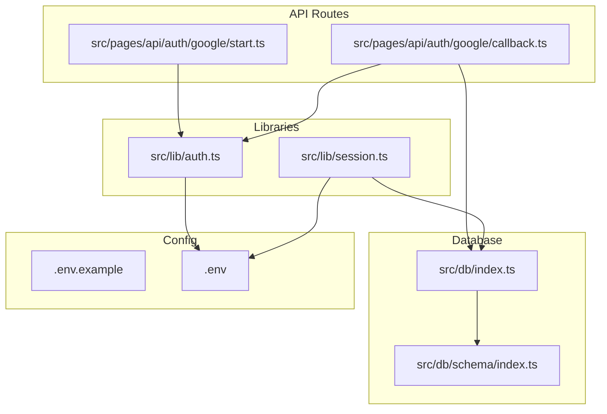
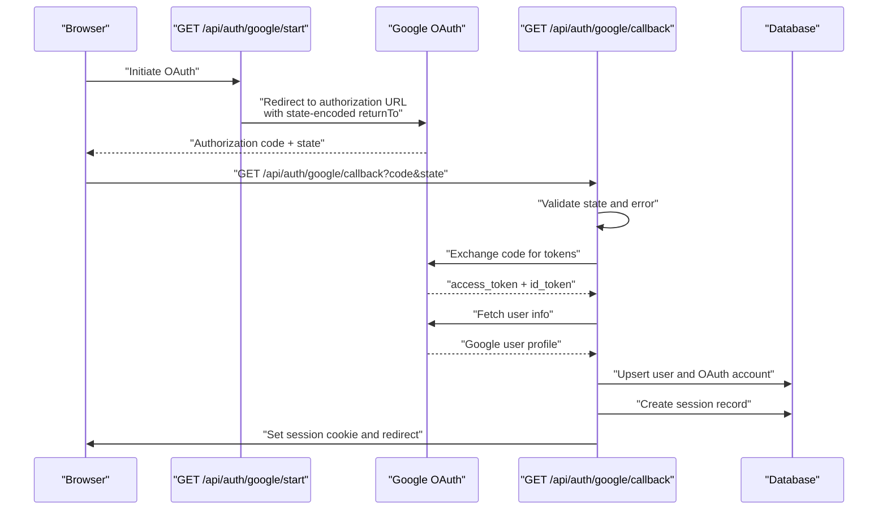
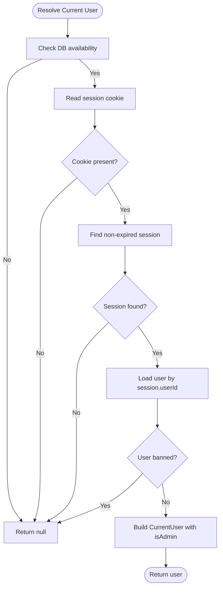
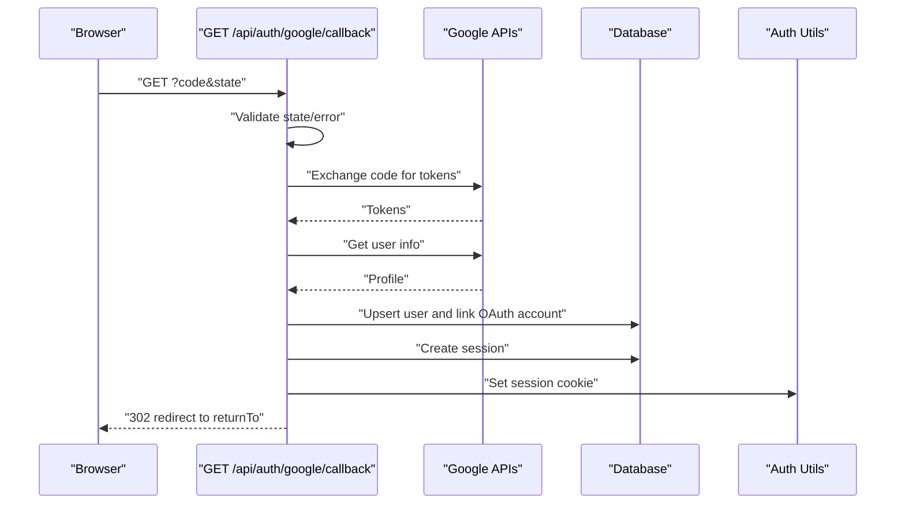
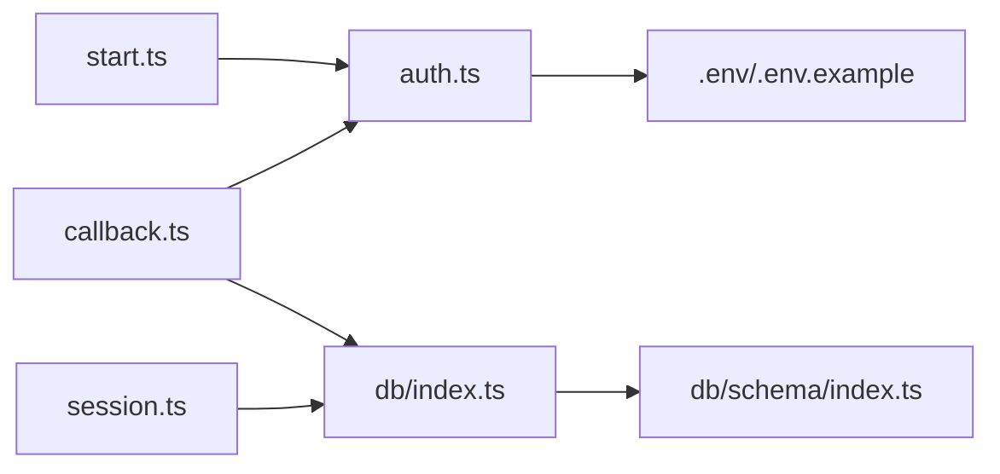

# User Authentication System

<cite>
**Referenced Files in This Document**
- [auth.ts](file://src/lib/auth.ts)
- [session.ts](file://src/lib/session.ts)
- [start.ts](file://src/pages/api/auth/google/start.ts)
- [callback.ts](file://src/pages/api/auth/google/callback.ts)
- [index.ts](file://src/db/index.ts)
- [index.ts](file://src/db/schema/index.ts)
- [.env.example](file://.env.example)
- [.env](file://.env)
</cite>

## Table of Contents
1. [Introduction](#introduction)
2. [Project Structure](#project-structure)
3. [Core Components](#core-components)
4. [Architecture Overview](#architecture-overview)
5. [Detailed Component Analysis](#detailed-component-analysis)
6. [Dependency Analysis](#dependency-analysis)
7. [Performance Considerations](#performance-considerations)
8. [Troubleshooting Guide](#troubleshooting-guide)
9. [Conclusion](#conclusion)
10. [Appendices](#appendices)

## Introduction
This document explains the user authentication system built on Google OAuth 2.0 within the Astro-based application. It covers the complete authentication flow from initiating OAuth with Google to establishing and managing user sessions, including state handling, PKCE considerations, and security measures. It also documents the session management architecture, user context resolution, protected route handling, and the API endpoints involved. Configuration requirements for Google OAuth credentials and environment variables are provided, along with error handling strategies and practical guidance for integrating authentication into frontend React components.

## Project Structure
The authentication system is composed of:
- Library utilities for OAuth and session management
- Astro API routes for OAuth initiation and callback handling
- Database schema and initialization for storing users, OAuth accounts, and sessions
- Environment configuration for site URL, database, and Google OAuth credentials

**Diagram sources**
- [auth.ts](file://src/lib/auth.ts#L1-L101)
- [session.ts](file://src/lib/session.ts#L1-L58)
- [start.ts](file://src/pages/api/auth/google/start.ts#L1-L15)
- [callback.ts](file://src/pages/api/auth/google/callback.ts#L1-L114)
- [index.ts](file://src/db/index.ts#L1-L37)
- [index.ts](file://src/db/schema/index.ts#L1-L104)
- [.env.example](file://.env.example#L1-L23)
- [.env](file://.env#L1-L23)

**Section sources**
- [auth.ts](file://src/lib/auth.ts#L1-L101)
- [session.ts](file://src/lib/session.ts#L1-L58)
- [start.ts](file://src/pages/api/auth/google/start.ts#L1-L15)
- [callback.ts](file://src/pages/api/auth/google/callback.ts#L1-L114)
- [index.ts](file://src/db/index.ts#L1-L37)
- [index.ts](file://src/db/schema/index.ts#L1-L104)
- [.env.example](file://.env.example#L1-L23)
- [.env](file://.env#L1-L23)

## Core Components
- OAuth utilities:
  - Generates Google OAuth authorization URL with state encoding for safe redirects
  - Exchanges authorization code for tokens via Google token endpoint
  - Retrieves user profile using access token
  - Manages session cookie creation and lifecycle
- Session management:
  - Resolves current user from session cookie and database
  - Enforces ban checks and admin role determination
- API routes:
  - OAuth start endpoint builds the authorization URL and redirects
  - OAuth callback handles code exchange, user provisioning/linking, session creation, and cookie setting
- Database schema:
  - Users table with unique email and optional profile fields
  - OAuth accounts linking external providers to local users
  - Sessions table with expiration and foreign key to users

**Section sources**
- [auth.ts](file://src/lib/auth.ts#L33-L101)
- [session.ts](file://src/lib/session.ts#L5-L58)
- [start.ts](file://src/pages/api/auth/google/start.ts#L4-L14)
- [callback.ts](file://src/pages/api/auth/google/callback.ts#L12-L114)
- [index.ts](file://src/db/schema/index.ts#L4-L33)

## Architecture Overview
The authentication architecture follows a standard OAuth 2.0 flow with state-based return-to handling and server-side session persistence.

**Diagram sources**
- [start.ts](file://src/pages/api/auth/google/start.ts#L4-L14)
- [callback.ts](file://src/pages/api/auth/google/callback.ts#L12-L114)
- [auth.ts](file://src/lib/auth.ts#L41-L95)
- [index.ts](file://src/db/schema/index.ts#L4-L33)

## Detailed Component Analysis

### OAuth Utilities and Security
- Authorization URL generation:
  - Uses client ID, redirect URI derived from site URL, response type code, scopes openid email profile, state encoding for return-to, online access type, and explicit account selection prompt
  - Returns the full authorization endpoint URL
- Token exchange:
  - Calls Google token endpoint with authorization code, client ID, client secret, redirect URI, and grant type
  - Validates response and parses tokens
- User info retrieval:
  - Fetches Google userinfo endpoint using Bearer access token
  - Validates response and returns profile data
- Session cookie management:
  - Creates HttpOnly, SameSite lax, secure-only cookie in production, with 30-day max age
  - Provides helpers to read and delete the session cookie
- Admin detection:
  - Checks user email against comma-separated ADMIN_EMAILS environment variable

Security considerations:
- State parameter prevents CSRF and ensures safe return-to handling
- PKCE is not implemented; consider adding S256 challenge for enhanced security
- Access tokens are used for user info retrieval; id tokens are available but not validated here
- Cookie attributes mitigate XSS and CSRF risks where applicable

**Section sources**
- [auth.ts](file://src/lib/auth.ts#L41-L95)
- [auth.ts](file://src/lib/auth.ts#L15-L31)
- [auth.ts](file://src/lib/auth.ts#L97-L101)

### Session Management and User Context Resolution
- Current user resolution:
  - Reads session cookie and validates existence
  - Queries sessions table for non-expired session
  - Loads user record and checks ban status
  - Computes admin flag from environment configuration
- Session lifecycle:
  - Session ID generated using cryptographically suitable identifiers
  - Expires at 30 days from creation
  - Stored in sessions table with foreign key to users

**Diagram sources**
- [session.ts](file://src/lib/session.ts#L13-L54)
- [index.ts](file://src/db/schema/index.ts#L24-L33)

**Section sources**
- [session.ts](file://src/lib/session.ts#L13-L54)

### OAuth Initiation Endpoint
- Purpose:
  - Accepts optional returnTo query parameter
  - Generates Google OAuth URL and performs 302 redirect
  - On failure, redirects back with error query parameter
- Behavior:
  - Uses SITE_URL for redirect URI construction
  - Encodes returnTo in state parameter

**Section sources**
- [start.ts](file://src/pages/api/auth/google/start.ts#L4-L14)
- [auth.ts](file://src/lib/auth.ts#L41-L57)

### OAuth Callback Endpoint
- Purpose:
  - Handles authorization response, exchanges code for tokens, retrieves user info, provisions or links user, creates session, sets cookie, and redirects back
- Flow:
  - Validates presence of error or code parameters
  - Decodes state for returnTo
  - Exchanges code for tokens
  - Fetches Google user info
  - Upserts user and links OAuth account if needed
  - Updates user profile fields if changed
  - Checks ban status and aborts if banned
  - Creates session record and sets session cookie
  - Redirects to returnTo or default path

**Diagram sources**
- [callback.ts](file://src/pages/api/auth/google/callback.ts#L12-L114)
- [auth.ts](file://src/lib/auth.ts#L59-L95)

**Section sources**
- [callback.ts](file://src/pages/api/auth/google/callback.ts#L12-L114)

### Database Schema and Initialization
- Users table:
  - Unique email, optional name and avatar URL
  - Created at timestamp and ban flag
- OAuth accounts table:
  - Links provider and provider user ID to user
  - Unique constraint on provider/providerUserId combination
- Sessions table:
  - Session ID, user foreign key, expiration timestamp, created at
  - Indexes on user ID and expiration for efficient queries
- Database initialization:
  - Drizzle ORM initialized from DATABASE_URL
  - Safe accessors for DB presence and requirement

**Section sources**
- [index.ts](file://src/db/schema/index.ts#L4-L33)
- [index.ts](file://src/db/index.ts#L1-L37)

### Protected Route Handling
- Current user resolution:
  - Use getCurrentUser in server-side rendering or API handlers to enforce protection
  - Return null for anonymous/unauthorized requests
- Typical pattern:
  - In Astro pages or API routes, resolve user and deny access if null
  - Optionally redirect to login with encoded returnTo

Note: The provided codebase does not include dedicated protected route middleware. Implement protection by resolving user context in each route and gating access accordingly.

**Section sources**
- [session.ts](file://src/lib/session.ts#L13-L54)

### API Endpoints
- GET /api/auth/google/start
  - Query parameters: returnTo (optional)
  - Behavior: Redirects to Google OAuth authorization URL with state-encoded returnTo
  - Errors: Redirects back with error query parameter on failure
- GET /api/auth/google/callback
  - Query parameters: code, state, error
  - Behavior: Exchanges code for tokens, retrieves user info, upserts user and OAuth account, creates session, sets cookie, and redirects back
  - Errors: Redirects back with appropriate error query parameters

Note: The codebase does not expose explicit endpoints for user profile retrieval or logout. The user profile is available server-side via the current user context resolved from the session.

**Section sources**
- [start.ts](file://src/pages/api/auth/google/start.ts#L4-L14)
- [callback.ts](file://src/pages/api/auth/google/callback.ts#L12-L114)

## Dependency Analysis
- Libraries depend on environment variables for OAuth client credentials and site URL
- API routes depend on OAuth utilities and database initialization
- Session resolution depends on database connectivity and schema
- OAuth callback depends on users, oauthAccounts, and sessions tables

**Diagram sources**
- [auth.ts](file://src/lib/auth.ts#L41-L57)
- [start.ts](file://src/pages/api/auth/google/start.ts#L2-L2)
- [callback.ts](file://src/pages/api/auth/google/callback.ts#L4-L10)
- [session.ts](file://src/lib/session.ts#L1-L3)
- [index.ts](file://src/db/index.ts#L1-L37)
- [index.ts](file://src/db/schema/index.ts#L1-L104)
- [.env.example](file://.env.example#L13-L18)
- [.env](file://.env#L13-L18)

**Section sources**
- [auth.ts](file://src/lib/auth.ts#L41-L57)
- [start.ts](file://src/pages/api/auth/google/start.ts#L2-L2)
- [callback.ts](file://src/pages/api/auth/google/callback.ts#L4-L10)
- [session.ts](file://src/lib/session.ts#L1-L3)
- [index.ts](file://src/db/index.ts#L1-L37)
- [index.ts](file://src/db/schema/index.ts#L1-L104)
- [.env.example](file://.env.example#L13-L18)
- [.env](file://.env#L13-L18)

## Performance Considerations
- Session lookup:
  - Non-expired session query uses indexed expiresAt and userId for efficient retrieval
- Database connections:
  - Drizzle client pool limits are configured; ensure adequate concurrency for production traffic
- Cookie attributes:
  - HttpOnly and secure flags reduce exposure; consider partitioned storage for privacy-compliant browsers when applicable
- Token exchange:
  - Network latency to Google endpoints affects callback duration; consider caching user info short-term if needed

[No sources needed since this section provides general guidance]

## Troubleshooting Guide
Common issues and resolutions:
- Missing or invalid environment variables:
  - Ensure SITE_URL, GOOGLE_CLIENT_ID, GOOGLE_CLIENT_SECRET, DATABASE_URL, and ADMIN_EMAILS are set
- OAuth redirect mismatch:
  - Verify redirect URI matches Google OAuth app configuration and SITE_URL
- State parameter errors:
  - Ensure returnTo is properly encoded and decoded; state is used for safe return-to handling
- Database not initialized:
  - Confirm DATABASE_URL is set and reachable; initialization logs warnings if unavailable
- User banned:
  - Ban checks prevent login; unban the user in the database if necessary
- Callback failures:
  - Inspect console logs for detailed error messages during token exchange or user info retrieval

**Section sources**
- [.env.example](file://.env.example#L13-L18)
- [.env](file://.env#L13-L18)
- [callback.ts](file://src/pages/api/auth/google/callback.ts#L19-L26)
- [callback.ts](file://src/pages/api/auth/google/callback.ts#L90-L92)
- [index.ts](file://src/db/index.ts#L17-L23)

## Conclusion
The authentication system integrates Google OAuth 2.0 with robust state handling and server-managed sessions persisted in PostgreSQL via Drizzle ORM. While PKCE is not implemented, state-based return-to and secure cookie attributes provide strong protections. The design cleanly separates OAuth utilities, session resolution, and API routes, enabling straightforward extension for additional providers and features like logout and profile retrieval.

[No sources needed since this section summarizes without analyzing specific files]

## Appendices

### Configuration Requirements
- Required environment variables:
  - SITE_URL: Base URL of the application used for OAuth redirect URIs
  - DATABASE_URL: PostgreSQL connection string for Drizzle ORM
  - GOOGLE_CLIENT_ID and GOOGLE_CLIENT_SECRET: Google OAuth application credentials
  - ADMIN_EMAILS: Comma-separated list of admin user emails
- Example configuration files:
  - .env.example demonstrates the required keys
  - .env holds actual deployment values

**Section sources**
- [.env.example](file://.env.example#L1-L23)
- [.env](file://.env#L1-L23)

### Frontend Integration Examples
- Initiating OAuth:
  - Trigger navigation to GET /api/auth/google/start?returnTo=%2Fdashboard
  - Encode returnTo to preserve intended destination after login
- Handling authentication state in React:
  - Use Astro’s server-side user resolution to hydrate initial props or pass user context to client components
  - For client-side routing, detect session cookie presence and fetch user context from server-side endpoints
- Logout:
  - The provided codebase does not include a logout endpoint; implement by clearing the session cookie and removing the session record server-side

[No sources needed since this section provides general guidance]