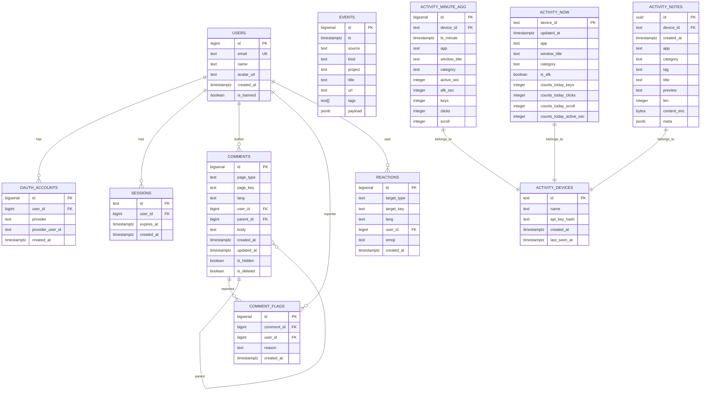
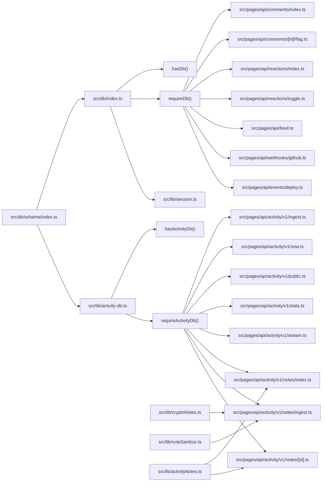

# Database Design

<cite>
**Referenced Files in This Document**
- [drizzle.config.ts](file://drizzle.config.ts)
- [0001_initial.sql](file://drizzle/0001_initial.sql)
- [0002_activity_monitoring.sql](file://drizzle/0002_activity_monitoring.sql)
- [0003_activity_notes.sql](file://drizzle/0003_activity_notes.sql)
- [_journal.json](file://drizzle/meta/_journal.json)
- [schema/index.ts](file://src/db/schema/index.ts)
- [db/index.ts](file://src/db/index.ts)
- [activity-db.ts](file://src/lib/activity-db.ts)
- [activity.ts](file://src/lib/activity.ts)
- [session.ts](file://src/lib/session.ts)
- [auth.ts](file://src/lib/auth.ts)
- [activityNotes.ts](file://src/lib/activityNotes.ts)
- [cryptoNotes.ts](file://src/lib/cryptoNotes.ts)
- [noteSanitize.ts](file://src/lib/noteSanitize.ts)
- [activity/v1/ingest.ts](file://src/pages/api/activity/v1/ingest.ts)
- [activity/v1/now.ts](file://src/pages/api/activity/v1/now.ts)
- [activity/v1/public.ts](file://src/pages/api/activity/v1/public.ts)
- [activity/v1/stats.ts](file://src/pages/api/activity/v1/stats.ts)
- [activity/v1/stream.ts](file://src/pages/api/activity/v1/stream.ts)
- [activity/v1/notes/index.ts](file://src/pages/api/activity/v1/notes/index.ts)
- [activity/v1/notes/ingest.ts](file://src/pages/api/activity/v1/notes/ingest.ts)
- [activity/v1/notes/[id].ts](file://src/pages/api/activity/v1/notes/[id].ts)
- [comments/index.ts](file://src/pages/api/comments/index.ts)
- [comments/[id]/flag.ts](file://src/pages/api/comments/[id]/flag.ts)
- [reactions/index.ts](file://src/pages/api/reactions/index.ts)
- [reactions/toggle.ts](file://src/pages/api/reactions/toggle.ts)
- [feed.ts](file://src/pages/api/feed.ts)
- [webhooks/github.ts](file://src/pages/api/webhooks/github.ts)
- [events/deploy.ts](file://src/pages/api/events/deploy.ts)
- [.env](file://.env)
- [.env.example](file://.env.example)
</cite>

## Update Summary
**Changes Made**
- Added comprehensive documentation for the new activity_notes table with UUID primary keys and encrypted content storage
- Documented the complete activity notes API endpoints including ingestion, retrieval, and deletion workflows
- Added encryption and content sanitization infrastructure with AES-256-GCM encryption and sensitive data redaction
- Updated architecture diagrams to include the new activity notes system alongside existing activity monitoring tables
- Enhanced security documentation with encryption key management and privacy controls
- Updated migration strategy to include the new activity_notes migration (0003)

## Table of Contents
1. [Introduction](#introduction)
2. [Project Structure](#project-structure)
3. [Core Components](#core-components)
4. [Architecture Overview](#architecture-overview)
5. [Detailed Component Analysis](#detailed-component-analysis)
6. [Activity Monitoring System](#activity-monitoring-system)
7. [Activity Notes System](#activity-notes-system)
8. [Dependency Analysis](#dependency-analysis)
9. [Performance Considerations](#performance-considerations)
10. [Security and Privacy](#security-and-privacy)
11. [Troubleshooting Guide](#troubleshooting-guide)
12. [Conclusion](#conclusion)
13. [Appendices](#appendices)

## Introduction
This document describes the database design and data model for the rodion.pro application. It focuses on the relational schema, entity relationships, indexes, and constraints defined by the initial migration and Drizzle ORM schema. The schema now includes a comprehensive activity monitoring system for tracking user computer activity across devices, along with a secure activity notes system for encrypted quick notes. It also documents Drizzle ORM configuration, typical query patterns used by API endpoints, and operational considerations such as migration management, indexing strategies, and access control patterns.

**Updated** Enhanced with the new activity_notes table featuring UUID primary keys, device-based organization, encrypted content storage using AES-256-GCM encryption, and specialized indexes for efficient querying. The system includes comprehensive content sanitization with sensitive data detection and redaction capabilities.

## Project Structure
The database layer is organized around Drizzle ORM with a single schema definition module exporting typed table definitions. Migrations are managed by Drizzle Kit and stored under the drizzle directory. The runtime database client is initialized in a dedicated module and exported for use across the application with graceful fallback capabilities and comprehensive availability checking. The activity monitoring system operates on a separate database connection with its own authentication and security model, now including the new activity notes encryption infrastructure.

```mermaid
graph TB
subgraph "Drizzle Configuration"
DCFG["drizzle.config.ts"]
JRN["_journal.json"]
end
subgraph "Schema Definition"
SCHEMA["src/db/schema/index.ts"]
end
subgraph "Runtime DB Client"
DBIDX["src/db/index.ts"]
ACTIVITY_DB["src/lib/activity-db.ts"]
HASDB["hasDb()"]
REQDB["requireDb()"]
HASACTDB["hasActivityDb()"]
REQACTDB["requireActivityDb()"]
END
subgraph "Core API Endpoints"
API_COMMENTS["src/pages/api/comments/index.ts"]
API_FLAGS["src/pages/api/comments/[id]/flag.ts"]
API_REACTIONS["src/pages/api/reactions/index.ts"]
API_TOGGLE["src/pages/api/reactions/toggle.ts"]
API_FEED["src/pages/api/feed.ts"]
API_GITHUB["src/pages/api/webhooks/github.ts"]
API_DEPLOY["src/pages/api/events/deploy.ts"]
end
subgraph "Activity API Endpoints"
API_INGEST["src/pages/api/activity/v1/ingest.ts"]
API_NOW["src/pages/api/activity/v1/now.ts"]
API_PUBLIC["src/pages/api/activity/v1/public.ts"]
API_STATS["src/pages/api/activity/v1/stats.ts"]
API_STREAM["src/pages/api/activity/v1/stream.ts"]
end
subgraph "Activity Notes API Endpoints"
API_NOTES_INDEX["src/pages/api/activity/v1/notes/index.ts"]
API_NOTES_INGEST["src/pages/api/activity/v1/notes/ingest.ts"]
API_NOTES_ID["src/pages/api/activity/v1/notes/[id].ts"]
end
subgraph "Encryption & Sanitization"
CRYPTO["src/lib/cryptoNotes.ts"]
SANITIZE["src/lib/noteSanitize.ts"]
NOTES_UTIL["src/lib/activityNotes.ts"]
END
subgraph "Auth & Session"
SESS["src/lib/session.ts"]
AUTH["src/lib/auth.ts"]
ACTIVITY_AUTH["src/lib/activity.ts"]
END
DCFG --> JRN
SCHEMA --> DBIDX
SCHEMA --> ACTIVITY_DB
DBIDX --> HASDB
DBIDX --> REQDB
ACTIVITY_DB --> HASACTDB
ACTIVITY_DB --> REQACTDB
REQDB --> API_COMMENTS
REQDB --> API_FLAGS
REQDB --> API_REACTIONS
REQDB --> API_TOGGLE
REQDB --> API_FEED
REQDB --> API_GITHUB
REQDB --> API_DEPLOY
REQACTDB --> API_INGEST
REQACTDB --> API_NOW
REQACTDB --> API_PUBLIC
REQACTDB --> API_STATS
REQACTDB --> API_STREAM
REQACTDB --> API_NOTES_INDEX
REQACTDB --> API_NOTES_INGEST
REQACTDB --> API_NOTES_ID
DBIDX --> SESS
SESS --> AUTH
ACTIVITY_DB --> ACTIVITY_AUTH
CRYPTO --> API_NOTES_INGEST
SANITIZE --> API_NOTES_INGEST
NOTES_UTIL --> API_NOTES_INDEX
NOTES_UTIL --> API_NOTES_ID
```

**Diagram sources**
- [drizzle.config.ts](file://drizzle.config.ts#L1-L11)
- [_journal.json](file://drizzle/meta/_journal.json#L1-L21)
- [schema/index.ts](file://src/db/schema/index.ts#L1-L194)
- [db/index.ts](file://src/db/index.ts#L1-L37)
- [activity-db.ts](file://src/lib/activity-db.ts#L1-L49)
- [activity.ts](file://src/lib/activity.ts#L1-L154)
- [session.ts](file://src/lib/session.ts#L1-L58)
- [auth.ts](file://src/lib/auth.ts#L1-L101)
- [activity/v1/ingest.ts](file://src/pages/api/activity/v1/ingest.ts#L1-L188)
- [activity/v1/now.ts](file://src/pages/api/activity/v1/now.ts#L1-L106)
- [activity/v1/public.ts](file://src/pages/api/activity/v1/public.ts#L1-L65)
- [activity/v1/stats.ts](file://src/pages/api/activity/v1/stats.ts#L1-L273)
- [activity/v1/stream.ts](file://src/pages/api/activity/v1/stream.ts#L1-L129)
- [activity/v1/notes/index.ts](file://src/pages/api/activity/v1/notes/index.ts#L1-L87)
- [activity/v1/notes/ingest.ts](file://src/pages/api/activity/v1/notes/ingest.ts#L1-L109)
- [activity/v1/notes/[id].ts](file://src/pages/api/activity/v1/notes/[id].ts#L1-L126)
- [cryptoNotes.ts](file://src/lib/cryptoNotes.ts#L1-L45)
- [noteSanitize.ts](file://src/lib/noteSanitize.ts#L1-L30)
- [activityNotes.ts](file://src/lib/activityNotes.ts#L1-L108)

**Section sources**
- [drizzle.config.ts](file://drizzle.config.ts#L1-L11)
- [0001_initial.sql](file://drizzle/0001_initial.sql#L1-L94)
- [0002_activity_monitoring.sql](file://drizzle/0002_activity_monitoring.sql#L1-L46)
- [0003_activity_notes.sql](file://drizzle/0003_activity_notes.sql#L1-L24)
- [schema/index.ts](file://src/db/schema/index.ts#L1-L194)
- [db/index.ts](file://src/db/index.ts#L1-L37)
- [activity-db.ts](file://src/lib/activity-db.ts#L1-L49)

## Core Components
This section documents the primary tables and their fields, data types, and constraints. It also outlines the Drizzle ORM configuration and initialization with enhanced error handling capabilities and comprehensive availability checking.

- Drizzle ORM configuration
  - Schema path: src/db/schema/index.ts
  - Output directory for migrations: drizzle
  - Dialect: PostgreSQL
  - Credentials: DATABASE_URL environment variable (supports both process.env and import.meta.env)

- Database client initialization with robust availability checking
  - Core database: Connection pooling and timeouts configured with max: 10, idle_timeout: 20, connect_timeout: 10
  - Activity database: Separate connection for activity monitoring with dedicated authentication
  - Exports a drizzle instance bound to the schema
  - Provides helper functions: hasDb() and requireDb() for core database, hasActivityDb() and requireActivityDb() for activity database
  - Graceful fallback when DATABASE_URL is missing or connection fails with console warnings
  - All API endpoints implement consistent availability checking with HTTP 503 responses

- Entities and fields
  - Users: identity and profile attributes with a banned flag
  - OAuth accounts: provider-linked identities with uniqueness constraint
  - Sessions: session tokens with expiry and foreign-key cascade on user deletion
  - Comments: threaded comments with hierarchical parent-child relations and soft-delete/visibility flags
  - Reactions: emoji reactions scoped by target type/key with uniqueness constraint
  - Comment flags: moderation reports linked to comments
  - Events: changelog entries with timestamps, categorization, tags, and JSON payload
  - Activity devices: registered devices with API key hashing and last seen tracking
  - Activity minute aggregation: time-series data with unique constraints for data integrity
  - Activity now: real-time status tracking with daily counter resets
  - Activity notes: encrypted quick notes with UUID primary keys and device-based organization

**Updated** Enhanced with the new activity_notes table featuring UUID primary keys, encrypted content storage using AES-256-GCM encryption, and specialized indexes for efficient querying. The table includes fields for device organization, content preview, length tracking, and metadata storage.

**Section sources**
- [drizzle.config.ts](file://drizzle.config.ts#L1-L11)
- [schema/index.ts](file://src/db/schema/index.ts#L1-L194)
- [db/index.ts](file://src/db/index.ts#L1-L37)
- [activity-db.ts](file://src/lib/activity-db.ts#L1-L49)
- [0001_initial.sql](file://drizzle/0001_initial.sql#L1-L94)
- [0002_activity_monitoring.sql](file://drizzle/0002_activity_monitoring.sql#L1-L46)
- [0003_activity_notes.sql](file://drizzle/0003_activity_notes.sql#L1-L24)

## Architecture Overview
The database architecture centers on a single schema module that defines all tables and indexes. API endpoints use the shared drizzle client to perform reads and writes with proper error handling. Authentication and session retrieval rely on the sessions table to derive the current user, with graceful fallback when database is unavailable. The new activity monitoring system operates independently with its own security model and database connection, now including the secure activity notes system with encryption and content sanitization.



**Diagram sources**
- [schema/index.ts](file://src/db/schema/index.ts#L3-L194)
- [0001_initial.sql](file://drizzle/0001_initial.sql#L4-L94)
- [0002_activity_monitoring.sql](file://drizzle/0002_activity_monitoring.sql#L3-L46)
- [0003_activity_notes.sql](file://drizzle/0003_activity_notes.sql#L2-L19)

**Section sources**
- [schema/index.ts](file://src/db/schema/index.ts#L3-L194)
- [0001_initial.sql](file://drizzle/0001_initial.sql#L4-L94)
- [0002_activity_monitoring.sql](file://drizzle/0002_activity_monitoring.sql#L3-L46)
- [0003_activity_notes.sql](file://drizzle/0003_activity_notes.sql#L1-L24)

## Detailed Component Analysis

### Users
- Purpose: Store user identity and profile metadata.
- Key constraints: Unique email.
- Additional fields: Name, avatar URL, creation timestamp, banned flag.
- Access pattern: Joined with comments and reactions for display; checked for bans during session resolution.
- Data type consistency: Primary key uses bigserial for auto-incrementing identity.

**Section sources**
- [schema/index.ts](file://src/db/schema/index.ts#L17-L24)
- [0001_initial.sql](file://drizzle/0001_initial.sql#L5-L12)
- [session.ts](file://src/lib/session.ts#L43-L45)

### OAuth Accounts
- Purpose: Link provider identities to users.
- Constraints: Composite unique(provider, provider_user_id).
- Access pattern: Used during sign-in flows to associate or retrieve user records.
- Data type consistency: Foreign key column uses bigint for PostgreSQL compatibility.

**Section sources**
- [schema/index.ts](file://src/db/schema/index.ts#L27-L35)
- [0001_initial.sql](file://drizzle/0001_initial.sql#L15-L22)

### Sessions
- Purpose: Maintain authenticated sessions with expiry.
- Constraints: Cascade delete on user deletion; indexes on user_id and expires_at.
- Access pattern: Verified by API endpoints to resolve current user; session cookie is HttpOnly and secure in production.
- Data type consistency: Foreign key column uses bigint for PostgreSQL compatibility.

**Section sources**
- [schema/index.ts](file://src/db/schema/index.ts#L38-L46)
- [0001_initial.sql](file://drizzle/0001_initial.sql#L25-L30)
- [session.ts](file://src/lib/session.ts#L27-L32)
- [auth.ts](file://src/lib/auth.ts#L15-L23)

### Comments
- Purpose: Threaded comments associated with pages and languages.
- Hierarchical relation: parent_id references comments.id with cascade delete.
- Visibility: Soft delete and hidden flags; deleted bodies are omitted in API responses.
- Indexes: Composite index on (page_type, page_key, lang, created_at); index on parent_id.
- Access pattern: API lists comments per page/lang and builds nested trees; reactions counts are aggregated separately.
- Data type consistency: Both user_id and parent_id foreign keys use bigint for PostgreSQL compatibility.

**Section sources**
- [schema/index.ts](file://src/db/schema/index.ts#L49-L64)
- [0001_initial.sql](file://drizzle/0001_initial.sql#L36-L48)
- [comments/index.ts](file://src/pages/api/comments/index.ts#L6-L163)

### Reactions
- Purpose: Emoji reactions for posts and comments.
- Uniqueness: target_type + target_key + user_id + emoji combination ensures one reaction per user per target per emoji.
- Indexes: target_type + target_key; user_id.
- Access pattern: Aggregated counts per emoji and current user's reactions returned by API.
- Data type consistency: Foreign key column uses bigint for PostgreSQL compatibility.

**Section sources**
- [schema/index.ts](file://src/db/schema/index.ts#L67-L79)
- [0001_initial.sql](file://drizzle/0001_initial.sql#L54-L63)
- [reactions/index.ts](file://src/pages/api/reactions/index.ts#L6-L80)
- [reactions/toggle.ts](file://src/pages/api/reactions/toggle.ts#L8-L83)

### Comment Flags
- Purpose: Moderation reports for comments.
- Index: comment_id for efficient lookups.
- Access pattern: API endpoint creates flags for reported comments.
- Data type consistency: Foreign key columns use bigint for PostgreSQL compatibility.

**Section sources**
- [schema/index.ts](file://src/db/schema/index.ts#L82-L90)
- [0001_initial.sql](file://drizzle/0001_initial.sql#L69-L75)
- [comments/[id]/flag.ts](file://src/pages/api/comments/[id]/flag.ts#L7-L67)

### Events (Changelog)
- Purpose: Store changelog entries with timestamps, categorization, tags, and JSON payload.
- Indexes: ts descending; project.
- Access pattern: API endpoint supports pagination and filtering by project.

**Section sources**
- [schema/index.ts](file://src/db/schema/index.ts#L93-L106)
- [0001_initial.sql](file://drizzle/0001_initial.sql#L80-L94)
- [feed.ts](file://src/pages/api/feed.ts#L5-L54)

### Webhooks and Deployment Events
- Purpose: GitHub webhook processing and deployment event logging.
- GitHub webhook: Verifies signatures, processes push and release events, inserts changelog entries.
- Deploy events: Token-authenticated deployment logging with project, version, and environment information.

**Section sources**
- [webhooks/github.ts](file://src/pages/api/webhooks/github.ts#L47-L141)
- [events/deploy.ts](file://src/pages/api/events/deploy.ts#L4-L60)

### Drizzle ORM Configuration and Enhanced Initialization
- Configuration: Schema path, output directory, dialect, and credentials URL.
- Client: Uses postgres-js with connection pool limits and timeouts; binds the schema for type-safe queries.
- Safety: Graceful fallback when DATABASE_URL is missing or connection fails; console warnings instead of throwing errors.
- Utility functions: hasDb() for availability checks, requireDb() for safe access with clear error messages.
- Activity database: Separate connection management with dedicated authentication and security controls.

**Section sources**
- [drizzle.config.ts](file://drizzle.config.ts#L3-L10)
- [db/index.ts](file://src/db/index.ts#L5-L34)
- [activity-db.ts](file://src/lib/activity-db.ts#L1-L49)

### API Query Patterns and Enhanced Error Handling
- Comments listing: Left join with users; filter by page_type, page_key, lang; order by created_at; aggregate reaction counts and current user's reactions; build nested tree.
- Reactions listing: Aggregate counts by emoji; optionally filter by language for posts; fetch current user's reactions.
- Toggle reaction: Upsert-like behavior using uniqueness constraint; insert or delete based on existence.
- Flag comment: Insert a moderation report record.
- Feed: Paginated query with total count; optional project filter.
- Activity ingestion: Device authentication, time-series splitting, minute-level aggregation with conflict resolution.
- Real-time streaming: Server-Sent Events with connection management and broadcasting.
- Statistics: Time-series aggregation with category filtering and window-based breakdowns.
- Activity notes: Device-based queries with admin authentication; encryption/decryption for content access.

**Section sources**
- [comments/index.ts](file://src/pages/api/comments/index.ts#L6-L162)
- [reactions/index.ts](file://src/pages/api/reactions/index.ts#L6-L80)
- [reactions/toggle.ts](file://src/pages/api/reactions/toggle.ts#L8-L83)
- [comments/[id]/flag.ts](file://src/pages/api/comments/[id]/flag.ts#L7-L67)
- [feed.ts](file://src/pages/api/feed.ts#L5-L53)
- [webhooks/github.ts](file://src/pages/api/webhooks/github.ts#L47-L141)
- [events/deploy.ts](file://src/pages/api/events/deploy.ts#L4-L60)
- [activity/v1/ingest.ts](file://src/pages/api/activity/v1/ingest.ts#L6-L188)
- [activity/v1/now.ts](file://src/pages/api/activity/v1/now.ts#L11-L106)
- [activity/v1/stats.ts](file://src/pages/api/activity/v1/stats.ts#L7-L273)
- [activity/v1/stream.ts](file://src/pages/api/activity/v1/stream.ts#L12-L129)
- [activity/v1/notes/index.ts](file://src/pages/api/activity/v1/notes/index.ts#L6-L86)
- [activity/v1/notes/ingest.ts](file://src/pages/api/activity/v1/notes/ingest.ts#L10-L109)
- [activity/v1/notes/[id].ts](file://src/pages/api/activity/v1/notes/[id].ts#L7-L125)

### Access Control and Security
- Session-based authentication: Session cookie validated against sessions table with expiry check; user lookup and ban check.
- Admin gating: Email-based admin check for moderation endpoints.
- Cookie security: HttpOnly, secure in production, SameSite lax, fixed duration.
- Rate limiting and anti-abuse: Not shown in database schema but noted in project documentation.
- Device authentication: SHA-256 hashed API keys for activity devices with per-request verification.
- Admin token authentication: Bearer token validation for administrative access to activity endpoints.
- Privacy controls: Application blacklisting and title filtering capabilities for sensitive data protection.
- Activity notes encryption: AES-256-GCM encryption with environment-managed keys for content protection.

**Section sources**
- [session.ts](file://src/lib/session.ts#L27-L53)
- [auth.ts](file://src/lib/auth.ts#L15-L23)
- [auth.ts](file://src/lib/auth.ts#L97-L100)
- [activity.ts](file://src/lib/activity.ts#L146-L154)
- [activity/v1/now.ts](file://src/pages/api/activity/v1/now.ts#L34-L76)
- [activity/v1/stats.ts](file://src/pages/api/activity/v1/stats.ts#L44-L83)
- [activity/v1/stream.ts](file://src/pages/api/activity/v1/stream.ts#L35-L86)
- [activity/v1/notes/index.ts](file://src/pages/api/activity/v1/notes/index.ts#L14-L20)
- [activity/v1/notes/ingest.ts](file://src/pages/api/activity/v1/notes/ingest.ts#L25-L33)
- [activity/v1/notes/[id].ts](file://src/pages/api/activity/v1/notes/[id].ts#L22-L28)

## Activity Monitoring System

### Activity Devices
- Purpose: Register and track devices that send telemetry data to the system.
- Key constraints: Primary key on device ID; API key hash stored for authentication.
- Additional fields: Device name, API key hash, creation timestamp, last seen timestamp.
- Security: API key stored as SHA-256 hash; device authentication performed via header-based verification.
- Access pattern: Device registration and authentication; cascade delete ensures orphan cleanup.

**Section sources**
- [schema/index.ts](file://src/db/schema/index.ts#L111-L117)
- [0002_activity_monitoring.sql](file://drizzle/0002_activity_monitoring.sql#L3-L9)
- [activity/v1/ingest.ts](file://src/pages/api/activity/v1/ingest.ts#L28-L37)
- [activity/v1/now.ts](file://src/pages/api/activity/v1/now.ts#L34-L47)

### Activity Minute Aggregation
- Purpose: Store time-series activity data aggregated at minute granularity.
- Key constraints: Composite unique constraint on (device_id, ts_minute, app, window_title, category).
- Additional fields: App name, window title, category, activity/AFK seconds, input counts (keys, clicks, scroll).
- Indexes: Composite index on (device_id, ts_minute) and category index for efficient querying.
- Data integrity: Upsert operations merge overlapping time periods; prevents duplicate entries.
- Access pattern: Time-series queries with grouping and aggregation; supports hourly/dayly rollups.

**Section sources**
- [schema/index.ts](file://src/db/schema/index.ts#L120-L136)
- [0002_activity_monitoring.sql](file://drizzle/0002_activity_monitoring.sql#L11-L24)
- [0002_activity_monitoring.sql](file://drizzle/0002_activity_monitoring.sql#L43-L45)
- [activity/v1/ingest.ts](file://src/pages/api/activity/v1/ingest.ts#L75-L104)
- [activity/v1/stats.ts](file://src/pages/api/activity/v1/stats.ts#L106-L118)

### Activity Now
- Purpose: Maintain real-time status for each device with daily counter resets.
- Key constraints: Primary key on device_id with foreign key reference to activity_devices.
- Additional fields: App/window information, category, AFK status, daily counters for inputs and activity time.
- Daily logic: Automatic counter reset at midnight; same-day accumulation for subsequent updates.
- Access pattern: Real-time status queries; supports device-specific and public status endpoints.

**Section sources**
- [schema/index.ts](file://src/db/schema/index.ts#L139-L150)
- [0002_activity_monitoring.sql](file://drizzle/0002_activity_monitoring.sql#L26-L37)
- [activity/v1/ingest.ts](file://src/pages/api/activity/v1/ingest.ts#L106-L157)
- [activity/v1/now.ts](file://src/pages/api/activity/v1/now.ts#L74-L84)

### API Endpoints for Activity Monitoring
- Ingest endpoint: Handles device authentication, time-series splitting, minute-level aggregation, and real-time broadcasting.
- Now endpoint: Returns current device status with flexible authentication (device key, admin token, or session).
- Public endpoint: Provides anonymous status for public display with privacy-safe aggregations.
- Stats endpoint: Comprehensive analytics with time-series breakdowns, top applications, categories, and window titles.
- Stream endpoint: Server-Sent Events for real-time device status updates with connection management.

**Section sources**
- [activity/v1/ingest.ts](file://src/pages/api/activity/v1/ingest.ts#L6-L188)
- [activity/v1/now.ts](file://src/pages/api/activity/v1/now.ts#L11-L106)
- [activity/v1/public.ts](file://src/pages/api/activity/v1/public.ts#L5-L65)
- [activity/v1/stats.ts](file://src/pages/api/activity/v1/stats.ts#L7-L273)
- [activity/v1/stream.ts](file://src/pages/api/activity/v1/stream.ts#L12-L129)

### Privacy Controls and Data Protection
- Application blacklisting: Sensitive application names can be filtered from public views.
- Title filtering: Window titles can be anonymized or filtered to protect user privacy.
- Category classification: Activities categorized to reduce sensitive information exposure.
- Device-level access control: Each device requires authentication; public endpoints use privacy-safe aggregations.
- Data retention: Time-series data stored with appropriate indexing for efficient querying and potential purging.

**Section sources**
- [activity.ts](file://src/lib/activity.ts#L146-L154)
- [activity/v1/public.ts](file://src/pages/api/activity/v1/public.ts#L34-L50)
- [activity/v1/stats.ts](file://src/pages/api/activity/v1/stats.ts#L88-L99)

## Activity Notes System

### Activity Notes Table
- Purpose: Store encrypted quick notes with device-based organization and content preview.
- Key constraints: UUID primary key with random default; foreign key relationship to activity_devices.
- Data types: UUID for id, text for device_id, timestamptz for timestamps, bytea for encrypted content.
- Fields: app (nullable), category (defaults to 'unknown'), tag, title, preview (safe text), len (character count), content_enc (encrypted), meta (JSONB).
- Indexes: Composite indexes on (device_id, created_at) and (device_id, app, created_at) for efficient querying.
- Encryption: Uses AES-256-GCM with 12-byte IV and 16-byte auth tag stored as packed byte array.

**Section sources**
- [schema/index.ts](file://src/db/schema/index.ts#L153-L177)
- [0003_activity_notes.sql](file://drizzle/0003_activity_notes.sql#L2-L19)
- [0003_activity_notes.sql](file://drizzle/0003_activity_notes.sql#L21-L24)

### Encryption Infrastructure
- Key management: AES-256-GCM encryption key stored in ACTIVITY_NOTES_KEY environment variable (32 bytes base64).
- Encryption format: Packed structure containing 12-byte IV + 16-byte auth tag + ciphertext.
- Decryption: Extracts IV and tag, verifies authenticity with GCM, then decrypts content.
- Key validation: Runtime checks ensure key length is exactly 32 bytes; throws error if missing or invalid.

**Section sources**
- [cryptoNotes.ts](file://src/lib/cryptoNotes.ts#L1-L45)
- [.env](file://.env#L24-L24)
- [.env.example](file://.env.example#L25-L25)

### Content Sanitization
- Sensitive pattern detection: Private key markers, JWT-like patterns, API key/token/secret/password indicators.
- Redaction algorithm: Masks long alphanumeric sequences and numeric strings for privacy protection.
- Preview generation: Creates one-line previews with configurable maximum length (default 160 characters).
- Decision logic: Automatically redacts content if suspicious patterns detected or explicit redaction requested.

**Section sources**
- [noteSanitize.ts](file://src/lib/noteSanitize.ts#L1-L30)

### API Endpoints for Activity Notes
- List notes: GET endpoint with admin authentication, supports device filtering, time ranges, app/tag filters, and pagination.
- Ingest note: POST endpoint with device authentication, validates content length, applies sanitization/redaction, performs encryption, and stores metadata.
- Get note: GET endpoint with admin authentication, decrypts content for authorized access.
- Delete note: DELETE endpoint with admin authentication, removes note securely.

**Section sources**
- [activity/v1/notes/index.ts](file://src/pages/api/activity/v1/notes/index.ts#L6-L86)
- [activity/v1/notes/ingest.ts](file://src/pages/api/activity/v1/notes/ingest.ts#L10-L109)
- [activity/v1/notes/[id].ts](file://src/pages/api/activity/v1/notes/[id].ts#L7-L125)

### Client Library Functions
- Fetch notes: Retrieves note previews with optional filtering parameters.
- Fetch note detail: Retrieves full note content with decryption.
- Create note: Sends note ingestion request with device credentials and optional redaction.
- Delete note: Removes notes with admin authentication.

**Section sources**
- [activityNotes.ts](file://src/lib/activityNotes.ts#L27-L107)

### Security and Privacy Controls
- Device authentication: X-Device-Id and X-Device-Key headers verified against registered devices.
- Admin authentication: Bearer token validation for accessing note content and managing notes.
- Content protection: All note content stored as encrypted bytea with authenticated encryption.
- Privacy safeguards: Automatic redaction of suspicious content, preview-only access for public views, and strict access controls.
- Audit trail: Metadata includes source, redaction status, and suspicious content detection.

**Section sources**
- [activity/v1/notes/ingest.ts](file://src/pages/api/activity/v1/notes/ingest.ts#L25-L33)
- [activity/v1/notes/ingest.ts](file://src/pages/api/activity/v1/notes/ingest.ts#L76-L78)
- [activity/v1/notes/[id].ts](file://src/pages/api/activity/v1/notes/[id].ts#L22-L28)
- [cryptoNotes.ts](file://src/lib/cryptoNotes.ts#L35-L44)

## Dependency Analysis
The following diagram shows how API endpoints depend on the database client and schema definitions with enhanced error handling patterns and consistent availability checking.



**Diagram sources**
- [db/index.ts](file://src/db/index.ts#L1-L37)
- [activity-db.ts](file://src/lib/activity-db.ts#L1-L49)
- [schema/index.ts](file://src/db/schema/index.ts#L1-L194)
- [comments/index.ts](file://src/pages/api/comments/index.ts#L1-L240)
- [comments/[id]/flag.ts](file://src/pages/api/comments/[id]/flag.ts#L1-L69)
- [reactions/index.ts](file://src/pages/api/reactions/index.ts#L1-L82)
- [reactions/toggle.ts](file://src/pages/api/reactions/toggle.ts#L1-L85)
- [feed.ts](file://src/pages/api/feed.ts#L1-L55)
- [webhooks/github.ts](file://src/pages/api/webhooks/github.ts#L1-L142)
- [events/deploy.ts](file://src/pages/api/events/deploy.ts#L1-L61)
- [activity/v1/ingest.ts](file://src/pages/api/activity/v1/ingest.ts#L1-L188)
- [activity/v1/now.ts](file://src/pages/api/activity/v1/now.ts#L1-L106)
- [activity/v1/public.ts](file://src/pages/api/activity/v1/public.ts#L1-L65)
- [activity/v1/stats.ts](file://src/pages/api/activity/v1/stats.ts#L1-L273)
- [activity/v1/stream.ts](file://src/pages/api/activity/v1/stream.ts#L1-L129)
- [activity/v1/notes/index.ts](file://src/pages/api/activity/v1/notes/index.ts#L1-L87)
- [activity/v1/notes/ingest.ts](file://src/pages/api/activity/v1/notes/ingest.ts#L1-L109)
- [activity/v1/notes/[id].ts](file://src/pages/api/activity/v1/notes/[id].ts#L1-L126)
- [session.ts](file://src/lib/session.ts#L1-L58)
- [cryptoNotes.ts](file://src/lib/cryptoNotes.ts#L1-L45)
- [noteSanitize.ts](file://src/lib/noteSanitize.ts#L1-L30)
- [activityNotes.ts](file://src/lib/activityNotes.ts#L1-L108)

**Section sources**
- [db/index.ts](file://src/db/index.ts#L1-L37)
- [activity-db.ts](file://src/lib/activity-db.ts#L1-L49)
- [schema/index.ts](file://src/db/schema/index.ts#L1-L194)

## Performance Considerations
- Indexes
  - sessions(user_id), sessions(expires_at)
  - comments(page_type, page_key, lang, created_at), comments(parent_id)
  - reactions(target_type, target_key), reactions(user_id)
  - comment_flags(comment_id)
  - events(ts DESC), events(project)
  - activity_minute_agg(device_id, ts_minute), activity_minute_agg(category, ts_minute)
  - activity_devices(api_key_hash)
  - activity_notes(device_id, created_at), activity_notes(device_id, app, created_at)
- Query patterns
  - Comments listing uses composite index to efficiently filter by page and sort by creation time.
  - Reactions aggregation leverages target-type and user indexes for counts and per-user lookups.
  - Events feed uses timestamp and project indexes for ordering and filtering.
  - Activity monitoring uses time-series indexes for efficient minute-level queries and aggregations.
  - Device authentication uses hashed API key index for fast verification.
  - Activity notes queries leverage device-based composite indexes for efficient filtering.
- Pooling and timeouts
  - Core database: Connection pool max and timeouts configured in the client initialization with max: 10, idle_timeout: 20, connect_timeout: 10.
  - Activity database: Separate connection pool with dedicated configuration for telemetry data.
  - Graceful fallback: Console warnings instead of throwing errors when database is unavailable.
  - hasDb() function allows conditional feature availability.
  - **Updated** Enhanced with improved data type consistency where all foreign key columns now use bigint for better PostgreSQL foreign key constraint enforcement and data type uniformity.

**Section sources**
- [0001_initial.sql](file://drizzle/0001_initial.sql#L32-L33)
- [0001_initial.sql](file://drizzle/0001_initial.sql#L50-L51)
- [0001_initial.sql](file://drizzle/0001_initial.sql#L65-L66)
- [0001_initial.sql](file://drizzle/0001_initial.sql#L77-L77)
- [0001_initial.sql](file://drizzle/0001_initial.sql#L92-L93)
- [0002_activity_monitoring.sql](file://drizzle/0002_activity_monitoring.sql#L43-L45)
- [0003_activity_notes.sql](file://drizzle/0003_activity_notes.sql#L21-L24)
- [db/index.ts](file://src/db/index.ts#L11-L23)
- [activity-db.ts](file://src/lib/activity-db.ts#L41-L47)

## Security and Privacy

### Encryption and Key Management
- AES-256-GCM encryption provides authenticated encryption with 12-byte IV and 16-byte authentication tag.
- Encryption key stored in ACTIVITY_NOTES_KEY environment variable as 32-byte base64-encoded key.
- Runtime validation ensures key length is exactly 32 bytes; missing or invalid keys cause immediate failure.
- Encrypted content stored as bytea with packed structure: IV + TAG + CIPHERTEXT.

### Content Sanitization and Redaction
- Automatic detection of sensitive patterns: private keys, JWT tokens, API keys, secrets, passwords.
- Intelligent redaction masks long alphanumeric sequences and numeric strings.
- Preview generation creates safe summaries without exposing sensitive content.
- Redaction decision considers both suspicious content detection and explicit user redaction requests.

### Access Control and Authentication
- Device authentication: X-Device-Id and X-Device-Key headers verified against registered devices.
- Admin authentication: Bearer token validation for accessing note content and managing notes.
- Session-based authentication: Standard session validation for non-activity endpoints.
- Strict authorization: Notes can only be accessed by authorized administrators with proper tokens.

### Privacy Protections
- Device-based organization: Notes are tied to specific devices for proper attribution.
- Content encryption: All note content stored in encrypted form with authenticated encryption.
- Preview-only access: Public views only see sanitized previews, not full content.
- Metadata minimization: Only necessary metadata stored with notes for operational purposes.

**Section sources**
- [cryptoNotes.ts](file://src/lib/cryptoNotes.ts#L1-L45)
- [noteSanitize.ts](file://src/lib/noteSanitize.ts#L1-L30)
- [activity/v1/notes/ingest.ts](file://src/pages/api/activity/v1/notes/ingest.ts#L18-L23)
- [activity/v1/notes/ingest.ts](file://src/pages/api/activity/v1/notes/ingest.ts#L25-L33)
- [activity/v1/notes/[id].ts](file://src/pages/api/activity/v1/notes/[id].ts#L22-L28)
- [activityNotes.ts](file://src/lib/activityNotes.ts#L17-L25)

## Troubleshooting Guide
- Database not configured
  - Symptom: API endpoints return 503 with a message indicating DB not configured.
  - Cause: DATABASE_URL missing or connection failed during initialization.
  - Resolution: Ensure DATABASE_URL is present and reachable; verify credentials and network.
  - **Updated** Activity monitoring endpoints also implement availability checking with separate hasActivityDb() function.

- Database connection failures
  - Symptom: Console warnings about failed database initialization.
  - Cause: Network issues, invalid credentials, or database downtime.
  - Resolution: Check database connectivity and credentials; application continues with limited functionality.

- Unauthorized access
  - Symptom: 401 responses when performing actions requiring authentication.
  - Cause: Missing or expired session cookie; session not found or expired; user banned.
  - Resolution: Trigger OAuth flow to establish a session; ensure session cookie is HttpOnly and secure in production.
  - **Updated** Activity monitoring supports multiple authentication methods: device API keys, admin tokens, or session-based access.

- Invalid emoji or missing fields
  - Symptom: 400 responses when toggling reactions.
  - Cause: Missing required fields or unsupported emoji.
  - Resolution: Validate payload before sending requests.

- Comment not found
  - Symptom: 404 when flagging a comment.
  - Cause: Invalid or non-existent comment ID.
  - Resolution: Verify comment ID and permissions.

- Activity device authentication failures
  - Symptom: 401 responses from activity endpoints.
  - Cause: Missing or invalid x-device-id/x-device-key headers; device not registered; API key mismatch.
  - Resolution: Verify device registration and API key configuration; ensure proper header format.

- Activity ingestion conflicts
  - Symptom: Data integrity issues with overlapping time periods.
  - Cause: Multiple devices sending data for the same minute window.
  - Resolution: System handles conflicts automatically via upsert operations; check for duplicate device IDs.

- **Updated** Activity notes troubleshooting:
  - Encryption key missing: 503 response when ACTIVITY_NOTES_KEY environment variable not set or invalid.
  - Device authentication failures: 401 responses for missing or invalid device credentials on ingestion.
  - Content too long: 413 response when note exceeds 8192 character limit.
  - Note not found: 404 response when requesting non-existent note ID.
  - Insufficient permissions: 401 response for unauthorized access attempts.

- **Updated** Enhanced error handling patterns with consistent availability checking across all API endpoints and new activity monitoring system. Improved data type consistency ensures better foreign key constraint enforcement and reduces type-related migration issues.

**Section sources**
- [comments/index.ts](file://src/pages/api/comments/index.ts#L7-L12)
- [comments/index.ts](file://src/pages/api/comments/index.ts#L165-L171)
- [reactions/toggle.ts](file://src/pages/api/reactions/toggle.ts#L19-L24)
- [reactions/toggle.ts](file://src/pages/api/reactions/toggle.ts#L36-L41)
- [comments/[id]/flag.ts](file://src/pages/api/comments/[id]/flag.ts#L18-L24)
- [session.ts](file://src/lib/session.ts#L34-L36)
- [session.ts](file://src/lib/session.ts#L43-L45)
- [activity/v1/ingest.ts](file://src/pages/api/activity/v1/ingest.ts#L17-L22)
- [activity/v1/now.ts](file://src/pages/api/activity/v1/now.ts#L67-L72)
- [activity/v1/stats.ts](file://src/pages/api/activity/v1/stats.ts#L78-L83)
- [activity/v1/notes/ingest.ts](file://src/pages/api/activity/v1/notes/ingest.ts#L18-L23)
- [activity/v1/notes/ingest.ts](file://src/pages/api/activity/v1/notes/ingest.ts#L25-L33)
- [activity/v1/notes/ingest.ts](file://src/pages/api/activity/v1/notes/ingest.ts#L61-L66)
- [activity/v1/notes/[id].ts](file://src/pages/api/activity/v1/notes/[id].ts#L29-L36)

## Conclusion
The database design for rodion.pro centers on a clean, normalized schema with strong referential integrity and targeted indexes. Drizzle ORM provides type-safe access and straightforward migration management via Drizzle Kit. API endpoints implement common patterns for comments threading, reactions aggregation, and changelog feeds with enhanced error handling and graceful fallback mechanisms. The session-based authentication model integrates tightly with the schema to enforce access control and security policies.

**Updated** Enhanced with the comprehensive activity notes system featuring encrypted content storage, device-based organization, and robust privacy controls. The new system includes AES-256-GCM encryption with authenticated encryption, intelligent content sanitization with sensitive pattern detection, and specialized indexes for efficient querying. All foreign key columns now consistently use bigint data type for improved PostgreSQL compatibility and foreign key constraint enforcement. The activity monitoring system features three specialized tables for device registration, time-series aggregation, and real-time status tracking with robust security controls including device authentication, admin access management, and privacy protections for sensitive user data. API endpoints support ingestion, real-time streaming, analytics, and public status displays with appropriate access controls and data filtering capabilities.

## Appendices

### Migration Management and Schema Evolution
- Initial migration: 0001_initial.sql defines all core tables and indexes with corrected data type consistency.
- Activity monitoring migration: 0002_activity_monitoring.sql adds three new tables with foreign key relationships and specialized indexing.
- Activity notes migration: 0003_activity_notes.sql introduces the new activity_notes table with UUID primary keys, encrypted content storage, and specialized indexes.
- Drizzle Kit configuration: Points to the schema module and migration output directory.
- Journal: Tracks applied migrations and version metadata.

Operational guidance:
- To generate a new migration after schema changes, update the schema module and run the Drizzle Kit command to produce SQL and update the journal accordingly.
- Activity monitoring tables use cascade deletes to maintain referential integrity across the device hierarchy.
- **Updated** All foreign key columns now consistently use bigint data type for improved PostgreSQL compatibility and foreign key constraint enforcement.

**Section sources**
- [0001_initial.sql](file://drizzle/0001_initial.sql#L1-L94)
- [0002_activity_monitoring.sql](file://drizzle/0002_activity_monitoring.sql#L1-L46)
- [0003_activity_notes.sql](file://drizzle/0003_activity_notes.sql#L1-L24)
- [drizzle.config.ts](file://drizzle.config.ts#L3-L10)
- [_journal.json](file://drizzle/meta/_journal.json#L1-L21)

### Environment Variable Configuration
- Database URL: Supports both process.env.DATABASE_URL and import.meta.env.DATABASE_URL for different deployment environments.
- OAuth configuration: Uses import.meta.env for Google OAuth client credentials.
- Admin configuration: Uses import.meta.env.ADMIN_EMAILS for administrator access control.
- **Updated** Activity monitoring includes ACTIVITY_ADMIN_TOKEN for administrative access to activity endpoints.
- **Updated** Activity notes encryption requires ACTIVITY_NOTES_KEY environment variable for AES-256-GCM encryption key.

**Section sources**
- [db/index.ts](file://src/db/index.ts#L5-L5)
- [auth.ts](file://src/lib/auth.ts#L42-L43)
- [auth.ts](file://src/lib/auth.ts#L97-L99)
- [webhooks/github.ts](file://src/pages/api/webhooks/github.ts#L57-L62)
- [events/deploy.ts](file://src/pages/api/events/deploy.ts#L14-L18)
- [activity.ts](file://src/lib/activity.ts#L148-L152)
- [.env](file://.env#L24-L24)
- [.env.example](file://.env.example#L25-L25)

### Activity Monitoring Configuration
- Device registration: Requires unique device ID and API key with SHA-256 hashing.
- Data ingestion: Accepts minute-level intervals with automatic time-series splitting and aggregation.
- Real-time streaming: Server-Sent Events with connection management and broadcasting.
- Privacy controls: Application blacklisting and title filtering for sensitive data protection.
- Access control: Multi-layer authentication including device keys, admin tokens, and session-based access.

**Section sources**
- [activity-db.ts](file://src/lib/activity-db.ts#L13-L23)
- [activity.ts](file://src/lib/activity.ts#L1-L154)
- [activity/v1/ingest.ts](file://src/pages/api/activity/v1/ingest.ts#L14-L22)
- [activity/v1/stream.ts](file://src/pages/api/activity/v1/stream.ts#L28-L86)
- [activity/v1/public.ts](file://src/pages/api/activity/v1/public.ts#L34-L50)

### Activity Notes Configuration
- Encryption setup: Configure ACTIVITY_NOTES_KEY environment variable with 32-byte base64-encoded key.
- Device integration: Notes inherit device context from ingestion requests for proper attribution.
- Content policies: Maximum 8192 characters per note; automatic redaction for suspicious content.
- Access patterns: Admin-only access to decrypted content; device-based filtering for note queries.

**Section sources**
- [cryptoNotes.ts](file://src/lib/cryptoNotes.ts#L3-L9)
- [activity/v1/notes/ingest.ts](file://src/pages/api/activity/v1/notes/ingest.ts#L8-L8)
- [activity/v1/notes/ingest.ts](file://src/pages/api/activity/v1/notes/ingest.ts#L76-L78)
- [activity/v1/notes/index.ts](file://src/pages/api/activity/v1/notes/index.ts#L23-L35)