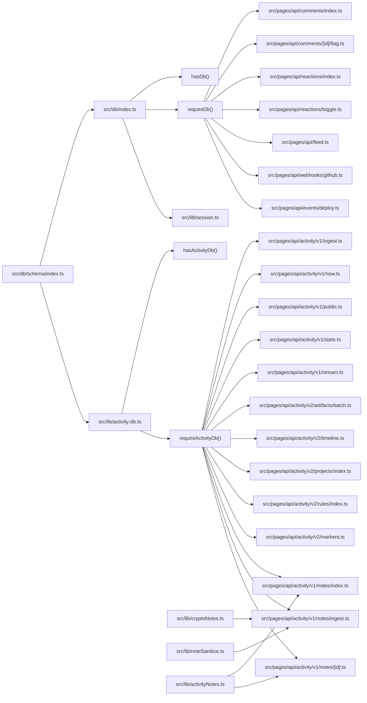

# Database Design

<cite>
**Referenced Files in This Document**
- [drizzle.config.ts](file://drizzle.config.ts)
- [0001_initial.sql](file://drizzle/0001_initial.sql)
- [0002_activity_monitoring.sql](file://drizzle/0002_activity_monitoring.sql)
- [0003_activity_notes.sql](file://drizzle/0003_activity_notes.sql)
- [0004_activity_v2.sql](file://drizzle/0004_activity_v2.sql)
- [_journal.json](file://drizzle/meta/_journal.json)
- [schema/index.ts](file://src/db/schema/index.ts)
- [db/index.ts](file://src/db/index.ts)
- [activity-db.ts](file://src/lib/activity-db.ts)
- [activity.ts](file://src/lib/activity.ts)
- [session.ts](file://src/lib/session.ts)
- [auth.ts](file://src/lib/auth.ts)
- [activityNotes.ts](file://src/lib/activityNotes.ts)
- [cryptoNotes.ts](file://src/lib/cryptoNotes.ts)
- [noteSanitize.ts](file://src/lib/noteSanitize.ts)
- [activity/v1/ingest.ts](file://src/pages/api/activity/v1/ingest.ts)
- [activity/v1/now.ts](file://src/pages/api/activity/v1/now.ts)
- [activity/v1/public.ts](file://src/pages/api/activity/v1/public.ts)
- [activity/v1/stats.ts](file://src/pages/api/activity/v1/stats.ts)
- [activity/v1/stream.ts](file://src/pages/api/activity/v1/stream.ts)
- [activity/v1/notes/index.ts](file://src/pages/api/activity/v1/notes/index.ts)
- [activity/v1/notes/ingest.ts](file://src/pages/api/activity/v1/notes/ingest.ts)
- [activity/v1/notes/[id].ts](file://src/pages/api/activity/v1/notes/[id].ts)
- [activity/v2/artifacts/batch.ts](file://src/pages/api/activity/v2/artifacts/batch.ts)
- [activity/v2/timeline.ts](file://src/pages/api/activity/v2/timeline.ts)
- [activity/v2/projects/index.ts](file://src/pages/api/activity/v2/projects/index.ts)
- [activity/v2/rules/index.ts](file://src/pages/api/activity/v2/rules/index.ts)
- [activity/v2/markers.ts](file://src/pages/api/activity/v2/markers.ts)
- [comments/index.ts](file://src/pages/api/comments/index.ts)
- [comments/[id]/flag.ts](file://src/pages/api/comments/[id]/flag.ts)
- [reactions/index.ts](file://src/pages/api/reactions/index.ts)
- [reactions/toggle.ts](file://src/pages/api/reactions/toggle.ts)
- [feed.ts](file://src/pages/api/feed.ts)
- [webhooks/github.ts](file://src/pages/api/webhooks/github.ts)
- [events/deploy.ts](file://src/pages/api/events/deploy.ts)
- [.env](file://.env)
- [.env.example](file://.env.example)
</cite>

## Update Summary
**Changes Made**
- Added comprehensive documentation for the new v2 PostgreSQL schema with 6 new tables: activity_projects, activity_rules, activity_artifacts, activity_sessions, activity_daily_summaries, and activity_post_drafts
- Documented the enhanced activity_notes table with new project_slug and session_id columns for v2 integration
- Added new API endpoints for v2 activity management including artifacts batch ingestion, timeline queries, project management, rule management, and manual markers
- Updated architecture diagrams to include the complete v2 activity monitoring system with project catalog, inference rules, artifacts, sessions, and content generation
- Enhanced security documentation with admin token authentication for v2 endpoints and device-based authentication for artifact ingestion
- Updated migration strategy to include the new v2 migration (0004) with comprehensive indexing strategies and unique constraints

## Table of Contents
1. [Introduction](#introduction)
2. [Project Structure](#project-structure)
3. [Core Components](#core-components)
4. [Architecture Overview](#architecture-overview)
5. [Detailed Component Analysis](#detailed-component-analysis)
6. [Activity Monitoring System](#activity-monitoring-system)
7. [Activity Notes System](#activity-notes-system)
8. [Activity v2 System](#activity-v2-system)
9. [Dependency Analysis](#dependency-analysis)
10. [Performance Considerations](#performance-considerations)
11. [Security and Privacy](#security-and-privacy)
12. [Troubleshooting Guide](#troubleshooting-guide)
13. [Conclusion](#conclusion)
14. [Appendices](#appendices)

## Introduction
This document describes the database design and data model for the rodion.pro application. It focuses on the relational schema, entity relationships, indexes, and constraints defined by the initial migration and Drizzle ORM schema. The schema now includes a comprehensive activity monitoring system for tracking user computer activity across devices, a secure activity notes system for encrypted quick notes, and a complete v2 activity management system with project catalog, inference rules, artifacts, sessions, and content generation capabilities. It also documents Drizzle ORM configuration, typical query patterns used by API endpoints, and operational considerations such as migration management, indexing strategies, and access control patterns.

**Updated** Enhanced with the new v2 PostgreSQL schema featuring six specialized tables for advanced activity analysis and content generation. The system now supports project-based categorization, automated inference rules, factual artifact tracking, normalized session analysis, daily summaries, and social media post drafts with comprehensive privacy controls and admin management interfaces.

## Project Structure
The database layer is organized around Drizzle ORM with a single schema definition module exporting typed table definitions. Migrations are managed by Drizzle Kit and stored under the drizzle directory. The runtime database client is initialized in a dedicated module and exported for use across the application with graceful fallback capabilities and comprehensive availability checking. The activity monitoring system operates on a separate database connection with its own authentication and security model, now including the new v2 activity management system with comprehensive API endpoints and enhanced security controls.

```mermaid
graph TB
subgraph "Drizzle Configuration"
DCFG["drizzle.config.ts"]
JRN["_journal.json"]
end
subgraph "Schema Definition"
SCHEMA["src/db/schema/index.ts"]
end
subgraph "Runtime DB Client"
DBIDX["src/db/index.ts"]
ACTIVITY_DB["src/lib/activity-db.ts"]
HASDB["hasDb()"]
REQDB["requireDb()"]
HASACTDB["hasActivityDb()"]
REQACTDB["requireActivityDb()"]
END
subgraph "Core API Endpoints"
API_COMMENTS["src/pages/api/comments/index.ts"]
API_FLAGS["src/pages/api/comments/[id]/flag.ts"]
API_REACTIONS["src/pages/api/reactions/index.ts"]
API_TOGGLE["src/pages/api/reactions/toggle.ts"]
API_FEED["src/pages/api/feed.ts"]
API_GITHUB["src/pages/api/webhooks/github.ts"]
API_DEPLOY["src/pages/api/events/deploy.ts"]
end
subgraph "Activity v1 API Endpoints"
API_INGEST["src/pages/api/activity/v1/ingest.ts"]
API_NOW["src/pages/api/activity/v1/now.ts"]
API_PUBLIC["src/pages/api/activity/v1/public.ts"]
API_STATS["src/pages/api/activity/v1/stats.ts"]
API_STREAM["src/pages/api/activity/v1/stream.ts"]
end
subgraph "Activity v2 API Endpoints"
API_V2_ARTIFACTS["src/pages/api/activity/v2/artifacts/batch.ts"]
API_V2_TIMELINE["src/pages/api/activity/v2/timeline.ts"]
API_V2_PROJECTS["src/pages/api/activity/v2/projects/index.ts"]
API_V2_RULES["src/pages/api/activity/v2/rules/index.ts"]
API_V2_MARKERS["src/pages/api/activity/v2/markers.ts"]
end
subgraph "Activity Notes API Endpoints"
API_NOTES_INDEX["src/pages/api/activity/v1/notes/index.ts"]
API_NOTES_INGEST["src/pages/api/activity/v1/notes/ingest.ts"]
API_NOTES_ID["src/pages/api/activity/v1/notes/[id].ts"]
end
subgraph "Encryption & Sanitization"
CRYPTO["src/lib/cryptoNotes.ts"]
SANITIZE["src/lib/noteSanitize.ts"]
NOTES_UTIL["src/lib/activityNotes.ts"]
END
subgraph "Auth & Session"
SESS["src/lib/session.ts"]
AUTH["src/lib/auth.ts"]
ACTIVITY_AUTH["src/lib/activity.ts"]
END
DCFG --> JRN
SCHEMA --> DBIDX
SCHEMA --> ACTIVITY_DB
DBIDX --> HASDB
DBIDX --> REQDB
ACTIVITY_DB --> HASACTDB
ACTIVITY_DB --> REQACTDB
REQDB --> API_COMMENTS
REQDB --> API_FLAGS
REQDB --> API_REACTIONS
REQDB --> API_TOGGLE
REQDB --> API_FEED
REQDB --> API_GITHUB
REQDB --> API_DEPLOY
REQACTDB --> API_INGEST
REQACTDB --> API_NOW
REQACTDB --> API_PUBLIC
REQACTDB --> API_STATS
REQACTDB --> API_STREAM
REQACTDB --> API_V2_ARTIFACTS
REQACTDB --> API_V2_TIMELINE
REQACTDB --> API_V2_PROJECTS
REQACTDB --> API_V2_RULES
REQACTDB --> API_V2_MARKERS
REQACTDB --> API_NOTES_INDEX
REQACTDB --> API_NOTES_INGEST
REQACTDB --> API_NOTES_ID
DBIDX --> SESS
SESS --> AUTH
ACTIVITY_DB --> ACTIVITY_AUTH
CRYPTO --> API_NOTES_INGEST
SANITIZE --> API_NOTES_INGEST
NOTES_UTIL --> API_NOTES_INDEX
NOTES_UTIL --> API_NOTES_ID
```

**Diagram sources**
- [drizzle.config.ts:1-11](file://drizzle.config.ts#L1-L11)
- [_journal.json:1-21](file://drizzle/meta/_journal.json#L1-L21)
- [schema/index.ts:1-325](file://src/db/schema/index.ts#L1-L325)
- [db/index.ts:1-37](file://src/db/index.ts#L1-L37)
- [activity-db.ts:1-49](file://src/lib/activity-db.ts#L1-L49)
- [activity.ts:1-154](file://src/lib/activity.ts#L1-L154)
- [session.ts:1-58](file://src/lib/session.ts#L1-L58)
- [auth.ts:1-101](file://src/lib/auth.ts#L1-L101)
- [activity/v1/ingest.ts:1-188](file://src/pages/api/activity/v1/ingest.ts#L1-L188)
- [activity/v1/now.ts:1-106](file://src/pages/api/activity/v1/now.ts#L1-L106)
- [activity/v1/public.ts:1-65](file://src/pages/api/activity/v1/public.ts#L1-L65)
- [activity/v1/stats.ts:1-273](file://src/pages/api/activity/v1/stats.ts#L1-L273)
- [activity/v1/stream.ts:1-129](file://src/pages/api/activity/v1/stream.ts#L1-L129)
- [activity/v2/artifacts/batch.ts:1-82](file://src/pages/api/activity/v2/artifacts/batch.ts#L1-L82)
- [activity/v2/timeline.ts:1-90](file://src/pages/api/activity/v2/timeline.ts#L1-L90)
- [activity/v2/projects/index.ts:1-74](file://src/pages/api/activity/v2/projects/index.ts#L1-L74)
- [activity/v2/rules/index.ts:1-76](file://src/pages/api/activity/v2/rules/index.ts#L1-L76)
- [activity/v2/markers.ts:1-49](file://src/pages/api/activity/v2/markers.ts#L1-L49)
- [activity/v1/notes/index.ts:1-87](file://src/pages/api/activity/v1/notes/index.ts#L1-L87)
- [activity/v1/notes/ingest.ts:1-109](file://src/pages/api/activity/v1/notes/ingest.ts#L1-L109)
- [activity/v1/notes/[id].ts](file://src/pages/api/activity/v1/notes/[id].ts#L1-L126)
- [cryptoNotes.ts:1-45](file://src/lib/cryptoNotes.ts#L1-L45)
- [noteSanitize.ts:1-30](file://src/lib/noteSanitize.ts#L1-L30)
- [activityNotes.ts:1-108](file://src/lib/activityNotes.ts#L1-L108)

**Section sources**
- [drizzle.config.ts:1-11](file://drizzle.config.ts#L1-L11)
- [0001_initial.sql:1-94](file://drizzle/0001_initial.sql#L1-L94)
- [0002_activity_monitoring.sql:1-46](file://drizzle/0002_activity_monitoring.sql#L1-L46)
- [0003_activity_notes.sql:1-24](file://drizzle/0003_activity_notes.sql#L1-L24)
- [0004_activity_v2.sql:1-121](file://drizzle/0004_activity_v2.sql#L1-L121)
- [schema/index.ts:1-325](file://src/db/schema/index.ts#L1-L325)
- [db/index.ts:1-37](file://src/db/index.ts#L1-L37)
- [activity-db.ts:1-49](file://src/lib/activity-db.ts#L1-L49)

## Core Components
This section documents the primary tables and their fields, data types, and constraints. It also outlines the Drizzle ORM configuration and initialization with enhanced error handling capabilities and comprehensive availability checking.

- Drizzle ORM configuration
  - Schema path: src/db/schema/index.ts
  - Output directory for migrations: drizzle
  - Dialect: PostgreSQL
  - Credentials: DATABASE_URL environment variable (supports both process.env and import.meta.env)

- Database client initialization with robust availability checking
  - Core database: Connection pooling and timeouts configured with max: 10, idle_timeout: 20, connect_timeout: 10
  - Activity database: Separate connection for activity monitoring with dedicated authentication
  - Exports a drizzle instance bound to the schema
  - Provides helper functions: hasDb() and requireDb() for core database, hasActivityDb() and requireActivityDb() for activity database
  - Graceful fallback when DATABASE_URL is missing or connection fails with console warnings
  - All API endpoints implement consistent availability checking with HTTP 503 responses

- Entities and fields
  - Users: identity and profile attributes with a banned flag
  - OAuth accounts: provider-linked identities with uniqueness constraint
  - Sessions: session tokens with expiry and foreign-key cascade on user deletion
  - Comments: threaded comments with hierarchical parent-child relations and soft-delete/visibility flags
  - Reactions: emoji reactions scoped by target type/key with uniqueness constraint
  - Comment flags: moderation reports linked to comments
  - Events: changelog entries with timestamps, categorization, tags, and JSON payload
  - Activity devices: registered devices with API key hashing and last seen tracking
  - Activity minute aggregation: time-series data with unique constraints for data integrity
  - Activity now: real-time status tracking with daily counter resets
  - Activity notes: encrypted quick notes with UUID primary keys, device-based organization, and v2 integration fields
  - Activity projects: project catalog with patterns for inference and categorization
  - Activity rules: inference rules for project/category/activity assignment
  - Activity artifacts: factual context artifacts beyond heartbeats with privacy levels
  - Activity sessions: normalized session blocks with confidence metrics
  - Activity daily summaries: persistent daily summary facts with generated content
  - Activity post drafts: generated post variants for various platforms

**Updated** Enhanced with the new v2 activity system featuring six specialized tables for advanced activity analysis and content generation. The activity_notes table now includes project_slug and session_id columns for enhanced v2 integration. All foreign key columns consistently use bigint data type for improved PostgreSQL compatibility and foreign key constraint enforcement.

**Section sources**
- [drizzle.config.ts:1-11](file://drizzle.config.ts#L1-L11)
- [schema/index.ts:1-325](file://src/db/schema/index.ts#L1-L325)
- [db/index.ts:1-37](file://src/db/index.ts#L1-L37)
- [activity-db.ts:1-49](file://src/lib/activity-db.ts#L1-L49)
- [0001_initial.sql:1-94](file://drizzle/0001_initial.sql#L1-L94)
- [0002_activity_monitoring.sql:1-46](file://drizzle/0002_activity_monitoring.sql#L1-L46)
- [0003_activity_notes.sql:1-24](file://drizzle/0003_activity_notes.sql#L1-L24)
- [0004_activity_v2.sql:1-121](file://drizzle/0004_activity_v2.sql#L1-L121)

## Architecture Overview
The database architecture centers on a single schema module that defines all tables and indexes. API endpoints use the shared drizzle client to perform reads and writes with proper error handling. Authentication and session retrieval rely on the sessions table to derive the current user, with graceful fallback when database is unavailable. The new v2 activity monitoring system operates independently with its own security model and database connection, featuring comprehensive project management, artifact tracking, session analysis, and content generation capabilities.

```mermaid
erDiagram
USERS {
bigint id PK
text email UK
text name
text avatar_url
timestamptz created_at
boolean is_banned
}
OAUTH_ACCOUNTS {
bigserial id PK
bigint user_id FK
text provider
text provider_user_id
timestamptz created_at
}
SESSIONS {
text id PK
bigint user_id FK
timestamptz expires_at
timestamptz created_at
}
COMMENTS {
bigserial id PK
text page_type
text page_key
text lang
bigint user_id FK
bigint parent_id FK
text body
timestamptz created_at
timestamptz updated_at
boolean is_hidden
boolean is_deleted
}
REACTIONS {
bigserial id PK
text target_type
text target_key
text lang
bigint user_id FK
text emoji
timestamptz created_at
}
COMMENT_FLAGS {
bigserial id PK
bigint comment_id FK
bigint user_id FK
text reason
timestamptz created_at
}
EVENTS {
bigserial id PK
timestamptz ts
text source
text kind
text project
text title
text url
text[] tags
jsonb payload
}
ACTIVITY_DEVICES {
text id PK
text name
text api_key_hash
timestamptz created_at
timestamptz last_seen_at
}
ACTIVITY_MINUTE_AGG {
bigserial id PK
text device_id FK
timestamptz ts_minute
text app
text window_title
text category
integer active_sec
integer afk_sec
integer keys
integer clicks
integer scroll
}
ACTIVITY_NOW {
text device_id PK
timestamptz updated_at
text app
text window_title
text category
boolean is_afk
integer counts_today_keys
integer counts_today_clicks
integer counts_today_scroll
integer counts_today_active_sec
}
ACTIVITY_NOTES {
uuid id PK
text device_id FK
timestamptz created_at
text app
text category
text tag
text title
text preview
integer len
bytea content_enc
jsonb meta
text project_slug
uuid session_id
}
ACTIVITY_PROJECTS {
bigserial id PK
text slug UK
text name
text repo_path_pattern
text repo_remote_pattern
text domain_pattern
text branch_pattern
boolean is_active
text color
timestamptz created_at
timestamptz updated_at
}
ACTIVITY_RULES {
bigserial id PK
integer priority
boolean is_enabled
text source_type
text match_kind
text match_value
text result_project_slug
text result_category
text result_activity_type
integer confidence
timestamptz created_at
timestamptz updated_at
}
ACTIVITY_ARTIFACTS {
uuid id PK
text device_id FK
timestamptz occurred_at
text project_slug
text artifact_type
text source_app
text title
jsonb payload_json
text privacy_level
text fingerprint UK
timestamptz created_at
}
ACTIVITY_SESSIONS {
uuid id PK
text device_id FK
timestamptz started_at
timestamptz ended_at
integer duration_sec
text project_slug
text category
text activity_type
text primary_app
text primary_title
boolean is_afk
integer keys
integer clicks
integer scroll
integer confidence
text source_version
timestamptz created_at
timestamptz updated_at
}
ACTIVITY_DAILY_SUMMARIES {
bigserial id PK
text device_id FK
date date
jsonb facts_json
text short_summary
text long_summary
text public_post_draft
text internal_log_draft
integer confidence_score
text model_name
timestamptz generated_at
timestamptz updated_at
}
ACTIVITY_POST_DRAFTS {
bigserial id PK
date date
text device_id FK
text target
text style
text title
text content
jsonb facts_json
text status
timestamptz created_at
timestamptz updated_at
}
USERS ||--o{ OAUTH_ACCOUNTS : "has"
USERS ||--o{ SESSIONS : "has"
USERS ||--o{ COMMENTS : "author"
USERS ||--o{ COMMENT_FLAGS : "reporter"
USERS ||--o{ REACTIONS : "user"
COMMENTS ||--o{ COMMENT_FLAGS : "reported"
COMMENTS ||--o{ COMMENTS : "parent"
ACTIVITY_MINUTE_AGG ||--|| ACTIVITY_DEVICES : "belongs_to"
ACTIVITY_NOW ||--|| ACTIVITY_DEVICES : "belongs_to"
ACTIVITY_NOTES ||--|| ACTIVITY_DEVICES : "belongs_to"
ACTIVITY_ARTIFACTS ||--|| ACTIVITY_DEVICES : "belongs_to"
ACTIVITY_SESSIONS ||--|| ACTIVITY_DEVICES : "belongs_to"
ACTIVITY_DAILY_SUMMARIES ||--|| ACTIVITY_DEVICES : "belongs_to"
ACTIVITY_POST_DRAFTS ||--|| ACTIVITY_DEVICES : "belongs_to"
ACTIVITY_ARTIFACTS ||--|| ACTIVITY_PROJECTS : "mapped_by"
ACTIVITY_SESSIONS ||--|| ACTIVITY_PROJECTS : "mapped_by"
ACTIVITY_DAILY_SUMMARIES ||--|| ACTIVITY_PROJECTS : "related_to"
```



**Diagram sources**
- [schema/index.ts:3-325](file://src/db/schema/index.ts#L3-L325)
- [0001_initial.sql:4-94](file://drizzle/0001_initial.sql#L4-L94)
- [0002_activity_monitoring.sql:3-46](file://drizzle/0002_activity_monitoring.sql#L3-L46)
- [0003_activity_notes.sql:2-19](file://drizzle/0003_activity_notes.sql#L2-L19)
- [0004_activity_v2.sql:4-98](file://drizzle/0004_activity_v2.sql#L4-L98)

**Section sources**
- [schema/index.ts:3-325](file://src/db/schema/index.ts#L3-L325)
- [0001_initial.sql:4-94](file://drizzle/0001_initial.sql#L4-L94)
- [0002_activity_monitoring.sql:3-46](file://drizzle/0002_activity_monitoring.sql#L3-L46)
- [0003_activity_notes.sql:1-24](file://drizzle/0003_activity_notes.sql#L1-L24)
- [0004_activity_v2.sql:1-121](file://drizzle/0004_activity_v2.sql#L1-L121)

## Detailed Component Analysis

### Users
- Purpose: Store user identity and profile metadata.
- Key constraints: Unique email.
- Additional fields: Name, avatar URL, creation timestamp, banned flag.
- Access pattern: Joined with comments and reactions for display; checked for bans during session resolution.
- Data type consistency: Primary key uses bigserial for auto-incrementing identity.

**Section sources**
- [schema/index.ts:17-24](file://src/db/schema/index.ts#L17-L24)
- [0001_initial.sql:5-12](file://drizzle/0001_initial.sql#L5-L12)
- [session.ts:43-45](file://src/lib/session.ts#L43-L45)

### OAuth Accounts
- Purpose: Link provider identities to users.
- Constraints: Composite unique(provider, provider_user_id).
- Access pattern: Used during sign-in flows to associate or retrieve user records.
- Data type consistency: Foreign key column uses bigint for PostgreSQL compatibility.

**Section sources**
- [schema/index.ts:27-35](file://src/db/schema/index.ts#L27-L35)
- [0001_initial.sql:15-22](file://drizzle/0001_initial.sql#L15-L22)

### Sessions
- Purpose: Maintain authenticated sessions with expiry.
- Constraints: Cascade delete on user deletion; indexes on user_id and expires_at.
- Access pattern: Verified by API endpoints to resolve current user; session cookie is HttpOnly and secure in production.
- Data type consistency: Foreign key column uses bigint for PostgreSQL compatibility.

**Section sources**
- [schema/index.ts:38-46](file://src/db/schema/index.ts#L38-L46)
- [0001_initial.sql:25-30](file://drizzle/0001_initial.sql#L25-L30)
- [session.ts:27-32](file://src/lib/session.ts#L27-L32)
- [auth.ts:15-23](file://src/lib/auth.ts#L15-L23)

### Comments
- Purpose: Threaded comments associated with pages and languages.
- Hierarchical relation: parent_id references comments.id with cascade delete.
- Visibility: Soft delete and hidden flags; deleted bodies are omitted in API responses.
- Indexes: Composite index on (page_type, page_key, lang, created_at); index on parent_id.
- Access pattern: API lists comments per page/lang and builds nested trees; reactions counts are aggregated separately.
- Data type consistency: Both user_id and parent_id foreign keys use bigint for PostgreSQL compatibility.

**Section sources**
- [schema/index.ts:49-64](file://src/db/schema/index.ts#L49-L64)
- [0001_initial.sql:36-48](file://drizzle/0001_initial.sql#L36-L48)
- [comments/index.ts:6-163](file://src/pages/api/comments/index.ts#L6-L163)

### Reactions
- Purpose: Emoji reactions for posts and comments.
- Uniqueness: target_type + target_key + user_id + emoji combination ensures one reaction per user per target per emoji.
- Indexes: target_type + target_key; user_id.
- Access pattern: Aggregated counts per emoji and current user's reactions returned by API.
- Data type consistency: Foreign key column uses bigint for PostgreSQL compatibility.

**Section sources**
- [schema/index.ts:67-79](file://src/db/schema/index.ts#L67-L79)
- [0001_initial.sql:54-63](file://drizzle/0001_initial.sql#L54-L63)
- [reactions/index.ts:6-80](file://src/pages/api/reactions/index.ts#L6-L80)
- [reactions/toggle.ts:8-83](file://src/pages/api/reactions/toggle.ts#L8-L83)

### Comment Flags
- Purpose: Moderation reports for comments.
- Index: comment_id for efficient lookups.
- Access pattern: API endpoint creates flags for reported comments.
- Data type consistency: Foreign key columns use bigint for PostgreSQL compatibility.

**Section sources**
- [schema/index.ts:82-90](file://src/db/schema/index.ts#L82-L90)
- [0001_initial.sql:69-75](file://drizzle/0001_initial.sql#L69-L75)
- [comments/[id]/flag.ts](file://src/pages/api/comments/[id]/flag.ts#L7-L67)

### Events (Changelog)
- Purpose: Store changelog entries with timestamps, categorization, tags, and JSON payload.
- Indexes: ts descending; project.
- Access pattern: API endpoint supports pagination and filtering by project.

**Section sources**
- [schema/index.ts:93-106](file://src/db/schema/index.ts#L93-L106)
- [0001_initial.sql:80-94](file://drizzle/0001_initial.sql#L80-L94)
- [feed.ts:5-54](file://src/pages/api/feed.ts#L5-L54)

### Webhooks and Deployment Events
- Purpose: GitHub webhook processing and deployment event logging.
- GitHub webhook: Verifies signatures, processes push and release events, inserts changelog entries.
- Deploy events: Token-authenticated deployment logging with project, version, and environment information.

**Section sources**
- [webhooks/github.ts:47-141](file://src/pages/api/webhooks/github.ts#L47-L141)
- [events/deploy.ts:4-60](file://src/pages/api/events/deploy.ts#L4-L60)

### Drizzle ORM Configuration and Enhanced Initialization
- Configuration: Schema path, output directory, dialect, and credentials URL.
- Client: Uses postgres-js with connection pool limits and timeouts; binds the schema for type-safe queries.
- Safety: Graceful fallback when DATABASE_URL is missing or connection fails; console warnings instead of throwing errors.
- Utility functions: hasDb() for availability checks, requireDb() for safe access with clear error messages.
- Activity database: Separate connection management with dedicated authentication and security controls.

**Section sources**
- [drizzle.config.ts:3-10](file://drizzle.config.ts#L3-L10)
- [db/index.ts:5-34](file://src/db/index.ts#L5-L34)
- [activity-db.ts:1-49](file://src/lib/activity-db.ts#L1-L49)

### API Query Patterns and Enhanced Error Handling
- Comments listing: Left join with users; filter by page_type, page_key, lang; order by created_at; aggregate reaction counts and current user's reactions; build nested tree.
- Reactions listing: Aggregate counts by emoji; optionally filter by language for posts; fetch current user's reactions.
- Toggle reaction: Upsert-like behavior using uniqueness constraint; insert or delete based on existence.
- Flag comment: Insert a moderation report record.
- Feed: Paginated query with total count; optional project filter.
- Activity ingestion: Device authentication, time-series splitting, minute-level aggregation with conflict resolution.
- Real-time streaming: Server-Sent Events with connection management and broadcasting.
- Statistics: Time-series aggregation with category filtering and window-based breakdowns.
- Activity notes: Device-based queries with admin authentication; encryption/decryption for content access.
- Activity v2 artifacts: Batch ingestion with deduplication and privacy level enforcement.
- Activity v2 timeline: Session and artifact queries with on-the-fly sessionization fallback.
- Activity v2 projects: Admin-only CRUD operations with pattern-based project management.
- Activity v2 rules: Admin-only CRUD operations with priority-based rule evaluation.
- Activity v2 markers: Manual marker creation with deduplication and privacy controls.

**Section sources**
- [comments/index.ts:6-162](file://src/pages/api/comments/index.ts#L6-L162)
- [reactions/index.ts:6-80](file://src/pages/api/reactions/index.ts#L6-L80)
- [reactions/toggle.ts:8-83](file://src/pages/api/reactions/toggle.ts#L8-L83)
- [comments/[id]/flag.ts](file://src/pages/api/comments/[id]/flag.ts#L7-L67)
- [feed.ts:5-53](file://src/pages/api/feed.ts#L5-L53)
- [webhooks/github.ts:47-141](file://src/pages/api/webhooks/github.ts#L47-L141)
- [events/deploy.ts:4-60](file://src/pages/api/events/deploy.ts#L4-L60)
- [activity/v1/ingest.ts:6-188](file://src/pages/api/activity/v1/ingest.ts#L6-L188)
- [activity/v1/now.ts:11-106](file://src/pages/api/activity/v1/now.ts#L11-L106)
- [activity/v1/stats.ts:7-273](file://src/pages/api/activity/v1/stats.ts#L7-L273)
- [activity/v1/stream.ts:12-129](file://src/pages/api/activity/v1/stream.ts#L12-L129)
- [activity/v1/notes/index.ts:6-86](file://src/pages/api/activity/v1/notes/index.ts#L6-L86)
- [activity/v1/notes/ingest.ts:10-109](file://src/pages/api/activity/v1/notes/ingest.ts#L10-L109)
- [activity/v1/notes/[id].ts](file://src/pages/api/activity/v1/notes/[id].ts#L7-L125)
- [activity/v2/artifacts/batch.ts:9-82](file://src/pages/api/activity/v2/artifacts/batch.ts#L9-L82)
- [activity/v2/timeline.ts:8-90](file://src/pages/api/activity/v2/timeline.ts#L8-L90)
- [activity/v2/projects/index.ts:8-74](file://src/pages/api/activity/v2/projects/index.ts#L8-L74)
- [activity/v2/rules/index.ts:8-76](file://src/pages/api/activity/v2/rules/index.ts#L8-L76)
- [activity/v2/markers.ts:7-49](file://src/pages/api/activity/v2/markers.ts#L7-L49)

### Access Control and Security
- Session-based authentication: Session cookie validated against sessions table with expiry check; user lookup and ban check.
- Admin gating: Email-based admin check for moderation endpoints.
- Cookie security: HttpOnly, secure in production, SameSite lax, fixed duration.
- Rate limiting and anti-abuse: Not shown in database schema but noted in project documentation.
- Device authentication: SHA-256 hashed API keys for activity devices with per-request verification.
- Admin token authentication: Bearer token validation for administrative access to activity endpoints.
- Privacy controls: Application blacklisting and title filtering capabilities for sensitive data protection.
- Activity notes encryption: AES-256-GCM encryption with environment-managed keys for content protection.
- Activity v2 security: Device-based authentication for artifact ingestion, admin token authentication for management endpoints, privacy levels for artifact visibility.

**Section sources**
- [session.ts:27-53](file://src/lib/session.ts#L27-L53)
- [auth.ts:15-23](file://src/lib/auth.ts#L15-L23)
- [auth.ts:97-100](file://src/lib/auth.ts#L97-L100)
- [activity.ts:146-154](file://src/lib/activity.ts#L146-L154)
- [activity/v1/now.ts:34-76](file://src/pages/api/activity/v1/now.ts#L34-L76)
- [activity/v1/stats.ts:44-83](file://src/pages/api/activity/v1/stats.ts#L44-L83)
- [activity/v1/stream.ts:35-86](file://src/pages/api/activity/v1/stream.ts#L35-L86)
- [activity/v1/notes/index.ts:14-20](file://src/pages/api/activity/v1/notes/index.ts#L14-L20)
- [activity/v1/notes/ingest.ts:25-33](file://src/pages/api/activity/v1/notes/ingest.ts#L25-L33)
- [activity/v1/notes/[id].ts](file://src/pages/api/activity/v1/notes/[id].ts#L22-L28)
- [activity/v2/artifacts/batch.ts:10-11](file://src/pages/api/activity/v2/artifacts/batch.ts#L10-L11)
- [activity/v2/timeline.ts:22-23](file://src/pages/api/activity/v2/timeline.ts#L22-L23)
- [activity/v2/projects/index.ts:10-10](file://src/pages/api/activity/v2/projects/index.ts#L10-L10)
- [activity/v2/rules/index.ts:10-10](file://src/pages/api/activity/v2/rules/index.ts#L10-L10)
- [activity/v2/markers.ts:8-9](file://src/pages/api/activity/v2/markers.ts#L8-L9)

## Activity Monitoring System

### Activity Devices
- Purpose: Register and track devices that send telemetry data to the system.
- Key constraints: Primary key on device ID; API key hash stored for authentication.
- Additional fields: Device name, API key hash, creation timestamp, last seen timestamp.
- Security: API key stored as SHA-256 hash; device authentication performed via header-based verification.
- Access pattern: Device registration and authentication; cascade delete ensures orphan cleanup.

**Section sources**
- [schema/index.ts:111-117](file://src/db/schema/index.ts#L111-L117)
- [0002_activity_monitoring.sql:3-9](file://drizzle/0002_activity_monitoring.sql#L3-L9)
- [activity/v1/ingest.ts:28-37](file://src/pages/api/activity/v1/ingest.ts#L28-L37)
- [activity/v1/now.ts:34-47](file://src/pages/api/activity/v1/now.ts#L34-L47)

### Activity Minute Aggregation
- Purpose: Store time-series activity data aggregated at minute granularity.
- Key constraints: Composite unique constraint on (device_id, ts_minute, app, window_title, category).
- Additional fields: App name, window title, category, activity/AFK seconds, input counts (keys, clicks, scroll).
- Indexes: Composite index on (device_id, ts_minute) and category index for efficient querying.
- Data integrity: Upsert operations merge overlapping time periods; prevents duplicate entries.
- Access pattern: Time-series queries with grouping and aggregation; supports hourly/dayly rollups.

**Section sources**
- [schema/index.ts:120-136](file://src/db/schema/index.ts#L120-L136)
- [0002_activity_monitoring.sql:11-24](file://drizzle/0002_activity_monitoring.sql#L11-L24)
- [0002_activity_monitoring.sql:43-45](file://drizzle/0002_activity_monitoring.sql#L43-L45)
- [activity/v1/ingest.ts:75-104](file://src/pages/api/activity/v1/ingest.ts#L75-L104)
- [activity/v1/stats.ts:106-118](file://src/pages/api/activity/v1/stats.ts#L106-L118)

### Activity Now
- Purpose: Maintain real-time status for each device with daily counter resets.
- Key constraints: Primary key on device_id with foreign key reference to activity_devices.
- Additional fields: App/window information, category, AFK status, daily counters for inputs and activity time.
- Daily logic: Automatic counter reset at midnight; same-day accumulation for subsequent updates.
- Access pattern: Real-time status queries; supports device-specific and public status endpoints.

**Section sources**
- [schema/index.ts:139-150](file://src/db/schema/index.ts#L139-L150)
- [0002_activity_monitoring.sql:26-37](file://drizzle/0002_activity_monitoring.sql#L26-L37)
- [activity/v1/ingest.ts:106-157](file://src/pages/api/activity/v1/ingest.ts#L106-L157)
- [activity/v1/now.ts:74-84](file://src/pages/api/activity/v1/now.ts#L74-L84)

### API Endpoints for Activity Monitoring
- Ingest endpoint: Handles device authentication, time-series splitting, minute-level aggregation, and real-time broadcasting.
- Now endpoint: Returns current device status with flexible authentication (device key, admin token, or session).
- Public endpoint: Provides anonymous status for public display with privacy-safe aggregations.
- Stats endpoint: Comprehensive analytics with time-series breakdowns, top applications, categories, and window titles.
- Stream endpoint: Server-Sent Events for real-time device status updates with connection management.

**Section sources**
- [activity/v1/ingest.ts:6-188](file://src/pages/api/activity/v1/ingest.ts#L6-L188)
- [activity/v1/now.ts:11-106](file://src/pages/api/activity/v1/now.ts#L11-L106)
- [activity/v1/public.ts:5-65](file://src/pages/api/activity/v1/public.ts#L5-L65)
- [activity/v1/stats.ts:7-273](file://src/pages/api/activity/v1/stats.ts#L7-L273)
- [activity/v1/stream.ts:12-129](file://src/pages/api/activity/v1/stream.ts#L12-L129)

### Privacy Controls and Data Protection
- Application blacklisting: Sensitive application names can be filtered from public views.
- Title filtering: Window titles can be anonymized or filtered to protect user privacy.
- Category classification: Activities categorized to reduce sensitive information exposure.
- Device-level access control: Each device requires authentication; public endpoints use privacy-safe aggregations.
- Data retention: Time-series data stored with appropriate indexing for efficient querying and potential purging.

**Section sources**
- [activity.ts:146-154](file://src/lib/activity.ts#L146-L154)
- [activity/v1/public.ts:34-50](file://src/pages/api/activity/v1/public.ts#L34-L50)
- [activity/v1/stats.ts:88-99](file://src/pages/api/activity/v1/stats.ts#L88-L99)

## Activity Notes System

### Activity Notes Table
- Purpose: Store encrypted quick notes with device-based organization and content preview.
- Key constraints: UUID primary key with random default; foreign key relationship to activity_devices.
- Data types: UUID for id, text for device_id, timestamptz for timestamps, bytea for encrypted content.
- Fields: app (nullable), category (defaults to 'unknown'), tag, title, preview (safe text), len (character count), content_enc (encrypted), meta (JSONB), project_slug (v2 integration), session_id (v2 integration).
- Indexes: Composite indexes on (device_id, created_at) and (device_id, app, created_at) for efficient querying.
- Encryption: Uses AES-256-GCM with 12-byte IV and 16-byte auth tag stored as packed byte array.

**Section sources**
- [schema/index.ts:153-180](file://src/db/schema/index.ts#L153-L180)
- [0003_activity_notes.sql:2-19](file://drizzle/0003_activity_notes.sql#L2-L19)
- [0003_activity_notes.sql:21-24](file://drizzle/0003_activity_notes.sql#L21-L24)
- [0004_activity_v2.sql:100-102](file://drizzle/0004_activity_v2.sql#L100-L102)

### Encryption Infrastructure
- Key management: AES-256-GCM encryption key stored in ACTIVITY_NOTES_KEY environment variable (32 bytes base64).
- Encryption format: Packed structure containing 12-byte IV + 16-byte auth tag + ciphertext.
- Decryption: Extracts IV and tag, verifies authenticity with GCM, then decrypts content.
- Key validation: Runtime checks ensure key length is exactly 32 bytes; throws error if missing or invalid.

**Section sources**
- [cryptoNotes.ts:1-45](file://src/lib/cryptoNotes.ts#L1-L45)
- [.env:24-24](file://.env#L24-L24)
- [.env.example:25-25](file://.env.example#L25-L25)

### Content Sanitization
- Sensitive pattern detection: Private key markers, JWT-like patterns, API key/token/secret/password indicators.
- Redaction algorithm: Masks long alphanumeric sequences and numeric strings for privacy protection.
- Preview generation: Creates one-line previews with configurable maximum length (default 160 characters).
- Decision logic: Automatically redacts content if suspicious patterns detected or explicit redaction requested.

**Section sources**
- [noteSanitize.ts:1-30](file://src/lib/noteSanitize.ts#L1-L30)

### API Endpoints for Activity Notes
- List notes: GET endpoint with admin authentication, supports device filtering, time ranges, app/tag filters, and pagination.
- Ingest note: POST endpoint with device authentication, validates content length, applies sanitization/redaction, performs encryption, and stores metadata.
- Get note: GET endpoint with admin authentication, decrypts content for authorized access.
- Delete note: DELETE endpoint with admin authentication, removes note securely.

**Section sources**
- [activity/v1/notes/index.ts:6-86](file://src/pages/api/activity/v1/notes/index.ts#L6-L86)
- [activity/v1/notes/ingest.ts:10-109](file://src/pages/api/activity/v1/notes/ingest.ts#L10-L109)
- [activity/v1/notes/[id].ts](file://src/pages/api/activity/v1/notes/[id].ts#L7-L125)

### Client Library Functions
- Fetch notes: Retrieves note previews with optional filtering parameters.
- Fetch note detail: Retrieves full note content with decryption.
- Create note: Sends note ingestion request with device credentials and optional redaction.
- Delete note: Removes notes with admin authentication.

**Section sources**
- [activityNotes.ts:27-107](file://src/lib/activityNotes.ts#L27-L107)

### Security and Privacy Controls
- Device authentication: X-Device-Id and X-Device-Key headers verified against registered devices.
- Admin authentication: Bearer token validation for accessing note content and managing notes.
- Content protection: All note content stored as encrypted bytea with authenticated encryption.
- Privacy safeguards: Automatic redaction of suspicious content, preview-only access for public views, and strict access controls.
- Audit trail: Metadata includes source, redaction status, and suspicious content detection.

**Section sources**
- [activity/v1/notes/ingest.ts:25-33](file://src/pages/api/activity/v1/notes/ingest.ts#L25-L33)
- [activity/v1/notes/ingest.ts:76-78](file://src/pages/api/activity/v1/notes/ingest.ts#L76-L78)
- [activity/v1/notes/[id].ts](file://src/pages/api/activity/v1/notes/[id].ts#L22-L28)
- [cryptoNotes.ts:35-44](file://src/lib/cryptoNotes.ts#L35-L44)

## Activity v2 System

### Activity Projects
- Purpose: Maintain project catalog with patterns for inference and categorization.
- Key constraints: Primary key on id; unique slug constraint for project identification.
- Additional fields: Name, repository patterns (path, remote, domain, branch), active status, color, timestamps.
- Indexes: Unique index on slug; composite index on active status for filtering.
- Access pattern: Admin CRUD operations; project lookup by slug for artifact and session mapping.
- Data type consistency: All foreign key columns use bigint for PostgreSQL compatibility.

**Section sources**
- [schema/index.ts:184-197](file://src/db/schema/index.ts#L184-L197)
- [0004_activity_v2.sql:4-17](file://drizzle/0004_activity_v2.sql#L4-L17)
- [activity/v2/projects/index.ts:8-74](file://src/pages/api/activity/v2/projects/index.ts#L8-L74)

### Activity Rules
- Purpose: Define inference rules for project/category/activity assignment from raw activity data.
- Key constraints: Primary key on id; composite index on (is_enabled, priority) for efficient rule evaluation.
- Additional fields: Priority, enabled status, source type, match kind, match value, result mappings, confidence score, timestamps.
- Indexes: activity_rules_enabled_priority_idx for rule evaluation optimization.
- Access pattern: Admin CRUD operations; rule evaluation for artifact and heartbeat processing.
- Data type consistency: All foreign key columns use bigint for PostgreSQL compatibility.

**Section sources**
- [schema/index.ts:200-215](file://src/db/schema/index.ts#L200-L215)
- [0004_activity_v2.sql:19-32](file://drizzle/0004_activity_v2.sql#L19-L32)
- [0004_activity_v2.sql](file://drizzle/0004_activity_v2.sql#L104)
- [activity/v2/rules/index.ts:8-76](file://src/pages/api/activity/v2/rules/index.ts#L8-L76)

### Activity Artifacts
- Purpose: Store factual context artifacts beyond heartbeats with privacy levels and deduplication.
- Key constraints: Primary key on UUID; unique fingerprint constraint for deduplication; foreign key to activity_devices.
- Additional fields: Occurrence timestamp, project slug, artifact type, source app, title, payload JSON, privacy level, fingerprint, timestamps.
- Indexes: Composite indexes on (device_id, occurred_at), (artifact_type, occurred_at), and (project_slug, occurred_at) for efficient querying.
- Access pattern: Batch ingestion with deduplication, privacy-aware queries, and timeline construction.
- Data type consistency: All foreign key columns use bigint for PostgreSQL compatibility.

**Section sources**
- [schema/index.ts:218-234](file://src/db/schema/index.ts#L218-L234)
- [0004_activity_v2.sql:34-47](file://drizzle/0004_activity_v2.sql#L34-L47)
- [0004_activity_v2.sql:106-110](file://drizzle/0004_activity_v2.sql#L106-L110)
- [activity/v2/artifacts/batch.ts:9-82](file://src/pages/api/activity/v2/artifacts/batch.ts#L9-L82)
- [activity/v2/markers.ts:7-49](file://src/pages/api/activity/v2/markers.ts#L7-L49)

### Activity Sessions
- Purpose: Normalize session blocks derived from heartbeats and artifacts with confidence metrics.
- Key constraints: Primary key on UUID; foreign key to activity_devices; indexes on device and project for efficient querying.
- Additional fields: Start/end timestamps, duration, project slug, category, activity type, primary app/title, AFK status, input counts, confidence, source version, timestamps.
- Indexes: activity_sessions_device_started_idx and activity_sessions_project_started_idx for timeline queries.
- Access pattern: Sessionization algorithms, timeline construction, confidence-based filtering, and daily aggregation.
- Data type consistency: All foreign key columns use bigint for PostgreSQL compatibility.

**Section sources**
- [schema/index.ts:237-259](file://src/db/schema/index.ts#L237-L259)
- [0004_activity_v2.sql:49-68](file://drizzle/0004_activity_v2.sql#L49-L68)
- [0004_activity_v2.sql:112-114](file://drizzle/0004_activity_v2.sql#L112-L114)
- [activity/v2/timeline.ts:8-90](file://src/pages/api/activity/v2/timeline.ts#L8-L90)

### Activity Daily Summaries
- Purpose: Persist daily summary facts and generated content with confidence scoring.
- Key constraints: Primary key on id; unique composite constraint on (device_id, date); foreign key to activity_devices.
- Additional fields: Date, facts JSON, summary texts, draft content, confidence score, model name, generation timestamps.
- Indexes: activity_daily_summaries_device_date_unique and activity_daily_summaries_date_idx for efficient querying.
- Access pattern: Daily aggregation, confidence scoring, content generation, and platform-specific post preparation.
- Data type consistency: All foreign key columns use bigint for PostgreSQL compatibility.

**Section sources**
- [schema/index.ts:262-278](file://src/db/schema/index.ts#L262-L278)
- [0004_activity_v2.sql:70-84](file://drizzle/0004_activity_v2.sql#L70-L84)
- [0004_activity_v2.sql](file://drizzle/0004_activity_v2.sql#L116)

### Activity Post Drafts
- Purpose: Generate and manage post variants for various platforms with status tracking.
- Key constraints: Primary key on id; foreign key to activity_devices; indexes on date/device and status for workflow management.
- Additional fields: Date, device id, target platform, writing style, title, content, facts JSON, status, timestamps.
- Indexes: activity_post_drafts_date_device_idx and activity_post_drafts_status_idx for workflow optimization.
- Access pattern: Content generation, approval workflows, platform-specific formatting, and status tracking.
- Data type consistency: All foreign key columns use bigint for PostgreSQL compatibility.

**Section sources**
- [schema/index.ts:281-296](file://src/db/schema/index.ts#L281-L296)
- [0004_activity_v2.sql:86-98](file://drizzle/0004_activity_v2.sql#L86-L98)
- [0004_activity_v2.sql:118-120](file://drizzle/0004_activity_v2.sql#L118-L120)

### API Endpoints for Activity v2
- Artifacts batch: POST endpoint for batch artifact ingestion with deduplication, privacy level enforcement, and device authentication.
- Timeline: GET endpoint for normalized sessions and related artifacts with on-the-fly sessionization fallback.
- Projects: GET/PUT endpoints for project catalog management with admin token authentication.
- Rules: GET/PUT endpoints for inference rule management with admin token authentication.
- Markers: POST endpoint for manual marker creation with deduplication and privacy controls.
- Authentication: Device-based authentication for artifact endpoints, admin token authentication for management endpoints.

**Section sources**
- [activity/v2/artifacts/batch.ts:9-82](file://src/pages/api/activity/v2/artifacts/batch.ts#L9-L82)
- [activity/v2/timeline.ts:8-90](file://src/pages/api/activity/v2/timeline.ts#L8-L90)
- [activity/v2/projects/index.ts:8-74](file://src/pages/api/activity/v2/projects/index.ts#L8-L74)
- [activity/v2/rules/index.ts:8-76](file://src/pages/api/activity/v2/rules/index.ts#L8-L76)
- [activity/v2/markers.ts:7-49](file://src/pages/api/activity/v2/markers.ts#L7-L49)

### Client Library Functions
- Artifact ingestion: Batch upload of artifacts with deduplication and privacy level enforcement.
- Timeline queries: Retrieve normalized sessions and artifacts for day/range with sessionization fallback.
- Project management: CRUD operations for project catalog with pattern-based configuration.
- Rule management: CRUD operations for inference rules with priority-based evaluation.
- Marker creation: Manual marker creation with deduplication and privacy controls.

**Section sources**
- [activity/v2/artifacts/batch.ts:9-82](file://src/pages/api/activity/v2/artifacts/batch.ts#L9-L82)
- [activity/v2/timeline.ts:8-90](file://src/pages/api/activity/v2/timeline.ts#L8-L90)
- [activity/v2/projects/index.ts:8-74](file://src/pages/api/activity/v2/projects/index.ts#L8-L74)
- [activity/v2/rules/index.ts:8-76](file://src/pages/api/activity/v2/rules/index.ts#L8-L76)
- [activity/v2/markers.ts:7-49](file://src/pages/api/activity/v2/markers.ts#L7-L49)

### Security and Privacy Controls
- Device authentication: X-Device-Id and X-Device-Key headers verified against registered devices for artifact ingestion.
- Admin authentication: Bearer token validation for accessing management endpoints and CRUD operations.
- Privacy levels: Artifact privacy levels (private, redacted, public_safe) with automatic filtering for public views.
- Deduplication: Fingerprint-based deduplication prevents duplicate artifact storage and processing.
- Content protection: All artifact payloads stored as JSONB with privacy-aware access controls.
- Audit trail: Timestamps and source versions tracked for all v2 operations.

**Section sources**
- [activity/v2/artifacts/batch.ts:10-11](file://src/pages/api/activity/v2/artifacts/batch.ts#L10-L11)
- [activity/v2/timeline.ts:22-23](file://src/pages/api/activity/v2/timeline.ts#L22-L23)
- [activity/v2/projects/index.ts:10-10](file://src/pages/api/activity/v2/projects/index.ts#L10-L10)
- [activity/v2/rules/index.ts:10-10](file://src/pages/api/activity/v2/rules/index.ts#L10-L10)
- [activity/v2/markers.ts:8-9](file://src/pages/api/activity/v2/markers.ts#L8-L9)

## Dependency Analysis
The following diagram shows how API endpoints depend on the database client and schema definitions with enhanced error handling patterns and consistent availability checking.



**Diagram sources**
- [db/index.ts:1-37](file://src/db/index.ts#L1-L37)
- [activity-db.ts:1-49](file://src/lib/activity-db.ts#L1-L49)
- [schema/index.ts:1-325](file://src/db/schema/index.ts#L1-L325)
- [comments/index.ts:1-240](file://src/pages/api/comments/index.ts#L1-L240)
- [comments/[id]/flag.ts](file://src/pages/api/comments/[id]/flag.ts#L1-L69)
- [reactions/index.ts:1-82](file://src/pages/api/reactions/index.ts#L1-L82)
- [reactions/toggle.ts:1-85](file://src/pages/api/reactions/toggle.ts#L1-L85)
- [feed.ts:1-55](file://src/pages/api/feed.ts#L1-L55)
- [webhooks/github.ts:1-142](file://src/pages/api/webhooks/github.ts#L1-L142)
- [events/deploy.ts:1-61](file://src/pages/api/events/deploy.ts#L1-L61)
- [activity/v1/ingest.ts:1-188](file://src/pages/api/activity/v1/ingest.ts#L1-L188)
- [activity/v1/now.ts:1-106](file://src/pages/api/activity/v1/now.ts#L1-L106)
- [activity/v1/public.ts:1-65](file://src/pages/api/activity/v1/public.ts#L1-L65)
- [activity/v1/stats.ts:1-273](file://src/pages/api/activity/v1/stats.ts#L1-L273)
- [activity/v1/stream.ts:1-129](file://src/pages/api/activity/v1/stream.ts#L1-L129)
- [activity/v2/artifacts/batch.ts:1-82](file://src/pages/api/activity/v2/artifacts/batch.ts#L1-L82)
- [activity/v2/timeline.ts:1-90](file://src/pages/api/activity/v2/timeline.ts#L1-L90)
- [activity/v2/projects/index.ts:1-74](file://src/pages/api/activity/v2/projects/index.ts#L1-L74)
- [activity/v2/rules/index.ts:1-76](file://src/pages/api/activity/v2/rules/index.ts#L1-L76)
- [activity/v2/markers.ts:1-49](file://src/pages/api/activity/v2/markers.ts#L1-L49)
- [activity/v1/notes/index.ts:1-87](file://src/pages/api/activity/v1/notes/index.ts#L1-L87)
- [activity/v1/notes/ingest.ts:1-109](file://src/pages/api/activity/v1/notes/ingest.ts#L1-L109)
- [activity/v1/notes/[id].ts](file://src/pages/api/activity/v1/notes/[id].ts#L1-L126)
- [session.ts:1-58](file://src/lib/session.ts#L1-L58)
- [cryptoNotes.ts:1-45](file://src/lib/cryptoNotes.ts#L1-L45)
- [noteSanitize.ts:1-30](file://src/lib/noteSanitize.ts#L1-L30)
- [activityNotes.ts:1-108](file://src/lib/activityNotes.ts#L1-L108)

**Section sources**
- [db/index.ts:1-37](file://src/db/index.ts#L1-L37)
- [activity-db.ts:1-49](file://src/lib/activity-db.ts#L1-L49)
- [schema/index.ts:1-325](file://src/db/schema/index.ts#L1-L325)

## Performance Considerations
- Indexes
  - sessions(user_id), sessions(expires_at)
  - comments(page_type, page_key, lang, created_at), comments(parent_id)
  - reactions(target_type, target_key), reactions(user_id)
  - comment_flags(comment_id)
  - events(ts DESC), events(project)
  - activity_minute_agg(device_id, ts_minute), activity_minute_agg(category, ts_minute)
  - activity_devices(api_key_hash)
  - activity_notes(device_id, created_at), activity_notes(device_id, app, created_at)
  - activity_projects(slug UK)
  - activity_rules(is_enabled, priority)
  - activity_artifacts(device_id, occurred_at), activity_artifacts(artifact_type, occurred_at), activity_artifacts(project_slug, occurred_at)
  - activity_sessions(device_id, started_at), activity_sessions(project_slug, started_at)
  - activity_daily_summaries(device_id, date), activity_daily_summaries(date)
  - activity_post_drafts(date, device_id), activity_post_drafts(status)
- Query patterns
  - Comments listing uses composite index to efficiently filter by page and sort by creation time.
  - Reactions aggregation leverages target-type and user indexes for counts and per-user lookups.
  - Events feed uses timestamp and project indexes for ordering and filtering.
  - Activity monitoring uses time-series indexes for efficient minute-level queries and aggregations.
  - Device authentication uses hashed API key index for fast verification.
  - Activity notes queries leverage device-based composite indexes for efficient filtering.
  - Activity v2 rules evaluation uses composite index for efficient priority-based filtering.
  - Activity v2 artifact queries leverage multi-column indexes for device, type, and project filtering.
  - Activity v2 session queries use composite indexes for device and project-based timeline construction.
  - Activity v2 daily summaries use date-based indexing for efficient reporting queries.
  - Activity v2 post drafts use composite indexes for workflow optimization.
- Pooling and timeouts
  - Core database: Connection pool max and timeouts configured in the client initialization with max: 10, idle_timeout: 20, connect_timeout: 10.
  - Activity database: Separate connection pool with dedicated configuration for telemetry data and v2 operations.
  - Graceful fallback: Console warnings instead of throwing errors when database is unavailable.
  - hasDb() function allows conditional feature availability.
  - **Updated** Enhanced with improved data type consistency where all foreign key columns now use bigint for better PostgreSQL foreign key constraint enforcement and data type uniformity.

**Section sources**
- [0001_initial.sql:32-33](file://drizzle/0001_initial.sql#L32-L33)
- [0001_initial.sql:50-51](file://drizzle/0001_initial.sql#L50-L51)
- [0001_initial.sql:65-66](file://drizzle/0001_initial.sql#L65-L66)
- [0001_initial.sql:77-77](file://drizzle/0001_initial.sql#L77-L77)
- [0001_initial.sql:92-93](file://drizzle/0001_initial.sql#L92-L93)
- [0002_activity_monitoring.sql:43-45](file://drizzle/0002_activity_monitoring.sql#L43-L45)
- [0003_activity_notes.sql:21-24](file://drizzle/0003_activity_notes.sql#L21-L24)
- [0004_activity_v2.sql:104-120](file://drizzle/0004_activity_v2.sql#L104-L120)
- [db/index.ts:11-23](file://src/db/index.ts#L11-L23)
- [activity-db.ts:41-47](file://src/lib/activity-db.ts#L41-L47)

## Security and Privacy

### Encryption and Key Management
- AES-256-GCM encryption provides authenticated encryption with 12-byte IV and 16-byte authentication tag.
- Encryption key stored in ACTIVITY_NOTES_KEY environment variable as 32-byte base64-encoded key.
- Runtime validation ensures key length is exactly 32 bytes; missing or invalid keys cause immediate failure.
- Encrypted content stored as bytea with packed structure: IV + TAG + CIPHERTEXT.

### Content Sanitization and Redaction
- Automatic detection of sensitive patterns: private keys, JWT tokens, API keys, secrets, passwords.
- Intelligent redaction masks long alphanumeric sequences and numeric strings.
- Preview generation creates safe summaries without exposing sensitive content.
- Redaction decision considers both suspicious content detection and explicit user redaction requests.

### Access Control and Authentication
- Device authentication: X-Device-Id and X-Device-Key headers verified against registered devices.
- Admin authentication: Bearer token validation for accessing note content and managing notes.
- Session-based authentication: Standard session validation for non-activity endpoints.
- Strict authorization: Notes can only be accessed by authorized administrators with proper tokens.
- **Updated** Enhanced with v2 security controls: Device-based authentication for artifact ingestion, admin token authentication for management endpoints, privacy levels for artifact visibility, and deduplication for data integrity.

### Privacy Protections
- Device-based organization: Notes are tied to specific devices for proper attribution.
- Content encryption: All note content stored in encrypted form with authenticated encryption.
- Preview-only access: Public views only see sanitized previews, not full content.
- Metadata minimization: Only necessary metadata stored with notes for operational purposes.
- **Updated** Enhanced privacy controls: Artifact privacy levels (private, redacted, public_safe), fingerprint-based deduplication, and automatic privacy-aware filtering for public views.

**Section sources**
- [cryptoNotes.ts:1-45](file://src/lib/cryptoNotes.ts#L1-L45)
- [noteSanitize.ts:1-30](file://src/lib/noteSanitize.ts#L1-L30)
- [activity/v1/notes/ingest.ts:18-23](file://src/pages/api/activity/v1/notes/ingest.ts#L18-L23)
- [activity/v1/notes/ingest.ts:25-33](file://src/pages/api/activity/v1/notes/ingest.ts#L25-L33)
- [activity/v1/notes/[id].ts](file://src/pages/api/activity/v1/notes/[id].ts#L22-L28)
- [activityNotes.ts:17-25](file://src/lib/activityNotes.ts#L17-L25)
- [activity/v2/artifacts/batch.ts:10-11](file://src/pages/api/activity/v2/artifacts/batch.ts#L10-L11)
- [activity/v2/timeline.ts:22-23](file://src/pages/api/activity/v2/timeline.ts#L22-L23)
- [activity/v2/projects/index.ts:10-10](file://src/pages/api/activity/v2/projects/index.ts#L10-L10)
- [activity/v2/rules/index.ts:10-10](file://src/pages/api/activity/v2/rules/index.ts#L10-L10)
- [activity/v2/markers.ts:8-9](file://src/pages/api/activity/v2/markers.ts#L8-L9)

## Troubleshooting Guide
- Database not configured
  - Symptom: API endpoints return 503 with a message indicating DB not configured.
  - Cause: DATABASE_URL missing or connection failed during initialization.
  - Resolution: Ensure DATABASE_URL is present and reachable; verify credentials and network.
  - **Updated** Activity monitoring endpoints also implement availability checking with separate hasActivityDb() function.

- Database connection failures
  - Symptom: Console warnings about failed database initialization.
  - Cause: Network issues, invalid credentials, or database downtime.
  - Resolution: Check database connectivity and credentials; application continues with limited functionality.

- Unauthorized access
  - Symptom: 401 responses when performing actions requiring authentication.
  - Cause: Missing or expired session cookie; session not found or expired; user banned.
  - Resolution: Trigger OAuth flow to establish a session; ensure session cookie is HttpOnly and secure in production.
  - **Updated** Activity monitoring supports multiple authentication methods: device API keys, admin tokens, or session-based access.

- Invalid emoji or missing fields
  - Symptom: 400 responses when toggling reactions.
  - Cause: Missing required fields or unsupported emoji.
  - Resolution: Validate payload before sending requests.

- Comment not found
  - Symptom: 404 when flagging a comment.
  - Cause: Invalid or non-existent comment ID.
  - Resolution: Verify comment ID and permissions.

- Activity device authentication failures
  - Symptom: 401 responses from activity endpoints.
  - Cause: Missing or invalid x-device-id/x-device-key headers; device not registered; API key mismatch.
  - Resolution: Verify device registration and API key configuration; ensure proper header format.

- Activity ingestion conflicts
  - Symptom: Data integrity issues with overlapping time periods.
  - Cause: Multiple devices sending data for the same minute window.
  - Resolution: System handles conflicts automatically via upsert operations; check for duplicate device IDs.

- **Updated** Activity v2 troubleshooting:
  - Missing artifacts array: 400 response when artifacts field is missing or invalid.
  - Batch size exceeded: 400 response when more than 100 artifacts are submitted in a single batch.
  - Duplicate artifacts: 409 response when fingerprint collision occurs (handled by onConflictDoNothing).
  - Invalid date format: 400 response when date parameter doesn't match YYYY-MM-DD format.
  - Unauthorized timeline access: 401 response when device access verification fails.
  - Missing required fields: 400 response for project and rule creation/update operations.
  - Rule evaluation failures: 400 response when required rule fields are missing.

- **Updated** Enhanced error handling patterns with consistent availability checking across all API endpoints and new activity monitoring system. Improved data type consistency ensures better foreign key constraint enforcement and reduces type-related migration issues.

**Section sources**
- [comments/index.ts:7-12](file://src/pages/api/comments/index.ts#L7-L12)
- [comments/index.ts:165-171](file://src/pages/api/comments/index.ts#L165-L171)
- [reactions/toggle.ts:19-24](file://src/pages/api/reactions/toggle.ts#L19-L24)
- [reactions/toggle.ts:36-41](file://src/pages/api/reactions/toggle.ts#L36-L41)
- [comments/[id]/flag.ts](file://src/pages/api/comments/[id]/flag.ts#L18-L24)
- [session.ts:34-36](file://src/lib/session.ts#L34-L36)
- [session.ts:43-45](file://src/lib/session.ts#L43-L45)
- [activity/v1/ingest.ts:17-22](file://src/pages/api/activity/v1/ingest.ts#L17-L22)
- [activity/v1/now.ts:67-72](file://src/pages/api/activity/v1/now.ts#L67-L72)
- [activity/v1/stats.ts:78-83](file://src/pages/api/activity/v1/stats.ts#L78-L83)
- [activity/v2/artifacts/batch.ts:17-23](file://src/pages/api/activity/v2/artifacts/batch.ts#L17-L23)
- [activity/v2/timeline.ts:14-20](file://src/pages/api/activity/v2/timeline.ts#L14-L20)
- [activity/v2/timeline.ts:22-23](file://src/pages/api/activity/v2/timeline.ts#L22-L23)
- [activity/v2/projects/index.ts:32-34](file://src/pages/api/activity/v2/projects/index.ts#L32-L34)
- [activity/v2/rules/index.ts:43-44](file://src/pages/api/activity/v2/rules/index.ts#L43-L44)

## Conclusion
The database design for rodion.pro centers on a clean, normalized schema with strong referential integrity and targeted indexes. Drizzle ORM provides type-safe access and straightforward migration management via Drizzle Kit. API endpoints implement common patterns for comments threading, reactions aggregation, and changelog feeds with enhanced error handling and graceful fallback mechanisms. The session-based authentication model integrates tightly with the schema to enforce access control and security policies.

**Updated** Enhanced with the comprehensive v2 activity monitoring system featuring six specialized tables for advanced activity analysis and content generation. The system now supports project-based categorization, automated inference rules, factual artifact tracking, normalized session analysis, daily summaries, and social media post drafts with comprehensive privacy controls and admin management interfaces. The activity monitoring system features three specialized tables for device registration, time-series aggregation, and real-time status tracking with robust security controls including device authentication, admin access management, and privacy protections for sensitive user data. API endpoints support ingestion, real-time streaming, analytics, and public status displays with appropriate access controls and data filtering capabilities. All foreign key columns now consistently use bigint data type for improved PostgreSQL compatibility and foreign key constraint enforcement.

## Appendices

### Migration Management and Schema Evolution
- Initial migration: 0001_initial.sql defines all core tables and indexes with corrected data type consistency.
- Activity monitoring migration: 0002_activity_monitoring.sql adds three new tables with foreign key relationships and specialized indexing.
- Activity notes migration: 0003_activity_notes.sql introduces the new activity_notes table with UUID primary keys, encrypted content storage, and specialized indexes.
- **Updated** Activity v2 migration: 0004_activity_v2.sql adds six new tables (activity_projects, activity_rules, activity_artifacts, activity_sessions, activity_daily_summaries, activity_post_drafts) with comprehensive indexing strategies, unique constraints, and v2 integration enhancements to activity_notes.
- Drizzle Kit configuration: Points to the schema module and migration output directory.
- Journal: Tracks applied migrations and version metadata.

Operational guidance:
- To generate a new migration after schema changes, update the schema module and run the Drizzle Kit command to produce SQL and update the journal accordingly.
- Activity monitoring tables use cascade deletes to maintain referential integrity across the device hierarchy.
- **Updated** All foreign key columns now consistently use bigint data type for improved PostgreSQL compatibility and foreign key constraint enforcement.
- **Updated** Activity v2 tables include comprehensive indexing strategies optimized for common query patterns including device-based filtering, temporal queries, and multi-dimensional sorting.

**Section sources**
- [0001_initial.sql:1-94](file://drizzle/0001_initial.sql#L1-L94)
- [0002_activity_monitoring.sql:1-46](file://drizzle/0002_activity_monitoring.sql#L1-L46)
- [0003_activity_notes.sql:1-24](file://drizzle/0003_activity_notes.sql#L1-L24)
- [0004_activity_v2.sql:1-121](file://drizzle/0004_activity_v2.sql#L1-L121)
- [drizzle.config.ts:3-10](file://drizzle.config.ts#L3-L10)
- [_journal.json:1-21](file://drizzle/meta/_journal.json#L1-L21)

### Environment Variable Configuration
- Database URL: Supports both process.env.DATABASE_URL and import.meta.env.DATABASE_URL for different deployment environments.
- OAuth configuration: Uses import.meta.env for Google OAuth client credentials.
- Admin configuration: Uses import.meta.env.ADMIN_EMAILS for administrator access control.
- **Updated** Activity monitoring includes ACTIVITY_ADMIN_TOKEN for administrative access to activity endpoints.
- **Updated** Activity notes encryption requires ACTIVITY_NOTES_KEY environment variable for AES-256-GCM encryption key.
- **Updated** Activity v2 system requires ACTIVITY_ADMIN_TOKEN for admin-only management endpoints.

**Section sources**
- [db/index.ts:5-5](file://src/db/index.ts#L5-L5)
- [auth.ts:42-43](file://src/lib/auth.ts#L42-L43)
- [auth.ts:97-99](file://src/lib/auth.ts#L97-L99)
- [webhooks/github.ts:57-62](file://src/pages/api/webhooks/github.ts#L57-L62)
- [events/deploy.ts:14-18](file://src/pages/api/events/deploy.ts#L14-L18)
- [activity.ts:148-152](file://src/lib/activity.ts#L148-L152)
- [.env:24-24](file://.env#L24-L24)
- [.env.example:25-25](file://.env.example#L25-L25)

### Activity Monitoring Configuration
- Device registration: Requires unique device ID and API key with SHA-256 hashing.
- Data ingestion: Accepts minute-level intervals with automatic time-series splitting and aggregation.
- Real-time streaming: Server-Sent Events with connection management and broadcasting.
- Privacy controls: Application blacklisting and title filtering for sensitive data protection.
- Access control: Multi-layer authentication including device keys, admin tokens, and session-based access.

**Section sources**
- [activity-db.ts:13-23](file://src/lib/activity-db.ts#L13-L23)
- [activity.ts:1-154](file://src/lib/activity.ts#L1-L154)
- [activity/v1/ingest.ts:14-22](file://src/pages/api/activity/v1/ingest.ts#L14-L22)
- [activity/v1/stream.ts:28-86](file://src/pages/api/activity/v1/stream.ts#L28-L86)
- [activity/v1/public.ts:34-50](file://src/pages/api/activity/v1/public.ts#L34-L50)

### Activity Notes Configuration
- Encryption setup: Configure ACTIVITY_NOTES_KEY environment variable with 32-byte base64-encoded key.
- Device integration: Notes inherit device context from ingestion requests for proper attribution.
- Content policies: Maximum 8192 characters per note; automatic redaction for suspicious content.
- Access patterns: Admin-only access to decrypted content; device-based filtering for note queries.

**Section sources**
- [cryptoNotes.ts:3-9](file://src/lib/cryptoNotes.ts#L3-L9)
- [activity/v1/notes/ingest.ts:8-8](file://src/pages/api/activity/v1/notes/ingest.ts#L8-L8)
- [activity/v1/notes/ingest.ts:76-78](file://src/pages/api/activity/v1/notes/ingest.ts#L76-L78)
- [activity/v1/notes/index.ts:23-35](file://src/pages/api/activity/v1/notes/index.ts#L23-L35)

### Activity v2 Configuration
- **Updated** Project catalog: Configure activity_projects with patterns for repository path matching, domain detection, and branch identification.
- **Updated** Inference rules: Configure activity_rules with priority-based evaluation, source types (app, title, domain, path, command, repo), and match kinds (contains, regex, equals, prefix).
- **Updated** Artifact ingestion: Configure activity_artifacts with privacy levels (private, redacted, public_safe) and deduplication via fingerprinting.
- **Updated** Session analysis: Configure activity_sessions with confidence scoring and multi-dimensional categorization.
- **Updated** Content generation: Configure activity_daily_summaries and activity_post_drafts for automated content creation and platform-specific formatting.
- **Updated** Security: Device-based authentication for artifact ingestion, admin token authentication for management endpoints, and privacy-aware access controls.

**Section sources**
- [schema/index.ts:184-296](file://src/db/schema/index.ts#L184-L296)
- [0004_activity_v2.sql:1-121](file://drizzle/0004_activity_v2.sql#L1-L121)
- [activity/v2/artifacts/batch.ts:10-11](file://src/pages/api/activity/v2/artifacts/batch.ts#L10-L11)
- [activity/v2/timeline.ts:22-23](file://src/pages/api/activity/v2/timeline.ts#L22-L23)
- [activity/v2/projects/index.ts:10-10](file://src/pages/api/activity/v2/projects/index.ts#L10-L10)
- [activity/v2/rules/index.ts:10-10](file://src/pages/api/activity/v2/rules/index.ts#L10-L10)
- [activity/v2/markers.ts:8-9](file://src/pages/api/activity/v2/markers.ts#L8-L9)