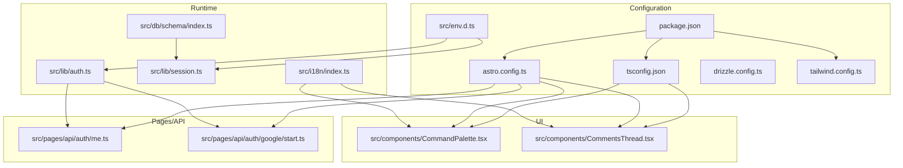
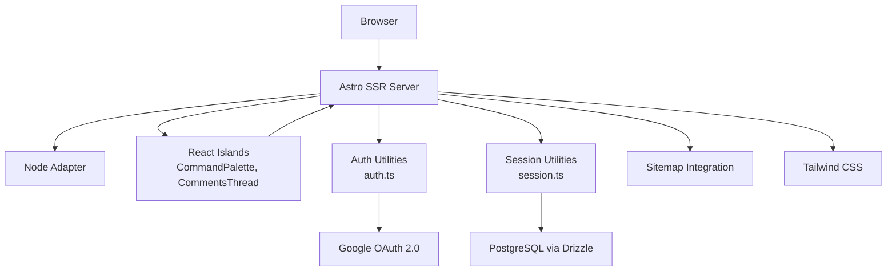
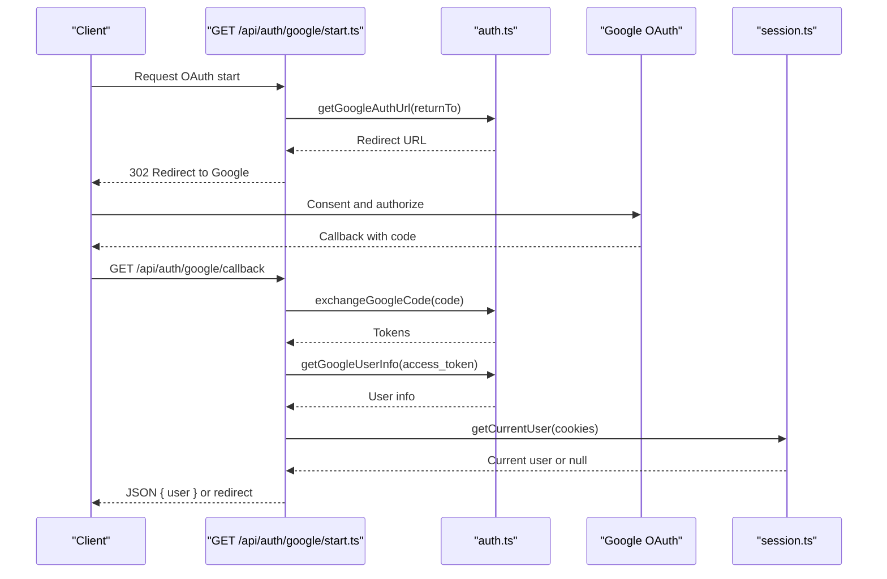
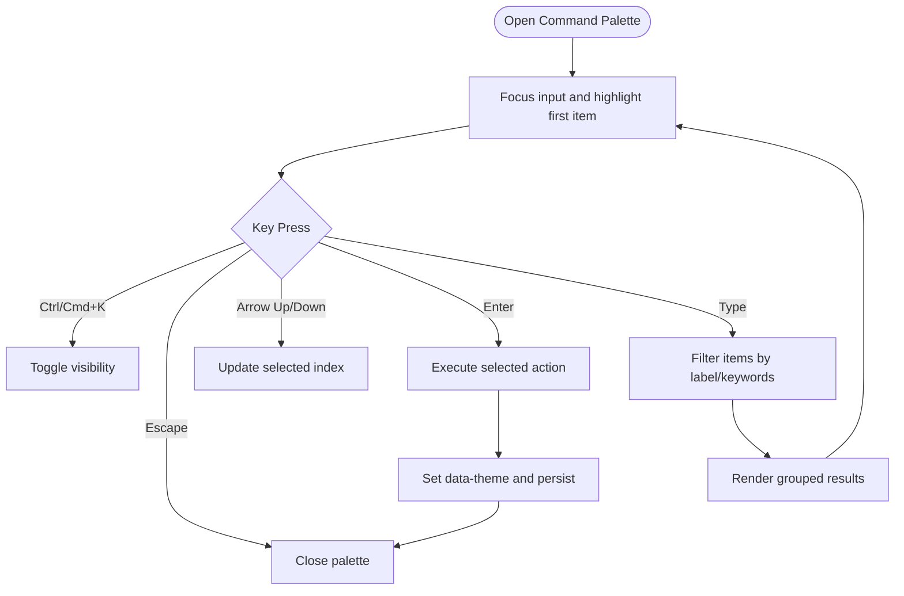
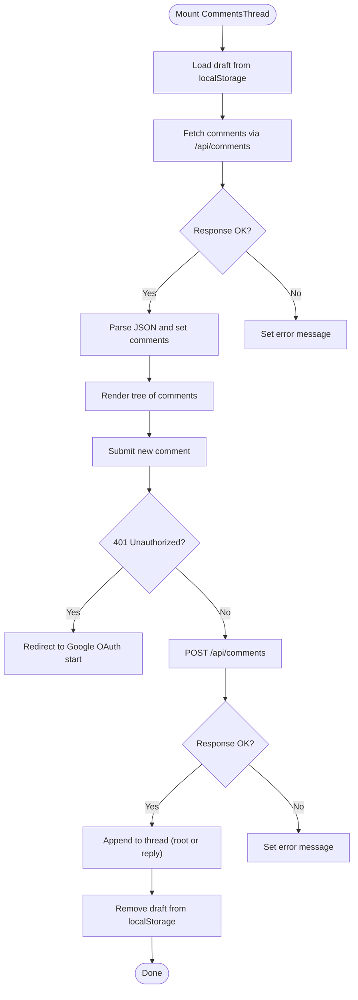
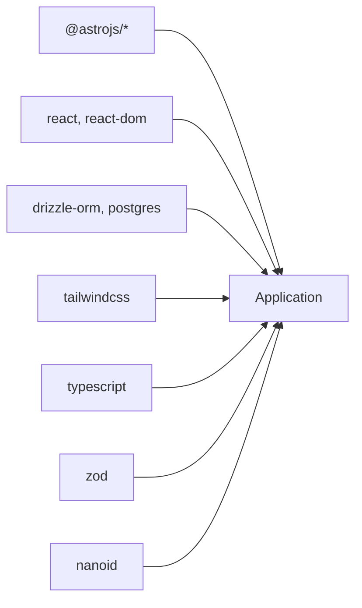

# Development Guidelines

<cite>
**Referenced Files in This Document**
- [README.md](file://README.md)
- [package.json](file://package.json)
- [tsconfig.json](file://tsconfig.json)
- [astro.config.ts](file://astro.config.ts)
- [drizzle.config.ts](file://drizzle.config.ts)
- [tailwind.config.ts](file://tailwind.config.ts)
- [src/env.d.ts](file://src/env.d.ts)
- [src/db/schema/index.ts](file://src/db/schema/index.ts)
- [src/lib/auth.ts](file://src/lib/auth.ts)
- [src/lib/session.ts](file://src/lib/session.ts)
- [src/components/CommandPalette.tsx](file://src/components/CommandPalette.tsx)
- [src/components/CommentsThread.tsx](file://src/components/CommentsThread.tsx)
- [src/pages/api/auth/me.ts](file://src/pages/api/auth/me.ts)
- [src/pages/api/auth/google/start.ts](file://src/pages/api/auth/google/start.ts)
- [src/data/projects.ts](file://src/data/projects.ts)
- [src/i18n/index.ts](file://src/i18n/index.ts)
</cite>

## Table of Contents
1. [Introduction](#introduction)
2. [Project Structure](#project-structure)
3. [Core Components](#core-components)
4. [Architecture Overview](#architecture-overview)
5. [Detailed Component Analysis](#detailed-component-analysis)
6. [Dependency Analysis](#dependency-analysis)
7. [Performance Considerations](#performance-considerations)
8. [Troubleshooting Guide](#troubleshooting-guide)
9. [Development Workflow](#development-workflow)
10. [Testing and Quality Assurance](#testing-and-quality-assurance)
11. [Continuous Integration](#continuous-integration)
12. [Extending Functionality and Backward Compatibility](#extending-functionality-and-backward-compatibility)
13. [Debugging and Profiling](#debugging-and-profiling)
14. [Conclusion](#conclusion)

## Introduction
This document provides comprehensive development guidelines for contributing to rodion.pro. It covers TypeScript configuration, coding standards, component structure conventions, naming patterns, development workflow, testing and QA practices, continuous integration considerations, performance optimization, architectural principles, and practical guidance for Astro, React, and database operations. The goal is to ensure consistent, maintainable, and scalable contributions across the project.

## Project Structure
The project follows a feature-based layout under src/, with clear separation of concerns:
- Components: Astro and React UI components
- Content: MDX-based blog content
- Data: Static data modules (e.g., projects)
- DB: Drizzle ORM schema and connection utilities
- i18n: Internationalization keys and helpers
- Lib: Shared utilities (auth, session)
- Pages: Route handlers and API endpoints organized by locale and feature
- Styles: Global CSS and Tailwind configuration



**Diagram sources**
- [package.json](file://package.json#L1-L46)
- [tsconfig.json](file://tsconfig.json#L1-L16)
- [astro.config.ts](file://astro.config.ts#L1-L38)
- [drizzle.config.ts](file://drizzle.config.ts#L1-L11)
- [tailwind.config.ts](file://tailwind.config.ts#L1-L35)
- [src/env.d.ts](file://src/env.d.ts#L1-L19)
- [src/db/schema/index.ts](file://src/db/schema/index.ts#L1-L104)
- [src/lib/auth.ts](file://src/lib/auth.ts#L1-L101)
- [src/lib/session.ts](file://src/lib/session.ts#L1-L58)
- [src/i18n/index.ts](file://src/i18n/index.ts#L1-L221)
- [src/components/CommandPalette.tsx](file://src/components/CommandPalette.tsx#L1-L206)
- [src/components/CommentsThread.tsx](file://src/components/CommentsThread.tsx#L1-L366)
- [src/pages/api/auth/me.ts](file://src/pages/api/auth/me.ts#L1-L30)
- [src/pages/api/auth/google/start.ts](file://src/pages/api/auth/google/start.ts#L1-L15)

**Section sources**
- [README.md](file://README.md#L198-L216)
- [astro.config.ts](file://astro.config.ts#L1-L38)
- [package.json](file://package.json#L1-L46)

## Core Components
- TypeScript configuration extends Astro’s strict preset, enables JSX with React, and sets path aliases for clean imports.
- Astro configuration uses SSR with the Node adapter, integrates React islands, Tailwind, MDX, and i18n with localized routing.
- Drizzle configuration defines the PostgreSQL schema path and credentials via environment variables.
- Tailwind configuration scans Astro and TS sources, supports dark mode via data attributes, and exposes CSS variables for theme tokens.

**Section sources**
- [tsconfig.json](file://tsconfig.json#L1-L16)
- [astro.config.ts](file://astro.config.ts#L1-L38)
- [drizzle.config.ts](file://drizzle.config.ts#L1-L11)
- [tailwind.config.ts](file://tailwind.config.ts#L1-L35)
- [src/env.d.ts](file://src/env.d.ts#L1-L19)

## Architecture Overview
The application is an Astro SSR site with:
- React islands for interactive UI
- Drizzle ORM for PostgreSQL persistence
- Astro API routes for backend logic (OAuth, auth state, comments, reactions, changelog events)
- i18n utilities for localized content and navigation
- Command palette and comments system as interactive React components



**Diagram sources**
- [astro.config.ts](file://astro.config.ts#L1-L38)
- [src/lib/auth.ts](file://src/lib/auth.ts#L1-L101)
- [src/lib/session.ts](file://src/lib/session.ts#L1-L58)
- [src/db/schema/index.ts](file://src/db/schema/index.ts#L1-L104)
- [src/components/CommandPalette.tsx](file://src/components/CommandPalette.tsx#L1-L206)
- [src/components/CommentsThread.tsx](file://src/components/CommentsThread.tsx#L1-L366)

## Detailed Component Analysis

### Authentication and Session Management
- Session cookie lifecycle and security are handled centrally, with configurable expiration and secure flags in production.
- Google OAuth flow is initiated from an API route and redirects to Google’s consent page with state-encoded return paths.
- Current user retrieval checks DB availability and validates session expiry and user ban status.



**Diagram sources**
- [src/pages/api/auth/google/start.ts](file://src/pages/api/auth/google/start.ts#L1-L15)
- [src/lib/auth.ts](file://src/lib/auth.ts#L1-L101)
- [src/lib/session.ts](file://src/lib/session.ts#L1-L58)
- [src/pages/api/auth/me.ts](file://src/pages/api/auth/me.ts#L1-L30)

**Section sources**
- [src/lib/auth.ts](file://src/lib/auth.ts#L1-L101)
- [src/lib/session.ts](file://src/lib/session.ts#L1-L58)
- [src/pages/api/auth/google/start.ts](file://src/pages/api/auth/google/start.ts#L1-L15)
- [src/pages/api/auth/me.ts](file://src/pages/api/auth/me.ts#L1-L30)

### Command Palette Component
- Implements keyboard shortcuts, grouping, filtering, and theme switching via data attributes and localStorage.
- Uses Tailwind classes and CSS variables for theming and responsive layout.



**Diagram sources**
- [src/components/CommandPalette.tsx](file://src/components/CommandPalette.tsx#L1-L206)

**Section sources**
- [src/components/CommandPalette.tsx](file://src/components/CommandPalette.tsx#L1-L206)
- [tailwind.config.ts](file://tailwind.config.ts#L1-L35)

### Comments Thread Component
- Manages nested comments, replies, reactions, and local drafts persisted in localStorage.
- Fetches and posts comments via Astro API routes, handles auth redirects, and displays errors gracefully.



**Diagram sources**
- [src/components/CommentsThread.tsx](file://src/components/CommentsThread.tsx#L1-L366)
- [src/pages/api/auth/me.ts](file://src/pages/api/auth/me.ts#L1-L30)

**Section sources**
- [src/components/CommentsThread.tsx](file://src/components/CommentsThread.tsx#L1-L366)
- [src/pages/api/auth/me.ts](file://src/pages/api/auth/me.ts#L1-L30)

### Database Schema and Types
- Centralized schema definitions for users, OAuth accounts, sessions, comments, reactions, flags, and events.
- Strongly typed selection and insert helpers enable safe ORM usage and reduce runtime errors.

```mermaid
erDiagram
USERS {
bigserial id PK
text email UK
text name
text avatar_url
timestamp created_at
boolean is_banned
}
OAUTH_ACCOUNTS {
bigserial id PK
bigserial user_id FK
text provider
text provider_user_id
timestamp created_at
}
SESSIONS {
text id PK
bigserial user_id FK
timestamp expires_at
timestamp created_at
}
COMMENTS {
bigserial id PK
text page_type
text page_key
text lang
bigserial user_id FK
bigserial parent_id FK
text body
timestamp created_at
timestamp updated_at
boolean is_hidden
boolean is_deleted
}
REACTIONS {
bigserial id PK
text target_type
text target_key
text lang
bigserial user_id FK
text emoji
timestamp created_at
}
COMMENT_FLAGS {
bigserial id PK
bigserial comment_id FK
bigserial user_id FK
text reason
timestamp created_at
}
EVENTS {
bigserial id PK
timestamp ts
text source
text kind
text project
text title
text url
text[] tags
jsonb payload
}
USERS ||--o{ OAUTH_ACCOUNTS : "has"
USERS ||--o{ SESSIONS : "has"
USERS ||--o{ COMMENTS : "authored"
USERS ||--o{ REACTIONS : "has"
COMMENTS ||--o{ COMMENT_FLAGS : "flagged"
COMMENTS ||--o{o COMMENTS : "parent"
```

**Diagram sources**
- [src/db/schema/index.ts](file://src/db/schema/index.ts#L1-L104)

**Section sources**
- [src/db/schema/index.ts](file://src/db/schema/index.ts#L1-L104)

### Internationalization Utilities
- Provides translation keys, language detection from URL, and helpers to generate localized paths and alternate locales.
- Supports RU/EN with consistent key naming and fallback behavior.

**Section sources**
- [src/i18n/index.ts](file://src/i18n/index.ts#L1-L221)

### Static Data Modules
- Projects data module defines strongly typed project entries, status enums, and helper functions to transform data per locale.

**Section sources**
- [src/data/projects.ts](file://src/data/projects.ts#L1-L123)

## Dependency Analysis
- Astro integrates React islands, Tailwind, MDX, and sitemap generation.
- Drizzle ORM connects to PostgreSQL using DATABASE_URL from environment variables.
- React and React DOM power interactive components.
- Zod and nanoid support validation and identifiers.
- TypeScript compiles with strictness and JSX enabled.



**Diagram sources**
- [package.json](file://package.json#L18-L32)
- [astro.config.ts](file://astro.config.ts#L1-L38)
- [drizzle.config.ts](file://drizzle.config.ts#L1-L11)

**Section sources**
- [package.json](file://package.json#L1-L46)
- [astro.config.ts](file://astro.config.ts#L1-L38)
- [drizzle.config.ts](file://drizzle.config.ts#L1-L11)

## Performance Considerations
- Prefer React islands for interactivity to keep server-rendered pages lightweight.
- Use CSS variables and Tailwind utilities for efficient styling; avoid excessive inline styles.
- Minimize network requests by batching API calls and caching where appropriate.
- Keep database queries indexed (as seen in schema indexes) and avoid N+1 selects.
- Use Astro’s static generation and server-side rendering to optimize initial load.

## Troubleshooting Guide
- Environment variables: Ensure DATABASE_URL, SITE_URL, and OAuth credentials are set in .env.
- Database: Verify migrations are applied and Drizzle Studio can connect.
- OAuth: Confirm redirect URIs match configuration and state encoding is preserved.
- API routes: Check for 503 responses indicating missing DB configuration and adjust accordingly.

**Section sources**
- [src/env.d.ts](file://src/env.d.ts#L1-L19)
- [src/pages/api/auth/me.ts](file://src/pages/api/auth/me.ts#L1-L30)
- [README.md](file://README.md#L227-L240)

## Development Workflow
- Branching: Use feature branches prefixed with feature/, fix/, chore/, or docs/.
- Commit messages: Follow conventional commits (e.g., feat:, fix:, refactor:, docs:).
- Pull requests: Open PRs targeting main with clear descriptions, linked issues, and passing checks.
- Code review: Expect feedback on style, correctness, performance, and test coverage.
- Local setup: Install dependencies, configure .env, run DB migrations, and start dev server.

**Section sources**
- [README.md](file://README.md#L25-L70)

## Testing and Quality Assurance
- Type checking: Run type checks via scripts to catch errors early.
- Linting: Use ESLint with TypeScript and Astro plugins to enforce style and prevent common pitfalls.
- Database tests: Use Drizzle Kit to generate and apply migrations; test schema changes locally.
- Manual QA: Validate OAuth flows, comments threading, command palette, and i18n behavior across locales.

**Section sources**
- [package.json](file://package.json#L15-L16)

## Continuous Integration
- CI should run type checks, linting, and database migration validation.
- Optional: Snapshot tests for UI components and integration tests for API endpoints.
- Artifact deployment: Build with Astro and serve via Node adapter; ensure environment variables are injected securely.

[No sources needed since this section provides general guidance]

## Extending Functionality and Backward Compatibility
- Follow established patterns: place new components under src/components, pages under src/pages, and data under src/data.
- Maintain naming conventions: PascalCase for components, kebab-case for routes, and descriptive suffixes (e.g., API routes).
- Preserve backward compatibility: avoid breaking changes to public APIs; introduce deprecations with migration paths.
- Database changes: use Drizzle migrations; keep schema diffs minimal and reversible.

[No sources needed since this section provides general guidance]

## Debugging and Profiling
- Frontend: Use browser devtools to inspect React components, network requests, and localStorage usage.
- Backend: Log errors in API routes and verify cookie handling and session validity.
- Database: Use Drizzle Studio to inspect tables and run queries; confirm indexes are effective.
- Performance: Monitor render times of React islands and optimize heavy computations.

[No sources needed since this section provides general guidance]

## Conclusion
These guidelines consolidate the project’s configuration, architecture, and development practices. By adhering to the conventions outlined here—TypeScript strictness, component structure, naming patterns, workflow discipline, testing, and performance awareness—you will help maintain a robust, scalable, and enjoyable development experience for rodion.pro.