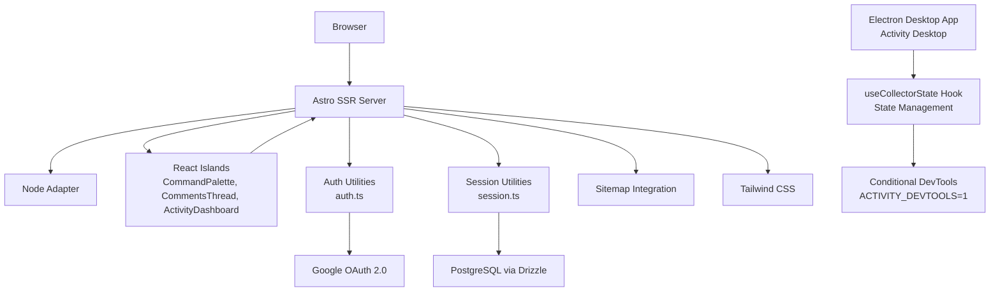
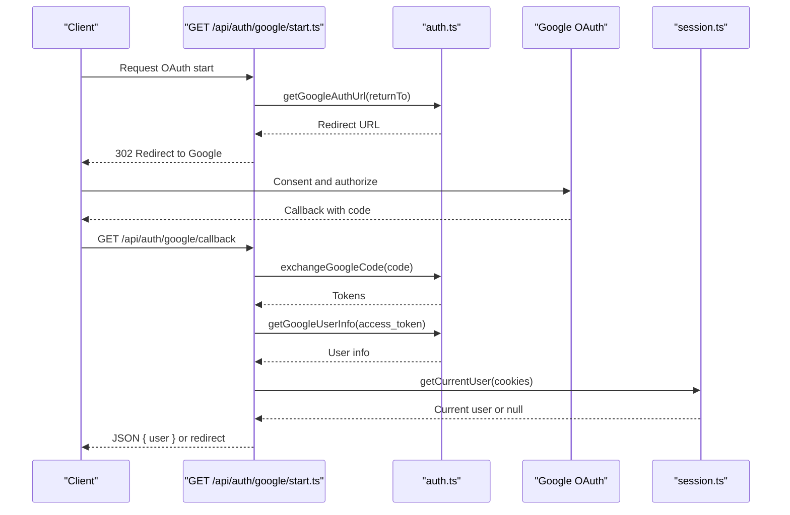
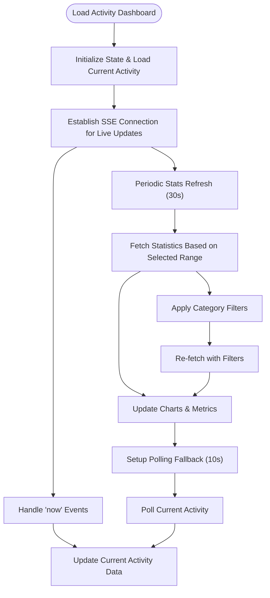
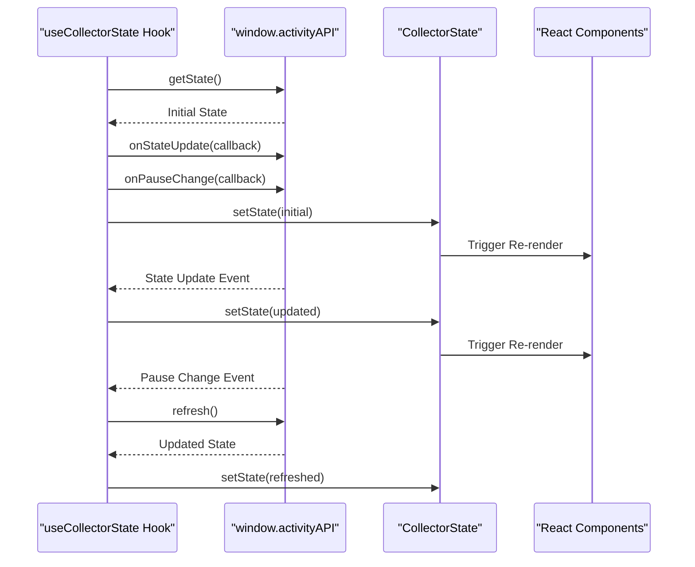
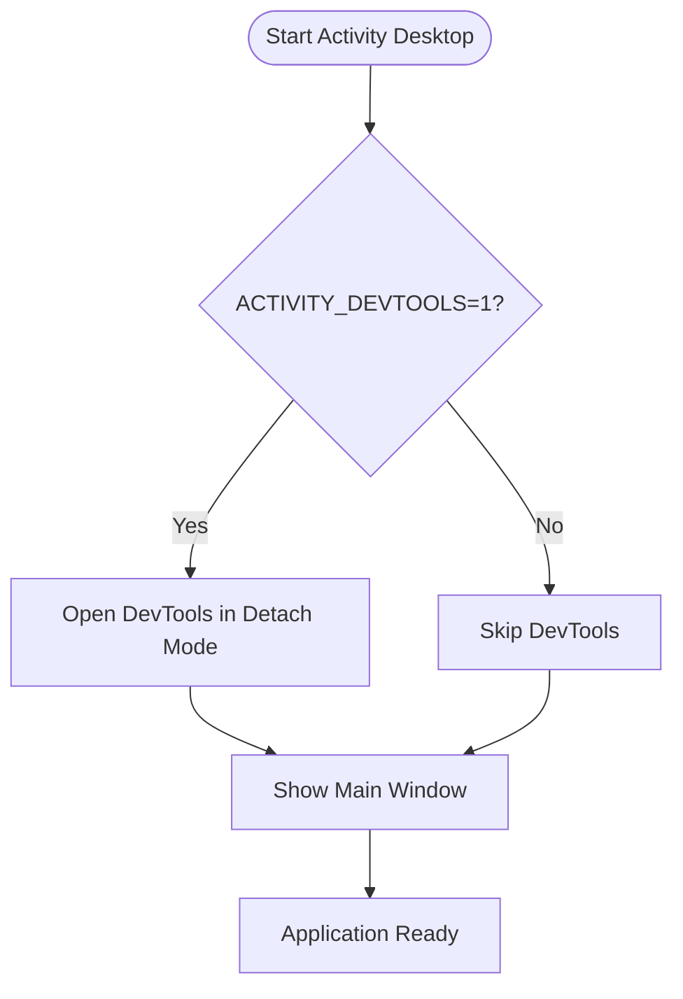
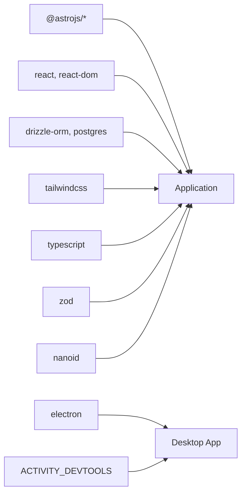

# Development Guidelines

<cite>
**Referenced Files in This Document**
- [README.md](file://README.md)
- [package.json](file://package.json)
- [tsconfig.json](file://tsconfig.json)
- [astro.config.ts](file://astro.config.ts)
- [drizzle.config.ts](file://drizzle.config.ts)
- [tailwind.config.ts](file://tailwind.config.ts)
- [src/env.d.ts](file://src/env.d.ts)
- [src/db/schema/index.ts](file://src/db/schema/index.ts)
- [src/lib/auth.ts](file://src/lib/auth.ts)
- [src/lib/session.ts](file://src/lib/session.ts)
- [src/components/CommandPalette.tsx](file://src/components/CommandPalette.tsx)
- [src/components/CommentsThread.tsx](file://src/components/CommentsThread.tsx)
- [src/components/ActivityDashboard.tsx](file://src/components/ActivityDashboard.tsx)
- [src/components/ActivityTimelineChart.tsx](file://src/components/ActivityTimelineChart.tsx)
- [src/components/ActivityTopApps.tsx](file://src/components/ActivityTopApps.tsx)
- [src/pages/api/auth/me.ts](file://src/pages/api/auth/me.ts)
- [src/pages/api/auth/google/start.ts](file://src/pages/api/auth/google/start.ts)
- [src/data/projects.ts](file://src/data/projects.ts)
- [src/i18n/index.ts](file://src/i18n/index.ts)
- [activity-desktop/src/main/window.ts](file://activity-desktop/src/main/window.ts)
- [activity-desktop/src/renderer/hooks/useCollectorState.ts](file://activity-desktop/src/renderer/hooks/useCollectorState.ts)
- [activity-desktop/src/main/index.ts](file://activity-desktop/src/main/index.ts)
- [start-tracking.bat](file://start-tracking.bat)
</cite>

## Update Summary
**Changes Made**
- Added enhanced developer experience section with conditional Developer Tools activation
- Updated state management patterns documentation for useCollectorState hook
- Added new start-tracking.bat script documentation for streamlined development workflow
- Enhanced activity monitoring dashboard documentation with improved state management
- Updated troubleshooting guide with new environment variable configuration

## Table of Contents
1. [Introduction](#introduction)
2. [Project Structure](#project-structure)
3. [Core Components](#core-components)
4. [Architecture Overview](#architecture-overview)
5. [Detailed Component Analysis](#detailed-component-analysis)
6. [Dependency Analysis](#dependency-analysis)
7. [Performance Considerations](#performance-considerations)
8. [Troubleshooting Guide](#troubleshooting-guide)
9. [Development Workflow](#development-workflow)
10. [Testing and Quality Assurance](#testing-and-quality-assurance)
11. [Continuous Integration](#continuous-integration)
12. [Extending Functionality and Backward Compatibility](#extending-functionality-and-backward-compatibility)
13. [Debugging and Profiling](#debugging-and-profiling)
14. [Enhanced Developer Experience](#enhanced-developer-experience)
15. [Conclusion](#conclusion)

## Introduction
This document provides comprehensive development guidelines for contributing to rodion.pro. It covers TypeScript configuration, coding standards, component structure conventions, naming patterns, development workflow, testing and QA practices, continuous integration considerations, performance optimization, architectural principles, and practical guidance for Astro, React, and database operations. The goal is to ensure consistent, maintainable, and scalable contributions across the project.

**Updated** Enhanced with conditional Developer Tools activation, improved state management patterns, and streamlined development workflow tools.

## Project Structure
The project follows a feature-based layout under src/, with clear separation of concerns:
- Components: Astro and React UI components
- Content: MDX-based blog content
- Data: Static data modules (e.g., projects)
- DB: Drizzle ORM schema and connection utilities
- i18n: Internationalization keys and helpers
- Lib: Shared utilities (auth, session)
- Pages: Route handlers and API endpoints organized by locale and feature
- Styles: Global CSS and Tailwind configuration
- Activity Desktop: Electron-based desktop application for activity monitoring

```mermaid
graph TB
subgraph "Configuration"
Pkg["package.json"]
TS["tsconfig.json"]
AstroCfg["astro.config.ts"]
DrizzleCfg["drizzle.config.ts"]
TailwindCfg["tailwind.config.ts"]
Env["src/env.d.ts"]
end
subgraph "Runtime"
DB["src/db/schema/index.ts"]
Auth["src/lib/auth.ts"]
Session["src/lib/session.ts"]
I18n["src/i18n/index.ts"]
end
subgraph "UI"
Cmd["src/components/CommandPalette.tsx"]
Comments["src/components/CommentsThread.tsx"]
ActivityDash["src/components/ActivityDashboard.tsx"]
ActivityCharts["src/components/ActivityTimelineChart.tsx"]
ActivityApps["src/components/ActivityTopApps.tsx"]
end
subgraph "Pages/API"
MeAPI["src/pages/api/auth/me.ts"]
GoogleStartAPI["src/pages/api/auth/google/start.ts"]
end
subgraph "Desktop Application"
Window["activity-desktop/src/main/window.ts"]
CollectorHook["activity-desktop/src/renderer/hooks/useCollectorState.ts"]
MainIndex["activity-desktop/src/main/index.ts"]
end
Pkg --> AstroCfg
Pkg --> TS
Pkg --> TailwindCfg
TS --> Cmd
TS --> Comments
TS --> ActivityDash
TS --> ActivityCharts
TS --> ActivityApps
AstroCfg --> Cmd
AstroCfg --> Comments
AstroCfg --> ActivityDash
AstroCfg --> ActivityCharts
AstroCfg --> ActivityApps
AstroCfg --> MeAPI
AstroCfg --> GoogleStartAPI
DB --> Session
Auth --> GoogleStartAPI
Auth --> MeAPI
I18n --> Cmd
I18n --> Comments
I18n --> ActivityDash
Env --> Auth
Env --> Session
Window --> CollectorHook
MainIndex --> Window
```



**Diagram sources**
- [package.json:1-46](file://package.json#L1-L46)
- [tsconfig.json:1-16](file://tsconfig.json#L1-L16)
- [astro.config.ts:1-38](file://astro.config.ts#L1-L38)
- [drizzle.config.ts:1-11](file://drizzle.config.ts#L1-L11)
- [tailwind.config.ts:1-35](file://tailwind.config.ts#L1-L35)
- [src/env.d.ts:1-19](file://src/env.d.ts#L1-L19)
- [src/db/schema/index.ts:1-104](file://src/db/schema/index.ts#L1-L104)
- [src/lib/auth.ts:1-101](file://src/lib/auth.ts#L1-L101)
- [src/lib/session.ts:1-58](file://src/lib/session.ts#L1-L58)
- [src/i18n/index.ts:1-221](file://src/i18n/index.ts#L1-L221)
- [src/components/CommandPalette.tsx:1-206](file://src/components/CommandPalette.tsx#L1-L206)
- [src/components/CommentsThread.tsx:1-366](file://src/components/CommentsThread.tsx#L1-L366)
- [src/components/ActivityDashboard.tsx:1-805](file://src/components/ActivityDashboard.tsx#L1-L805)
- [src/components/ActivityTimelineChart.tsx:1-553](file://src/components/ActivityTimelineChart.tsx#L1-L553)
- [src/components/ActivityTopApps.tsx:1-438](file://src/components/ActivityTopApps.tsx#L1-L438)
- [src/pages/api/auth/me.ts:1-30](file://src/pages/api/auth/me.ts#L1-L30)
- [src/pages/api/auth/google/start.ts:1-15](file://src/pages/api/auth/google/start.ts#L1-L15)
- [activity-desktop/src/main/window.ts:1-57](file://activity-desktop/src/main/window.ts#L1-L57)
- [activity-desktop/src/renderer/hooks/useCollectorState.ts:1-28](file://activity-desktop/src/renderer/hooks/useCollectorState.ts#L1-L28)
- [activity-desktop/src/main/index.ts:1-95](file://activity-desktop/src/main/index.ts#L1-L95)

**Section sources**
- [README.md:198-216](file://README.md#L198-L216)
- [astro.config.ts:1-38](file://astro.config.ts#L1-L38)
- [package.json:1-46](file://package.json#L1-L46)

## Core Components
- TypeScript configuration extends Astro's strict preset, enables JSX with React, and sets path aliases for clean imports.
- Astro configuration uses SSR with the Node adapter, integrates React islands, Tailwind, MDX, and i18n with localized routing.
- Drizzle configuration defines the PostgreSQL schema path and credentials via environment variables.
- Tailwind configuration scans Astro and TS sources, supports dark mode via data attributes, and exposes CSS variables for theme tokens.
- Activity Dashboard provides comprehensive activity monitoring with real-time updates and interactive charts.
- Enhanced state management patterns in useCollectorState hook for improved desktop application development.

**Section sources**
- [tsconfig.json:1-16](file://tsconfig.json#L1-L16)
- [astro.config.ts:1-38](file://astro.config.ts#L1-L38)
- [drizzle.config.ts:1-11](file://drizzle.config.ts#L1-L11)
- [tailwind.config.ts:1-35](file://tailwind.config.ts#L1-L35)
- [src/env.d.ts:1-19](file://src/env.d.ts#L1-L19)
- [src/components/ActivityDashboard.tsx:1-805](file://src/components/ActivityDashboard.tsx#L1-L805)
- [activity-desktop/src/renderer/hooks/useCollectorState.ts:1-28](file://activity-desktop/src/renderer/hooks/useCollectorState.ts#L1-L28)

## Architecture Overview
The application is an Astro SSR site with:
- React islands for interactive UI
- Drizzle ORM for PostgreSQL persistence
- Astro API routes for backend logic (OAuth, auth state, comments, reactions, changelog events)
- i18n utilities for localized content and navigation
- Command palette and comments system as interactive React components
- Activity Desktop Electron application for desktop activity monitoring
- Real-time state synchronization between desktop and web applications



**Diagram sources**
- [astro.config.ts:1-38](file://astro.config.ts#L1-L38)
- [src/lib/auth.ts:1-101](file://src/lib/auth.ts#L1-L101)
- [src/lib/session.ts:1-58](file://src/lib/session.ts#L1-L58)
- [src/db/schema/index.ts:1-104](file://src/db/schema/index.ts#L1-L104)
- [src/components/CommandPalette.tsx:1-206](file://src/components/CommandPalette.tsx#L1-L206)
- [src/components/CommentsThread.tsx:1-366](file://src/components/CommentsThread.tsx#L1-L366)
- [src/components/ActivityDashboard.tsx:1-805](file://src/components/ActivityDashboard.tsx#L1-L805)
- [activity-desktop/src/renderer/hooks/useCollectorState.ts:1-28](file://activity-desktop/src/renderer/hooks/useCollectorState.ts#L1-L28)
- [activity-desktop/src/main/window.ts:28-32](file://activity-desktop/src/main/window.ts#L28-L32)

## Detailed Component Analysis

### Authentication and Session Management
- Session cookie lifecycle and security are handled centrally, with configurable expiration and secure flags in production.
- Google OAuth flow is initiated from an API route and redirects to Google's consent page with state-encoded return paths.
- Current user retrieval checks DB availability and validates session expiry and user ban status.



**Diagram sources**
- [src/pages/api/auth/google/start.ts:1-15](file://src/pages/api/auth/google/start.ts#L1-L15)
- [src/lib/auth.ts:1-101](file://src/lib/auth.ts#L1-L101)
- [src/lib/session.ts:1-58](file://src/lib/session.ts#L1-L58)
- [src/pages/api/auth/me.ts:1-30](file://src/pages/api/auth/me.ts#L1-L30)

**Section sources**
- [src/lib/auth.ts:1-101](file://src/lib/auth.ts#L1-L101)
- [src/lib/session.ts:1-58](file://src/lib/session.ts#L1-L58)
- [src/pages/api/auth/google/start.ts:1-15](file://src/pages/api/auth/google/start.ts#L1-L15)
- [src/pages/api/auth/me.ts:1-30](file://src/pages/api/auth/me.ts#L1-L30)

### Activity Dashboard Component
- Comprehensive activity monitoring with real-time updates via Server-Sent Events (SSE).
- Interactive charts for timeline analysis, top applications, and category breakdown.
- Multi-timeframe analysis with configurable grouping (15min, hour, day).
- Category filtering and custom date range selection.
- Live polling fallback mechanism for reliability.



**Diagram sources**
- [src/components/ActivityDashboard.tsx:198-300](file://src/components/ActivityDashboard.tsx#L198-L300)

**Section sources**
- [src/components/ActivityDashboard.tsx:1-805](file://src/components/ActivityDashboard.tsx#L1-L805)
- [src/components/ActivityTimelineChart.tsx:1-553](file://src/components/ActivityTimelineChart.tsx#L1-L553)
- [src/components/ActivityTopApps.tsx:1-438](file://src/components/ActivityTopApps.tsx#L1-L438)

### Enhanced State Management Patterns
- Improved useCollectorState hook with automatic cleanup and pause change detection.
- Bidirectional state synchronization between desktop and web applications.
- Optimized refresh mechanisms to minimize unnecessary API calls.
- Proper event listener cleanup to prevent memory leaks.



**Diagram sources**
- [activity-desktop/src/renderer/hooks/useCollectorState.ts:6-27](file://activity-desktop/src/renderer/hooks/useCollectorState.ts#L6-L27)

**Section sources**
- [activity-desktop/src/renderer/hooks/useCollectorState.ts:1-28](file://activity-desktop/src/renderer/hooks/useCollectorState.ts#L1-L28)

### Conditional Developer Tools Activation
- Environment variable controlled Developer Tools activation for Electron desktop application.
- Configurable via ACTIVITY_DEVTOOLS=1 environment variable or start-tracking.bat script.
- Development-only feature with detach mode for optimal debugging experience.



**Diagram sources**
- [activity-desktop/src/main/window.ts:28-32](file://activity-desktop/src/main/window.ts#L28-L32)
- [start-tracking.bat:6-7](file://start-tracking.bat#L6-L7)

**Section sources**
- [activity-desktop/src/main/window.ts:1-57](file://activity-desktop/src/main/window.ts#L1-L57)
- [start-tracking.bat:1-11](file://start-tracking.bat#L1-L11)

### Database Schema and Types
- Centralized schema definitions for users, OAuth accounts, sessions, comments, reactions, flags, and events.
- Strongly typed selection and insert helpers enable safe ORM usage and reduce runtime errors.

```mermaid
erDiagram
USERS {
bigserial id PK
text email UK
text name
text avatar_url
timestamp created_at
boolean is_banned
}
OAUTH_ACCOUNTS {
bigserial id PK
bigserial user_id FK
text provider
text provider_user_id
timestamp created_at
}
SESSIONS {
text id PK
bigserial user_id FK
timestamp expires_at
timestamp created_at
}
COMMENTS {
bigserial id PK
text page_type
text page_key
text lang
bigserial user_id FK
bigserial parent_id FK
text body
timestamp created_at
timestamp updated_at
boolean is_hidden
boolean is_deleted
}
REACTIONS {
bigserial id PK
text target_type
text target_key
text lang
bigserial user_id FK
text emoji
timestamp created_at
}
COMMENT_FLAGS {
bigserial id PK
bigserial comment_id FK
bigserial user_id FK
text reason
timestamp created_at
}
EVENTS {
bigserial id PK
timestamp ts
text source
text kind
text project
text title
text url
text[] tags
jsonb payload
}
USERS ||--o{ OAUTH_ACCOUNTS : "has"
USERS ||--o{ SESSIONS : "has"
USERS ||--o{ COMMENTS : "authored"
USERS ||--o{ REACTIONS : "has"
COMMENTS ||--o{ COMMENT_FLAGS : "flagged"
COMMENTS ||--o{o COMMENTS : "parent"
```

**Diagram sources**
- [src/db/schema/index.ts:1-104](file://src/db/schema/index.ts#L1-L104)

**Section sources**
- [src/db/schema/index.ts:1-104](file://src/db/schema/index.ts#L1-L104)

### Internationalization Utilities
- Provides translation keys, language detection from URL, and helpers to generate localized paths and alternate locales.
- Supports RU/EN with consistent key naming and fallback behavior.

**Section sources**
- [src/i18n/index.ts:1-221](file://src/i18n/index.ts#L1-L221)

### Static Data Modules
- Projects data module defines strongly typed project entries, status enums, and helper functions to transform data per locale.

**Section sources**
- [src/data/projects.ts:1-123](file://src/data/projects.ts#L1-L123)

## Dependency Analysis
- Astro integrates React islands, Tailwind, MDX, and sitemap generation.
- Drizzle ORM connects to PostgreSQL using DATABASE_URL from environment variables.
- React and React DOM power interactive components.
- Zod and nanoid support validation and identifiers.
- TypeScript compiles with strictness and JSX enabled.
- Electron provides desktop application capabilities with conditional Developer Tools support.



**Diagram sources**
- [package.json:18-32](file://package.json#L18-L32)
- [astro.config.ts:1-38](file://astro.config.ts#L1-L38)
- [drizzle.config.ts:1-11](file://drizzle.config.ts#L1-L11)
- [activity-desktop/src/main/window.ts:28-32](file://activity-desktop/src/main/window.ts#L28-L32)

**Section sources**
- [package.json:1-46](file://package.json#L1-L46)
- [astro.config.ts:1-38](file://astro.config.ts#L1-L38)
- [drizzle.config.ts:1-11](file://drizzle.config.ts#L1-L11)

## Performance Considerations
- Prefer React islands for interactivity to keep server-rendered pages lightweight.
- Use CSS variables and Tailwind utilities for efficient styling; avoid excessive inline styles.
- Minimize network requests by batching API calls and caching where appropriate.
- Keep database queries indexed (as seen in schema indexes) and avoid N+1 selects.
- Use Astro's static generation and server-side rendering to optimize initial load.
- Implement proper cleanup in React hooks to prevent memory leaks.
- Use debounced updates for frequently changing state to improve performance.

## Troubleshooting Guide
- Environment variables: Ensure DATABASE_URL, SITE_URL, and OAuth credentials are set in .env.
- Database: Verify migrations are applied and Drizzle Studio can connect.
- OAuth: Confirm redirect URIs match configuration and state encoding is preserved.
- API routes: Check for 503 responses indicating missing DB configuration and adjust accordingly.
- Developer Tools: Set ACTIVITY_DEVTOOLS=1 to enable Electron Developer Tools during development.
- Desktop App: Verify proper state synchronization between desktop and web applications.

**Section sources**
- [src/env.d.ts:1-19](file://src/env.d.ts#L1-L19)
- [src/pages/api/auth/me.ts:1-30](file://src/pages/api/auth/me.ts#L1-L30)
- [README.md:227-240](file://README.md#L227-L240)
- [activity-desktop/src/main/window.ts:28-32](file://activity-desktop/src/main/window.ts#L28-L32)
- [start-tracking.bat:6-7](file://start-tracking.bat#L6-L7)

## Development Workflow
- Branching: Use feature/, fix/, chore/, or docs/ prefixes for clear categorization.
- Commit messages: Follow conventional commits (feat:, fix:, refactor:, docs:).
- Pull requests: Open PRs targeting main with clear descriptions, linked issues, and passing checks.
- Code review: Expect feedback on style, correctness, performance, and test coverage.
- Local setup: Install dependencies, configure .env, run DB migrations, and start dev server.
- Desktop development: Use start-tracking.bat script for streamlined Electron application startup.

**Section sources**
- [README.md:25-70](file://README.md#L25-L70)
- [start-tracking.bat:1-11](file://start-tracking.bat#L1-L11)

## Testing and Quality Assurance
- Type checking: Run type checks via scripts to catch errors early.
- Linting: Use ESLint with TypeScript and Astro plugins to enforce style and prevent common pitfalls.
- Database tests: Use Drizzle Kit to generate and apply migrations; test schema changes locally.
- Manual QA: Validate OAuth flows, comments threading, command palette, i18n behavior, and activity monitoring.
- Desktop testing: Verify Developer Tools activation and state synchronization between desktop and web.

**Section sources**
- [package.json:15-16](file://package.json#L15-L16)

## Continuous Integration
- CI should run type checks, linting, and database migration validation.
- Optional: Snapshot tests for UI components and integration tests for API endpoints.
- Artifact deployment: Build with Astro and serve via Node adapter; ensure environment variables are injected securely.
- Desktop builds: Test Electron application with and without Developer Tools enabled.

## Extending Functionality and Backward Compatibility
- Follow established patterns: place new components under src/components, pages under src/pages, and data under src/data.
- Maintain naming conventions: PascalCase for components, kebab-case for routes, and descriptive suffixes (e.g., API routes).
- Preserve backward compatibility: avoid breaking changes to public APIs; introduce deprecations with migration paths.
- Database changes: use Drizzle migrations; keep schema diffs minimal and reversible.
- State management: follow useCollectorState patterns for consistent desktop application state handling.

## Debugging and Profiling
- Frontend: Use browser devtools to inspect React components, network requests, and localStorage usage.
- Backend: Log errors in API routes and verify cookie handling and session validity.
- Database: Use Drizzle Studio to inspect tables and run queries; confirm indexes are effective.
- Performance: Monitor render times of React islands and optimize heavy computations.
- Desktop: Use Developer Tools when ACTIVITY_DEVTOOLS=1 is set for Electron application debugging.

## Enhanced Developer Experience

### Conditional Developer Tools Activation
The project now supports conditional Developer Tools activation for the Electron desktop application through the ACTIVITY_DEVTOOLS environment variable. This enhancement improves the development workflow by allowing developers to enable debugging tools only when needed.

**Configuration Options:**
- Set `ACTIVITY_DEVTOOLS=1` in environment variables to enable Developer Tools
- Use the commented line in start-tracking.bat to enable during development
- Developer Tools open in detach mode for optimal debugging experience

**Implementation Details:**
- Environment variable checked during window creation in activity-desktop/src/main/window.ts
- Conditional DevTools activation prevents accidental exposure in production builds
- Detach mode allows independent window management during debugging

**Section sources**
- [activity-desktop/src/main/window.ts:28-32](file://activity-desktop/src/main/window.ts#L28-L32)
- [start-tracking.bat:6-7](file://start-tracking.bat#L6-L7)

### Improved State Management Patterns
The useCollectorState hook demonstrates enhanced state management patterns with automatic cleanup and improved responsiveness to state changes.

**Key Improvements:**
- Automatic event listener cleanup in useEffect return function
- Bidirectional state synchronization with pause change detection
- Optimized refresh mechanisms to prevent unnecessary API calls
- Proper error handling and state initialization patterns

**State Management Flow:**
1. Initialize state with useState hook
2. Set up effect with refresh function and event listeners
3. Subscribe to state updates and pause changes
4. Clean up subscriptions on component unmount
5. Provide refresh function for manual state updates

**Section sources**
- [activity-desktop/src/renderer/hooks/useCollectorState.ts:1-28](file://activity-desktop/src/renderer/hooks/useCollectorState.ts#L1-L28)

### Streamlined Development Workflow
The new start-tracking.bat script simplifies the development workflow for the Electron desktop application by providing a ready-to-use script with optional Developer Tools configuration.

**Script Features:**
- Automatic navigation to activity-desktop directory
- Conditional Developer Tools activation support
- Integrated Electron Forge startup with error redirection
- Pause prompt for convenient terminal management

**Usage Instructions:**
1. Uncomment the `set ACTIVITY_DEVTOOLS=1` line to enable Developer Tools
2. Run `start-tracking.bat` to launch the desktop application
3. Use the pause prompt to manage the development session

**Section sources**
- [start-tracking.bat:1-11](file://start-tracking.bat#L1-L11)

### Activity Monitoring Dashboard Enhancements
The Activity Dashboard component showcases advanced state management with real-time updates, category filtering, and responsive chart rendering.

**Advanced Features:**
- Real-time updates via Server-Sent Events (SSE) with fallback polling
- Multi-timeframe analysis with configurable grouping
- Interactive chart modes (metrics vs by window)
- Category filtering with persistent selections
- Custom date range selection with validation

**State Management Patterns:**
- Separate loading states for initial load and periodic updates
- Memoized calculations to prevent unnecessary re-renders
- Local storage persistence for user preferences
- Proper cleanup of event listeners and timers

**Section sources**
- [src/components/ActivityDashboard.tsx:1-805](file://src/components/ActivityDashboard.tsx#L1-L805)
- [src/components/ActivityTimelineChart.tsx:1-553](file://src/components/ActivityTimelineChart.tsx#L1-L553)
- [src/components/ActivityTopApps.tsx:1-438](file://src/components/ActivityTopApps.tsx#L1-L438)

## Conclusion
These guidelines consolidate the project's configuration, architecture, and development practices. The recent enhancements include conditional Developer Tools activation for improved debugging, enhanced state management patterns in the useCollectorState hook, and streamlined development workflow through the start-tracking.bat script. By adhering to the conventions outlined here—TypeScript strictness, component structure, naming patterns, workflow discipline, testing, performance awareness, and enhanced developer experience—you will help maintain a robust, scalable, and enjoyable development experience for rodion.pro.