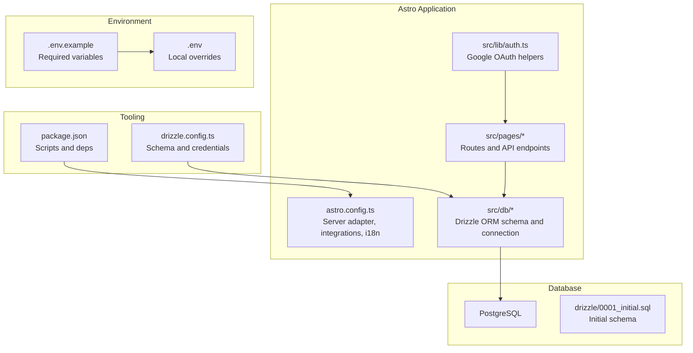
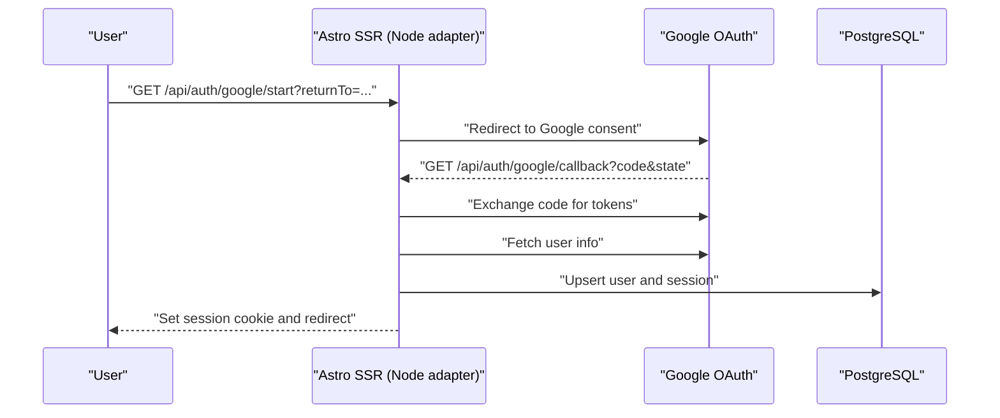
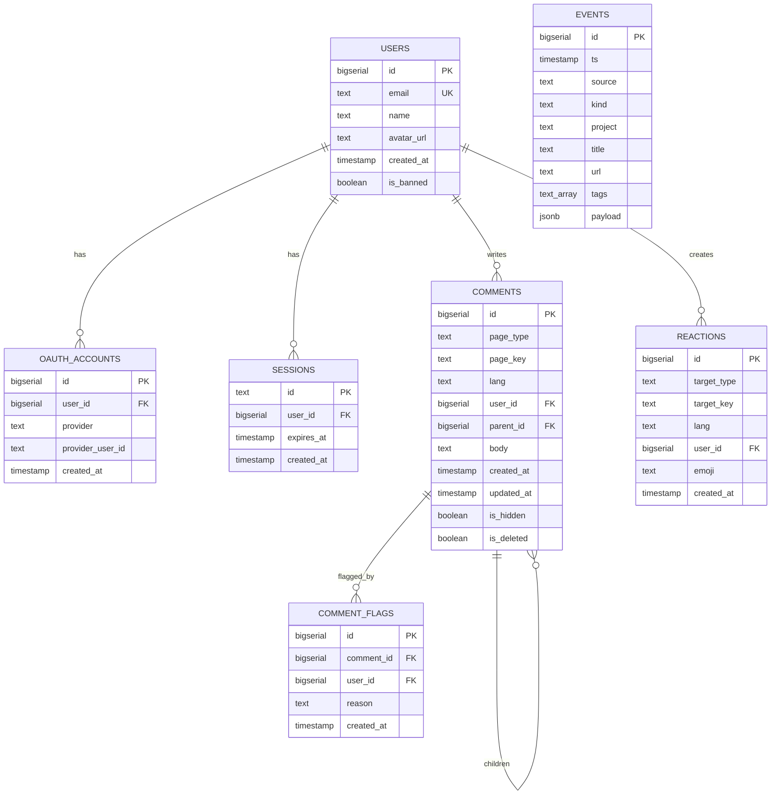
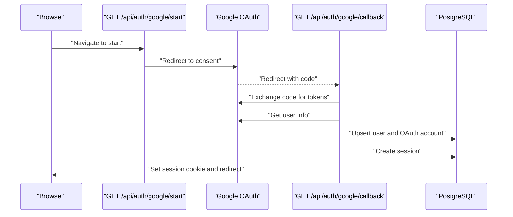
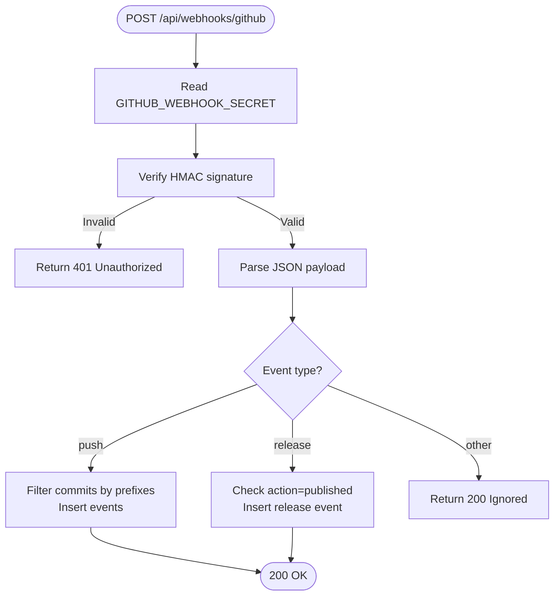
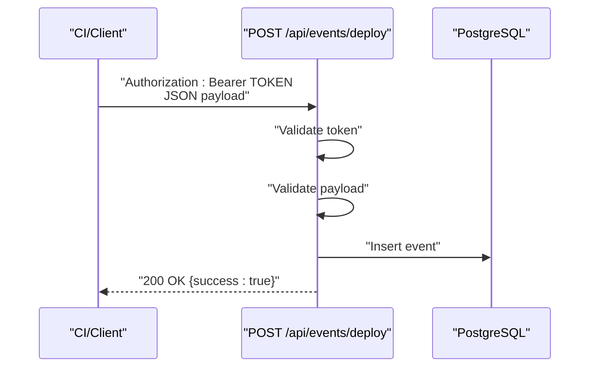
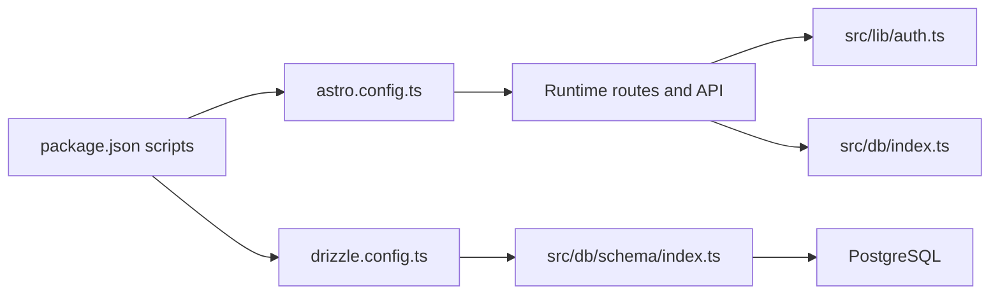

# Getting Started

<cite>
**Referenced Files in This Document**
- [README.md](file://README.md)
- [.env.example](file://.env.example)
- [package.json](file://package.json)
- [astro.config.ts](file://astro.config.ts)
- [drizzle.config.ts](file://drizzle.config.ts)
- [drizzle/0001_initial.sql](file://drizzle/0001_initial.sql)
- [src/db/index.ts](file://src/db/index.ts)
- [src/db/schema/index.ts](file://src/db/schema/index.ts)
- [src/lib/auth.ts](file://src/lib/auth.ts)
- [src/pages/api/auth/google/start.ts](file://src/pages/api/auth/google/start.ts)
- [src/pages/api/auth/google/callback.ts](file://src/pages/api/auth/google/callback.ts)
- [src/pages/api/webhooks/github.ts](file://src/pages/api/webhooks/github.ts)
- [src/pages/api/events/deploy.ts](file://src/pages/api/events/deploy.ts)
- [ecosystem.config.cjs](file://ecosystem.config.cjs)
- [start-dev.bat](file://start-dev.bat)
</cite>

## Table of Contents
1. [Introduction](#introduction)
2. [Project Structure](#project-structure)
3. [Core Components](#core-components)
4. [Architecture Overview](#architecture-overview)
5. [Detailed Component Analysis](#detailed-component-analysis)
6. [Dependency Analysis](#dependency-analysis)
7. [Performance Considerations](#performance-considerations)
8. [Troubleshooting Guide](#troubleshooting-guide)
9. [Conclusion](#conclusion)
10. [Appendices](#appendices)

## Introduction
This guide helps you set up a local development environment for rodion.pro. It covers prerequisites, environment configuration, database setup, and starting the development server. It also documents the required environment variables and provides a local workflow with port configuration and troubleshooting tips.

## Project Structure
The project is an Astro SSR application with a Node adapter, TypeScript, React islands, Tailwind CSS, and PostgreSQL via Drizzle ORM. Authentication integrates with Google OAuth, and the site supports multilingual routes and community features like comments and reactions.

**Diagram sources**
- [astro.config.ts](file://astro.config.ts#L1-L38)
- [src/pages/api/auth/google/start.ts](file://src/pages/api/auth/google/start.ts#L1-L15)
- [src/pages/api/auth/google/callback.ts](file://src/pages/api/auth/google/callback.ts#L1-L114)
- [src/db/index.ts](file://src/db/index.ts#L1-L37)
- [src/db/schema/index.ts](file://src/db/schema/index.ts#L1-L104)
- [drizzle/0001_initial.sql](file://drizzle/0001_initial.sql#L1-L94)
- [.env.example](file://.env.example#L1-L23)
- [drizzle.config.ts](file://drizzle.config.ts#L1-L11)
- [package.json](file://package.json#L1-L46)

**Section sources**
- [README.md](file://README.md#L1-L244)
- [astro.config.ts](file://astro.config.ts#L1-L38)
- [package.json](file://package.json#L1-L46)

## Core Components
- Astro SSR with Node adapter for server-side rendering and API routes
- Drizzle ORM with PostgreSQL for data persistence
- Google OAuth 2.0 for user authentication and admin checks
- GitHub webhook integration for changelog updates
- Deploy event API for programmatically adding changelog entries

**Section sources**
- [README.md](file://README.md#L16-L24)
- [astro.config.ts](file://astro.config.ts#L1-L38)
- [src/db/index.ts](file://src/db/index.ts#L1-L37)
- [src/lib/auth.ts](file://src/lib/auth.ts#L1-L101)
- [src/pages/api/webhooks/github.ts](file://src/pages/api/webhooks/github.ts#L1-L134)
- [src/pages/api/events/deploy.ts](file://src/pages/api/events/deploy.ts#L1-L53)

## Architecture Overview
The development server runs on localhost:4321. Requests flow through Astro’s SSR adapter to API routes. Authentication uses Google OAuth with redirects to Google and back to the app. Database operations are handled by Drizzle ORM against PostgreSQL. Environment variables configure URLs, credentials, and secrets.

**Diagram sources**
- [src/pages/api/auth/google/start.ts](file://src/pages/api/auth/google/start.ts#L1-L15)
- [src/pages/api/auth/google/callback.ts](file://src/pages/api/auth/google/callback.ts#L1-L114)
- [src/lib/auth.ts](file://src/lib/auth.ts#L41-L95)
- [src/db/index.ts](file://src/db/index.ts#L1-L37)

## Detailed Component Analysis

### Prerequisites
- Node.js 20+
- PostgreSQL 15+
- Google OAuth credentials (Client ID and Client Secret)

These are documented in the project’s README under Local Development prerequisites.

**Section sources**
- [README.md](file://README.md#L27-L31)

### Step-by-Step Installation
1. Clone the repository and enter the project directory.
2. Install dependencies using the package manager.
3. Create the local environment file from the example and edit it.
4. Set up the database:
   - Create the database.
   - Apply the initial migration using either SQL or Drizzle Kit.
5. Start the development server.

Notes:
- The development server listens on localhost:4321.
- The batch script automates dependency installation, .env creation, port checking, and launching the dev server.

**Section sources**
- [README.md](file://README.md#L33-L69)
- [start-dev.bat](file://start-dev.bat#L1-L100)
- [package.json](file://package.json#L5-L16)

### Environment Variables
Required variables and their roles:
- SITE_URL: Base URL used for OAuth redirect URIs and cookie domain.
- DATABASE_URL: PostgreSQL connection string for Drizzle ORM.
- GITHUB_WEBHOOK_SECRET: Secret for verifying GitHub webhook signatures.
- DEPLOY_TOKEN: Bearer token for the Deploy Event API.
- GOOGLE_CLIENT_ID, GOOGLE_CLIENT_SECRET: Google OAuth credentials.
- ADMIN_EMAILS: Comma-separated list of admin emails used for admin checks.
- Optional: TURNSTILE_SITEKEY, TURNSTILE_SECRET for Cloudflare Turnstile anti-bot.

Configuration steps:
- Copy .env.example to .env.
- Fill in the values for your environment.
- Confirm that the Google OAuth redirect URI matches your SITE_URL plus the OAuth callback path.

**Section sources**
- [.env.example](file://.env.example#L1-L23)
- [src/lib/auth.ts](file://src/lib/auth.ts#L41-L56)
- [src/lib/auth.ts](file://src/lib/auth.ts#L97-L100)
- [README.md](file://README.md#L187-L196)

### Database Setup
Two approaches are supported:
- SQL migration: Create the database and run the initial SQL migration file.
- Drizzle Kit: Use Drizzle CLI to push the schema to the database.

The schema defines tables for users, OAuth accounts, sessions, comments, reactions, comment flags, and events (changelog). Drizzle configuration reads DATABASE_URL from the environment.

**Diagram sources**
- [src/db/schema/index.ts](file://src/db/schema/index.ts#L1-L104)
- [drizzle/0001_initial.sql](file://drizzle/0001_initial.sql#L1-L94)

**Section sources**
- [README.md](file://README.md#L52-L62)
- [drizzle.config.ts](file://drizzle.config.ts#L1-L11)
- [src/db/index.ts](file://src/db/index.ts#L1-L37)
- [src/db/schema/index.ts](file://src/db/schema/index.ts#L1-L104)
- [drizzle/0001_initial.sql](file://drizzle/0001_initial.sql#L1-L94)

### Local Development Workflow
- Start the dev server using the provided script or command.
- Access the site at http://localhost:4321.
- Use the Google OAuth flow to sign in; ensure SITE_URL matches the local base URL so redirects work.
- For database operations, use Drizzle Kit scripts or the initial SQL migration.

Port configuration:
- Development server runs on port 4321.
- Production process manager configuration uses port 3100.

**Section sources**
- [README.md](file://README.md#L64-L69)
- [start-dev.bat](file://start-dev.bat#L74-L97)
- [ecosystem.config.cjs](file://ecosystem.config.cjs#L9-L11)

### Google OAuth Flow
The OAuth flow consists of:
- Starting the flow with a redirect to Google consent.
- Exchanging the authorization code for tokens.
- Fetching user profile information.
- Upserting the user record and linking OAuth account if needed.
- Creating a session and setting a secure session cookie.

**Diagram sources**
- [src/pages/api/auth/google/start.ts](file://src/pages/api/auth/google/start.ts#L1-L15)
- [src/pages/api/auth/google/callback.ts](file://src/pages/api/auth/google/callback.ts#L1-L114)
- [src/lib/auth.ts](file://src/lib/auth.ts#L41-L95)
- [src/db/schema/index.ts](file://src/db/schema/index.ts#L3-L33)

**Section sources**
- [src/lib/auth.ts](file://src/lib/auth.ts#L41-L95)
- [src/pages/api/auth/google/start.ts](file://src/pages/api/auth/google/start.ts#L1-L15)
- [src/pages/api/auth/google/callback.ts](file://src/pages/api/auth/google/callback.ts#L1-L114)

### GitHub Webhook Integration
The webhook endpoint verifies signatures using the configured secret, filters commits by allowed prefixes, and inserts changelog events into the database. It handles both push and release events.

**Diagram sources**
- [src/pages/api/webhooks/github.ts](file://src/pages/api/webhooks/github.ts#L1-L134)

**Section sources**
- [src/pages/api/webhooks/github.ts](file://src/pages/api/webhooks/github.ts#L1-L134)
- [README.md](file://README.md#L155-L169)

### Deploy Event API
The Deploy Event API validates a bearer token and accepts a JSON payload to insert a changelog event. It ensures the project field is present and constructs a suitable title.

**Diagram sources**
- [src/pages/api/events/deploy.ts](file://src/pages/api/events/deploy.ts#L1-L53)

**Section sources**
- [src/pages/api/events/deploy.ts](file://src/pages/api/events/deploy.ts#L1-L53)
- [README.md](file://README.md#L171-L185)

## Dependency Analysis
- Astro configuration sets the site URL, SSR output, Node adapter, and i18n locales.
- Package scripts define development, build, preview, and database tooling commands.
- Drizzle configuration binds the schema path and reads DATABASE_URL from the environment.
- Database initialization connects to PostgreSQL and exposes a typed database handle.

**Diagram sources**
- [package.json](file://package.json#L5-L16)
- [astro.config.ts](file://astro.config.ts#L1-L38)
- [drizzle.config.ts](file://drizzle.config.ts#L1-L11)
- [src/db/schema/index.ts](file://src/db/schema/index.ts#L1-L104)
- [src/db/index.ts](file://src/db/index.ts#L1-L37)
- [src/lib/auth.ts](file://src/lib/auth.ts#L1-L101)

**Section sources**
- [package.json](file://package.json#L5-L16)
- [astro.config.ts](file://astro.config.ts#L1-L38)
- [drizzle.config.ts](file://drizzle.config.ts#L1-L11)
- [src/db/index.ts](file://src/db/index.ts#L1-L37)

## Performance Considerations
- Keep database connections within reasonable limits; the ORM client sets upper bounds.
- Use Drizzle Studio for schema inspection during development.
- Minimize unnecessary rebuilds by editing static assets and content thoughtfully.

[No sources needed since this section provides general guidance]

## Troubleshooting Guide
Common issues and resolutions:
- Port 4321 in use: The development script warns and asks whether to continue. Stop the conflicting process or change ports.
- Missing environment variables: Ensure all required variables are present in .env. The app logs warnings if DATABASE_URL is missing.
- Google OAuth redirect mismatch: Verify SITE_URL and the OAuth redirect URI match your deployment base URL.
- Database connectivity: Confirm DATABASE_URL points to a reachable PostgreSQL instance and that the database exists.
- GitHub webhook signature errors: Ensure GITHUB_WEBHOOK_SECRET matches the value configured in your GitHub repository webhook settings.
- Deploy token errors: Confirm DEPLOY_TOKEN is set and included in the Authorization header as a Bearer token.

**Section sources**
- [start-dev.bat](file://start-dev.bat#L56-L69)
- [src/db/index.ts](file://src/db/index.ts#L21-L23)
- [src/lib/auth.ts](file://src/lib/auth.ts#L41-L56)
- [src/pages/api/webhooks/github.ts](file://src/pages/api/webhooks/github.ts#L49-L61)
- [src/pages/api/events/deploy.ts](file://src/pages/api/events/deploy.ts#L6-L20)

## Conclusion
You now have the prerequisites, environment configuration, and database setup required to run rodion.pro locally. Use the documented scripts and environment variables to start the development server, integrate Google OAuth, and manage content via GitHub webhooks and deploy events.

[No sources needed since this section summarizes without analyzing specific files]

## Appendices

### Environment Variables Reference
- SITE_URL: Base URL for the site and OAuth redirect URIs.
- DATABASE_URL: PostgreSQL connection string for Drizzle ORM.
- GITHUB_WEBHOOK_SECRET: Secret used to verify GitHub webhook signatures.
- DEPLOY_TOKEN: Secret token for the Deploy Event API.
- GOOGLE_CLIENT_ID, GOOGLE_CLIENT_SECRET: Google OAuth credentials.
- ADMIN_EMAILS: Comma-separated admin emails used for admin checks.
- Optional: TURNSTILE_SITEKEY, TURNSTILE_SECRET for Cloudflare Turnstile.

**Section sources**
- [.env.example](file://.env.example#L1-L23)
- [README.md](file://README.md#L227-L239)