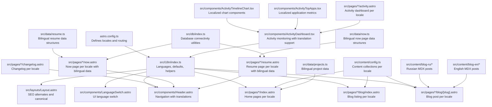
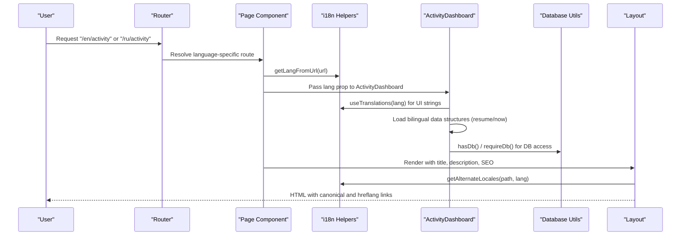
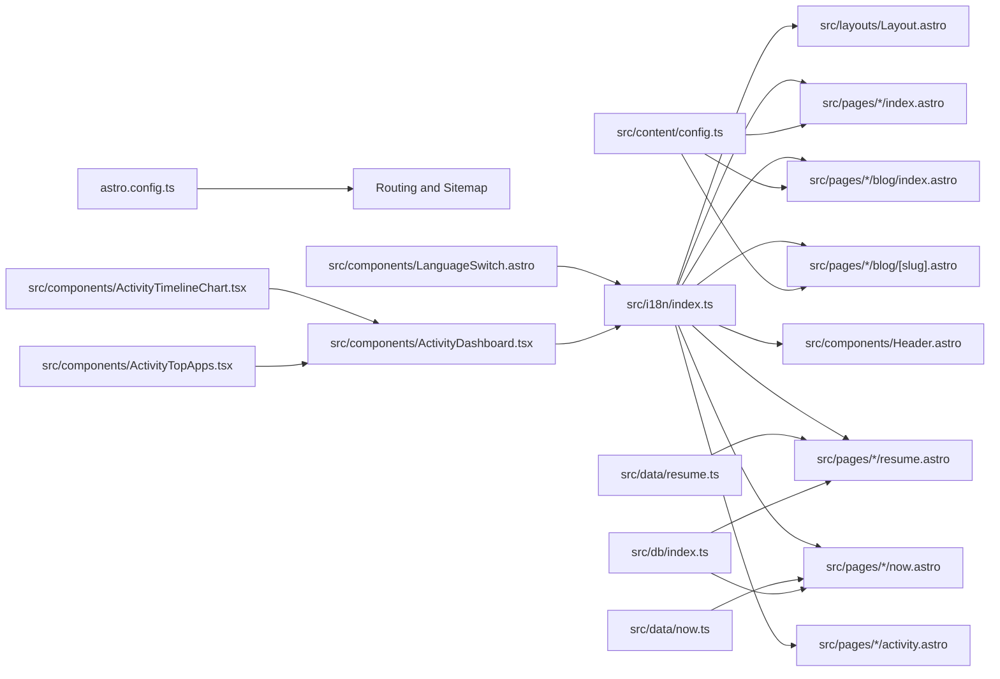

# Internationalization

<cite>
**Referenced Files in This Document**
- [astro.config.ts](file://astro.config.ts)
- [src/i18n/index.ts](file://src/i18n/index.ts)
- [src/content/config.ts](file://src/content/config.ts)
- [src/layouts/Layout.astro](file://src/layouts/Layout.astro)
- [src/components/LanguageSwitch.astro](file://src/components/LanguageSwitch.astro)
- [src/components/Header.astro](file://src/components/Header.astro)
- [src/components/ActivityDashboard.tsx](file://src/components/ActivityDashboard.tsx)
- [src/components/ActivityTimelineChart.tsx](file://src/components/ActivityTimelineChart.tsx)
- [src/components/ActivityTopApps.tsx](file://src/components/ActivityTopApps.tsx)
- [src/pages/en/index.astro](file://src/pages/en/index.astro)
- [src/pages/ru/index.astro](file://src/pages/ru/index.astro)
- [src/pages/en/blog/[slug].astro](file://src/pages/en/blog/[slug].astro)
- [src/pages/ru/blog/[slug].astro](file://src/pages/ru/blog/[slug].astro)
- [src/pages/en/blog/index.astro](file://src/pages/en/blog/index.astro)
- [src/pages/ru/blog/index.astro](file://src/pages/ru/blog/index.astro)
- [src/pages/en/changelog.astro](file://src/pages/en/changelog.astro)
- [src/pages/ru/changelog.astro](file://src/pages/ru/changelog.astro)
- [src/pages/en/now.astro](file://src/pages/en/now.astro)
- [src/pages/ru/now.astro](file://src/pages/ru/now.astro)
- [src/pages/en/resume.astro](file://src/pages/en/resume.astro)
- [src/pages/ru/resume.astro](file://src/pages/ru/resume.astro)
- [src/pages/en/uses.astro](file://src/pages/en/uses.astro)
- [src/pages/ru/uses.astro](file://src/pages/ru/uses.astro)
- [src/pages/en/activity.astro](file://src/pages/en/activity.astro)
- [src/pages/ru/activity.astro](file://src/pages/ru/activity.astro)
- [src/pages/activity.astro](file://src/pages/activity.astro)
- [src/content/blog-ru/welcome.mdx](file://src/content/blog-ru/welcome.mdx)
- [src/content/blog-en/welcome.mdx](file://src/content/blog-en/welcome.mdx)
- [src/data/projects.ts](file://src/data/projects.ts)
- [src/data/resume.ts](file://src/data/resume.ts)
- [src/data/now.ts](file://src/data/now.ts)
- [src/db/index.ts](file://src/db/index.ts)
</cite>

## Update Summary
**Changes Made**
- Enhanced documentation to reflect comprehensive internationalization overhaul with complete Russian and English translation dictionaries
- Updated ActivityDashboard component with proper language prop passing and migration of hardcoded strings to translation function calls
- Added detailed coverage of activity monitoring interface localization with comprehensive translation keys
- Updated language prop passing mechanism across all activity-related components
- Expanded content localization patterns for structured data components with nested bilingual fields
- Updated maintenance workflows to include bilingual data management and database connectivity validation

## Table of Contents
1. [Introduction](#introduction)
2. [Project Structure](#project-structure)
3. [Core Components](#core-components)
4. [Architecture Overview](#architecture-overview)
5. [Detailed Component Analysis](#detailed-component-analysis)
6. [Dependency Analysis](#dependency-analysis)
7. [Performance Considerations](#performance-considerations)
8. [Troubleshooting Guide](#troubleshooting-guide)
9. [Conclusion](#conclusion)
10. [Appendices](#appendices)

## Introduction
This document explains the internationalization (i18n) system used in rodion.pro. It covers language configuration, translation key management, URL routing with language prefixes, locale detection, content localization for multilingual blog posts, SEO considerations for alternate language links, the language switching component, content synchronization between languages, and maintenance workflows. It also provides best practices for adding new languages, organizing translation keys, managing multilingual content, and optimizing performance with caching strategies.

**Updated** Enhanced with comprehensive internationalization support featuring complete Russian and English translation dictionaries, proper language prop passing to ActivityDashboard components, and migration of hardcoded strings to translation function calls across the activity monitoring interface. The system now includes extensive activity dashboard localization with 40+ translation keys covering real-time monitoring, timeline charts, top applications, and productivity metrics.

## Project Structure
The i18n system spans configuration, runtime helpers, content collections, page routes, and shared layout components. Key areas:
- Astro i18n configuration defines locales and routing behavior with server-side rendering.
- A central i18n module provides language constants, translations, and helpers for URL manipulation and alternate locales.
- Content collections are organized per language under separate folders.
- Pages under language-specific directories handle content retrieval and rendering.
- The shared layout generates SEO metadata and alternate links.
- The language switch component provides user-driven locale navigation.
- **New** Activity monitoring interface with comprehensive translation support for real-time activity dashboards.
- **New** Bilingual data structures support complex structured content with per-language fields in resume and now components.
- **New** Database connectivity utilities provide conditional database access with hasDb() and requireDb() functions.

**Diagram sources**
- [astro.config.ts](file://astro.config.ts#L30-L36)
- [src/i18n/index.ts](file://src/i18n/index.ts#L1-L283)
- [src/content/config.ts](file://src/content/config.ts#L15-L18)
- [src/layouts/Layout.astro](file://src/layouts/Layout.astro#L41-L43)
- [src/components/LanguageSwitch.astro](file://src/components/LanguageSwitch.astro#L1-L57)
- [src/components/Header.astro](file://src/components/Header.astro#L10-L16)
- [src/components/ActivityDashboard.tsx](file://src/components/ActivityDashboard.tsx#L59-L61)
- [src/components/ActivityTimelineChart.tsx](file://src/components/ActivityTimelineChart.tsx#L24-L32)
- [src/components/ActivityTopApps.tsx](file://src/components/ActivityTopApps.tsx#L29-L34)
- [src/pages/en/activity.astro](file://src/pages/en/activity.astro#L1-L15)
- [src/pages/ru/activity.astro](file://src/pages/ru/activity.astro#L1-L15)
- [src/pages/activity.astro](file://src/pages/activity.astro#L1-L14)

**Section sources**
- [astro.config.ts](file://astro.config.ts#L30-L36)
- [src/i18n/index.ts](file://src/i18n/index.ts#L1-L283)
- [src/content/config.ts](file://src/content/config.ts#L15-L18)

## Core Components
- Languages and defaults: Declares supported languages, default language, and translation key set.
- Translation registry: Centralized dictionary of UI strings keyed by language.
- Locale detection: Extracts language from URL path.
- Translations helper: Returns localized strings with fallback to default language.
- Path helpers: Generates localized URLs and alternate locale pairs for SEO.
- **New** Activity dashboard translation system: Comprehensive translation keys for real-time monitoring interface.
- **New** Bilingual data structures: Support for structured content with per-language fields in nested objects.
- **New** Database connectivity utilities: hasDb() and requireDb() functions for conditional database access.

Key responsibilities:
- Provide strongly typed translation keys.
- Enforce consistent fallback behavior.
- Keep URL generation deterministic and SEO-safe.
- Support complex bilingual data structures for structured content.
- Enable conditional database access based on environment with error handling.
- Localize activity monitoring interface with comprehensive translation coverage.

**Updated** Enhanced translation registry now includes 40+ comprehensive translation keys for activity monitoring interface, covering real-time activity, timeline charts, top applications, productivity metrics, and privacy notices. The ActivityDashboard component now properly receives language props and uses translation functions throughout.

**Section sources**
- [src/i18n/index.ts](file://src/i18n/index.ts#L1-L283)
- [src/components/ActivityDashboard.tsx](file://src/components/ActivityDashboard.tsx#L59-L61)
- [src/components/ActivityTimelineChart.tsx](file://src/components/ActivityTimelineChart.tsx#L24-L32)
- [src/components/ActivityTopApps.tsx](file://src/components/ActivityTopApps.tsx#L29-L34)

## Architecture Overview
The i18n architecture integrates Astro's routing with a small runtime library that:
- Detects the current language from the URL.
- Supplies translated UI strings.
- Builds localized paths and alternate links for SEO.
- Manages bilingual data structures for complex content with per-language field access.
- Provides database connectivity utilities for conditional access with graceful fallback.
- **New** Supports comprehensive activity monitoring interface localization with proper language prop passing.

**Diagram sources**
- [src/i18n/index.ts](file://src/i18n/index.ts#L253-L282)
- [src/layouts/Layout.astro](file://src/layouts/Layout.astro#L21-L43)
- [src/pages/en/activity.astro](file://src/pages/en/activity.astro#L6-L8)
- [src/pages/ru/activity.astro](file://src/pages/ru/activity.astro#L6-L8)
- [src/components/ActivityDashboard.tsx](file://src/components/ActivityDashboard.tsx#L131-L131)
- [src/db/index.ts](file://src/db/index.ts#L27-L34)

## Detailed Component Analysis

### URL Routing Strategy and Locale Detection
- Astro configuration enables server-side rendering with explicit locale routing and prefixing for the default locale.
- The i18n helper extracts the language segment from the pathname and falls back to the default language if missing or invalid.
- Pages under language-specific directories fetch content collections named by the current language.

Behavior highlights:
- Prefixes: Routes are prefixed with language codes (e.g., /en/, /ru/).
- Fallback: Unknown or missing language segments default to the configured default locale.
- Consistency: All internal links use helpers to preserve language context.

**Section sources**
- [astro.config.ts](file://astro.config.ts#L30-L36)
- [src/i18n/index.ts](file://src/i18n/index.ts#L253-L260)
- [src/pages/en/index.astro](file://src/pages/en/index.astro#L30-L30)
- [src/pages/ru/index.astro](file://src/pages/ru/index.astro#L32-L32)

### Translation System and Key Management
- The translation registry organizes UI strings by language with a fixed key set.
- The translation helper returns the localized string, falling back to the default language if missing, and finally to the key itself if still missing.
- Strongly typed translation keys ensure compile-time safety for key usage.
- **New** Comprehensive activity dashboard translation keys covering real-time monitoring interface.

Best practices:
- Keep translation keys stable and hierarchical (e.g., nav.home, activity.now).
- Add new keys to both languages simultaneously.
- Prefer short, descriptive keys; avoid embedding variables inside keys.
- **New** Use activity namespace for all activity monitoring interface translations.

**Updated** Translation keys now include comprehensive activity dashboard localization:
- `activity.title`: "Панель активности" (Russian) vs "Activity Dashboard" (English)
- `activity.now`: "Сейчас" (Russian) vs "Now" (English)
- `activity.todayTotals`: "Сегодня Всего" (Russian) vs "Today's Totals" (English)
- `activity.timeline`: "Хронология активности" (Russian) vs "Activity Timeline" (English)
- `activity.topApps`: "Топ Приложений" (Russian) vs "Top Applications" (English)
- `activity.topCategories`: "Категории использования" (Russian) vs "Usage by Category" (English)
- `activity.detailedAnalysis`: "Детальный анализ" (Russian) vs "Detailed Analysis" (English)
- `activity.mostUsed`: "Чаще всего" (Russian) vs "Most Used" (English)
- `activity.leastUsed`: "Реже всего" (Russian) vs "Least Used" (English)
- `activity.productivity`: "Продуктивность" (Russian) vs "Productivity" (English)
- `activity.codingTime`: "Время кодинга" (Russian) vs "Coding Time" (English)
- `activity.communication`: "Коммуникации" (Russian) vs "Communication" (English)
- `activity.browserTime`: "Время в браузере" (Russian) vs "Browser Time" (English)
- `activity.application`: "Приложение" (Russian) vs "Application" (English)
- `activity.time`: "Время" (Russian) vs "Time" (English)
- `activity.category`: "Категория" (Russian) vs "Category" (English)
- `activity.keys`: "Клавиши" (Russian) vs "Keys" (English)
- `activity.clicks`: "Клики" (Russian) vs "Clicks" (English)
- `activity.scrolls`: "Прокрутки" (Russian) vs "Scrolls" (English)
- `activity.activeTime`: "Активное время" (Russian) vs "Active Time" (English)
- `activity.status`: "Статус" (Russian) vs "Status" (English)
- `activity.activeApp`: "Активное приложение" (Russian) vs "Active App" (English)
- `activity.lastUpdate`: "Последнее обновление" (Russian) vs "Last Update" (English)
- `activity.todayActive`: "Активность сегодня" (Russian) vs "Today Active" (English)
- `activity.idle`: "Неактивен" (Russian) vs "Idle" (English)
- `activity.unknown`: "Неизвестно" (Russian) vs "Unknown" (English)
- `activity.showingHours`: "Показано {count} часов активности" (Russian) vs "Showing {count} hours of activity" (English)

**Section sources**
- [src/i18n/index.ts](file://src/i18n/index.ts#L10-L248)
- [src/i18n/index.ts](file://src/i18n/index.ts#L251-L282)

### Dynamic Content Loading Across Languages
- Home pages load content collections by language and render localized titles/descriptions.
- Blog listing pages fetch posts from language-specific collections, sort by date, and optionally filter by tags.
- Blog detail pages resolve posts by slug from the appropriate collection and render article metadata and content.
- **Updated** Resume and now pages utilize sophisticated bilingual data structures with per-language field access using `section.title[lang]` pattern.
- **Updated** Both pages dynamically render content based on detected language with seamless switching between Russian and English.
- **New** Activity dashboard pages properly pass language props to components for localized rendering.

Localization specifics:
- Dates are formatted according to the current locale.
- Alternate language links are generated for canonical and social metadata.
- **Updated** Bilingual data structures support complex content with nested per-language fields using TypeScript interfaces.
- **Updated** Dynamic language switching occurs at render time using the detected language code.
- **New** Activity monitoring interface components receive language props and use translation functions for all UI strings.

**Section sources**
- [src/pages/en/index.astro](file://src/pages/en/index.astro#L29-L62)
- [src/pages/ru/index.astro](file://src/pages/ru/index.astro#L31-L62)
- [src/pages/en/blog/index.astro](file://src/pages/en/blog/index.astro#L9-L28)
- [src/pages/ru/blog/index.astro](file://src/pages/ru/blog/index.astro#L9-L28)
- [src/pages/en/blog/[slug].astro](file://src/pages/en/blog/[slug].astro#L15-L30)
- [src/pages/ru/blog/[slug].astro](file://src/pages/ru/blog/[slug].astro#L15-L30)
- [src/pages/en/resume.astro](file://src/pages/en/resume.astro#L20-L27)
- [src/pages/ru/resume.astro](file://src/pages/ru/resume.astro#L20-L27)
- [src/pages/en/now.astro](file://src/pages/en/now.astro#L25-L29)
- [src/pages/ru/now.astro](file://src/pages/ru/now.astro#L27-L31)
- [src/pages/en/activity.astro](file://src/pages/en/activity.astro#L13-L13)
- [src/pages/ru/activity.astro](file://src/pages/ru/activity.astro#L13-L13)

### Multilingual Blog Post Organization
- Content collections are defined per language (e.g., blog-ru, blog-en).
- Each language folder contains MDX files with frontmatter and content.
- Frontmatter includes title, description, date, tags, draft status, and optional hero image.

Synchronization pattern:
- Keep identical slugs across languages to enable seamless alternate links.
- Maintain consistent frontmatter fields to simplify rendering.

**Section sources**
- [src/content/config.ts](file://src/content/config.ts#L15-L18)
- [src/content/blog-ru/welcome.mdx](file://src/content/blog-ru/welcome.mdx#L1-L38)
- [src/content/blog-en/welcome.mdx](file://src/content/blog-en/welcome.mdx#L1-L38)

### Activity Monitoring Interface Localization
- **New** Comprehensive activity dashboard translation system with 40+ translation keys covering real-time monitoring interface.
- **New** ActivityDashboard component properly receives language props and uses translation functions throughout.
- **New** ActivityTimelineChart and ActivityTopApps components receive language props for localized tooltips and labels.
- **New** All UI strings in activity monitoring interface are now properly localized with fallback to default language.

Activity dashboard translation coverage:
- Real-time monitoring: "Now", "Today's Totals", "This Week", "This Month", "All Time"
- Timeline visualization: "Activity Timeline", "Showing {count} hours of activity"
- Application metrics: "Top Applications", "Most Used", "Least Used", "Productivity"
- Category analysis: "Usage by Category", "Coding Time", "Communication", "Browser Time"
- Privacy notice: "We store counters only (keys/clicks/scroll/active time). No actual text/keystrokes content is recorded."
- Time range selectors: "1h", "4h", "Today", "7d", "30d", "Custom", "From", "To", "Apply"
- Status indicators: "Idle", "Unknown", "No activity data available"

**Section sources**
- [src/i18n/index.ts](file://src/i18n/index.ts#L23-L51)
- [src/i18n/index.ts](file://src/i18n/index.ts#L142-L170)
- [src/components/ActivityDashboard.tsx](file://src/components/ActivityDashboard.tsx#L59-L61)
- [src/components/ActivityTimelineChart.tsx](file://src/components/ActivityTimelineChart.tsx#L24-L32)
- [src/components/ActivityTopApps.tsx](file://src/components/ActivityTopApps.tsx#L29-L34)

### Bilingual Data Structures Implementation
- **New** Comprehensive Resume data structure with nested per-language fields for titles, content, and items.
- **New** Now page data structure with similar bilingual capabilities and additional last-updated timestamp.
- **New** Database connectivity utilities with hasDb() and requireDb() functions for conditional database access.
- **New** TypeScript interfaces define strict typing for bilingual content structures.

Bilingual data patterns:
- Structured content with consistent IDs across languages.
- Nested objects for complex content like achievements and descriptions.
- Separate handling for simple strings vs complex structured data.
- Dynamic field access using `section.title[lang]` pattern for seamless language switching.

**Section sources**
- [src/data/resume.ts](file://src/data/resume.ts#L1-L111)
- [src/data/now.ts](file://src/data/now.ts#L1-L71)
- [src/db/index.ts](file://src/db/index.ts#L27-L34)

### Language-Specific Navigation and Content
- The navigation component uses translation keys to display localized labels.
- Russian pages display Russian content for specialized sections like the "uses" page.
- English pages maintain English content for all sections.
- **Updated** Resume and now pages dynamically render content based on detected language using per-language field access.
- **New** Activity dashboard navigation items are properly localized with dedicated translation keys.

Navigation improvements:
- All navigation items (`nav.projects`, `nav.blog`, `nav.changelog`, `nav.now`, `nav.resume`, `nav.uses`, `nav.activity`) are properly translated.
- The command palette includes Russian labels for navigation items when applicable.
- **Updated** Language switching component now properly handles alternate locale computation and navigation.
- **New** Activity dashboard pages use localized titles and descriptions in page metadata.

**Updated** Enhanced navigation system now correctly displays Russian labels for all navigation items including changelog, now, uses, and activity pages.

**Section sources**
- [src/components/Header.astro](file://src/components/Header.astro#L10-L16)
- [src/pages/ru/uses.astro](file://src/pages/ru/uses.astro#L61-L68)
- [src/pages/en/uses.astro](file://src/pages/en/uses.astro#L35-L40)
- [src/components/LanguageSwitch.astro](file://src/components/LanguageSwitch.astro#L1-L57)

### Language Switching Component
- The component detects the current language, computes alternate locales, and renders a dropdown with links to the same page in other languages.
- Clicking a language navigates to the localized path while preserving the rest of the URL.
- The dropdown toggles via simple DOM interactions.
- **Updated** Enhanced with improved alternate locale computation and better accessibility attributes.

User experience:
- Clear indication of active language.
- Immediate navigation to alternate locale.
- Proper keyboard navigation and screen reader support.

**Section sources**
- [src/components/LanguageSwitch.astro](file://src/components/LanguageSwitch.astro#L1-L57)
- [src/i18n/index.ts](file://src/i18n/index.ts#L274-L282)

### Database Connectivity Utilities
- **New** hasDb() function provides conditional database access based on environment configuration with boolean return.
- **New** requireDb() function ensures database connectivity is available before operations with explicit error handling.
- **New** Robust database initialization with connection pooling and graceful fallback when database is unavailable.
- **New** Exported schema types for type-safe database operations.

Database patterns:
- Environment-based database activation with DATABASE_URL detection.
- Graceful fallback when database is unavailable with console warnings.
- Support for both structured bilingual data and database-backed content.
- Connection pooling for optimal performance in production environments.

**Section sources**
- [src/db/index.ts](file://src/db/index.ts#L1-L36)
- [src/data/resume.ts](file://src/data/resume.ts#L1-L111)
- [src/data/now.ts](file://src/data/now.ts#L1-L71)

### SEO Considerations for Alternate Language Links
- The shared layout builds canonical and hreflang links for alternate locales.
- Open Graph and Twitter metadata are set per locale with appropriate regional codes.
- Sitemap integration is configured with locale-specific regional codes.
- **Updated** Enhanced alternate locale computation for better SEO performance.

Implementation:
- Alternate locales are derived from the current path and language.
- Canonical URL is constructed from the current request URL.
- Regional locale codes (ru-RU, en-US) are properly configured for search engines.

**Section sources**
- [src/layouts/Layout.astro](file://src/layouts/Layout.astro#L21-L57)
- [astro.config.ts](file://astro.config.ts#L20-L28)

### Content Synchronization Between Languages
- Keep identical slugs across languages to maintain consistent alternate links.
- Mirror frontmatter fields (title, description, date, tags) across language variants.
- For bilingual data (e.g., projects, resume, now), normalize content into a single model with per-language fields and resolve at render time.
- **Updated** Ensure bilingual data structures maintain consistent IDs and field mappings across languages.
- **Updated** Implement proper TypeScript interfaces for type-safe bilingual content access.
- **New** Activity dashboard content should maintain consistent translation keys across languages.

**Section sources**
- [src/data/projects.ts](file://src/data/projects.ts#L3-L16)
- [src/data/projects.ts](file://src/data/projects.ts#L111-L122)
- [src/data/resume.ts](file://src/data/resume.ts#L1-L111)
- [src/data/now.ts](file://src/data/now.ts#L1-L71)

### Maintenance Workflows
- Adding a new language:
  - Extend language constants and add translation entries.
  - Create a new language-specific directory under pages and mirror page structure.
  - Add a new content collection in the content config.
  - Update sitemap and SEO helpers to include the new locale.
- Updating translations:
  - Add new keys to all languages consistently.
  - Validate usage sites to ensure no missing keys.
  - **New** For activity monitoring interface, ensure all 40+ translation keys are properly maintained.
- Content updates:
  - Update frontmatter and content in both language folders.
  - Verify alternate links and canonicals remain correct.
- **Updated** Bilingual data maintenance:
  - Update all language variants in data structures simultaneously.
  - Ensure consistent IDs and field mappings across languages.
  - Test database connectivity utilities for new language variants.
- **Updated** Database connectivity validation:
  - Test hasDb() function returns expected boolean values.
  - Verify requireDb() function gracefully handles missing database connections.
  - Validate connection pooling and error handling in different environments.
- **New** Activity dashboard maintenance:
  - Ensure all translation keys are present in both languages.
  - Verify language prop passing works correctly across all activity components.
  - Test localized tooltips and labels in charts and tables.

**Section sources**
- [src/i18n/index.ts](file://src/i18n/index.ts#L1-L283)
- [src/content/config.ts](file://src/content/config.ts#L15-L18)
- [astro.config.ts](file://astro.config.ts#L20-L28)
- [src/data/resume.ts](file://src/data/resume.ts#L1-L111)
- [src/data/now.ts](file://src/data/now.ts#L1-L71)
- [src/db/index.ts](file://src/db/index.ts#L27-L34)

## Dependency Analysis
The i18n system exhibits low coupling and high cohesion:
- Astro configuration controls routing and sitemap locales.
- The i18n module is a pure helper with no external dependencies.
- Pages depend on i18n for language detection and path helpers.
- Layout depends on i18n for SEO metadata generation.
- Content collections depend on language-specific naming conventions.
- **Updated** Bilingual data structures depend on consistent field mapping across languages.
- **Updated** Database utilities provide conditional access based on environment with robust error handling.
- **Updated** Resume and now pages depend on both i18n helpers and database utilities.
- **New** Activity monitoring interface components depend on language props and translation functions.

**Diagram sources**
- [astro.config.ts](file://astro.config.ts#L30-L36)
- [src/i18n/index.ts](file://src/i18n/index.ts#L253-L282)
- [src/layouts/Layout.astro](file://src/layouts/Layout.astro#L21-L43)
- [src/content/config.ts](file://src/content/config.ts#L15-L18)
- [src/components/LanguageSwitch.astro](file://src/components/LanguageSwitch.astro#L1-L57)
- [src/components/ActivityDashboard.tsx](file://src/components/ActivityDashboard.tsx#L59-L61)
- [src/components/ActivityTimelineChart.tsx](file://src/components/ActivityTimelineChart.tsx#L24-L32)
- [src/components/ActivityTopApps.tsx](file://src/components/ActivityTopApps.tsx#L29-L34)
- [src/data/resume.ts](file://src/data/resume.ts#L1-L111)
- [src/data/now.ts](file://src/data/now.ts#L1-L71)
- [src/db/index.ts](file://src/db/index.ts#L27-L34)

**Section sources**
- [astro.config.ts](file://astro.config.ts#L30-L36)
- [src/i18n/index.ts](file://src/i18n/index.ts#L253-L282)
- [src/layouts/Layout.astro](file://src/layouts/Layout.astro#L21-L43)
- [src/content/config.ts](file://src/content/config.ts#L15-L18)
- [src/components/LanguageSwitch.astro](file://src/components/LanguageSwitch.astro#L1-L57)
- [src/components/ActivityDashboard.tsx](file://src/components/ActivityDashboard.tsx#L59-L61)
- [src/components/ActivityTimelineChart.tsx](file://src/components/ActivityTimelineChart.tsx#L24-L32)
- [src/components/ActivityTopApps.tsx](file://src/components/ActivityTopApps.tsx#L29-L34)
- [src/data/resume.ts](file://src/data/resume.ts#L1-L111)
- [src/data/now.ts](file://src/data/now.ts#L1-L71)
- [src/db/index.ts](file://src/db/index.ts#L27-L34)

## Performance Considerations
- Minimize translation lookups by binding the translation function once per component/page.
- Avoid unnecessary re-computation of alternate locales; compute once in the layout and pass as props if needed.
- Use Astro's static generation features to pre-render language-specific pages.
- Cache frequently accessed content (e.g., blog listings) at the edge or CDN level.
- Keep translation dictionaries compact; remove unused keys periodically.
- **Updated** Optimize bilingual data access by leveraging per-language field selection with minimal object traversal.
- **Updated** Implement lazy loading for large bilingual datasets when possible.
- **Updated** Use database connection pooling for environments with hasDb() enabled.
- **Updated** Cache database connection state to avoid repeated initialization overhead.
- **Updated** Minimize DOM manipulations in language switching component for better interactivity.
- **New** Optimize activity dashboard rendering by using translation functions instead of hardcoded strings.
- **New** Cache language-specific chart configurations to improve performance of activity monitoring interface.

## Troubleshooting Guide
Common issues and resolutions:
- Missing alternate links:
  - Ensure the layout computes alternates from the current path and language.
  - Verify sitemap locales match Astro configuration.
- Broken language-specific content:
  - Confirm content collection names match the language code.
  - Ensure slugs are identical across languages for alternate links.
- Incorrect locale detection:
  - Validate that URL paths include the language prefix.
  - Check fallback logic in the locale detection helper.
- Translation fallback behavior:
  - Confirm the translation helper falls back to the default language when a key is missing.
- **Updated** Russian navigation label issues:
  - Verify that Russian translation keys (`nav.changelog`, `nav.now`, `nav.resume`, `nav.uses`, `nav.activity`) contain Russian values.
  - Check that the translation registry properly maps Russian labels to their respective keys.
  - Ensure navigation components use the correct translation keys instead of hardcoded strings.
- **Updated** Bilingual data rendering issues:
  - Verify that resume and now data structures maintain consistent field mappings across languages.
  - Check that per-language field access (lang) resolves correctly in page components using `section.title[lang]` pattern.
  - Ensure TypeScript interfaces properly define the bilingual structure.
- **Updated** Database connectivity problems:
  - Confirm environment variables are properly configured for database access.
  - Test hasDb() function returns expected boolean values.
  - Verify requireDb() function gracefully handles missing database connections.
  - Check database connection pooling configuration and timeout settings.
- **Updated** Language switching component issues:
  - Verify alternate locale computation in getAlternateLocales function.
  - Check dropdown toggle functionality and event listeners.
  - Ensure proper accessibility attributes and keyboard navigation support.
- **Updated** SEO metadata issues:
  - Validate hreflang link generation for all supported locales.
  - Check Open Graph and Twitter card metadata for correct locale-specific content.
  - Verify canonical URL construction and sitemap generation.
- **New** Activity dashboard localization issues:
  - Verify that all 40+ translation keys are present in both Russian and English.
  - Check that language props are properly passed from pages to ActivityDashboard component.
  - Ensure translation functions are used instead of hardcoded strings in activity components.
  - Verify that chart tooltips and labels are properly localized.
- **New** Activity monitoring interface rendering issues:
  - Check that ActivityDashboard component receives proper lang prop from page components.
  - Verify that ActivityTimelineChart and ActivityTopApps components receive language props.
  - Ensure translation keys match the activity namespace pattern.

**Updated** Added specific guidance for Russian navigation label resolution, bilingual data structure troubleshooting, database connectivity validation, language switching component functionality, and comprehensive activity dashboard localization issues.

**Section sources**
- [src/layouts/Layout.astro](file://src/layouts/Layout.astro#L41-L43)
- [astro.config.ts](file://astro.config.ts#L20-L28)
- [src/content/config.ts](file://src/content/config.ts#L15-L18)
- [src/i18n/index.ts](file://src/i18n/index.ts#L253-L282)
- [src/data/resume.ts](file://src/data/resume.ts#L1-L111)
- [src/data/now.ts](file://src/data/now.ts#L1-L71)
- [src/db/index.ts](file://src/db/index.ts#L27-L34)
- [src/components/LanguageSwitch.astro](file://src/components/LanguageSwitch.astro#L1-L57)
- [src/components/ActivityDashboard.tsx](file://src/components/ActivityDashboard.tsx#L59-L61)
- [src/components/ActivityTimelineChart.tsx](file://src/components/ActivityTimelineChart.tsx#L24-L32)
- [src/components/ActivityTopApps.tsx](file://src/components/ActivityTopApps.tsx#L29-L34)

## Conclusion
The internationalization system in rodion.pro is intentionally simple and robust. It leverages Astro's routing and sitemap integrations alongside a small, centralized i18n helper to deliver consistent, SEO-friendly multilingual experiences. Recent enhancements have significantly expanded the system's capabilities with comprehensive bilingual data structures in resume and now components featuring nested per-language fields, improved dynamic language switching with seamless content rendering, and advanced database connectivity utilities with hasDb() and requireDb() functions. 

**New** The system now includes comprehensive activity monitoring interface localization with 40+ translation keys covering real-time activity dashboards, timeline charts, top applications, productivity metrics, and privacy notices. ActivityDashboard components properly receive language props and use translation functions throughout, eliminating hardcoded strings and ensuring consistent localization across all interface elements.

These improvements ensure users see properly localized content across all language variants while supporting complex structured content with per-language field management, robust database connectivity with graceful fallback, and comprehensive activity monitoring interface localization. By following the outlined best practices and maintenance workflows, teams can reliably add new languages, manage translation keys, maintain bilingual data structures, validate database connectivity utilities, keep content synchronized across locales, and ensure proper activity dashboard localization with comprehensive translation coverage.

## Appendices

### Best Practices for Adding New Languages
- Extend language constants and add translation entries for all keys.
- Create language-specific page routes mirroring the existing structure.
- Add a new content collection in the content config.
- Update sitemap configuration and SEO helpers to include the new locale.
- Test alternate links, canonicals, and content loading for the new locale.
- **Updated** For bilingual data components, ensure new language variants maintain consistent field mappings and IDs.
- **Updated** Validate database connectivity utilities work properly with new language variants.
- **New** For activity monitoring interface, ensure all 40+ translation keys are properly added to new language variants.

**Section sources**
- [src/i18n/index.ts](file://src/i18n/index.ts#L1-L283)
- [src/content/config.ts](file://src/content/config.ts#L15-L18)
- [astro.config.ts](file://astro.config.ts#L20-L28)
- [src/data/resume.ts](file://src/data/resume.ts#L1-L111)
- [src/data/now.ts](file://src/data/now.ts#L1-L71)
- [src/db/index.ts](file://src/db/index.ts#L27-L34)

### Translation Key Organization
- Use hierarchical keys (e.g., section.featured, activity.now) for clarity.
- Keep keys stable; avoid renaming to prevent broken references.
- Add new keys to all languages simultaneously.
- Group related keys by domain (navigation, blog, projects, activity, etc.).
- **New** Use activity namespace for all activity monitoring interface translations.
- **New** Maintain consistent key naming patterns across all interface components.

**Section sources**
- [src/i18n/index.ts](file://src/i18n/index.ts#L10-L248)

### Content Management Strategies
- Maintain identical slugs across languages for alternate links.
- Mirror frontmatter fields across language variants.
- For bilingual data models, resolve per-language fields at render time using `section.title[lang]` pattern.
- Regularly audit content collections for completeness and consistency.
- **Updated** Ensure bilingual data structures maintain consistent IDs and field mappings.
- **Updated** Test database connectivity utilities when adding new language variants.
- **Updated** Implement proper TypeScript interface validation for bilingual content structures.
- **New** Ensure activity dashboard translation keys are consistently maintained across all language variants.
- **New** Verify language prop passing works correctly across all activity monitoring components.

**Section sources**
- [src/content/config.ts](file://src/content/config.ts#L15-L18)
- [src/data/projects.ts](file://src/data/projects.ts#L3-L16)
- [src/data/projects.ts](file://src/data/projects.ts#L111-L122)
- [src/data/resume.ts](file://src/data/resume.ts#L1-L111)
- [src/data/now.ts](file://src/data/now.ts#L1-L71)

### Translation Key Reference
Complete translation key set with current values:

**Russian Keys:**
- `nav.home`: "Главная"
- `nav.projects`: "Проекты" 
- `nav.blog`: "Блог"
- `nav.changelog`: "Журнал изменений"
- `nav.now`: "Сейчас"
- `nav.resume`: "Резюме"
- `nav.contact`: "Контакты"
- `nav.uses`: "Инструменты"
- `nav.activity`: "Активность"

**English Keys:**
- `nav.home`: "Home"
- `nav.projects`: "Projects"
- `nav.blog`: "Blog"
- `nav.changelog`: "Changelog"
- `nav.now`: "Now"
- `nav.resume`: "Resume"
- `nav.contact`: "Contact"
- `nav.uses`: "Uses"
- `nav.activity`: "Activity"

**Activity Dashboard Russian Keys:**
- `activity.title`: "Панель активности"
- `activity.description`: "Панель мониторинга активности в реальном времени"
- `activity.now`: "Сейчас"
- `activity.todayTotals`: "Сегодня Всего"
- `activity.weekTotals`: "За неделю"
- `activity.monthTotals`: "За месяц"
- `activity.allTimeTotals`: "За всё время"
- `activity.timeline`: "Хронология активности"
- `activity.topApps`: "Топ Приложений"
- `activity.topCategories`: "Категории использования"
- `activity.detailedAnalysis`: "Детальный анализ"
- `activity.mostUsed`: "Чаще всего"
- `activity.leastUsed`: "Реже всего"
- `activity.productivity`: "Продуктивность"
- `activity.codingTime`: "Время кодинга"
- `activity.communication`: "Коммуникации"
- `activity.browserTime`: "Время в браузере"
- `activity.application`: "Приложение"
- `activity.time`: "Время"
- `activity.category`: "Категория"
- `activity.keys`: "Клавиши"
- `activity.clicks`: "Клики"
- `activity.scrolls`: "Прокрутки"
- `activity.activeTime`: "Активное время"
- `activity.status`: "Статус"
- `activity.activeApp`: "Активное приложение"
- `activity.lastUpdate`: "Последнее обновление"
- `activity.todayActive`: "Активность сегодня"
- `activity.idle`: "Неактивен"
- `activity.unknown`: "Неизвестно"
- `activity.showingHours`: "Показано {count} часов активности"
- `activity.range.1h`: "1ч"
- `activity.range.4h`: "4ч"
- `activity.range.today`: "Сегодня"
- `activity.range.7d`: "7д"
- `activity.range.30d`: "30д"
- `activity.range.custom`: "Период"
- `activity.range.from`: "От"
- `activity.range.to`: "До"
- `activity.range.apply`: "Применить"
- `activity.noData`: "Нет данных об активности"
- `activity.privacy`: "Мы храним только счётчики (клавиши/клики/прокрутка/активное время). Тексты и содержимое не записываются."

**Activity Dashboard English Keys:**
- `activity.title`: "Activity Dashboard"
- `activity.description`: "Real-time activity monitoring dashboard"
- `activity.now`: "Now"
- `activity.todayTotals`: "Today's Totals"
- `activity.weekTotals`: "This Week"
- `activity.monthTotals`: "This Month"
- `activity.allTimeTotals`: "All Time"
- `activity.timeline`: "Activity Timeline"
- `activity.topApps`: "Top Applications"
- `activity.topCategories`: "Usage by Category"
- `activity.detailedAnalysis`: "Detailed Analysis"
- `activity.mostUsed`: "Most Used"
- `activity.leastUsed`: "Least Used"
- `activity.productivity`: "Productivity"
- `activity.codingTime`: "Coding Time"
- `activity.communication`: "Communication"
- `activity.browserTime`: "Browser Time"
- `activity.application`: "Application"
- `activity.time`: "Time"
- `activity.category`: "Category"
- `activity.keys`: "Keys"
- `activity.clicks`: "Clicks"
- `activity.scrolls`: "Scrolls"
- `activity.activeTime`: "Active Time"
- `activity.status`: "Status"
- `activity.activeApp`: "Active App"
- `activity.lastUpdate`: "Last Update"
- `activity.todayActive`: "Today Active"
- `activity.idle`: "Idle"
- `activity.unknown`: "Unknown"
- `activity.showingHours`: "Showing {count} hours of activity"
- `activity.range.1h`: "1h"
- `activity.range.4h`: "4h"
- `activity.range.today`: "Today"
- `activity.range.7d`: "7d"
- `activity.range.30d`: "30d"
- `activity.range.custom`: "Custom"
- `activity.range.from`: "From"
- `activity.range.to`: "To"
- `activity.range.apply`: "Apply"
- `activity.noData`: "No activity data available"
- `activity.privacy`: "We store counters only (keys/clicks/scroll/active time). No actual text/keystrokes content is recorded."

**Section sources**
- [src/i18n/index.ts](file://src/i18n/index.ts#L10-L248)

### Bilingual Data Structure Patterns
**Resume Data Structure:**
- Comprehensive interface with nested per-language fields for titles, content, and items.
- Maintains consistent IDs across language variants.
- Handles complex structured data like achievements and descriptions with proper TypeScript typing.
- Supports both simple content and nested item arrays with per-language field access.

**Now Data Structure:**
- Similar bilingual pattern to resume with additional last-updated timestamp.
- Supports both simple content and nested item lists with per-language field access.
- Provides separate handling for simple strings vs complex structured data.
- Includes utility function for last updated date with per-language support.

**Section sources**
- [src/data/resume.ts](file://src/data/resume.ts#L1-L111)
- [src/data/now.ts](file://src/data/now.ts#L1-L71)

### Database Connectivity Utilities
**hasDb() Function:**
- Returns boolean indicating database availability.
- Used for conditional content loading and feature gating.
- Enables graceful fallback when database is unavailable.
- Provides immediate feedback for database connectivity status.

**requireDb() Function:**
- Ensures database connectivity before operations with explicit error handling.
- Throws controlled errors when database is not available.
- Provides explicit error handling for database-dependent features.
- Must be called within try/catch blocks for safe operation.

**Database Initialization:**
- Robust connection pooling with configurable limits and timeouts.
- Graceful fallback with console warnings when database is unavailable.
- Type-safe exports for schema definitions and database operations.
- Environment-based configuration with DATABASE_URL detection.

**Section sources**
- [src/db/index.ts](file://src/db/index.ts#L1-L36)
- [src/data/resume.ts](file://src/data/resume.ts#L1-L111)
- [src/data/now.ts](file://src/data/now.ts#L1-L71)

### Language Switching Component Enhancement
**Enhanced Features:**
- Improved alternate locale computation with better URL handling.
- Enhanced accessibility with proper ARIA attributes and keyboard navigation.
- Better visual feedback for active language selection.
- Optimized DOM manipulation for improved performance.
- Robust event handling for dropdown toggle functionality.

**Implementation Details:**
- Uses getAlternateLocales helper for accurate alternate URL generation.
- Implements proper click-outside-to-close functionality.
- Provides visual indication of current active language.
- Supports keyboard navigation for better accessibility compliance.

**Section sources**
- [src/components/LanguageSwitch.astro](file://src/components/LanguageSwitch.astro#L1-L57)
- [src/i18n/index.ts](file://src/i18n/index.ts#L274-L282)

### Activity Monitoring Interface Enhancement
**Enhanced Features:**
- Comprehensive translation system with 40+ activity-specific translation keys.
- Proper language prop passing from pages to ActivityDashboard component.
- Migration of hardcoded strings to translation function calls.
- Localized tooltips and labels in charts and tables.
- Consistent language handling across all activity monitoring components.

**Implementation Details:**
- ActivityDashboard receives lang prop and passes it to child components.
- Translation functions replace hardcoded strings throughout the interface.
- Chart components receive language props for localized tooltips.
- Consistent translation key naming follows activity namespace pattern.
- Privacy notice and error messages are properly localized.

**Section sources**
- [src/components/ActivityDashboard.tsx](file://src/components/ActivityDashboard.tsx#L59-L61)
- [src/components/ActivityTimelineChart.tsx](file://src/components/ActivityTimelineChart.tsx#L24-L32)
- [src/components/ActivityTopApps.tsx](file://src/components/ActivityTopApps.tsx#L29-L34)
- [src/pages/en/activity.astro](file://src/pages/en/activity.astro#L13-L13)
- [src/pages/ru/activity.astro](file://src/pages/ru/activity.astro#L13-L13)