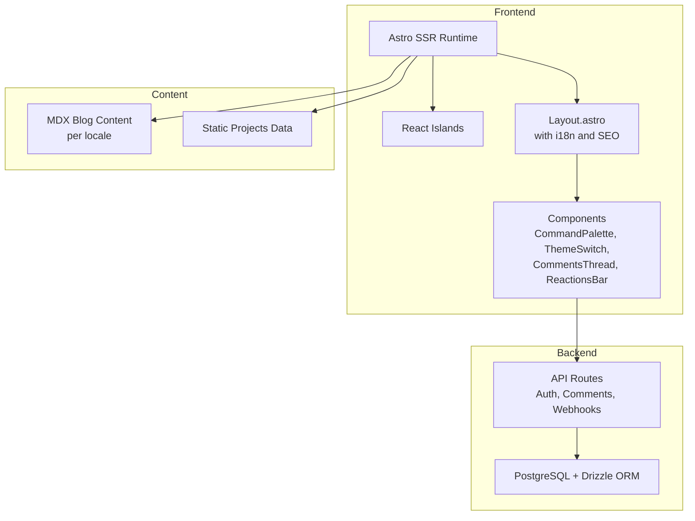
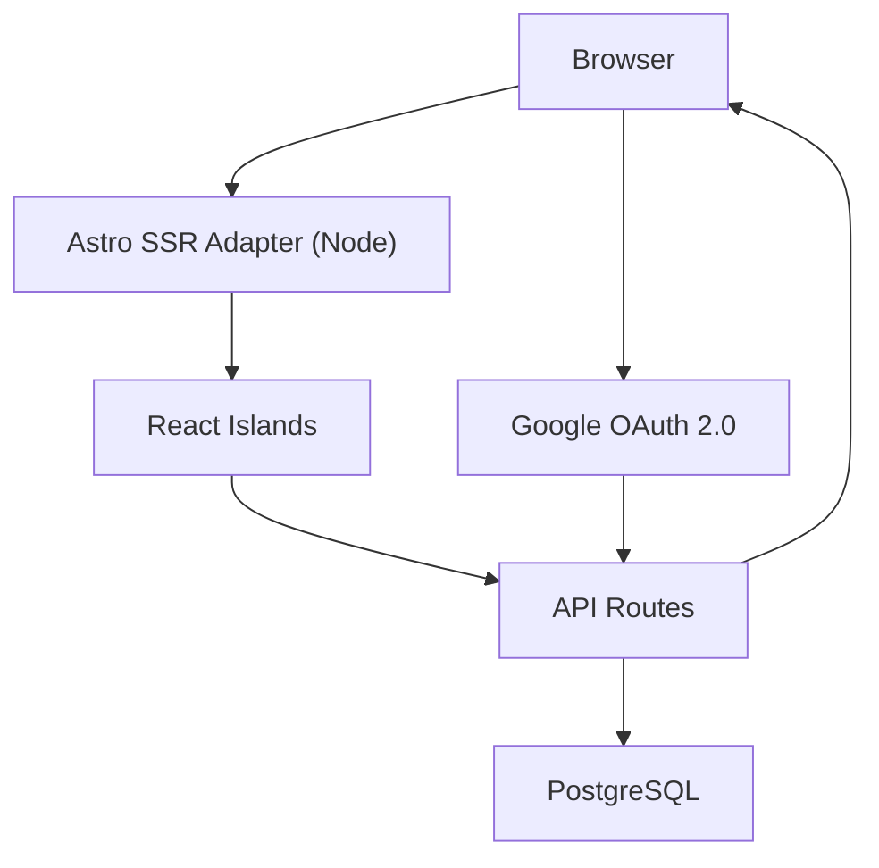
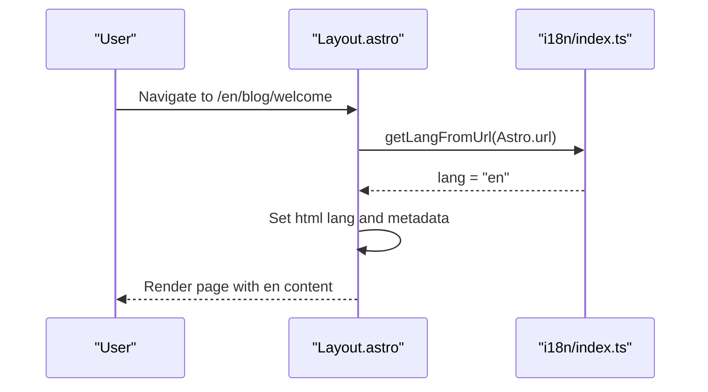
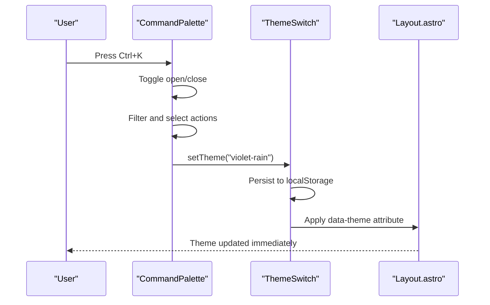
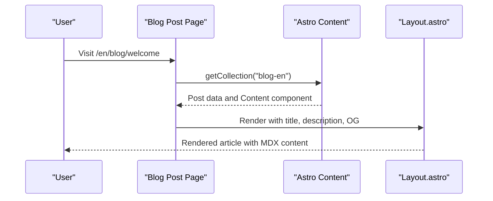
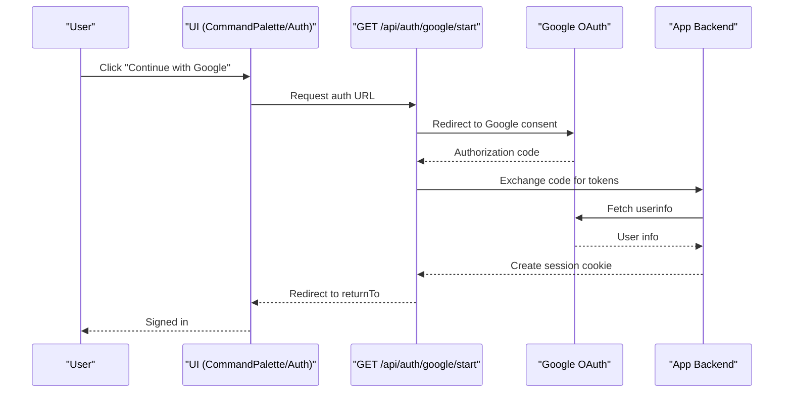
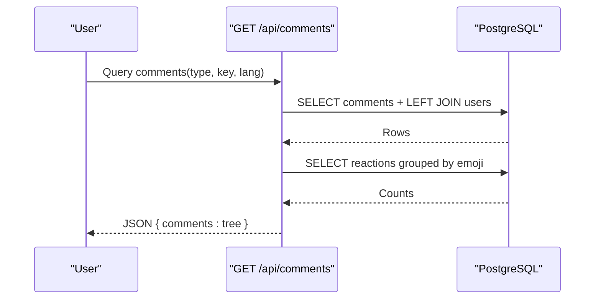
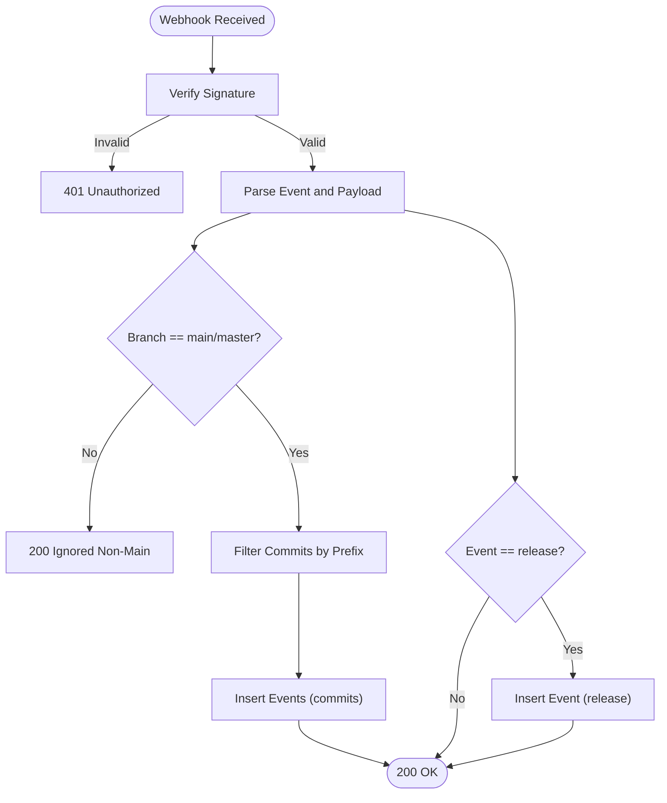
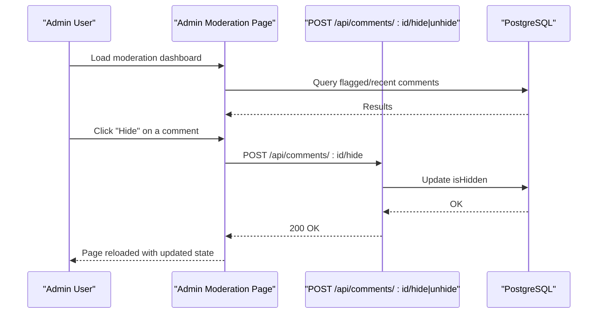
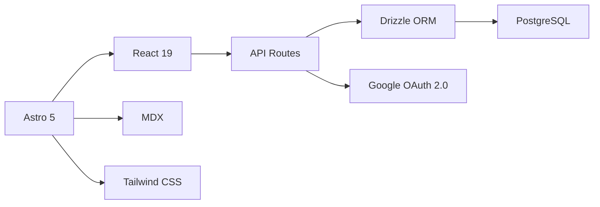

# Project Overview

<cite>
**Referenced Files in This Document**
- [README.md](file://README.md)
- [package.json](file://package.json)
- [astro.config.ts](file://astro.config.ts)
- [src/i18n/index.ts](file://src/i18n/index.ts)
- [src/layouts/Layout.astro](file://src/layouts/Layout.astro)
- [src/components/CommandPalette.tsx](file://src/components/CommandPalette.tsx)
- [src/components/ThemeSwitch.tsx](file://src/components/ThemeSwitch.tsx)
- [src/pages/admin/moderation.astro](file://src/pages/admin/moderation.astro)
- [src/lib/auth.ts](file://src/lib/auth.ts)
- [src/db/schema/index.ts](file://src/db/schema/index.ts)
- [src/db/index.ts](file://src/db/index.ts)
- [src/data/projects.ts](file://src/data/projects.ts)
- [src/content/blog-en/welcome.mdx](file://src/content/blog-en/welcome.mdx)
- [src/content/blog-ru/welcome.mdx](file://src/content/blog-ru/welcome.mdx)
- [src/pages/en/blog/[slug].astro](file://src/pages/en/blog/[slug].astro)
- [src/pages/api/webhooks/github.ts](file://src/pages/api/webhooks/github.ts)
- [src/pages/api/comments/index.ts](file://src/pages/api/comments/index.ts)
- [src/pages/api/auth/google/start.ts](file://src/pages/api/auth/google/start.ts)
</cite>

## Table of Contents
1. [Introduction](#introduction)
2. [Project Structure](#project-structure)
3. [Core Components](#core-components)
4. [Architecture Overview](#architecture-overview)
5. [Detailed Component Analysis](#detailed-component-analysis)
6. [Dependency Analysis](#dependency-analysis)
7. [Performance Considerations](#performance-considerations)
8. [Troubleshooting Guide](#troubleshooting-guide)
9. [Conclusion](#conclusion)

## Introduction
rodion.pro is a personal website with soft cyberpunk aesthetics designed as a professional portfolio and blog platform. It combines a modern, content-focused frontend with community features, multilingual support, and administrative tools. The site emphasizes a terminal-inspired design language with five distinct color themes, interactive React components embedded within an Astro SSR application, and a PostgreSQL-backed backend powered by Drizzle ORM.

Key goals:
- Present a cohesive personal brand with a unique visual identity
- Deliver a fast, accessible, and SEO-friendly experience across Russian and English locales
- Enable community participation via comments and reactions with Google OAuth
- Provide a modern developer experience with an auto-generated changelog from GitHub
- Offer a streamlined navigation experience through a command palette and theme selector

Positioning:
- Professional portfolio showcasing projects and expertise
- Thought leadership blog with MDX-powered content
- Community hub for feedback and engagement

Target audience:
- Recruiters and hiring managers seeking a modern developer profile
- Readers interested in development, DevOps, and AI/ML topics
- Contributors and maintainers engaging via comments and reactions
- Developers exploring Astro, React, and modern web stacks

## Project Structure
The project follows a feature- and layer-based organization:
- src/components: Astro and React UI islands (CommandPalette, ThemeSwitch, CommentsThread, ReactionsBar)
- src/content: MDX blog content organized per locale
- src/data: Static project showcases and resume data
- src/db: Drizzle ORM schema and database utilities
- src/i18n: Locale definitions and helpers for RU/EN
- src/layouts: Shared page layout with metadata and theme initialization
- src/lib: Authentication utilities and session helpers
- src/pages: Route handlers and API endpoints (including admin moderation)
- astro.config.ts: Astro integration configuration (React, Tailwind, MDX, Sitemap, i18n)
- package.json: Dependencies and scripts

**Diagram sources**
- [astro.config.ts](file://astro.config.ts#L1-L38)
- [src/layouts/Layout.astro](file://src/layouts/Layout.astro#L1-L97)
- [src/components/CommandPalette.tsx](file://src/components/CommandPalette.tsx#L1-L206)
- [src/components/ThemeSwitch.tsx](file://src/components/ThemeSwitch.tsx#L1-L89)
- [src/pages/api/comments/index.ts](file://src/pages/api/comments/index.ts#L1-L240)
- [src/pages/api/webhooks/github.ts](file://src/pages/api/webhooks/github.ts#L1-L134)
- [src/db/schema/index.ts](file://src/db/schema/index.ts#L1-L104)

**Section sources**
- [README.md](file://README.md#L198-L216)
- [astro.config.ts](file://astro.config.ts#L1-L38)
- [package.json](file://package.json#L1-L46)

## Core Components
- Multilingual support (Russian/English): Implemented via Astro i18n integration and a dedicated translation module. Routes are prefixed (/ru/*, /en/*), with alternate links and localized content rendering.
- Five color themes: ThemeSwitch and CommandPalette manage theme selection persisted in localStorage and applied via data attributes on the root element.
- Blog with MDX content: MDX integration renders Markdown with JSX components; blog pages load localized collections and render content with SEO metadata.
- Project showcase: Static project data includes titles, taglines, links, stack, and highlights, localized per language.
- Auto-generated changelog: GitHub webhook endpoint validates signatures, filters commits by conventional prefixes, and inserts events into the database for display.
- Community features with Google OAuth: OAuth flow initiates sign-in, exchanges authorization code for tokens, retrieves user info, and manages sessions with admin detection.
- Command palette navigation: Keyboard-triggered overlay provides quick navigation and theme switching.
- Admin moderation tools: Admin-only page queries flagged and recent comments, enabling visibility toggles via API endpoints.

**Section sources**
- [README.md](file://README.md#L5-L14)
- [astro.config.ts](file://astro.config.ts#L30-L36)
- [src/i18n/index.ts](file://src/i18n/index.ts#L1-L221)
- [src/components/ThemeSwitch.tsx](file://src/components/ThemeSwitch.tsx#L1-L89)
- [src/components/CommandPalette.tsx](file://src/components/CommandPalette.tsx#L1-L206)
- [src/data/projects.ts](file://src/data/projects.ts#L1-L123)
- [src/content/blog-en/welcome.mdx](file://src/content/blog-en/welcome.mdx#L1-L38)
- [src/content/blog-ru/welcome.mdx](file://src/content/blog-ru/welcome.mdx#L1-L38)
- [src/pages/en/blog/[slug].astro](file://src/pages/en/blog/[slug].astro#L1-L171)
- [src/pages/api/webhooks/github.ts](file://src/pages/api/webhooks/github.ts#L1-L134)
- [src/lib/auth.ts](file://src/lib/auth.ts#L1-L101)
- [src/pages/admin/moderation.astro](file://src/pages/admin/moderation.astro#L1-L195)

## Architecture Overview
The system integrates Astro 5 SSR with React islands, PostgreSQL via Drizzle ORM, and modern web technologies. The runtime serves pages with SSR, hydrates interactive components client-side, and communicates with API endpoints for dynamic features like comments, reactions, and moderation.

**Diagram sources**
- [astro.config.ts](file://astro.config.ts#L8-L13)
- [package.json](file://package.json#L18-L31)
- [src/db/index.ts](file://src/db/index.ts#L1-L37)
- [src/lib/auth.ts](file://src/lib/auth.ts#L41-L95)
- [src/pages/api/webhooks/github.ts](file://src/pages/api/webhooks/github.ts#L47-L133)

## Detailed Component Analysis

### Multilingual Support and i18n
- Locale detection and routing: The i18n module extracts language from URLs and provides helpers for localized paths and alternate locales.
- Astro i18n configuration: Default locale, supported locales, and routing prefixing are configured in Astro settings.
- Layout integration: The shared layout injects canonical URLs, alternate links, and Open Graph metadata based on the detected language.

**Diagram sources**
- [src/layouts/Layout.astro](file://src/layouts/Layout.astro#L21-L25)
- [src/i18n/index.ts](file://src/i18n/index.ts#L191-L221)

**Section sources**
- [astro.config.ts](file://astro.config.ts#L30-L36)
- [src/i18n/index.ts](file://src/i18n/index.ts#L1-L221)
- [src/layouts/Layout.astro](file://src/layouts/Layout.astro#L1-L97)

### Theme System and Command Palette
- ThemeSwitch: Manages a dropdown to select among five predefined themes, persists the choice in localStorage, and applies a data attribute to the root element.
- CommandPalette: Provides a keyboard-driven overlay to navigate pages and switch themes, with grouping and filtering capabilities.
- Layout initialization: The layout script initializes the theme before rendering to prevent flash-of-unstyled-content.

**Diagram sources**
- [src/components/CommandPalette.tsx](file://src/components/CommandPalette.tsx#L73-L93)
- [src/components/ThemeSwitch.tsx](file://src/components/ThemeSwitch.tsx#L35-L40)
- [src/layouts/Layout.astro](file://src/layouts/Layout.astro#L61-L68)

**Section sources**
- [src/components/ThemeSwitch.tsx](file://src/components/ThemeSwitch.tsx#L1-L89)
- [src/components/CommandPalette.tsx](file://src/components/CommandPalette.tsx#L1-L206)
- [src/layouts/Layout.astro](file://src/layouts/Layout.astro#L61-L68)

### Blog and MDX Content
- MDX integration: Astro’s MDX plugin enables rich content rendering with embedded components.
- Localization: Blog collections are separated per locale (blog-en, blog-ru), and pages render localized content with SEO metadata.
- Rendering: Pages fetch the requested post, render its frontmatter and content, and embed reactions and comments placeholders.

**Diagram sources**
- [src/pages/en/blog/[slug].astro](file://src/pages/en/blog/[slug].astro#L15-L31)
- [astro.config.ts](file://astro.config.ts#L19-L19)

**Section sources**
- [src/pages/en/blog/[slug].astro](file://src/pages/en/blog/[slug].astro#L1-L171)
- [src/content/blog-en/welcome.mdx](file://src/content/blog-en/welcome.mdx#L1-L38)
- [src/content/blog-ru/welcome.mdx](file://src/content/blog-ru/welcome.mdx#L1-L38)

### Community Features and Google OAuth
- OAuth initiation: The start endpoint constructs the Google authorization URL with state and redirect URI.
- Token exchange and user info: After consent, the app exchanges the authorization code for tokens and fetches user info.
- Session management: Session cookie is created with secure and httpOnly flags; admin detection uses a comma-separated environment variable.
- Frontend integration: The command palette and UI can trigger OAuth start and display user state.

**Diagram sources**
- [src/pages/api/auth/google/start.ts](file://src/pages/api/auth/google/start.ts#L1-L15)
- [src/lib/auth.ts](file://src/lib/auth.ts#L41-L95)

**Section sources**
- [src/lib/auth.ts](file://src/lib/auth.ts#L1-L101)
- [src/pages/api/auth/google/start.ts](file://src/pages/api/auth/google/start.ts#L1-L15)
- [src/components/CommandPalette.tsx](file://src/components/CommandPalette.tsx#L21-L26)

### Comments and Reactions
- Retrieval: The comments API aggregates nested comments, computes reaction counts, and attaches user-specific reactions.
- Submission: Requires authenticated users; enforces length limits and inserts comments with optional parent replies.
- Moderation: Admins can hide/unhide comments via the moderation page, which triggers API actions.

**Diagram sources**
- [src/pages/api/comments/index.ts](file://src/pages/api/comments/index.ts#L6-L163)
- [src/db/schema/index.ts](file://src/db/schema/index.ts#L35-L66)

**Section sources**
- [src/pages/api/comments/index.ts](file://src/pages/api/comments/index.ts#L1-L240)
- [src/db/schema/index.ts](file://src/db/schema/index.ts#L1-L104)

### Changelog and GitHub Webhooks
- Webhook validation: Verifies GitHub signatures using HMAC-SHA256 and ignores non-main branches and non-release actions.
- Commit filtering: Processes commits with allowed conventional prefixes and limits batch size.
- Release events: Inserts release events with tags and payload metadata.
- Storage: Events are inserted into the events table with timestamps, kinds, and tags for chronological display.

**Diagram sources**
- [src/pages/api/webhooks/github.ts](file://src/pages/api/webhooks/github.ts#L47-L133)
- [src/db/schema/index.ts](file://src/db/schema/index.ts#L79-L93)

**Section sources**
- [src/pages/api/webhooks/github.ts](file://src/pages/api/webhooks/github.ts#L1-L134)
- [src/db/schema/index.ts](file://src/db/schema/index.ts#L79-L93)

### Admin Moderation Tools
- Access control: The moderation page checks for admin status and redirects unauthorized users.
- Data retrieval: Aggregates flagged comments and recent comments with user details.
- Actions: Toggles visibility of comments via API endpoints triggered from the moderation UI.

**Diagram sources**
- [src/pages/admin/moderation.astro](file://src/pages/admin/moderation.astro#L1-L195)
- [src/pages/api/comments/index.ts](file://src/pages/api/comments/index.ts#L165-L239)
- [src/db/schema/index.ts](file://src/db/schema/index.ts#L35-L51)

**Section sources**
- [src/pages/admin/moderation.astro](file://src/pages/admin/moderation.astro#L1-L195)
- [src/pages/api/comments/index.ts](file://src/pages/api/comments/index.ts#L165-L239)

## Dependency Analysis
High-level dependencies:
- Astro 5 (SSR with Node adapter) powers server-rendered pages and static generation.
- React 19 enables interactive islands for components like CommandPalette and ThemeSwitch.
- MDX extends Astro’s content capabilities for rich blog posts.
- Tailwind CSS provides utility-first styling with theme-aware variants.
- PostgreSQL + Drizzle ORM handles relational data modeling and queries.
- Google OAuth 2.0 secures community features and session management.

**Diagram sources**
- [package.json](file://package.json#L18-L31)
- [astro.config.ts](file://astro.config.ts#L1-L38)
- [src/db/index.ts](file://src/db/index.ts#L1-L37)

**Section sources**
- [package.json](file://package.json#L1-L46)
- [astro.config.ts](file://astro.config.ts#L1-L38)

## Performance Considerations
- SSR with Astro reduces initial page load time and improves SEO.
- React islands keep interactivity lightweight and client-side.
- Database connections are pooled and guarded; ensure appropriate pool sizes and timeouts for production.
- Image optimization and CDN usage can further improve asset delivery.
- Minimize unnecessary re-renders in React components and leverage memoization where appropriate.

## Troubleshooting Guide
Common issues and resolutions:
- Database not configured: The database initializer logs warnings if DATABASE_URL is missing; ensure the environment variable is set and the connection string is valid.
- OAuth failures: Verify GOOGLE_CLIENT_ID, GOOGLE_CLIENT_SECRET, and redirect URI match Google Cloud Console configuration; confirm SITE_URL is correct.
- Webhook signature errors: Confirm GITHUB_WEBHOOK_SECRET matches GitHub settings and that the payload is sent with the correct header.
- Admin access denied: Ensure ADMIN_EMAILS contains the correct comma-separated list of admin emails.

**Section sources**
- [src/db/index.ts](file://src/db/index.ts#L5-L23)
- [src/lib/auth.ts](file://src/lib/auth.ts#L41-L57)
- [src/pages/api/webhooks/github.ts](file://src/pages/api/webhooks/github.ts#L49-L61)
- [README.md](file://README.md#L227-L239)

## Conclusion
rodion.pro delivers a modern, visually distinctive personal website that blends a soft cyberpunk aesthetic with robust functionality. Its architecture leverages Astro 5 SSR and React islands for a responsive, interactive experience, while PostgreSQL and Drizzle ORM provide a scalable data layer. The platform supports a multilingual audience, fosters community through comments and reactions, and automates updates via GitHub webhooks. Together, these components form a cohesive, professional portfolio and blog platform suitable for developers and tech professionals.