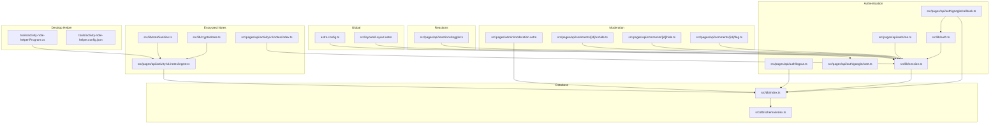
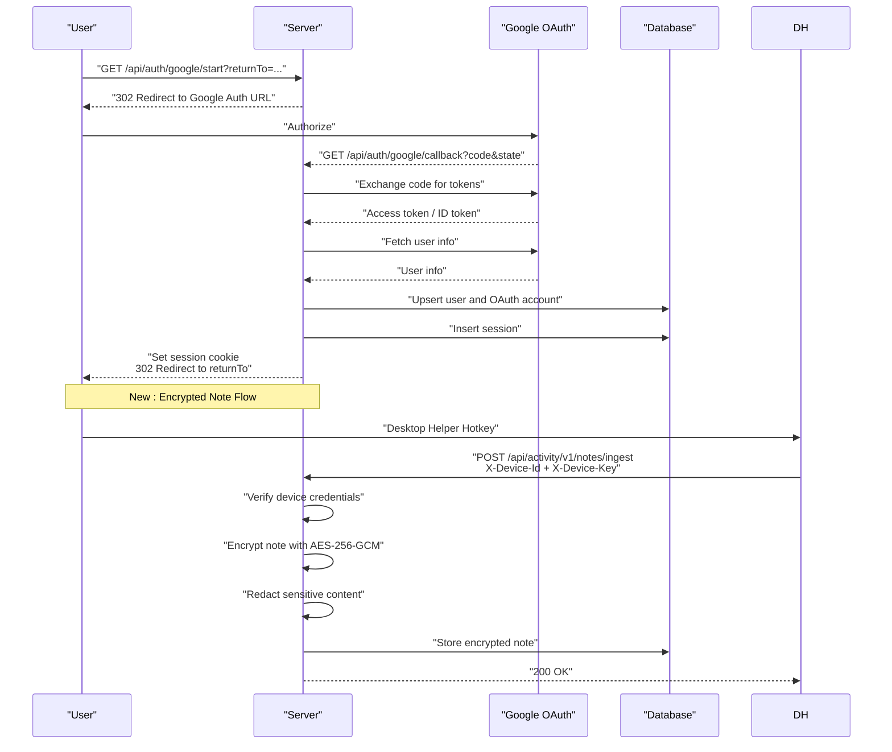
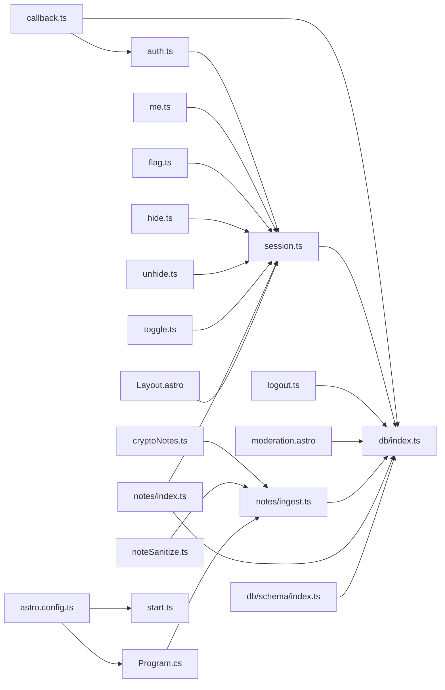

# Security Considerations

<cite>
**Referenced Files in This Document**
- [auth.ts](file://src/lib/auth.ts)
- [session.ts](file://src/lib/session.ts)
- [start.ts](file://src/pages/api/auth/google/start.ts)
- [callback.ts](file://src/pages/api/auth/google/callback.ts)
- [logout.ts](file://src/pages/api/auth/logout.ts)
- [me.ts](file://src/pages/api/auth/me.ts)
- [index.ts](file://src/db/schema/index.ts)
- [index.ts](file://src/db/index.ts)
- [moderation.astro](file://src/pages/admin/moderation.astro)
- [flag.ts](file://src/pages/api/comments/[id]/flag.ts)
- [hide.ts](file://src/pages/api/comments/[id]/hide.ts)
- [unhide.ts](file://src/pages/api/comments/[id]/unhide.ts)
- [toggle.ts](file://src/pages/api/reactions/toggle.ts)
- [Layout.astro](file://src/layouts/Layout.astro)
- [astro.config.ts](file://astro.config.ts)
- [package.json](file://package.json)
- [cryptoNotes.ts](file://src/lib/cryptoNotes.ts)
- [noteSanitize.ts](file://src/lib/noteSanitize.ts)
- [ingest.ts](file://src/pages/api/activity/v1/notes/ingest.ts)
- [index.ts](file://src/pages/api/activity/v1/notes/index.ts)
- [Program.cs](file://tools/activity-note-helper/Program.cs)
- [activity-note-helper.config.json](file://tools/activity-note-helper/activity-note-helper.config.json)
- [0003_activity_notes.sql](file://drizzle/0003_activity_notes.sql)
- [activity.ts](file://src/lib/activity.ts)
</cite>

## Update Summary
**Changes Made**
- Added comprehensive documentation for encrypted note storage capabilities with AES-256-GCM encryption
- Documented automatic content redaction for sensitive data using pattern matching
- Added desktop helper application security considerations and configuration
- Updated activity monitoring security model with privacy-preserving note ingestion
- Enhanced authentication flow security with device credential verification
- Added encryption key management and secure note handling procedures

## Table of Contents
1. [Introduction](#introduction)
2. [Project Structure](#project-structure)
3. [Core Components](#core-components)
4. [Architecture Overview](#architecture-overview)
5. [Detailed Component Analysis](#detailed-component-analysis)
6. [Enhanced Security Model](#enhanced-security-model)
7. [Dependency Analysis](#dependency-analysis)
8. [Performance Considerations](#performance-considerations)
9. [Troubleshooting Guide](#troubleshooting-guide)
10. [Conclusion](#conclusion)
11. [Appendices](#appendices)

## Introduction
This document provides comprehensive security documentation for rodion.pro. It focuses on authentication security (OAuth 2.0 with Google), session management, CSRF protection, rate limiting strategies, input validation, SQL injection prevention, XSS protections, data privacy, moderation and reporting systems, security headers, HTTPS enforcement, and secure cookie handling. 

**Updated** Enhanced with new encrypted note storage capabilities using AES-256-GCM encryption, automatic content redaction for sensitive data, desktop helper application security considerations, and privacy-preserving note ingestion mechanisms.

## Project Structure
The security-relevant parts of the application are organized around:
- Authentication utilities and session management in src/lib
- OAuth 2.0 endpoints under src/pages/api/auth
- Database schema and connection handling in src/db
- Moderation UI and admin actions in src/pages/admin
- Comment and reaction APIs in src/pages/api/comments and src/pages/api/reactions
- **New**: Encrypted note storage system with AES-256-GCM encryption in src/lib/cryptoNotes.ts and src/pages/api/activity/v1/notes
- **New**: Desktop helper application security in tools/activity-note-helper
- **New**: Privacy-preserving activity monitoring with content sanitization
- Global layout SEO and metadata in src/layouts/Layout.astro
- Build and deployment configuration in astro.config.ts and package.json

**Diagram sources**
- [auth.ts](file://src/lib/auth.ts#L1-L101)
- [session.ts](file://src/lib/session.ts#L1-L58)
- [start.ts](file://src/pages/api/auth/google/start.ts#L1-L15)
- [callback.ts](file://src/pages/api/auth/google/callback.ts#L1-L114)
- [logout.ts](file://src/pages/api/auth/logout.ts#L1-L23)
- [me.ts](file://src/pages/api/auth/me.ts#L1-L30)
- [index.ts](file://src/db/schema/index.ts#L1-L194)
- [index.ts](file://src/db/index.ts#L1-L37)
- [moderation.astro](file://src/pages/admin/moderation.astro#L1-L195)
- [flag.ts](file://src/pages/api/comments/[id]/flag.ts#L1-L60)
- [hide.ts](file://src/pages/api/comments/[id]/hide.ts#L1-L42)
- [unhide.ts](file://src/pages/api/comments/[id]/unhide.ts#L1-L42)
- [toggle.ts](file://src/pages/api/reactions/toggle.ts#L1-L85)
- [cryptoNotes.ts](file://src/lib/cryptoNotes.ts#L1-L45)
- [noteSanitize.ts](file://src/lib/noteSanitize.ts#L1-L30)
- [ingest.ts](file://src/pages/api/activity/v1/notes/ingest.ts#L1-L109)
- [index.ts](file://src/pages/api/activity/v1/notes/index.ts#L1-L87)
- [Program.cs](file://tools/activity-note-helper/Program.cs#L1-L434)
- [activity-note-helper.config.json](file://tools/activity-note-helper/activity-note-helper.config.json#L1-L10)
- [Layout.astro](file://src/layouts/Layout.astro#L1-L97)
- [astro.config.ts](file://astro.config.ts#L1-L38)

**Section sources**
- [auth.ts](file://src/lib/auth.ts#L1-L101)
- [session.ts](file://src/lib/session.ts#L1-L58)
- [start.ts](file://src/pages/api/auth/google/start.ts#L1-L15)
- [callback.ts](file://src/pages/api/auth/google/callback.ts#L1-L114)
- [logout.ts](file://src/pages/api/auth/logout.ts#L1-L23)
- [me.ts](file://src/pages/api/auth/me.ts#L1-L30)
- [index.ts](file://src/db/schema/index.ts#L1-L194)
- [index.ts](file://src/db/index.ts#L1-L37)
- [moderation.astro](file://src/pages/admin/moderation.astro#L1-L195)
- [flag.ts](file://src/pages/api/comments/[id]/flag.ts#L1-L60)
- [hide.ts](file://src/pages/api/comments/[id]/hide.ts#L1-L42)
- [unhide.ts](file://src/pages/api/comments/[id]/unhide.ts#L1-L42)
- [toggle.ts](file://src/pages/api/reactions/toggle.ts#L1-L85)
- [cryptoNotes.ts](file://src/lib/cryptoNotes.ts#L1-L45)
- [noteSanitize.ts](file://src/lib/noteSanitize.ts#L1-L30)
- [ingest.ts](file://src/pages/api/activity/v1/notes/ingest.ts#L1-L109)
- [index.ts](file://src/pages/api/activity/v1/notes/index.ts#L1-L87)
- [Program.cs](file://tools/activity-note-helper/Program.cs#L1-L434)
- [activity-note-helper.config.json](file://tools/activity-note-helper/activity-note-helper.config.json#L1-L10)
- [Layout.astro](file://src/layouts/Layout.astro#L1-L97)
- [astro.config.ts](file://astro.config.ts#L1-L38)

## Core Components
- Authentication utilities: session cookie handling, session generation, Google OAuth URL construction, token exchange, and user info retrieval.
- Session management: current user resolution via session cookie, session validity checks, and admin role determination.
- OAuth 2.0 with Google: start endpoint generates the authorization URL; callback exchanges the authorization code for tokens, retrieves user info, creates or links OAuth accounts, bans checks, creates sessions, and sets secure cookies.
- Moderation and reporting: comment flagging, hide/unhide actions, admin-only enforcement, and moderation dashboard.
- Reactions: emoji reaction toggling with allowed emoji validation.
- Database schema: users, sessions, oauth_accounts, comments, reactions, comment_flags, events, and **new**: activity_notes with encrypted content storage.
- **New**: Encrypted note storage: AES-256-GCM encryption implementation, automatic content redaction, and secure key management.
- **New**: Desktop helper application: secure note capture, device authentication, and privacy-preserving data transmission.
- **New**: Privacy-preserving activity monitoring: content sanitization, blacklisting, and category-only reporting.
- Global layout and configuration: canonical URLs, alternate locales, Open Graph, Twitter metadata, and site configuration.

**Section sources**
- [auth.ts](file://src/lib/auth.ts#L1-L101)
- [session.ts](file://src/lib/session.ts#L1-L58)
- [callback.ts](file://src/pages/api/auth/google/callback.ts#L1-L114)
- [moderation.astro](file://src/pages/admin/moderation.astro#L1-L195)
- [flag.ts](file://src/pages/api/comments/[id]/flag.ts#L1-L60)
- [hide.ts](file://src/pages/api/comments/[id]/hide.ts#L1-L42)
- [unhide.ts](file://src/pages/api/comments/[id]/unhide.ts#L1-L42)
- [toggle.ts](file://src/pages/api/reactions/toggle.ts#L1-L85)
- [index.ts](file://src/db/schema/index.ts#L152-L177)
- [cryptoNotes.ts](file://src/lib/cryptoNotes.ts#L1-L45)
- [noteSanitize.ts](file://src/lib/noteSanitize.ts#L1-L30)
- [Program.cs](file://tools/activity-note-helper/Program.cs#L1-L434)
- [Layout.astro](file://src/layouts/Layout.astro#L1-L97)
- [astro.config.ts](file://astro.config.ts#L1-L38)

## Architecture Overview
The authentication and session flow integrates client-side navigation with server-side OAuth callbacks and database-backed sessions. The moderation UI relies on authenticated requests and admin checks. **Updated** The encrypted note system adds secure data transmission from desktop helper applications with automatic content redaction and AES-256-GCM encryption.

**Diagram sources**
- [start.ts](file://src/pages/api/auth/google/start.ts#L1-L15)
- [callback.ts](file://src/pages/api/auth/google/callback.ts#L1-L114)
- [auth.ts](file://src/lib/auth.ts#L59-L95)
- [index.ts](file://src/db/schema/index.ts#L1-L194)
- [index.ts](file://src/db/index.ts#L1-L37)
- [ingest.ts](file://src/pages/api/activity/v1/notes/ingest.ts#L1-L109)
- [Program.cs](file://tools/activity-note-helper/Program.cs#L152-L181)

## Detailed Component Analysis

### Authentication Security (OAuth 2.0 with Google)
- Authorization URL generation includes client_id, redirect_uri, response_type, scope, state, access_type, and prompt parameters. The redirect_uri is constructed from SITE_URL and the callback path.
- Token exchange uses POST with form-encoded body and validates response.ok before parsing JSON.
- User info retrieval uses Authorization header with Bearer token.
- State parameter is URL-encoded and decoded to prevent tampering; errors are handled gracefully with redirects.
- Admin emails are validated against ADMIN_EMAILS environment variable.

Security considerations:
- Ensure SITE_URL is set correctly in production to avoid open redirect risks.
- Validate and sanitize state parameter before redirect.
- Use HTTPS for all OAuth endpoints and Google endpoints.
- Store secrets in environment variables and restrict access.

**Section sources**
- [auth.ts](file://src/lib/auth.ts#L41-L57)
- [auth.ts](file://src/lib/auth.ts#L59-L83)
- [auth.ts](file://src/lib/auth.ts#L85-L95)
- [auth.ts](file://src/lib/auth.ts#L97-L101)
- [start.ts](file://src/pages/api/auth/google/start.ts#L1-L15)
- [callback.ts](file://src/pages/api/auth/google/callback.ts#L12-L27)

### Session Management Security
- Session cookie name, duration, and attributes are centralized in auth utilities.
- Cookie attributes include httpOnly, secure (conditional on PROD), sameSite lax, and maxAge derived from session duration.
- Session retrieval validates presence of sessionId, checks database for matching, non-expired session, and verifies user is not banned.
- Session creation occurs after successful OAuth callback and is persisted with expiresAt.

Security considerations:
- Ensure PROD environment is correctly set to enable secure cookies in production.
- Rotate session identifiers after privilege changes.
- Enforce session expiration and cleanup.

**Section sources**
- [auth.ts](file://src/lib/auth.ts#L4-L31)
- [session.ts](file://src/lib/session.ts#L13-L54)
- [callback.ts](file://src/pages/api/auth/google/callback.ts#L94-L108)

### CSRF Protection Mechanisms
Current implementation:
- Uses state parameter in OAuth authorization request to mitigate CSRF during the authorization code flow.
- No explicit anti-CSRF tokens are implemented for POST endpoints in the moderation and comment APIs.

Recommendations:
- Implement CSRF tokens for stateful POST endpoints (e.g., comment flagging, hide/unhide, reaction toggling).
- Include CSRF tokens in forms and validate them server-side.
- Use SameSite strict for critical cookies if feasible, balancing UX.

**Section sources**
- [callback.ts](file://src/pages/api/auth/google/callback.ts#L46-L54)
- [flag.ts](file://src/pages/api/comments/[id]/flag.ts#L1-L60)
- [hide.ts](file://src/pages/api/comments/[id]/hide.ts#L1-L42)
- [unhide.ts](file://src/pages/api/comments/[id]/unhide.ts#L1-L42)
- [toggle.ts](file://src/pages/api/reactions/toggle.ts#L1-L85)

### Rate Limiting Strategies
Current implementation:
- No explicit rate limiting is implemented in the codebase.

Recommendations:
- Apply per-endpoint rate limits (e.g., 300 requests per 15 minutes for OAuth callbacks, 100 per 15 minutes for comment flagging).
- Use IP-based or user-based keys with Redis/MemoryStore.
- Integrate with middleware to enforce quotas and return 429 with Retry-After headers.

**Section sources**
- [callback.ts](file://src/pages/api/auth/google/callback.ts#L1-L114)
- [flag.ts](file://src/pages/api/comments/[id]/flag.ts#L1-L60)
- [toggle.ts](file://src/pages/api/reactions/toggle.ts#L1-L85)

### Input Validation Approaches
- Comment flagging endpoint validates numeric commentId and requires JSON body with reason.
- Reaction toggling endpoint validates targetType, targetKey, emoji against allowed list.
- Logout endpoint reads sessionId from cookie and deletes matching session.
- **New**: Activity notes ingestion validates note text length (max 8192 characters) and trims whitespace.

Recommendations:
- Use schema validation libraries (e.g., Zod) for all request bodies.
- Sanitize and truncate inputs to prevent oversized payloads.
- Validate and normalize query parameters and path segments.

**Section sources**
- [flag.ts](file://src/pages/api/comments/[id]/flag.ts#L18-L24)
- [flag.ts](file://src/pages/api/comments/[id]/flag.ts#L26-L27)
- [toggle.ts](file://src/pages/api/reactions/toggle.ts#L26-L41)
- [logout.ts](file://src/pages/api/auth/logout.ts#L7-L15)
- [ingest.ts](file://src/pages/api/activity/v1/notes/ingest.ts#L60-L66)

### SQL Injection Prevention
- All database queries use ORM methods with parameterized conditions and typed joins.
- No raw SQL string concatenation observed in the reviewed files.
- **New**: Activity notes table uses proper PostgreSQL data types (BYTEA for encrypted content, JSONB for metadata).

Recommendations:
- Continue using ORM for all queries.
- Audit migrations and seed scripts for safe string interpolation.
- Use read-only database users for read-heavy endpoints.

**Section sources**
- [session.ts](file://src/lib/session.ts#L27-L32)
- [callback.ts](file://src/pages/api/auth/google/callback.ts#L40-L52)
- [callback.ts](file://src/pages/api/auth/google/callback.ts#L79-L86)
- [index.ts](file://src/db/schema/index.ts#L1-L194)
- [0003_activity_notes.sql](file://drizzle/0003_activity_notes.sql#L1-L24)

### XSS Protection Measures
- No inline script blocks observed in moderation UI; dynamic updates use fetch and DOM manipulation.
- Layout injects minimal inline scripts for theme initialization and effects.

Recommendations:
- Escape user-generated content in templates.
- Use Content-Security-Policy headers to restrict inline scripts and eval.
- Sanitize HTML where user content is rendered.

**Section sources**
- [moderation.astro](file://src/pages/admin/moderation.astro#L169-L194)
- [Layout.astro](file://src/layouts/Layout.astro#L61-L76)

### Data Privacy Considerations
- Email uniqueness constraint prevents duplicates; sensitive fields are not logged.
- OAuth account linking stores provider user identifiers securely.
- Ban status is enforced during session resolution.
- **New**: Activity notes are stored encrypted with AES-256-GCM and include automatic redaction of sensitive patterns.

Recommendations:
- Implement data retention and deletion policies.
- Add audit logs for moderation actions.
- Comply with applicable privacy regulations (e.g., GDPR) for user data handling.
- **New**: Regular key rotation for encrypted note storage.

**Section sources**
- [index.ts](file://src/db/schema/index.ts#L6-L11)
- [index.ts](file://src/db/schema/index.ts#L14-L22)
- [session.ts](file://src/lib/session.ts#L43-L45)
- [cryptoNotes.ts](file://src/lib/cryptoNotes.ts#L1-L45)
- [noteSanitize.ts](file://src/lib/noteSanitize.ts#L1-L30)

### Moderation System Security
- Admin-only access enforced in moderation UI and hide/unhide endpoints.
- Comment flagging requires authentication; flags are recorded with optional reasons.
- Hide/unhide actions update comment visibility state.

Recommendations:
- Add rate limits for moderation actions.
- Implement audit trails for admin actions.
- Consider threshold-based auto-hiding after repeated flags.

**Section sources**
- [moderation.astro](file://src/pages/admin/moderation.astro#L7-L12)
- [hide.ts](file://src/pages/api/comments/[id]/hide.ts#L11-L15)
- [unhide.ts](file://src/pages/api/comments/[id]/unhide.ts#L11-L15)
- [flag.ts](file://src/pages/api/comments/[id]/flag.ts#L42-L46)

### User Reporting Mechanisms
- Users can flag comments with optional reasons.
- Flags are aggregated and surfaced in the moderation dashboard.

Recommendations:
- Add duplicate flag prevention per user per comment.
- Provide feedback to users after successful flagging.
- Consider abuse detection (e.g., rapid successive flags).

**Section sources**
- [flag.ts](file://src/pages/api/comments/[id]/flag.ts#L42-L46)
- [moderation.astro](file://src/pages/admin/moderation.astro#L14-L38)

### Content Filtering Strategies
- **New**: Automatic content redaction using pattern matching for sensitive data (private keys, JWT tokens, API keys).
- **New**: Desktop helper application with configurable redaction and blacklist functionality.
- Admins can hide comments; user-generated content is stored as-is.

Recommendations:
- Integrate external content moderation APIs or keyword filters.
- Implement machine learning-based classifiers for sensitive content.
- Add manual review queues and escalation paths.

**Section sources**
- [noteSanitize.ts](file://src/lib/noteSanitize.ts#L1-L30)
- [Program.cs](file://tools/activity-note-helper/Program.cs#L32-L82)
- [hide.ts](file://src/pages/api/comments/[id]/hide.ts#L26-L28)
- [unhide.ts](file://src/pages/api/comments/[id]/unhide.ts#L26-L28)

### Security Headers Configuration
- No explicit security headers are set in the reviewed files.

Recommendations:
- Add Content-Security-Policy, X-Frame-Options, X-Content-Type-Options, Referrer-Policy, Permissions-Policy.
- Enable Strict-Transport-Security (HSTS) in production.
- Configure frame-ancestors and script-src directives.

**Section sources**
- [Layout.astro](file://src/layouts/Layout.astro#L1-L97)

### HTTPS Enforcement
- Secure cookie attribute is conditional on PROD environment.
- Site URL is configured in astro.config.ts.

Recommendations:
- Enforce HTTPS at the edge/proxy level.
- Redirect HTTP to HTTPS.
- Ensure certificates are valid and up-to-date.

**Section sources**
- [auth.ts](file://src/lib/auth.ts#L19)
- [astro.config.ts](file://astro.config.ts#L9)

### Secure Cookie Handling
- Session cookie is httpOnly, secure (PROD), sameSite lax, path '/', and maxAge derived from session duration.
- Cookie deletion removes session from DB and clears cookie.

Recommendations:
- Consider SameSite strict for critical routes.
- Implement sliding session windows carefully.
- Add secure cookie flags at the platform level.

**Section sources**
- [auth.ts](file://src/lib/auth.ts#L15-L31)
- [logout.ts](file://src/pages/api/auth/logout.ts#L9-L15)

### Authentication Flow Security
- OAuth 2.0 authorization code flow with PKCE recommended in production.
- State parameter mitigates CSRF; validate and sanitize state.
- Token exchange and userinfo retrieval occur over HTTPS.

Recommendations:
- Add PKCE support and nonce validation.
- Implement token refresh and rotation.
- Monitor for suspicious patterns (rapid retries, unusual geolocations).

**Section sources**
- [auth.ts](file://src/lib/auth.ts#L41-L57)
- [auth.ts](file://src/lib/auth.ts#L59-L95)
- [callback.ts](file://src/pages/api/auth/google/callback.ts#L12-L27)

### Token Management and Session Expiration
- Session duration is 30 days; expiresAt stored in database.
- Session cookie maxAge matches session duration.
- Logout deletes session from DB and clears cookie.

Recommendations:
- Implement rolling expirations and idle timeouts.
- Add refresh tokens for long-lived sessions.
- Add session invalidation on password change.

**Section sources**
- [auth.ts](file://src/lib/auth.ts#L4-L13)
- [auth.ts](file://src/lib/auth.ts#L94-L108)
- [logout.ts](file://src/pages/api/auth/logout.ts#L9-L15)

### Common Web Vulnerabilities Mitigations
- SQL Injection: ORM usage with parameterized queries.
- XSS: Minimal inline scripts; sanitize user content.
- CSRF: State parameter in OAuth; CSRF tokens for stateful POSTs.
- Information Disclosure: Environment variables for secrets; no stack traces in responses.
- Insecure Direct Object References: ID validation and permission checks.

Recommendations:
- Conduct regular security audits and SAST/DAST scans.
- Implement WAF rules for OWASP Top 10.
- Use dependency checkers and keep packages updated.

**Section sources**
- [session.ts](file://src/lib/session.ts#L13-L54)
- [flag.ts](file://src/pages/api/comments/[id]/flag.ts#L18-L24)
- [toggle.ts](file://src/pages/api/reactions/toggle.ts#L36-L41)
- [callback.ts](file://src/pages/api/auth/google/callback.ts#L90-L92)

### Security Monitoring Approaches
- Log OAuth errors and authentication failures.
- Track moderation actions and flag volumes.
- Monitor API error rates and 5xx responses.

Recommendations:
- Centralize logs and correlate events.
- Alert on anomaly detection (failed logins, mass flagging).
- Retain logs per policy and secure storage.

**Section sources**
- [callback.ts](file://src/pages/api/auth/google/callback.ts#L19-L22)
- [callback.ts](file://src/pages/api/auth/google/callback.ts#L109-L112)
- [flag.ts](file://src/pages/api/comments/[id]/flag.ts#L52-L58)

### Guidelines for Secure Development Practices
- Use environment-specific configurations and secret management.
- Validate all inputs and escape outputs.
- Prefer least privilege for database users.
- Regularly rotate secrets and tokens.
- Implement defense-in-depth: CSP, HSTS, secure cookies, CSRF tokens.

**Section sources**
- [auth.ts](file://src/lib/auth.ts#L41-L57)
- [index.ts](file://src/db/schema/index.ts#L1-L194)
- [package.json](file://package.json#L1-L46)

### Security Audit Procedures
- Review OAuth configuration and environment variables.
- Verify session cookie attributes and expiration.
- Audit database schema for constraints and indexes.
- Test moderation endpoints for unauthorized access.
- Validate rate limiting and error handling.

**Section sources**
- [auth.ts](file://src/lib/auth.ts#L15-L31)
- [index.ts](file://src/db/schema/index.ts#L24-L33)
- [moderation.astro](file://src/pages/admin/moderation.astro#L7-L12)
- [toggle.ts](file://src/pages/api/reactions/toggle.ts#L1-L85)

## Enhanced Security Model

### Encrypted Note Storage System
**New** The application now implements a comprehensive encrypted note storage system designed to protect sensitive user data captured through the desktop helper application.

#### AES-256-GCM Encryption Implementation
- **Encryption Algorithm**: AES-256-GCM provides authenticated encryption with built-in integrity verification.
- **Key Management**: 32-byte (256-bit) encryption keys stored as base64-encoded environment variables.
- **Nonce Generation**: Random 12-byte initialization vectors generated for each encryption operation.
- **Authentication Tag**: 16-byte authentication tags appended to encrypted data for integrity verification.
- **Storage Format**: Packed binary format: IV (12 bytes) + Authentication Tag (16 bytes) + Ciphertext.

#### Automatic Content Redaction
- **Sensitive Pattern Detection**: Automatic detection of private keys, JWT tokens, API keys, and other sensitive patterns.
- **Text Redaction**: Long strings and numeric sequences are redacted to protect sensitive information.
- **Preview Generation**: Safe previews are created for display purposes without exposing sensitive content.
- **Configuration Options**: Redaction can be enabled/disabled per note and automatically triggered for suspicious content.

#### Privacy-Preserving Note Ingestion
- **Device Authentication**: Each note ingestion request requires valid device credentials (X-Device-Id + X-Device-Key).
- **Content Validation**: Maximum note length of 8KB with automatic trimming and validation.
- **Metadata Tracking**: Structured metadata including source, redaction status, and suspicious content indicators.
- **Indexing Strategy**: Efficient database indexing for device-based queries while maintaining privacy.

#### Desktop Helper Application Security
- **Global Hotkey Support**: Secure hotkey registration (default: Ctrl+Alt+N) for quick note capture.
- **Foreground Application Detection**: Captures context (app, window title, category) for privacy-aware processing.
- **Blacklist Functionality**: Prevents note capture for sensitive applications (e.g., password managers).
- **Toast Notifications**: Secure notification system for user feedback without exposing sensitive data.
- **Configuration Management**: Environment variable overrides for server base URL, device credentials, and behavior settings.

#### Database Schema Security
- **Encrypted Content Storage**: BYTEA column for storing encrypted note content with integrity verification.
- **Metadata Isolation**: JSONB column for structured metadata separate from encrypted content.
- **Privacy Indexing**: Database indexes optimized for privacy-preserving queries without exposing sensitive content.
- **Foreign Key Constraints**: Proper referential integrity with activity_devices table.

**Section sources**
- [cryptoNotes.ts](file://src/lib/cryptoNotes.ts#L1-L45)
- [noteSanitize.ts](file://src/lib/noteSanitize.ts#L1-L30)
- [ingest.ts](file://src/pages/api/activity/v1/notes/ingest.ts#L1-L109)
- [index.ts](file://src/pages/api/activity/v1/notes/index.ts#L1-L87)
- [Program.cs](file://tools/activity-note-helper/Program.cs#L1-L434)
- [activity-note-helper.config.json](file://tools/activity-note-helper/activity-note-helper.config.json#L1-L10)
- [0003_activity_notes.sql](file://drizzle/0003_activity_notes.sql#L1-L24)
- [index.ts](file://src/db/schema/index.ts#L152-L177)

### Security Considerations for Encrypted Notes
- **Key Rotation**: Regular rotation of ACTIVITY_NOTES_KEY environment variable with zero-downtime migration.
- **Access Control**: Administrative token verification required for accessing decrypted note content.
- **Audit Logging**: Comprehensive logging of note ingestion, decryption attempts, and access patterns.
- **Data Retention**: Configurable retention policies for encrypted notes with automatic cleanup.
- **Backup Security**: Encrypted backups with separate key management for disaster recovery scenarios.

### Desktop Helper Security Features
- **Process Isolation**: Runs as separate Windows application with minimal privileges.
- **Configuration Security**: Local configuration file with restricted file permissions.
- **Network Security**: HTTPS-only communication with server and certificate validation.
- **Input Validation**: Client-side validation and sanitization before transmission.
- **Error Handling**: Secure error reporting without exposing sensitive information.

**Section sources**
- [Program.cs](file://tools/activity-note-helper/Program.cs#L32-L82)
- [Program.cs](file://tools/activity-note-helper/Program.cs#L152-L181)
- [Program.cs](file://tools/activity-note-helper/Program.cs#L275-L296)

## Dependency Analysis

**Diagram sources**
- [auth.ts](file://src/lib/auth.ts#L1-L101)
- [session.ts](file://src/lib/session.ts#L1-L58)
- [callback.ts](file://src/pages/api/auth/google/callback.ts#L1-L114)
- [index.ts](file://src/db/index.ts#L1-L37)
- [me.ts](file://src/pages/api/auth/me.ts#L1-L30)
- [logout.ts](file://src/pages/api/auth/logout.ts#L1-L23)
- [moderation.astro](file://src/pages/admin/moderation.astro#L1-L195)
- [flag.ts](file://src/pages/api/comments/[id]/flag.ts#L1-L60)
- [hide.ts](file://src/pages/api/comments/[id]/hide.ts#L1-L42)
- [unhide.ts](file://src/pages/api/comments/[id]/unhide.ts#L1-L42)
- [toggle.ts](file://src/pages/api/reactions/toggle.ts#L1-L85)
- [cryptoNotes.ts](file://src/lib/cryptoNotes.ts#L1-L45)
- [noteSanitize.ts](file://src/lib/noteSanitize.ts#L1-L30)
- [ingest.ts](file://src/pages/api/activity/v1/notes/ingest.ts#L1-L109)
- [index.ts](file://src/pages/api/activity/v1/notes/index.ts#L1-L87)
- [Program.cs](file://tools/activity-note-helper/Program.cs#L1-L434)
- [activity-note-helper.config.json](file://tools/activity-note-helper/activity-note-helper.config.json#L1-L10)
- [index.ts](file://src/db/schema/index.ts#L1-L194)
- [Layout.astro](file://src/layouts/Layout.astro#L1-L97)
- [astro.config.ts](file://astro.config.ts#L1-L38)

**Section sources**
- [auth.ts](file://src/lib/auth.ts#L1-L101)
- [session.ts](file://src/lib/session.ts#L1-L58)
- [callback.ts](file://src/pages/api/auth/google/callback.ts#L1-L114)
- [index.ts](file://src/db/index.ts#L1-L37)
- [index.ts](file://src/db/schema/index.ts#L1-L194)
- [me.ts](file://src/pages/api/auth/me.ts#L1-L30)
- [logout.ts](file://src/pages/api/auth/logout.ts#L1-L23)
- [moderation.astro](file://src/pages/admin/moderation.astro#L1-L195)
- [flag.ts](file://src/pages/api/comments/[id]/flag.ts#L1-L60)
- [hide.ts](file://src/pages/api/comments/[id]/hide.ts#L1-L42)
- [unhide.ts](file://src/pages/api/comments/[id]/unhide.ts#L1-L42)
- [toggle.ts](file://src/pages/api/reactions/toggle.ts#L1-L85)
- [cryptoNotes.ts](file://src/lib/cryptoNotes.ts#L1-L45)
- [noteSanitize.ts](file://src/lib/noteSanitize.ts#L1-L30)
- [ingest.ts](file://src/pages/api/activity/v1/notes/ingest.ts#L1-L109)
- [index.ts](file://src/pages/api/activity/v1/notes/index.ts#L1-L87)
- [Program.cs](file://tools/activity-note-helper/Program.cs#L1-L434)
- [activity-note-helper.config.json](file://tools/activity-note-helper/activity-note-helper.config.json#L1-L10)
- [Layout.astro](file://src/layouts/Layout.astro#L1-L97)
- [astro.config.ts](file://astro.config.ts#L1-L38)

## Performance Considerations
- Database connections are pooled with max idle/connect timeouts; ensure adequate pool sizing for production traffic.
- Indexes exist on sessions and comments for efficient lookups.
- Consider caching frequently accessed user data and moderation metrics.
- **New**: Activity notes encryption adds CPU overhead; consider hardware acceleration for high-volume scenarios.
- **New**: Desktop helper application runs locally to minimize server load and improve responsiveness.

## Troubleshooting Guide
- OAuth callback errors: Check GOOGLE_CLIENT_ID, GOOGLE_CLIENT_SECRET, SITE_URL, and network connectivity to Google endpoints.
- Session not persisting: Verify PROD environment, cookie domain/path, and database connectivity.
- Unauthorized access to moderation: Confirm admin email configuration and user ban status.
- Comment flagging failures: Validate JSON payload and numeric commentId; check database availability.
- **New**: Encrypted note ingestion failures: Verify ACTIVITY_NOTES_KEY environment variable and device credentials.
- **New**: Desktop helper issues: Check local configuration file permissions and network connectivity to server.

**Section sources**
- [auth.ts](file://src/lib/auth.ts#L59-L83)
- [auth.ts](file://src/lib/auth.ts#L85-L95)
- [callback.ts](file://src/pages/api/auth/google/callback.ts#L19-L26)
- [callback.ts](file://src/pages/api/auth/google/callback.ts#L90-L92)
- [flag.ts](file://src/pages/api/comments/[id]/flag.ts#L18-L24)
- [index.ts](file://src/db/index.ts#L9-L23)
- [ingest.ts](file://src/pages/api/activity/v1/notes/ingest.ts#L18-L23)
- [Program.cs](file://tools/activity-note-helper/Program.cs#L46-L82)

## Conclusion
rodion.pro implements a robust OAuth 2.0 flow with Google, secure session management, and database-backed persistence. **Updated** The enhanced security model now includes comprehensive encrypted note storage with AES-256-GCM encryption, automatic content redaction for sensitive data, and desktop helper application security considerations. Key areas for improvement include CSRF protection for stateful endpoints, rate limiting, explicit security headers, and automated content filtering. The new encrypted note system provides strong data protection while maintaining privacy-preserving functionality. Adopting the recommendations will strengthen defenses against common web vulnerabilities and improve operational security posture.

## Appendices
- Environment variables to configure: GOOGLE_CLIENT_ID, GOOGLE_CLIENT_SECRET, ADMIN_EMAILS, DATABASE_URL, SITE_URL, PROD, **ACTIVITY_NOTES_KEY** (for encrypted notes).
- Recommended security headers: Content-Security-Policy, X-Frame-Options, X-Content-Type-Options, Referrer-Policy, Permissions-Policy, HSTS.
- **New**: Encrypted note configuration: ACTIVITY_NOTES_KEY (32-byte base64), device credentials for desktop helper.
- **New**: Desktop helper configuration options: serverBaseUrl, deviceId, deviceKey, hotkey, redact, maxLen, blacklistApps.

**Section sources**
- [auth.ts](file://src/lib/auth.ts#L41-L57)
- [auth.ts](file://src/lib/auth.ts#L97-L101)
- [index.ts](file://src/db/index.ts#L5-L23)
- [astro.config.ts](file://astro.config.ts#L9)
- [cryptoNotes.ts](file://src/lib/cryptoNotes.ts#L3-L8)
- [Program.cs](file://tools/activity-note-helper/Program.cs#L32-L82)