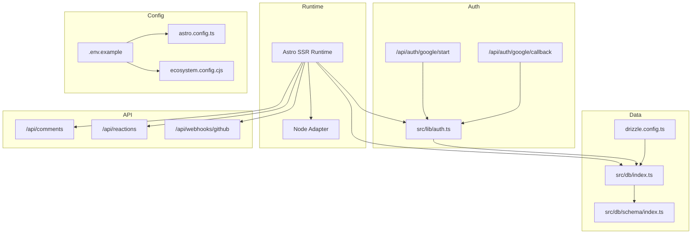
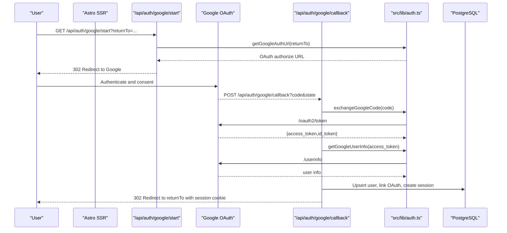
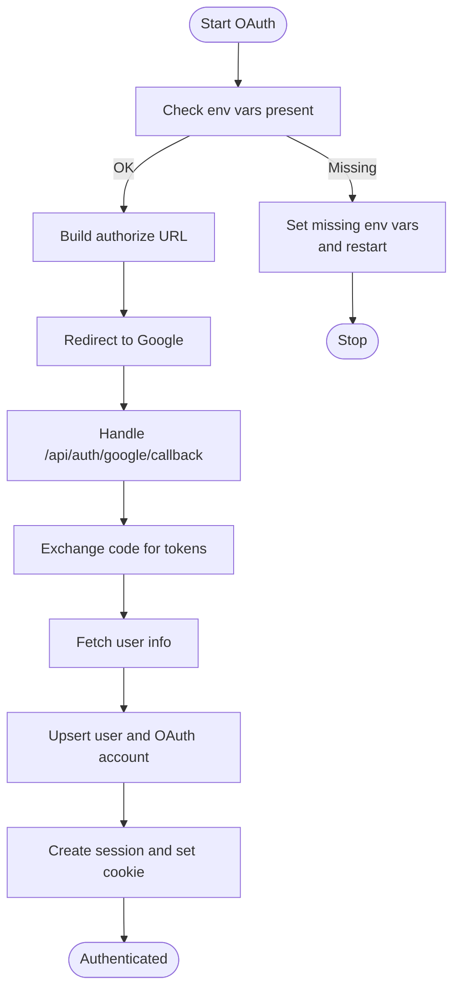
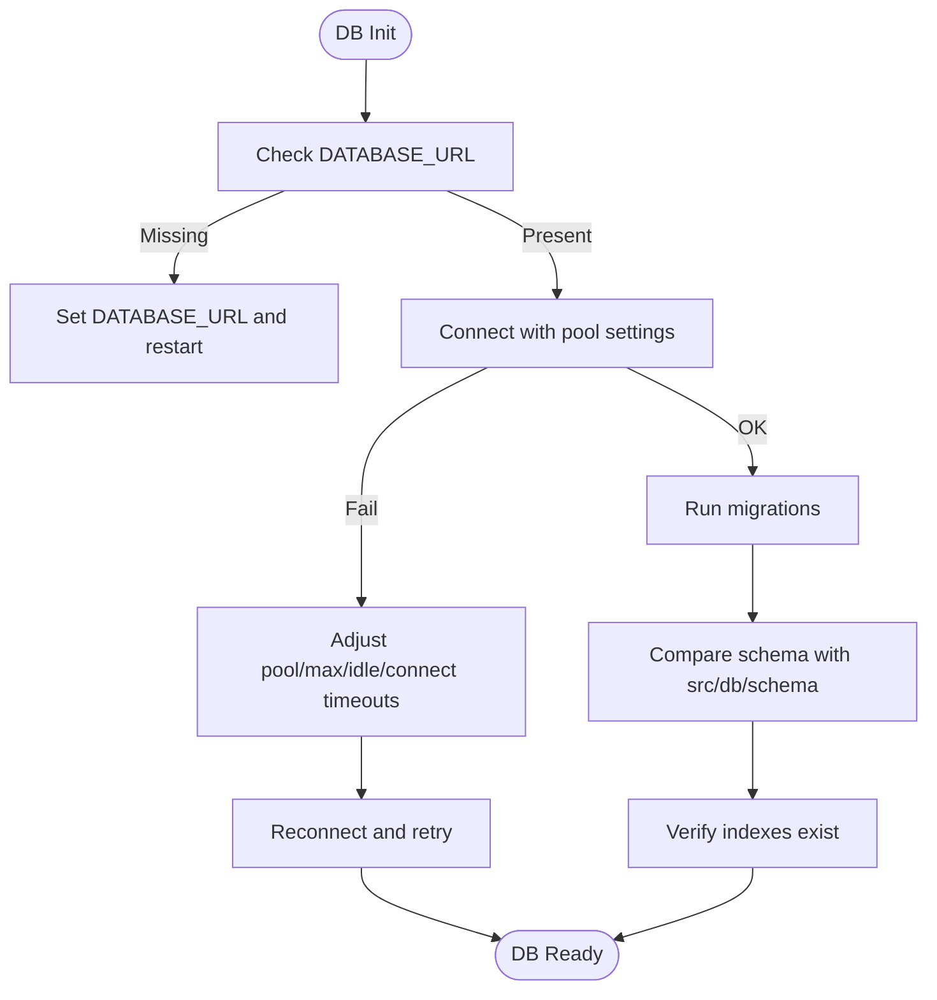
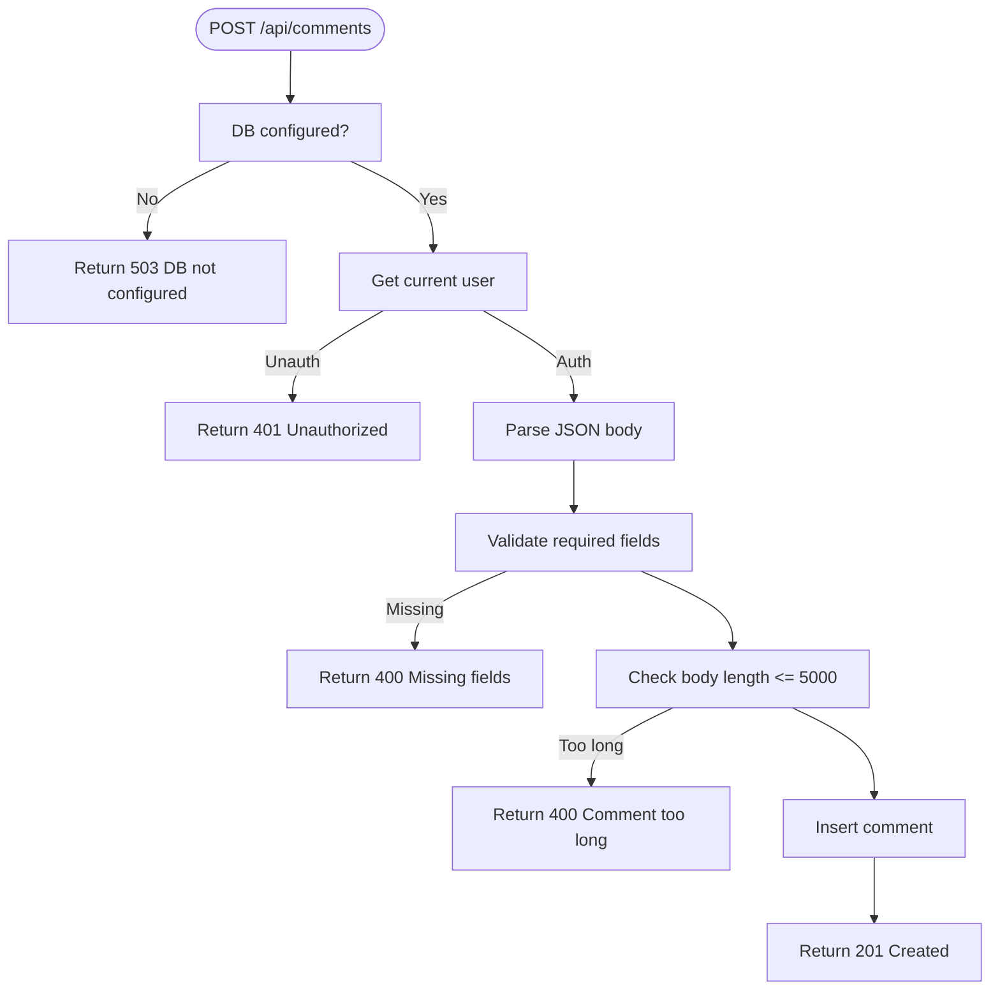
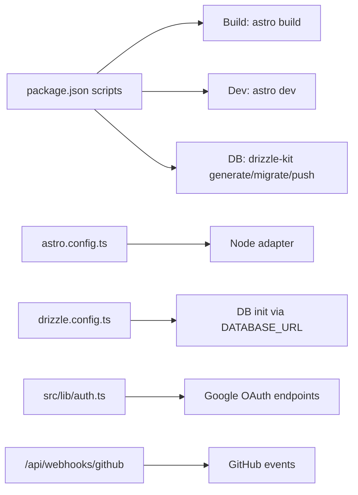

# Troubleshooting and FAQ

<cite>
**Referenced Files in This Document**
- [package.json](file://package.json)
- [.env.example](file://.env.example)
- [astro.config.ts](file://astro.config.ts)
- [drizzle.config.ts](file://drizzle.config.ts)
- [ecosystem.config.cjs](file://ecosystem.config.cjs)
- [src/lib/auth.ts](file://src/lib/auth.ts)
- [src/db/index.ts](file://src/db/index.ts)
- [src/db/schema/index.ts](file://src/db/schema/index.ts)
- [src/i18n/index.ts](file://src/i18n/index.ts)
- [src/pages/api/auth/google/start.ts](file://src/pages/api/auth/google/start.ts)
- [src/pages/api/auth/google/callback.ts](file://src/pages/api/auth/google/callback.ts)
- [src/pages/api/comments/index.ts](file://src/pages/api/comments/index.ts)
- [src/pages/api/reactions/index.ts](file://src/pages/api/reactions/index.ts)
- [src/pages/api/webhooks/github.ts](file://src/pages/api/webhooks/github.ts)
</cite>

## Table of Contents
1. [Introduction](#introduction)
2. [Project Structure](#project-structure)
3. [Core Components](#core-components)
4. [Architecture Overview](#architecture-overview)
5. [Detailed Component Analysis](#detailed-component-analysis)
6. [Dependency Analysis](#dependency-analysis)
7. [Performance Considerations](#performance-considerations)
8. [Troubleshooting Guide](#troubleshooting-guide)
9. [Conclusion](#conclusion)
10. [Appendices](#appendices)

## Introduction
This document provides comprehensive troubleshooting and frequently asked questions for rodion.pro. It covers setup issues (database connectivity, environment variables, OAuth, build), performance diagnostics (slow loads, memory, DB performance, API timeouts), deployment problems (server, nginx, pm2, SSL), and debugging techniques for authentication flows, comments, reactions, and internationalization. It also includes solutions for common error messages, log analysis approaches, migration and schema issues, API integration pitfalls, and preventive monitoring strategies.

## Project Structure
The project is an Astro-based SSR application with a Node adapter, PostgreSQL via Drizzle ORM, and integrated authentication, comments, reactions, and GitHub webhooks. Key areas relevant to troubleshooting:
- Environment configuration and secrets
- Database initialization and schema
- Authentication flows (Google OAuth)
- API endpoints for comments, reactions, and webhooks
- Internationalization and i18n utilities
- Deployment configuration via ecosystem PM2 config

**Diagram sources**
- [astro.config.ts](file://astro.config.ts#L1-L38)
- [drizzle.config.ts](file://drizzle.config.ts#L1-L11)
- [ecosystem.config.cjs](file://ecosystem.config.cjs#L1-L23)
- [src/lib/auth.ts](file://src/lib/auth.ts#L1-L101)
- [src/db/index.ts](file://src/db/index.ts#L1-L37)
- [src/db/schema/index.ts](file://src/db/schema/index.ts#L1-L104)
- [src/pages/api/auth/google/start.ts](file://src/pages/api/auth/google/start.ts#L1-L15)
- [src/pages/api/auth/google/callback.ts](file://src/pages/api/auth/google/callback.ts#L1-L114)
- [src/pages/api/comments/index.ts](file://src/pages/api/comments/index.ts#L1-L240)
- [src/pages/api/reactions/index.ts](file://src/pages/api/reactions/index.ts#L1-L82)
- [src/pages/api/webhooks/github.ts](file://src/pages/api/webhooks/github.ts#L1-L134)

**Section sources**
- [astro.config.ts](file://astro.config.ts#L1-L38)
- [drizzle.config.ts](file://drizzle.config.ts#L1-L11)
- [ecosystem.config.cjs](file://ecosystem.config.cjs#L1-L23)

## Core Components
- Authentication library: Generates OAuth URLs, exchanges authorization codes, retrieves user info, manages session cookies, and checks admin status.
- Database module: Initializes PostgreSQL connection with connection pooling and timeout settings, exposes helpers to guard DB usage.
- Schema: Defines users, oauth_accounts, sessions, comments, reactions, comment_flags, and events tables with indexes and constraints.
- API endpoints: Google OAuth start and callback, comments CRUD and tree retrieval, reactions aggregation, GitHub webhook handler.
- Internationalization: Language registry, translation keys, locale detection, and localized path helpers.

**Section sources**
- [src/lib/auth.ts](file://src/lib/auth.ts#L1-L101)
- [src/db/index.ts](file://src/db/index.ts#L1-L37)
- [src/db/schema/index.ts](file://src/db/schema/index.ts#L1-L104)
- [src/pages/api/auth/google/start.ts](file://src/pages/api/auth/google/start.ts#L1-L15)
- [src/pages/api/auth/google/callback.ts](file://src/pages/api/auth/google/callback.ts#L1-L114)
- [src/pages/api/comments/index.ts](file://src/pages/api/comments/index.ts#L1-L240)
- [src/pages/api/reactions/index.ts](file://src/pages/api/reactions/index.ts#L1-L82)
- [src/pages/api/webhooks/github.ts](file://src/pages/api/webhooks/github.ts#L1-L134)
- [src/i18n/index.ts](file://src/i18n/index.ts#L1-L221)

## Architecture Overview
The system integrates Astro SSR with a Node adapter, PostgreSQL via Drizzle ORM, and external services (Google OAuth, GitHub). Authentication flows use OAuth 2.0 with state-based return-to handling. Comments and reactions are stored in relational tables with foreign keys and indexes. GitHub webhooks are validated with HMAC-SHA256 and inserted into an events table.

**Diagram sources**
- [src/pages/api/auth/google/start.ts](file://src/pages/api/auth/google/start.ts#L1-L15)
- [src/pages/api/auth/google/callback.ts](file://src/pages/api/auth/google/callback.ts#L1-L114)
- [src/lib/auth.ts](file://src/lib/auth.ts#L41-L95)
- [src/db/index.ts](file://src/db/index.ts#L1-L37)

## Detailed Component Analysis

### Authentication Troubleshooting
Common issues:
- Missing or invalid environment variables for OAuth
- Network errors during token exchange or userinfo retrieval
- Cookie security flags mismatch in production vs. development
- Admin email configuration errors

Diagnostic steps:
- Verify GOOGLE_CLIENT_ID, GOOGLE_CLIENT_SECRET, SITE_URL in environment
- Confirm redirect URI matches configured OAuth app settings
- Check network connectivity to Google OAuth endpoints
- Inspect cookie flags (secure, sameSite) for HTTPS environments
- Validate ADMIN_EMAILS format and casing

**Diagram sources**
- [src/lib/auth.ts](file://src/lib/auth.ts#L41-L95)
- [src/pages/api/auth/google/start.ts](file://src/pages/api/auth/google/start.ts#L1-L15)
- [src/pages/api/auth/google/callback.ts](file://src/pages/api/auth/google/callback.ts#L1-L114)

**Section sources**
- [src/lib/auth.ts](file://src/lib/auth.ts#L1-L101)
- [src/pages/api/auth/google/start.ts](file://src/pages/api/auth/google/start.ts#L1-L15)
- [src/pages/api/auth/google/callback.ts](file://src/pages/api/auth/google/callback.ts#L1-L114)

### Database and Schema Troubleshooting
Common issues:
- DATABASE_URL not set or incorrect
- Connection pool exhaustion or timeouts
- Missing migrations or schema mismatches
- Indexes missing for hot queries

Diagnostic steps:
- Confirm DATABASE_URL is present and reachable
- Review connection pool settings and timeouts
- Run migrations and compare schema with expectations
- Check indexes for comments, reactions, sessions

**Diagram sources**
- [src/db/index.ts](file://src/db/index.ts#L1-L37)
- [drizzle.config.ts](file://drizzle.config.ts#L1-L11)
- [src/db/schema/index.ts](file://src/db/schema/index.ts#L1-L104)

**Section sources**
- [src/db/index.ts](file://src/db/index.ts#L1-L37)
- [drizzle.config.ts](file://drizzle.config.ts#L1-L11)
- [src/db/schema/index.ts](file://src/db/schema/index.ts#L1-L104)

### Comments System Troubleshooting
Common issues:
- Unauthorized access to create comments
- Missing required fields or oversized content
- Tree building errors or missing reactions data
- Database not configured

Diagnostic steps:
- Ensure user is authenticated before posting
- Validate request payload (type, key, lang, body)
- Check comment length limits and sanitization
- Confirm DB availability and indexes for comments/reactions

**Diagram sources**
- [src/pages/api/comments/index.ts](file://src/pages/api/comments/index.ts#L165-L239)

**Section sources**
- [src/pages/api/comments/index.ts](file://src/pages/api/comments/index.ts#L1-L240)

### Reactions System Troubleshooting
Common issues:
- Missing targetType/targetKey
- Incorrect lang filtering for post reactions
- No current user context
- Aggregation errors

Diagnostic steps:
- Ensure targetType and targetKey are provided
- For post reactions, pass lang to filter per-locale reactions
- Confirm user session exists for user-specific reactions
- Verify indexes on reactions target/user

**Section sources**
- [src/pages/api/reactions/index.ts](file://src/pages/api/reactions/index.ts#L1-L82)
- [src/db/schema/index.ts](file://src/db/schema/index.ts#L54-L66)

### GitHub Webhook Troubleshooting
Common issues:
- Missing GITHUB_WEBHOOK_SECRET
- Invalid signature verification
- Non-main branch pushes ignored
- Unsupported events

Diagnostic steps:
- Set GITHUB_WEBHOOK_SECRET in environment
- Verify x-hub-signature-256 header and HMAC-SHA256
- Confirm branch is main/master
- Ensure supported events (push, release) and actions (published)

**Section sources**
- [src/pages/api/webhooks/github.ts](file://src/pages/api/webhooks/github.ts#L1-L134)
- [.env.example](file://.env.example#L7-L11)

### Internationalization Troubleshooting
Common issues:
- Missing translation keys
- Incorrect language prefix in URL
- Fallback to default language not working

Diagnostic steps:
- Add missing keys to ui dictionaries
- Ensure URL starts with /ru or /en
- Confirm fallback logic in translation function

**Section sources**
- [src/i18n/index.ts](file://src/i18n/index.ts#L1-L221)

## Dependency Analysis
External dependencies and runtime behavior:
- Astro with Node adapter for SSR
- Drizzle ORM with PostgreSQL driver
- React integration for UI components
- Tailwind and MDX integrations
- Environment-driven configuration for OAuth, DB, and webhooks

**Diagram sources**
- [package.json](file://package.json#L1-L46)
- [astro.config.ts](file://astro.config.ts#L1-L38)
- [drizzle.config.ts](file://drizzle.config.ts#L1-L11)
- [src/lib/auth.ts](file://src/lib/auth.ts#L41-L95)
- [src/pages/api/webhooks/github.ts](file://src/pages/api/webhooks/github.ts#L1-L134)

**Section sources**
- [package.json](file://package.json#L1-L46)
- [astro.config.ts](file://astro.config.ts#L1-L38)
- [drizzle.config.ts](file://drizzle.config.ts#L1-L11)

## Performance Considerations
- Slow page loads
  - Enable SSR and ensure Node adapter is used
  - Minimize heavy computations in components; precompute where possible
  - Use Astro’s static generation for content-heavy pages
- High memory usage
  - Monitor pm2 logs and restart thresholds
  - Reduce connection pool size or adjust timeouts if DB is under stress
- Database performance
  - Ensure indexes exist for comments, reactions, sessions
  - Optimize queries in comments and reactions endpoints
- API response timeouts
  - Increase timeouts for external OAuth calls
  - Add circuit breaker or retries for third-party endpoints

[No sources needed since this section provides general guidance]

## Troubleshooting Guide

### Setup Issues
- Database connection problems
  - Symptom: "[db] Failed to initialize database connection" or DB-related API 503
  - Actions: Verify DATABASE_URL, network access, PostgreSQL service, and credentials
  - References: [src/db/index.ts](file://src/db/index.ts#L11-L23)
- Environment variable configuration errors
  - Symptom: OAuth fails, webhooks fail, or DB not configured
  - Actions: Copy .env.example to .env, fill all required variables, restart
  - References: [.env.example](file://.env.example#L1-L23), [src/lib/auth.ts](file://src/lib/auth.ts#L41-L56), [src/pages/api/webhooks/github.ts](file://src/pages/api/webhooks/github.ts#L49-L54)
- OAuth authentication failures
  - Symptom: Redirect loop, "auth_failed", or "oauth_denied"
  - Actions: Check GOOGLE_CLIENT_ID/SECRET, SITE_URL, redirect URIs, state handling
  - References: [src/pages/api/auth/google/start.ts](file://src/pages/api/auth/google/start.ts#L4-L14), [src/pages/api/auth/google/callback.ts](file://src/pages/api/auth/google/callback.ts#L19-L26)
- Build process issues
  - Symptom: Build fails or preview errors
  - Actions: Run typecheck, lint, rebuild; ensure Node adapter output is server
  - References: [package.json](file://package.json#L5-L16), [astro.config.ts](file://astro.config.ts#L8-L13)

**Section sources**
- [src/db/index.ts](file://src/db/index.ts#L11-L23)
- [.env.example](file://.env.example#L1-L23)
- [src/lib/auth.ts](file://src/lib/auth.ts#L41-L56)
- [src/pages/api/auth/google/start.ts](file://src/pages/api/auth/google/start.ts#L4-L14)
- [src/pages/api/auth/google/callback.ts](file://src/pages/api/auth/google/callback.ts#L19-L26)
- [package.json](file://package.json#L5-L16)
- [astro.config.ts](file://astro.config.ts#L8-L13)

### Performance Troubleshooting
- Slow page loads
  - Check SSR rendering, component hydration, and asset bundling
  - References: [astro.config.ts](file://astro.config.ts#L8-L13)
- High memory usage
  - Review pm2 logs and restart policies
  - References: [ecosystem.config.cjs](file://ecosystem.config.cjs#L16-L18)
- Database performance issues
  - Verify indexes and optimize queries
  - References: [src/db/schema/index.ts](file://src/db/schema/index.ts#L48-L66)
- API response timeouts
  - Increase timeouts for external calls and add retries
  - References: [src/lib/auth.ts](file://src/lib/auth.ts#L65-L75)

**Section sources**
- [astro.config.ts](file://astro.config.ts#L8-L13)
- [ecosystem.config.cjs](file://ecosystem.config.cjs#L16-L18)
- [src/db/schema/index.ts](file://src/db/schema/index.ts#L48-L66)
- [src/lib/auth.ts](file://src/lib/auth.ts#L65-L75)

### Deployment Troubleshooting
- Server configuration problems
  - Symptom: Port conflicts, missing environment files
  - Actions: Set PORT, ensure env_file path is correct, verify permissions
  - References: [ecosystem.config.cjs](file://ecosystem.config.cjs#L7-L12)
- Nginx issues
  - Symptom: Reverse proxy errors, SSL termination issues
  - Actions: Verify upstream to Node port, SSL certs, headers forwarding
  - References: [astro.config.ts](file://astro.config.ts#L9-L10)
- PM2 process management
  - Symptom: Crashes, memory spikes, no restarts
  - Actions: Check logs, adjust max_memory_restart, enable autorestart
  - References: [ecosystem.config.cjs](file://ecosystem.config.cjs#L14-L18)
- SSL certificate problems
  - Symptom: Mixed content warnings, redirect loops
  - Actions: Ensure SITE_URL HTTPS, secure cookies, correct cert chain
  - References: [src/lib/auth.ts](file://src/lib/auth.ts#L19-L22)

**Section sources**
- [ecosystem.config.cjs](file://ecosystem.config.cjs#L7-L12)
- [astro.config.ts](file://astro.config.ts#L9-L10)
- [src/lib/auth.ts](file://src/lib/auth.ts#L19-L22)

### Debugging Techniques
- Authentication flows
  - Log OAuth URLs, state handling, and error responses
  - References: [src/pages/api/auth/google/start.ts](file://src/pages/api/auth/google/start.ts#L11-L12), [src/pages/api/auth/google/callback.ts](file://src/pages/api/auth/google/callback.ts#L20-L21)
- Comment system issues
  - Validate request payloads and DB insertion results
  - References: [src/pages/api/comments/index.ts](file://src/pages/api/comments/index.ts#L176-L181)
- Reaction system problems
  - Verify aggregation queries and user-specific reactions
  - References: [src/pages/api/reactions/index.ts](file://src/pages/api/reactions/index.ts#L39-L67)
- Internationalization challenges
  - Check language prefix parsing and translation fallback
  - References: [src/i18n/index.ts](file://src/i18n/index.ts#L191-L204)

**Section sources**
- [src/pages/api/auth/google/start.ts](file://src/pages/api/auth/google/start.ts#L11-L12)
- [src/pages/api/auth/google/callback.ts](file://src/pages/api/auth/google/callback.ts#L20-L21)
- [src/pages/api/comments/index.ts](file://src/pages/api/comments/index.ts#L176-L181)
- [src/pages/api/reactions/index.ts](file://src/pages/api/reactions/index.ts#L39-L67)
- [src/i18n/index.ts](file://src/i18n/index.ts#L191-L204)

### Migration and Schema Issues
- Symptoms: Migration errors, schema mismatch, missing indexes
- Actions: Generate and run migrations, compare with src/db/schema, add missing indexes
- References: [drizzle.config.ts](file://drizzle.config.ts#L1-L11), [src/db/schema/index.ts](file://src/db/schema/index.ts#L1-L104)

**Section sources**
- [drizzle.config.ts](file://drizzle.config.ts#L1-L11)
- [src/db/schema/index.ts](file://src/db/schema/index.ts#L1-L104)

### API Integration Challenges
- Symptoms: Webhook signature failures, unsupported events, branch filtering
- Actions: Verify secret, signature algorithm, and event/action handling
- References: [src/pages/api/webhooks/github.ts](file://src/pages/api/webhooks/github.ts#L9-L25), [src/pages/api/webhooks/github.ts](file://src/pages/api/webhooks/github.ts#L66-L126)

**Section sources**
- [src/pages/api/webhooks/github.ts](file://src/pages/api/webhooks/github.ts#L9-L25)
- [src/pages/api/webhooks/github.ts](file://src/pages/api/webhooks/github.ts#L66-L126)

### Preventive Measures and Monitoring
- Environment hygiene: Keep .env.example updated and review onboarding
- DB health: Monitor pool usage, slow query logs, and index usage
- OAuth: Validate redirect URIs and state handling regularly
- Webhooks: Log signatures and event payloads for audit
- Monitoring: Use pm2 logs, application logs, and DB metrics

**Section sources**
- [.env.example](file://.env.example#L1-L23)
- [ecosystem.config.cjs](file://ecosystem.config.cjs#L16-L18)
- [src/pages/api/webhooks/github.ts](file://src/pages/api/webhooks/github.ts#L129-L132)

## Conclusion
This guide consolidates actionable troubleshooting steps for rodion.pro across setup, performance, deployment, and debugging. By validating environment variables, ensuring proper DB configuration and migrations, verifying OAuth and webhook integrations, and adopting monitoring practices, most issues can be resolved quickly and preventatively.

## Appendices
- Quick checklist
  - DATABASE_URL reachable and correct
  - OAuth CLIENT_ID/SECRET/SITE_URL configured
  - GITHUB_WEBHOOK_SECRET set
  - pm2 env_file and ports correct
  - Required indexes present in schema
  - Logs reviewed for errors and warnings

[No sources needed since this section provides general guidance]