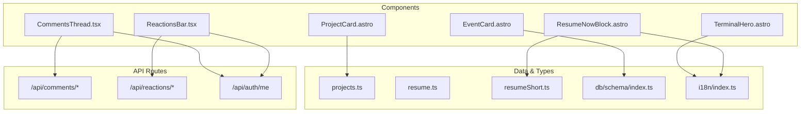
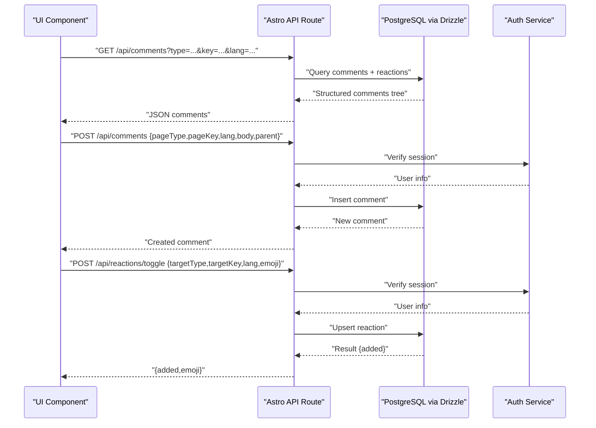
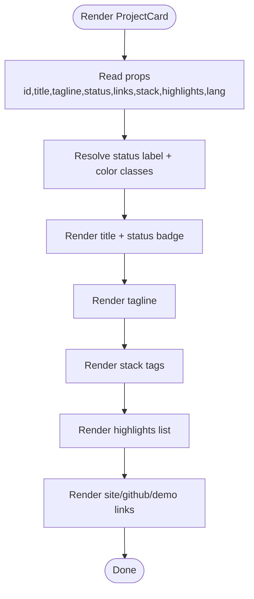
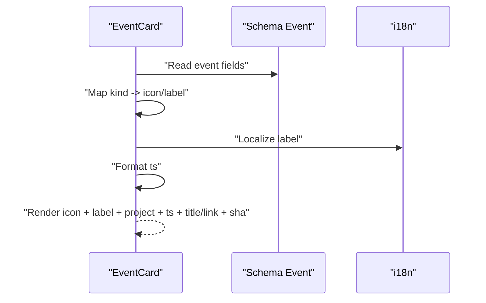
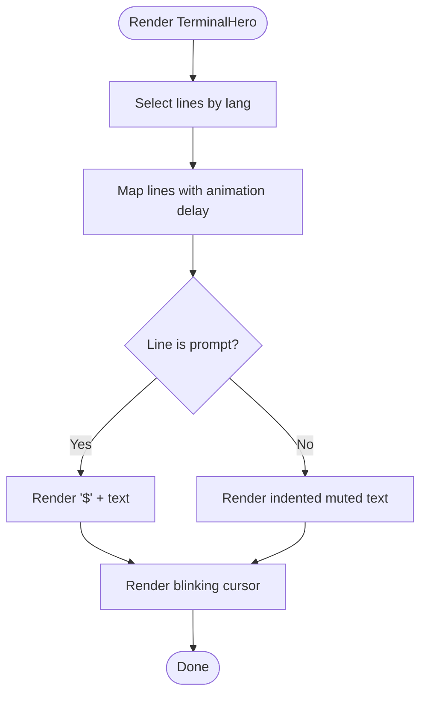
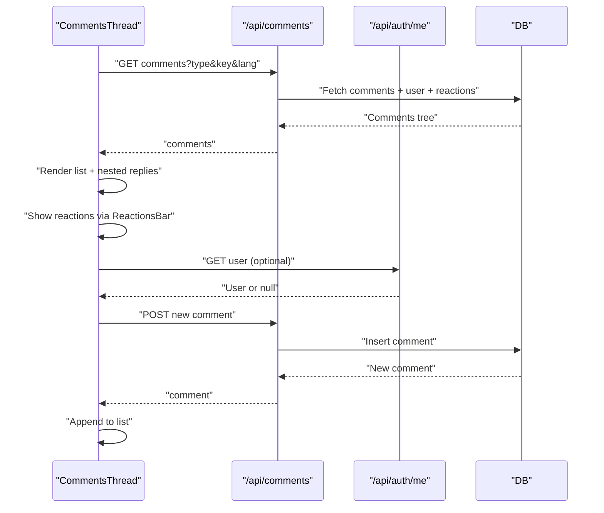
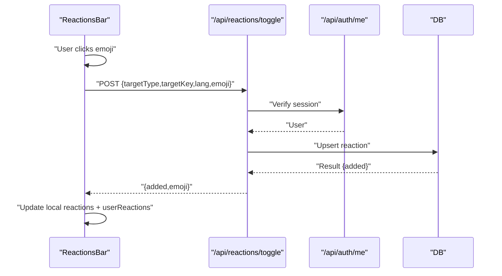
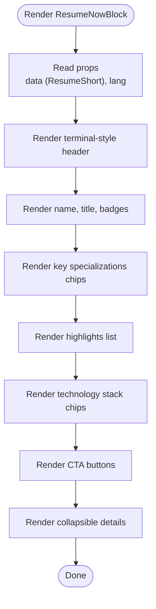
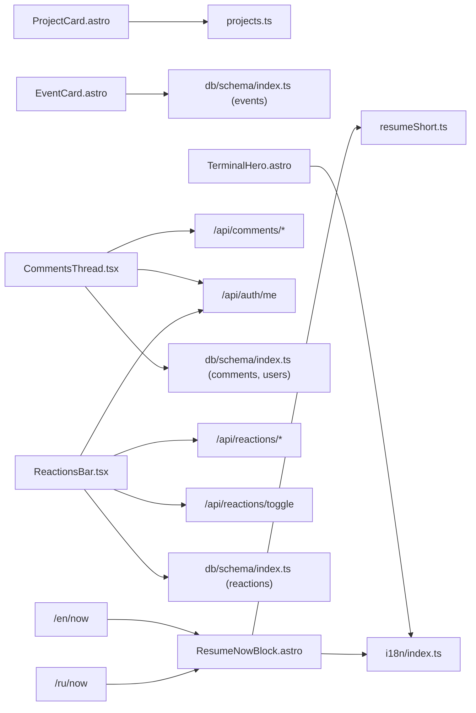

# Display Components

<cite>
**Referenced Files in This Document**
- [ProjectCard.astro](file://src/components/ProjectCard.astro)
- [EventCard.astro](file://src/components/EventCard.astro)
- [TerminalHero.astro](file://src/components/TerminalHero.astro)
- [CommentsThread.tsx](file://src/components/CommentsThread.tsx)
- [ReactionsBar.tsx](file://src/components/ReactionsBar.tsx)
- [ResumeNowBlock.astro](file://src/components/ResumeNowBlock.astro)
- [projects.ts](file://src/data/projects.ts)
- [resume.ts](file://src/data/resume.ts)
- [resumeShort.ts](file://src/data/resumeShort.ts)
- [index.ts](file://src/db/schema/index.ts)
- [index.ts](file://src/pages/api/comments/index.ts)
- [index.ts](file://src/pages/api/reactions/index.ts)
- [toggle.ts](file://src/pages/api/reactions/toggle.ts)
- [me.ts](file://src/pages/api/auth/me.ts)
- [session.ts](file://src/lib/session.ts)
- [moderation.astro](file://src/pages/admin/moderation.astro)
- [index.ts](file://src/i18n/index.ts)
- [now.astro](file://src/pages/en/now.astro)
- [now.astro](file://src/pages/ru/now.astro)
</cite>

## Update Summary
**Changes Made**
- Added comprehensive documentation for the new ResumeNowBlock.astro component
- Updated component architecture overview to include the new terminal-style resume display
- Enhanced data structure documentation with ResumeShort interface
- Added usage examples showing integration with the /now pages
- Updated dependency analysis to reflect new component relationships

## Table of Contents
1. [Introduction](#introduction)
2. [Project Structure](#project-structure)
3. [Core Components](#core-components)
4. [Architecture Overview](#architecture-overview)
5. [Detailed Component Analysis](#detailed-component-analysis)
6. [Dependency Analysis](#dependency-analysis)
7. [Performance Considerations](#performance-considerations)
8. [Troubleshooting Guide](#troubleshooting-guide)
9. [Conclusion](#conclusion)

## Introduction
This document describes specialized display components used across rodion.pro. It focuses on:
- ProjectCard.astro: renders project metadata with status, stack, highlights, and links
- EventCard.astro: displays changelog/activity entries with icons, labels, timestamps, and optional links
- TerminalHero.astro: presents a terminal-style hero with animated typing and responsive typography
- CommentsThread.tsx: hierarchical comment rendering, user interactions, moderation controls, and real-time updates
- ReactionsBar.tsx: emoji-based reactions with user state management and interactive feedback
- **ResumeNowBlock.astro**: terminal-style professional profile presentation with collapsible details and call-to-action buttons

Each component's props, data structures, styling, responsiveness, and backend integration are documented.

## Project Structure
The components are organized under src/components and integrate with:
- Data models in src/db/schema and src/data
- API routes under src/pages/api
- Authentication utilities in src/lib/session
- Localization in src/i18n

**Diagram sources**
- [ProjectCard.astro](file://src/components/ProjectCard.astro#L1-L132)
- [EventCard.astro](file://src/components/EventCard.astro#L1-L77)
- [TerminalHero.astro](file://src/components/TerminalHero.astro#L1-L74)
- [CommentsThread.tsx](file://src/components/CommentsThread.tsx#L1-L366)
- [ReactionsBar.tsx](file://src/components/ReactionsBar.tsx#L1-L115)
- [ResumeNowBlock.astro](file://src/components/ResumeNowBlock.astro#L1-L195)
- [projects.ts](file://src/data/projects.ts#L1-L123)
- [resume.ts](file://src/data/resume.ts#L1-L217)
- [resumeShort.ts](file://src/data/resumeShort.ts#L1-L176)
- [index.ts](file://src/db/schema/index.ts#L1-L104)
- [index.ts](file://src/pages/api/comments/index.ts#L1-L240)
- [index.ts](file://src/pages/api/reactions/index.ts#L1-L82)
- [toggle.ts](file://src/pages/api/reactions/toggle.ts#L1-L85)
- [me.ts](file://src/pages/api/auth/me.ts#L1-L30)
- [session.ts](file://src/lib/session.ts#L1-L58)
- [index.ts](file://src/i18n/index.ts#L1-L221)

**Section sources**
- [ProjectCard.astro](file://src/components/ProjectCard.astro#L1-L132)
- [EventCard.astro](file://src/components/EventCard.astro#L1-L77)
- [TerminalHero.astro](file://src/components/TerminalHero.astro#L1-L74)
- [CommentsThread.tsx](file://src/components/CommentsThread.tsx#L1-L366)
- [ReactionsBar.tsx](file://src/components/ReactionsBar.tsx#L1-L115)
- [ResumeNowBlock.astro](file://src/components/ResumeNowBlock.astro#L1-L195)
- [projects.ts](file://src/data/projects.ts#L1-L123)
- [resume.ts](file://src/data/resume.ts#L1-L217)
- [resumeShort.ts](file://src/data/resumeShort.ts#L1-L176)
- [index.ts](file://src/db/schema/index.ts#L1-L104)
- [index.ts](file://src/pages/api/comments/index.ts#L1-L240)
- [index.ts](file://src/pages/api/reactions/index.ts#L1-L82)
- [toggle.ts](file://src/pages/api/reactions/toggle.ts#L1-L85)
- [me.ts](file://src/pages/api/auth/me.ts#L1-L30)
- [session.ts](file://src/lib/session.ts#L1-L58)
- [index.ts](file://src/i18n/index.ts#L1-L221)

## Core Components
- ProjectCard.astro: Renders project title, tagline, status badge, tech stack tags, highlights list, and external links (site, GitHub, demo). Uses localized status labels and colors.
- EventCard.astro: Displays event kind with emoji/icon, localized label, project name, timestamp, title, optional URL, and commit SHA.
- TerminalHero.astro: Presents a terminal-like window with animated lines and a blinking cursor, switching content per language.
- CommentsThread.tsx: Loads, renders, and submits comments with nested replies, draft persistence, and moderation actions for admins.
- ReactionsBar.tsx: Manages emoji reactions for posts or comments, tracks user reactions, and integrates with backend APIs.
- **ResumeNowBlock.astro**: Terminal-style professional profile display with badges, key specializations, highlights, technology stack chips, collapsible details, and call-to-action buttons.

**Section sources**
- [ProjectCard.astro](file://src/components/ProjectCard.astro#L1-L132)
- [EventCard.astro](file://src/components/EventCard.astro#L1-L77)
- [TerminalHero.astro](file://src/components/TerminalHero.astro#L1-L74)
- [CommentsThread.tsx](file://src/components/CommentsThread.tsx#L1-L366)
- [ReactionsBar.tsx](file://src/components/ReactionsBar.tsx#L1-L115)
- [ResumeNowBlock.astro](file://src/components/ResumeNowBlock.astro#L1-L195)

## Architecture Overview
The display components rely on:
- Frontend React/Astro components for rendering
- Astro API routes for data and interactions
- Drizzle ORM-backed PostgreSQL schema for persistence
- Session-based authentication for user actions

**Diagram sources**
- [index.ts](file://src/pages/api/comments/index.ts#L1-L240)
- [toggle.ts](file://src/pages/api/reactions/toggle.ts#L1-L85)
- [me.ts](file://src/pages/api/auth/me.ts#L1-L30)
- [session.ts](file://src/lib/session.ts#L1-L58)
- [index.ts](file://src/db/schema/index.ts#L1-L104)

## Detailed Component Analysis

### ProjectCard.astro
- Purpose: Render a single project with status, stack, highlights, and links.
- Props:
  - id: string
  - title: string
  - tagline: string
  - status: 'active' | 'paused' | 'archived'
  - links: { site?: string; github?: string; demo?: string }
  - stack: string[]
  - highlights: string[]
  - lang: 'ru' | 'en'
- Status handling:
  - Localized labels and color classes mapped per status.
  - Color classes use CSS color-mix with theme tokens.
- Image handling: None in this component.
- Link management:
  - Conditional rendering for site/github/demo.
  - External links open in new tabs with security attributes.
- Responsive behavior: Uses flexbox and gap utilities; Tailwind classes drive layout.

**Diagram sources**
- [ProjectCard.astro](file://src/components/ProjectCard.astro#L1-L132)

**Section sources**
- [ProjectCard.astro](file://src/components/ProjectCard.astro#L1-L132)
- [projects.ts](file://src/data/projects.ts#L1-L123)

### EventCard.astro
- Purpose: Display changelog or activity events with kind, project, timestamp, title, and optional link/SHA.
- Props:
  - event: Event (from db schema)
  - lang: 'ru' | 'en'
- Event kinds:
  - Mapped emoji/icons and localized labels.
- Timestamps:
  - Formatted via locale-aware date formatting.
- Link handling:
  - Optional URL wraps title in anchor; otherwise plain text.

**Diagram sources**
- [EventCard.astro](file://src/components/EventCard.astro#L1-L77)
- [index.ts](file://src/db/schema/index.ts#L79-L93)
- [index.ts](file://src/i18n/index.ts#L1-L221)

**Section sources**
- [EventCard.astro](file://src/components/EventCard.astro#L1-L77)
- [index.ts](file://src/db/schema/index.ts#L79-L93)
- [index.ts](file://src/i18n/index.ts#L1-L221)

### TerminalHero.astro
- Purpose: Present a terminal-style hero with animated lines and a blinking cursor.
- Props:
  - lang: 'ru' | 'en'
- Content:
  - Two language variants with prompts and outputs.
  - Animated fade-in per line with staggered delays.
- Typography:
  - Monospace font classes applied to prompt and output spans.
- Responsiveness:
  - Container constrained with max width; flex layout adapts to narrow screens.

**Diagram sources**
- [TerminalHero.astro](file://src/components/TerminalHero.astro#L1-L74)

**Section sources**
- [TerminalHero.astro](file://src/components/TerminalHero.astro#L1-L74)
- [index.ts](file://src/i18n/index.ts#L1-L221)

### CommentsThread.tsx
- Purpose: Hierarchical comment rendering with replies, reactions, moderation, and real-time updates.
- Props:
  - pageType: string
  - pageKey: string
  - lang: string
  - translations: { placeholder, submit, reply, replies, deleted, report, loginPrompt }
- Data model:
  - Comment: id, body, timestamps, flags, user, reactions, userReactions, replies.
- Lifecycle:
  - Load comments via GET /api/comments?type=...&key=...&lang=...
  - Submit comments via POST /api/comments with auth-required.
  - Draft persisted in localStorage keyed by pageType/pageKey.
  - Replies nest recursively up to a depth threshold.
- Moderation:
  - Admin-only access to moderation page.
  - Actions to hide/unhide comments via POST /api/comments/[id]/hide or /api/comments/[id]/unhide.
- Backend integration:
  - Auth via session cookie; redirects to Google OAuth when unauthorized.

**Diagram sources**
- [CommentsThread.tsx](file://src/components/CommentsThread.tsx#L1-L366)
- [index.ts](file://src/pages/api/comments/index.ts#L1-L240)
- [me.ts](file://src/pages/api/auth/me.ts#L1-L30)
- [index.ts](file://src/db/schema/index.ts#L35-L77)
- [moderation.astro](file://src/pages/admin/moderation.astro#L1-L195)

**Section sources**
- [CommentsThread.tsx](file://src/components/CommentsThread.tsx#L1-L366)
- [index.ts](file://src/pages/api/comments/index.ts#L1-L240)
- [me.ts](file://src/pages/api/auth/me.ts#L1-L30)
- [session.ts](file://src/lib/session.ts#L1-L58)
- [index.ts](file://src/db/schema/index.ts#L35-L77)
- [moderation.astro](file://src/pages/admin/moderation.astro#L1-L195)

### ReactionsBar.tsx
- Purpose: Emoji-based reactions for posts or comments with user state and optimistic UI.
- Props:
  - targetType: 'post' | 'comment'
  - targetKey: string
  - lang?: string
  - initialReactions?: Record<string, number>
  - initialUserReactions?: string[]
- Emojis:
  - Fixed set of emojis; shows counts and highlights active user reactions.
- Interaction:
  - Toggle via POST /api/reactions/toggle; handles 401 (redirect to OAuth), 503 (backend not configured), and errors.
- State:
  - Tracks local reactions and userReactions; updates after successful toggle.

**Diagram sources**
- [ReactionsBar.tsx](file://src/components/ReactionsBar.tsx#L1-L115)
- [toggle.ts](file://src/pages/api/reactions/toggle.ts#L1-L85)
- [index.ts](file://src/pages/api/reactions/index.ts#L1-L82)
- [me.ts](file://src/pages/api/auth/me.ts#L1-L30)
- [session.ts](file://src/lib/session.ts#L1-L58)
- [index.ts](file://src/db/schema/index.ts#L53-L66)

**Section sources**
- [ReactionsBar.tsx](file://src/components/ReactionsBar.tsx#L1-L115)
- [toggle.ts](file://src/pages/api/reactions/toggle.ts#L1-L85)
- [index.ts](file://src/pages/api/reactions/index.ts#L1-L82)
- [me.ts](file://src/pages/api/auth/me.ts#L1-L30)
- [session.ts](file://src/lib/session.ts#L1-L58)
- [index.ts](file://src/db/schema/index.ts#L53-L66)

### ResumeNowBlock.astro
- Purpose: Present a terminal-style professional profile with collapsible details and call-to-action buttons.
- Props:
  - data: ResumeShort (structured professional profile data)
  - lang: 'ru' | 'en'
- Data structure:
  - ResumeShort interface includes name, title, experience, work format, location, highlights, key specializations, stack chips, stack details, experience short, pet projects, and CTA buttons.
- Terminal styling:
  - Terminal-style header with command prompt and file path.
  - Monospace typography for technical content.
- Interactive elements:
  - Collapsible details section with custom styled summary.
  - Primary and secondary call-to-action buttons with icons.
- Content sections:
  - Header badges (experience, location, format)
  - Key specializations as chip tags
  - Highlights as bullet points with accent markers
  - Technology stack as compact chips
  - Detailed sections: full stack details, work experience, pet projects
- Responsive behavior:
  - Flex layout adapts from column to row on larger screens.
  - Grid-based chip layouts with wrap support.
  - Button layout switches from stacked to horizontal on small screens.

**Diagram sources**
- [ResumeNowBlock.astro](file://src/components/ResumeNowBlock.astro#L1-L195)
- [resumeShort.ts](file://src/data/resumeShort.ts#L17-L35)

**Section sources**
- [ResumeNowBlock.astro](file://src/components/ResumeNowBlock.astro#L1-L195)
- [resumeShort.ts](file://src/data/resumeShort.ts#L1-L176)
- [resume.ts](file://src/data/resume.ts#L1-L217)

## Dependency Analysis
- Components depend on:
  - Data types and constants from src/data/projects.ts, src/data/resume.ts, and src/data/resumeShort.ts
  - Localization keys from src/i18n/index.ts
  - API routes under src/pages/api for comments, reactions, and auth
- Backend schema supports:
  - Comments with hierarchical replies and flags
  - Reactions keyed by targetType/targetKey
  - Users and sessions for auth
- **New dependencies**:
  - ResumeNowBlock depends on ResumeShort data structure for professional profile presentation
  - Integrated into /now pages for both Russian and English locales

**Diagram sources**
- [ProjectCard.astro](file://src/components/ProjectCard.astro#L1-L132)
- [EventCard.astro](file://src/components/EventCard.astro#L1-L77)
- [TerminalHero.astro](file://src/components/TerminalHero.astro#L1-L74)
- [CommentsThread.tsx](file://src/components/CommentsThread.tsx#L1-L366)
- [ReactionsBar.tsx](file://src/components/ReactionsBar.tsx#L1-L115)
- [ResumeNowBlock.astro](file://src/components/ResumeNowBlock.astro#L1-L195)
- [projects.ts](file://src/data/projects.ts#L1-L123)
- [resume.ts](file://src/data/resume.ts#L1-L217)
- [resumeShort.ts](file://src/data/resumeShort.ts#L1-L176)
- [index.ts](file://src/db/schema/index.ts#L1-L104)
- [index.ts](file://src/pages/api/comments/index.ts#L1-L240)
- [index.ts](file://src/pages/api/reactions/index.ts#L1-L82)
- [toggle.ts](file://src/pages/api/reactions/toggle.ts#L1-L85)
- [me.ts](file://src/pages/api/auth/me.ts#L1-L30)
- [index.ts](file://src/i18n/index.ts#L1-L221)
- [now.astro](file://src/pages/en/now.astro#L1-L59)
- [now.astro](file://src/pages/ru/now.astro#L1-L61)

**Section sources**
- [index.ts](file://src/db/schema/index.ts#L1-L104)
- [index.ts](file://src/pages/api/comments/index.ts#L1-L240)
- [index.ts](file://src/pages/api/reactions/index.ts#L1-L82)
- [toggle.ts](file://src/pages/api/reactions/toggle.ts#L1-L85)
- [me.ts](file://src/pages/api/auth/me.ts#L1-L30)
- [session.ts](file://src/lib/session.ts#L1-L58)
- [ResumeNowBlock.astro](file://src/components/ResumeNowBlock.astro#L1-L195)
- [resumeShort.ts](file://src/data/resumeShort.ts#L1-L176)
- [now.astro](file://src/pages/en/now.astro#L1-L59)
- [now.astro](file://src/pages/ru/now.astro#L1-L61)

## Performance Considerations
- CommentsThread:
  - Uses localStorage for drafts to reduce network requests during composition.
  - Optimistic UI updates when adding comments or reactions.
  - Nested replies rendered conditionally to limit DOM depth.
- ReactionsBar:
  - Minimal re-renders via memoized callbacks and local state updates.
- EventCard and ProjectCard:
  - Static rendering with minimal JS; rely on Tailwind utilities for responsive layout.
- **ResumeNowBlock**:
  - Lightweight component with static data rendering.
  - Collapsible details use native HTML details element for efficient rendering.
  - Chip-based layouts use flex wrap for optimal browser performance.

## Troubleshooting Guide
- Comments temporarily unavailable:
  - Backend not configured (503) or network error; component surfaces localized messages and disables submission.
- Unauthorized comment/reaction:
  - Redirects to Google OAuth start endpoint; user session validated via /api/auth/me.
- Moderation actions:
  - Admin-only page; actions POST to /api/comments/[id]/hide or /api/comments/[id]/unhide.
- Reaction toggling errors:
  - Handles invalid emoji, missing fields, and network failures; shows localized error messages.
- **ResumeNowBlock display issues**:
  - Verify ResumeShort data structure matches expected interface.
  - Check localization keys for labels and button text.
  - Ensure proper integration with /now pages for both languages.

**Section sources**
- [CommentsThread.tsx](file://src/components/CommentsThread.tsx#L176-L206)
- [CommentsThread.tsx](file://src/components/CommentsThread.tsx#L208-L281)
- [ReactionsBar.tsx](file://src/components/ReactionsBar.tsx#L25-L77)
- [toggle.ts](file://src/pages/api/reactions/toggle.ts#L1-L85)
- [me.ts](file://src/pages/api/auth/me.ts#L1-L30)
- [moderation.astro](file://src/pages/admin/moderation.astro#L169-L194)
- [ResumeNowBlock.astro](file://src/components/ResumeNowBlock.astro#L1-L195)

## Conclusion
These display components implement a cohesive UI layer with strong backend integration:
- ProjectCard and EventCard present structured content with localization and status indicators.
- TerminalHero creates an immersive, animated hero with responsive typography.
- CommentsThread and ReactionsBar enable social interaction with robust auth, moderation, and real-time updates.
- **ResumeNowBlock provides a terminal-style professional profile presentation** that integrates seamlessly with the /now pages, offering both concise and detailed views of professional experience and capabilities.