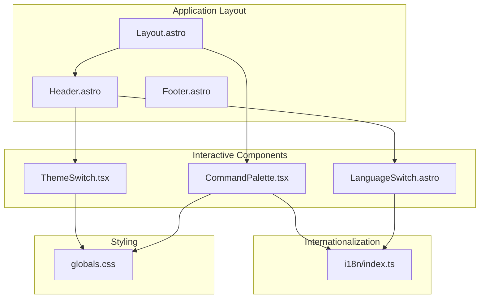
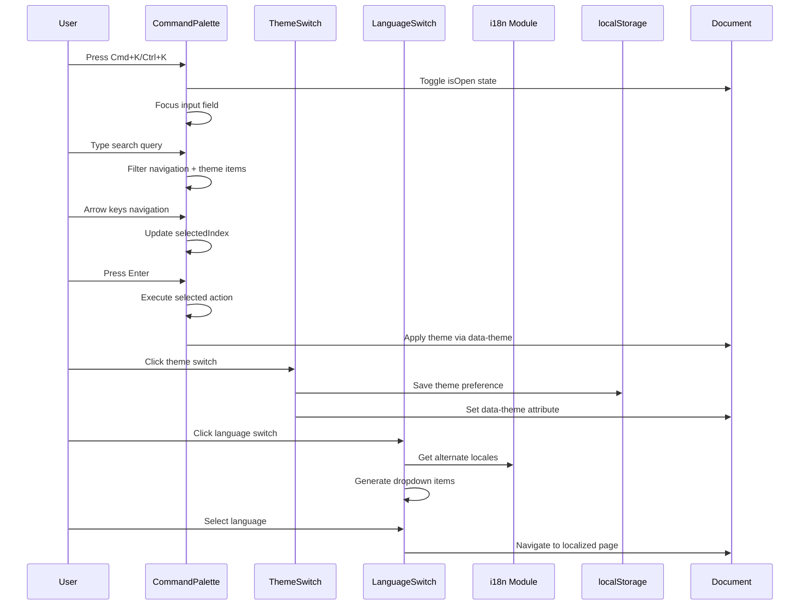
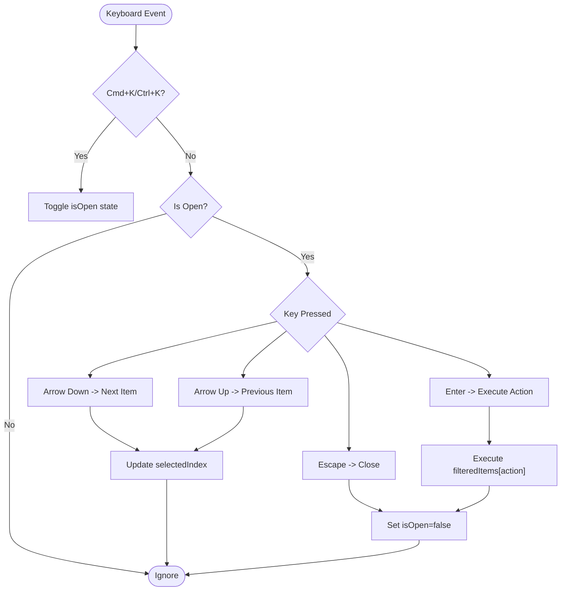
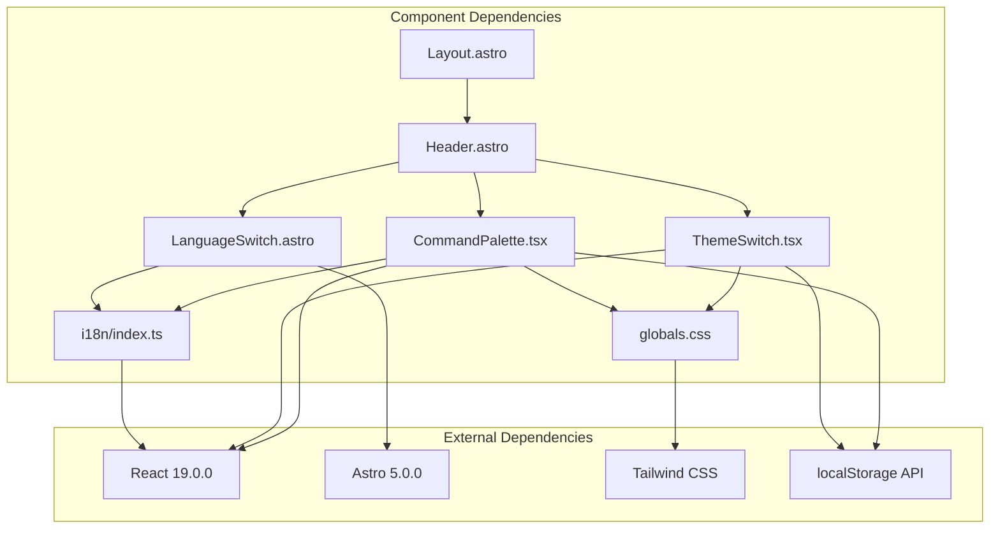

# Interactive Components

<cite>
**Referenced Files in This Document**
- [CommandPalette.tsx](file://src/components/CommandPalette.tsx)
- [ThemeSwitch.tsx](file://src/components/ThemeSwitch.tsx)
- [LanguageSwitch.astro](file://src/components/LanguageSwitch.astro)
- [Header.astro](file://src/components/Header.astro)
- [Layout.astro](file://src/layouts/Layout.astro)
- [globals.css](file://src/styles/globals.css)
- [index.ts](file://src/i18n/index.ts)
</cite>

## Table of Contents
1. [Introduction](#introduction)
2. [Project Structure](#project-structure)
3. [Core Components](#core-components)
4. [Architecture Overview](#architecture-overview)
5. [Detailed Component Analysis](#detailed-component-analysis)
6. [Dependency Analysis](#dependency-analysis)
7. [Performance Considerations](#performance-considerations)
8. [Troubleshooting Guide](#troubleshooting-guide)
9. [Conclusion](#conclusion)

## Introduction
This document provides comprehensive documentation for the interactive UI components in rodion.pro, focusing on:
- CommandPalette: keyboard-driven command palette with search, navigation commands, and theme switching
- ThemeSwitch: theme selector with five predefined color themes and local storage persistence
- LanguageSwitch: multilingual navigation support with internationalization integration

The documentation covers component props, event handling, accessibility features, keyboard navigation patterns, and integration with the overall application state. It also includes usage examples, customization options, and best practices for each component.

## Project Structure
The interactive components are organized within the components directory and integrate with the layout system and internationalization module. The theming system is implemented through CSS custom properties managed by the HTML data-theme attribute.



**Diagram sources**
- [Layout.astro](file://src/layouts/Layout.astro#L1-L97)
- [Header.astro](file://src/components/Header.astro#L1-L114)
- [CommandPalette.tsx](file://src/components/CommandPalette.tsx#L1-L206)
- [ThemeSwitch.tsx](file://src/components/ThemeSwitch.tsx#L1-L89)
- [LanguageSwitch.astro](file://src/components/LanguageSwitch.astro#L1-L57)
- [globals.css](file://src/styles/globals.css#L1-L181)
- [index.ts](file://src/i18n/index.ts#L1-L221)

**Section sources**
- [Layout.astro](file://src/layouts/Layout.astro#L1-L97)
- [Header.astro](file://src/components/Header.astro#L1-L114)
- [globals.css](file://src/styles/globals.css#L1-L181)

## Core Components
This section provides an overview of each interactive component and their primary responsibilities.

### CommandPalette
A keyboard-driven command palette that provides:
- Global keyboard shortcut (Cmd+K/Ctrl+K) to open/close
- Searchable navigation commands
- Theme switching capabilities
- Keyboard navigation (Arrow keys, Enter, Escape)
- Localized interface with Russian/English support

### ThemeSwitch
A dropdown theme selector offering:
- Five distinct color themes (Soft Neon Teal, Violet Rain, Amber Terminal, Ice Cyan, Mono Green)
- Persistent theme selection via localStorage
- Visual indicator of current theme
- Click-outside detection for closing

### LanguageSwitch
A language selector enabling:
- Switching between Russian and English
- Automatic alternate locale generation
- Responsive dropdown behavior
- Internationalization integration

**Section sources**
- [CommandPalette.tsx](file://src/components/CommandPalette.tsx#L1-L206)
- [ThemeSwitch.tsx](file://src/components/ThemeSwitch.tsx#L1-L89)
- [LanguageSwitch.astro](file://src/components/LanguageSwitch.astro#L1-L57)

## Architecture Overview
The interactive components follow a cohesive architecture pattern with clear separation of concerns and state management.



**Diagram sources**
- [CommandPalette.tsx](file://src/components/CommandPalette.tsx#L73-L98)
- [ThemeSwitch.tsx](file://src/components/ThemeSwitch.tsx#L35-L40)
- [LanguageSwitch.astro](file://src/components/LanguageSwitch.astro#L44-L56)
- [Layout.astro](file://src/layouts/Layout.astro#L87-L93)

## Detailed Component Analysis

### CommandPalette Component

#### Props and State Management
The CommandPalette component accepts a single prop and manages several internal states:

**Props:**
- `lang`: 'ru' | 'en' - Language specification for localization

**Internal States:**
- `isOpen`: Controls visibility of the command palette
- `query`: Current search query string
- `selectedIndex`: Currently highlighted item index
- `inputRef`: Reference to the input element for focus management

#### Keyboard Shortcuts and Event Handling
The component implements comprehensive keyboard navigation:



**Diagram sources**
- [CommandPalette.tsx](file://src/components/CommandPalette.tsx#L73-L98)

#### Search Functionality and Filtering
The search implementation provides intelligent filtering with:
- Case-insensitive matching
- Multi-term search support
- Keyword expansion for enhanced discoverability
- Grouped results display

#### Navigation Commands
The component provides direct navigation to:
- Home page
- Projects page
- Blog page
- Changelog page
- Now page
- Uses page
- Resume page
- Contact page

Each navigation command includes localized labels and searchable keywords for improved discoverability.

#### Theme Switching Integration
The CommandPalette integrates theme switching through:
- Dedicated theme category items
- Direct theme application via CSS custom properties
- Persistence to localStorage
- Immediate visual feedback

#### Accessibility Features
The component implements several accessibility enhancements:
- Proper ARIA labels for screen readers
- Keyboard navigation support
- Focus management for modal behavior
- High contrast color schemes
- Semantic HTML structure

#### Usage Examples

**Basic Initialization:**
```typescript
// In layout component
<CommandPalette lang={lang} client:load />
```

**Customization Options:**
- Language selection via prop
- Theme persistence through localStorage
- Keyboard shortcut customization through event listeners

**Best Practices:**
- Use `client:load` directive for hydration
- Ensure proper focus management
- Implement graceful fallback for disabled JavaScript

**Section sources**
- [CommandPalette.tsx](file://src/components/CommandPalette.tsx#L1-L206)
- [Layout.astro](file://src/layouts/Layout.astro#L84-L94)

### ThemeSwitch Component

#### Theme Configuration and Types
The component defines five distinct themes with associated color palettes:

**Available Themes:**
1. Soft Neon Teal (#38e8d6)
2. Violet Rain (#b066ff)
3. Amber Terminal (#ffb74a)
4. Ice Cyan (#46e4ff)
5. Mono Green (#55f27d)

Each theme includes comprehensive color definitions for:
- Background colors (`--bg`, `--surface`, `--surface2`)
- Text colors (`--text`, `--muted`)
- Border colors (`--border`)
- Accent colors (`--accent`, `--accent2`)
- Special effects (`--glow`, `--danger`, `--success`, `--warn`)

#### State Management and Persistence
The component implements robust state management:
- Initial theme loading from localStorage
- Click-outside detection for dropdown closure
- Real-time theme application via CSS custom properties
- Persistent storage of user preferences

#### Dropdown Interaction Pattern
The dropdown follows standard interaction patterns:
- Click to toggle visibility
- Hover states for interactive elements
- Visual indication of currently selected theme
- Smooth transitions for enhanced UX

#### Integration with Theming System
The ThemeSwitch component integrates seamlessly with the global theming system:
- Updates the HTML `data-theme` attribute
- Applies CSS custom properties throughout the application
- Supports runtime theme switching without page reload

#### Usage Examples

**Basic Implementation:**
```typescript
// In header component
<ThemeSwitch client:load />
```

**Customization Options:**
- Theme persistence via localStorage
- Visual theme indicator with accent color
- Responsive dropdown positioning

**Best Practices:**
- Use `client:load` directive for proper hydration
- Ensure adequate color contrast for accessibility
- Test theme switching across different devices

**Section sources**
- [ThemeSwitch.tsx](file://src/components/ThemeSwitch.tsx#L1-L89)
- [globals.css](file://src/styles/globals.css#L7-L86)

### LanguageSwitch Component

#### Internationalization Integration
The LanguageSwitch component provides seamless integration with the i18n system:
- Dynamic language detection from URL
- Automatic alternate locale generation
- Translated language names
- Path localization support

#### Dropdown Behavior and Navigation
The component implements intelligent dropdown behavior:
- Click-to-toggle interaction pattern
- Click-outside detection for closure
- Active language highlighting
- Direct navigation to localized pages

#### Responsive Design Considerations
The component adapts to different screen sizes:
- Desktop: Full dropdown with all language options
- Mobile: Compact button with dropdown activation
- Touch-friendly interaction targets

#### Usage Examples

**Basic Implementation:**
```typescript
// In header component
<LanguageSwitch />
```

**Integration with Navigation:**
The component works in conjunction with the i18n module to provide:
- Language-aware navigation
- Alternate locale generation
- Path localization utilities

**Best Practices:**
- Ensure proper ARIA labeling for accessibility
- Test navigation across different languages
- Verify SEO implications of alternate locales

**Section sources**
- [LanguageSwitch.astro](file://src/components/LanguageSwitch.astro#L1-L57)
- [index.ts](file://src/i18n/index.ts#L1-L221)

## Dependency Analysis
The interactive components demonstrate clear dependency relationships and integration patterns.



**Diagram sources**
- [CommandPalette.tsx](file://src/components/CommandPalette.tsx#L1-L206)
- [ThemeSwitch.tsx](file://src/components/ThemeSwitch.tsx#L1-L89)
- [LanguageSwitch.astro](file://src/components/LanguageSwitch.astro#L1-L57)
- [Header.astro](file://src/components/Header.astro#L1-L114)
- [Layout.astro](file://src/layouts/Layout.astro#L1-L97)
- [index.ts](file://src/i18n/index.ts#L1-L221)
- [globals.css](file://src/styles/globals.css#L1-L181)

### Component Coupling Analysis
The components exhibit low to moderate coupling with clear separation of concerns:
- CommandPalette depends on i18n and CSS for theming
- ThemeSwitch is self-contained with localStorage integration
- LanguageSwitch integrates with i18n module for navigation
- All components integrate with the layout system through Header

### State Management Patterns
Each component implements appropriate state management:
- CommandPalette: React state with localStorage persistence
- ThemeSwitch: React state with localStorage synchronization
- LanguageSwitch: Astro component state with dynamic content generation

**Section sources**
- [CommandPalette.tsx](file://src/components/CommandPalette.tsx#L1-L206)
- [ThemeSwitch.tsx](file://src/components/ThemeSwitch.tsx#L1-L89)
- [LanguageSwitch.astro](file://src/components/LanguageSwitch.astro#L1-L57)
- [Header.astro](file://src/components/Header.astro#L1-L114)
- [Layout.astro](file://src/layouts/Layout.astro#L1-L97)

## Performance Considerations
The interactive components are designed with performance optimization in mind:

### Memory Management
- Event listeners are properly cleaned up on component unmount
- Refs are used efficiently for DOM access
- State updates are batched appropriately

### Rendering Optimization
- Conditional rendering prevents unnecessary DOM elements
- CSS custom properties enable efficient theme switching
- Minimal re-renders through proper state management

### Accessibility and UX
- Keyboard navigation reduces mouse dependency
- Focus management improves screen reader compatibility
- Visual feedback enhances user experience

## Troubleshooting Guide

### CommandPalette Issues
**Problem:** Command palette not opening with keyboard shortcut
- Verify `client:load` directive is present
- Check browser console for keyboard event conflicts
- Ensure `toggle-command-palette` event listener is active

**Problem:** Search functionality not working
- Verify query state updates correctly
- Check filteredItems computation logic
- Ensure keywords array is properly populated

**Problem:** Theme switching not persisting
- Verify localStorage availability
- Check data-theme attribute application
- Ensure CSS custom properties are defined

### ThemeSwitch Issues
**Problem:** Theme not applying correctly
- Verify CSS custom properties exist
- Check data-theme attribute on HTML element
- Ensure theme ID matches CSS selector

**Problem:** Dropdown not closing properly
- Verify click-outside event listener registration
- Check dropdownRef.current reference
- Ensure event listener cleanup on unmount

### LanguageSwitch Issues
**Problem:** Language not switching correctly
- Verify i18n module integration
- Check alternate locale generation
- Ensure path localization works properly

**Section sources**
- [CommandPalette.tsx](file://src/components/CommandPalette.tsx#L95-L112)
- [ThemeSwitch.tsx](file://src/components/ThemeSwitch.tsx#L25-L33)
- [LanguageSwitch.astro](file://src/components/LanguageSwitch.astro#L44-L56)

## Conclusion
The interactive components in rodion.pro demonstrate excellent implementation of modern web UI patterns with strong emphasis on:
- User experience through keyboard-first interactions
- Accessibility compliance with proper ARIA attributes
- Performance optimization through efficient state management
- Internationalization support with comprehensive language switching
- Theme flexibility with persistent user preferences

The components integrate seamlessly into the Astro-based application architecture while maintaining clear separation of concerns and robust error handling. The implementation serves as a model for building accessible, performant, and user-friendly interactive UI components.