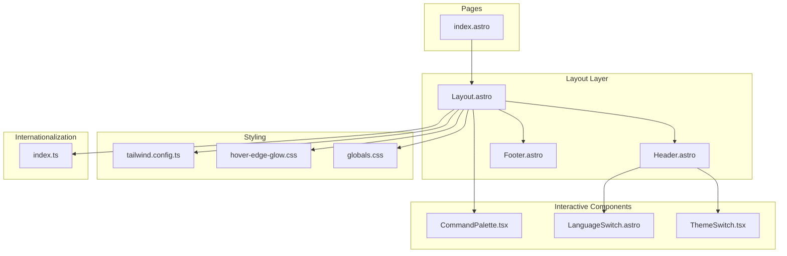
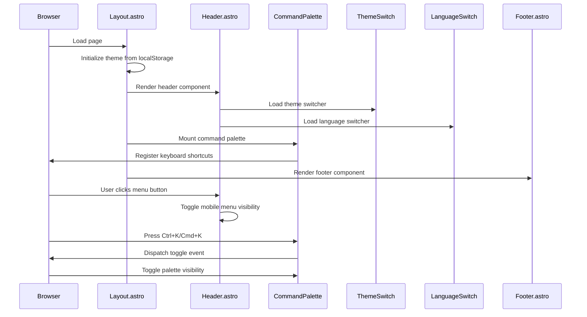
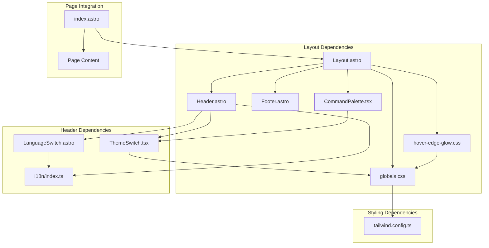

# Layout Components

<cite>
**Referenced Files in This Document**
- [Layout.astro](file://src/layouts/Layout.astro)
- [Header.astro](file://src/components/Header.astro)
- [Footer.astro](file://src/components/Footer.astro)
- [CommandPalette.tsx](file://src/components/CommandPalette.tsx)
- [ThemeSwitch.tsx](file://src/components/ThemeSwitch.tsx)
- [LanguageSwitch.astro](file://src/components/LanguageSwitch.astro)
- [globals.css](file://src/styles/globals.css)
- [hover-edge-glow.css](file://src/styles/hover-edge-glow.css)
- [hoverEdgeGlow.ts](file://src/lib/ui/hoverEdgeGlow.ts)
- [index.ts](file://src/i18n/index.ts)
- [tailwind.config.ts](file://tailwind.config.ts)
- [index.astro](file://src/pages/en/index.astro)
</cite>

## Table of Contents
1. [Introduction](#introduction)
2. [Project Structure](#project-structure)
3. [Core Components](#core-components)
4. [Architecture Overview](#architecture-overview)
5. [Detailed Component Analysis](#detailed-component-analysis)
6. [Dependency Analysis](#dependency-analysis)
7. [Performance Considerations](#performance-considerations)
8. [Troubleshooting Guide](#troubleshooting-guide)
9. [Conclusion](#conclusion)

## Introduction
This document provides comprehensive documentation for the layout components that form the structural foundation of rodion.pro pages. It covers the main Layout.astro component, Header.astro, and Footer.astro, along with their integration patterns, responsive design approaches, and styling methodologies using Tailwind CSS. The documentation includes component composition patterns, prop interfaces, responsive breakpoints, and practical examples of layout customization and Astro routing integration.

## Project Structure
The layout system follows a clear separation of concerns:
- Global layout wrapper in Layout.astro
- Reusable header and footer components
- Interactive components for theme switching and command palette
- Internationalization support for navigation and content
- Tailwind CSS configuration with theme-aware color tokens

**Diagram sources**
- [Layout.astro](file://src/layouts/Layout.astro#L1-L97)
- [Header.astro](file://src/components/Header.astro#L1-L114)
- [Footer.astro](file://src/components/Footer.astro#L1-L95)
- [CommandPalette.tsx](file://src/components/CommandPalette.tsx#L1-L206)
- [ThemeSwitch.tsx](file://src/components/ThemeSwitch.tsx#L1-L89)
- [LanguageSwitch.astro](file://src/components/LanguageSwitch.astro#L1-L57)
- [globals.css](file://src/styles/globals.css#L1-L181)
- [hover-edge-glow.css](file://src/styles/hover-edge-glow.css#L1-L65)
- [tailwind.config.ts](file://tailwind.config.ts#L1-L35)
- [index.ts](file://src/i18n/index.ts#L1-L221)
- [index.astro](file://src/pages/en/index.astro#L1-L152)

**Section sources**
- [Layout.astro](file://src/layouts/Layout.astro#L1-L97)
- [globals.css](file://src/styles/globals.css#L1-L181)
- [tailwind.config.ts](file://tailwind.config.ts#L1-L35)

## Core Components
This section documents the primary layout components and their responsibilities.

### Layout.astro - Main Page Wrapper
The Layout.astro component serves as the root wrapper for all pages, providing:
- Global styling imports and theme initialization
- SEO metadata generation with OpenGraph and Twitter cards
- Internationalization support with alternate language links
- Responsive body structure with sticky header and flexible main content
- Command palette integration with keyboard shortcuts
- Hover edge glow effect initialization

Key features:
- **Props interface**: Supports title, description, image, type, publishedTime, and noindex flags
- **SEO integration**: Automatic canonical URL generation and alternate locale links
- **Theme system**: Initializes theme from localStorage or defaults to soft-neon-teal
- **Accessibility**: Proper ARIA labels and keyboard navigation support
- **Performance**: Inline scripts for critical path initialization

**Section sources**
- [Layout.astro](file://src/layouts/Layout.astro#L10-L17)
- [Layout.astro](file://src/layouts/Layout.astro#L19-L26)
- [Layout.astro](file://src/layouts/Layout.astro#L28-L96)

### Header.astro - Navigation and Controls
The Header.astro component provides:
- Sticky navigation bar with logo and navigation items
- Responsive design with mobile hamburger menu
- Command palette trigger button with keyboard shortcut hint
- Theme switcher integration
- Language switcher dropdown
- Active state highlighting for current page
- Internationalized navigation labels

Responsive behavior:
- Desktop: Full horizontal navigation bar
- Mobile: Hamburger menu with vertical stack layout
- Tablet: Adaptive breakpoint at md (768px)

**Section sources**
- [Header.astro](file://src/components/Header.astro#L10-L16)
- [Header.astro](file://src/components/Header.astro#L19-L99)
- [Header.astro](file://src/components/Header.astro#L101-L114)

### Footer.astro - Site Footer
The Footer.astro component delivers:
- Multi-column layout with brand, navigation, and social links
- Copyright information with dynamic year
- Built with attribution
- Internationalized content sections
- Responsive grid layout (1 column on mobile, 3 columns on desktop)
- Social media links with proper accessibility attributes

**Section sources**
- [Footer.astro](file://src/components/Footer.astro#L8-L18)
- [Footer.astro](file://src/components/Footer.astro#L21-L94)

## Architecture Overview
The layout architecture demonstrates a layered approach with clear separation between presentation, interactivity, and data management.

**Diagram sources**
- [Layout.astro](file://src/layouts/Layout.astro#L61-L94)
- [Header.astro](file://src/components/Header.astro#L101-L114)
- [CommandPalette.tsx](file://src/components/CommandPalette.tsx#L73-L104)

## Detailed Component Analysis

### Layout.astro Implementation Details
The Layout component implements a comprehensive page wrapper with the following key patterns:

**SEO and Metadata Management**
- Dynamic title construction with site branding
- OpenGraph protocol implementation for social sharing
- Twitter card configuration
- Canonical URL generation
- Alternate language link generation

**Theme System Integration**
- Theme initialization script runs before rendering
- LocalStorage persistence for theme preferences
- CSS variable-based theme switching
- Multiple theme variants (soft-neon-teal, violet-rain, amber-terminal, ice-cyan, mono-green)

**Interactive Features**
- Command palette keyboard shortcut (Ctrl+K/Cmd+K)
- Custom event-based command palette toggling
- Hover edge glow effect initialization
- Mobile-responsive navigation controls

**Section sources**
- [Layout.astro](file://src/layouts/Layout.astro#L28-L68)
- [Layout.astro](file://src/layouts/Layout.astro#L78-L96)

### Header.astro Navigation System
The header implements a sophisticated navigation system with internationalization support:

**Navigation Items Configuration**
- Static navigation items with localization keys
- Dynamic path generation with language prefixes
- Active state detection based on current URL
- Responsive navigation with mobile adaptation

**Interactive Elements**
- Command palette trigger button with keyboard shortcut display
- Theme switcher integration with client:load directive
- Language switcher dropdown with click-outside handling
- Mobile menu toggle with hamburger icon

**Responsive Design Patterns**
- Hidden navigation on small screens
- Mobile menu with slide-down animation
- Adaptive spacing and typography scaling

**Section sources**
- [Header.astro](file://src/components/Header.astro#L10-L16)
- [Header.astro](file://src/components/Header.astro#L19-L99)
- [Header.astro](file://src/components/Header.astro#L101-L114)

### Footer.astro Content Organization
The footer employs a three-column responsive grid layout:

**Content Structure**
- Brand identity with localized tagline
- Navigation links with internationalized labels
- Social media connections with proper accessibility
- Copyright and attribution information

**Responsive Grid System**
- Single column layout on mobile devices
- Three-column layout on desktop screens
- Flexible spacing and alignment
- Consistent typography hierarchy

**Section sources**
- [Footer.astro](file://src/components/Footer.astro#L21-L94)

### CommandPalette.tsx - Advanced Search Interface
The CommandPalette component provides an advanced keyboard-driven interface:

**Component Architecture**
- React-based implementation with TypeScript props
- Comprehensive filtering and grouping logic
- Keyboard navigation with arrow keys and Enter
- Escape key to close the palette
- Dynamic theme switching capabilities

**Search Functionality**
- Combined navigation and theme commands
- Keyword-based filtering with fuzzy matching
- Grouped results with visual separators
- Selected item highlighting

**Integration Patterns**
- Window location manipulation for navigation
- Theme persistence via localStorage
- Event-driven toggling from keyboard shortcuts
- Internationalized user interface

**Section sources**
- [CommandPalette.tsx](file://src/components/CommandPalette.tsx#L3-L13)
- [CommandPalette.tsx](file://src/components/CommandPalette.tsx#L28-L47)
- [CommandPalette.tsx](file://src/components/CommandPalette.tsx#L73-L104)

### ThemeSwitch.tsx - Theme Selection System
The ThemeSwitch component manages theme selection with persistent storage:

**Theme Management**
- Five predefined theme variants with CSS variables
- LocalStorage persistence for user preferences
- Dropdown interface with visual theme indicators
- Click-outside detection for closing dropdown

**Visual Design**
- Color swatches representing theme accents
- Current theme highlighting
- Smooth transitions and hover effects
- Accessible dropdown positioning

**Section sources**
- [ThemeSwitch.tsx](file://src/components/ThemeSwitch.tsx#L3-L9)
- [ThemeSwitch.tsx](file://src/components/ThemeSwitch.tsx#L13-L40)

### LanguageSwitch.astro - Internationalization Control
The LanguageSwitch component handles language selection:

**Language Management**
- Dropdown with available language options
- Active language highlighting
- Path-based navigation to localized content
- Click-outside behavior for dropdown closure

**Section sources**
- [LanguageSwitch.astro](file://src/components/LanguageSwitch.astro#L8-L42)
- [LanguageSwitch.astro](file://src/components/LanguageSwitch.astro#L44-L57)

### Styling System and Responsive Design
The styling system implements a comprehensive theme and responsive design framework:

**CSS Architecture**
- Tailwind CSS integration with custom design tokens
- CSS variable-based theme system
- Layered CSS organization (base, components, utilities)
- Conic gradient hover effects with edge detection

**Theme System**
- Five distinct color themes with cohesive palettes
- Dark mode friendly color schemes
- Consistent accent colors across themes
- Glowing effects and visual feedback

**Responsive Breakpoints**
- Mobile-first design approach
- Tailwind's default breakpoint system
- Adaptive typography and spacing
- Flexible grid layouts

**Section sources**
- [globals.css](file://src/styles/globals.css#L7-L86)
- [globals.css](file://src/styles/globals.css#L88-L181)
- [hover-edge-glow.css](file://src/styles/hover-edge-glow.css#L1-L65)
- [tailwind.config.ts](file://tailwind.config.ts#L3-L32)

## Dependency Analysis
The layout components demonstrate clear dependency relationships and modular architecture:

**Diagram sources**
- [Layout.astro](file://src/layouts/Layout.astro#L1-L8)
- [Header.astro](file://src/components/Header.astro#L1-L4)
- [CommandPalette.tsx](file://src/components/CommandPalette.tsx#L1-L1)
- [globals.css](file://src/styles/globals.css#L1-L5)
- [tailwind.config.ts](file://tailwind.config.ts#L1-L35)
- [index.ts](file://src/i18n/index.ts#L1-L221)
- [index.astro](file://src/pages/en/index.astro#L1-L2)

**Section sources**
- [Layout.astro](file://src/layouts/Layout.astro#L1-L8)
- [Header.astro](file://src/components/Header.astro#L1-L4)
- [CommandPalette.tsx](file://src/components/CommandPalette.tsx#L1-L1)

## Performance Considerations
The layout system implements several performance optimization strategies:

**Critical Rendering Path**
- Inline theme initialization script prevents flash of unstyled content
- Essential styles loaded via import statements
- Lazy loading for interactive components (client:load directive)

**Memory Management**
- Proper cleanup of event listeners in interactive components
- Mutation observers for dynamic content handling
- Efficient DOM manipulation with minimal reflows

**Network Optimization**
- CSS variables reduce stylesheet size
- Shared theme system eliminates redundant styles
- Efficient SVG icons with minimal markup

**Accessibility and UX**
- Keyboard navigation support for all interactive elements
- Focus management and ARIA attributes
- Touch-friendly interface sizing
- Reduced motion preferences consideration

## Troubleshooting Guide
Common issues and solutions for layout components:

**Theme Switching Issues**
- Verify localStorage availability in browser
- Check CSS variable definitions in globals.css
- Ensure data-theme attribute is properly set on html element

**Navigation Problems**
- Confirm getLangFromUrl function returns correct language
- Verify getLocalizedPath generates proper URLs
- Check alternates array for missing language pairs

**Responsive Behavior**
- Test mobile menu toggle functionality
- Verify breakpoint behavior at md (768px) threshold
- Check grid layout responsiveness across screen sizes

**Command Palette Issues**
- Ensure keyboard shortcuts register correctly
- Verify event listener cleanup on component unmount
- Check filtered items array for empty results

**Section sources**
- [Layout.astro](file://src/layouts/Layout.astro#L61-L68)
- [Header.astro](file://src/components/Header.astro#L101-L114)
- [CommandPalette.tsx](file://src/components/CommandPalette.tsx#L95-L104)

## Conclusion
The layout components in rodion.pro demonstrate a well-architected, modular system that balances functionality with performance and accessibility. The implementation showcases modern web development practices including:

- Clean separation of concerns between layout, navigation, and interactive components
- Comprehensive internationalization support with dynamic content generation
- Sophisticated theme system with multiple color variants and persistent user preferences
- Responsive design patterns that adapt to various screen sizes and devices
- Advanced accessibility features including keyboard navigation and screen reader support
- Performance optimizations through lazy loading and efficient CSS architecture

The system provides a solid foundation for building scalable, maintainable web applications while maintaining excellent user experience across different devices and interaction modes.