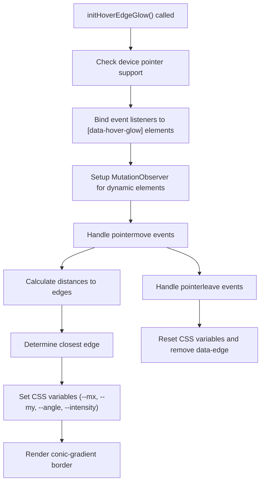
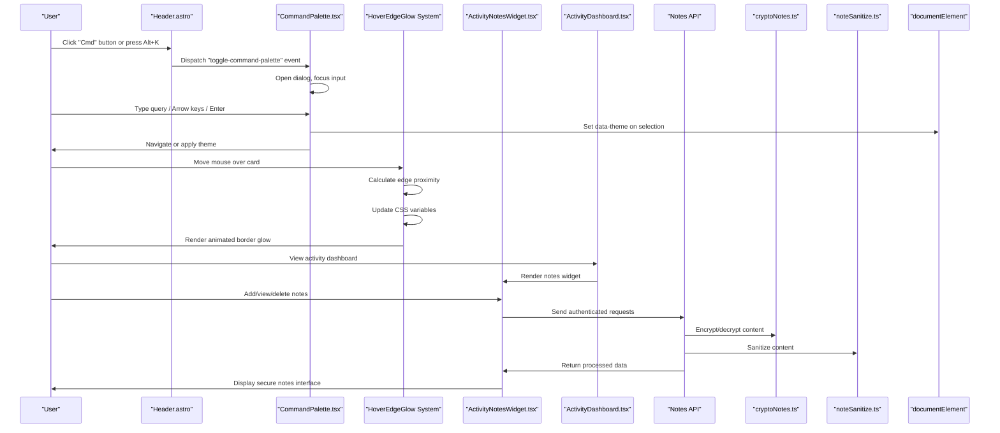
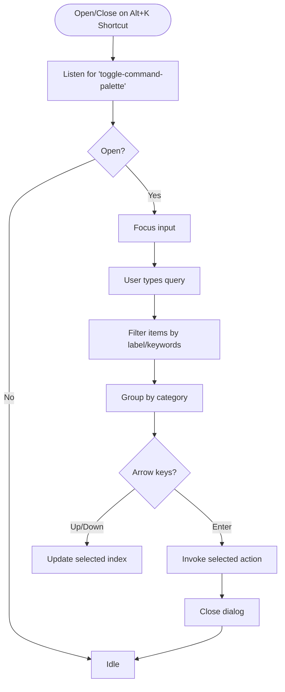
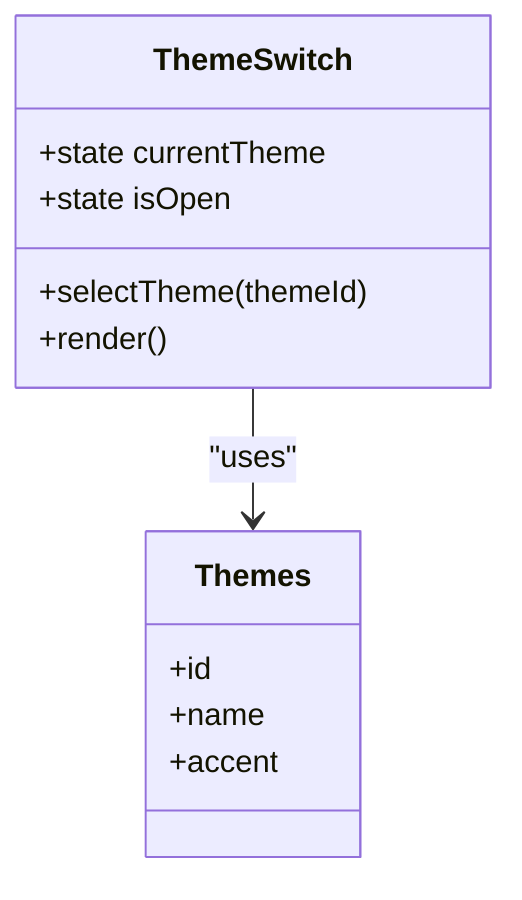
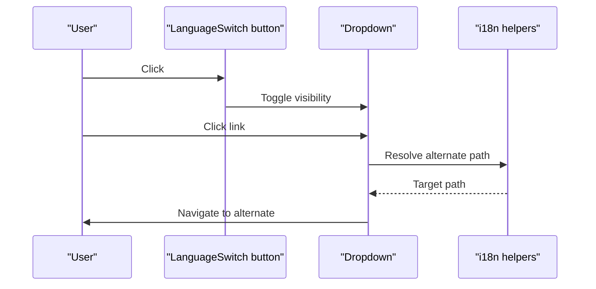
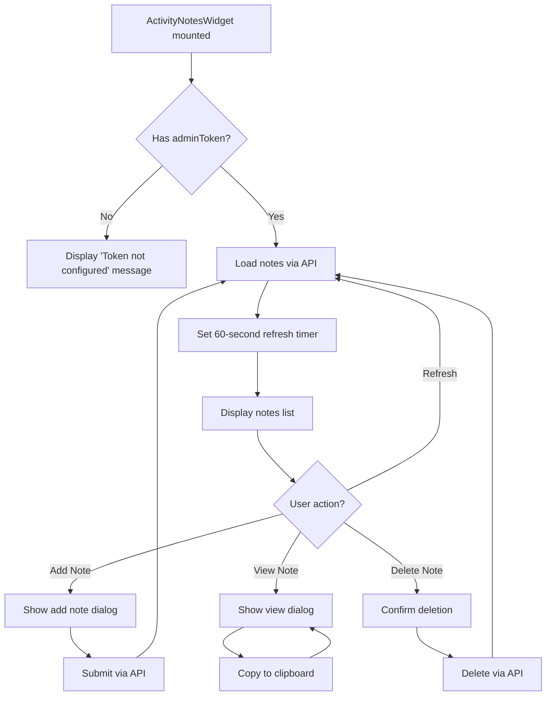
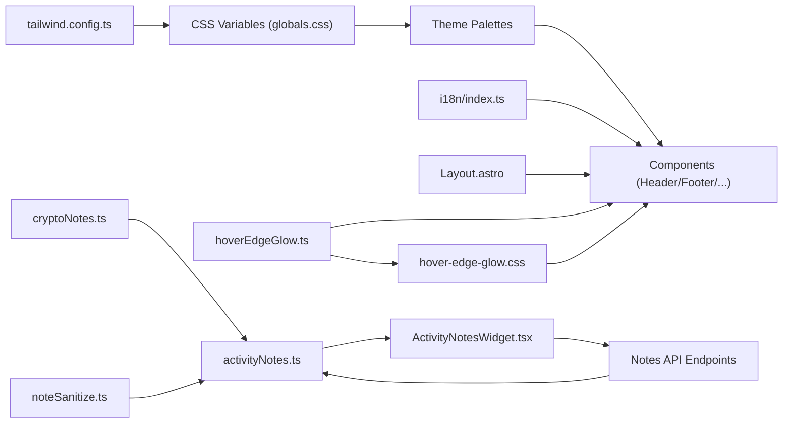

# UI Components

<cite>
**Referenced Files in This Document**
- [CommandPalette.tsx](file://src/components/CommandPalette.tsx)
- [ThemeSwitch.tsx](file://src/components/ThemeSwitch.tsx)
- [LanguageSwitch.astro](file://src/components/LanguageSwitch.astro)
- [Header.astro](file://src/components/Header.astro)
- [Footer.astro](file://src/components/Footer.astro)
- [TerminalHero.astro](file://src/components/TerminalHero.astro)
- [EventCard.astro](file://src/components/EventCard.astro)
- [ProjectCard.astro](file://src/components/ProjectCard.astro)
- [ActivityNotesWidget.tsx](file://src/components/ActivityNotesWidget.tsx)
- [ActivityDashboard.tsx](file://src/components/ActivityDashboard.tsx)
- [Layout.astro](file://src/layouts/Layout.astro)
- [i18n/index.ts](file://src/i18n/index.ts)
- [activityNotes.ts](file://src/lib/activityNotes.ts)
- [cryptoNotes.ts](file://src/lib/cryptoNotes.ts)
- [noteSanitize.ts](file://src/lib/noteSanitize.ts)
- [tailwind.config.ts](file://tailwind.config.ts)
- [globals.css](file://src/styles/globals.css)
- [hover-edge-glow.css](file://src/styles/hover-edge-glow.css)
- [hoverEdgeGlow.ts](file://src/lib/ui/hoverEdgeGlow.ts)
</cite>

## Update Summary
**Changes Made**
- Added new ActivityNotesWidget component providing comprehensive notes management interface with real-time preview, tag support, and internationalization
- Enhanced ActivityDashboard component with integrated notes widget and privacy controls
- Added encryption and sanitization libraries for secure notes handling
- Updated API endpoints for notes management with admin authentication and device verification
- Enhanced existing dashboard components with note ingestion capabilities and privacy controls

## Table of Contents
1. [Introduction](#introduction)
2. [Project Structure](#project-structure)
3. [Core Components](#core-components)
4. [Interactive Effects and Animations](#interactive-effects-and-animations)
5. [Architecture Overview](#architecture-overview)
6. [Detailed Component Analysis](#detailed-component-analysis)
7. [Dependency Analysis](#dependency-analysis)
8. [Performance Considerations](#performance-considerations)
9. [Troubleshooting Guide](#troubleshooting-guide)
10. [Conclusion](#conclusion)
11. [Appendices](#appendices)

## Introduction
This document describes the UI component library used in rodion.pro. It explains the component architecture, the design system built on Tailwind CSS, and the styling approach. Interactive components covered include the command palette for navigation, the theme switcher with five color themes, the language selector for multilingual support, and social sharing components. Layout components include the main layout structure, header navigation, footer implementation, and specialized components such as the terminal hero and event cards. The guide also documents component props, customization options, responsive design patterns, accessibility features, usage examples, integration guidelines, styling customization approaches, component composition patterns, and the new hover edge glow interactive effect system.

**Updated**: Added comprehensive documentation for the new ActivityNotesWidget component that provides secure notes management with encryption, real-time preview, tag support, and internationalization capabilities.

## Project Structure
The UI components are organized under src/components and integrated via Astro layouts and pages. The design system relies on a CSS variable-based theme system controlled by a data-theme attribute and Tailwind's color variables. Global styles define theme palettes and component utilities, while Astro components encapsulate presentation and interactivity. The new hover edge glow system provides universal interactive card borders with smart edge highlighting. **Enhanced**: The activity monitoring system now includes a comprehensive notes management interface with encryption and privacy controls.

```mermaid
graph TB
subgraph "Layout"
LAYOUT["Layout.astro"]
END
subgraph "Header/Footer"
HEADER["Header.astro"]
FOOTER["Footer.astro"]
END
subgraph "Interactive"
CMD["CommandPalette.tsx"]
THEME["ThemeSwitch.tsx"]
LANG["LanguageSwitch.astro"]
HOVER["HoverEdgeGlow System"]
NOTES["ActivityNotesWidget.tsx"]
END
subgraph "Content"
HERO["TerminalHero.astro"]
EVENT["EventCard.astro"]
PROJECT["ProjectCard.astro"]
DASHBOARD["ActivityDashboard.tsx"]
END
subgraph "Activity System"
LIB["activityNotes.ts"]
CRYPTO["cryptoNotes.ts"]
SANITIZE["noteSanitize.ts"]
API["Notes API Endpoints"]
END
LAYOUT --> HEADER
LAYOUT --> FOOTER
LAYOUT --> CMD
LAYOUT --> HOVER
HEADER --> THEME
HEADER --> LANG
FOOTER --> SOCIAL["Social links (icons)"]
LAYOUT --> HERO
LAYOUT --> EVENT
LAYOUT --> PROJECT
EVENT --> HOVER
PROJECT --> HOVER
DASHBOARD --> NOTES
NOTES --> LIB
LIB --> CRYPTO
LIB --> SANITIZE
NOTES --> API
```

**Diagram sources**
- [Layout.astro](file://src/layouts/Layout.astro#L1-L100)
- [Header.astro](file://src/components/Header.astro#L1-L115)
- [Footer.astro](file://src/components/Footer.astro#L1-L95)
- [CommandPalette.tsx](file://src/components/CommandPalette.tsx#L1-L207)
- [ThemeSwitch.tsx](file://src/components/ThemeSwitch.tsx#L1-L89)
- [LanguageSwitch.astro](file://src/components/LanguageSwitch.astro#L1-L57)
- [TerminalHero.astro](file://src/components/TerminalHero.astro#L1-L74)
- [EventCard.astro](file://src/components/EventCard.astro#L1-L77)
- [ProjectCard.astro](file://src/components/ProjectCard.astro#L1-L132)
- [ActivityNotesWidget.tsx](file://src/components/ActivityNotesWidget.tsx#L1-L402)
- [ActivityDashboard.tsx](file://src/components/ActivityDashboard.tsx#L536-L539)
- [activityNotes.ts](file://src/lib/activityNotes.ts#L1-L108)
- [cryptoNotes.ts](file://src/lib/cryptoNotes.ts#L1-L45)
- [noteSanitize.ts](file://src/lib/noteSanitize.ts#L1-L30)

**Section sources**
- [Layout.astro](file://src/layouts/Layout.astro#L1-L100)
- [globals.css](file://src/styles/globals.css#L1-L181)
- [tailwind.config.ts](file://tailwind.config.ts#L1-L35)

## Core Components
This section outlines the primary UI components and their responsibilities, props, and integration points.

- CommandPalette
  - Purpose: Application-wide command palette with navigation and theme switching.
  - Props: lang (language).
  - Behavior: Keyboard shortcuts, filtering, grouping, selection, persistence via localStorage, and theme application via data-theme.
  - Accessibility: Keyboard navigation, ARIA labels, focus management, and screen-reader-friendly hints.
  - Integration: Triggered from header button and global Alt+K shortcut (updated from Ctrl+K for cross-platform compatibility).

- ThemeSwitch
  - Purpose: Dropdown to select among five predefined themes.
  - Props: None.
  - Behavior: Reads/writes localStorage, applies data-theme to documentElement, click-outside dismissal.
  - Accessibility: Button with aria-label, keyboard-friendly.

- LanguageSwitch
  - Purpose: Toggle language with dropdown of available locales.
  - Props: None (Astro component).
  - Behavior: Uses i18n helpers to compute alternates and active language; toggles dropdown visibility.
  - Accessibility: Button with aria-label, dropdown items as links.

- Header
  - Purpose: Top navigation bar with branding, desktop links, mobile menu, command trigger, theme switch, and language switch.
  - Integration: Uses i18n translations and localized paths; triggers command palette via custom event with Alt+K shortcut.

- Footer
  - Purpose: Site footer with brand, navigation links, social connections, and copyright.
  - Integration: Uses i18n translations and localized paths.

- TerminalHero
  - Purpose: Animated terminal-style hero with language-specific content.
  - Props: lang.
  - Styling: Uses component utilities and animations.

- EventCard
  - Purpose: Card displaying changelog/event entries with icons, labels, timestamps, and optional links.
  - Props: event (from database schema), lang.
  - **Enhanced**: Now includes hover edge glow functionality for interactive card borders.

- ProjectCard
  - Purpose: Project showcase with status badges, stack tags, highlights, and external links.
  - Props: id, title, tagline, status, links, stack, highlights, lang.
  - **Enhanced**: Now includes hover edge glow functionality for interactive card borders.

- **ActivityNotesWidget** *(New)*
  - Purpose: Comprehensive notes management interface with real-time preview, tag support, and internationalization.
  - Props: adminToken (string), deviceId (string), lang ('ru' | 'en').
  - Features: Real-time note loading, add/delete operations, encrypted storage, privacy controls, clipboard integration, and responsive dialogs.
  - Security: AES-256-GCM encryption, content sanitization, and admin authentication.
  - Integration: Embedded within ActivityDashboard with automatic refresh and error handling.

**Section sources**
- [CommandPalette.tsx](file://src/components/CommandPalette.tsx#L1-L207)
- [ThemeSwitch.tsx](file://src/components/ThemeSwitch.tsx#L1-L89)
- [LanguageSwitch.astro](file://src/components/LanguageSwitch.astro#L1-L57)
- [Header.astro](file://src/components/Header.astro#L1-L115)
- [Footer.astro](file://src/components/Footer.astro#L1-L95)
- [TerminalHero.astro](file://src/components/TerminalHero.astro#L1-L74)
- [EventCard.astro](file://src/components/EventCard.astro#L1-L77)
- [ProjectCard.astro](file://src/components/ProjectCard.astro#L1-L132)
- [ActivityNotesWidget.tsx](file://src/components/ActivityNotesWidget.tsx#L1-L402)

## Interactive Effects and Animations
The hover edge glow system provides a sophisticated interactive border effect that responds to pointer movement with smart edge highlighting. This universal effect enhances user experience across all interactive card components.

### HoverEdgeGlow System Architecture
- **Universal Implementation**: Single JavaScript utility manages pointer events and CSS variable updates
- **Smart Edge Detection**: Automatically determines which edge is closest to the pointer for precise highlighting
- **Conic Gradient Animation**: Uses CSS conic-gradient with dynamic positioning and intensity control
- **Performance Optimizations**: Implements requestAnimationFrame throttling and MutationObserver for dynamic content
- **Device Compatibility**: Automatically disables on touch devices with coarse pointer support

### Technical Implementation
- **JavaScript Utility**: `initHoverEdgeGlow()` function that attaches event listeners to all elements with `data-hover-glow` attribute
- **CSS Variables**: Dynamic variables (`--mx`, `--my`, `--angle`, `--intensity`) control gradient positioning and appearance
- **Edge Clipping**: CSS clip-path masks create directional highlighting based on proximity to edges
- **Color Variants**: Built-in support for teal (default), purple, and gold color schemes

### Usage Integration
Elements activate the hover effect by adding the `data-hover-glow` attribute. The system automatically handles:
- Initial element binding during DOMContentLoaded
- Dynamic element detection via MutationObserver
- Pointer movement tracking with throttled updates
- Automatic cleanup on component unmount



**Diagram sources**
- [hoverEdgeGlow.ts](file://src/lib/ui/hoverEdgeGlow.ts#L1-L103)
- [hover-edge-glow.css](file://src/styles/hover-edge-glow.css#L1-L65)

**Section sources**
- [hoverEdgeGlow.ts](file://src/lib/ui/hoverEdgeGlow.ts#L1-L103)
- [hover-edge-glow.css](file://src/styles/hover-edge-glow.css#L1-L65)
- [Layout.astro](file://src/layouts/Layout.astro#L70-L76)

## Architecture Overview
The UI architecture centers on:
- Theme system: CSS variables applied via data-theme on documentElement, with Tailwind consuming those variables.
- Internationalization: i18n module provides translations and helpers for localized URLs and alternates.
- Layout orchestration: Layout.astro composes Header, Footer, CommandPalette, and SEO metadata; initializes theme and hover effects.
- Component composition: Astro components render static markup with minimal interactivity; React components manage dynamic behavior.
- **Enhanced**: Universal hover edge glow system providing consistent interactive feedback across all card components.
- **Enhanced**: Activity monitoring system with secure notes management, encryption, and privacy controls.



**Diagram sources**
- [Header.astro](file://src/components/Header.astro#L101-L115)
- [CommandPalette.tsx](file://src/components/CommandPalette.tsx#L73-L98)
- [Layout.astro](file://src/layouts/Layout.astro#L86-L97)
- [hoverEdgeGlow.ts](file://src/lib/ui/hoverEdgeGlow.ts#L9-L48)
- [ActivityNotesWidget.tsx](file://src/components/ActivityNotesWidget.tsx#L28-L67)
- [ActivityDashboard.tsx](file://src/components/ActivityDashboard.tsx#L536-L539)
- [cryptoNotes.ts](file://src/lib/cryptoNotes.ts#L11-L33)
- [noteSanitize.ts](file://src/lib/noteSanitize.ts#L23-L29)

## Detailed Component Analysis

### CommandPalette
- Props
  - lang: 'ru' | 'en'
- State and Effects
  - Tracks open/closed state, query, selected index, and input focus.
  - Adds global keydown listener for Alt+K toggle and Escape/close.
  - Listens for custom "toggle-command-palette" event.
- Navigation Order Enhancement
  - **Updated**: Activity dashboard moved to position 0 as the primary navigation item.
  - Navigation items now prioritize activity: [Activity, Home, Projects, Blog, Changelog, Now, Uses, Resume, Contact].
- Filtering and Grouping
  - Merges navigation and theme items; filters by label and keywords; groups by category.
- Actions
  - Navigation actions update location with locale-aware paths.
  - Theme actions set data-theme and persist to localStorage.
- Styling and Accessibility
  - Uses semantic markup, kbd elements, and hover/focus states.
  - Keyboard hints included in footer.



**Diagram sources**
- [CommandPalette.tsx](file://src/components/CommandPalette.tsx#L73-L98)
- [CommandPalette.tsx](file://src/components/CommandPalette.tsx#L49-L60)

**Section sources**
- [CommandPalette.tsx](file://src/components/CommandPalette.tsx#L1-L207)

### ThemeSwitch
- Props: None
- Behavior
  - Initializes from localStorage; click-outside closes dropdown.
  - Applies selected theme to documentElement and persists to localStorage.
- Theming
  - Five predefined themes with distinct accent colors and palettes.



**Diagram sources**
- [ThemeSwitch.tsx](file://src/components/ThemeSwitch.tsx#L1-L89)

**Section sources**
- [ThemeSwitch.tsx](file://src/components/ThemeSwitch.tsx#L1-L89)
- [globals.css](file://src/styles/globals.css#L7-L86)

### LanguageSwitch
- Props: None (Astro component)
- Behavior
  - Computes alternates and active language from URL.
  - Toggles dropdown visibility on button click; closes on outside click.
- Integration
  - Uses i18n helpers for localized paths and alternate locales.



**Diagram sources**
- [LanguageSwitch.astro](file://src/components/LanguageSwitch.astro#L44-L56)
- [i18n/index.ts](file://src/i18n/index.ts#L206-L220)

**Section sources**
- [LanguageSwitch.astro](file://src/components/LanguageSwitch.astro#L1-L57)
- [i18n/index.ts](file://src/i18n/index.ts#L1-L221)

### Header
- Responsibilities
  - Renders branding, desktop navigation, mobile menu, command trigger, theme switch, and language switch.
  - Uses i18n translations and localized paths.
- Interactions
  - Opens mobile menu and dispatches command palette toggle event.
  - **Updated**: Command trigger button now displays Alt+K shortcut for better cross-platform compatibility.

**Section sources**
- [Header.astro](file://src/components/Header.astro#L1-L115)

### Footer
- Responsibilities
  - Displays brand, localized navigation links, social media links, and copyright.
- Social Sharing
  - Renders GitHub and Telegram icons with appropriate targets and ARIA labels.

**Section sources**
- [Footer.astro](file://src/components/Footer.astro#L1-L95)

### TerminalHero
- Purpose
  - Animated terminal-style hero with language-specific prompts and output.
- Styling
  - Uses component utilities (.terminal-window, .terminal-header, etc.) and a simple fade-in animation.

**Section sources**
- [TerminalHero.astro](file://src/components/TerminalHero.astro#L1-L74)
- [globals.css](file://src/styles/globals.css#L109-L132)

### EventCard
- Purpose
  - Displays changelog/event entries with kind-based icons and labels, optional project, and formatted timestamps.
- Props
  - event: Event record from schema
  - lang: 'ru' | 'en'
- **Enhanced**: Now includes hover edge glow functionality with automatic edge detection and conic gradient animation.

**Section sources**
- [EventCard.astro](file://src/components/EventCard.astro#L1-L77)

### ProjectCard
- Purpose
  - Project showcase with status badge, stack tags, highlights, and external links.
- Props
  - id, title, tagline, status, links, stack, highlights, lang
- **Enhanced**: Now includes hover edge glow functionality with customizable color variants and smart edge highlighting.

**Section sources**
- [ProjectCard.astro](file://src/components/ProjectCard.astro#L1-L132)

### ActivityNotesWidget *(New)*
- Purpose
  - Comprehensive notes management interface with real-time preview, tag support, and internationalization.
- Props
  - adminToken: string (admin authentication token)
  - deviceId: string (device identifier for note association)
  - lang: 'ru' | 'en' (language for UI text)
- State Management
  - Manages notes list with automatic 60-second refresh
  - Handles loading states, errors, and user interactions
  - Supports add/view/delete operations with modal dialogs
- Security Features
  - AES-256-GCM encryption for note content
  - Content sanitization and redaction for sensitive data
  - Admin authentication via Bearer token
  - Device verification for ingestion endpoints
- Internationalization
  - Full Russian/English support for all UI elements
  - Dynamic text switching based on lang prop
- UI Components
  - Clean card-based interface with theme-aware styling
  - Modal dialogs for note creation and viewing
  - Clipboard integration for easy copying
  - Tag and privacy indicators
- Integration Points
  - Embedded within ActivityDashboard with conditional rendering
  - Automatic loading and refresh cycles
  - Error handling and user feedback



**Diagram sources**
- [ActivityNotesWidget.tsx](file://src/components/ActivityNotesWidget.tsx#L28-L67)
- [ActivityNotesWidget.tsx](file://src/components/ActivityNotesWidget.tsx#L94-L114)
- [ActivityNotesWidget.tsx](file://src/components/ActivityNotesWidget.tsx#L69-L92)

**Section sources**
- [ActivityNotesWidget.tsx](file://src/components/ActivityNotesWidget.tsx#L1-L402)

### ActivityDashboard *(Enhanced)*
- Purpose
  - Main dashboard for activity monitoring with integrated notes management.
- Integration
  - Embeds ActivityNotesWidget conditionally when adminToken is present.
  - Maintains existing activity charts, statistics, and privacy controls.
- Privacy Controls
  - Enhanced with dedicated privacy notice section.
  - Time range selectors for data filtering.
  - Category-based filtering and expansion.

**Section sources**
- [ActivityDashboard.tsx](file://src/components/ActivityDashboard.tsx#L536-L539)
- [ActivityDashboard.tsx](file://src/components/ActivityDashboard.tsx#L541-L547)

## Dependency Analysis
The design system and components depend on:
- Tailwind CSS configuration that reads from CSS variables and enables class-based dark mode via [data-theme].
- Global CSS that defines theme palettes and component utilities.
- i18n module for translations and URL localization.
- Layout.astro orchestrating theme initialization and component composition.
- **Enhanced**: Hover edge glow system providing universal interactive effects across components.
- **Enhanced**: Activity notes system with encryption, sanitization, and API integration.



**Diagram sources**
- [tailwind.config.ts](file://tailwind.config.ts#L1-L35)
- [globals.css](file://src/styles/globals.css#L1-L181)
- [i18n/index.ts](file://src/i18n/index.ts#L1-L221)
- [Layout.astro](file://src/layouts/Layout.astro#L1-L100)
- [hoverEdgeGlow.ts](file://src/lib/ui/hoverEdgeGlow.ts#L1-L103)
- [hover-edge-glow.css](file://src/styles/hover-edge-glow.css#L1-L65)
- [activityNotes.ts](file://src/lib/activityNotes.ts#L1-L108)
- [cryptoNotes.ts](file://src/lib/cryptoNotes.ts#L1-L45)
- [noteSanitize.ts](file://src/lib/noteSanitize.ts#L1-L30)

**Section sources**
- [tailwind.config.ts](file://tailwind.config.ts#L1-L35)
- [globals.css](file://src/styles/globals.css#L1-L181)
- [i18n/index.ts](file://src/i18n/index.ts#L1-L221)
- [Layout.astro](file://src/layouts/Layout.astro#L1-L100)
- [hoverEdgeGlow.ts](file://src/lib/ui/hoverEdgeGlow.ts#L1-L103)
- [hover-edge-glow.css](file://src/styles/hover-edge-glow.css#L1-L65)
- [activityNotes.ts](file://src/lib/activityNotes.ts#L1-L108)
- [cryptoNotes.ts](file://src/lib/cryptoNotes.ts#L1-L45)
- [noteSanitize.ts](file://src/lib/noteSanitize.ts#L1-L30)

## Performance Considerations
- Theme initialization occurs inlined in the HTML head to prevent flash-of-unstyled-content.
- **Enhanced**: Hover edge glow uses requestAnimationFrame throttling to limit pointermove event processing to 60fps, preventing performance issues on high-frequency pointer movements.
- **Enhanced**: MutationObserver efficiently tracks dynamically added elements without requiring manual initialization for new components.
- **Enhanced**: Device capability detection prevents hover effects on touch devices, optimizing battery life and performance on mobile devices.
- CommandPalette debounces focus and selection updates; filtering is lightweight and scoped to visible items.
- Tailwind's JIT compiles only used utilities, minimizing bundle size.
- **Enhanced**: ActivityNotesWidget implements efficient polling with 60-second intervals and automatic cleanup of timers.
- **Enhanced**: Encryption operations are performed on the server side to minimize client-side computational overhead.

**Section sources**
- [hoverEdgeGlow.ts](file://src/lib/ui/hoverEdgeGlow.ts#L4-L5)
- [hoverEdgeGlow.ts](file://src/lib/ui/hoverEdgeGlow.ts#L13-L14)
- [hoverEdgeGlow.ts](file://src/lib/ui/hoverEdgeGlow.ts#L70-L93)
- [ActivityNotesWidget.tsx](file://src/components/ActivityNotesWidget.tsx#L63-L67)

## Troubleshooting Guide
- CommandPalette does not open
  - Ensure the global Alt+K listener and the "toggle-command-palette" event dispatch are active.
  - Verify the command trigger button exists and dispatches the event.
  - **Updated**: Check that Alt+K shortcut works on both Windows/Linux (Alt+K) and macOS (Option+K).
- Theme does not persist
  - Confirm localStorage is writable and data-theme is set on documentElement.
  - Check that the theme initialization script runs before rendering.
- Language dropdown not visible
  - Verify click/toggle logic and that the dropdown is not hidden by CSS.
  - Confirm alternates computation matches current URL structure.
- **Enhanced**: Hover glow not appearing
  - Ensure elements have the `data-hover-glow` attribute and hoverEdgeGlow initialization runs after DOMContentLoaded.
  - Verify the hover-edge-glow.css stylesheet is loaded and CSS variables are being updated correctly.
  - Check that the device supports fine pointer events (hover effects are disabled on touch devices).
  - Confirm that the MutationObserver is detecting dynamically added elements with the correct attribute.
- **Enhanced**: ActivityNotesWidget shows "Token not configured"
  - Verify adminToken prop is passed correctly from parent component.
  - Check that the widget is conditionally rendered only when adminToken exists.
  - Ensure proper authentication flow for admin access.
- **Enhanced**: Notes not loading or displaying
  - Check network connectivity to /api/activity/v1/notes endpoint.
  - Verify admin authentication token validity.
  - Confirm device registration and API key configuration.
- **Enhanced**: Encryption errors
  - Verify ACTIVITY_NOTES_KEY environment variable is set and 32 bytes base64 encoded.
  - Check that encryption/decryption operations are functioning correctly.
  - Ensure proper error handling for malformed encrypted content.

**Section sources**
- [Layout.astro](file://src/layouts/Layout.astro#L61-L76)
- [CommandPalette.tsx](file://src/components/CommandPalette.tsx#L95-L104)
- [ThemeSwitch.tsx](file://src/components/ThemeSwitch.tsx#L18-L33)
- [LanguageSwitch.astro](file://src/components/LanguageSwitch.astro#L44-L56)
- [hoverEdgeGlow.ts](file://src/lib/ui/hoverEdgeGlow.ts#L1-L103)
- [hover-edge-glow.css](file://src/styles/hover-edge-glow.css#L1-L65)
- [ActivityNotesWidget.tsx](file://src/components/ActivityNotesWidget.tsx#L144-L150)
- [cryptoNotes.ts](file://src/lib/cryptoNotes.ts#L3-L9)

## Conclusion
The UI component library in rodion.pro combines Astro components for structure and React components for interactivity, unified by a robust Tailwind-based design system. The command palette, theme switcher, and language selector provide seamless navigation and customization, while layout components ensure consistent branding and accessibility. The new hover edge glow system adds sophisticated interactive feedback across all card components, enhancing user experience with smart edge highlighting and conic gradient animations. **Enhanced**: The addition of the ActivityNotesWidget component provides a comprehensive secure notes management solution with encryption, privacy controls, and real-time collaboration capabilities. The styling approach leverages CSS variables and component utilities for scalable theming and responsive behavior.

## Appendices

### Design System and Theming
- Theme Palette Keys
  - soft-neon-teal, violet-rain, amber-terminal, ice-cyan, mono-green
- Color Tokens
  - bg, surface, surface2, text, muted, border, accent, accent2, danger, success, warn
- Dark Mode
  - Enabled via [data-theme] class targeting.

**Section sources**
- [globals.css](file://src/styles/globals.css#L7-L86)
- [tailwind.config.ts](file://tailwind.config.ts#L5-L28)

### Accessibility Features
- Keyboard navigation and hints in CommandPalette.
- ARIA labels on interactive elements (buttons, links).
- Focus-visible outlines and visible selection styles.
- Semantic markup and SVG icons with appropriate roles.

**Section sources**
- [CommandPalette.tsx](file://src/components/CommandPalette.tsx#L144-L146)
- [Header.astro](file://src/components/Header.astro#L48-L62)
- [Footer.astro](file://src/components/Footer.astro#L64-L68)

### Responsive Patterns
- Mobile-first with breakpoints for navigation and hero content.
- Sticky header with backdrop blur for readability.
- Grid-based footer layout adapting to screen size.

**Section sources**
- [Header.astro](file://src/components/Header.astro#L19-L98)
- [Footer.astro](file://src/components/Footer.astro#L21-L83)

### Integration Guidelines
- To add a new theme:
  - Extend the theme palette in globals.css and update ThemeSwitch options.
  - Add theme names to i18n translation keys for display.
- To customize CommandPalette:
  - Add new command items with appropriate groups and keywords.
  - Ensure actions update localized paths or apply theme changes.
- To localize new pages:
  - Use getLocalizedPath and alternates computed by i18n helpers.
  - Provide translations for navigation and page-specific keys.
- **Enhanced**: To add hover edge glow to new components:
  - Add the `data-hover-glow` attribute to elements that should have the effect.
  - Optionally add `data-glow="purple"` or `data-glow="gold"` for different color variants.
  - The hover effect is automatically initialized and managed by the hoverEdgeGlow system.
- **Enhanced**: To integrate ActivityNotesWidget:
  - Pass adminToken, deviceId, and lang props from parent component.
  - Ensure proper authentication flow for admin access.
  - Handle loading states and error conditions appropriately.

**Section sources**
- [globals.css](file://src/styles/globals.css#L7-L86)
- [ThemeSwitch.tsx](file://src/components/ThemeSwitch.tsx#L3-L9)
- [i18n/index.ts](file://src/i18n/index.ts#L100-L186)
- [Layout.astro](file://src/layouts/Layout.astro#L20-L25)
- [hoverEdgeGlow.ts](file://src/lib/ui/hoverEdgeGlow.ts#L1-L103)
- [hover-edge-glow.css](file://src/styles/hover-edge-glow.css#L1-L65)
- [ActivityNotesWidget.tsx](file://src/components/ActivityNotesWidget.tsx#L28-L9)

### Hover Edge Glow Customization
- **Default Color**: Teal (#5EEAD4) - automatic with `data-hover-glow`
- **Purple Variant**: Add `data-glow="purple"` for a purple gradient effect
- **Gold Variant**: Add `data-glow="gold"` for a gold gradient effect
- **Edge Detection**: Automatically determines closest edge (top, right, bottom, left)
- **Performance**: Throttled to 60fps using requestAnimationFrame
- **Device Support**: Disabled on touch devices with coarse pointer support

**Section sources**
- [hover-edge-glow.css](file://src/styles/hover-edge-glow.css#L1-L65)
- [hoverEdgeGlow.ts](file://src/lib/ui/hoverEdgeGlow.ts#L1-L103)

### Keyboard Shortcuts and Cross-Platform Compatibility
- **Updated**: Primary shortcut is now Alt+K for better cross-platform compatibility
- Windows/Linux: Alt+K
- macOS: Option+K (Alt key on Mac)
- **Backward Compatible**: Layout script maintains Ctrl+K support for legacy users
- Alternative trigger: Click the command palette button in the header

**Section sources**
- [CommandPalette.tsx](file://src/components/CommandPalette.tsx#L74-L78)
- [Header.astro](file://src/components/Header.astro#L54-L59)
- [Layout.astro](file://src/layouts/Layout.astro#L91-L96)

### Activity Notes System *(New)*
- **Encryption**: AES-256-GCM with 32-byte base64 key
- **Sanitization**: Automatic redaction of sensitive patterns and content
- **Authentication**: Admin Bearer token for API access
- **Privacy Controls**: Redact secrets option and suspicious content detection
- **Storage**: Encrypted content with preview text for public safety
- **Rate Limits**: Device-based rate limiting for ingestion endpoints

**Section sources**
- [cryptoNotes.ts](file://src/lib/cryptoNotes.ts#L1-L45)
- [noteSanitize.ts](file://src/lib/noteSanitize.ts#L1-L30)
- [activityNotes.ts](file://src/lib/activityNotes.ts#L1-L108)
- [ActivityNotesWidget.tsx](file://src/components/ActivityNotesWidget.tsx#L1-L402)